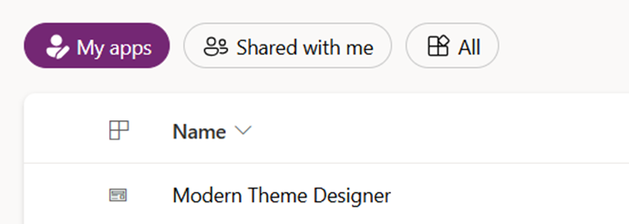
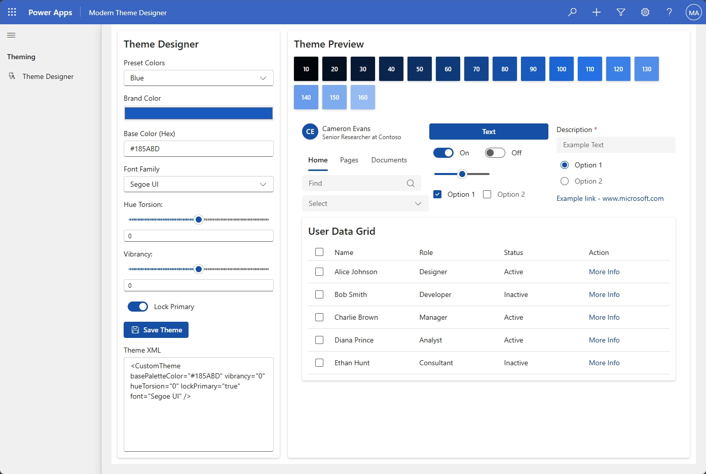
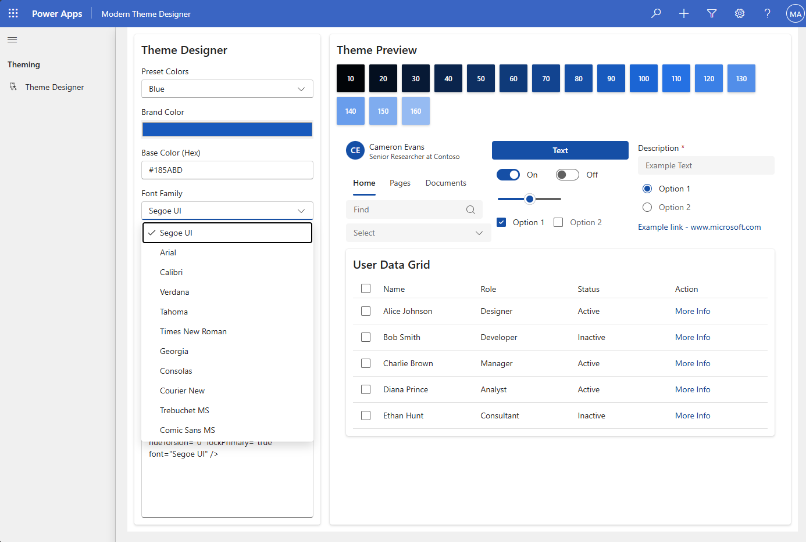
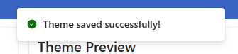
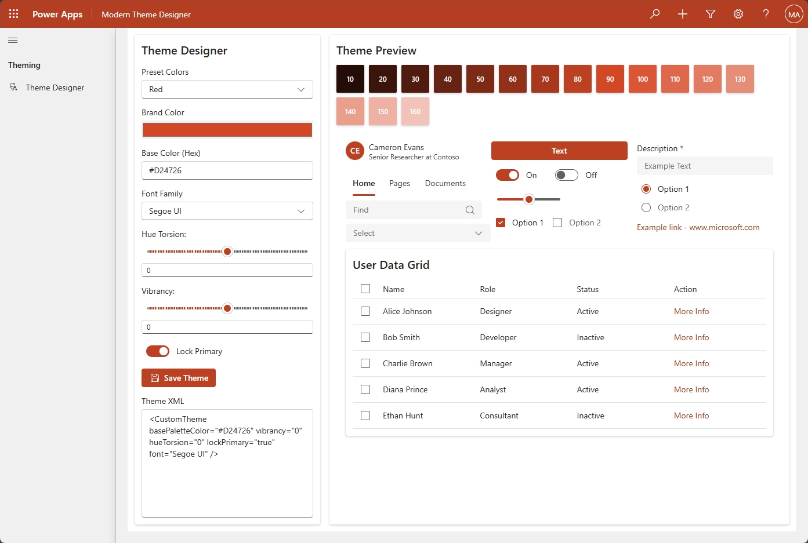

# Modern Theme Designer

A Power Apps solution to customize theme colors and fonts for model-driven apps.

## Installation
1. Download the latest solution (V2) from [ModernThemingDesigner_1_0_0_1_managed.zip](ModernThemingDesigner_1_0_0_1_managed.zip).

2. Import the downloaded `.zip` solution into your Power Platform environment.

3. After installation, locate the **Modern Theme Designer** app under Apps.

## Usage
1. Launch the **Modern Theme Designer** app.

2. Pick your preferred theme, brand color, base color, and font.

3. Click **Save Theme** to apply the custom theme to 
your organization.

4. Perform a hard refresh (`Ctrl + F5`) on any model-driven app to see the applied theme. You may need to refresh 2-3 times due to browser caching.

## Tips
- If the theme does not update, try clearing your browser cache or refreshing the app multiple times.

## Enjoy!