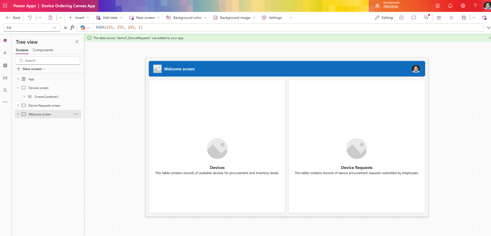
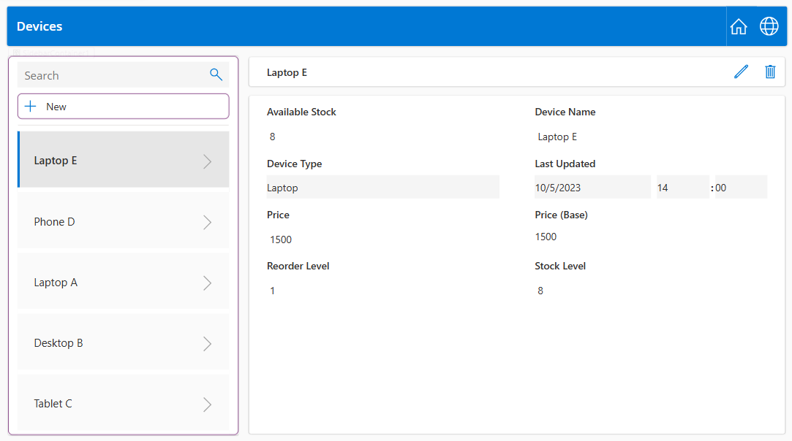
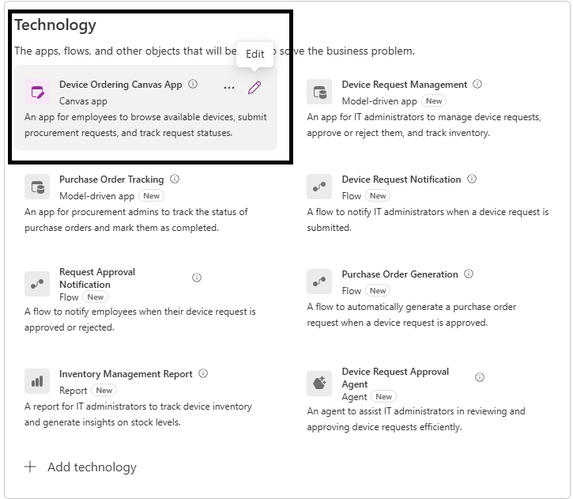

# Module: Create Canvas App for Device Ordering

## Overview
In this module, you will create the Device Ordering Canvas App proposed by the Plan Designer. This app enables employees to browse devices and submit procurement requests, fulfilling key user requirements for the Employee persona.

## Learning Objectives
By the end of this module, you will:
- Activate the proposed Canvas App artifact from the plan.
- Generate a responsive Power App using Copilot.
- Explore the welcome, devices, and device requests screens.
- Publish the Canvas App for use in later modules.

## Prerequisites
- Completion of prior Plan Designer steps through the Solutions Agent.
- Dataverse tables (Devices, Device Requests) saved via Data Agent.
- Plan Designer in Editing mode (not read-only).
- Access to <https://make.powerapps.com> in your development environment.

## Create Canvas App  

Now, let's begin creating the technologies proposed by the Plan Designer.  

💡 **Note:** If you do not see the **Create** option, ensure the designer is not in Read-only mode. Click the **Read-only** button and change the mode to **Editing**.  

  

Canvas App  

1. Start by selecting the **Device Ordering** Canvas App, then click the **+** icon to create a modern, responsive Canvas App. This app will allow end users to browse devices and submit device requests for procurement.  
  
Figure: Select the Device Ordering Canvas App to create a responsive app for employees.  

2. Copilot will generate a fully functional Power App connected to both the **Devices** and **Device Requests** tables. This aligns with the business requirements and process workflow designed for the **Employee** persona.  
  
Figure: Copilot generated Canvas app connected to Devices and Device Requests.  

3. Welcome screen  
The **Welcome screen** is ideal for the first screen of an app, where you can customize tiles such as an image, a title, and a description. You can change the number of tiles by adding or removing them in the main container. Use the tiles to navigate users to other parts of the app.  
  

4. User can click on **Devices** or **Device Requests** which would in turn navigate them to the respective screens.  
4. Hold the **Alt** key and click **Devices** to navigate to the Devices screen.  
  
The Devices screen will display data from the Devices table in a gallery format. Users can search for devices (browse devices), select a device, and view all its details in a connected form, as shown in the screenshot above.  
Full CRUD operations are supported for both the **Devices** and **Device Request** screens.

💡 **Note:** At this stage, the app is fully customizable for the app maker. It can be tailored to create pixel-perfect apps.

5. Publish the app from the ribbon.  
  

6. Once publishing is complete, close the browser tab.  

7. The plan interface shows the Device Ordering App as generated and allows maker to edit the App as needed.  
  

## Recommended Next Step
Proceed to the Copilot Agent module to create an autonomous agent supporting IT administrators.
