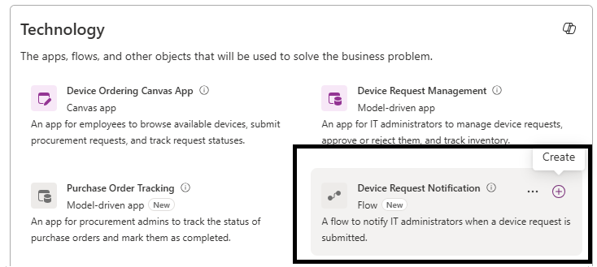
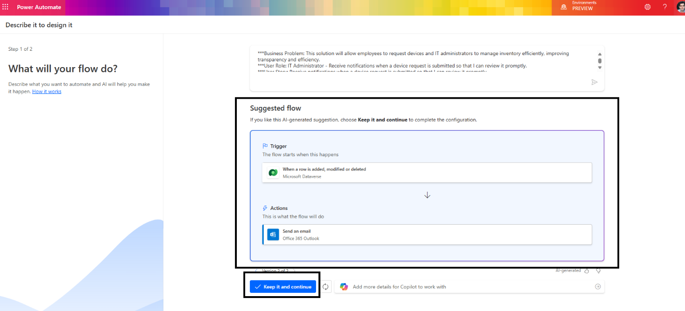
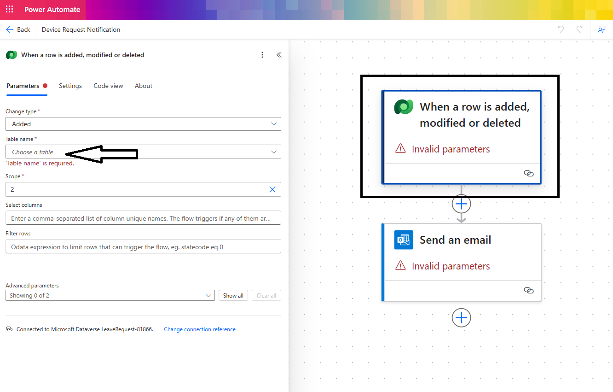
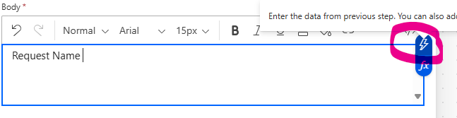

# Module: Create Cloud Flows for Device Request Notifications

## Overview
In this module, you will create a Power Automate cloud flow to notify IT administrators when new device requests are submitted. This automation supports timely review and action aligned to the defined business processes and user personas.

## Learning Objectives
By the end of this module, you will:
- Activate the cloud flow artifact from the plan.
- Generate a notification flow using Copilot-suggested patterns.
- Configure Dataverse triggers and email actions.
- Publish the flow for use in end-to-end testing.

## Prerequisites
- Completion of Model-driven App module.
- Dataverse tables (Device Requests) available and populated with sample data.
- Access to Power Automate via <https://make.powerapps.com> in your environment.
- Email account able to receive notification messages.

## Create cloud flows  

1. Next, let's create the device request notification flow  
  

2. Copilot will suggest flow patterns based upon the business problem stated. Here we have full flexibility to work with copilot to frame our automation needs. For this scenario, I will pick the suggested flow shown in image below and select **Keep it and continue**:  
  
If no suggestion was returned, add the following prompt to the flow generation:
    ```
    Be notified via email when a new device request is submitted to the Device Request Dataverse table so that I can take timely action.
    ``` 

3. Setup the suggested connections for the flow and click **Create**  
  

4. Select the flow trigger action and choose the **Device Request** table.  
  

5. Select the **Send an email** action and set the properties as follows:  
    - **To**: Use your own user account here.  
    - **Subject**: New Device Request Submitted.  
    - **Body**: Request Name.  

    This is the notification email that goes out to your IT admins whenever a new device order request is submitted.
      
    Figure: Configure the notification email action to notify IT admins on new requests.  

6. Now in Body – let's add dynamic content for Request Name  
  
  

7. Next step: **Publish** the flow  
  
Bug Note: If you receive an error on saving, create new Connection References for each connection.

8. Close the browser tab  

💡 Note: You can continue to create more artifacts using the technologies suggested by the Solutions Agent  

## Recommended Next Step
Proceed to the End-to-End Testing module to validate the integrated solution artifacts.
