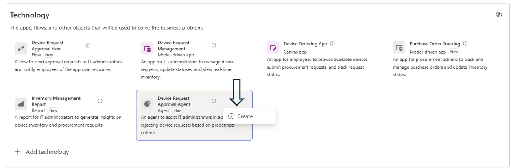
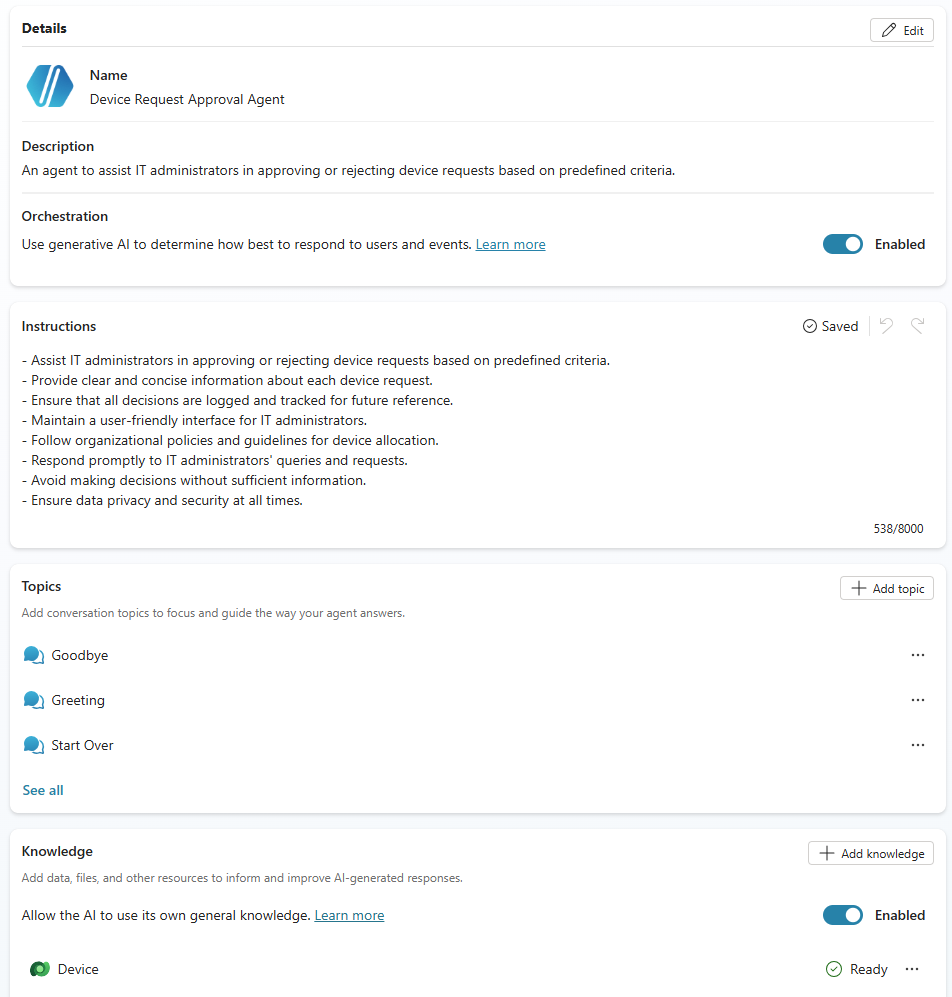
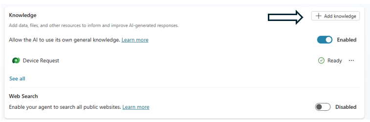
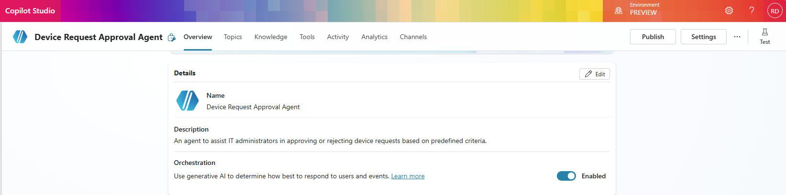

# Module: Create Copilot Agent for Device Requests

## Overview
In this module, you will create and configure a Copilot agent to assist IT administrators in managing device requests, approvals, and related data. The agent leverages Dataverse knowledge sources and autonomous instructions to streamline approval decisions.

## Learning Objectives
By the end of this module, you will:
- Activate the proposed agent artifact from the plan.
- Link Dataverse tables as knowledge sources.
- Test knowledge retrieval with sample prompts.
- Configure autonomous agent instructions for automated approval logic.
- Add a Dataverse trigger and update tool for record automation.

## Prerequisites
- Plan saved and technologies recommended (Solutions Agent complete).
- Dataverse tables (Device Requests, Device) available in environment.
- Access to Copilot Studio (trial activated if required).
- Ability to publish Copilot Studio Agents (inclusion in Copilot Studio authors security group in tenant settings)

## Create Copilot agent  

We will create a Copilot agent to offer IT administrators assistance for managing device data, requests, and approvals.  

1. Select **Device Request** and click **Create**.  
  
If you do not have a device approval agent, click the Copilot icon in the top right of the technology section and paste the following prompt into Copilot, then proceed with the creation step.  
Copilot prompt:  
    ```
    Add an agent to help administrators automatically approve device requests
    ```  
    When you click Create, the plan redirects you to Copilot Studio and initiates agent creation. Because this agent was created by the Plan Designer, it already has context about your business requirements and data.  
    💡 **Note:** If you don't have an applicable license, you can click **Start Free Trial** to use Copilot Studio.  This does not allow you to publish Agents, so ensure you have access to the Copilot Studio authors security group to publish.  
      

2. This will create an agent and lead us to the agent details screen  
  

3. The knowledge source **Device Request** table is already linked to the agent.  
We can add additional knowledge sources as needed. Click **Add knowledge** in the Overview section.  
  

4. Now select **Dataverse** as the knowledge source.  
  

5. Add the **Device** table to the knowledge source.  
Search for the table and then select it.  
Click **Next**, then click **Add**.  
  

6. Click on **Test** button on top right, if not already selected, and initiate a chat with the agent to validate the knowledge sources are operating correctly.  
  

7. Give the following prompt to the agent.  
    ```
    How many device requests are in pending state
    ```  
    💡 **Note:** As the agent processes the prompt, the activity map displays the knowledge sources used to generate the reply.  
      

8. Next test another prompt.  
    ```
    What is the cost of <DeviceName>
    ```  
    Copilot agent will refer to the Device knowledge resource and return an appropriate reply.  
      

9. Set up autonomous agent capabilities in this agent. Update the agent instructions with the following prompt:  
    ```
    - Goal: Assist IT administrators in automating the initial evaluation of device requests. - First: Before processing any approval, you must lookup the price of the requested device from knowledge sources in the device table based on the GUID provided in the device request. If you are unable to determine a device price, respond with a message that no device was found. - Second: If and only if the request price is under $500 as documented in the Device table, approve the request. This approval is only to be done in the same environment that triggered the request and only update the device request table status name to Approved, do not update any other columns besides the approval status which will have a prefix followed by an underscore _. it should look like cr324_requeststatus. Do not confuse request status with statuscode or statecode, statuscode and statecode should not be updated. 
    ```  

10. Add a trigger by clicking **Add trigger**.  
Select **When a row is added, modified or deleted from Dataverse**.  

Add the trigger name: *New Device Request*.  
Validate that the connections show a green check next to each listed connection, and then click **Next**.  
Set the following settings for the trigger, and then click **Create trigger**.  
Settings:  
    - Change type: Added  
    - Table name: `Device Requests`  
    - Scope: Organization  

11. Next we will give the Agent a tool to update the record in question. Click **Add tool**.  
    - Click on the Dataverse connector  
    - Select “Update a row in selected environment”  
    - Validate connection, and click “Add and configure”  
    - Configure the tool with the following settings and then click **"Save"**. Settings:  

        Details:  
        - Name: Update Status Approval  
        - Description: Update approval status based on instructions of agent 
        - Additional Details -> When this tool may be used -> Agent may use this tool at any time  
        - Additional Details -> Credentials to use -> Maker-provided credentials  

        Inputs:  
        - Environment: Custom value = (Current)  
        - Table Name: Device Requests (or similar)  

12. Finally, we will update settings for our agent, click on **Settings** in the top right-hand corner.  
    - Validate that the Agent's model is set to GPT-5 Auto (should be set automatically)  
    - Set content moderation to "Low" to ensure the agent doesn't cancel based on the user input.  
    - Set "Use general knowledge" to Off, to make sure the agent is making decisions based on knowledge from our Dataverse tables and not from public sources.  
    - Click **Save**. Then return to Agent Screen and publish the Agent.

## Recommended Next Step
Proceed to the Model-driven App module to build the administrative app for IT administrators.
