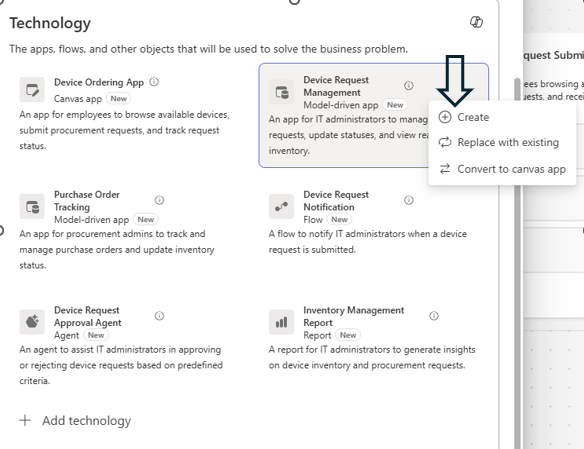
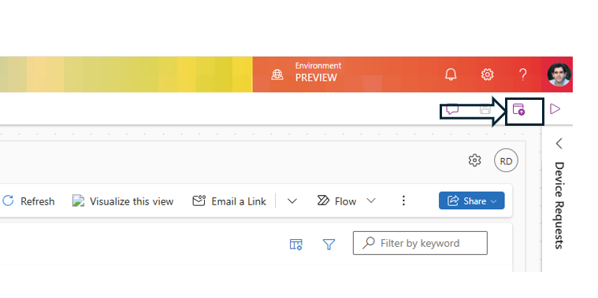
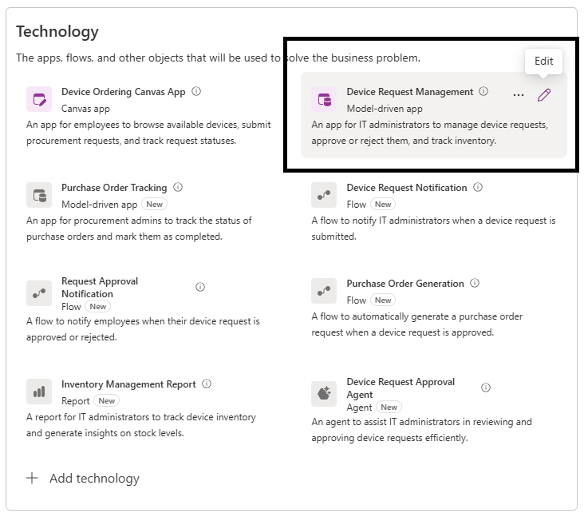

# Module: Create Model-driven App for Device Request Management

## Overview
In this module, you will create the Model-driven App recommended for the IT Administrator persona. This app provides administrative capabilities to view, approve, and manage device requests and device inventory. You will also integrate the previously created Copilot agent into the app via Agent Feed.

## Learning Objectives
By the end of this module, you will:
- Activate and generate the proposed Model-driven App.
- Review automatically generated pages aligned to requirements.
- Add the Copilot agent to the app via Agent Feed.
- Publish the app for use in testing and end-to-end scenarios.

## Prerequisites
- Completion of Copilot Agent module.
- Dataverse tables (Device Requests, Device) saved and available.
- Plan Designer recommendations saved through Solutions Agent.
- Access to <https://make.powerapps.com> with appropriate environment selected.

## Create Model-driven App  

The Device Request Management app for IT Admins is recommended as a Model-driven Power App.  

1. To create the Model-driven App, click **Create**. This will open a new tab and initiate the app creation process.  
This Model-driven App is designed for the **"IT Administrator"** user persona. It allows users to view and update device requests and monitor device inventory.  
💡 **Note:** You have full flexibility to choose the type of app you want to make available for your user personas. You can also convert app types and bring your existing apps to the forefront.  
  

2. The two generated pages align with the defined business requirements, processes, and user roles as shown in the image below  
  

3. Now we will add Agent Feed to the App  
In the left nav, click on the Agents button.  
Your created agent shows up under the "In your environment" section.  
Click on the ellipsis next to the agent and select **"Add to app"**.  
  

This agent is now part of the model driven app’s Agent Feed.  

4. Next, click **Publish this app**, and once published, close your browser tab.  
  

5. Back in the Plan Designer, you will note that both the **Canvas App** and the **Model-driven App** have been activated.  
  

## Recommended Next Step
Proceed to the Cloud Flows module to automate notifications and other processes supporting the solution.
