# Plan Designer  

## Prerequisites for hands-on lab  

Provide each user with a dedicated developer environment with an account.  

Open your browser in incognito/private mode.  

Use a modern browser such as **Microsoft Edge** or **Google Chrome** for best compatibility.  

1. Launch your preferred web browser.  
2. Open a new window in **Incognito mode** or **InPrivate** (private browsing mode).  
3. Go to <https://make.powerapps.com> and make sure to select the developer environment set up for your user account.  

💡 **Note:** This workshop makes extensive use of Generative AI capabilities. When using Generative AI, the generated content is likely to be different from user to user, or from the workshop documentation to the hands-on experience. When you encounter discrepancies, use your best judgment to complete the activity based on the intent of the task and what you see in the Plan Designer.  


## Business use case  

**Scenario:** Your organization currently manages device ordering via email and spreadsheets, which leads to delays, miscommunication, and inventory tracking issues. The IT team often receives incomplete or duplicate requests, and there is no central way to view or manage order statuses.  

**Simple business solution:** Create a centralized Device Ordering solution using Microsoft Power Platform, enabling:  

- Employees to browse available devices and submit requests.  
- IT admins to approve or reject requests.  
- Automated email notifications and order tracking.  
- Real-time visibility into device inventory and request status.  


## Step 1: Start with the Plan Designer  

1. Make sure you have opened <https://make.powerapps.com> and selected your development environment.  
  
Figure: Developer environment selection.  

2. The home screen contains the Plan Designer interface where you can describe your business problem using everyday words.  
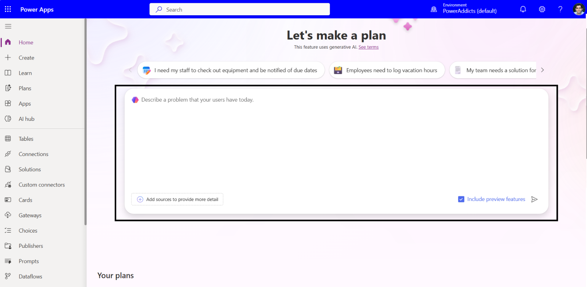  
Figure: Plan Designer home screen where you enter the business problem.  

3. Enter the following business problem statement in Plan Designer:  
    ```
    Create a centralized Device Ordering solution that allows employees to browse available devices and submit device procurement requests. IT administrators should be notified when a request is submitted and can approve or reject the requests. The solution should provide real-time visibility into device inventory and the status of submitted orders, improving efficiency and transparency across the organization.
    ```  
    Make sure to check the **Include preview features** checkbox and click **Submit/Go**.  
    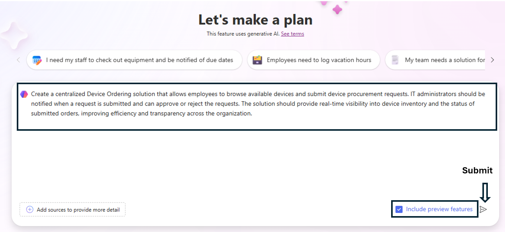  
    Figure: Enable preview features and submit the business problem to Plan Designer.

## Step 2: Requirements Agent  

The **Requirements Agent** analyzes the business problem stated and generates user requirements. It begins by defining user personas.  

For each identified role (user persona), it creates a bulleted list of tasks and responsibilities that users in that role must perform.  

In the below snapshot – Employee and IT Administrator are the two user personas identified based on the business problem stated.  

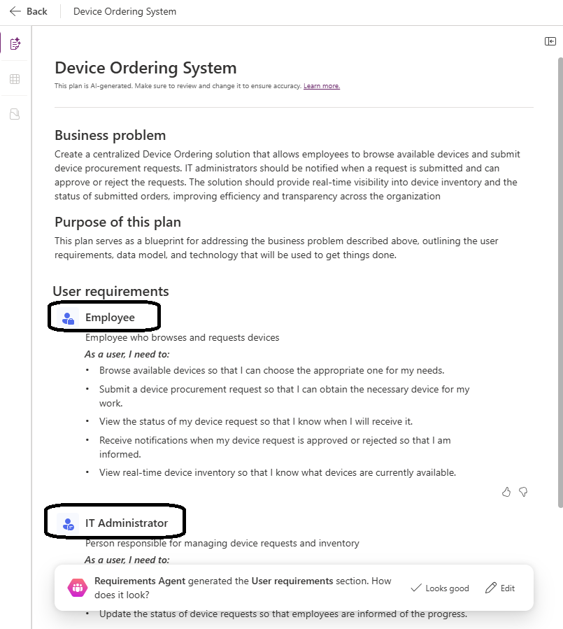  
Figure: Requirements Agent suggested personas (Employee, IT Administrator).  

💡 **Note:** The Plan Designer will soon be using AI models fine-tuned with real-world examples and customer success stories. No private or sensitive company data is used as part of the training process. The quality and completeness of the generated solutions depend on the specific requirements and process of the business problem. As a result, outcomes for a given requirement may vary. You must collaborate with the agent to tailor the plan to suit your organization's needs.  

1. Click **Edit**.  
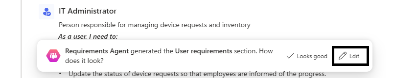  
Figure: Click **Edit** to modify the generated personas and requirements.  

2. Add a prompt to Copilot to modify the requirements and click the **Go** icon.  
      
    Figure: Use the Copilot pane to paste and run prompts to update requirements.  
    Copy and paste the following prompt in Copilot:  
    ```
    Add a new user persona called Procurement Admin.
    When a Device Request is approved, automatically generate a Purchase Order Request. The Procurement Admin should be able to:
    - View and track the status of each purchase order.
    - Mark the purchase order as completed once fulfilled.
    ```  
    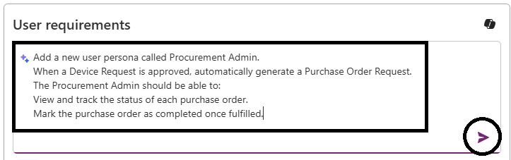  
    Figure: Example prompt to add a Procurement Admin and define purchase order behavior.

3. The **Procurement Admin** user persona is added to the plan as shown in the image below.  
Click **Keep**, then **Looks good** to save the updates.  
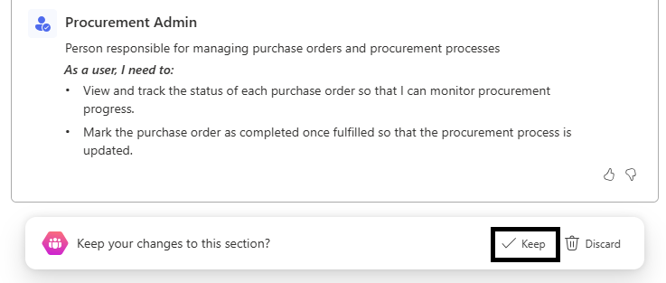  
Figure: Confirm added personas by clicking **Keep**.  


## Step 3: Process Agent in action  

The **Process Agent** helps define and break down the use case into various processes, outlining the workflow for business requirements.  

  
Figure: Process Agent overview showing generated business processes.  

The Process Agent uses AI to generate the process that users will follow. At a high level you see an overview of the processes that are part of the plan, and each process map can be viewed in greater detail.  

1. Click **View process** to open a particular process flowchart.  
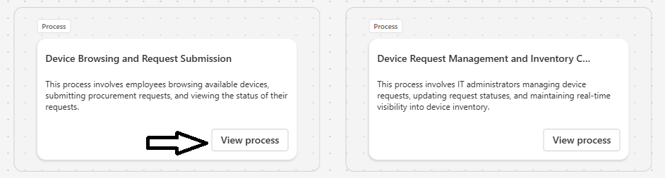  
Figure: Open a specific process flowchart to inspect the workflow.  
💡 **Note:** You can add, update, or delete nodes in the process flowchart, or use the Process Agent to reconfigure the workflow. When you make manual updates, the Process Agent must validate them to ensure a complete process flow is rendered.  
  
Figure: Manually edit flowchart nodes or use the Process Agent to reconfigure the workflow.  

2. Click the **Back** button to return from the selected flowchart view.  
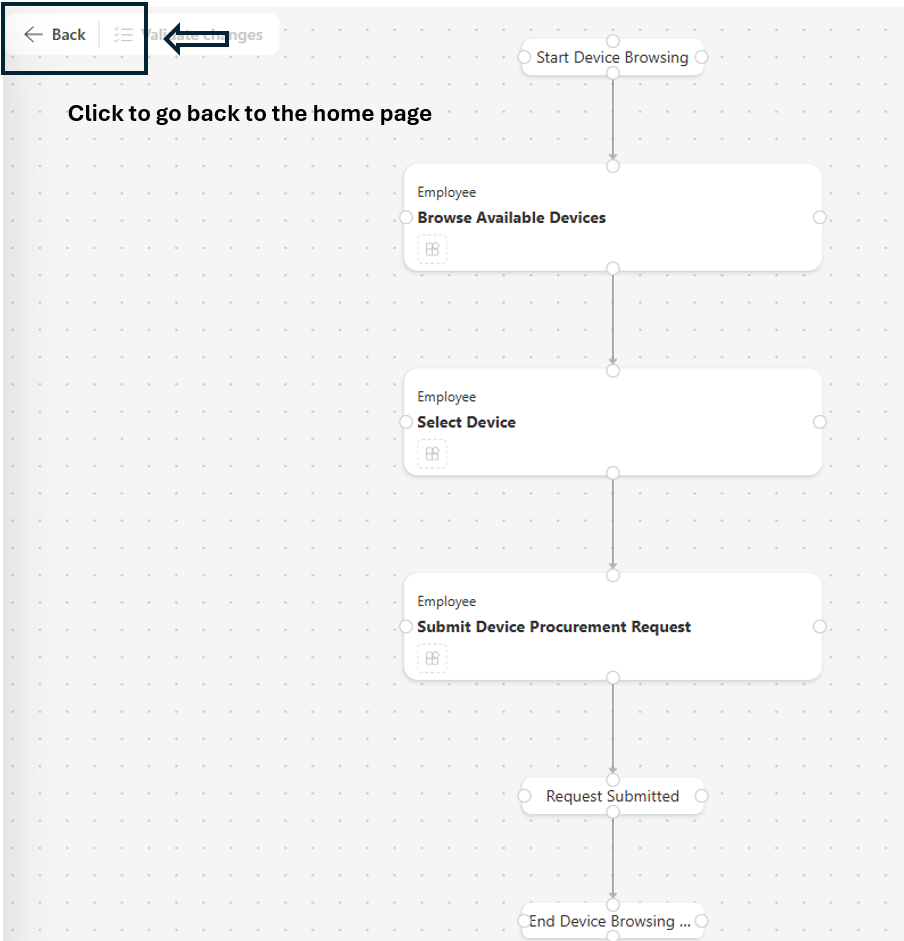  

3. You should still have the Process Agent dialog visible from the prior section. To continue building your plan, click **Looks good** to kick off the Data Agent.  
  

## Step 4: Data Agent  

Next, the **Data Agent** proposes a set of tables for storing business information. Each table includes suggested columns, data types, and relationships. Copilot also populates these tables with sample data.  

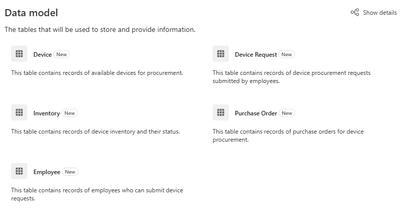  
Figure: Data Agent proposes tables, columns, relationships, and sample data.  

The Data Agent only recommends tables as part of the plan; you can choose to use existing tables in the environment instead.  

1. Click the ellipses on the Employee table and select **Replace with existing table**.  
💡 **Note:** If you do not have an Employee table recommended, skip this step and follow along. The User table will be added in a later step.  
  
Search for **user** or `systemuser` to locate the existing User table for the environment and select it.  
  
Figure: Search for the existing User table (`systemuser`) in your environment.  
Notice that the icon for the table turns green as an indicator that the artifact represented by the plan exists in the environment. Gray icons indicate proposed artifacts only. This is a visual construct used throughout the plan.  
  

2. Click **Show details** to view the table definitions and their relationships within the Data workspace. The Data workspace includes Copilot, allowing you to modify the data model using AI assistance or make changes manually.  
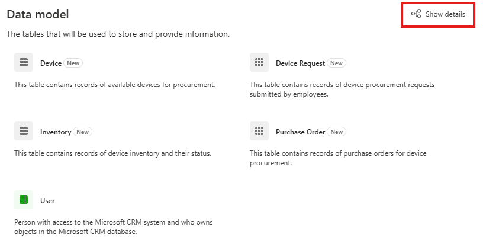  
  
Figure: Data workspace diagram and details view.  
💡 **Note:** The suggested data model is generated by AI, and its outcomes may vary. This may include differences in table names or number of tables or relationships.  

3. Here is the general outline of the next steps we will be performing – details for each step are in the document below:  
- Merge the Device and Inventory tables (assuming AI recommended both tables).  
- Add a relationship between the User table and Device Request.  
- Remove the Notifications table (if the AI recommended it).  
💡 **Note:** If you do not see the Copilot pane on the right-hand side of the data workspace, exit the Data workspace (by clicking on the back button and/or close the browser tab) and enter the Data workspace again (Click on Show Details from the Plan Designer and/or open the plan again and click on Show Details) to bring up the Copilot pane.  

4. In the Data workspace, give Copilot chat the following command (assuming AI recommended both tables):  
    ```
    Merge Inventory table with Device table
    ```
    💡 **Note:** Update commands based on the table names generated in your data workspace.  
    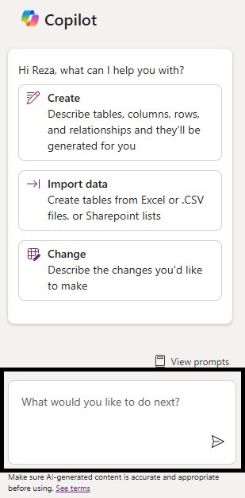  
    Figure: Copilot command input field.  
      
    Figure: Example Copilot commands — adapt to the table names in your workspace.  

5. If you did not have an employee table to replace earlier, add it now. *If you already have the User table represented in your Data workspace, skip this step.* Click **+ Existing table** to add the System User table.  
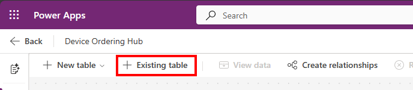  
Figure: Add the existing System User table from the environment.  
Search for **user** in the **Select tables** panel and make sure to select **All tables**.  
Select the table where Name is `systemuser` and click the **Add selected** button.  
**Note:** A table's display name can differ from its schema name. You may see multiple tables with the display name User. Ensure you select the table where the schema name is `systemuser`.  
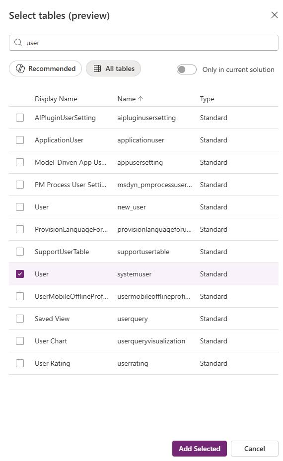  

6. Next, ask Copilot to create the lookup from Device Request to the existing User table:  
    Give the following Copilot command:  
    ```
    Add a direct one-to-many relationship between User and Device Request so that one user can have many requests, without using a join table.
    ```  
      
    Figure: Copilot command example to add a direct one-to-many relationship.  
    Alternatively, you can manually add a relationship between the User and Device Request table.

7. Select the Device Request table, go to the ellipses, and click **View data**. This will show existing sample data in the Device Request table.  
    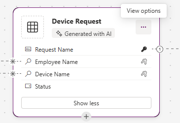  
    To improve sample data quality, we will use Copilot to update the sample data for us. Give this command in Copilot:  
    ```
    Update sample data in the Devices table to use actual device names, and update Device Requests with 20 sample records.
    ```  
    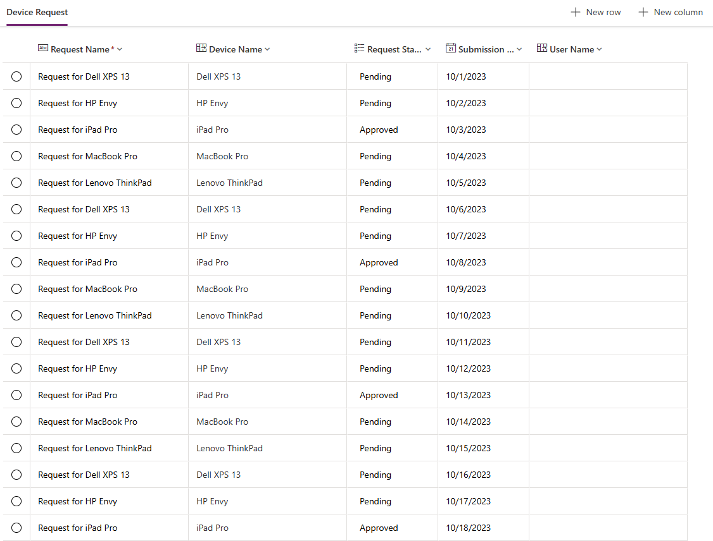  
    Figure: Copilot command example to improve sample data.  

8. After the above Updates - If you double click on the "User Name" table cell in "Device Request" table - the list of values will be showcased from the Users table. Select your user name as the requester for a few of the user requests.  
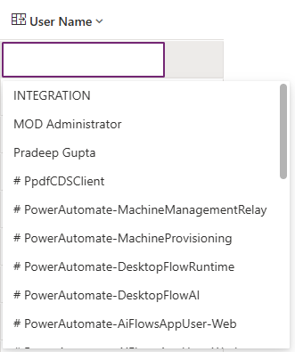  


9. Next – work with Copilot to clean up and remove any other tables. Often, a “Notification” table is recommended that should be removed.  
Once complete, your data model should look like below:  
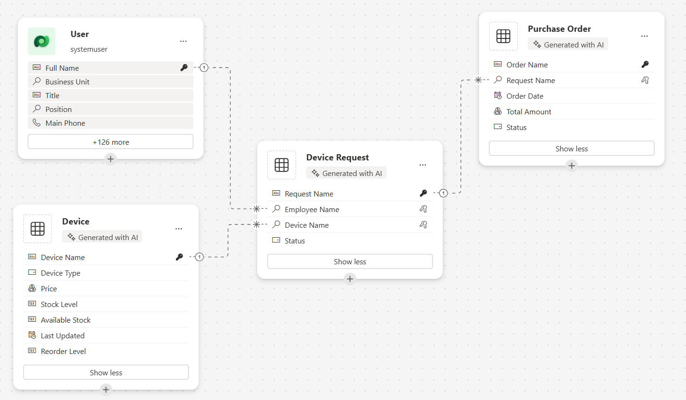  

10. Click the **Overview** button in the left menu to get back to the Plan Designer.  
  

11. Accept the Data Agent model — click **Looks good**.  This will save your plan to a new solution, or alternatively you can click **Change solution** to open the dialog to save in a Solution.  
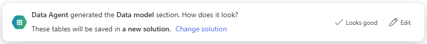  
At any time, we can also save our plan by clicking the **Save** icon.  
  
This opens the dialog to save in a Solution.  
💡 **Note:** Here you can also click **Advanced** to define a custom publisher or select an existing solution.  
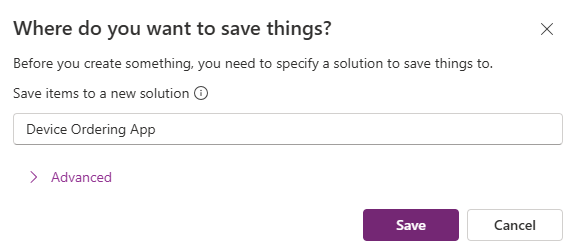  


## Step 5: Solutions Agent  

Next, the **Solutions Agent** will begin recommending the Technologies (Apps, flows and other objects) based on the business problem defined.  

Solution Agent will help you get started with different apps, flows and agents as required. You can also use an existing resource (app, flow etc.) or create a new one depending on your requirements.  

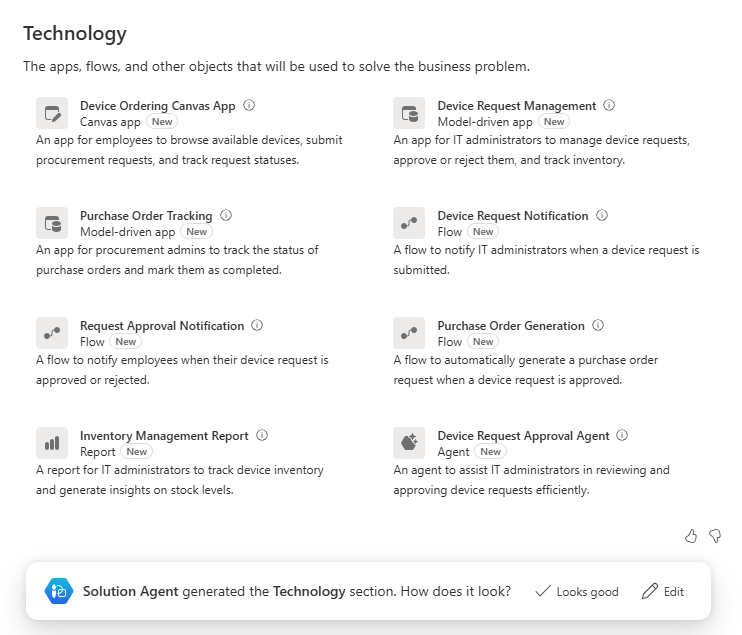  

Click **Looks good**.  

💡 **Note:** The Solutions Agent is simply recommending the technologies that you could use. You have the power to decide which technologies to create in your solution and make them available for your end users.  


Congratulations! 🥳  

You have successfully completed the Hands-On Lab Module 1!
