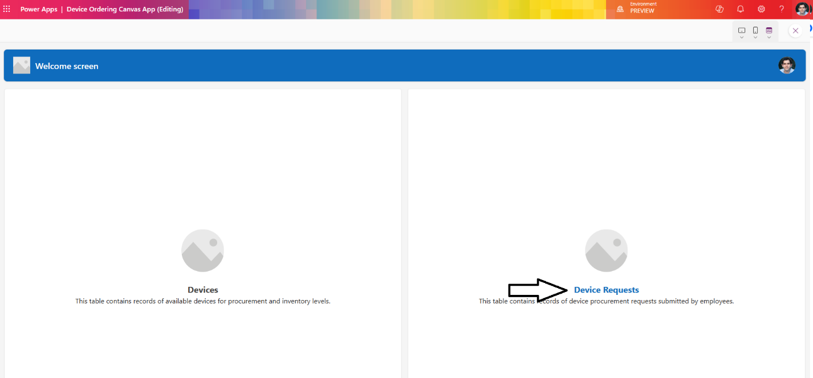
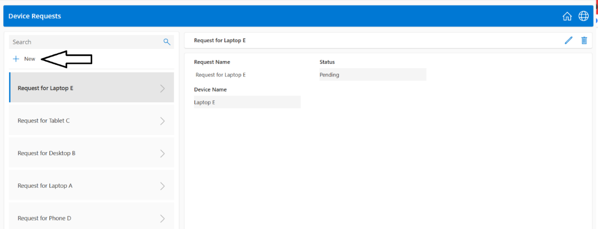
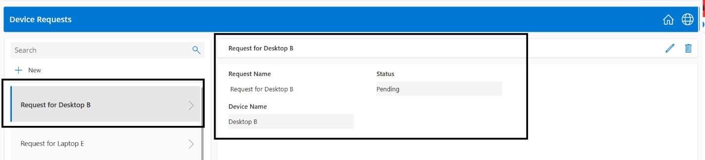
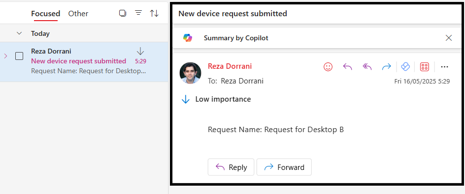
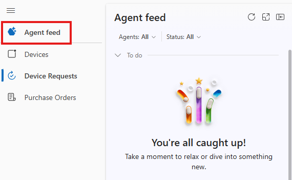
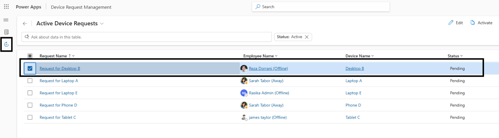
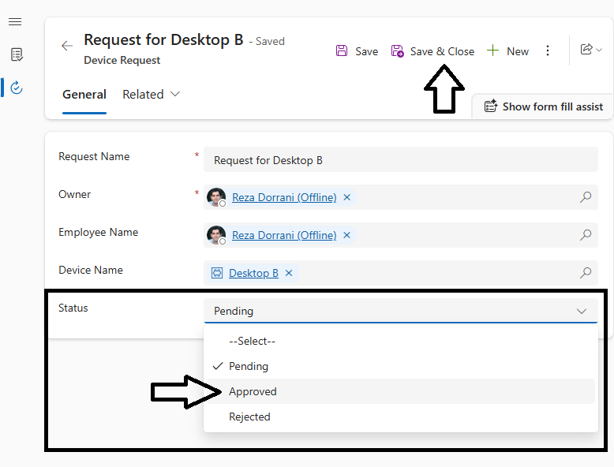
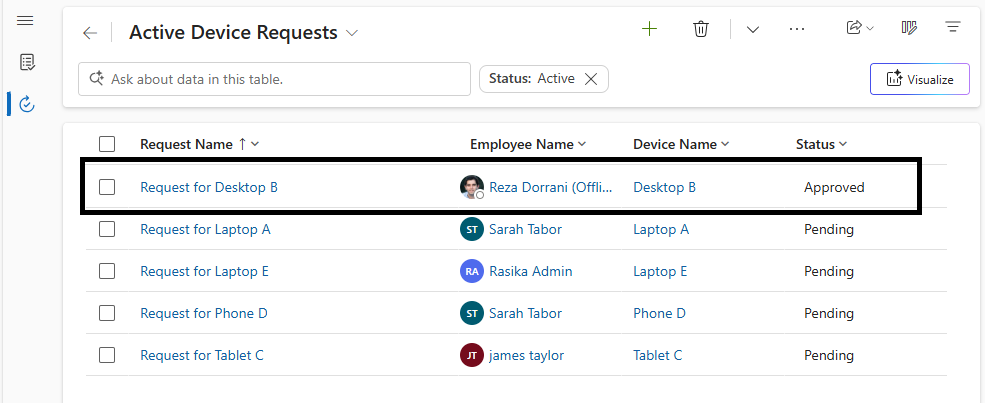
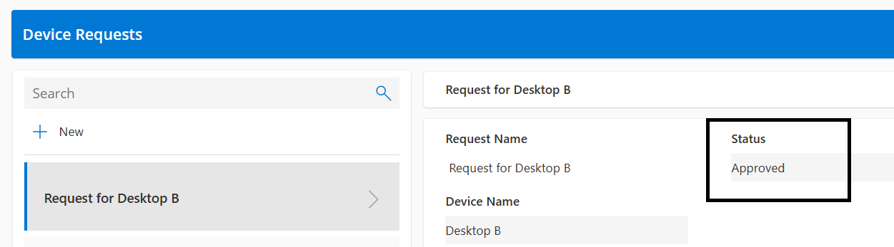

# Module: Test and Run the End-to-End Device Ordering Solution

## Overview
In this module, you will validate the integrated solution artifacts created in previous modules: Canvas App, Copilot Agent, Model-driven App, and Cloud Flow. You'll simulate an employee submitting a device request and observe administrative review and automation outcomes.

## Learning Objectives
By the end of this module, you will:
- Execute an end-to-end (E2E) scenario for device ordering.
- Validate notification flow execution.
- Observe automated or manual approval using the Model-driven App and Agent Feed.
- Confirm data consistency across apps.

## Prerequisites
- Completion of prior build modules (Canvas App, Copilot Agent, Model-driven App, Cloud Flows).
- Published Canvas App and Model-driven App.
- Published notification cloud flow.
- Sample data in Devices and Device Requests tables.
- User personas available (Employee, IT Administrator, Procurement Admin if added).

## Step 11: Test and run the end-to-end solution  

Now, let's test the solution end-to-end (E2E).  

1. The employee launches the **Device Ordering** app and clicks **Device Requests**.  
  

2. The employee clicks **New** to create a new device request.  
  

3. The form will allow the user to post a new device request.  
  

4. The employee enters the required data in the form and clicks the submit icon.  
  

5. The request is submitted. The gallery displays the selected request, and the form shows the submitted data for that request.  
  

6. As part of the process, the IT Administrator is notified about the newly submitted request. This notification is triggered by the flow created in the previous steps.  
  

7. The IT administrator can then use the model-driven app to view, approve, or reject the device request.  
Sign in to the model-driven app and open Agent Feed by clicking the **Agent Feed** icon on the left. Depending on the device submitted and its price, the agent may have already approved the request for the administrator.  
  
The **Device Requests** page will show all the submitted device requests. The newly requested device entry will be listed. IT admin can select the device request to act.  

8. Upon selection of a device request, the IT admin will be redirected to a form where they can update the Status (Approval decision)  
  
IT admin sets the Status and Saves their response.  
  

9. The response update will be reflected in both the Apps (IT admin and employee)  
  
  

## Completion

Congratulations! 🥳  

You have successfully completed the Hands-On Lab Module: End-to-End Testing!

## Next Steps
- Extend automation with additional flows (e.g., procurement order creation).
- Add dashboards or reports for inventory and request analytics.
- Proceed to subsequent workshop modules as defined in the curriculum.
