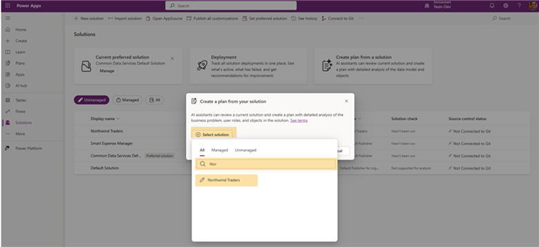
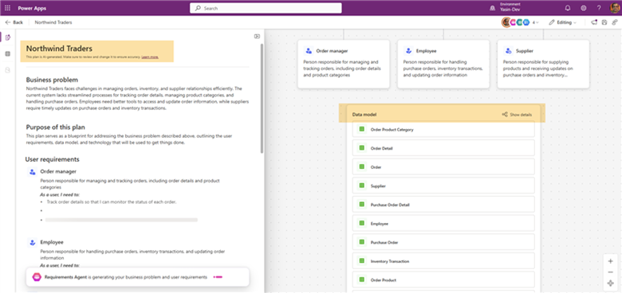
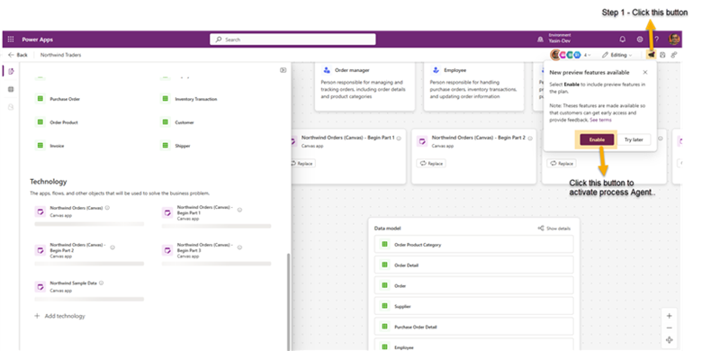
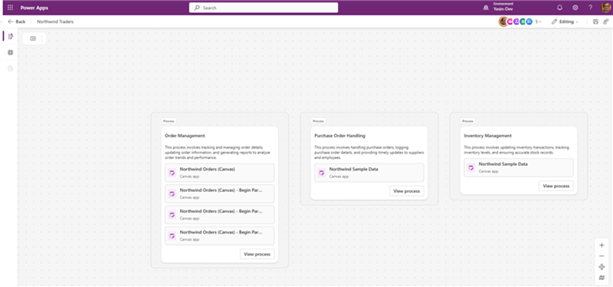
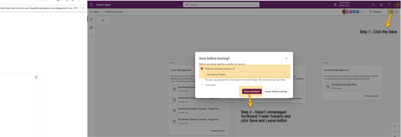
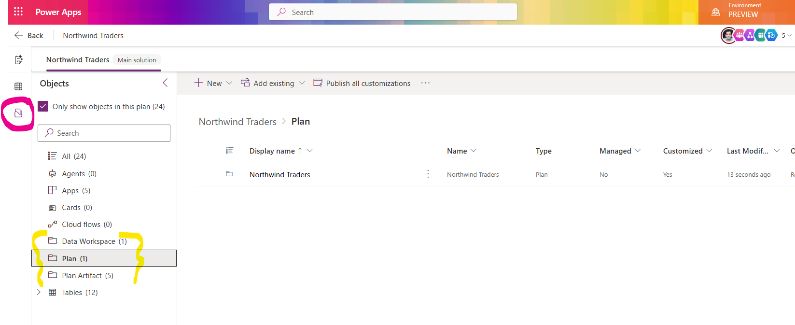

# Plan from Solution

## Business use case

**Scenario:** Your organization has an existing Northwind Traders solution that manages various business processes including orders, inventory, and customer relationships. However, the solution lacks proper documentation and understanding of its business requirements, data model, and processes.

**Simple business solution:** Use Plan Designer to create a comprehensive plan from your existing Northwind Traders solution, enabling:

- Clear documentation of business requirements and user roles
- Detailed data model visualization
- Process flow documentation
- Better understanding of solution components and their relationships

This feature saves time when you're trying to understand a solution's content and helps makers improve an existing solution.

## Prerequisites

Each participant needs access to a dedicated Power Apps developer environment with the NorthwindTraders_1_0_0_10 solution file imported.

### Accounts and permissions
1. Microsoft 365 account with access to Power Apps.
2. Power Apps Developer Plan (or equivalent) that allows solution creation and Plan Designer usage.
3. Permissions to create and edit solutions and plans in the selected environment.

### Browser setup
1. Launch a modern browser such as **Microsoft Edge** or **Google Chrome**.
2. Open a new **Incognito** / **InPrivate** window (private browsing mode).
3. Go to <https://make.powerapps.com> and select your developer environment.

💡 **Note:** This workshop uses Generative AI. Generated content will differ between users and from screenshots. When something looks different, use the task intent and what you see in Plan Designer to proceed.

## Step 1: Navigate to Solutions and create a plan

1. Make sure you have opened <https://make.powerapps.com> and selected your development environment.
2. Navigate to **Solutions** from the left navigation pane.
3. Click **Create plan from a solution** as shown below.

  
Figure: Create Plan from a Solution highlighted on the Solutions page.

## Step 2: Select the Northwind Traders solution

1. Search for or select the **Northwind Traders** solution from the list of available solutions.

  
Figure: Selecting the Northwind Traders solution.

## Step 3: Create the plan

1. Click the **Create plan** button to start the plan generation process.

  
Figure: Create Plan button in solution details.

## Step 4: Generate the plan

1. Wait while Plan Designer analyzes the solution and generates requirements, data model, and related components.
2. Continue once all sections (requirements, data model, processes) finish loading.

  
Figure: Plan generation in progress.

## Step 5: Enable Process Agent (optional)

1. If available, click the **Enable** button to activate the Process Agent for additional process documentation.

  
Figure: Enabling Process Agent to add process flow documentation.

## Step 6: Review generated processes

If you enabled the Process Agent in Step 5, processes like Order Management, Purchase Order Handling, or Inventory Management will be added to your plan.

1. Click **View process** to see the process diagram.
2. Click **Back** to return to the plan designer screen.

  
Figure: Generated business processes with viewing options.

## Step 7: Save the plan to your solution

1. Click **Save** to add the generated plan to the Northwind Traders solution.

  
Figure: Saving the plan to the Northwind Traders solution.

💡 **Note:** If you selected a managed solution to generate a plan, create a new (unmanaged) solution to save the plan. We recommend generating plans from an unmanaged solution.

## Step 8: View the saved plan in solution artifacts

Confirm the plan appears with other artifacts in the Northwind Traders solution.

1. Click the **Objects explorer** icon in the control pane to view solution artifacts.

  
Figure: Plan listed among solution artifacts.

## Known limitations

💡 **Known limitations when creating a plan from an existing solution**

- A solution must include at least one app and one associated Dataverse table.
- The plan currently recognizes only apps and tables; flows, sites, and agents are out of scope.
- Publish the apps first, then publish the solution before generating a plan.
- Do not create a plan from a default solution.

🥳 **Congratulations** — You have completed this module!

## Additional resources

- [Create a plan for your solution using Plan Designer (Microsoft Learn)](https://learn.microsoft.com/power-apps/maker/plan-designer/create-plan-from-solution) – Official reference with extended scenarios and troubleshooting guidance.
