# Module 7: Workflows

<!-- PDF refresh trigger: 2026-07-26 -->

## Overview

In [Module 3: Workflows](../automations-foundation/03-workflow.md) you built **Validate Returns** — an *agent flow* that a Copilot Studio agent calls as a tool, mid-conversation, to get a grounded answer back. That workflow waited to be asked. In this module you build the opposite kind of automation: a **workflow that starts on its own**, from a **trigger**, and runs to completion with no one watching — and, at the step that needs judgment, hands work to an **agent** instead of a fixed action.

You build one **Order Management Workflow** that watches an inbox, classifies each incoming order-desk email into one of four categories, and takes a different action per category: archive junk, draft-and-approve a customer reply, reason over a supplier delay and log a restock task, or hand a quote request to a specialist agent.

One concept is worth naming up front, because it changes how you design automations:

- A **deterministic action** (send an email, update a row, move a message) does exactly the same thing every run. Use it when the step must always behave identically.
- An **agent node** is a *non-deterministic* step: you give it a goal in plain language and a set of tools, and it reasons over the run's real data to decide *how* to reach the goal. Use it when a step needs judgment — assessing the impact of a delay, composing a grounded reply — that you can't capture in fixed branches.

The skill of this lab is knowing which to reach for, and wiring the two together so the automation stays reliable where it must and flexible where it helps.

## Learning objectives

By the end of this module, you will:

- Create an autonomous **workflow** in Copilot Studio triggered by an event — a new email arriving.
- Route work with the **Classify** action, using AI to sort inputs into named categories.
- Draft grounded text with the **M365 Copilot** action and gate it behind a **Human review** approval.
- Embed a non-deterministic **agent node**, give it goal-oriented instructions, and pass it run data with **dynamic content**.
- Equip an inline agent with the **Microsoft Dataverse MCP Server** so it can read business data and create records.
- Return **structured output** from an agent and act on it downstream.
- **Publish, run, and monitor** a workflow end-to-end, and call a separate **published agent** from a workflow branch.

## Prerequisites

This lab builds on the foundation series but the workflow itself stands alone — you build every node yourself. You need:

- A **Power Platform environment** where you have Dataverse security role **System Customizer** or **System Administrator**, so you can read and write table data.

- A **Microsoft Copilot Studio license or trial** in an environment where the **workflow authoring experience** is available. No license yet? Go to <https://copilotstudio.microsoft.com>, sign in with your work or school account, and choose the free trial when prompted.

    🔧 **Setup check:** This lab uses the new Copilot Studio **authoring experience**. Some labels may differ slightly as the experience evolves — if a control is named differently from these steps, look for the closest match.

    🔧 **Setup check:** Select the environment picker in the bottom-left corner (in the new Copilot Studio authoring experience) and confirm you are in the development environment you intend to use — not the **default** environment. Every step in this lab assumes the same environment.


- The **Northwind Traders** solution imported **and seeded with sample data** — this provides the **Order Product** (the product catalog), **Customer**, and **Supplier** tables used throughout. Follow the import and **Northwind Sample Data** steps in [solutions/README.md](../../solutions/README.md).
- A work or school **Outlook** mailbox on the **same account**, used both as the order desk that receives test emails and as the approver who signs off in Step 4.
- Access to the **Microsoft Dataverse MCP Server** in your environment (used in Steps 5–6).

    🔧 **Setup check:** The Dataverse MCP Server is a preview capability. If it does not appear when you add tools to an agent, ask your admin to confirm MCP servers are enabled for the environment.

- Basic familiarity with the Copilot Studio designer. If you have not used the **Classify**, **M365 Copilot**, or **Human review** actions before, complete [Module 3: Workflows](../automations-foundation/03-workflow.md) first — this lab uses the same actions in an autonomous setting.

|  |
| --- |
| **Important** Use the **same work account** for Copilot Studio, Outlook, Dataverse, and every connection you create in this lab. Triggers, agents, and tools must share one identity to see and update the expected data — a mismatched connection is the most common cause of a workflow that publishes but never runs. |

## Business use case

**Scenario:** Northwind Traders' order desk receives a steady stream of email — customer questions, supplier notices, quote requests, and outright spam. Sorting and handling each one by hand is slow, and the interesting work (judging a supplier delay, pricing a quote) gets buried under triage.

**Solution:** An **Order Management Workflow** triggers on every incoming order-desk email, classifies it, and routes it: junk is archived, a customer inquiry is answered by an AI draft that a person approves, a supplier delay is analyzed by an agent that logs a restock task, and a quote request is handed to a reusable quoting agent. Deterministic branches decide *what* happens; agents handle the steps that need reasoning.

This lab uses the public **Northwind Traders** sample data — its **Order Product** catalog (with list prices and reorder levels), **Customer**, and **Supplier** tables — as the business data the workflow and its agents ground on.

## Names used in this lab

Create and rename components with the names below. Later steps and dynamic-content pickers refer to them, so using them exactly keeps your screen matching the instructions.

| Component | Name |
| --- | --- |
| Workflow | Order Management Workflow |
| Classify categories | Quote Request · Supplier Delay · Customer Inquiry · Other |
| Supplier Delay agent | Inventory Task Agent |
| Quote Request agent | Price Quote Agent |

## Step 1: Create the workflow and its email trigger

The workflow starts when an order-desk email arrives. You scope it to order emails with a subject filter so it ignores everything else.

1. Go to <https://copilotstudio.preview.microsoft.com/>.

    🔧 **Setup check:** Confirm the environment picker at the bottom left corner of the page shows your development environment with the Northwind Traders solution. If the browser redirects to a URL that contains the pattern `/environments/Default-XYZ/home` and the page fails to load, copy the environment ID from the Power Platform Admin Center, and replace the URL in the browser with `/environments/<DevelopmentEnvironmentID>/home`. Navigate to Copilot Studio with the URL containing the ID of your development environment. Make sure that the URL contains the corresponding environment ID in place of the placeholder `<DevelopmentEnvironmentID>`.

2. In the left navigation, select **Workflows**, then **New workflow**. The designer opens directly.

    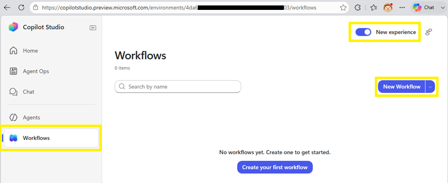     
    Figure: The **Workflows** section in the new authoring experience of Copilot Studio.

3. Rename the workflow. Select the title **Untitled workflow** and enter:

    ```
    Order Management Workflow
    ```
    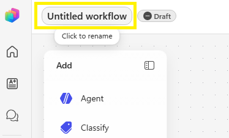    
    Figure: Selecting the workflow **Untitled workflow**.

    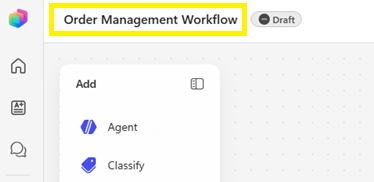     
    Figure: Replacing the workflow default name from **Untitled workflow** to **Order Management Workflow**.

4. Select the **⚡Start** node in the workflow editing canvas, and choose **Connector** in the right pane as **Trigger type**. Select trigger **When a new email arrives** (Office 365 Outlook, not Outlook.com), create the connection with your lab account if prompted, and complete the sign-in process.

    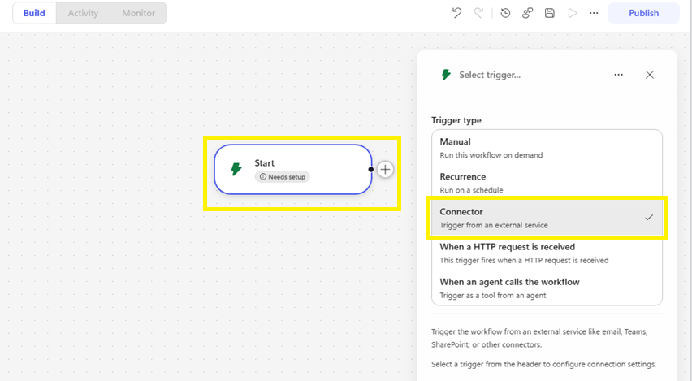    
    Figure: Changing the workflow start node type from **Manual** to **Connector**.  

    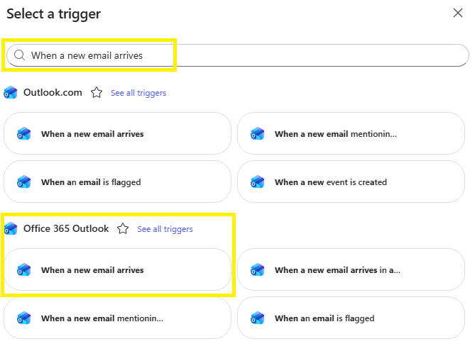     
    Figure: Selecting trigger **When a new email arrives**.  

    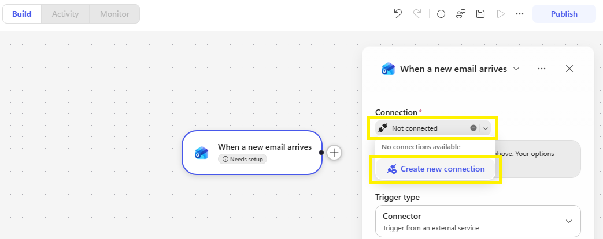    
    Figure: Creating a connection for the workflow trigger.  

    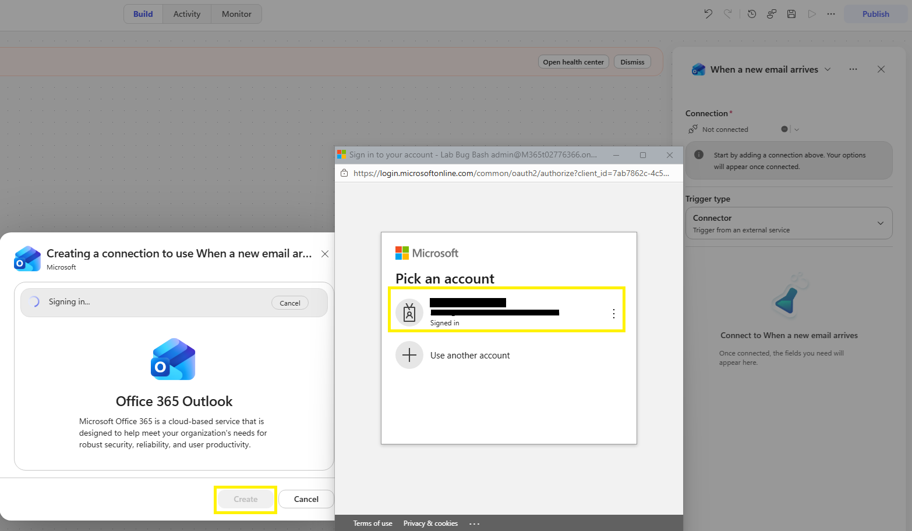       
    Figure: Connecting with the lab user.

5. On the trigger, add the **Subject Filter** to the parameters by selecting it from the **Advanced parameters** menu, and then set the subject filter value so the workflow only fires for order-desk mail. Select the expression symbol **</>** (**Switch to expression mode**) and enter:

    ```
    Order Management
    ```

    ⚠️ **Warning:** Every test email in this lab **must include "Order Management" in the subject line**, or the trigger will not fire. This is the most common reason a test "does nothing."

    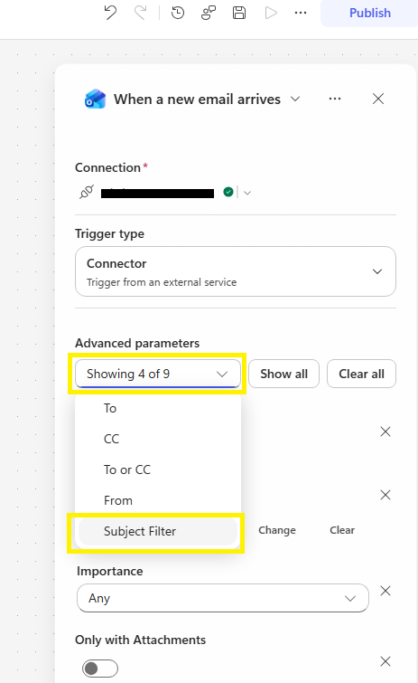     
    Figure: Adding the **Subject Filter** to the **Advanced parameters** of the workflow trigger.     

    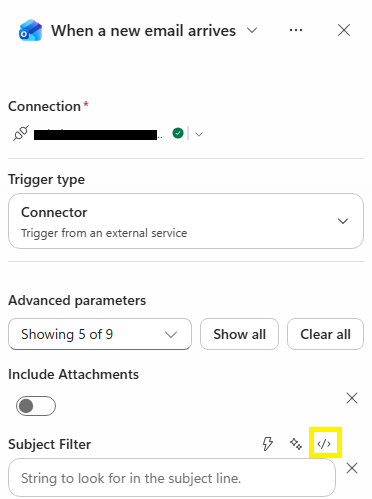       
    Figure: Selecting the **</>** icon to switch the filter to expression mode.

    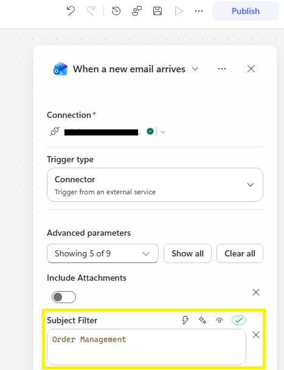      
    Figure: Entering the filter value `Order Management` as a **Subject Filter**.

6. Select the **💾Save** button at the upper ribbon to the left of the Publish button.

✅ **Checkpoint:** Your workflow is named **Order Management Workflow** and has a single trigger, **When a new email arrives**, filtered to subjects containing "Order Management."

## Step 2: Classify incoming emails into four categories

Rather than write brittle keyword rules, you let the **Classify** action read each email and sort it.

1. Hover with your mouse over the right end of the trigger node, select the appearing **+** button to add a step, add a **Classify** action, and establish a connection. Leave the model as the default and create the connection if prompted.

    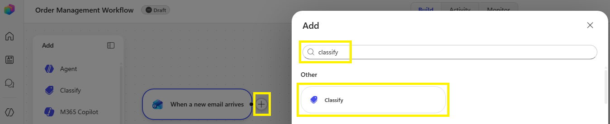     
    Figure: Adding **Classify** to the workflow as the next action step.     

    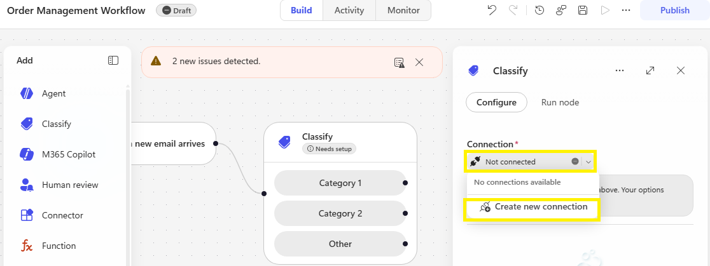      
    Figure: Establishing a connection for the **Classify** step.
    
    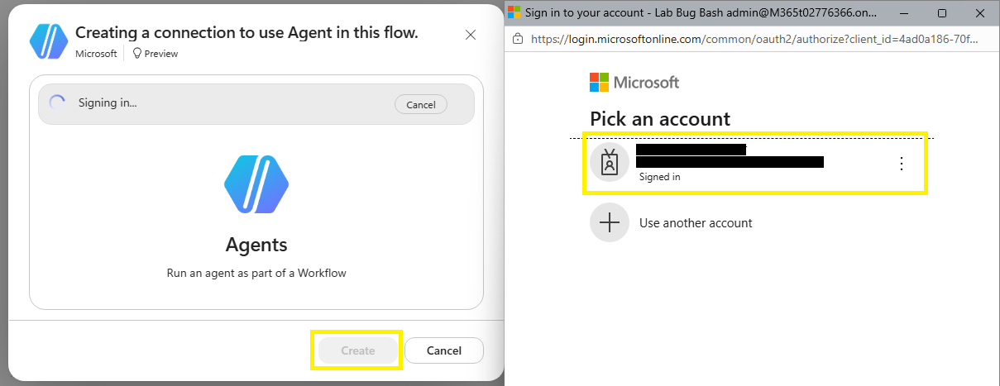        
    Figure: Connecting with the lab user.

2. For the value to classify, insert the trigger's **Body** dynamic content (the body of the incoming message).

    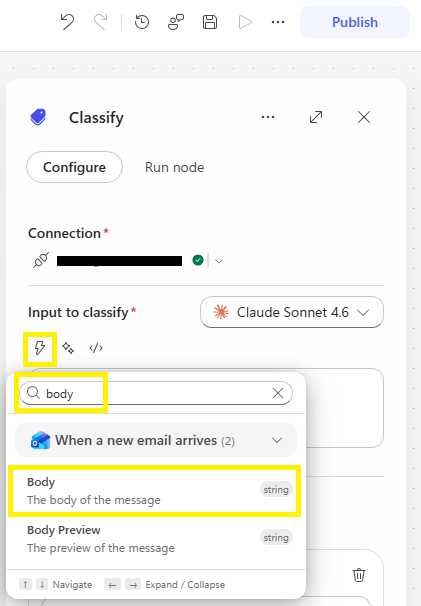       
    Figure: The Classify action added to the workflow, and a connection is established.

    💡 **Tip:** If the LLM model visible in the screenshot above (i.e. `Claude Sonnet 4.6`) is not available in your development environment, use one of the models available to you from the dropdown menu.

3. Add the three missing categories and name them exactly, with a short description the model uses to route. To rename a category, simply click its title. The built-in **Other** category is already available and does not need to be added.

    - **Quote Request** — the sender asks for pricing or a quote for products.
    - **Supplier Delay** — a supplier warns that a shipment is delayed.
    - **Customer Inquiry** — a general question about orders, products, or shipping.
    - **Other** (built in).

    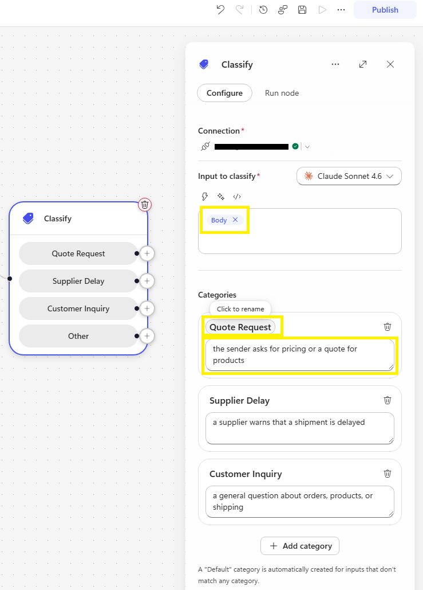         
    Figure: The Classify action configured with the four order-desk categories.

    💡 **Tip:** Add two or three example phrasings per category to improve accuracy — for example, a Quote Request as both *"Can you send pricing for 500 units?"* and *"We'd like a formal quotation for the attached spec."* Use the Classify action's **Test** tab to try edge cases and refine the descriptions.

4. Select the **💾Save** button at the upper ribbon to the left of the Publish button.

✅ **Checkpoint:** The **Classify** action produces four outgoing branches: **Quote Request**, **Supplier Delay**, **Customer Inquiry**, and **Other**.

## Step 3: Handle the "Other" path and test end-to-end

You wire up the simplest branch first — junk goes to Archive — then publish and confirm a real email flows through.

1. On the **Other** branch, add action **Move email** from the **Office 365 Outlook** connector. For the **Message Id** parameter, select the field and choose the trigger's **Message Id** from the dynamic content list (the value under the **When a new email arrives** trigger) — not a literal value. Set the destination to **Archive**: double-click the folder name **Archive** so that it gets set as destination. A single click expands/collapses mailbox subfolders.

    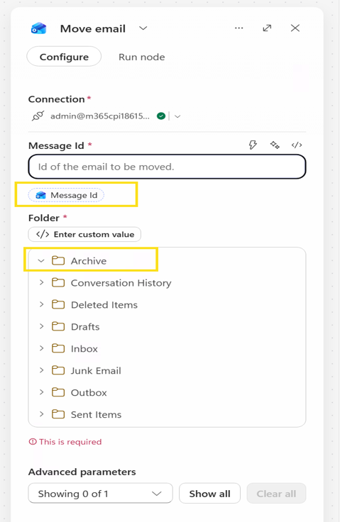
    Figure: Pick **Message Id** from the dynamic content list (not a typed value), then set the destination folder to **Archive**.

    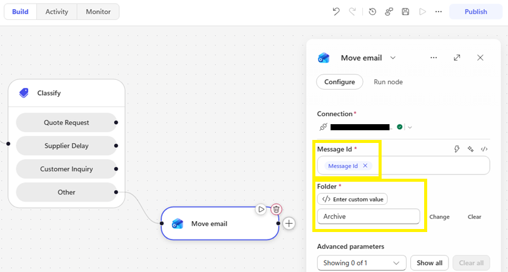    
    Figure: The "Other" branch moving the incoming message to the Archive folder.

2. Select **💾Save**, then **Publish** from the upper ribbon.

    > **Important:** The trigger is only live **after** you publish, and later changes take effect only when you **re-publish**. If a test "doesn't run," check that the workflow is Published, not Draft.

3. Open **Outlook** (<https://outlook.office.com>) and send an email **to your own lab account**:

    - **Subject:**

        ```
        Order Management - Congratulations! Your order desk has been selected
        ```

    - **Body:**

        ```
        Dear Order Manager,

        Congratulations! Your order management team has been selected in our
        monthly business draw and is entitled to claim an exclusive cash reward.
        To release it, reply with your full name and contact details; a small
        processing fee may apply. Act soon, as unclaimed rewards expire.

        Regards,
        Promotions Team
        MegaDraw Rewards
        ```

    This spam email should classify as **Other**.

4. Wait a few seconds, then check your **Archive** folder — the test email should have been moved there automatically.

    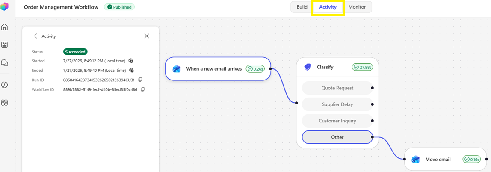   
    Figure: The test email moved to the Archive folder, confirming the "Other" path.

    💡 **Tip:** If nothing happens, open the workflow's **Activity** panel to see whether a run started. No run usually means the workflow is still Draft, or the subject was missing "Order Management."

✅ **Checkpoint:** A real email triggers the workflow, is classified **Other**, and lands in Archive — your trigger, classifier, and publish pipeline all work.

## Step 4: Answer a customer inquiry with M365 Copilot and human approval

For customer questions, an AI draft is a starting point, not the final word. You generate a reply with **M365 Copilot**, pause for a person to approve it, and only then send it — the human-in-the-loop pattern from Module 3, now inside an autonomous run.

1. On the **Customer Inquiry** branch of the **Classify** step, add an **M365 Copilot** action. Create its connection if prompted. In the **Message**, instruct it to draft the reply, grounding on the email body containing the customer's question:

    ```
    Read the customer's question below and draft a complete, ready-to-send reply.
    Answer clearly if you can; if you cannot, write a brief, polite holding
    response without inventing any product facts. Address it "Dear Customer," and
    sign off as "Northwind Traders Order Management".

    Customer question: [insert the trigger Body dynamic content here]
    ```

    Replace the bracketed text with the trigger's **Body** dynamic content.

    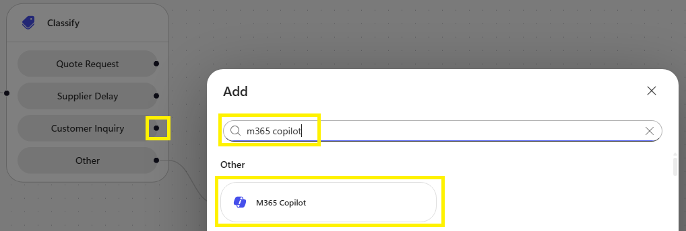   
    Figure: Adding step **M365 Copilot** as the next action step for classification **Customer Inquiry**.

    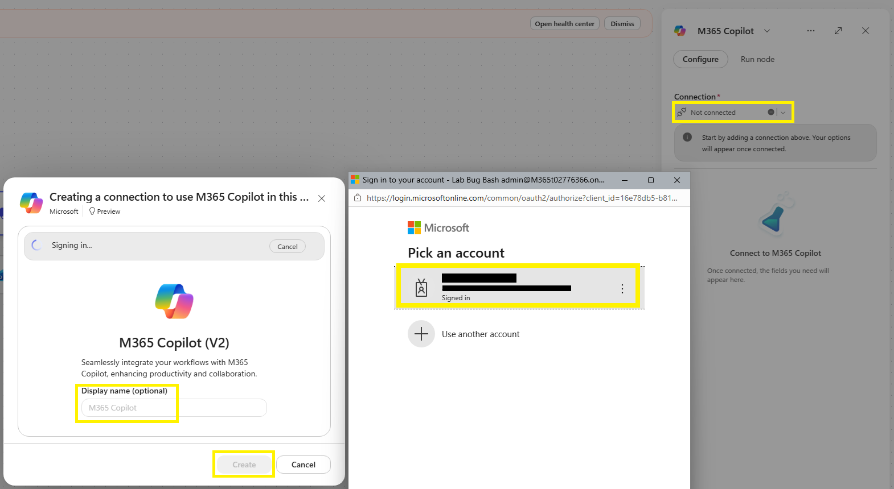    
    Figure: Establishing a connection for step **M365 Copilot**.

    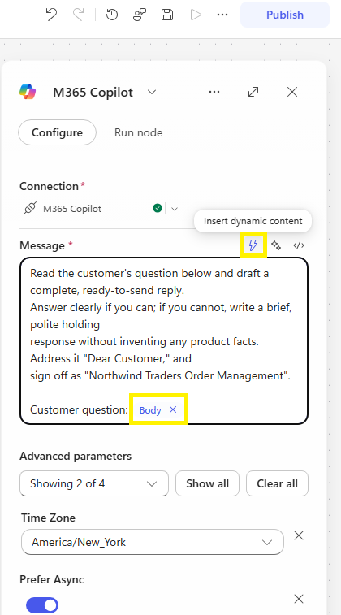      
    Figure: Connecting as the lab user.

    |  |
    | --- |
    | **Note** The **M365 Copilot** node is **read-only** — it can search and retrieve from your mail, chats, and files, but it cannot send messages. Sending happens in a separate action (Step 4.4). It also grounds on the connection owner's own history: a freshly provisioned lab account has none, so expect a generic holding reply. In a real mailbox it would ground on genuine prior threads. |

2. After the M365 Copilot action, add a **Human review** action and configure its connection.
    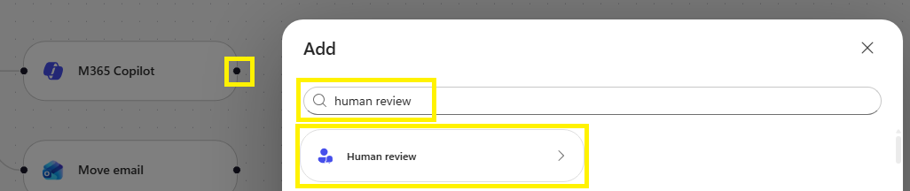   
    Figure: The step **Human review** is added so that a human can review the generated email response and approve it.

    For the **Title** parameter of the **Human review** step, select button **</>** in the header to switch to expression mode, and enter the following expression:

    ```
    concat('Customer Inquiry Response Proposal',replace(triggerOutputs()?['body/subject'],'Order Management',''))
    ```

    Since you might be using the same email account for sending and receiving emails in this lab, take note that we are removing the word sequence `Order Management` from the email subject to prevent an endless loop of email classification and response generation.

    For the **Message** parameter of the **Human review** step, select button **</>** in the header to switch to expression mode, and enter the following expression (if your M365 Copilot action is not named `M365_Copilot`, rename it or replace `M365_Copilot` in the expression with your action's name):
    ```
    concat('Customer Inquiry', triggerOutputs()?['body/bodyPreview'],'M365 Copilot Response', outputs('M365_Copilot')?['body/response'])
    ```

    Set the lab user as **Assigned to**, and configure a single **Yes / No** **Input** titled:

    ```
    Send proposed reply?
    ```

    The step configuration should look similar to the following screenshot:

    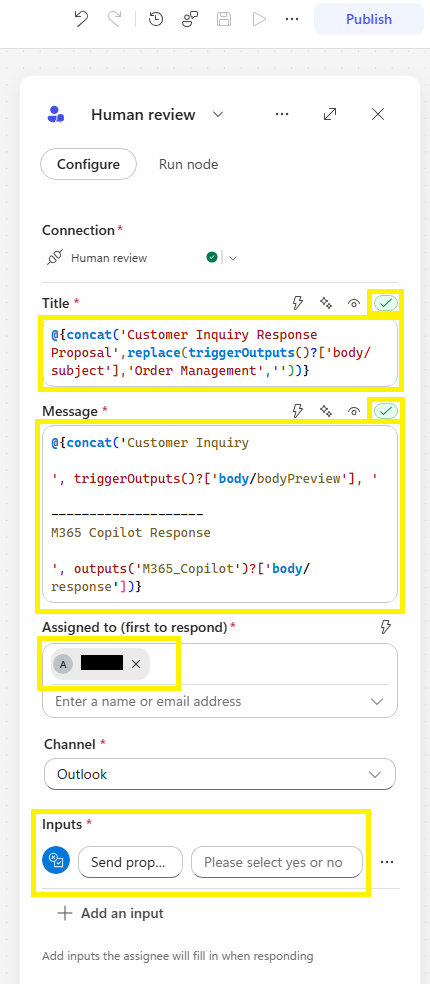      
    Figure: The **Human review** action with all configurations and presenting the proposed reply for a Yes/No approval.

3. Add an **If/Else** (condition) after Human review, testing the reviewer's answer.

    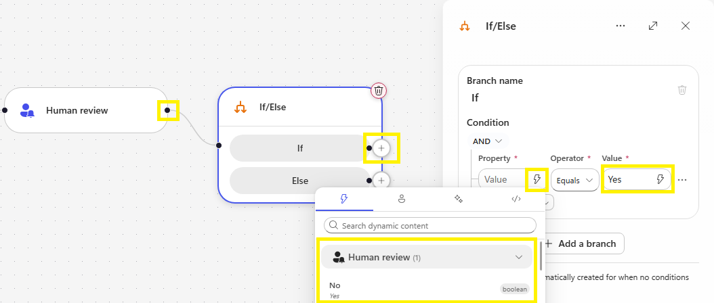       
    Figure: The **If/Else** action presenting its condition.

4. On the **If** branch, add an **Office 365 Outlook — Reply to email** action that sends the M365 Copilot draft back to the sender. If you are using the same email account in this lab for sending and receiving emails, consider removing the word sequence `Order Management` from the original subject before using it as a response subject to avoid an endless loop of classifying emails and responding to them. Select button **</>** in the header row of the **Subject** field to switch to expression mode, and enter the following expression:
    ```
    concat('Re: ', replace(triggerOutputs()?['body/subject'], 'Order Management - ', ''))
    ```

    The **Reply to email** step configuration should look similar to the following screenshot:
    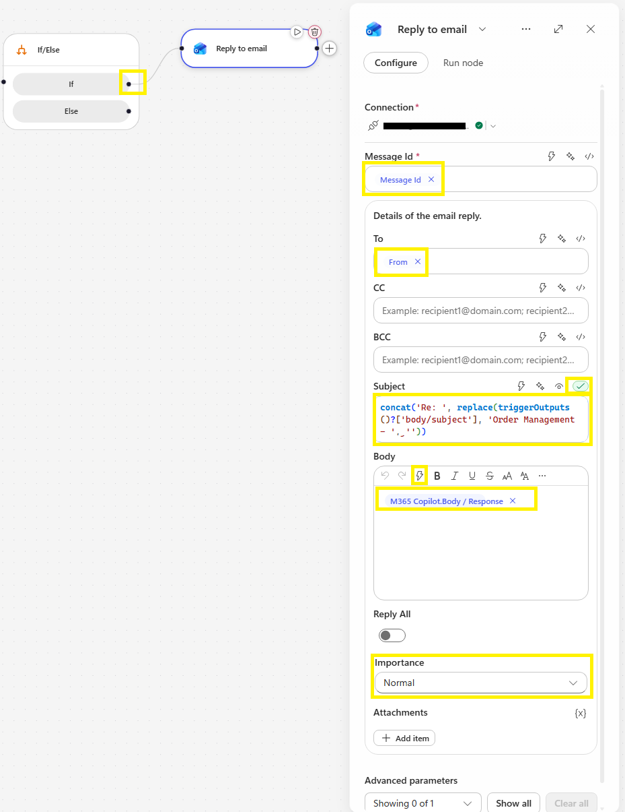    
    Figure: The **Reply to email** step to send the **M365 Copilot** response to the customer after it has been approved.

    On the **No** branch, leave the email in the inbox flagged for manual follow-up (for example, add an **Update email** action that flags it).


5. Select **Save**, then **Publish**. From **Outlook**, send a test email **to your lab account**:

    - **Subject:**

        ```
        Order Management - Question about Olive Oil shelf life and bulk cases
        ```

    - **Body:**

        ```
        Hi team,

        Quick question before we expand our last order. What is the shelf life on
        the Northwind Traders Olive Oil, and can it be supplied in bulk cases?

        Thanks,
        Jordan Kim
        ```

6. Open the workflow's **Activity** panel, refresh until the run appears, and follow the path **Classify → Customer Inquiry**. The **M365 Copilot** step might need a few minutes to complete. The run then pauses at **Human review**.

    |  |
    | --- |
    | **Note:** A paused run is expected — the workflow is waiting for your approval. |

7. Approve the request when it reaches you (sample in the screenshot below), then confirm the approved reply lands in the sender's inbox (your own, since you emailed yourself).

    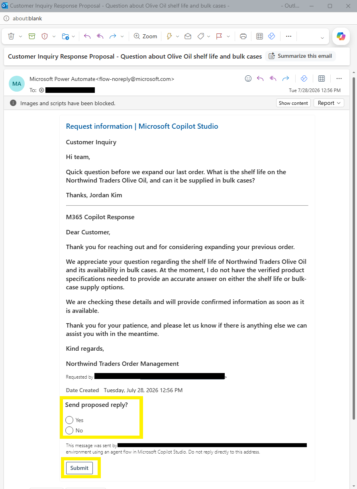      
    Figure: The response proposed by **M365 Copilot**, ready for human sign-off.

✅ **Checkpoint:** The Customer Inquiry branch drafts a grounded reply, pauses for your approval, and — only on **Yes** — sends the response automatically.

## Step 5: Reason over a supplier delay with an inline agent

A supplier-delay email names a delayed product but not how exposed it is to a supply gap. This is a step for judgment, so you add an **agent node**: it looks up the product's reorder level in Dataverse, decides how urgent the delay is, and logs a **Task** for the replenishment team.

You add no columns — each product is already seeded with a **Reorder Level**, the stock threshold at which Northwind reorders it, and the agent uses that as the delay's exposure signal.

1. In **Power Apps** (<https://make.powerapps.com>), switch to your development environment, open **Solutions → Northwind Traders → Objects → Tables → Order Product** and confirm the **Reorder Level** column is populated for the seeded products (it is, courtesy of the Northwind Sample Data).

    🔧 **Setup check:** In the Northwind Traders solution the product-catalog table is labelled **Order Product** (logical name `nwind_products`), *not* "Products" — the same pattern applies to **Order Product Category** (`nwind_categories`) and **Order Detail** (`nwind_orderdetails`). The **Task** table you verify later is a standard Dataverse table, so it lives in the environment's full **Tables** list rather than inside this solution.

2. In the **Order Product** table, use the search/filter box to find **Northwind Traders Clam Chowder**, open its row, and note its **Reorder Level** — for example `10`. The agent treats a delay on a product whose reorder level is at or above the urgency cut-off as **High** priority, and below it as **Normal**.

    💡 **Tip:** Nothing is edited or imported here — reorder levels ship with the Northwind Sample Data. The lab uses a cut-off of `10`, which lands the Clam Chowder test on the **High** path; adjust it to your own data if the reorder levels differ.

3. Back in the **Order Management Workflow**, on the **Supplier Delay** branch, select **+** and choose **Agent**. Leave it set to **New agent in this workflow** and keep the default model, then rename the node:

    ```
    Inventory Task Agent
    ```

    |  |
    | --- |
    | **Tip** You can choose a **different model per node**. A light model is enough for the Classify step; this inline agent can run a stronger reasoning model. Matching the model to the work keeps a workflow both capable and economical. |

    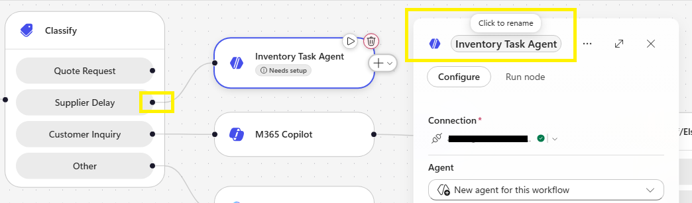     
    Figure: The new inline agent added to the Supplier Delay branch.

4. Under **Tools**, add the **Microsoft Dataverse MCP Server** and establish an **OAuth** connection. This gives the agent the ability to read tables and create rows.

    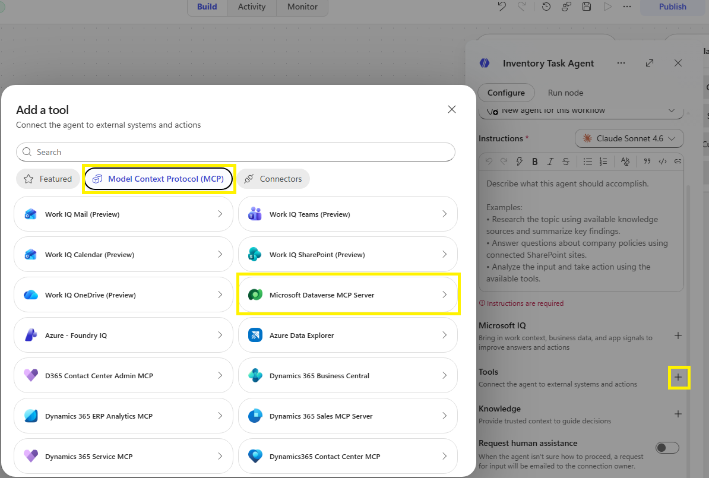    
    Figure: The agent equipped with the Microsoft Dataverse MCP Server.

5. In the **Instructions** box of the **Inventory Task Agent**, paste:

    ```
    Purpose
    You triage supplier shipment-delay notices into restock tasks for Northwind
    Traders. A delay notice names a delayed product, so you look up how exposed
    that product is to a supply gap, judge how urgent the delay is, and record a
    task.

    Inputs
    Delay notice: [email body]
    Review by (Due Date): [due date]

    Steps
    1. Read the product named in the delay notice.
    2. Use the Dataverse tool to find that product in the Order Product table (logical name nwind_products) and read
       its Reorder Level, Product Code, and Supplier. Do not guess these values.
    3. Judge urgency from the Reorder Level - the stock threshold at which this
       product is normally reordered. A higher reorder level means a larger safety
       buffer and more exposure to a delay. Treat a reorder level of 10 or more as
       urgent (High); below 10 as tolerable (Normal).
    4. Create exactly one row in the Task table, setting only:
       - Subject: Restock delay - [product name] ([product code]).
       - Description: the reorder level, the supplier, the urgency judgment, and a
         one-line action for the replenishment team.
       - Priority: High if the reorder level is 10 or more, otherwise Normal.
       - Due Date: the Review by date provided.

    Rules
    Create exactly one Task row and set only the columns listed above.
    If the product is not found, record it as unrecognized for a person to check.
    ```

6. Replace the placeholders with **dynamic content**:

    - Select **[email body]** and insert the trigger's **Body Preview**. (If the full email **Body** is available and does not cause this step to fail, it is a more reliable choice — verify this works for your test emails before relying on it.)
    - Select **[due date]**, open the expression builder, and use **Ask Copilot to generate an expression** with the prompt *"Add 3 days to the received time of the trigger email."* Confirm it returns an expression like:

        ```
        addDays(triggerOutputs()?['body/receivedDateTime'], 3)
        ```

    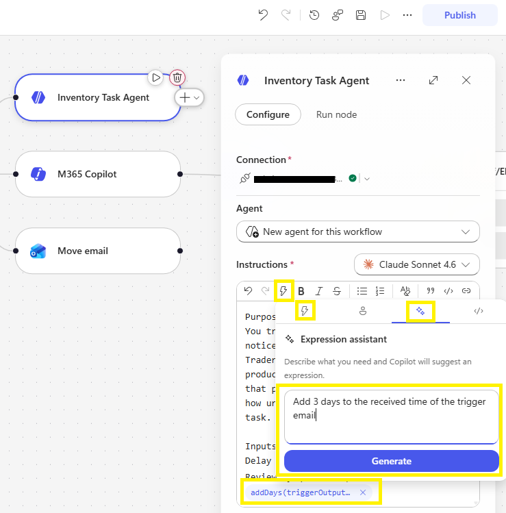   
    Figure: The instructions with the email body and a due-date expression inserted.

7. Scroll to **Output**, switch to **Structured output**, and add three properties:

    - `productCode` (**Text**) — the product code of the delayed item.
    - `reorderLevel` (**Number**) — the product's reorder level from Dataverse.
    - `urgent` (**Text**) — `High` when the reorder level is at or above the cut-off (10), otherwise `Normal`.

    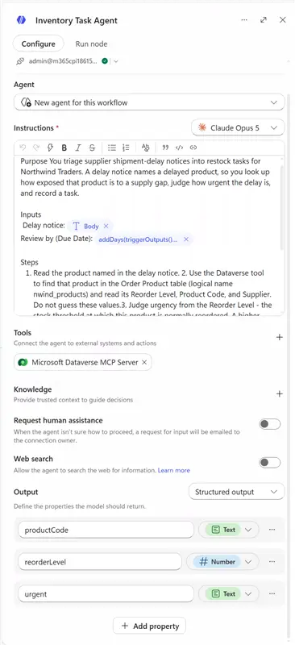      
    Figure: The agent's structured output definition.

8. Select **Save**, then **Publish**. From **Outlook**, send a test email **to your lab account**:

    - **Subject:**

        ```
        Order Management - Shipment delay - Northwind Traders Clam Chowder
        ```

    - **Body:**

        ```
        Hello Northwind Traders,

        The upcoming shipment of the Northwind Traders Clam Chowder has been delayed
        and will not arrive on the originally planned date. We apologize for the
        inconvenience and will keep you updated.

        Regards,
        Supplier Team
        ```

9. In the workflow's **Activity** panel, open the run and follow **Classify → Supplier Delay → Inventory Task Agent**. Select the agent node and review its tool calls: a Dataverse read of the product, then a Dataverse **create** of the Task row. Review the **structured output** — `reorderLevel` is the value the agent read and `urgent` reflects whether it meets the cut-off.

    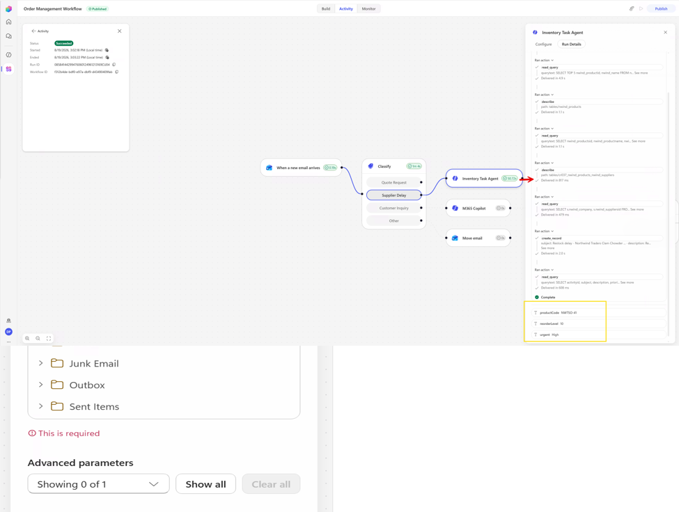
    Figure: The run in the **Activity** panel — the **Inventory Task Agent** node with its Dataverse tool calls and the structured output (`productCode`, `reorderLevel`, `urgent`).

10. Open **Tables → Task** outside of your solution in Power Apps and find the row **Restock delay - Northwind Traders Clam Chowder (NWTSO-41)** with **Priority = High** (Clam Chowder's reorder level is 10) and a **Due Date** three days out.

    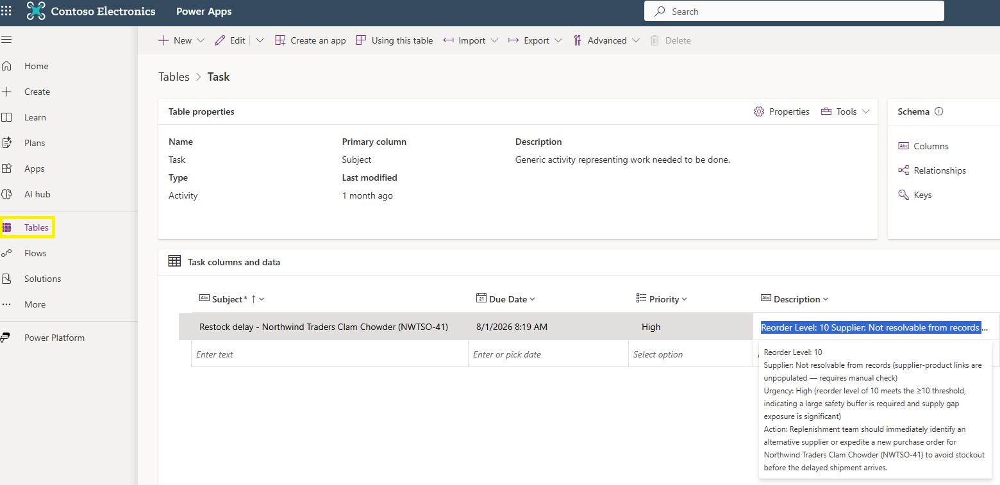     
    Figure: The Task the agent created for the delayed shipment.

✅ **Checkpoint:** The agent turned an unstructured delay email into a concrete, prioritized Task — reading the product's reorder level, judging urgency, and writing the result back to Dataverse.

## Step 6 (Bonus): Hand quote requests to a Price Quote Agent

Some work is worth packaging into a reusable agent you can call from more than one place. Here you build a small **Price Quote Agent** that prices a request from Dataverse list prices and emails the quote — then call it from the workflow's **Quote Request** branch.

1. In Copilot Studio, select **Agents → New agent** and name it:

    ```
    Price Quote Agent
    ```

2. In the agent's **Instructions**, describe the quote logic:

    ```
    You prepare price quotes for Northwind Traders customers.
    From the request, read the customer's email address and the products and
    quantities they want. Use the Dataverse tool to look up each product's List
    Price in the Order Product table (logical name nwind_products). Calculate line totals (quantity x list price) and
    the grand total. Compose a clear, itemized quote and email it to the customer,
    using only the list prices found in Dataverse — never estimates. If a product
    is not found, ask the customer to confirm the product name instead of guessing.
    ```

3. Give the agent the **Microsoft Dataverse MCP Server** tool (to read product prices) and a mail-sending tool (**Work IQ MCP server** (preview), or the Office 365 Outlook **Send an email (V2)** action) so it can send the quote. Create a connection for both tools if prompted.

    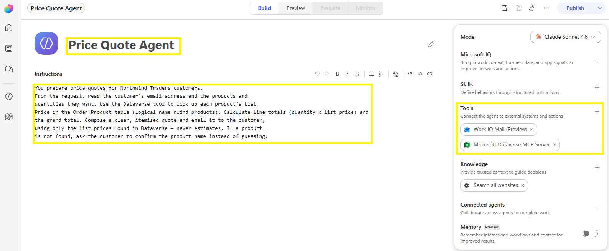    
    Figure: The Price Quote Agent with **Instructions** and **Tools**.
    
4. Select **Publish** — an agent must be **published** before a workflow can call it.

    |  |
    | --- |
    | **Important** Only **published** agents appear in the workflow's agent selector. If yours is missing from the dropdown, publish it first and wait a few moments for it to become available in the workflow. |

5. Return to the **Order Management Workflow**, on the **Quote Request** branch select **+ → Agent**, and choose **Price Quote Agent** from the dropdown.

6. In the **Message**, pass the request data as dynamic content:

    ```
    Prepare a price quote for this customer request.
    Customer email address: [insert the customer email address as dynamic content]
    Customer request: [insert the body preview of the request email]
    ```

    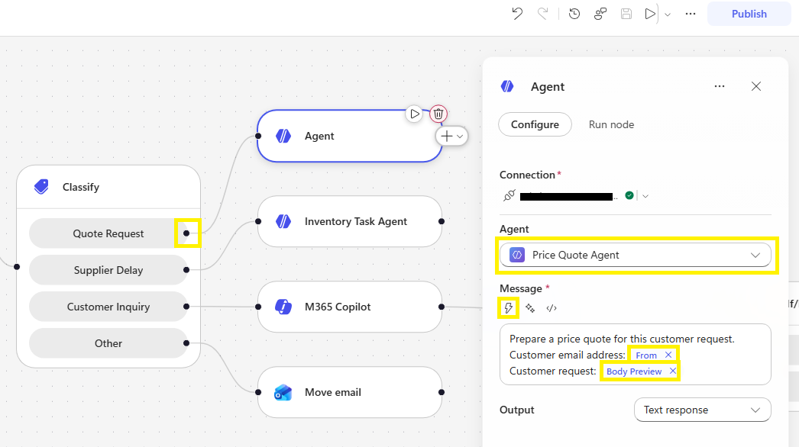     
    Figure: The Quote Request branch wired to the published Price Quote Agent.

7. Select **Save**, then **Publish** the workflow and wait for the publishing to complete.

8. From **Outlook**, send a test email **to your lab account**:

    - **Subject:**

        ```
        Order Management - Quote request
        ```

    - **Body:**

        ```
        Hello Northwind Traders,

        We're restocking and would like a quote for:
        - 10 cases of Northwind Traders Coffee
        - 5 cases of Northwind Traders Olive Oil

        Could you confirm your best price?

        Thanks,
        Nancy Anderson
        ```

9. In the **Activity** panel, confirm the route **Classify → Quote Request → Agent completed**, then check **Outlook** for the generated quote email.

    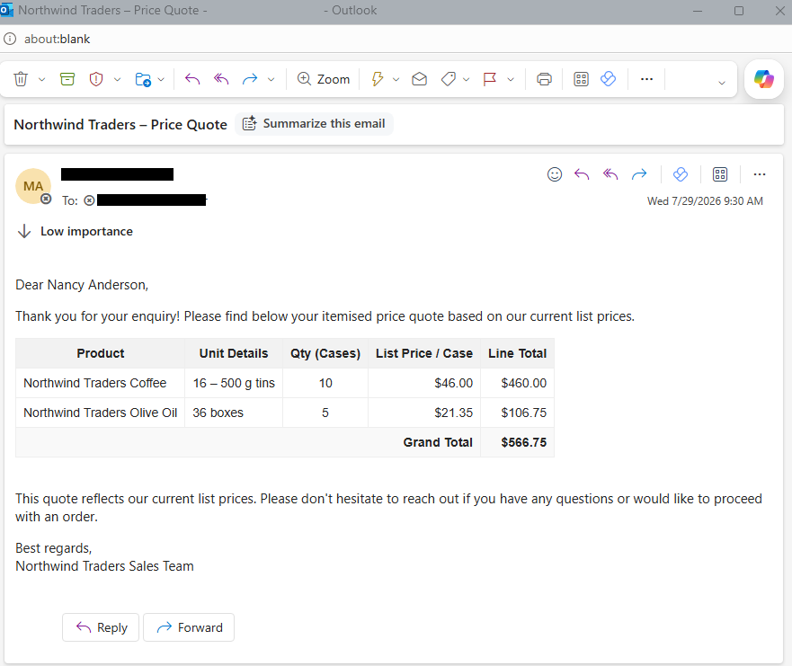    
    Figure: The itemized quote the Price Quote Agent produced and sent.

✅ **Checkpoint:** A quote request is handed to a reusable published agent that prices it from real Dataverse data and emails the customer — logic you can now reuse from any other automation.

## Summary of learnings

To get the most out of autonomous workflows in Copilot Studio:

- **Trigger first, chat never** — a workflow runs on an event, so work happens in the background without a user present. Pick the trigger that matches the "when" of your automation.
- **Deterministic where it must be, agent where it helps** — keep fixed actions for steps that must always behave identically; reach for an agent node when a step needs judgment.
- **Ground agents with dynamic content** — pass the real trigger data (Body, From, received time) so each run acts on the actual item.
- **Tools are the agent's hands** — the Dataverse MCP Server, M365 Copilot, and mail actions let a workflow read context and take action. Grant only the tools the goal requires.
- **Keep a person in the loop where it counts** — a Human review gate lets an AI draft while a human owns the send.
- **Publish before you test, and re-publish after every change** — the trigger is only live once published.

This lab keeps the intelligence on rails: deterministic branches decide *what* happens, agents decide *how*, and a person signs off before anything leaves the building. That's the shape of an automation you can trust to run unattended — and it simplifies real deployments, which would add credential vaults, richer knowledge sources, and monitoring on top of the same pattern.

🥳 Congratulations — you built an autonomous Order Management Workflow that classifies incoming email and routes each type to the right handler: archiving junk, drafting and approving customer replies, reasoning over supplier delays into Dataverse tasks, and delegating quotes to a reusable published agent.

## Recommended next step

Continue to [Module 8: CUA](08-cua.md) to automate a website an agent can't reach through a connector or API — using computer use to operate the screen the way a person would.
