# Module 8: Computer Using Agents

## Overview

In this lab, you build an AI agent in Microsoft Copilot Studio that uses **Computer Use** to operate a desktop application as a person would: clicking, typing, and reading the screen. The agent runs on a bring-your-own machine (BYOM), which lets you reuse an existing Power Automate desktop machine.

The target is a legacy order management application. The agent launches the application, searches for an order, and extracts its details without an API or fixed UI selectors.

## Business use case

Northwind Traders uses a legacy desktop application to look up order details. The application does not expose an API, and some controls cannot be identified reliably with selectors. Employees must open the application, search for an order, and manually copy its details.

You will build the **Order Processing Agent**, a Copilot Studio agent that finds fields by their visible labels and reads the corresponding values wherever they appear.

## Core concepts

- **Computer Use** is a tool that lets an agent use a desktop application or website with a virtual mouse and keyboard. It combines vision and reasoning so it can adapt when an interface changes.
- **Generative orchestration** lets an agent reason about a goal and dynamically select tools. Computer Use is available only when generative orchestration is enabled.
- A **tool** is a capability available to an agent. You configure a Computer Use tool with plain-language instructions.
- A **bring-your-own machine** is a Windows machine registered and managed in Power Automate. It can be a physical, virtual, cloud, or on-premises machine.
- **Inputs** are values collected when a tool runs. In this lab, the agent asks for an order value in chat and passes it to the Computer Use tool.

Computer Use supports the **Computer-Using Agent (CUA)** model and, when an administrator enables external models, supported Anthropic models.

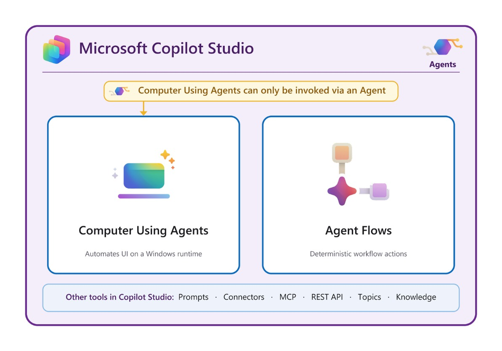
Figure: Available model choices for a Computer Use tool.

## Where Computer Use runs

Computer Use always runs on a Windows machine. Choose a runtime based on the identity, governance, and scale requirements of the automation.

### Hosted browser (preview)

- Uses Windows 365 for Agents.
- Provides immediate web automation in Microsoft Edge and access to built-in Windows applications.
- Runs in a Microsoft-managed environment that is not joined to your tenant or managed by Intune.
- Is intended for learning and quick automation, not production workloads, and may be throttled.

### Cloud PC pool (preview)

- Uses Windows 365 for Agents.
- Provides scalable cloud machines that automatically scale to demand.
- Uses a work or school identity to reach Microsoft 365, SharePoint, and Azure.
- Supports Microsoft Entra join and Intune enrollment for governance and policy compliance.

### Bring-your-own machine

This lab uses a bring-your-own machine.

- Uses a Windows machine that you own and register in Power Automate.
- Requires Power Automate for desktop and the browser extension when automating websites.
- Requires you to enable Computer Use in the registered machine's settings.
- Should use a dedicated machine to avoid interruptions.

## Credentials and access control

Decide how the agent signs in and which applications it can access before configuring the tool.

### Credentials to use

- **Maker-provided credentials** run the tool with credentials configured by the maker, regardless of who starts the chat. This model is suitable for consistent, unattended automation.
- **End-user credentials** run the tool as the person using the agent. This model is suitable when every run must respect the signed-in user's access.

Use **Maker-provided credentials** in this lab. Apply least privilege to the account and rotate stored secrets. The target application does not require sign-in, so leave the Computer Use credential vault empty. The Windows credentials configured on the machine connection are separate and allow the agent to access the machine.

### Allowed applications and HTTPS

Turn on **Only allow specific websites and desktop apps** and allow only the `UIAutomationDemo` process (enter the process name without the `.exe` extension). **Enforce HTTPS** is enabled by default for web targets and has no effect on this desktop-only lab.

## Prerequisites

Review the [workshop prerequisites](/labs/prereqs.md) before you begin. You also need:

- A [Copilot Studio license](https://learn.microsoft.com/microsoft-copilot-studio/requirements-licensing-subscriptions) that supports generative orchestration. Review the [Computer Use access requirements](https://learn.microsoft.com/microsoft-copilot-studio/computer-use) for the current prerequisites.
- Computer Use enabled in your Power Platform environment.
- *(Optional)* Administrator approval for external models if you plan to use an Anthropic model instead of the default CUA model.
- A Windows machine that meets the [Power Automate for desktop system requirements](https://learn.microsoft.com/power-automate/desktop-flows/requirements), with Power Automate for desktop and the **machine runtime** component installed, registered in the same Power Platform environment, and available to enable for Computer Use.
- Environment Maker or equivalent permissions in the target environment.
- Enough Copilot Credit capacity in the environment to run the lab. Computer use bills Copilot Credits per step through the standard harness, at the same rate on every runtime. Confirm the current rate in the [Copilot Studio Licensing Guide](https://go.microsoft.com/fwlink/?linkid=2320995) and forecast usage with the [agent usage estimator](https://microsoft.github.io/copilot-studio-estimator/). See [Appendix D](#appendix-d-credit-consumption--runtime-cost-transparency) for the credit and runtime cost picture.
- The lab-provided desktop application extracted to the Windows machine and marked as trusted. See [Appendix A](#appendix-a-set-up-the-desktop-application).

> 🔧 **Setup check:** Confirm that the environment picker in Copilot Studio and Power Automate shows the same development environment. Confirm that the Windows machine is powered on and that you can sign in to it.

## Learning objectives

By the end of this module, you will:

- Create a Copilot Studio agent in the classic creation experience and verify generative orchestration.
- Add and configure a Computer Use tool with a dynamic order input.
- Enable an existing Power Automate machine for Computer Use.
- Configure a machine connection and choose a deliberate credential model.
- Restrict the agent to one desktop application.
- Test the agent and observe its reasoning and recorded UI actions.

> 📚 **Before you start:** For background on the features used in this lab, see the [Documentation and learning resources](#documentation-and-learning-resources) at the end of the module.

## Readiness check

Complete this preflight setup **before Step 1**. The agent cannot run until the desktop application and a Computer Use-capable machine are in place.

- [ ] **Desktop application ready** — the lab application is extracted to the Windows machine and marked as trusted. Complete [Appendix A: Set up the desktop application](#appendix-a-set-up-the-desktop-application).
- [ ] **Machine registered** — a Windows machine is registered in the same Power Platform environment and appears in the Power Automate **Machines** list. If it is missing, complete [Appendix B: Register a machine with Power Automate](#appendix-b-register-a-machine-with-power-automate).
- [ ] **Same environment** — the environment picker in Copilot Studio and Power Automate shows the same development environment.
- [ ] **Machine online** — the Windows machine is powered on and you can sign in to it.

> ℹ️ You enable the registered machine for Computer Use later, in [Step 3](#step-3-enable-a-power-automate-machine-for-computer-use). Complete the two appendices above first.

## Step 1: Create the Computer Use agent

1. Open [Microsoft Copilot Studio](https://copilotstudio.microsoft.com/) and confirm that the environment picker shows the environment where you want to build.

	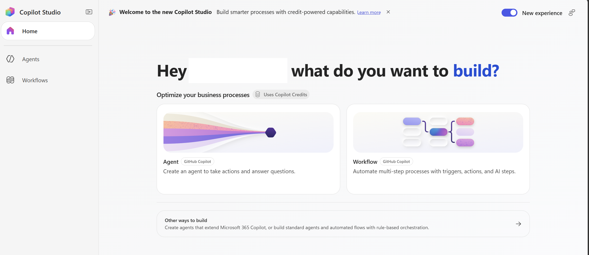
	Figure: Confirming the target environment in Copilot Studio.

	> ℹ️ **Important:** If Copilot Studio opens the new creation experience with a **What would you like to build?** prompt and **Agent** and **Workflow** options, switch to the classic experience. This lab uses the classic creation flow. Do not create the agent by entering a request in the prompt box.

	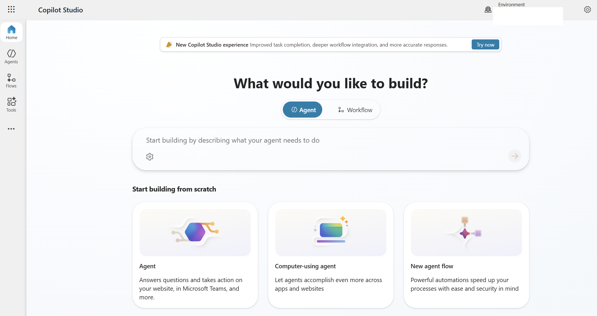
	Figure: The classic Copilot Studio experience used in this lab.

2. In the left navigation, select the three-dot menu, and then select **Solutions**.

	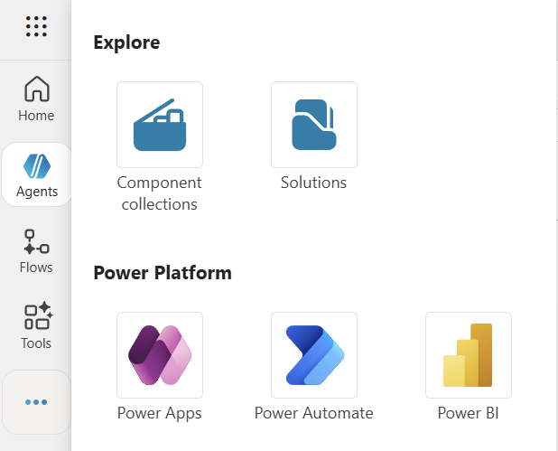
	Figure: Opening Solutions from the Copilot Studio navigation.

3. Select **New solution**, enter `Order Automation` as the display name, enable **Set as preferred solution**, and select **Create**.

	Setting the preferred solution ensures that new components, including agents and workflows, are added to the solution automatically.

	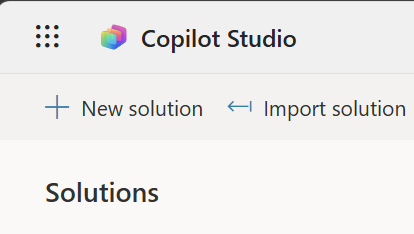
	Figure: Creating the Order Automation solution.

	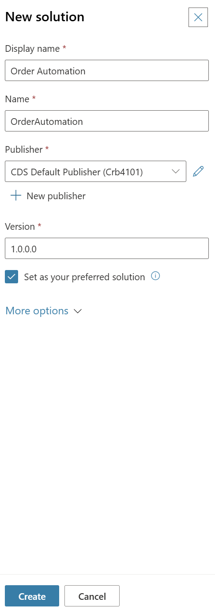
	Figure: Setting Order Automation as the preferred solution.

	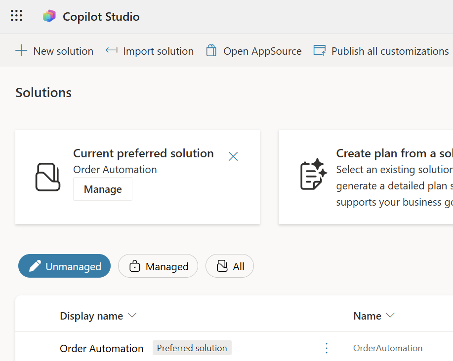
	Figure: The completed preferred solution.

4. In the classic experience, select **Agent**. In the creation dialog, configure the following values, and then select **Create**:

	| Field | Value |
	| --- | --- |
	| Name | Order Processing Agent |
	| Language | Your preferred lab language |
	| Solution | Order Automation |

	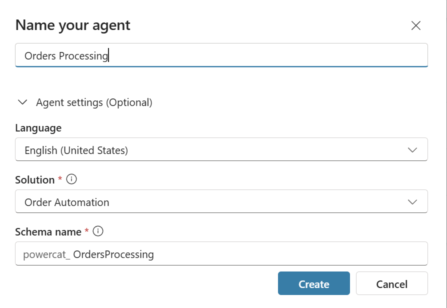
	Figure: Creating the Order Processing Agent in the preferred solution.

	Wait for agent setup to finish before continuing.

	
	Figure: Copilot Studio setting up the new agent.

	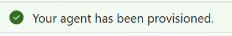
	Figure: Confirmation that agent setup is complete.

5. Open the agent's **Overview** page, edit the description, enter the following text, and save the change:

	```
	Handles the order details extraction process.
	```

	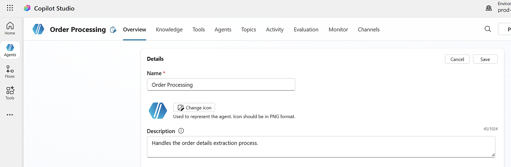
	Figure: Setting the agent description on the Overview page.

6. Open **Settings** and confirm that orchestration is set to **Generative**. It is enabled by default for new agents. If it is off, select **Generative**, and then save.

	
	Figure: Opening the agent settings.

	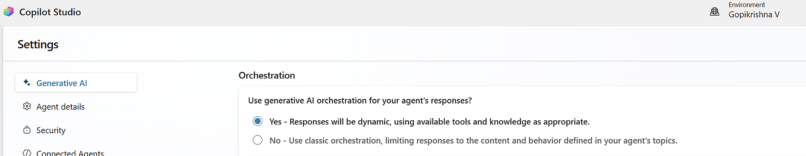
	Figure: Verifying that generative orchestration is enabled.

✅ **Checkpoint:** The **Order Processing Agent** exists in the **Order Automation** solution, its description is saved, and generative orchestration is enabled.

💡 **Reflection:** Generative orchestration lets the agent reason about a goal and choose tools dynamically. Computer Use depends on this mode, so verify the setting instead of assuming it is enabled.

## Step 2: Add and configure the Computer Use tool

The order management application does not expose reliable selectors. You will give the agent an order value and instruct it to read the value associated with each visible field label.

1. On the agent, select **Tools**, and then select **Add a tool** > **New tool** > **Computer use**.

	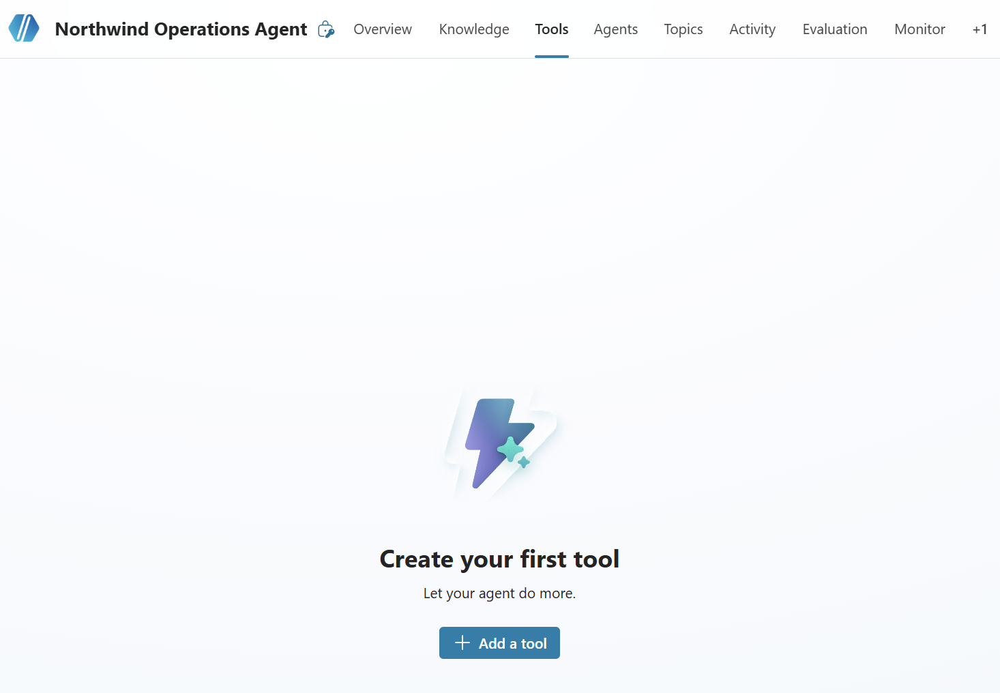
	Figure: Adding a new Computer Use tool to the agent.

	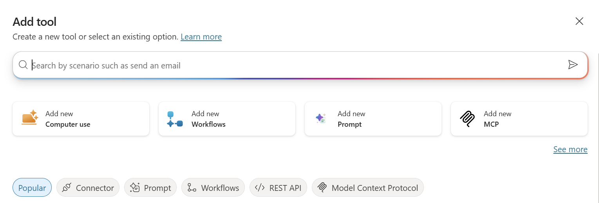
	Figure: The instruction editor for the new Computer Use tool.

2. In the instructions box, enter the following instructions. Replace `<machine-user>` with the Windows profile folder used on your machine if the application is installed at a different path.

	```
	1. Launch the desktop application at C:\Users\<machine-user>\Downloads\desktop-app\UIAutomationDemo.exe with application arguments --order-sections 1,2.
	2. Navigate to Orders.
	3. Search orders using the provided order value.
	4. Select Search.
	5. Wait until the data loads.
	6. Extract Customer, Order Date, Channel, Status, Priority, Product, Quantity, Unit Price, Order Total ($) *, Payment, Ship to City, Ship to State, Tracking #, and Notes.
	7. Confirm that the returned order matches the requested order value and that each listed field has a value. Report any fields that are empty.
	```

	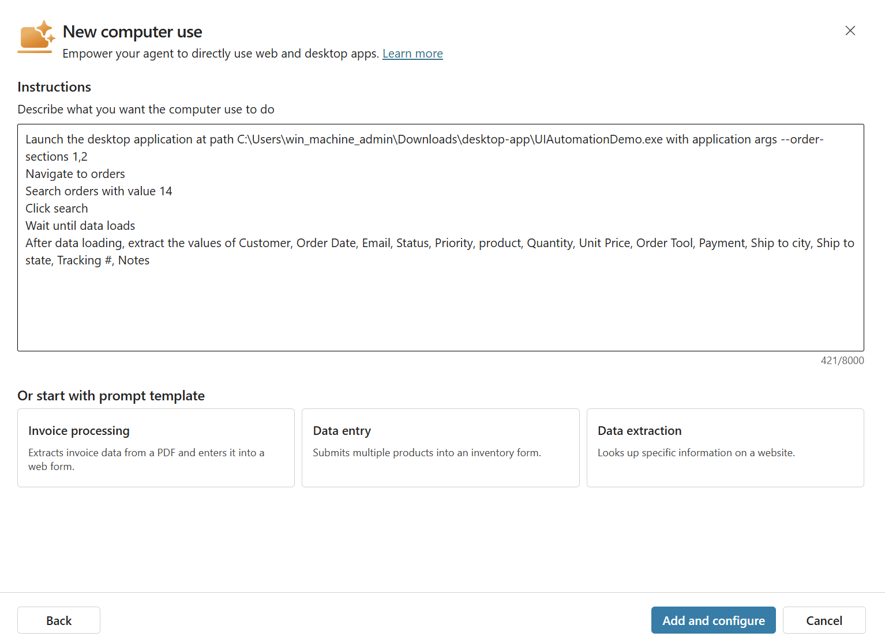
	Figure: Plain-language instructions for launching the application and extracting order details.

3. Select **Add and configure**.

4. Configure the tool:

	| Field | Value |
	| --- | --- |
	| Name | Order details processing |
	| Description | Search and retrieve details from a legacy desktop application using a bring-your-own machine. |
	| Model | Computer-Using Agent (CUA) model *(default; use another supported model only if an administrator has enabled external models)* |
	| Instructions | The instructions entered in the previous action |

	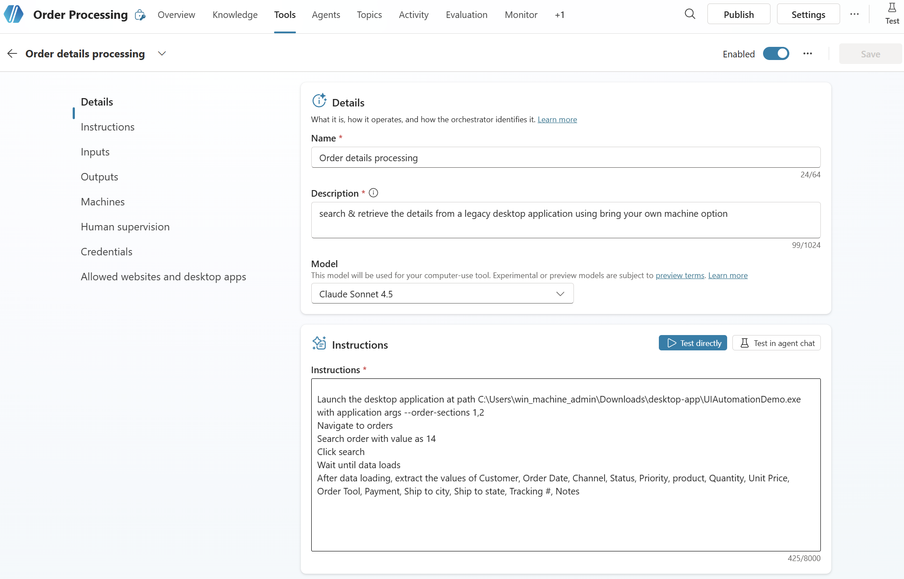
	Figure: Configuring the name, description, model, and instructions.

5. In **Inputs**, add an input for the order value, configure the following, and leave **Fill using** set to **Dynamically fill with AI**. The agent collects the value from the user in chat at run time.

	| Field | Value |
	| --- | --- |
	| Display name | Order value |
	| Description | The order number to find. The agent uses this value to search the order application. |
	| Fill using | Dynamically fill with AI |

	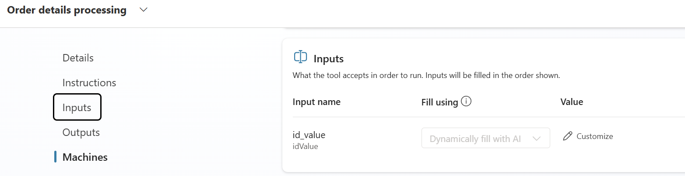
	Figure: Adding the order value input and allowing AI to fill it dynamically.

6. Confirm that the instructions refer to the provided input rather than a hardcoded order number.

	```
	Search orders using the order value provided in the input.
	```

	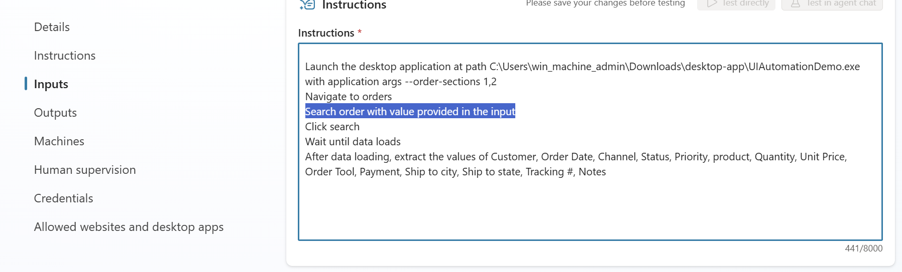
	Figure: Updating the instructions to use the dynamic order input.

✅ **Checkpoint:** The **Order details processing** tool is created and saved, the order value input exists and is set to **Dynamically fill with AI**, and the instructions reference the input rather than a hardcoded order number.

## Step 3: Enable a Power Automate machine for Computer Use

A machine can be used for either Computer Use or RPA desktop flows at one time, not both. This step changes the selected machine's mode.

1. Open a new browser tab, go to [Power Automate](https://make.powerautomate.com/), and select the same environment used in Copilot Studio.
2. In the left navigation, select **More**, and then select **Machines**.

	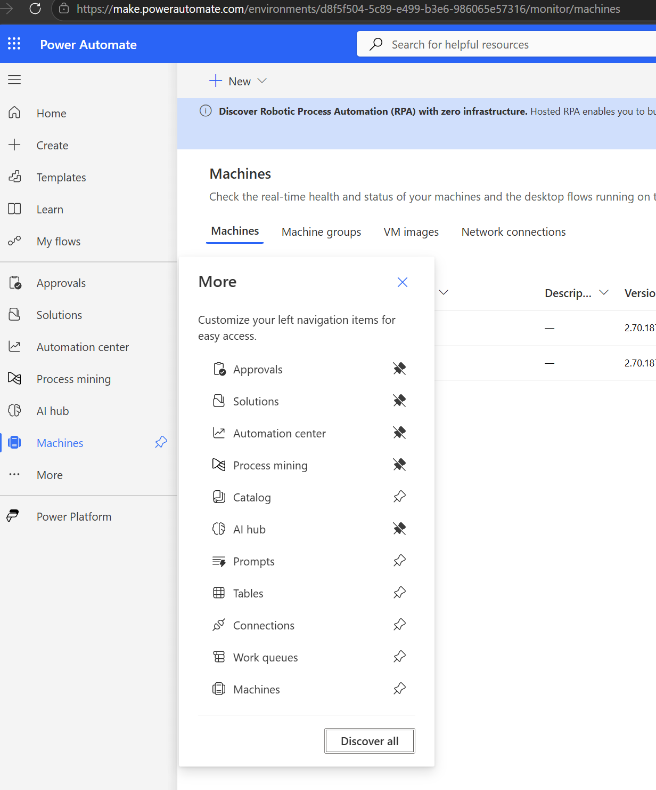
	Figure: Opening the Machines page in Power Automate.

3. Confirm that the intended machine appears in the list. If no machine appears, complete [Appendix B](#appendix-b-register-a-machine-with-power-automate), and then return here.

	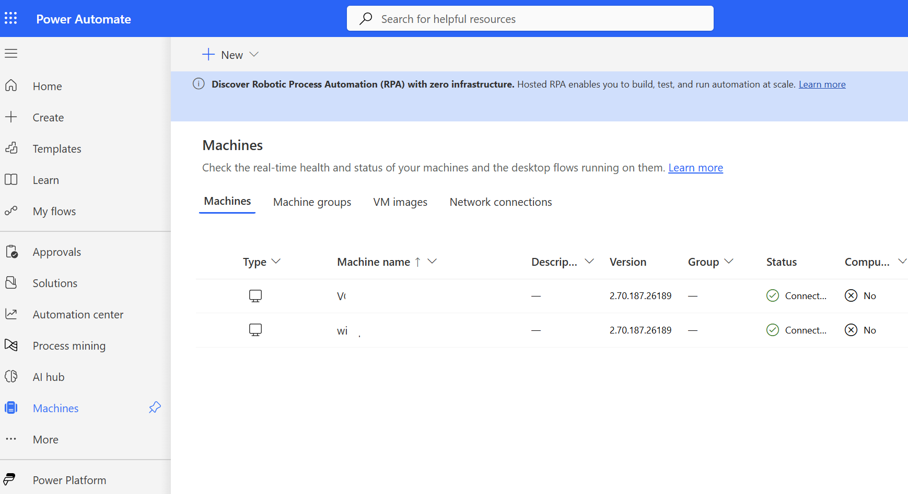
	Figure: Available registered machines in the selected environment.

4. Select the machine, open its context menu, and select **Settings**.

	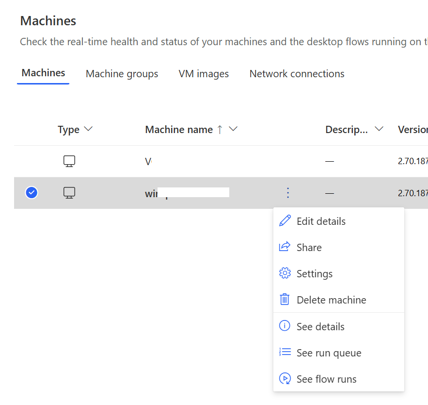
	Figure: Opening Settings for the selected machine.

	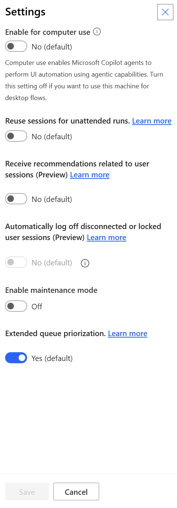
	Figure: The machine settings before Computer Use is enabled.

5. Turn on **Enable for computer use**. In the confirmation dialog, select **Activate**.

	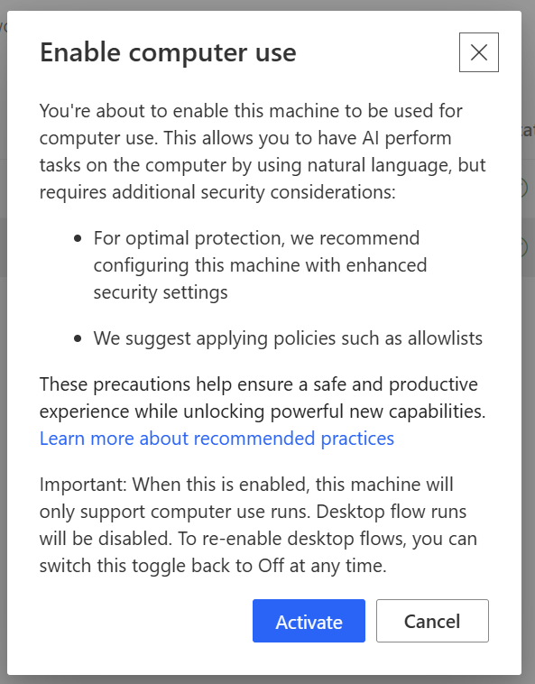
	Figure: Confirming that the machine will be activated for Computer Use.

6. Confirm that **Enable for computer use** is on, and then select **Save**.

	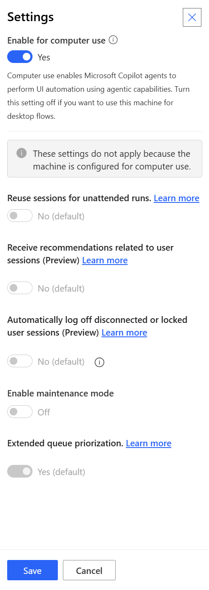
	Figure: Saving the enabled Computer Use setting.

7. Confirm that the Machines list now identifies the machine as enabled for Computer Use.

	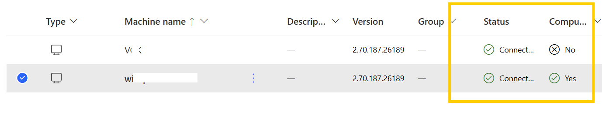
	Figure: Verifying the machine's updated Computer Use status.

✅ **Checkpoint:** The intended machine is online, registered in the correct environment, and enabled for Computer Use.

## Step 4: Configure the machine connection and access controls

1. Return to the Copilot Studio tab and the **Order details processing** tool.
2. In the **Machines** section, select **Bring your own machine**, and then select the machine enabled in Step 3.

	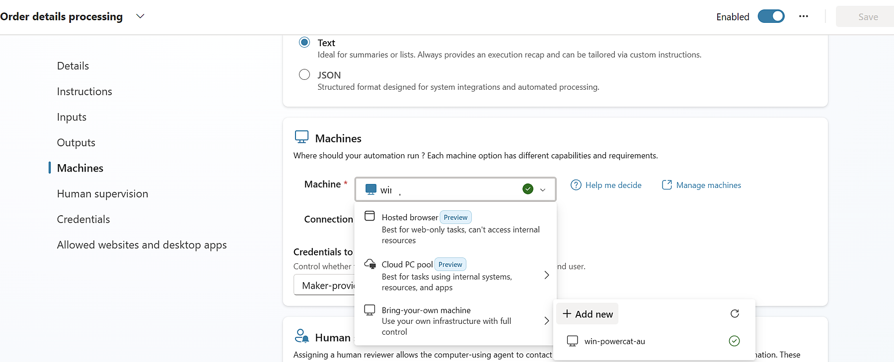
	Figure: Selecting the Computer Use machine in Copilot Studio.

3. If this is the first use of the machine, create a connection. Enter `BYOM-CUA-MCS` as the display name, keep the default settings, and provide the Windows sign-in credentials for the machine.

	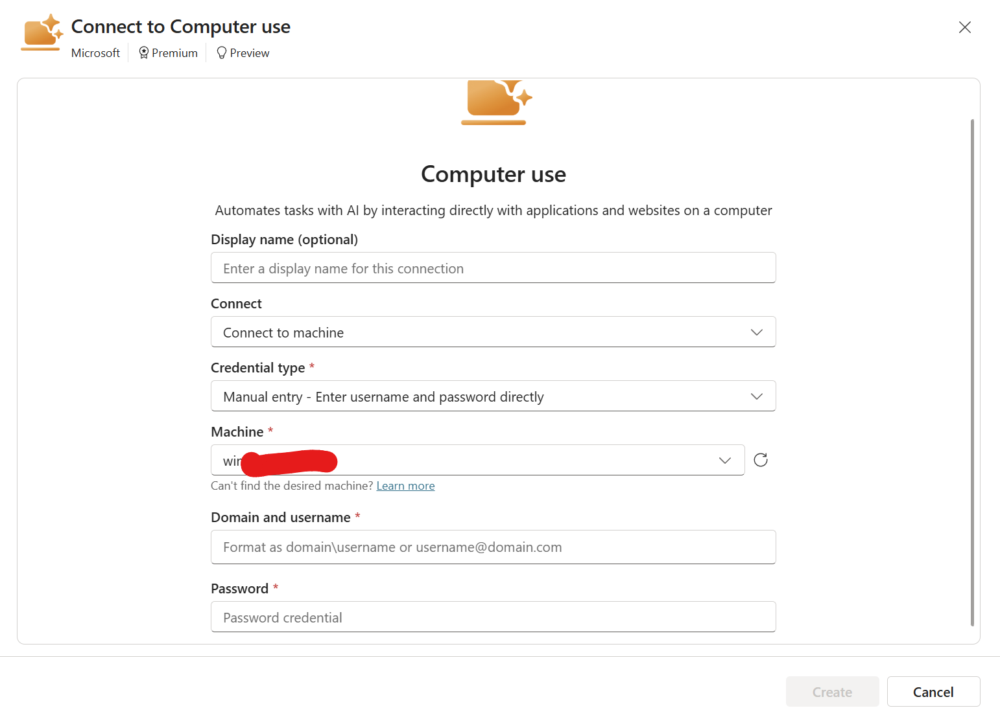
	Figure: Creating the BYOM-CUA-MCS machine connection.

4. For stronger credential management, select **Saved credential** instead of entering credentials manually whenever that option is available in your environment.

	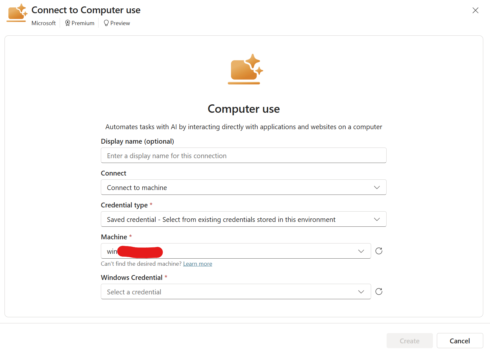
	Figure: Selecting a reusable saved credential for machine access.

5. For **Credentials to use**, select **Maker-provided credentials**. Leave the tool's application credential vault empty because `UIAutomationDemo.exe` does not require sign-in.

	The machine connection credentials allow access to Windows. The **Credentials to use** setting controls whether the tool runs with maker-provided or end-user credentials.

	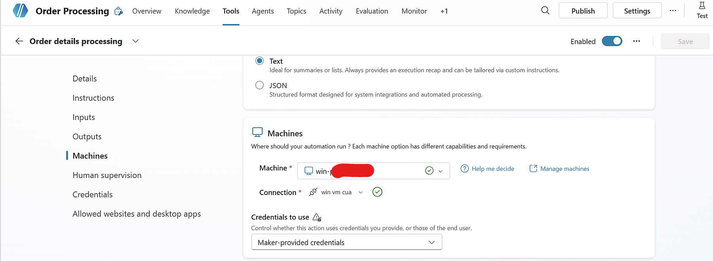
	Figure: Configuring the Computer Use runtime identity.

	> ⚠️ **Shared-agent access:** With **Maker-provided credentials**, anyone you share the published agent with can act with your access on the configured machine. Use a dedicated, least-privilege account for the machine connection and restrict who can run the agent.

	> ⚠️ **Troubleshooting:** The machine must be powered on and connected. If the connection appears invalid, bring the machine online, wait for the machine runtime to connect, and refresh Copilot Studio.

	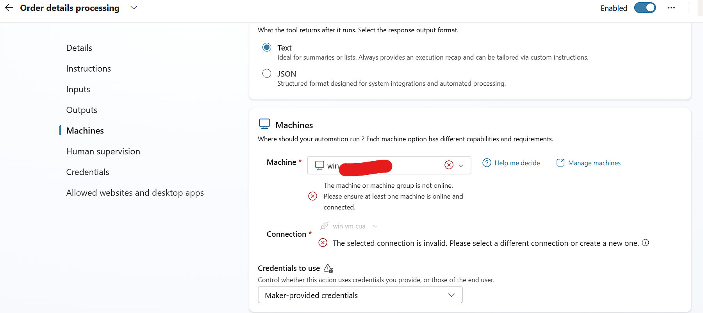
	Figure: Connection status when the selected machine is unavailable.

6. Review the **Credentials** section. Application credentials would be added here if the target desktop or web application required a login. No action is required for this lab.

	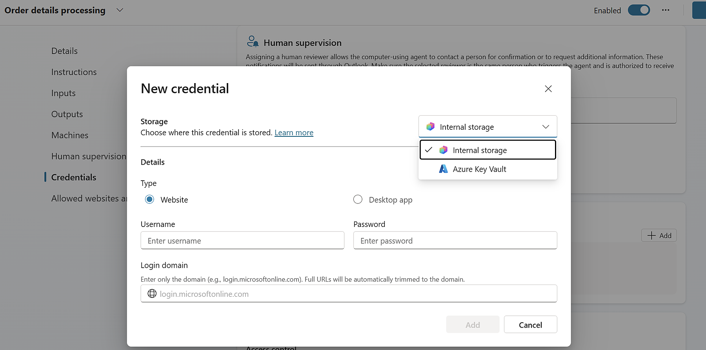
	Figure: The optional application credential vault.

	> ℹ️ **Human supervision (recommended):** In the tool's **Human supervision** section, set a reviewer who is contacted by email if computer use detects potentially harmful instructions. Requests expire after the configured response time limit. Human supervision reviews suspicious instructions — it is **not** a guaranteed fail-safe or an error-retry mechanism. See [Human supervision](https://learn.microsoft.com/microsoft-copilot-studio/human-supervision-computer-use).

7. Expand **Allowed websites and desktop apps**, turn on **Only allow specific websites and desktop apps**, and select **Add**.
8. In the **New website or desktop app** dialog, keep **Type** set to **Desktop**, enter `UIAutomationDemo`, and save the entry.

	> ℹ️ **Name the process, not the file:** Enter the application's **process name without the `.exe` extension** here (`UIAutomationDemo`). The `.exe` extension is only used in the launch instruction path in Step 2 (`...\UIAutomationDemo.exe`). Adding `.exe` to this allowlist entry can cause the app to be blocked.

	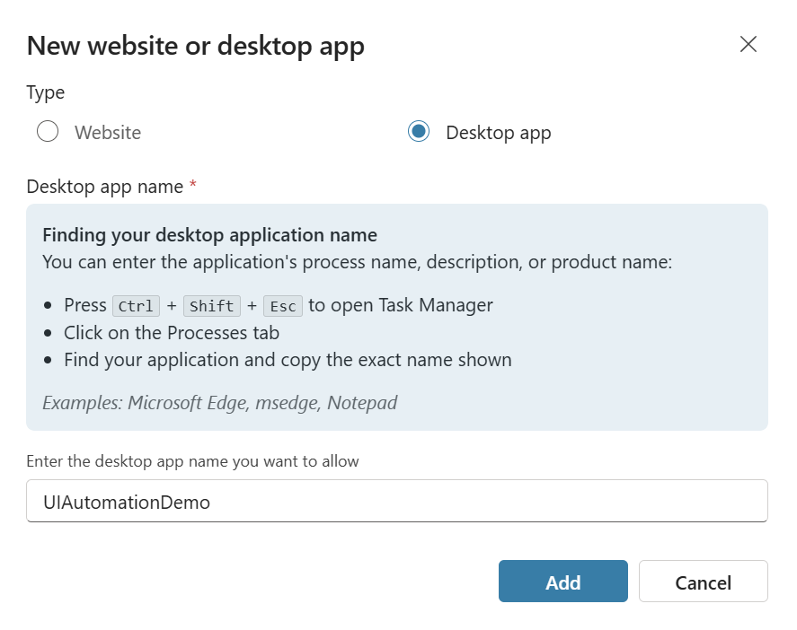
	Figure: Enabling the application allowlist.

	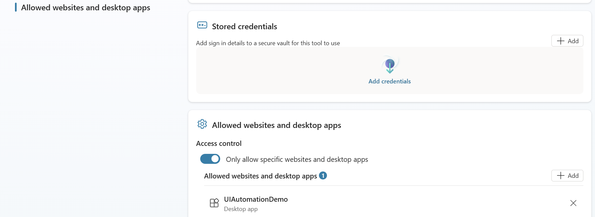
	Figure: Restricting the tool to UIAutomationDemo.

	> ⚠️ **Important:** The process name must match exactly. If a different application is allowed or the name is misspelled, execution stops with an access-control error.

9. Select **Save**.

✅ **Checkpoint:** The **Order details processing** tool is saved, uses the selected bring-your-own machine with maker-provided credentials, has one dynamically filled order input, and allows only `UIAutomationDemo`.

💡 **Reflection:** No API, connector, or coordinate map is required. The agent reads each field label and extracts the matching value. A dynamic input, an application allowlist, and a deliberate credential model turn the demonstration into a controlled, repeatable automation.

## Step 5: Test and observe the agent

1. Open the **Test** pane.

	
	Figure: Opening the agent Test pane.

2. Ask the agent:

	```
	Get the details of order value 13.
	```

	> ℹ️ **Note:** The order value `13` resolves to the exact order **`SO-2024-001013`** in the demo application. The agent passes `13` to the search, and the application returns that single matching order.

	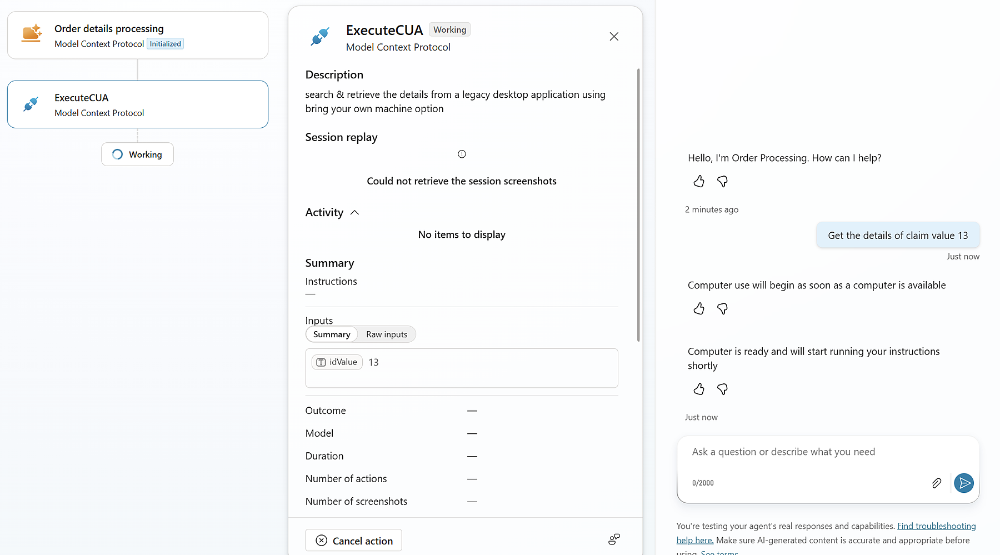
	Figure: The agent collecting the input and starting the Computer Use session.

3. Watch the side-by-side view. The agent's reasoning appears on one side as a step-by-step log of its planned and completed actions, and a recording of the mouse and keyboard actions appears on the other. Notice that the agent locates fields by label rather than by position.

	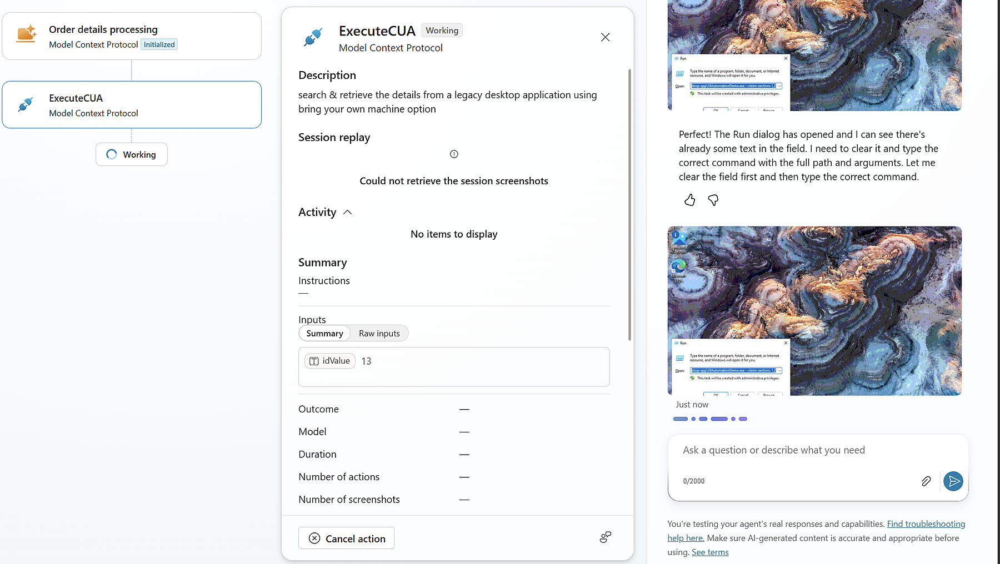
	Figure: Observing the Computer Use session while it runs.

	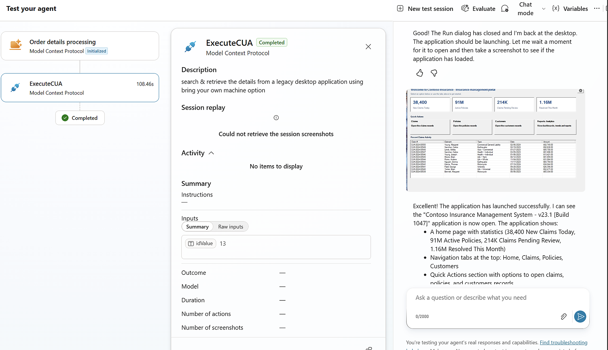
	Figure: The completed run and extracted order values.

4. If a step is ambiguous, edit the tool's plain-language instructions to name the exact UI label, and then run the test again.
5. To add a bounded failure path, append the following instruction so the tool stops predictably instead of retrying indefinitely:

	```
	If any step fails after three attempts, stop the task and report the failed step and any missing fields. Do not continue.
	```

	This is an instruction-level stop condition. It is separate from **Human supervision**, which reviews potentially harmful instructions and must not be relied on as a fail-safe.

6. After the test succeeds, select **Publish**. Publishing saves the current version of the agent; it does not distribute the agent on its own. To let other people use it, share the agent or add it to a channel after publishing.

✅ **Checkpoint:** The agent accepts an order value, signs in to the machine, opens the order application, returns the matching order details, and exposes its reasoning and UI action recording for review.

💡 **Reflection:** You debug Computer Use by refining plain-language instructions rather than changing UI selectors or code. The same approach applies to forms that move or applications whose controls cannot be identified reliably.

## Lab completion

You have completed the lab when all of the following are true:

- The **Order Processing Agent** is in the **Order Automation** solution.
- Generative orchestration is enabled.
- The **Order details processing** Computer Use tool has a dynamic order input.
- A registered machine is enabled for Computer Use and connected to the tool.
- Access is restricted to the `UIAutomationDemo` process.
- A test request returns the order details and produces a reviewable session replay.
- The agent is published.

## Summary and best practices

- Write clear, ordered instructions that name the application, path or URL, and exact field labels.
- Match values to labels instead of relying on field position when an interface can change.
- Collect run-specific values through inputs rather than hardcoding them.
- Never place secrets in instructions or input defaults.
- Allow only the applications and websites the agent requires, and keep HTTPS enforcement enabled for web targets.
- End instructions with a verification action so the agent checks its work.
- Retest after significant UI changes. Computer Use can adapt to small changes, but a test confirms continued reliability.
- Prefer connectors and deterministic actions when an API exists. Use Computer Use for genuinely UI-based work.
- Choose the credential model deliberately, use least privilege, and prefer saved credentials backed by Azure Key Vault.
- Monitor Copilot Credit usage on the agent's **Analytics** page and use the lowest capable model tier. The runtime you choose doesn't change the credits — see [Appendix D](#appendix-d-credit-consumption--runtime-cost-transparency) for the two-meter (credits + machine) cost model.
- Review [Microsoft's Responsible AI principles](https://www.microsoft.com/ai/responsible-ai) when designing production automations.

## Appendix A: Set up the desktop application

1. Download the lab-provided [desktop application archive](resources/desktop-app.zip) to the machine.
2. Extract the archive to `C:\Users\<machine-user>\Downloads\desktop-app\`, open the properties of `UIAutomationDemo.exe`, and mark the file as trusted or unblock it when Windows displays that option.
3. Confirm that the application launches. If organizational policy blocks the executable, use an approved desktop application such as Notepad and adapt the lab instructions to that application.

## Appendix B: Register a machine with Power Automate

If no machine appears in the Machines list, register one. Registration connects a Windows machine directly to the Power Platform environment without a gateway.

### Registration prerequisites

- A physical or virtual Windows machine where you have administrator sign-in.
- The latest Power Automate for desktop installed on that machine.
- A Power Automate license that permits machine management.
- Environment Maker or equivalent permissions in the target environment.

### Register the machine

1. On the target machine, install Power Automate for desktop, which also installs the Power Automate machine runtime. Follow the steps in [Install Power Automate by using the MSI installer](https://learn.microsoft.com/en-us/power-automate/desktop-flows/install#install-power-automate-by-using-the-msi-installer) to download the installer and complete setup.

	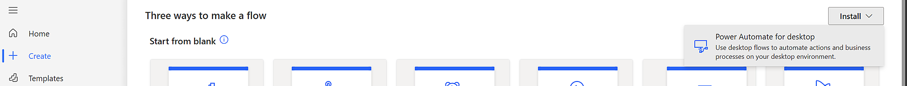
	Figure: Installing Power Automate for desktop and the machine runtime.

2. Launch Power Automate for desktop and sign in with your work or school account.
3. From the Windows Start menu, open **Power Automate machine runtime**.

	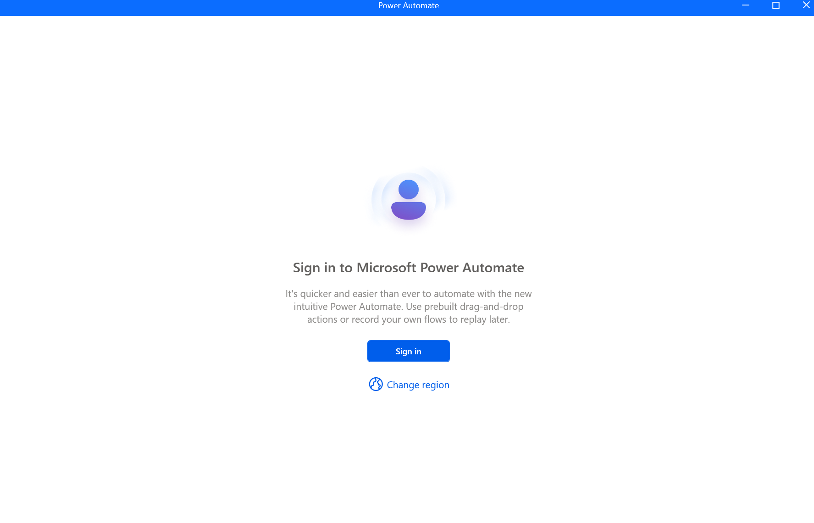
	Figure: Opening the Power Automate machine runtime.

	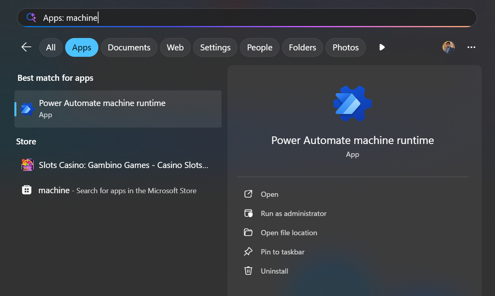
	Figure: The machine runtime before registration.

4. In the machine runtime, select **Machine settings**, and then select **Register a new machine**.

	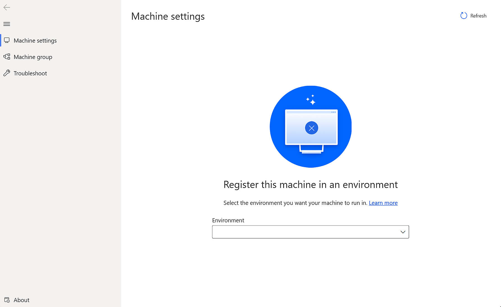
	Figure: Starting machine registration from the runtime settings.

5. Select the same environment used in Copilot Studio. Registration starts automatically.

	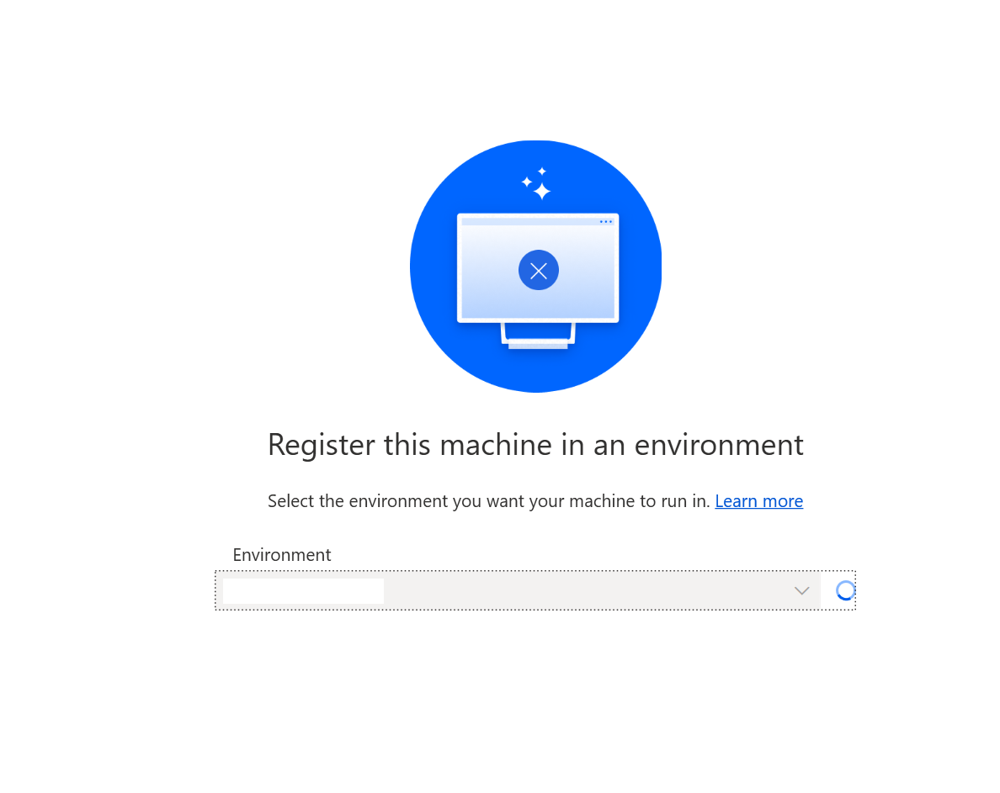
	Figure: Selecting the target Power Platform environment.

6. Wait for registration to finish. Confirm that the runtime displays the machine name, environment, and **Connected** status.

	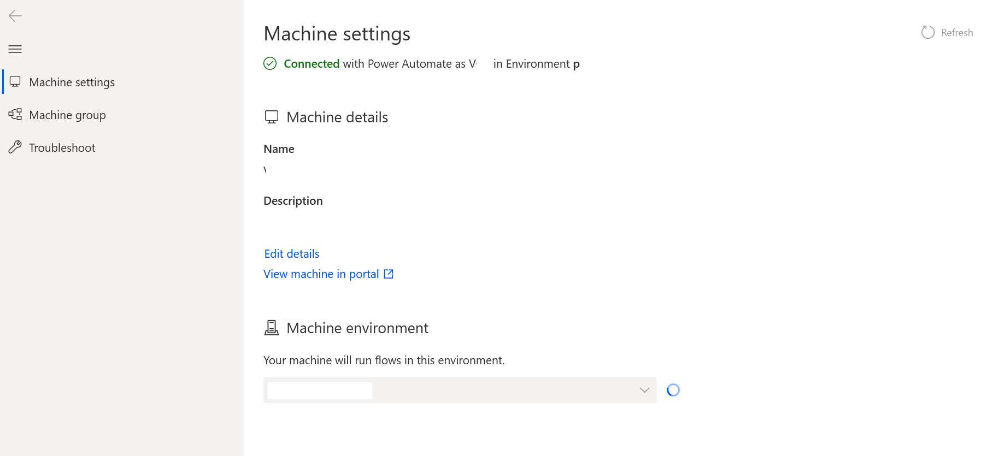
	Figure: Confirming that machine registration succeeded.

7. In [Power Automate](https://make.powerautomate.com/), confirm the environment, and then go to **Monitor** > **Machines**.

	
	Figure: Verifying the registered machine in Power Automate.

8. Confirm that the machine appears in the list, and then return to Step 3 to enable it for Computer Use.

> ℹ️ **Machine notes:** A machine can run Computer Use or RPA desktop flows, but not both simultaneously. Keep the machine powered on and connected. If it does not appear, verify that it was registered in the correct environment and that your account can manage machines.

## Appendix C: Store and rotate Computer Use credentials securely

The target application in this lab needs no sign-in, so its Computer Use credential vault remains empty. In a production scenario, the target application and the bring-your-own machine often require separate credentials. The options below have different scopes and are not interchangeable.

| Option | Secure storage | Update or rotate | Scope | Best for |
| --- | --- | --- | --- | --- |
| Computer Use credential manager | Encrypted in Dataverse or referenced from Azure Key Vault | Edit directly or rotate in Key Vault | Tool | Signing the agent in to the target application |
| Machine credential | Manual connection entry or reusable saved credential, which can be Key Vault-backed | Re-enter manually or update the saved credential once | Machine connection | Signing in to the BYOM machine |
| End-user delegated credential | No stored secret | Nothing to rotate | User and run | Runs that must match the signed-in user |
| Secret environment variable | Value remains in Azure Key Vault; Dataverse stores a reference | Rotate once in Key Vault | Environment and solution | Application lifecycle management across environments |
| Azure Key Vault | Enterprise secret store with RBAC, audit, and optional HSM protection | Versioning and rotation policies | Tenant and subscription | Secure backing store for the other options |

For secure storage and efficient rotation, reference Azure Key Vault secrets from the Computer Use credential manager or a secret environment variable, and use a saved credential for machine access. Store once, rotate once, and reference the credential wherever it is needed.

### Option 1: Computer Use credential manager

1. On the Computer Use tool, open **Credentials** > **Add credentials**.
2. Enter the secret directly, which stores it encrypted in Dataverse, or reference an Azure Key Vault secret.
3. To rotate a directly stored secret, edit the value on the tool. For a Key Vault-backed secret, rotate it in Azure Key Vault.

Learn more about [Computer Use in Copilot Studio](https://learn.microsoft.com/microsoft-copilot-studio/computer-use).

### Option 2: Machine credentials

1. Open the BYOM connection from **Data** > **Connections** or from the designer.
2. Choose **Manual entry** or, preferably, a reusable **Saved credential** that can be backed by Azure Key Vault.
3. To rotate a manual credential, edit the connection. To rotate a saved credential, update it once so every connection that uses it receives the new value.

Learn more about [desktop flow connections](https://learn.microsoft.com/power-automate/desktop-flows/desktop-flow-connections) and [Azure Key Vault credentials](https://learn.microsoft.com/power-automate/desktop-flows/create-azurekeyvault-credential).

### Option 3: End-user credentials

1. On the Computer Use tool, set **Credentials to use** to **End-user credentials**.
2. Each user signs in with their own identity when they run the agent. No shared secret is stored or rotated, but the tool cannot run unattended.

### Option 4: Secret environment variables

1. In your solution, select **New** > **Environment variable**, and set **Data type** to **Secret**.
2. Enter the Azure Key Vault secret resource URL and grant the environment access.
3. Reference the environment variable where the credential is required.
4. Rotate the secret in Azure Key Vault so every environment receives the updated value.

Learn more about [using environment variables for Azure Key Vault secrets](https://learn.microsoft.com/power-apps/maker/data-platform/environmentvariables-azure-key-vault-secrets).

### Option 5: Azure Key Vault

1. Create or reuse a Key Vault and add the credential as a secret.
2. Grant least-privilege access with Azure role-based access control or access policies.
3. Use secret versions and, where supported, a rotation policy with monitoring and audit logs.
4. Surface the secret through the Computer Use credential manager or a secret environment variable.

Learn more about [Azure Key Vault](https://learn.microsoft.com/azure/key-vault/general/overview) and [secret rotation](https://learn.microsoft.com/azure/key-vault/secrets/tutorial-rotation).

> ⚠️ **MFA and Conditional Access:** A stored username and password will not work when the account requires an interactive challenge. For unattended automation, use a dedicated least-privilege automation identity and controls approved by your security team. Never weaken tenant-wide MFA or Conditional Access to make an automation run.

### Credential best practices

- Prefer Azure Key Vault-backed secrets for centralized rotation.
- Use a saved credential for machine access instead of manual entry.
- Apply least privilege to the automation identity and Key Vault access.
- Rotate credentials on a schedule and immediately after suspected exposure.
- Never hardcode secrets in agent instructions or inputs.
- Keep the application credential vault empty when the target application does not require sign-in.

## Appendix D: Credit consumption & runtime cost transparency

A computer-using agent has **two separate cost meters**: the **Copilot Credits** the AI consumes, and the **machine** it runs on. The credit cost is **identical across all runtimes** — only the machine cost and governance change.

### Part 1: Copilot Credits (shared with Module 4)

Computer use bills Copilot Credits per step through the standard harness, at the same rate on every runtime. Rates are set by Microsoft and change over time, so this lab does not restate a fixed number — confirm the current rate in the [Copilot Studio Licensing Guide](https://go.microsoft.com/fwlink/?linkid=2320995). The full model — step counting, per-exercise estimates, drivers, monitoring, optimisation — is documented once here:

👉 **[Module 4 · Appendix A: Credit consumption & cost transparency](../automations-foundation/04-cua.md#appendix-a-credit-consumption--cost-transparency)**

This lab runs the agent interactively from the **Test** pane rather than from an unattended trigger, so the credit driver is **steps per run**. In production, computer use is designed for autonomous (unattended) agents, where the driver becomes **run frequency × steps per run** — forecast on throughput with the [agent usage estimator](https://microsoft.github.io/copilot-studio-estimator/); confirm the latest rate in the [Copilot Studio Licensing Guide](https://go.microsoft.com/fwlink/?linkid=2320995).

### Part 2: Runtime / machine cost (the second meter)

| Runtime | Copilot Credits | Machine cost | Governance & identity | Production | Reference |
| --- | --- | --- | --- | --- | --- |
| **Hosted browser** *(preview)* | Same on every runtime | Managed preview; **may be throttled** | Microsoft-managed; **not** Entra-joined, **not** Intune-managed | ❌ Not recommended; for early experimentation | [Configure runtimes](https://learn.microsoft.com/microsoft-copilot-studio/configure-where-computer-use-runs) · [limits](https://learn.microsoft.com/microsoft-copilot-studio/troubleshooting-computer-use#hosted-browser-limitations) |
| **Cloud PC pool** *(preview)* | Same on every runtime | **Separate Windows 365 for Agents** capacity (autoscales) | **Entra-joined + Intune-enrolled**; reaches M365/SharePoint/Azure | ✅ Scalable, governed | [Cloud PC pool](https://learn.microsoft.com/microsoft-copilot-studio/use-cloud-pc-pool) · [Windows 365](https://learn.microsoft.com/windows-365/) |
| **Bring-your-own-machine** *(this lab)* | Same on every runtime | **No extra Microsoft compute charge** — you own it | Your tenant, your device management | ✅ Reuses existing RPA machines | [Manage machines](https://learn.microsoft.com/power-automate/desktop-flows/manage-machines) |

> 📌 Windows 365 for Agents runtimes are **preview** and priced separately from Copilot Credits — confirm current terms on the linked pages.

**Bottom line:** choose a runtime for **governance and scale**, not to save credits — the credits are the same. BYOM is the low-infra, high-control choice when you already have a machine; Cloud PC pool is the scalable, fully-governed production option.

## Documentation and learning resources

- [Automate web and desktop applications with Computer Use](https://learn.microsoft.com/microsoft-copilot-studio/computer-use)
- [Manage and register Power Automate machines](https://learn.microsoft.com/power-automate/desktop-flows/manage-machines)
- [Manage desktop flow connections](https://learn.microsoft.com/power-automate/desktop-flows/desktop-flow-connections)
- [Create an Azure Key Vault credential](https://learn.microsoft.com/power-automate/desktop-flows/create-azurekeyvault-credential)
- [Use environment variables for Azure Key Vault secrets](https://learn.microsoft.com/power-apps/maker/data-platform/environmentvariables-azure-key-vault-secrets)
- [Azure Key Vault overview](https://learn.microsoft.com/azure/key-vault/general/overview)
- [Automate secret rotation](https://learn.microsoft.com/azure/key-vault/secrets/tutorial-rotation)
- [Run unattended desktop flows](https://learn.microsoft.com/power-automate/desktop-flows/run-unattended-desktop-flows)
