# Module 1: Cloud Flow
<!-- PDF refresh trigger: 2026-07-10 -->

## Overview

In this module, you build an automated order approval process for Northwind Traders using a Power Automate cloud flow. The flow runs when an order is set to **New**, calculates the total order value from its line items, and routes it through a two-tier approval: orders above 1,000 USD require manager approval, and orders above 10,000 USD also require executive approval. If any approver rejects the order, the flow stops immediately. When the order is approved, the flow creates an invoice in Dataverse.

## Why this matters

Manual approval routing slows order processing and introduces risk when emails are missed or follow-up is delayed. A cloud flow standardizes the approval path, enforces thresholds consistently, and creates invoices automatically after approval so sales operations can move faster with fewer manual steps.

## Scenario

Northwind Traders needs to automate order approvals based on total order value. Orders over 1,000 USD require manager approval, and orders over 10,000 USD require an additional executive approval. Rejected orders should stop immediately, and approved orders should create an invoice in Dataverse.

## Core concepts

- Dataverse event triggers for automated cloud flows.
- OData filtering to read related row data.
- Variables, loops, and expressions for value calculation.
- Conditional branching for multi-tier approvals.
- Dataverse row creation for downstream business records.

## Learning outcomes

By the end of this module, you will:

- Create an automated cloud flow triggered by Dataverse events.
- Read and filter related Dataverse rows with OData expressions.
- Use variables, loops, and expressions to transform data.
- Build a conditional, multi-tier approval process that respects approval outcomes.
- Write data back to Dataverse from a flow.
- Organize a flow into a solution, publish it, and test both the approval and rejection paths.

## Prerequisites

This lab is self-contained — you do not need to complete any other module first.

- A **Power Platform developer environment** where you have maker permissions. See [Create a developer environment](https://learn.microsoft.com/power-platform/developer/create-developer-environment). For what the Dataverse and Power Automate capabilities in this lab require, refer to the [Power Platform licensing documentation](https://learn.microsoft.com/power-platform/admin/pricing-billing-skus).
- The **Northwind Traders** solution imported into that environment **and seeded with sample data**. Follow the import and **Northwind Sample Data** app steps in [solutions/README.md](../../solutions/README.md).
- An email-capable account to receive approval requests. Two accounts (or two designated participants) are ideal so approvals land in a different mailbox.

> 💡 **Tip:** One account works too. Assign both approvals to yourself and respond to every request from your own mailbox, the Approvals app in Microsoft Teams, or the Power Automate Approvals center.

- A modern browser such as **Microsoft Edge** or **Google Chrome**.

## Lab instructions

## Step 1: Create the flow and configure the trigger

1. Go to <https://make.powerautomate.com>.

    🔧 **Setup check:** Confirm the environment name in the upper-right corner is the development environment where you imported Northwind Traders. Repeat this check every time you open a maker portal in this lab.

    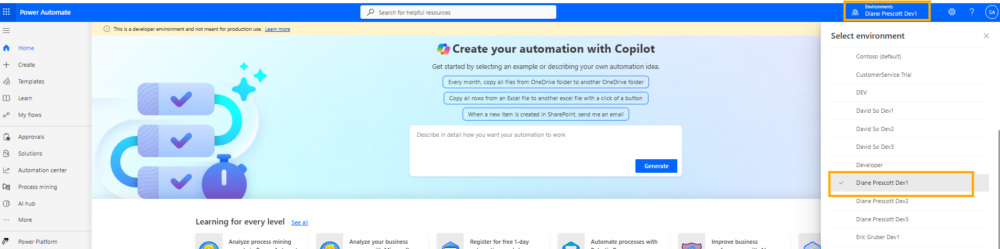  
    Figure: Confirming the environment before you start.

2. Select **My flows** > **New flow** > **Automated cloud flow**.

    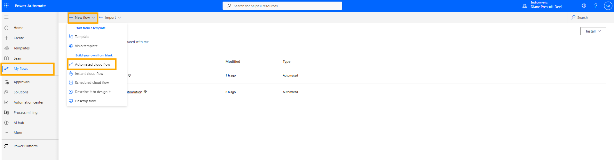  
    Figure: Creating a new automated cloud flow.

3. In **Flow name**, enter `Order Automation`.
4. In the trigger search box, enter `When a row is added, modified or deleted`, select the **Microsoft Dataverse** trigger with that name, and select **Create**.

    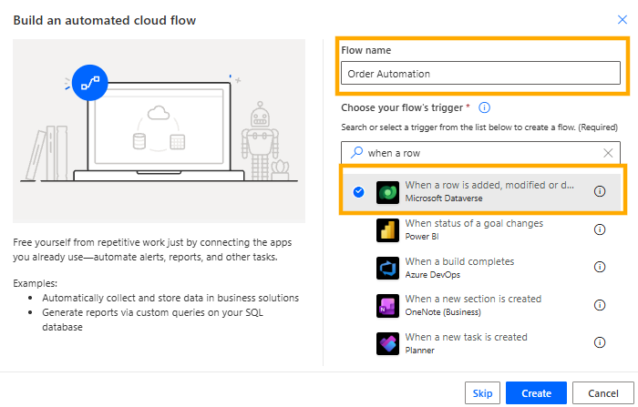  
    Figure: Naming the flow and selecting the Dataverse trigger.

    🔧 **Setup check:** If this is your first time using the Dataverse connector, you are prompted to sign in and create a connection before you can configure the trigger. Sign in with your lab account.

Creating a flow from the Power Automate portal opens the **modern designer** — vertical action cards, a (**+**) button between actions, a configuration pane on the side, and built-in Copilot assistance. This lab's screenshots and layout descriptions follow the modern designer, and every expression is provided as copyable text, so nothing here requires Copilot.

5. Configure the trigger parameters:

    - **Change type**: **Modified**
    - **Table name**: **Orders**
    - **Scope**: **User**

    **Scope** controls whose rows can start the flow, based on who owns the changed row:

    | Scope | The flow runs when the changed row is owned by |
    | --- | --- |
    | User | You (the user of the flow's Dataverse connection) |
    | Business unit | Anyone in your business unit |
    | Parent: Child business unit | Your business unit and its child business units |
    | Organization | Anyone |

    **User** works for this lab because you create the orders yourself, so you own the rows.

    ⚠️ **Important:** If your flow never triggers, check who owns the Order row. With **User** scope, orders created by anyone else are silently ignored — switch to **Organization** if other people will create orders.

6. Leave **Select columns** empty, and in **Filter rows**, enter:

    ```
    nwind_orderstatusid eq 0
    ```

    This is an OData expression. **Order Status** is a choice column, and `0` is the numeric value of the **New** choice — so this filter means "only run for orders whose status is New."

✅ **Checkpoint:** Your trigger shows **Modified**, **Orders**, **User**, and the filter expression.

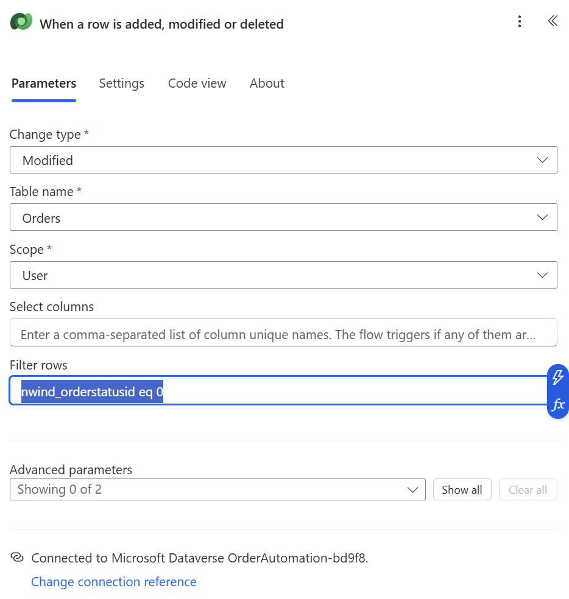  
Figure: The completed trigger configuration.

The flow now runs whenever an order's status is set to **New**. Any later change you save to an order that is still New runs the approval again — that is intended, so changes to a pending order are re-approved. A cloud flow needs a trigger and at least one action before it can be saved, so keep the designer open and continue to Step 2.

## Step 2: Read the order details

The **Orders** table has no total value column. Each order's value lives in its related **Order Details** rows — one row per line item, each with a **Unit Price** and a **Quantity**. In this step, the flow retrieves the line items that belong to the order that triggered it.

7. Select (**+**) below the trigger and select **Add an action**.
8. Search for `List rows` and select the **Microsoft Dataverse** **List rows** action.

    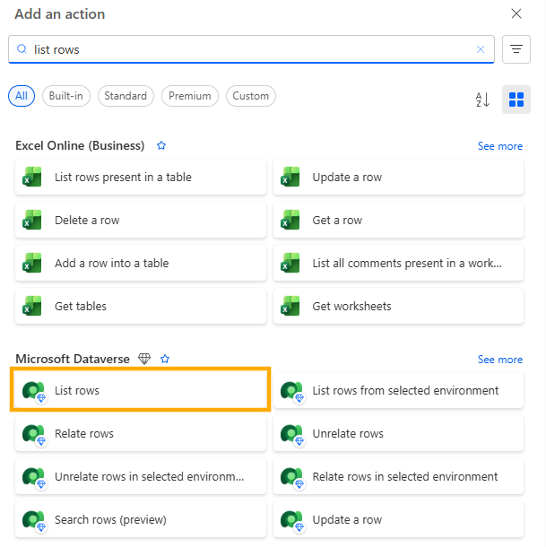  
    Figure: Adding the List rows action.

9. Rename the action to `List Order Details`: select the action card, then select its name at the top of the configuration pane and enter the new name.
10. In **Table name**, select **Order Details**.
11. In **Filter rows**, enter:

    ```
    nwind_OrderID/nwind_ordersid eq @{triggerOutputs()?['body/nwind_ordersid']}
    ```

    In plain English: "give me all Order Details whose parent Order is the order that triggered this flow." The left side is the lookup from Order Details to its parent Order; the right side is the unique identifier of the triggering order.

    🔧 **Setup check:** After pasting, the `@{...}` part should render as a token, not stay as plain text. If it stays as plain text, delete it, type the expression up to `eq `, and insert the order's unique identifier using the dynamic content picker (lightning bolt) instead.

    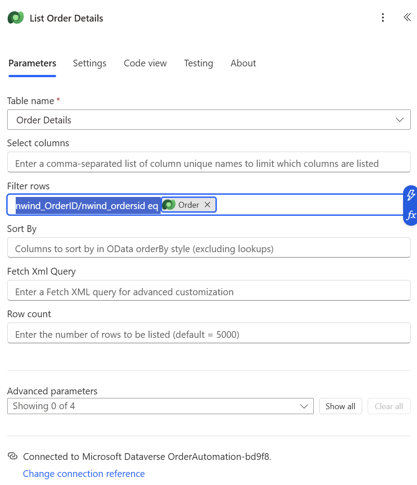  
    Figure: Retrieving the line items for the triggering order.

12. Select **Save draft**.

    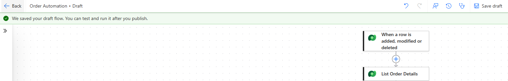  
    Figure: The flow after its first save.

✅ **Checkpoint:** The flow saves without errors, and **List Order Details** shows the **Order Details** table and the filter expression.

## Step 3: Calculate the order value

Each line item's value is **Unit Price × Quantity**, and the order's total is the sum across all line items. In this step, the flow tallies that total into a variable.

13. Select (**+**) below **List Order Details**, search for `Initialize variable`, and add it.
14. Rename the action to `Init Order Value` and configure it:

    - **Name**: `Order Value`
    - **Type**: **Float**
    - **Value**: `0`

    Float suits fractional currency values, and starting at `0` guarantees a correct total.

    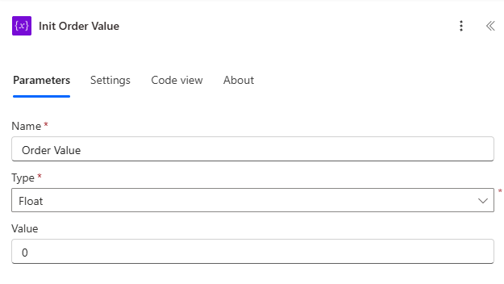  
    Figure: Initializing the order value variable.

15. Select (**+**) below **Init Order Value**, search for `Apply to each`, and add it.
16. Rename the loop to `Calculate Order Value`. In **Select an output from previous steps**, select the lightning bolt and choose **List of items** under **List Order Details**.

    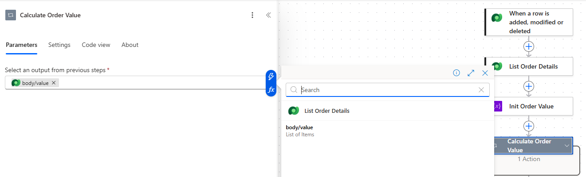  
    Figure: Looping over the retrieved line items.

17. Select (**+**) **inside the loop**, search for `Increment variable`, and add it.
18. Rename the action to `Increment Order Value`. In **Name**, select **Order Value**.

    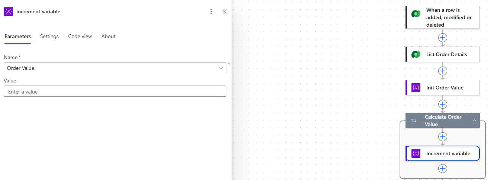  
    Figure: Incrementing the order value once per line item.

19. In **Value**, open the expression editor (**fx**) and add the line item calculation. Either paste this expression directly:

    ```
    mul(item()?['nwind_quantity'], item()?['nwind_unitprice'])
    ```

    Or, in the modern designer, select **Create an expression with Copilot** and enter this prompt, then select **Create expression** and confirm the result matches the expression above:

    ```
    Multiply unit price by quantity
    ```

    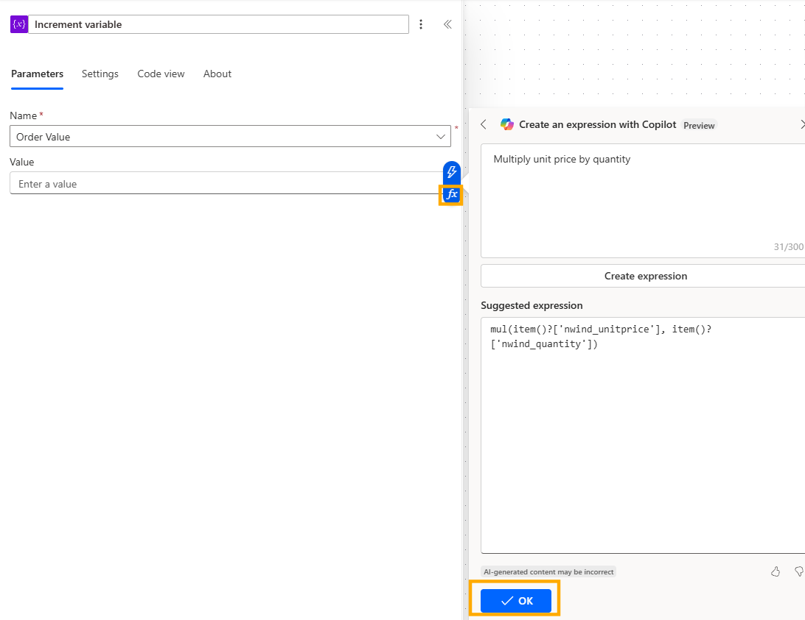  
    Figure: The line item calculation in the expression editor.

20. Select **Add** to accept the expression, then **Save draft**.

Cloud flow expressions use [Power Automate expression functions](https://learn.microsoft.com/azure/logic-apps/workflow-definition-language-functions-reference) such as `mul()` — similar in spirit to Excel formulas.

✅ **Checkpoint:** **Calculate Order Value** loops over **List of items** and contains **Increment Order Value** with the `mul()` expression. After the loop runs, **Order Value** holds the full value of the order.

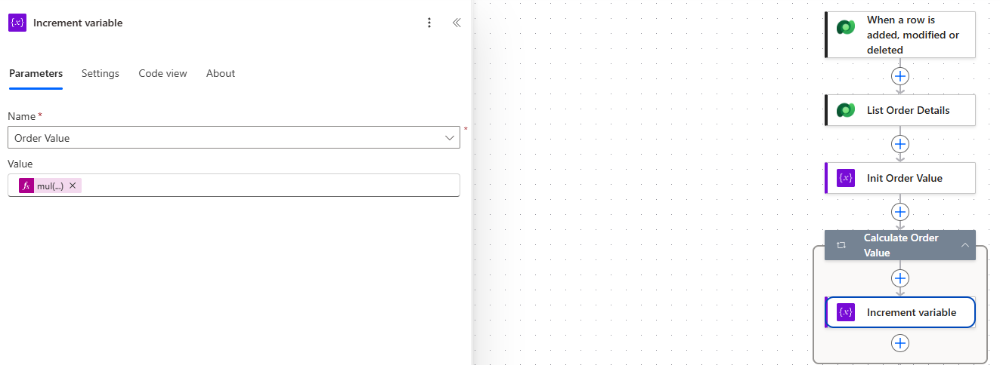  
Figure: Tallying the order total across all line items.

## Step 4: Build the approval process

Orders above 1,000 USD require manager approval, and orders above 10,000 USD also require executive approval. A rejection at either tier must stop the flow — no further approvals, and no invoice.

21. Select (**+**) below the **Calculate Order Value** loop, search for `Condition`, and add it. Rename it to `Manager Approval Required`.
22. Configure the condition: in the left value, select the **Order Value** dynamic value; choose **is greater than**; in the right value, enter `1000`.

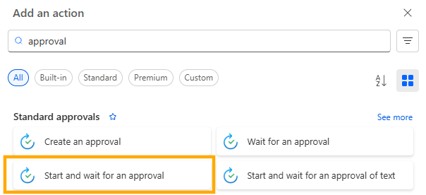  
Figure: Checking whether manager approval is needed.

23. Select (**+**) inside the **True** container, search for `approval`, and add **Start and wait for an approval**. Rename it to `Manager Approval`.

    🔧 **Setup check:** The first time you use the Approvals connector, you are prompted to create a connection. Select **Create** to continue.

24. Configure the approval:

    - **Approval type**: **Approve/Reject - Everyone must approve**
    - **Title**:

    ```
    New Order above 1000 USD: Manager approval required
    ```

    - **Assigned to**: the email address of the account acting as Manager.

    💡 **Tip:** With one account, enter your own address here and in the Executive approval later. With multiple approvers, **Everyone must approve** requires unanimous consent; choose **First to respond** if any one approver should suffice.

25. In **Details**, build this template, replacing each bracketed placeholder with the matching dynamic value from the lightning-bolt picker (all come from the trigger except **Order Value**, which is your variable):

    ```
    Order Date: [Order Date]
    Payment Type: [Payment Type]
    Ships to: [Ship City], [Ship Country/Region]
    Total value: [Order Value] USD
    Notes:
    [Notes]
    ```

    💡 **Tip:** To show the value as tidy currency instead of a raw number, you can replace the **Order Value** dynamic value with the expression `formatNumber(variables('Order Value'), 'C2')`.

    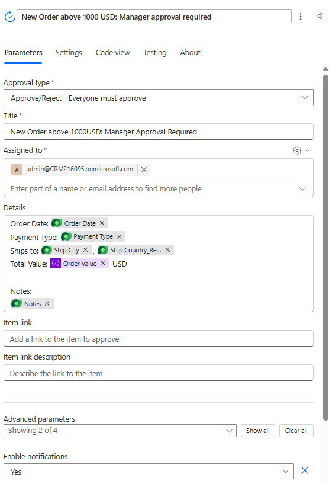  
    Figure: The complete manager approval configuration.

26. Select (**+**) below **Manager Approval** (still inside the **True** container), add a **Condition**, and rename it to `Check Manager Outcome`.
27. Configure it: in the left value, select the **Outcome** dynamic value from **Manager Approval**; choose **is equal to**; in the right value, enter `Approve`.

    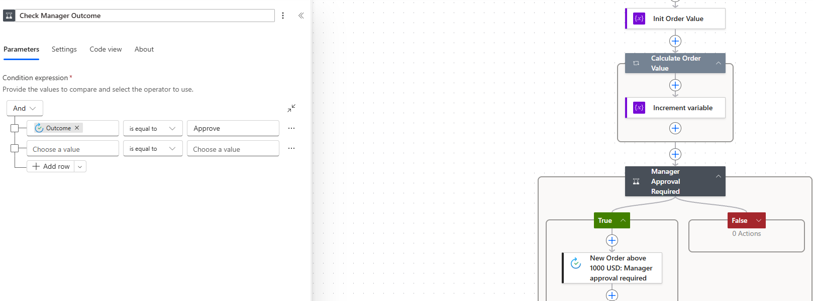  
    Figure: Checking the manager's decision.

28. Select (**+**) inside the **False** container of **Check Manager Outcome**, search for `Terminate`, and add it. Rename it to `End Flow - Manager Rejected` and set **Status** to **Cancelled**. Leave the **True** container empty.

    This is what makes a rejection final: Terminate cancels the run immediately, so no executive request goes out and no invoice is created.

    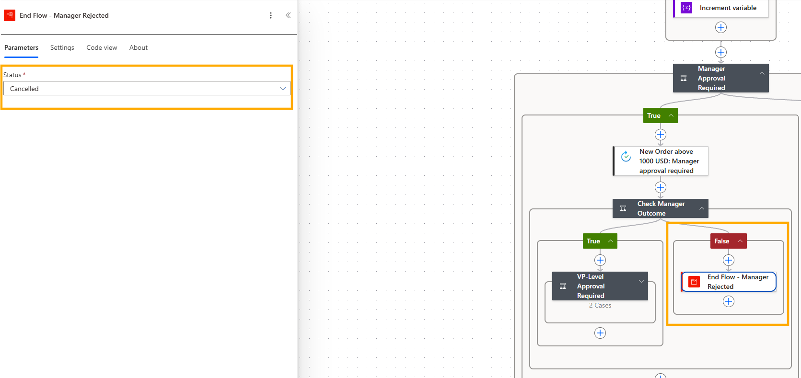  
    Figure: Cancelling the run when the manager rejects.

29. Select (**+**) below **Check Manager Outcome** (still inside the **True** container of **Manager Approval Required**), add a **Condition**, and rename it to `Executive Approval Required`. Configure it: **Order Value** **is greater than** `10000`.

    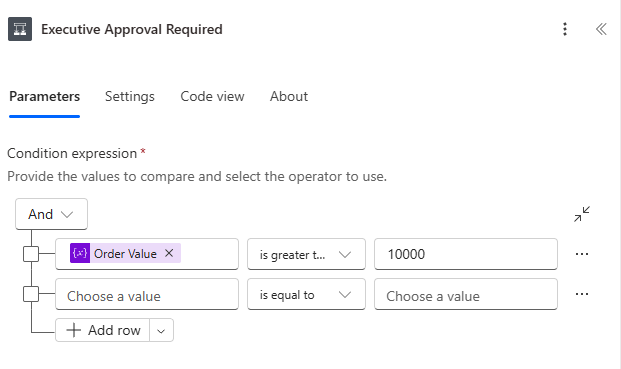  
    Figure: Checking whether executive approval is also needed.

30. Inside its **True** container, add another **Start and wait for an approval** named `Executive Approval`, configured like the manager approval but with the Executive's email address and this title:

    ```
    New Order above 10000 USD: Executive approval required
    ```

    Use the same **Details** template as in action 5.

    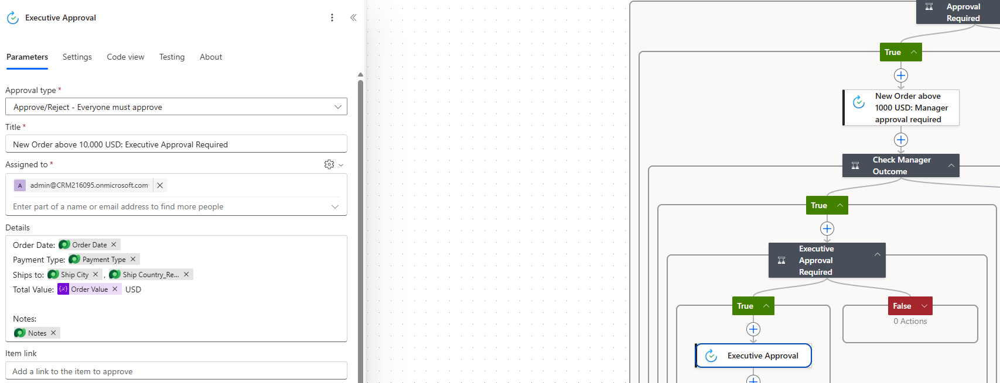  
    Figure: The executive approval configuration.

31. Below **Executive Approval**, repeat the outcome pattern: add a **Condition** named `Check Executive Outcome` (**Outcome** from **Executive Approval** **is equal to** `Approve`), and in its **False** container add a **Terminate** named `End Flow - Executive Rejected` with **Status** set to **Cancelled**.

    🔍 **Verify it yourself:** This mirrors the manager outcome you built in actions 26–28 — the same condition on **Outcome = Approve** with a **Terminate (Cancelled)** in the **False** branch. Compare it against the **Check Manager Outcome** screenshot earlier in this step to confirm your configuration matches; the only difference is that it reads the **Outcome** from **Executive Approval** instead of **Manager Approval**.
32. Select **Save draft**.

✅ **Checkpoint:** Inside **Manager Approval Required** > **True**, you have in order: **Manager Approval**, **Check Manager Outcome** (with Terminate in False), and **Executive Approval Required**, whose **True** container holds **Executive Approval** and **Check Executive Outcome** (with Terminate in False).

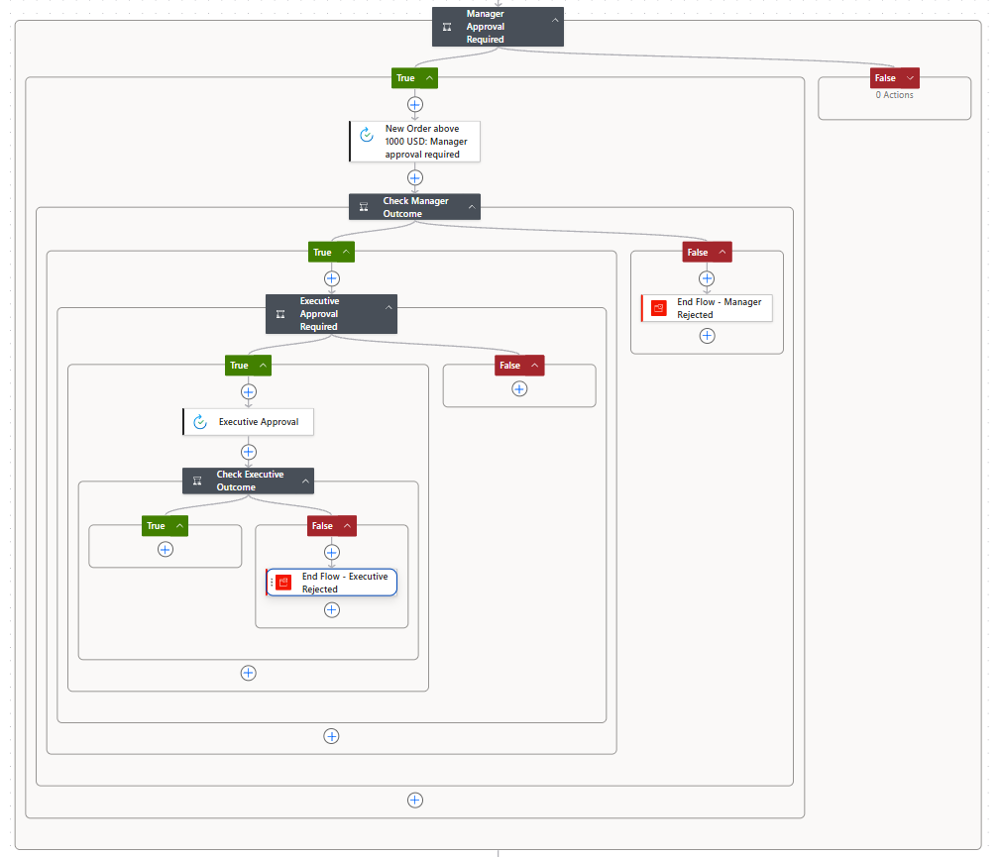  
Figure: The complete two-tier approval structure with rejection handling.

> 💡 Power Automate approvals wait for a response for a maximum of 28 days.

## Step 5: Create the invoice

When the flow reaches the end without being cancelled, the order is approved (or small enough not to need approval), so the flow creates the invoice.

33. Scroll to the bottom of the flow and select the (**+**) at the **top level — below the Manager Approval Required condition, outside all condition containers**. Search for `Add a new row` and add the **Microsoft Dataverse** action.
34. Rename the action to `Create Invoice` and in **Table name**, select **Invoices**.

    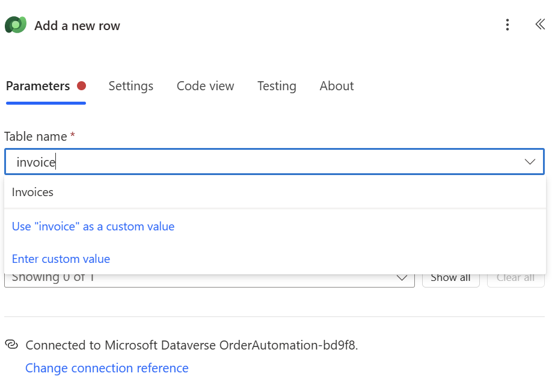  
    Figure: Creating a new row in the Invoices table.

35. Open **Advanced parameters** and select these fields: **Amount Due**, **Due Date**, **Invoice Date**, **Order**.

    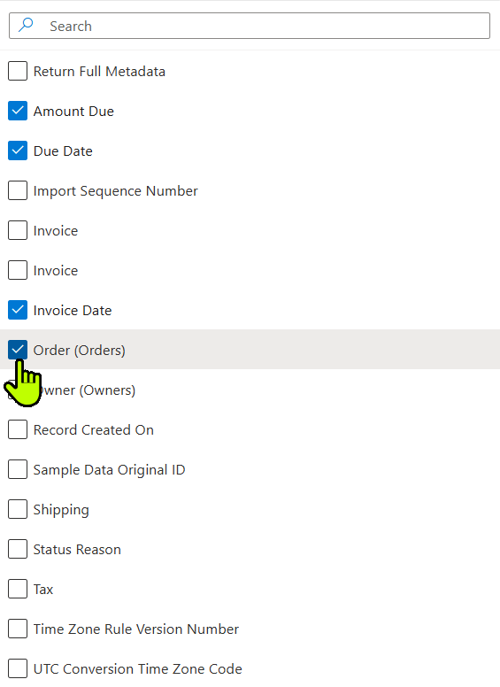  
    Figure: Selecting the invoice fields to write.

36. In **Amount Due**, select the **Order Value** dynamic value.
37. In **Due Date**, open the expression editor (**fx**) and enter:

    ```
    addDays(utcNow(),10)
    ```

    💡 **Tip:** Instead of copying the formula, you can ask Copilot again — select **Create an expression with Copilot** and describe what you need: `Add 10 days to the current date`.

38. In **Invoice Date**, enter the expression:

    ```
    utcNow()
    ```

39. In **Order**, type `/nwind_orderses(`, insert the **Order** unique identifier dynamic value from the trigger, and type `)`. This links the new invoice to the order that triggered the flow, in the format `/Table(RecordID)`.

    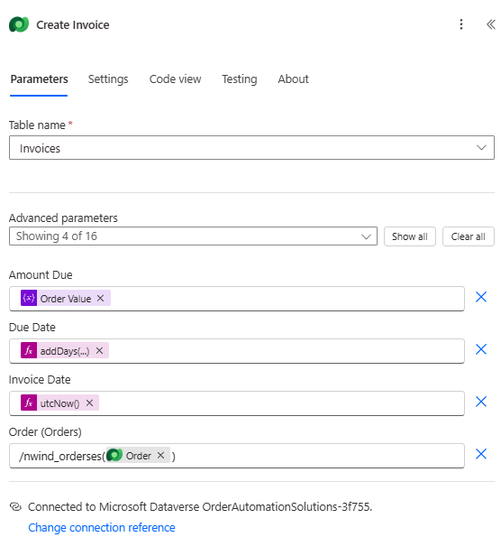  
    Figure: The complete invoice action.

40. Select **Save draft**.

    💡 This flow still lives in **My flows**, so a single save applies. After you add it to a solution in Step 6, the designer gains separate **Save draft** and **Publish** buttons and a version history — you publish it in Step 7. See [Appendix A: Version control for cloud flows](#appendix-a-version-control-for-cloud-flows).

✅ **Checkpoint:** **Create Invoice** sits at the top level after all conditions and writes **Amount Due**, **Due Date**, **Invoice Date**, and **Order**.

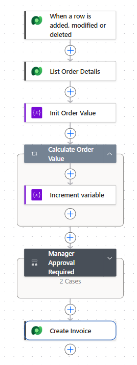  
Figure: The end-to-end flow.

> 💡 Orders of 1,000 USD or less skip both approval branches and arrive here directly — small orders are invoiced without any approval, by design.

## Step 6: Organize the flow into a solution

Solutions group your components so they can be managed, exported, and deployed together — the foundation of [application lifecycle management](https://learn.microsoft.com/power-platform/alm/solution-concepts-alm) on Power Platform. Your flow works without one, but bringing it into a solution is how real projects stay deployable.

41. Go to <https://make.powerapps.com>.

    🔧 **Setup check:** Confirm the environment in the upper-right corner is the same one where you built the flow.

42. Select **Solutions** in the left navigation, then **New solution**.
43. Enter a **Display name** of `Order Automation` and keep the default publisher.

    The publisher stamps its customization prefix on components created in the solution. The default publisher is fine for this lab; real projects [create their own publisher](https://learn.microsoft.com/power-apps/maker/data-platform/create-solution#create-a-solution-publisher) so components carry the organization's prefix.

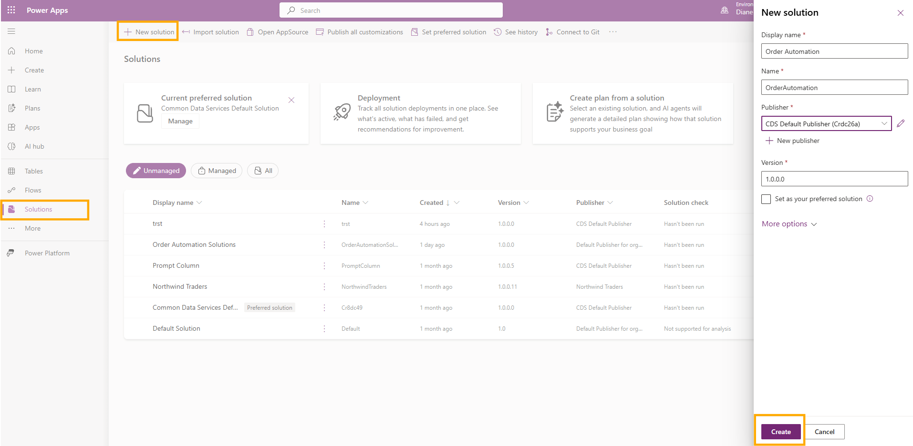  
Figure: Creating the solution.

44. Select **Create** — the new solution opens automatically.
45. Select **Add existing** > **Automation** > **Cloud flow**. If you don't see your flow, check the **Outside Dataverse** tab. Select **Order Automation** and select **Add**.

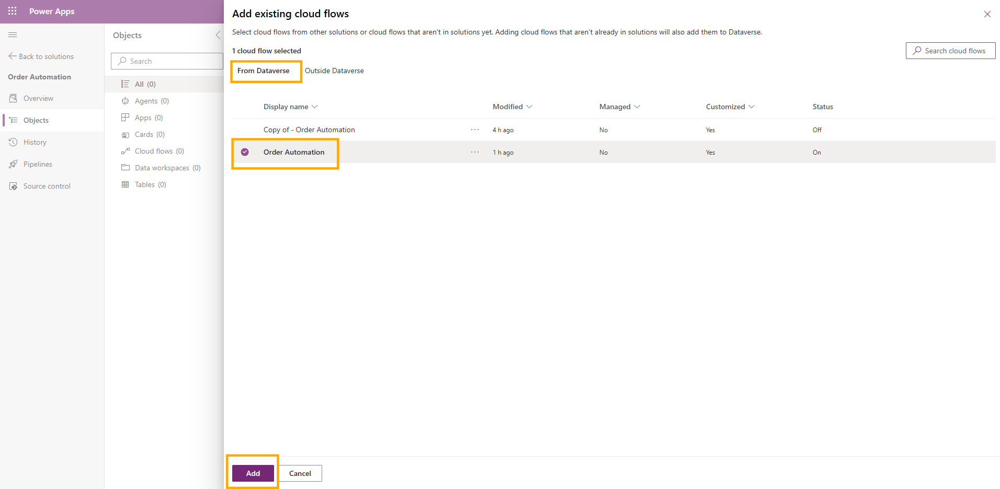  
Figure: Adding the existing flow to the solution.

✅ **Checkpoint:** **Order Automation** appears in the solution's objects. Open the flow's details page and confirm the connection is listed under **Connection references**.

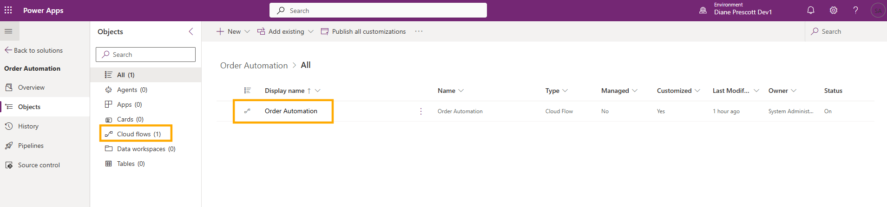  
Figure: The flow organized into a solution.

> 💡 Now that the flow is in a solution, it is **solution-aware**: the designer shows separate **Save draft** and **Publish** buttons, and it keeps a **version history** in Dataverse. See [Appendix A: Version control for cloud flows](#appendix-a-version-control-for-cloud-flows).

## Step 7: Publish and test

46. In <https://make.powerautomate.com>, open **Order Automation** from **My flows**, select **Edit**, and select **Publish** in the designer.

    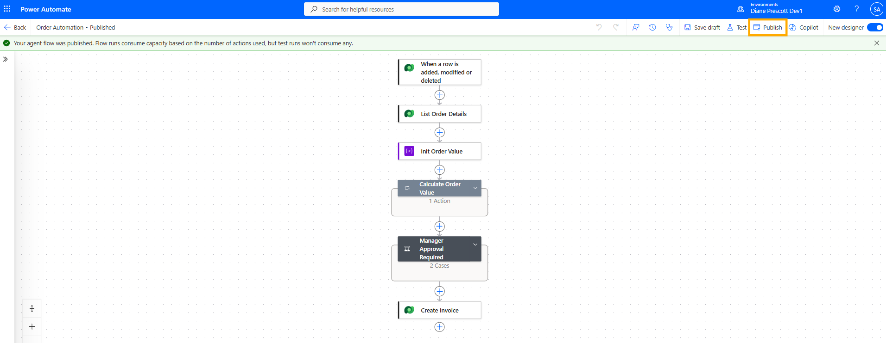  
    Figure: Publishing the flow.

    Because the flow is now solution-aware, **Publish** makes the current version take effect at runtime — runs always use the **last published version**, so draft edits never change live behaviour until you publish. Each publish adds to the flow's **version history**, which you can review or restore later. See [Appendix A: Version control for cloud flows](#appendix-a-version-control-for-cloud-flows).

47. Start the run. The flow's automated trigger fires on its own when you save a **New** order in the next actions — or, to watch the run live as it happens, select **Test** > **Manually** > **Test** first. Both use the same input (saving a New order). See [Appendix B: Ways to test the flow](#appendix-b-ways-to-test-the-flow) for the difference.

    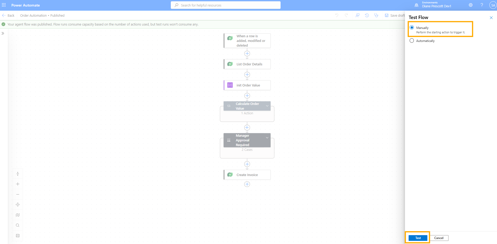
    Figure: Starting a manual test.

48. In a new tab, go to <https://make.powerapps.com>, select **Apps**, and select **Play** on **Northwind Orders (Model-driven)**. If you don't see the app, check the **Shared with me** tab, and confirm you are in the right environment.
49. Select **Orders** > **New**, and select **Save** immediately. This assigns the order number and enables the **Order Details** subgrid.

    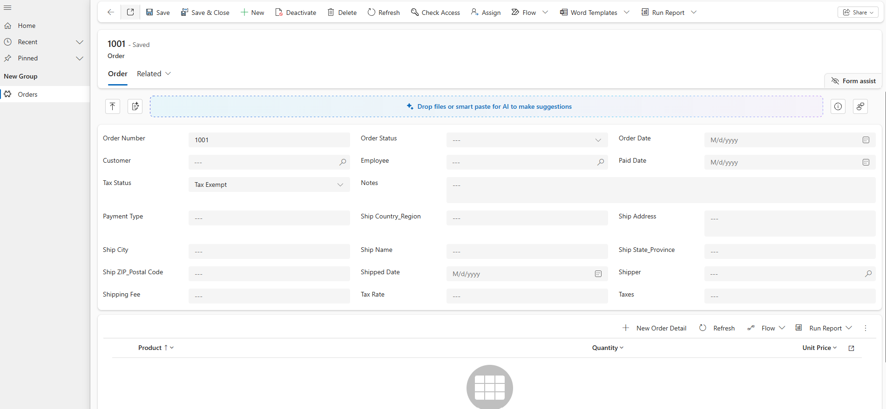  
    Figure: The new order after its first save.

50. In **Order Details**, add at least two line items totaling more than 10,000 USD. Create a new order detail row, and in the product lookup press **Enter** to list the existing seeded products — select one, then set the **Quantity** (and adjust the **Unit Price** if needed). If no suitable product exists, create one inline: select **New Product** in the lookup, enter a name and a **List Price** high enough for the total, and save.

    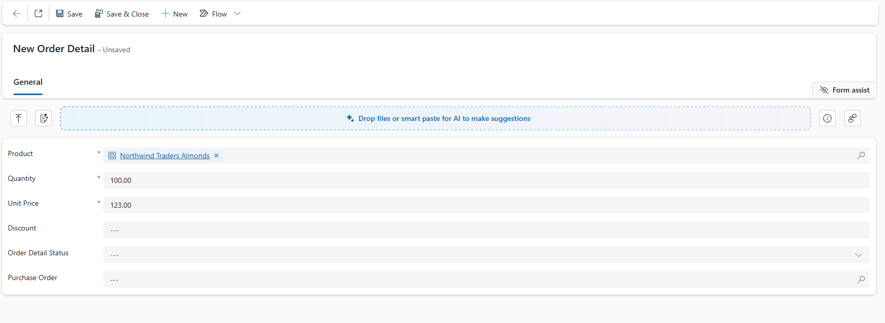  
    Figure: Creating a line item from the seeded products.

    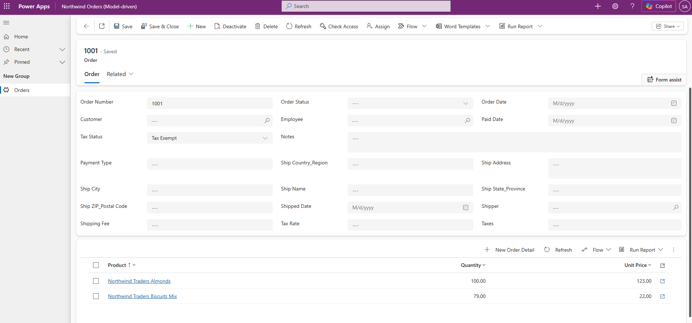  
    Figure: Line items pushing the order above the executive threshold.

51. Fill in the order fields that the approval email displays — **Order Date**, **Payment Type**, **Ship City**, **Ship Country/Region**, and **Notes** — and set **Order Status** to **New**.

    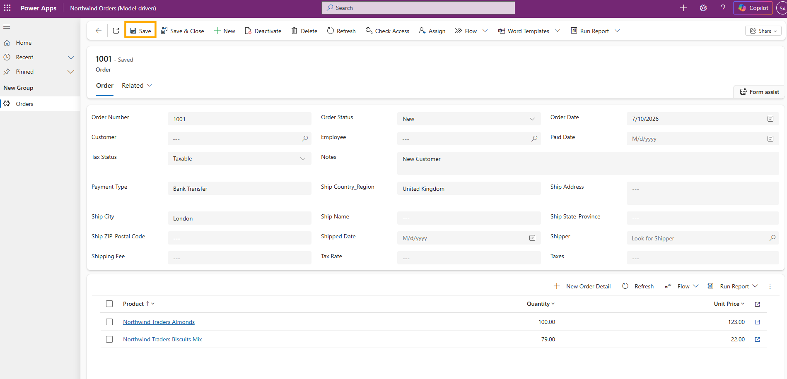  
    Figure: The completed order, ready to submit.

52. Select **Save**.

    ⚠️ **Important:** The flow runs each time you **save** an order whose status is New — changes only reach Dataverse when you save, so the order in which you fill the form doesn't matter. Complete your entries first, then save once. Saving further changes to an order that is still New runs the approval again; that's intended, so edits to a pending order are re-approved.

53. Switch back to the designer and watch the run start — it can take up to a minute in test mode.
54. Open the Manager mailbox, and in the approval email select **Approve**, then **Submit**.

    💡 **Tip:** If the email hasn't arrived, check the junk folder. You can also respond from the **Approvals** app in Microsoft Teams or from **Action items** > **Approvals** in the Power Automate portal.

    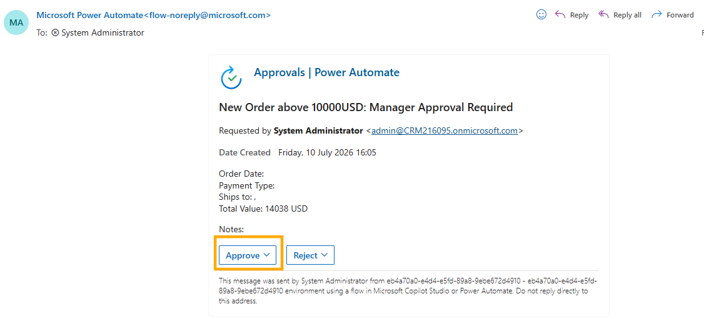  
    Figure: The approval request as the manager receives it.

55. Since the order is above 10,000 USD, open the Executive mailbox and **Approve** > **Submit** there as well.

✅ **Checkpoint:** The run completes successfully. To confirm the invoice, open your order in the **Northwind Orders (Model-driven)** app and use its **Related** tab to view the linked **invoice** directly — check the amount and dates match. Then open the flow's run history from its details page, open the run, and inspect each action's inputs and outputs — this is how you diagnose flows when something goes wrong.

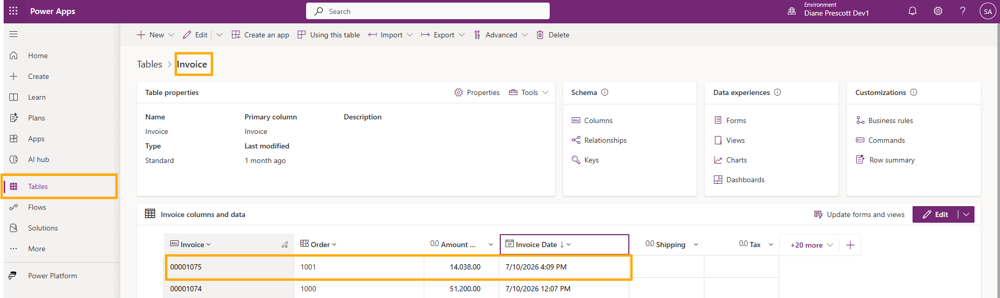  
Figure: The successful end-to-end run.

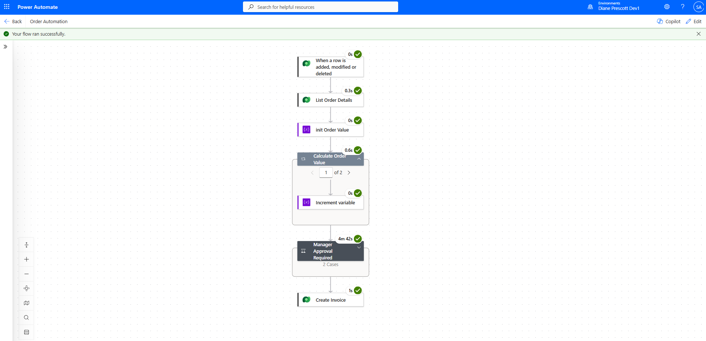  
Figure: The approved order produced an invoice.

56. **Test the rejection path (required):** create one more order following actions 4–7, with a total above 1,000 USD. When the manager approval email arrives, select **Reject**, then **Submit**.

✅ **Checkpoint:** In the run history, the run ends at **End Flow - Manager Rejected** with status **Cancelled**. No executive email was sent, and no new invoice was created.

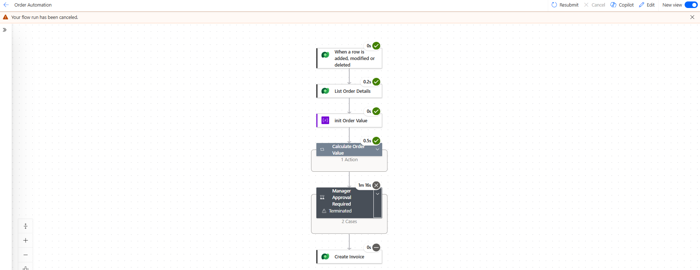  
Figure: A rejection cancels the run before any invoice is created.

🥳 Congratulations — you built, organized, published, and tested a complete two-tier order approval automation, including its failure path.

## Challenge: extend the flow

The requester never hears the outcome. Extend the flow so they do: in the **True** container of each outcome condition, and alongside each Terminate, add a **Send an email (V2)** action that tells the requester whether the order was approved or rejected — and include the approval's **Comments** dynamic value so a rejection carries the approver's reasoning. See [add an email action for approvals](https://learn.microsoft.com/power-automate/modern-approvals#add-an-email-action-for-approvals) for the documented pattern.

## Appendix A: Version control for cloud flows

Once your flow lives in a solution (Step 6), Power Automate keeps a **draft/published version history** for it in Dataverse. This lets you evolve the flow safely and refer back to — or restore — an earlier published version. *(This applies to **solution-aware cloud flows** in the **modern designer** only.)*

### Save draft vs Publish

| Action | What it does |
| --- | --- |
| **Save draft** | Saves your changes to Dataverse **without affecting runtime** — you can save even with errors and keep working at your own pace. The flow shows a **Draft** state next to its title. |
| **Publish** | Makes the current version **take effect at runtime**. The flow shows a **Published** state. Runs always use the **last published version**, so draft edits never change live behaviour until you publish. |

The state indicator (**Draft** / **Published**) next to the flow title tells you whether the version you're looking at is live or has unpublished changes.

### Version history — reviewing and referring to versions

As you publish, a **version history** builds up in Dataverse. Open the flow in the designer and select **Version history** to open the panel. Versions are **grouped by day** and tagged with **Latest version**, **Published**, and **Past published** indicators, so you can tell which one is live and which were previously published.

- **Refer to a version:** versions are distinguished by **timestamp** (each also has an internal GUID). Select a version to **review** it.
- **Compare versions:** open two versions in succession, or in separate browser tabs — a side-by-side view isn't available.
- **Restore a version:** select a previous version > **Restore** > confirm. It becomes the **latest draft**, which you can then publish.
- **Co-owners** see the **full** history from every user, not just their own changes.

> ⚠️ **Why versioning needs a solution:** Drafts and version history are stored in **Microsoft Dataverse**, and only **solution-aware** cloud flows are *defined* in Dataverse — so only they can keep a **Save draft / Publish** split and a **version history**. A **non-solution ("My flows") flow** isn't backed by that Dataverse storage: it has a single definition you update with one **Save**, with no separate draft or version history. To get versioning for such a flow, **add it into a solution** (Step 6) — that writes its definition into Dataverse so versions can be kept.

### Good to know

- **Retention:** draft records expire after **6 months**; published records after **12 months**.
- **Export:** only the **last published version** is exported in a solution — drafts and history aren't.
- **Testing:** drafts can't be tested directly — **publish** a change before testing it at runtime.
- **Notes/titles** on individual versions aren't supported yet.

📚 **Learn more:** [Drafts and versioning for solution-aware cloud flows](https://learn.microsoft.com/power-automate/drafts-versioning) · [Explore the cloud flows designer](https://learn.microsoft.com/power-automate/flows-designer)

## Appendix B: Ways to test the flow

This flow uses an **automated Dataverse trigger** — it runs when an order's status is set to **New** and saved. You can exercise it two ways; both use the **same input** (saving a New order).

### Option 1 — Automatic trigger (recommended)

Just perform the scenario: create an order, add its line items, set **Order Status** to **New**, and **Save**. The published flow picks up the change on its own and runs in the background. This is how the flow behaves in real use.

### Option 2 — Manual test (live run view)

Use this when you want to **watch the run happen** as you save the order:

1. Open the flow in the designer and select **Test** > **Manually** > **Test**. The designer now **waits for the trigger**.
2. Supply the trigger input the same way — create and **Save** a **New** order (the next actions in Step 7).
3. The designer shows the run live, with a green check and a duration on each card as it completes.

💡 A manual test doesn't bypass the trigger — this trigger needs a real Dataverse change, so you still create a New order to start it. **Test > Manually** just gives you the live run view while it happens. To inspect a run after the fact instead, open the flow's **run history** from its details page.

> ⚠️ **Drafts can't be tested** — only a **published** version runs, so publish any change before testing it (see [Appendix A](#appendix-a-version-control-for-cloud-flows)).

📚 **Learn more:** [Explore the cloud flows designer — Test](https://learn.microsoft.com/power-automate/flows-designer)

## Appendix C: Secret handling in cloud flows — mechanisms explained

Cloud flows deal with secrets in three ways: **authenticating to services** (the connections a flow uses), **secrets or config the flow reads or passes at runtime**, and **masking** sensitive values in run history. They are layered — not interchangeable — and **Azure Key Vault** is the secure foundation the strongest options build on. *(These capabilities evolve quickly — always confirm against the latest product releases and the linked Microsoft Learn docs.)*

### At a glance

| # | Mechanism | Used for | Secure storage | Rotation-friendly | Shareable? | Scope | Best for |
|---|---|---|---|---|---|---|---|
| 1 | [**Connection / connection reference**](https://learn.microsoft.com/power-apps/maker/data-platform/create-connection-reference) | Authenticating the flow to a service (SharePoint, Outlook, SQL, Dataverse…) | Token/secret held by the **connection** (OAuth / API key) | ✅ High for OAuth (auto-refresh) | 🟡 Co-owners can **use** embedded connections but **can't edit another owner's credentials**; a shared connection works **only in the flow it was created in**; **Send a copy shares none**; connections **aren't in solutions** (re-provided on import) | Connection / connection reference (ALM) | Standard service auth |
| 2 | [**Environment variables (Secret type)**](https://learn.microsoft.com/power-apps/maker/data-platform/environmentvariables-azure-key-vault-secrets) | Config/secrets across dev/test/prod | Value in **Azure Key Vault**; Dataverse holds a pointer | ✅ High — rotate once in Key Vault | ✅ Yes — travels **in the solution** (the reference); value stays in Key Vault | Environment / solution (ALM) | Secrets carried with a solution |
| 3 | [**Azure Key Vault connector**](https://learn.microsoft.com/connectors/keyvault/) (Get secret) | Fetching a secret **at runtime** in the flow | Value in **Azure Key Vault**, retrieved on demand | ✅ High — rotate in Key Vault | 🟡 Shared via its connection (row 1 rules); the **secret** stays in Key Vault (RBAC) | Flow run (secret in Key Vault) | Reading a secret mid-flow |
| 4 | [**Secure inputs / Secure outputs**](https://learn.microsoft.com/power-automate/flows-designer) (action setting) | **Masking** secrets/PII in **run history** | N/A — hides values in run history and logs | N/A | ✅ Travels with the flow definition (incl. **Send a copy**) | Action | Keeping secrets out of run history |
| 5 | [**Desktop-flow (machine) connection**](https://learn.microsoft.com/power-automate/desktop-flows/desktop-flow-connections) | When a cloud flow **runs a desktop flow** (*Run a flow built with Power Automate for desktop*) — signs in to the target **machine** | Machine sign-in via a **desktop-flow connection** (Saved credential / Manual entry / Connect-with-sign-in) | Depends on method — ✅ High with a Key Vault-/CyberArk-backed Saved credential | 🟡 Desktop-flow connection sharing is limited (service-principal users) | Connection (machine) | Cloud→desktop RPA hand-off |
| 6 | [**Azure Key Vault**](https://learn.microsoft.com/azure/key-vault/general/overview) | The foundation for rows 2–3 (and Saved credentials in row 5) | Enterprise store (RBAC, audit, HSM option) | ⭐ Highest — versioning + rotation policies | 🟡 Via Azure RBAC — grant identities/groups | Tenant / subscription | The secure backing store |

### How to read it

- **Three jobs:** *service auth* (row 1), *secrets the flow reads or passes* (rows 2–3, 5), and *not leaking* them (row 4); row 6 is the **vault** behind the rest.
- **Connections don't travel freely** — a shared connection works **only in the flow it was created in**, and co-owners can't change another owner's credentials. That's why **Key Vault-backed secrets** (rows 2, 3, 6) are the team-friendly path: you share a *reference*, and access is governed by **Key Vault RBAC**.
- **Run-only users** (instant flows): choose whether they **bring their own connection** or **reuse the flow's**.
- Always turn on **Secure inputs / Secure outputs (4)** for any action that handles a raw secret.

### 🔗 The cloud–desktop bridge

Row 5 is where the two products meet: a **desktop-flow (machine) connection isn't only a desktop-flow concept — it's also a cloud-flow connection**, because a cloud flow authenticates to the target machine through it when it calls **Run a flow built with Power Automate for desktop**. For the full machine-credential model — **Saved credential**, **Manual entry**, and **Connect-with-sign-in (passwordless)** — see the desktop-flow secret matrix: **[Module 6 · Appendix E: Credentials and secrets in desktop flows](../automations-advanced/06-rpa.md#appendix-e-credentials-and-secrets-in-desktop-flows--mechanisms-explained)**.

### Recommended pattern

- **Service calls →** connections / connection references (OAuth where possible; connection references for ALM).
- **Secrets the flow needs →** store in **Azure Key Vault**, surface via a **Secret environment variable** or the **Key Vault connector** — never hard-code.
- **Everywhere a secret flows →** enable **Secure inputs / Secure outputs**.
- **Cloud→desktop hand-off →** use a **Key Vault-/CyberArk-backed Saved credential** on the desktop-flow connection (see the linked Module 6 appendix).
- **Foundation →** a **per-environment Azure Key Vault** with least-privilege RBAC and rotation; promote **references**, never secrets.

📚 **Learn more:** [Explore the cloud flows designer (Secure inputs/outputs)](https://learn.microsoft.com/power-automate/flows-designer) · [Environment variables for Azure Key Vault secrets](https://learn.microsoft.com/power-apps/maker/data-platform/environmentvariables-azure-key-vault-secrets) · [Use a connection reference in a solution](https://learn.microsoft.com/power-apps/maker/data-platform/create-connection-reference) · [Share a cloud flow](https://learn.microsoft.com/power-automate/create-team-flows) · [Azure Key Vault overview](https://learn.microsoft.com/azure/key-vault/general/overview)

## Appendix D: Tracking automation value & savings

Once your flow is live, you'll want to show the value it delivers. Power Automate has this **built in** — start there. Only add a custom log when you need a metric the built-in feature can't express.

### Part 1 — Use the built-in Savings feature (recommended, centralized, no build)

Power Automate can calculate how much **time and money** a cloud flow saves, with no custom components. You attach a **saving rule** to the flow, and every **successful run** contributes to its savings.

**Set it up:**

1. Open the flow's details page and select **Savings** in the action bar.
2. Define a rule:
   - **Time-saving rule** — the manual minutes the automated actions used to take (generated per successful run).
   - **Money-saving (hourly rate)** — converts the time-saving into money at a rate you set *(requires the time-saving rule)*.
   - **Money-saving (fixed baseline)** — a set amount saved per successful run.
3. Save the rule. Each successful run then adds to the flow's savings (it can take **up to an hour** to appear; only **successful** runs count — test runs don't).

**See the results — this is your centralized view:**

- A **Savings card** appears on the flow's details page.
- Select **See trend** to open the **Automation Center → Savings** pane, which rolls up the trend for **this flow *and all other flows*** in the environment — the built-in, cross-flow ROI dashboard.

**Good to know:**

- Only **solution-aware** cloud flows can have saving rules (so add the flow to a solution first — see [Appendix A](#appendix-a-version-control-for-cloud-flows)).
- Money amounts are **rounded** (no decimals); an admin can disable the money rule environment-wide.
- Not available in **Dataverse for Teams** environments.
- Viewing/editing rules needs privileges on the **Saving Rule** and **Flow Aggregation** tables (the Environment Maker role has them).

📚 **Learn more:** [Savings in Power Automate](https://learn.microsoft.com/power-automate/savings) · [Explore the automation center](https://learn.microsoft.com/power-automate/automation-center-overview)

### Part 2 — Extend with a custom Dataverse log (only for what the built-in can't capture)

The built-in rule is a **flat, per-successful-run baseline limited to time and money**. Reach for a custom log **only** when you need something it can't express:

- **Per-run, data-driven value** — value that varies by what a run actually processed (e.g., *this* run imported an order worth **12,000 USD / 2 line items**, not a fixed figure).
- **Metrics beyond time/money** — records processed, errors/rework avoided, revenue handled, SLA adherence, custom categories.
- **One store across products and environments** — cloud flows *and* desktop flows *and* Copilot Studio agents, or a cross-environment/tenant rollup.
- **Feeding an external system** (finance/BI) in a custom shape.

If none of these apply, **stop at Part 1** — a custom log would just duplicate the built-in feature.

When they do apply, record the extra detail in a **central Dataverse table** — scalable, relational, RBAC-secured, and reportable in Power BI, with every solution writing to the same table:

**1. Create an "Automation Value Log" table** (in a shared solution) with columns such as:

| Column | Type | Example |
| --- | --- | --- |
| Automation / solution | Text or Choice | `Order Automation` |
| Process step | Text | `Legacy order import` |
| Run ID | Text | correlation ID from the run |
| Business value | Currency | `12000` (actual order value) |
| Records processed | Whole number | `2` |
| Metric category | Choice | `Revenue` / `Records` / `Error avoided` |
| Source key | Text | order number + run ID (for idempotency) |
| Logged on | Date/Time | run timestamp |
| Environment | Text | dev / test / prod |

**2. Write to it from the flow — one action.** After **Create Invoice**, add an **Add a new row** action (the same Dataverse action from Step 5) targeting **Automation Value Log**, and populate the *data-driven* values — for example, **Business value = Order Value** and **Records processed = the line-item count**. This captures what the built-in per-run baseline can't.

**3. Write from anywhere — any Power Platform surface.** Because it's a Dataverse table, **anything that can write to Dataverse can log to it** with the same columns: **cloud flows** (Add a new row), **desktop flows** (Add a new row to selected environment), **Power Apps** (Patch / a form), **Copilot Studio agents**, and even direct API/SDK callers. Point every automation and app at the **same** table, so custom value from all solutions and surfaces aggregates in one central place — no per-product silos.

**4. Report and scale.** Build a **Power BI** report or **model-driven view** over the table; add **row-level security** so teams see only their rows, and check the **Source key** before inserting to stay **idempotent** on re-runs.

**Together:** Part 1 gives the effortless, centralized **time/money** ROI; Part 2 adds **business-specific, per-run** value only where you need it — the two complement each other rather than compete.

📚 **Learn more:** [Create and edit Dataverse tables](https://learn.microsoft.com/power-apps/maker/data-platform/create-edit-entities-portal) · [Microsoft Dataverse connector reference](https://learn.microsoft.com/connectors/commondataserviceforapps/)

## Recommended next step

Continue to [Module 2: RPA](02-rpa.md) to extend this automation with Power Automate Desktop.
