# Module 2: RPA
<!-- PDF refresh trigger: 2026-07-24 -->

## Overview

In [Module 1](01-cloud-flow.md), you built **Order Automation** — a cloud flow that routes new orders through a two-tier approval and creates an invoice. But orders don't only arrive through the Northwind Orders app: some come in as files from legacy systems that have no connection to Dataverse. In this module, you build a **desktop flow** with **Power Automate for desktop** that reads a local order file and creates the order and its line items in Dataverse — feeding the same approval process you built in Module 1, launched with a single keyboard shortcut.

## Learning objectives

By the end of this module, you will:

- Build a desktop flow with Power Automate for desktop.
- Use Dataverse connector actions inside a desktop flow to create and update rows.
- Read and loop over a local CSV file.
- Parse a connector's JSON response to reuse a created row's identifier.
- Trigger a desktop flow with a keyboard shortcut.
- Feed an existing cloud-flow automation from robotic process automation (RPA).

## Prerequisites

This module continues Module 1. You need:

- **Module 1 completed** in your development environment: the **Order Automation** cloud flow built, published, and tested, and the **Order Automation** solution created.
- A **Windows machine** with **Power Automate for desktop** installed and signed in with the **same lab account** you used in Module 1. For system requirements and installation, see the [Power Automate for desktop installation guide](https://learn.microsoft.com/power-automate/desktop-flows/install).
- An environment where the **desktop-flow and Microsoft Dataverse capabilities** used in this module are **available to your account**. Licensing, entitlements, and trials change over time — see the [Power Automate licensing documentation](https://learn.microsoft.com/power-platform/admin/power-automate-licensing/types) to confirm what your scenario requires.

## Business use case

**Scenario:** Not every Northwind Traders order is entered in the Orders app. A regional partner still sends orders as files — data that today someone retypes by hand, and that never enters the approval process until they do.

**Solution:** A desktop flow that reads the order file from the local machine and creates the order and its line items directly in Dataverse. The approval automation from Module 1 takes over from there — one governed process, whether an order arrives through the app or from a legacy file.

## Step 1: Prepare the sample order file

The order line-items file is a CSV with one row per line item — it holds the order's **line-item data only**. The order **header** values (date, payment type, shipping, notes) are set later, in Step 4. Each row names a product by its unique identifier, so first you collect two product IDs from your environment.

1. Go to <https://make.powerapps.com>.

    🔧 **Setup check:** Confirm the environment in the upper-right corner is the one where you built Module 1.

2. In the left navigation, select **Tables**, search for `Order Product`, and open the **Order Product** table (logical name `nwind_products`).

    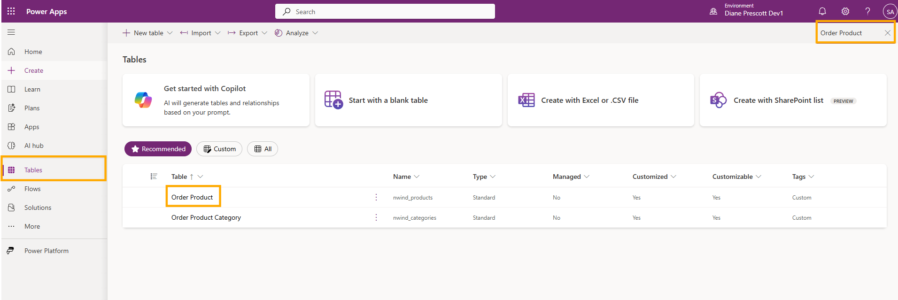  
    Figure: Finding the Order Product table.

3. The data view opens showing the **Product Name** column. Each product's unique identifier lives in a column that is also called **Product** — it's the table's primary key, and it's hidden by default. Select the column options at the end of the header row (**+ more**), choose the **Product** column, and select **Save** to show it.

    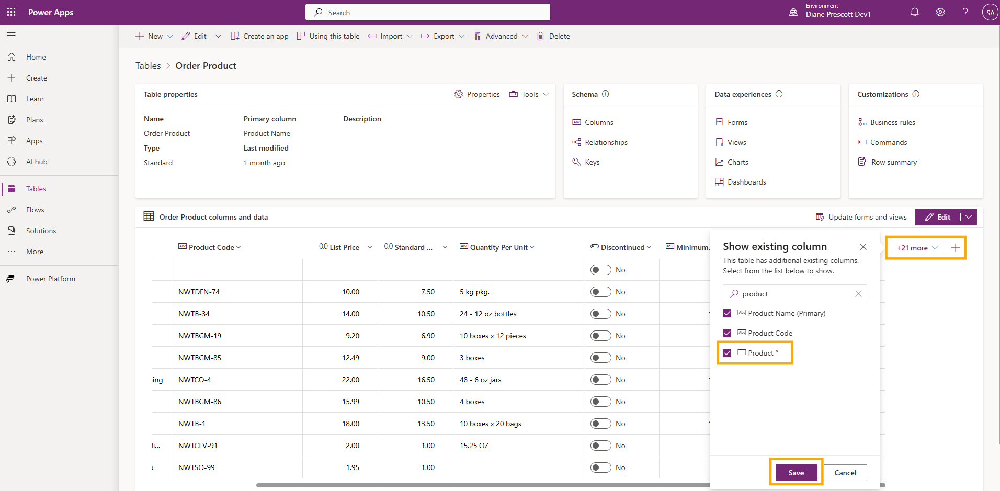  
    Figure: Adding the Product identifier column to the view.

    Filter the **Product Name** column and search for **Northwind Traders Clam Chowder** and **Northwind Traders Almonds** — the two products the order file uses — then copy each one's value from the **Product** identifier column. If you don't see a product, select **+ additional rows** at the bottom of the grid to load more rows.

    💡 **Tip:** To copy an identifier, select its cell and press `Ctrl+C` — the grid has no right-click copy option.

    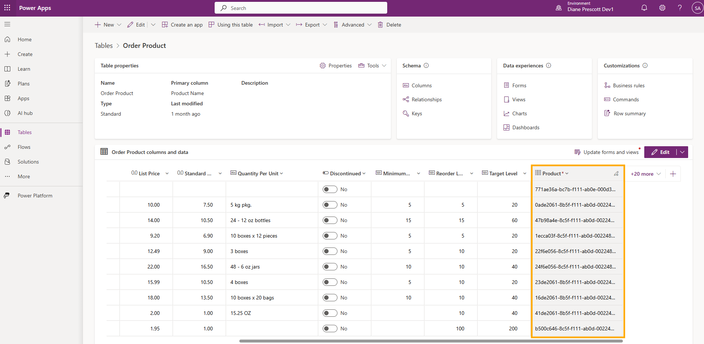  
    Figure: The identifiers shown next to the product names — copy both.

4. Now create the order file. Open **Notepad**, paste the content below, and replace the two placeholder identifiers with the ones you copied:

    ```
    ProductName,ProductID,Quantity,UnitPrice
    Northwind Traders Clam Chowder,PASTE-CLAM-CHOWDER-ID,120,50
    Northwind Traders Almonds,PASTE-ALMONDS-ID,80,75
    ```

    Select **File** > **Save as**, set **Save as type** to **All files**, name the file `Order.csv`, and save it to your desktop.

    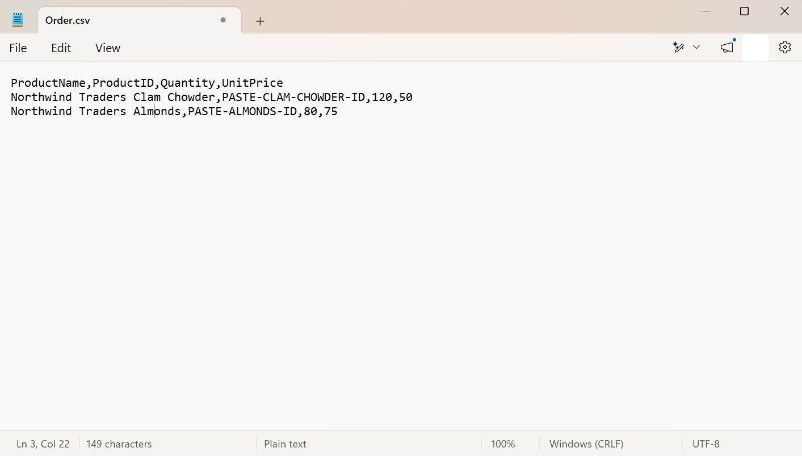  
    Figure: The finished order file — plain text, one line item per row.

    ⚠️ **Important:** If you build the file in Excel instead, save it with **Save as** > **CSV (Comma delimited) (*.csv)** — the default `.xlsx` format can't be read by the **Read from CSV file** action.

✅ **Checkpoint:** `Order.csv` sits on your desktop with a header row, two line items, and both product identifiers filled in. The sample's quantities and prices total 12,000 USD — deliberately over the 10,000 USD threshold from Module 1, so a successful import should demand **both** the manager and the executive approval.

## Step 2: Create the desktop flow

1. Open **Power Automate** on your Windows machine and sign in with your lab account.

    🔧 **Setup check:** Select **Settings** and confirm the account and environment match Module 1 — a desktop flow signed in as anyone else creates orders the approval flow silently ignores, because its trigger uses **User** scope.

2. Select **New** > **Flow**.

    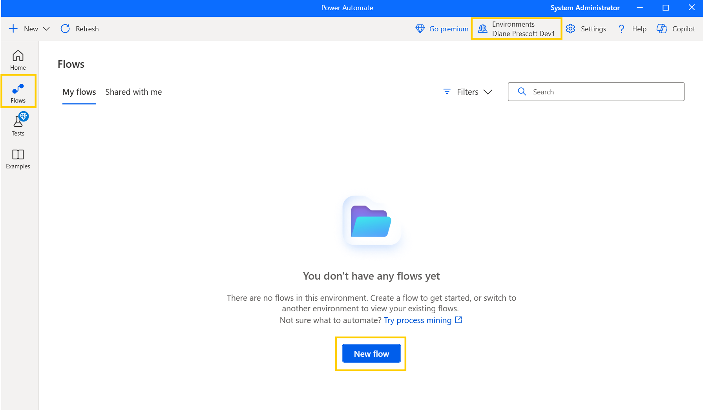  
    Figure: Creating a new desktop flow.

3. In **Flow name**, enter:

    ```
    Import Legacy Orders
    ```

4. Leave **Power Fx enabled** switched **off**, leave the other options at their defaults, and select **Create**.

    ⚠️ **Important:** Every expression in this lab uses the `%variable%` notation, which only works when **Power Fx enabled** is off. Enabling Power Fx replaces this notation with a different formula language — a per-flow choice made at creation — so if you switch it on, none of the expressions below will work.

    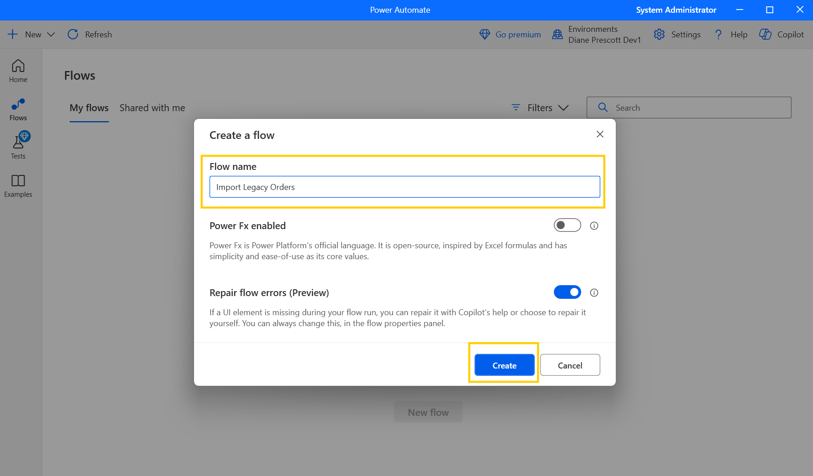  
    Figure: The flow creation dialog with Power Fx off.

Selecting **Create** opens the flow designer **in a new window**: an **Actions** pane on the left to search for actions, a canvas in the middle where actions run top to bottom, and a **Copilot** pane on the right. The pane this lab uses on the right is **Variables** — it isn't shown by default, so select the **{x}** (Variables) icon on the right edge to open it. It lists every variable the flow produces. The console stays open in the background — you return to it in Step 8.

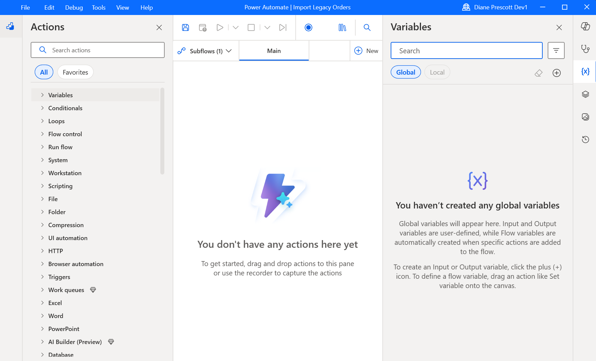  
Figure: The flow designer — open the Variables pane from the right edge.

The flow you build next reads the file first, creates the order **without** a status, and sets the status to **New** as its final action. In the app, the approval flow fired when you *saved* the completed order with status New; in a desktop flow every action writes to Dataverse immediately, so that final status update plays the role of the save — it's the modification that fires the approval flow.

## Step 3: Read the order file

1. In the **Actions** pane, search for `Read from CSV` and double-click **Read from CSV file**. In **File path**, select the file-picker icon and browse to `Order.csv` on your desktop — the full path, such as `C:\Users\<username>\Desktop\Order.csv`, is filled in for you. Expand **Advanced**, switch on **First line contains column names**, and check that the **delimiter** and **encoding** options match your file — set the delimiter to a **comma** if your regional settings use a different list separator, and choose the encoding you saved the file with. Rename the produced variable to `fOrdersCSV` and select **Save**.

    The `f` prefix marks the variables this flow produces (such as `fOrdersCSV`), so they're easy to spot in expressions later.

    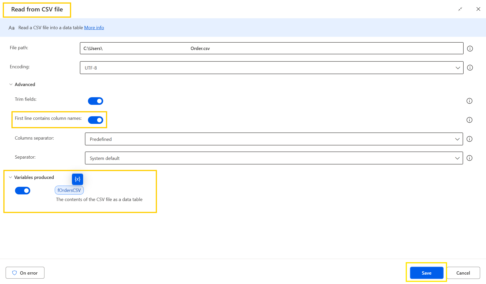  
    Figure: Reading the order file into a table.

    💡 **Tip:** Reading the file first means a missing or broken file stops the flow before anything is written to Dataverse.

    ⚠️ **Important:** The file picker stores this **absolute path for your machine only** — moving or renaming `Order.csv`, or running the flow on a different machine, breaks the run until you re-point the action.

## Step 4: Create the order — without a status

1. Add a **Get current date and time** action (under **Date time**), producing `CurrentDateTime`. The order should carry the date it was imported.

    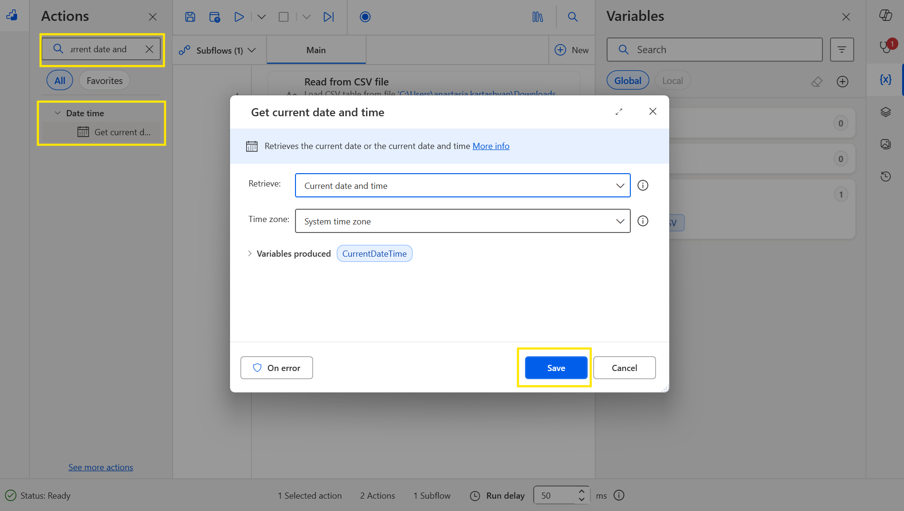  
    Figure: Capturing the import date.
2. Add an **Add a new row to selected environment** action (under **Microsoft Dataverse**). If you completed Module 1 with this account, a Dataverse connection already exists and the action opens straight to its parameters.

    🛠️ **Troubleshooting — first-time connection:** If you're asked to sign in or create a Microsoft Dataverse connection, follow [Appendix A: Create a Microsoft Dataverse connection](#appendix-a-create-a-microsoft-dataverse-connection), and then reopen the action.

3. Select your **Environment**, and in **Table name** select **Orders**. Wait for the columns to load, expand **Advanced**, and configure the fields below.

    What you're building here is the automated version of what you did by hand in Module 1's test: create an order, fill in its details and line items, and save it with the status **New** — it was that save that fired the approval flow. This action is the "create an order and fill in its details" part; the role of the save is played by the status update in Step 7.

    These are the **order header** values. The CSV supplies only the *line items* — one product row each, which Step 6 loops over. For simplicity, this lab sets the header values as fixed entries here; in a real import, they would come from your file as well, read the same way the line items are.

    ⚠️ **Lab-only defaults:** The **Payment Type**, **Ship City**, and **Ship Country/Region** below are **fixed sample values for this lab** — they are *not* read from `Order.csv`. In a real import you would map them from the source file.

    - **Order Status**: leave **empty**
    - **Order Date**: `%CurrentDateTime%`
    - **Payment Type**: `Credit Card`
    - **Ship City**: `London`
    - **Ship Country/Region**: `United Kingdom`
    - **Notes**:

    ```
    Imported from legacy order file by desktop flow.
    ```

    These are the fields Module 1's approval email displays — filling them here means the approvals for imported orders arrive complete, not blank.

    ⚠️ **Important:** leave **Order Status** empty. The status is set at the very end of the flow, *after* the line items exist — that update is what triggers the approval flow, and by then the order's full value is in place for it to calculate.

    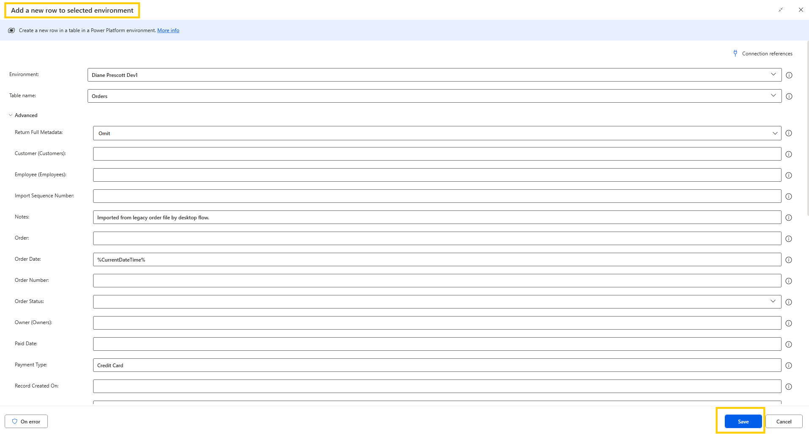  
    Figure: The order-creation action — status deliberately empty.

4. Rename the produced variable to `fResponse` and select **Save**.

    You can rename a produced variable inside its action or from the Variables pane. See [Appendix B: Rename produced variables](#appendix-b-rename-produced-variables) for both methods.

    ⚠️ **Partial imports:** This flow creates the order **before** its line items and final status, so if a later action fails (JSON parsing, a product lookup, or a line-item insert) the run can leave an **incomplete order** in Dataverse — created, but with no line items and no status. If a run fails partway, open the **Admin Management App** > **Orders**, find the order with the current import date and no line items or status, and **delete it** before re-running. (A production import would add error handling instead — see the closing discussion.)

## Step 5: Extract the order's identifier

1. Add a **Convert JSON to custom object** action (under **Variables**). In **JSON**, enter:

    ```
    %fResponse%
    ```

    Rename the produced variable to `fObject` and select **Save**.

    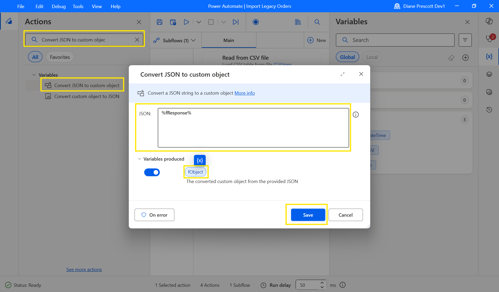  
    Figure: Parsing the create-order response.

2. Add a **Set variable** action. Name the variable `fOrderId`, and in **Value**, enter:

    ```
    %fObject['nwind_ordersid']%
    ```

    This is the created order's unique identifier — the same value Module 1's Step 5 used to link the invoice to its order.

    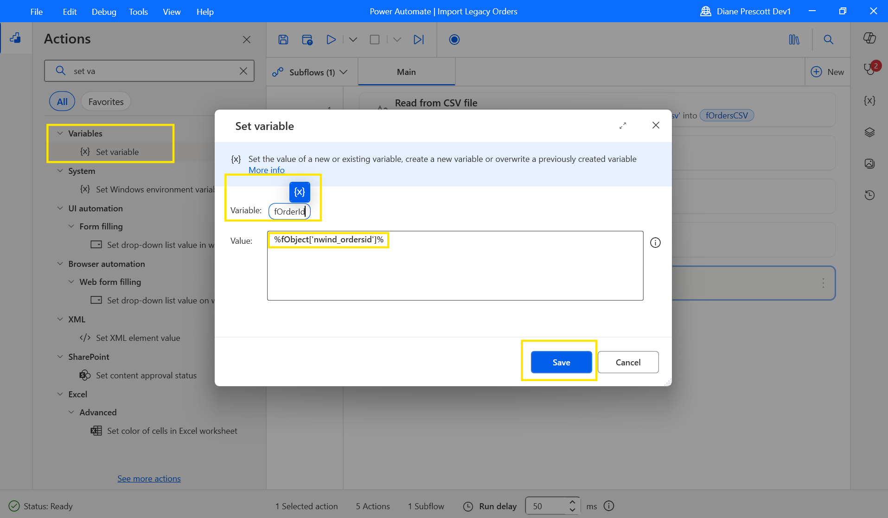  
    Figure: Extracting the order's identifier from the parsed response.

3. Select **Save draft** in the designer toolbar to save the flow.

    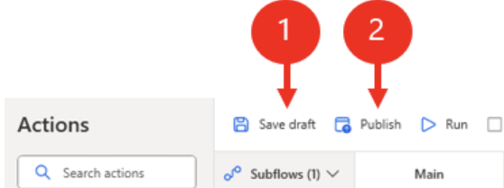  
    Figure: The desktop flow designer toolbar with **Save draft** and **Publish** (alongside **Run**).

    💡 **Note:** Desktop flows are **stored in Dataverse by default**, so the **Save draft** and **Publish** buttons are available for **any** desktop flow — you don't need to add it to a solution first (unlike cloud flows, where these buttons appear only for solution-aware flows). **Save draft** keeps your changes without affecting runtime; **Publish** (used in Step 7) makes the current version the one that runs.

## Step 6: Create the line items

1. Add a **For each** action (under **Loops**). In **Value to iterate**, enter `%fOrdersCSV%`, rename the stored item to `fOrderItem`, and select **Save**.

    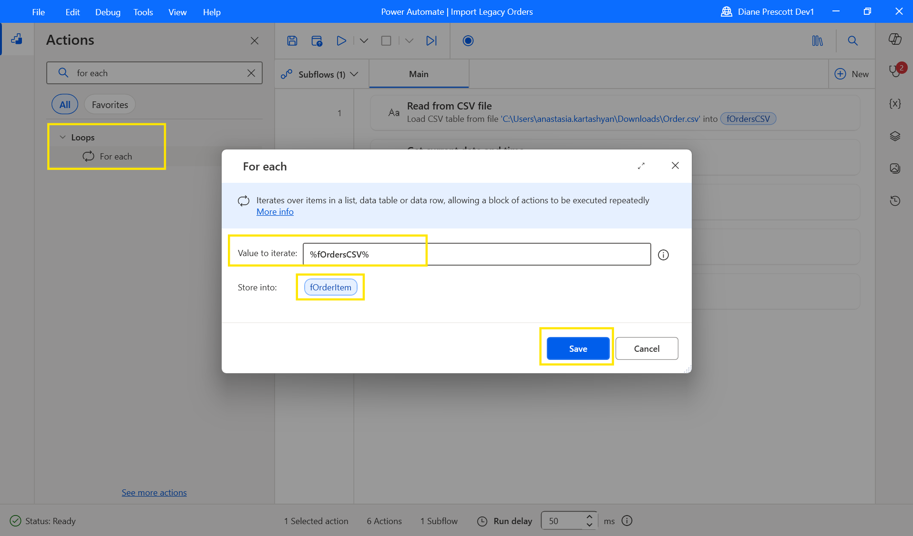  
    Figure: Looping over the order file's rows.

2. Inside the loop, add an **Add a new row to selected environment** action:

    - **Environment**: your development environment
    - **Table name**: **Order Details**
    - **Order (Orders)**:

    ```
    /nwind_orderses(%fOrderId%)
    ```

    - **Product (Order Products)**:

    ```
    /nwind_productses(%fOrderItem['ProductID']%)
    ```

    - **Quantity**:

    ```
    %fOrderItem['Quantity']%
    ```

    - **Unit Price**:

    ```
    %fOrderItem['UnitPrice']%
    ```

    Select **Save**. Leave the produced variable at its default name — unlike `fResponse` in Step 4, nothing later in the flow reads this response, so there's no need to rename it. The `/table(identifier)` format is the same lookup syntax you used for the invoice's **Order** field in Module 1.

    💡 **Tip:** This creates line items only — the products themselves already exist in Dataverse, and the `ProductID` from the file just points each line item at one of them. The `ProductName` column is never sent; it's only there to keep the file readable.

    ⚠️ **Expected failure:** Each line item needs a valid **ProductID**, **Quantity**, and **UnitPrice**. If any is blank or malformed in the CSV — or a ProductID doesn't match a product in Dataverse — the **Add a new row** action fails for that row and stops the run, leaving the order created but missing some or all line items. Check the file's values before running.

    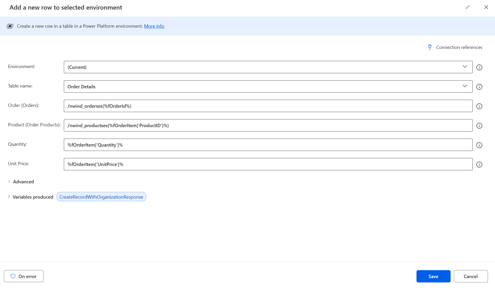  
    Figure: Creating one line item per CSV row.

## Step 7: Submit the order for approval

1. Below the loop — at the top level, not inside it — add an **Upsert a row in selected environment** action:

    - **Environment**: your development environment
    - **Table name**: **Orders**
    - **Row ID**: `%fOrderId%`
    - Under **Advanced**, **Order Status**: `0`

    Choice columns take the choice's numeric value here, and `0` is **New** — the exact value Module 1's trigger filter checks (`nwind_orderstatusid eq 0`).

    **Why Upsert?** Upsert targets the row by its **Row ID** (`%fOrderId%`) and updates it when that ID already exists (it would insert a new row only if it didn't). Keying on the order's own identifier makes this final status update reliable — you're changing one field, **Order Status**, on the order you created earlier.

    This single update is the handover: the moment the status becomes **New**, the **Order Automation** flow from Module 1 fires — its trigger sees a *modified* order whose status is New, exactly as when you save an order in the app.

    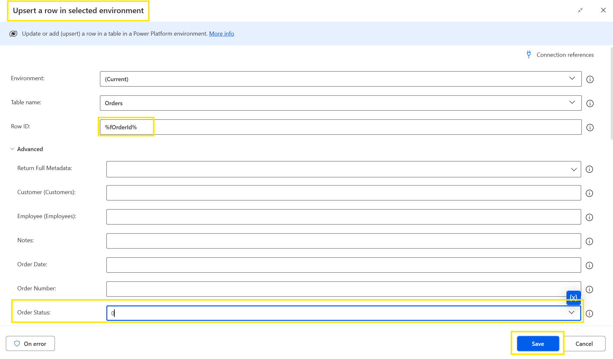  
    Figure: The status update that hands the order to the approval flow.

2. Add a **Display message** action: set **Message box title** to `Info` and **Message to display** to `Legacy order imported and submitted for approval.` Switch on **Close message box automatically** with a **Timeout** of `3`, and select **Save**.

    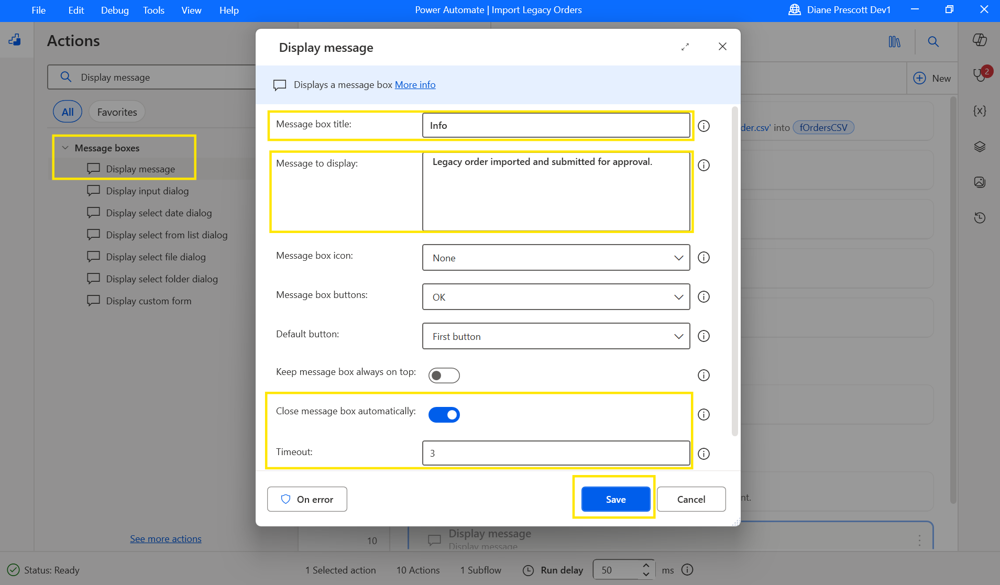  
    Figure: The confirmation message shown after the import.

3. Select **Save draft**, then **Publish** — only the published version of a flow runs from the console. Because desktop flows are stored in Dataverse by default, **Save draft** and **Publish** are available for any desktop flow.

      
    Figure: Publishing the desktop flow from the designer toolbar.

✅ **Checkpoint:** The canvas shows, in order: **Read from CSV file** > **Get current date and time** > **Add a new row** (Orders) > **Convert JSON to custom object** > **Set variable** > **For each** containing **Add a new row** (Order Details) > **Upsert a row** (Orders) > **Display message**.

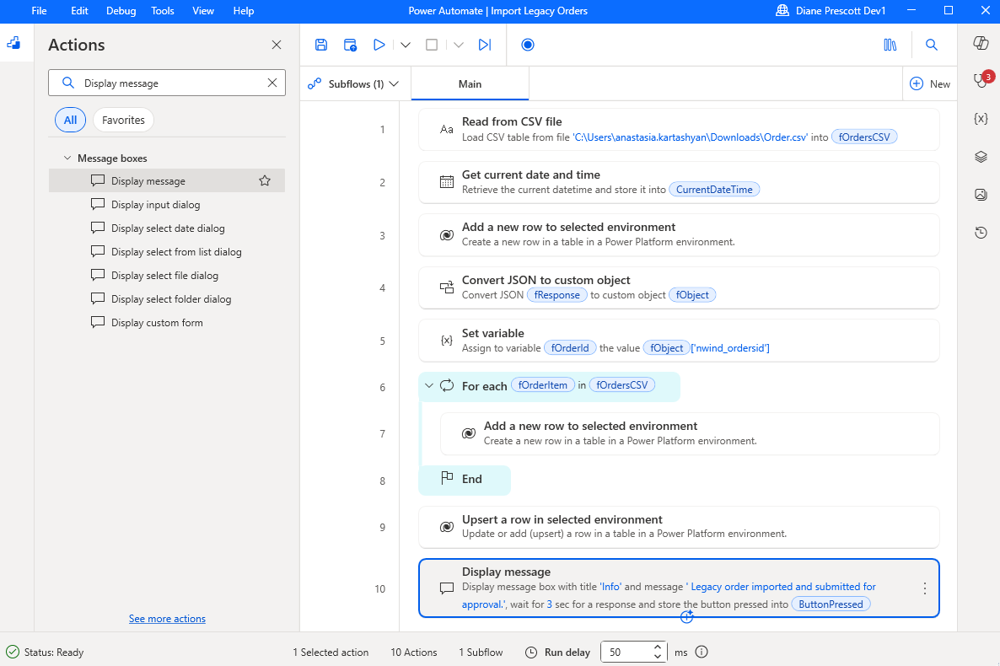  
Figure: The end-to-end desktop flow.

## Step 8: Launch with a keyboard shortcut

The point of an attended desktop flow is that a person triggers it in the middle of their work — here, with a key press.

1. Close the designer and return to the flow list in the Power Automate console.
2. Right-click the flow and select **Properties**.

    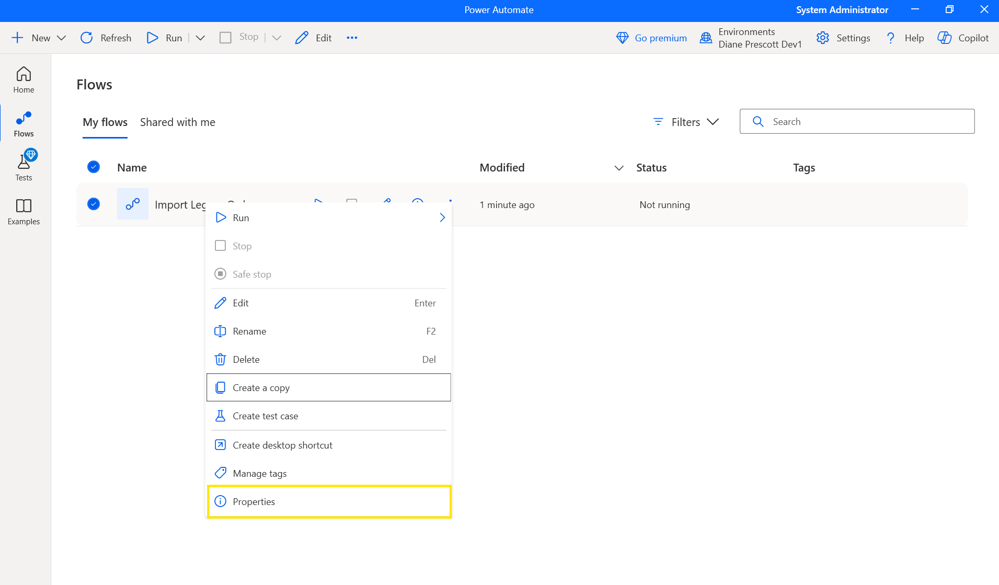  
    Figure: Opening the flow's properties.

3. In **Run with keyboard shortcut**, press the combination to assign — for this lab, press **Ctrl + Shift + P** — and select **Save**.

    ⚠️ **Shortcut conflicts:** **Ctrl + Shift + P** may already be claimed by another running application. If Power Automate reports a conflict — or the shortcut never triggers the flow — choose a different, unused combination and use that for the rest of the lab.

    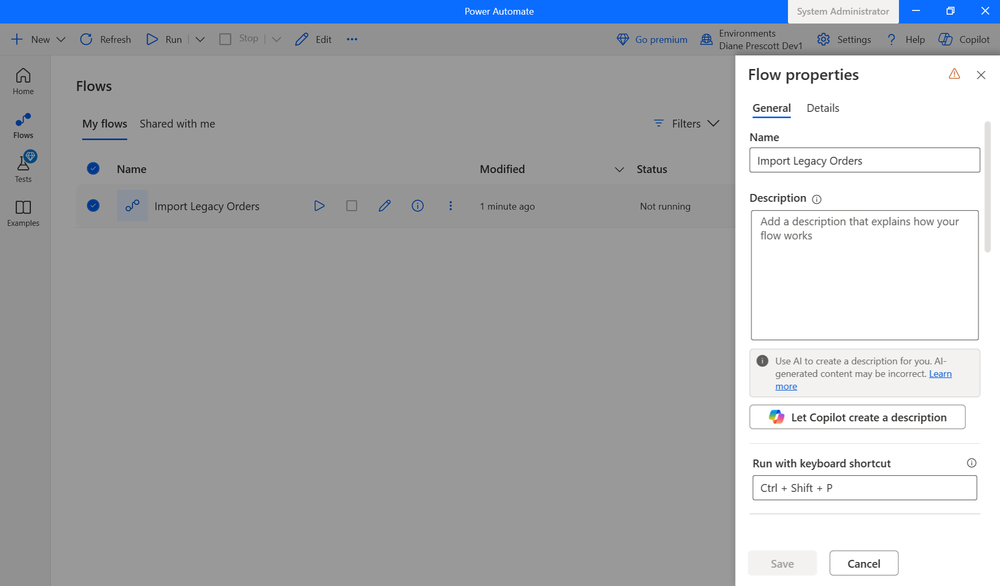  
    Figure: Assigning the launch shortcut.

4. Press the shortcut. Power Automate for desktop runs the flow — return to the **Power Automate console** and watch the flow's **Status** column (for example, *Running*, then *Succeeded*); open the flow's run details from the console to see per-action results.

    ⚠️ **Runtime condition:** The shortcut only works while **Power Automate for desktop is running and signed in** with your lab account. If nothing happens when you press it, confirm the app is open and signed in before treating it as a flow failure.

💡 **Tip:** To keep the Module 1 solution complete, you can add the desktop flow to it: in <https://make.powerapps.com>, open the **Order Automation** solution and select **Add existing** > **Automation** > **Desktop flow**. You'll also need to add its **connection references** to the solution.

## Step 9: Verify the result

1. In <https://make.powerapps.com>, select **Apps** and open the **Admin Management App**. On the **Orders** page, sort by **Order Date** (newest to oldest) and open your newly created order. The header shows the values from Step 4, and the order details beneath it contain the two products from your CSV file, totaling 12,000 USD — an imported order looks exactly like one entered by hand.

    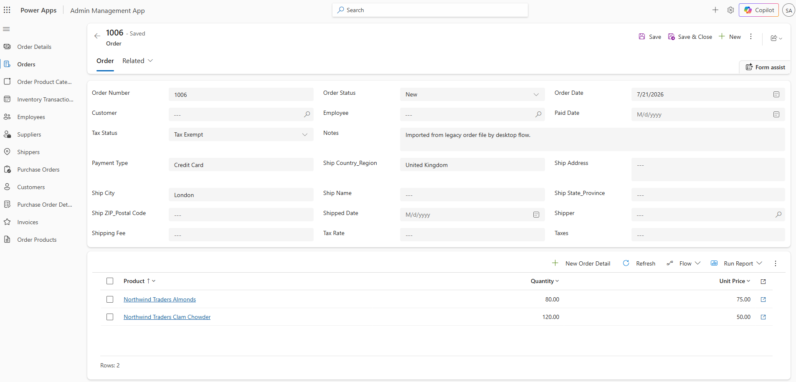  
    Figure: The imported order and its line items in the app.

    💡 **Tip:** This lab verifies in the **Admin Management App** because its pages cover orders and invoices in one place. The **Northwind Orders** app from Module 1 works too, but it's more basic — and you can always inspect the individual tables in Dataverse directly.

2. Open the Manager mailbox. The approval email for the imported order arrives with all details populated — respond **Approve**, then approve the executive request too (the order totals 12,000 USD, so both tiers fire).

    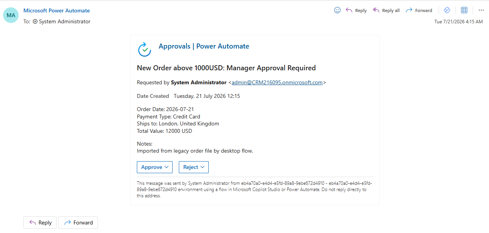  
    Figure: The Module 1 approval, triggered by the desktop flow.

    🛠️ **If the approval email doesn't arrive,** check in order: (1) the **desktop-flow run result** in the Power Automate console — did *Import Legacy Orders* succeed? (2) the imported order's **Order Status** is **New** in the Admin Management App, and (3) the **Order Automation** run history at <https://make.powerautomate.com> for a triggered run or an error.

3. In <https://make.powerautomate.com>, open **Order Automation** > run history, and confirm a new successful run that started when the desktop flow updated the status. After approving both requests, return to the **Admin Management App** and confirm the new invoice for 12,000 USD on its **Invoices** page.

    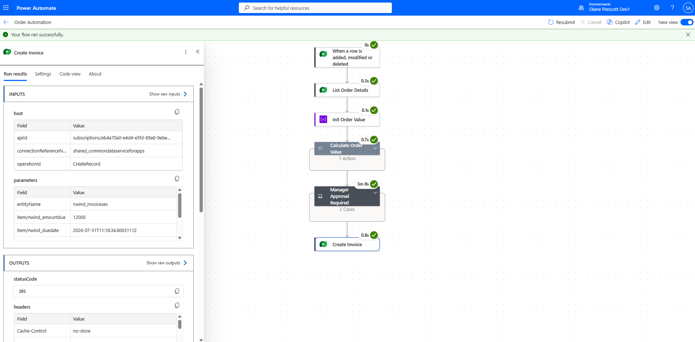  
    Figure: The cloud flow's own record of the RPA-triggered run.

✅ **Checkpoint:** one key press moved an order from a local file, through Dataverse, through the Module 1 approval process, to an invoice — with no changes to the cloud flow at all.

### Repeat runs and cleanup

⚠️ **Each shortcut press creates a new order.** Re-running the flow — even with the same `Order.csv` — creates **another** order and can start **another** approval process. Between runs, either delete the test orders you created (in the **Admin Management App** > **Orders**) or change the sample data so you can tell runs apart. Avoid re-pressing the shortcut after a successful import unless you intend to create another order.

This lab keeps the intake deliberately simple. In production, the trigger and the file would differ: a folder watcher or schedule instead of a keyboard shortcut, a loop over incoming files instead of one fixed path, AI Builder document processing when orders arrive as invoices or scans rather than clean CSV files. A production import would also need **duplicate detection and idempotency** — a way to recognize an order it has already imported (for example, a source order number stored on the record) so re-processing the same file doesn't create duplicates — along with the error handling for the partial-write case noted earlier. What wouldn't change is the part you built after **Read from CSV file** — the handoff into Dataverse, and everything downstream of it, works the same no matter how the order arrives.

🥳 Congratulations — you extended the Module 1 automation to orders that never touch the app, using RPA as the on-ramp into one governed approval process.

## Recommended next step

Continue to [Module 3: Workflows](03-workflow.md), where an agent answers customers mid-conversation by calling an automation as a tool.

## Appendix A: Create a Microsoft Dataverse connection

The first Microsoft Dataverse action you add in Power Automate for desktop may prompt you to create a connection.

1. In the action, select **Sign in** and use the same lab account that you used in Module 1.

    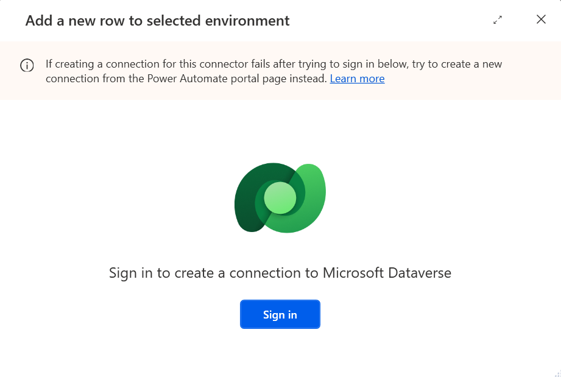
    Figure: Signing in to create the Microsoft Dataverse connection.

2. In the **Create connection** dialog, confirm that **Microsoft Dataverse** is selected, keep **Authentication Type** set to **OAuth**, and select **Create**.

    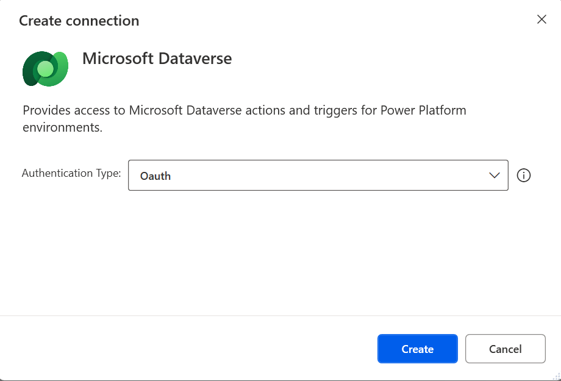
    Figure: Keeping OAuth selected and creating the connection.

3. Wait while Power Automate creates the connection reference. When the connection is ready, return to the action and continue configuring it.

    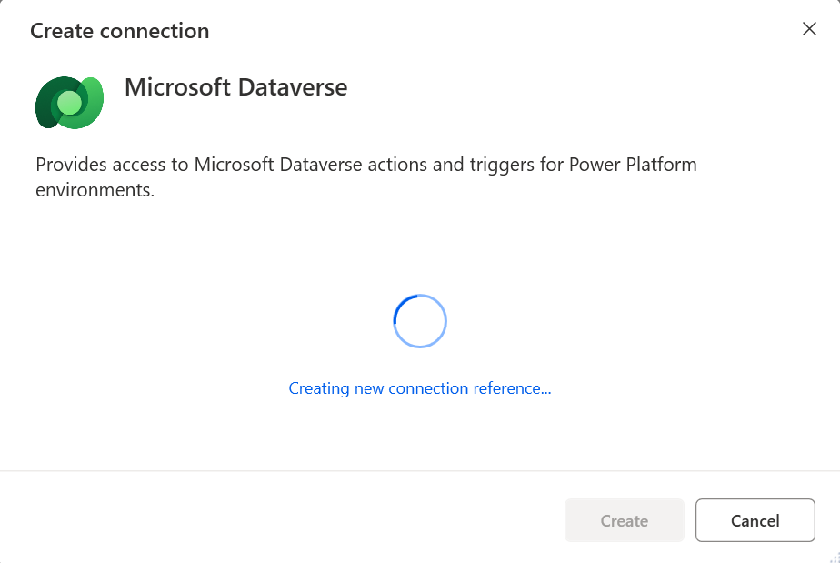
    Figure: Waiting for the new connection reference to be created.

If sign-in fails inside Power Automate for desktop, go to the [Power Automate portal](https://make.powerautomate.com), select **Connections** > **New connection** > **Microsoft Dataverse**, create the connection there, and then reopen the desktop-flow action. For more information, see [Manage connections in Power Automate](https://learn.microsoft.com/power-automate/add-manage-connections).

## Appendix B: Rename produced variables

Actions can generate variables that store their output. Rename variables descriptively so their purpose is clear when you use them in later actions. You can rename a produced variable in either of these ways.

### Method 1: Rename the variable inside its action

1. Open the action that produces the variable.
2. Expand **Variables produced**.
3. Select the generated variable name, enter the new name, and then select **Save**.

    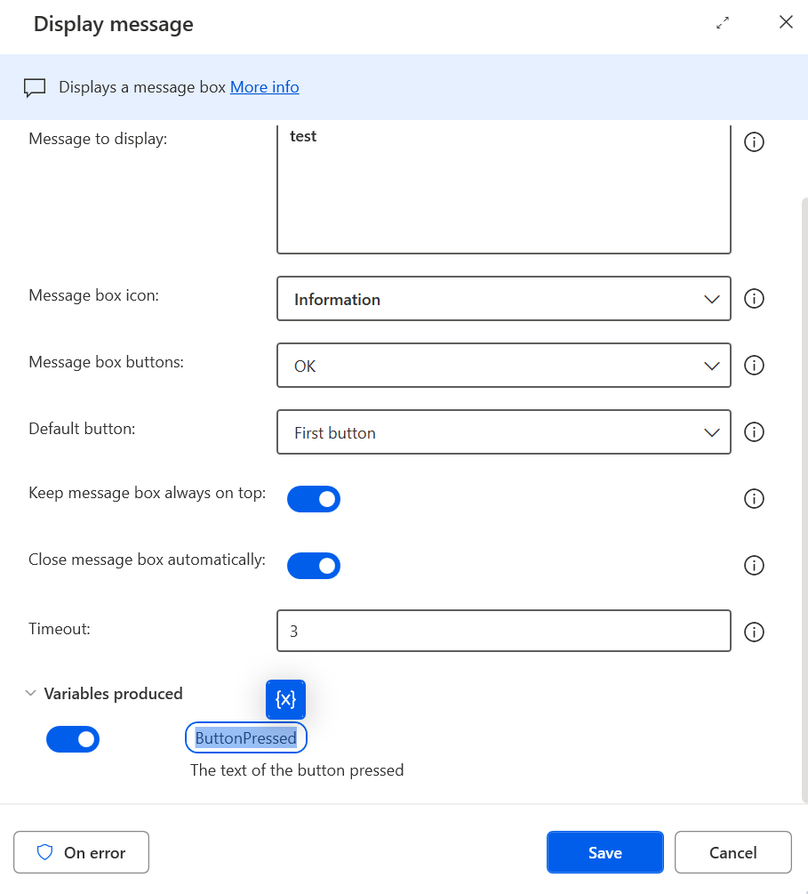
    Figure: Renaming a produced variable inside its action.

### Method 2: Rename the variable from the Variables pane

1. In the designer, open the **Variables** pane.
2. Find the variable under **Input**, **Output**, or **Flow**, as appropriate.
3. Select the variable's ellipsis, and then select **Edit**.
4. Enter the new name and save the change.

    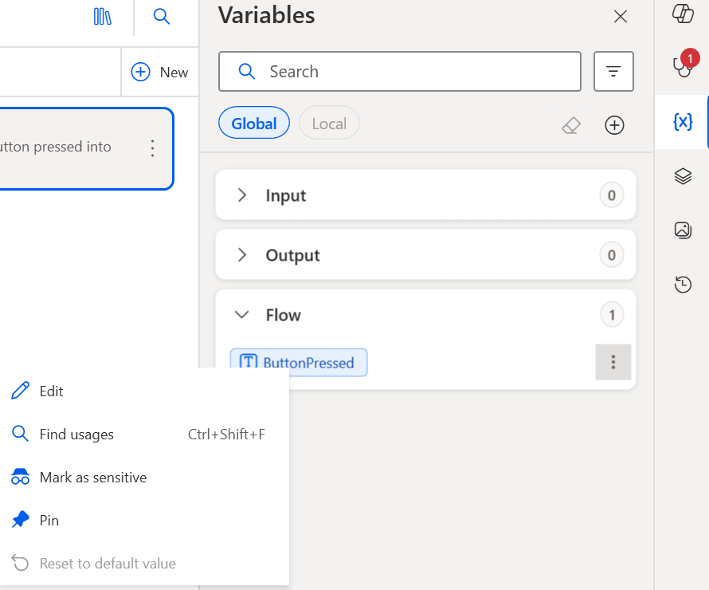
    Figure: Editing a produced variable from the Variables pane.

Renaming a variable from the Variables pane updates its references in all actions across the desktop flow. Use **Find usages** from the same menu to review where the variable is used before making broader changes.

## Appendix C: Name and document desktop-flow elements

Meaningful names and focused comments make a desktop flow easier to understand, troubleshoot, and maintain. A person opening the flow later should be able to identify what each saved element represents and why each path exists without replaying the entire automation.

### Rename UI elements

Captured UI elements often start with generated names that describe only the control type. Rename them to identify the application, screen, and purpose of the control.

1. In the designer, open the **UI elements** pane.
2. Find the UI element, select its ellipsis or right-click it, and then select **Rename**.
3. Enter a descriptive name and save the change.

For example, use names such as:

- `Northwind Orders - Submit button`
- `Northwind Orders - Order number field`
- `Dataverse connection - Sign in button`

Use **Find usages** before deleting or reorganizing an element. Renaming a saved UI element keeps its action references intact while making those references easier to recognize.

### Rename captured images

Image-based automation is difficult to maintain when assets retain names such as `Image1` or `Image2`. Rename each captured image to describe what must appear on screen.

1. In the designer, open the **Images** pane.
2. Find the captured image, select its ellipsis or right-click it, and then select **Rename**.
3. Enter a name that identifies the application, state, and purpose of the image.

For example, use names such as:

- `Northwind Orders - Import complete message`
- `Dataverse - Connection created indicator`
- `Order approval - Success status`

Avoid names based only on sequence or appearance. A useful name explains what the image means to the flow.

### Add comments that explain the logic

Add the **Comment** action from **Flow control** where another maker needs context about the logic or path. Comments should explain why the flow behaves a certain way, not repeat what the surrounding actions already show.

Useful comments include:

- The business rule that determines which branch runs.
- Why an action must occur before or after another action.
- What a loop, condition, or error-handling path is expected to accomplish.
- The source and expected format of important inputs.
- A temporary workaround and the condition for removing it.

At the start of a complex section, state its purpose, inputs, outputs, and possible paths. Use **Region** and **End region** to group related actions under a meaningful label, and place a short comment at the beginning when the reason for the group is not obvious.

Keep comments current when the flow changes, remove comments that no longer apply, and never include passwords, tokens, or other secrets in a comment.

Learn more: [Automate using UI elements](https://learn.microsoft.com/power-automate/desktop-flows/ui-elements), [use images in Power Automate for desktop](https://learn.microsoft.com/power-automate/desktop-flows/images), and [flow control actions](https://learn.microsoft.com/power-automate/desktop-flows/actions-reference/flowcontrol).
