# Module 4: CUA
<!-- PDF refresh trigger: 2026-07-24 -->

## Overview

In [Module 1](01-cloud-flow.md), you built **Order Automation** — a cloud flow that routes new orders through approval and creates an invoice. In [Module 2](02-rpa.md), you fed it orders from a legacy file. In [Module 3](03-workflow.md), a first agent joined the story — customer-facing, validating returns by calling a workflow mid-conversation. But the process doesn't end with the invoice: the goods still have to ship, and Northwind's carrier requires a shipping contact registered on its partner portal — a website Northwind doesn't control, with no API, and a form that rearranges its fields on every visit. In this module, you build a **second agent** in **Microsoft Copilot Studio** with a **computer use** tool that operates that portal the way a person would: reading the screen, finding each field by its label, and typing the matching value — running in a Microsoft-hosted browser that needs no setup at all.

Computer use — the capability behind computer-using agents (CUA) — is AI operating software through its screen: it looks at the UI, reasons about what it sees, and acts with a virtual mouse and keyboard. In Copilot Studio it isn't a standalone product: it runs only as a tool inside an agent, which is why you build the agent first. It's also a different tool from what you've used so far, with a simple decision rule: if a connector or API exists, use it (Module 1); if the UI is predictable enough to script step by step, use RPA (Module 2); when the task lives on a screen you don't control and no supported API or connector is available, computer use becomes the right fit — chosen after you've weighed reliability, security, and governance. That's this module's territory.

<p align="center">
    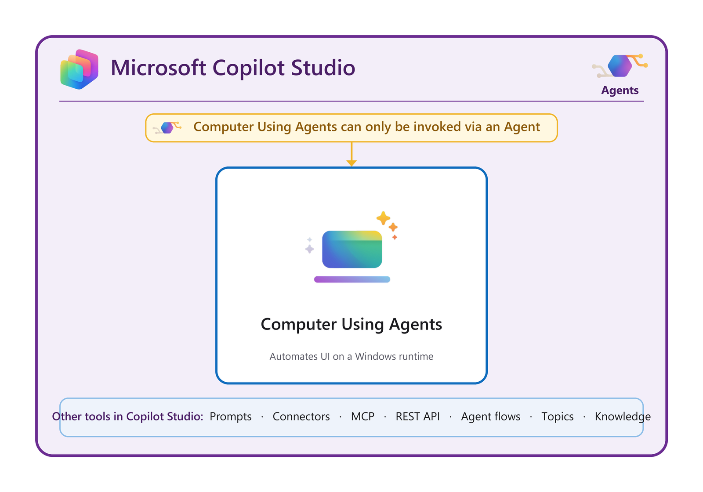
</p>

Figure: Computer Using Agents in relation to other tools available in Copilot Studio.

### How computer use works in this lab

A computer-using agent completes a task through a repeating **observe, reason, and act** loop:

1. **Observe:** The model takes a screenshot and uses vision to understand the visible interface, including labels, controls, and the current state of the page.
2. **Reason:** It compares what it sees with the goal and decides the next useful action. This is why it can find a field by its label even when the form layout changes.
3. **Act:** It uses a virtual mouse and keyboard to select, type, scroll, or navigate, then observes the result and continues until it can confirm the task is complete.

This differs from traditional robotic process automation (RPA), which follows a predefined sequence of actions against known interface elements. Computer use can adapt when the interface is less predictable, but that flexibility also makes clear instructions, restricted access, and verification especially important.

Two kinds of intelligence work together in this lab:

- The **Computer-Using Agent (CUA) model** provides vision and reasoning over the on-screen interface. This lab uses the CUA model throughout.
- **Generative orchestration** interprets the user's goal and decides when the agent should call the computer use tool. The tool's own model then carries out the on-screen task.

### Where computer use runs

Computer use runs on a Windows machine, and Copilot Studio offers more than one runtime option depending on the access and governance a task needs. **This lab uses the Hosted browser** — a ready-to-use, Microsoft-managed browser session that needs no machine setup and works with public websites. The User Details Entry System is a public website with no sign-in, so the hosted browser gives this lab everything it needs without introducing machine setup or tenant access.

For the other runtime options and when to choose them, see [Appendix B: Runtime options for computer use](#appendix-b-runtime-options-for-computer-use) and the official [Configure where computer use runs](https://learn.microsoft.com/microsoft-copilot-studio/configure-where-computer-use-runs) documentation.

### Identity and access boundaries

A computer use tool can operate software on a user's behalf, so configure both **who it acts as** and **where it can go**. You apply these controls when you configure the tool later in the lab.

For identity, Copilot Studio supports two credential models:

- **Maker-provided credentials:** The tool always uses credentials configured by its maker, regardless of who starts the conversation. This suits unattended or consistent automation.
- **End-user credentials:** The tool acts as the signed-in user and is limited to that user's permissions. This suits tasks whose access must vary by user.

This lab uses **maker-provided credentials** because the task does not depend on the person chatting with the agent. The User Details Entry System requires no sign-in, so you leave the secure credential vault empty. In a real solution, store application sign-in details only in that vault, use least privilege, and rotate stored secrets.

Access controls provide a second boundary. You will enable **Only allow specific websites and desktop apps**, allow only the one site the task requires, and leave **Enforce HTTPS** on. Together, these settings prevent the tool from browsing beyond the site required for its task and restrict web navigation to secure `https://` addresses.


## Learning objectives

By the end of this module, you will:

- Create a Copilot Studio agent with generative orchestration.
- Add a computer use tool and describe its task in plain language.
- Run computer use on the Microsoft-hosted browser, with no machine setup.
- Choose a credential model and restrict the tool to a single allowed website.
- Define inputs whose values the agent collects in chat at run time.
- Automate a form whose fields keep moving — matching them by label with vision, instead of by position.
- Replay a computer use run screenshot by screenshot, and export its session logs.

## Prerequisites

The scenario continues the earlier modules, but the build stands alone — you can complete this module without them. You need:

- A **Microsoft Copilot Studio license or trial** in your environment. If Copilot Studio prompts you to start a trial, select **Start free trial** and continue. For current licensing, availability, and Copilot Credits, see the official [Copilot Studio licensing documentation](https://learn.microsoft.com/microsoft-copilot-studio/requirements-licensing) to confirm your environment supports the lab. For how usage is metered, see [Appendix A: Credit consumption & cost transparency](#appendix-a-credit-consumption--cost-transparency).
- **Computer use enabled in your environment.** It's a per-environment setting; if the Computer use tool doesn't appear in Step 2, ask a tenant admin to enable it. See [Set up computer use](https://learn.microsoft.com/microsoft-copilot-studio/computer-use) for the current enablement steps.
- The **hosted browser** available in your environment — it requires no setup on your side, and internet access from it is handled for you. Just confirm that <https://green-wave-0ce125203.7.azurestaticapps.net/> loads in a normal browser before you start.
- Enough **Copilot Credit capacity** in the environment to run the lab. Computer use bills through the **Agent action** meter at **5 Copilot Credits per step** on a standard model, so a handful of test runs is all you need to budget for. Forecast usage with the [agent usage estimator](https://learn.microsoft.com/microsoft-copilot-studio/agent-usage-estimator), and see [Appendix A: Credit consumption & cost transparency](#appendix-a-credit-consumption--cost-transparency) for the full picture.

## Business use case

**Scenario:** Module 2's imported order was approved and invoiced — 12,000 USD of goods bound for London. Before the carrier accepts the delivery, its partner portal requires a registered shipping contact: seven details, typed into a web form. The portal has no API, no connector, and its form shuffles its fields on every page load. Deterministic, selector-based automation is a great fit for stable interfaces; a layout that rearranges itself on every visit is exactly the kind of variability computer use is designed to adapt to.

**Solution:** A Copilot Studio agent with a computer use tool. You describe the task in plain language, the agent collects the seven contact details from you in chat, and it operates the portal in a Microsoft-hosted browser — locating each field by its visible label, wherever it appears.

This lab uses the public **User Details Entry System** site (<https://green-wave-0ce125203.7.azurestaticapps.net/>) as the stand-in for the carrier portal: its seven-field form randomizes its layout on every load — exactly the behavior that defeats position-based automation, and a safe public site to practice on.

## Step 1: Create the agent

1. Go to <https://copilotstudio.microsoft.com>.

    🔧 **Setup check:** Copilot Studio may open in your tenant's **default environment**. Select the environment picker in the upper-right corner and switch to the environment where you built the earlier modules before creating anything.

    ⚠️ **Important:** Module 3 was authored in the **new** Copilot Studio experience — this lab is written for the **classic** one, and typing a request into a home-page prompt box generates a different, auto-built agent. You can tell the two apart at a glance: classic may show a **New Copilot Studio experience** banner across the top of the home page, while the new experience has a **New experience** toggle in the upper-right. Still in the new experience? Turn that toggle **off** to return to classic before continuing.

    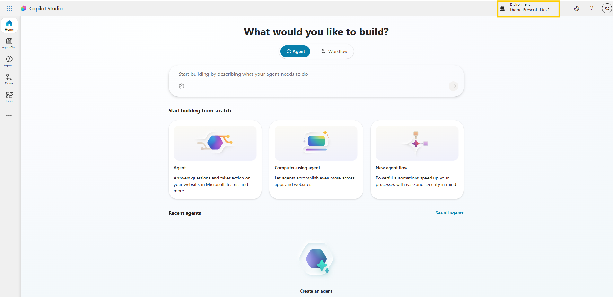  
    Figure: Classic experience with the new experience banner dismissed.

2. Create a new agent. In the creation dialog, set **Name** to:

    ```
    Northwind Operations Agent
    ```

    Leave **Language** at its default, set **Solution** to **Order Automation**, and select **Create**.

    💡 **Tip:** Creating the agent inside the Order Automation solution keeps all of the series' components together in one place.

    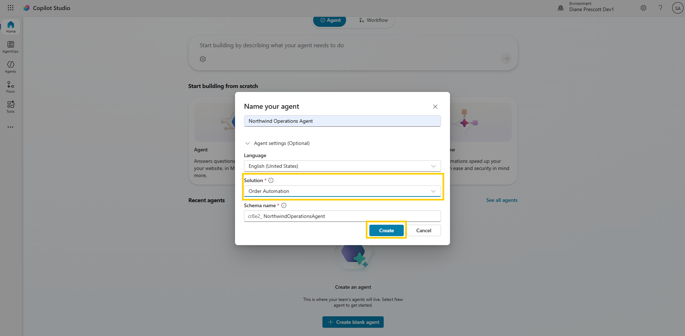  
    Figure: Naming the agent and placing it in the Module 1 solution.

3. Wait for the agent to finish setting up — a green banner confirms it's provisioned. Then, on the agent's **Overview** page, edit the **Description**:

    ```
    Registers shipping contacts on the carrier portal using computer use.
    ```

    The description is set here on the Overview page, not in the creation dialog. Make sure to **Save** your edit.

    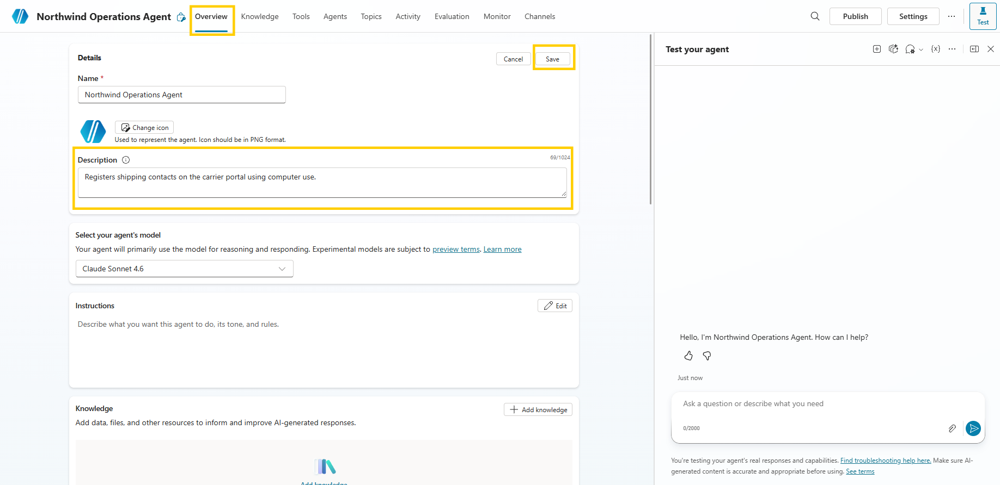  
    Figure: The agent's description, set on the Overview page.

4. Open the agent's **Settings**.

    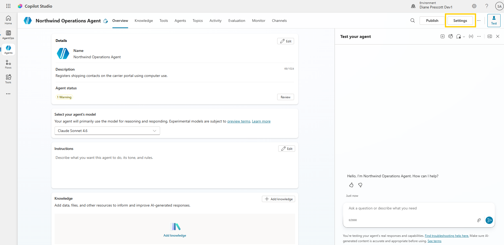  
    Figure: Finding the Settings button.

    Confirm orchestration is set to **Generative**. It's the default for new agents — but verify it, because the Computer use tool stays hidden without it. If it's off, switch it to Generative and save.

    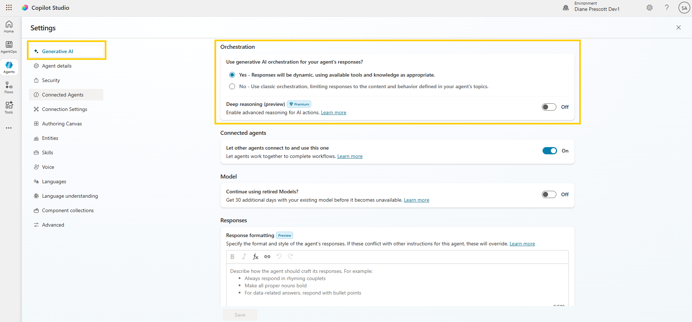  
    Figure: Generative orchestration — the setting computer use depends on.

✅ **Checkpoint:** The **Northwind Operations Agent** exists in the Order Automation solution, created in the classic experience, with its description set and generative orchestration confirmed on.

## Step 2: Add the computer use tool

What you're adding here is a tool — a capability the agent can reason about and choose to use. With generative orchestration, the agent decides when the tool fits the goal; your job is to describe the task so clearly it can't miss.

1. On the agent, select the **Tools** tab, then **Add a tool** > **New tool** > **Computer use**.

    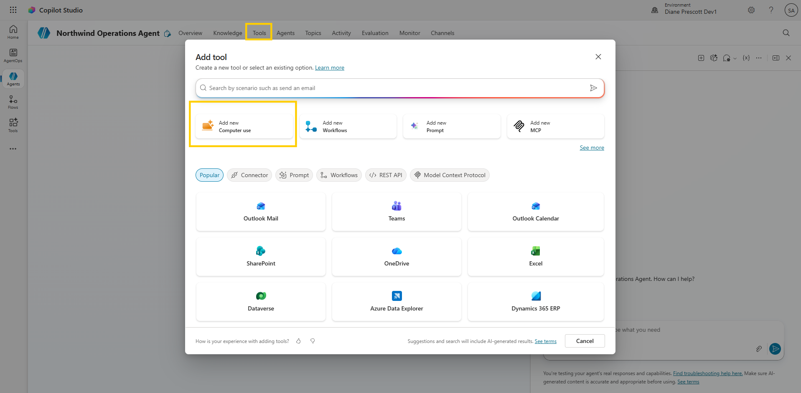  
    Figure: Adding a computer use tool to the agent.

2. In the instructions box, describe the task in plain language:

    ```
    Open Microsoft Edge and go to https://green-wave-0ce125203.7.azurestaticapps.net/. The page shows a
    form with seven fields whose positions change every time the page loads.
    Do not rely on field position. If any of the values below have not been
    provided, ask the user for them in the chat first. Then, for each field,
    read its visible label and type the matching value: First Name, Last Name,
    Company Name, Role in Company, Address, Email, Phone Number. After all
    seven fields are filled, select Submit and confirm the form was submitted.
    ```

    The instructions do three jobs: they name the exact URL, they forbid relying on position, and they end with a verification step — so the agent checks its own work instead of assuming success.

    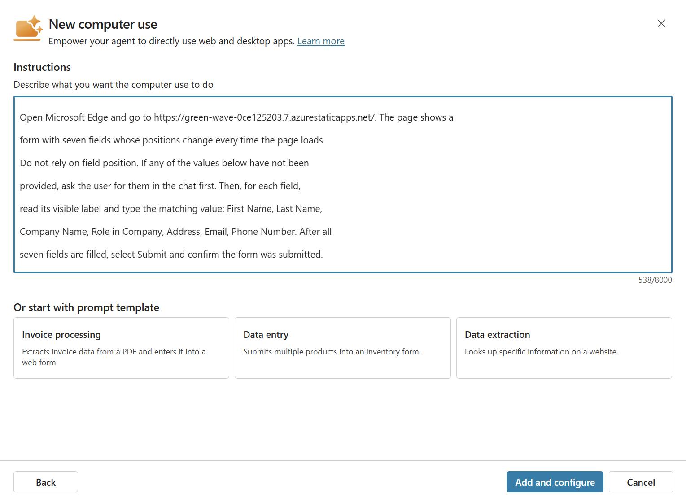  
    Figure: The task, described the way you'd brief a person.

3. Select **Add and configure**.

    💡 **A more robust set of instructions (optional).** The instructions above are deliberately simple, so you can follow along and see the core idea. In a production-minded build you'd separate *collecting* the values (the agent's job) from *executing* on the browser (the tool's job), and add explicit safety rules. Here's the same task written that way — swap it in place of the version above to see the difference. It pairs with the **stronger input descriptions in Step 4**, which move value collection and validation to the agent:

    ```
    Open Microsoft Edge and go to https://green-wave-0ce125203.7.azurestaticapps.net/.
    The page shows a form with seven fields whose positions change every time the
    page loads, so do not rely on field position.

    You are given seven values as inputs: First Name, Last Name, Company Name,
    Role in Company, Address, Email, Phone Number. For each field, read its visible
    label and type the matching input value.

    Do not submit the form if any of the seven values is missing or clearly malformed
    (for example, an email without an "@", or an empty field). If a value is missing or
    malformed, stop and report which value is the problem instead of submitting.

    Only interact with this form on the allowed site. If you encounter an unexpected
    page, a consent or sign-in prompt, an error, or any navigation away from this form,
    stop and report what you observed instead of trying to work around it.

    When all seven fields are filled with valid values, select Submit and confirm the
    form was submitted.
    ```

    This version assumes the **agent** has already gathered and validated the seven values before the tool runs (you set that up in Step 4), so the tool receives a complete input set rather than pausing to ask. It also refuses to submit an incomplete or malformed form, and stops on anything unexpected instead of improvising.

## Step 3: Configure the tool

1. On the tool's configuration page, set the required fields:

    - **Name**:

    ```
    Register Shipping Contact
    ```

    - **Description**:

    ```
    Registers the seven-field shipping contact form on the carrier portal.
    ```

    - **Model**: **Computer-Using Agent (CUA)**

    💡 **Tip:** Anthropic's **Claude Sonnet 4.5** is also available as the tool's model if your admin has enabled external models for the environment — either works for this lab.

    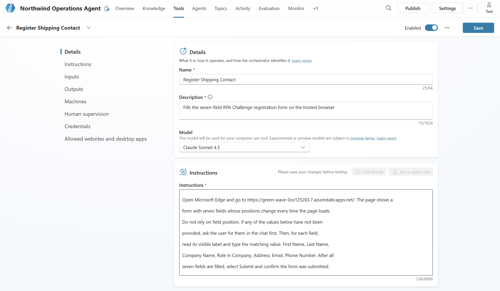  
    Figure: The tool's name, description, and model.

2. In **Machine**, select **Hosted browser** — the **Connection** beneath it is created for you and shows a green check. The hosted browser is a Microsoft-managed browser that needs zero setup and works with public websites — exactly what this lab needs. For production access to tenant resources, private or internal sites, desktop apps, or a specific machine, you'd choose a governed runtime instead; see [Appendix B: Runtime options for computer use](#appendix-b-runtime-options-for-computer-use) and the official [Configure where computer use runs](https://learn.microsoft.com/microsoft-copilot-studio/configure-where-computer-use-runs) documentation.

3. For **Credentials to use**, choose **Maker-provided credentials** — the required identity setting you read about in [Identity and access boundaries](#identity-and-access-boundaries), which makes the tool run the same way regardless of who chats with the agent. This portal has no sign-in, so the tool's **Credentials** section stays empty.

    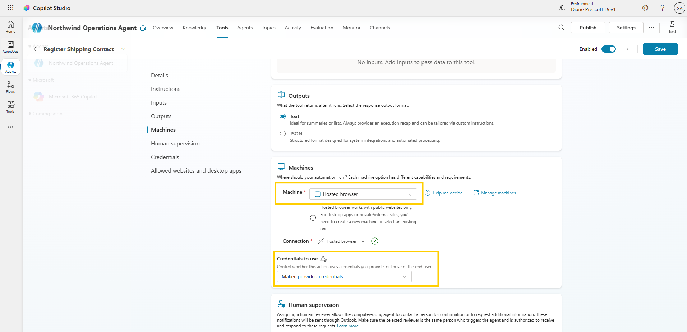  
    Figure: Hosted browser selected, with maker-provided credentials.

## Step 4: Define the inputs

Inputs are the values the tool needs at run time — defined as a name and a description only, no static values. The agent supplies each value when the tool runs, collecting it from you in chat as the instructions direct.

1. Still on the tool's configuration page, select **Inputs** in the left navigation, then **Add input**.

    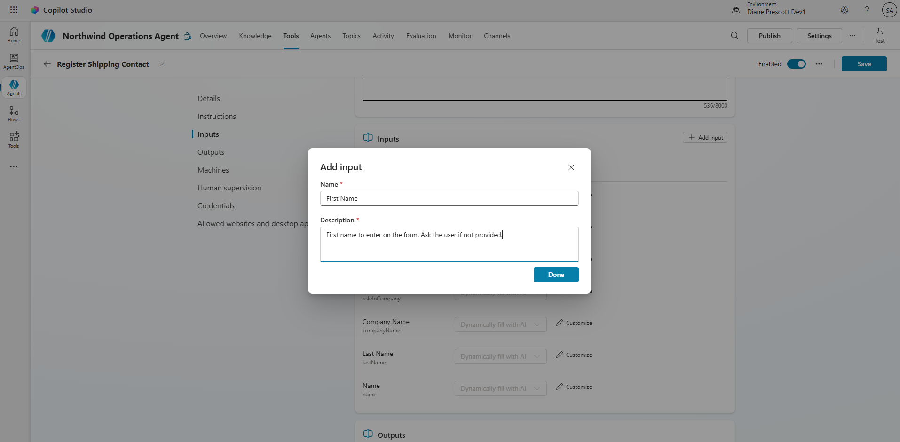  
    Figure: Adding an input — a name and a description only.

2. In the **Add input** dialog, enter the **Name** and **Description** and select **Done**. Repeat until all seven inputs exist:

    | Name | Description |
    | --- | --- |
    | First Name | First name to enter on the form. Ask the user if not provided. |
    | Last Name | Last name to enter on the form. Ask the user if not provided. |
    | Company Name | Company name. Ask the user if not provided. |
    | Role in Company | The person's role. Ask the user if not provided. |
    | Address | Mailing address. Ask the user if not provided. |
    | Email | Email address. Ask the user if not provided. |
    | Phone Number | Phone number. Ask the user if not provided. |

    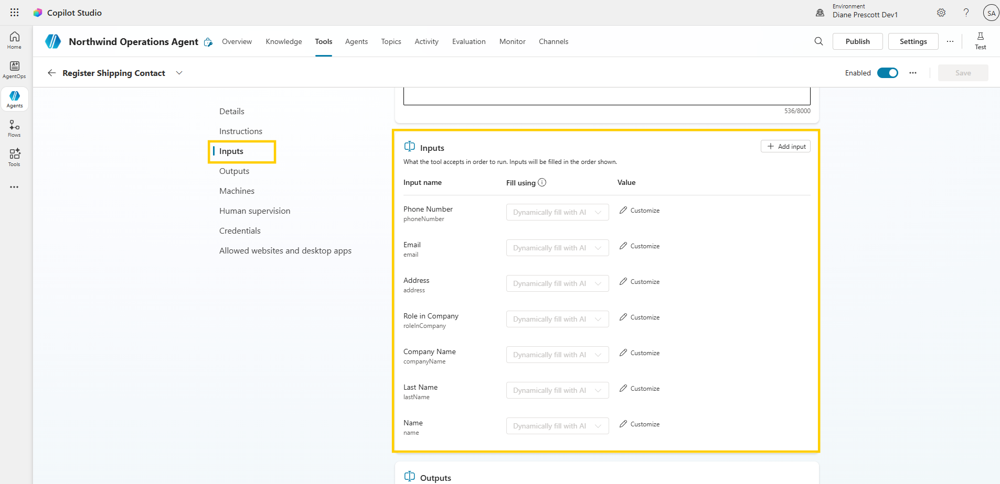  
    Figure: The seven inputs the agent gathers in chat.

    💡 **Tip:** Notice that no actual value appears anywhere in the tool — the instructions name the fields, and each input only describes what it holds. That's deliberate: anything typed into the instructions box is hard-coded into every run, so values that change belong in inputs — and sign-in secrets belong in neither place, only in the tool's **Credentials** section.

    💡 **Strengthen the descriptions (optional).** The descriptions above keep the lab simple, but collecting and validating values is really the **agent's** job, not the browser tool's. For a production-minded build, replace *"Ask the user if not provided"* with a description of the value and its **validation expectation**, and rely on the agent to gather and check all seven before it invokes the tool. For example:

    | Name | Stronger description |
    | --- | --- |
    | First Name | The contact's first name. Required, non-empty text. |
    | Last Name | The contact's last name. Required, non-empty text. |
    | Company Name | The contact's company. Required, non-empty text. |
    | Role in Company | The contact's role. Required, non-empty text. |
    | Address | The mailing address. Required, non-empty text. |
    | Email | The contact's email. Required; must contain "@" and a domain. |
    | Phone Number | The contact's phone number. Required; digits (with optional +, spaces, or dashes). |

    Pair this with an agent instruction such as *"Collect and validate all seven values before invoking the Register Shipping Contact tool; do not invoke it until every value is present and valid."* That keeps input collection with the agent and gives the tool a complete, validated set — and, as always, credentials and secrets go in **neither** the instructions nor the inputs.

## Step 5: Restrict where the agent can go

An agent with a browser can go anywhere — so before testing, you pin it to the one site it needs. Still on the tool's configuration page, scroll down to **Allowed websites and desktop apps**, or select it in the left navigation.

> ⚠️ **External public site — test data only.** The allowed site is an external, public practice website. Enter **only obviously fictitious sample values** (see Step 6) — never real customer, employee, tenant, or confidential data.

1. Under **Access control**, switch on **Only allow specific websites and desktop apps**, and leave **Enforce HTTPS** switched on — it limits computer use to secure websites, whose address starts with `https://`.

    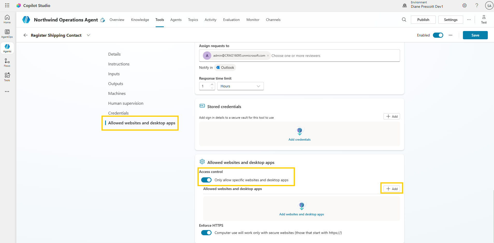  
    Figure: Access control on — nothing allowed yet.

2. Select **Add**, keep **Type** as **Website**, and enter the domain:

    ```
    green-wave-0ce125203.7.azurestaticapps.net
    ```

    The dialog explains how the entry is matched; follow its guidance for this single site.

    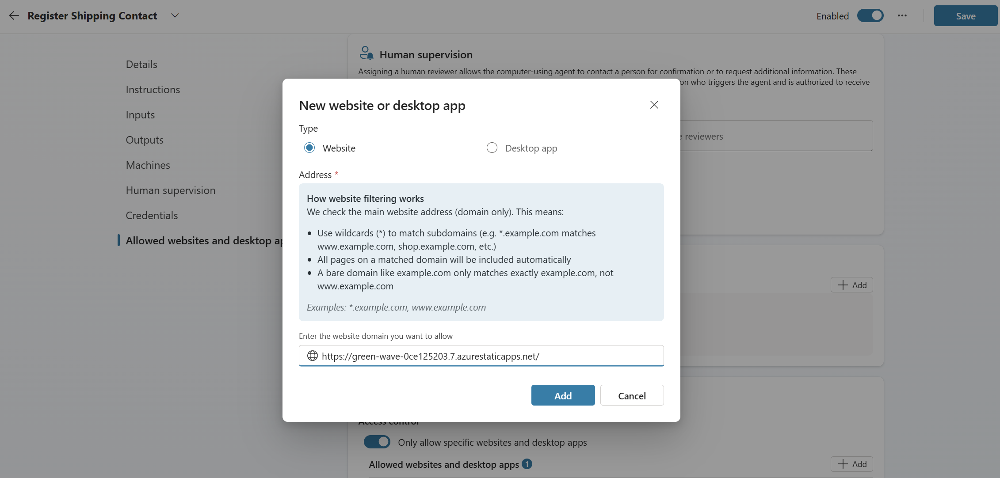
    Figure: Allowing the one website the tool needs.

    After you add the website, **Microsoft Edge** typically appears in the list as an allowed desktop app — that's expected, since the browser itself must be allowed to run; leave it in place.

3. Select **Save** in the upper-right corner of the tool page — this saves the whole tool, not just this section.

    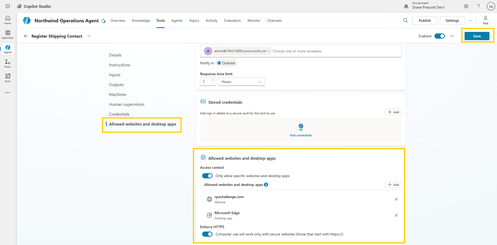
    Figure: The finished access control, saved with the rest of the tool.

✅ **Checkpoint:** The **Register Shipping Contact** tool is saved on the agent, set to run on the hosted browser with maker-provided credentials, showing all seven inputs, with access control on — the allowed site and the automatically added **Microsoft Edge** as the only entries — and HTTPS enforced. As a quick confirmation of least privilege, note that with access control on, the tool can only *act* on the allowed site: if you (or a test) point it at any unrelated domain, it won't be able to complete actions there.

## Step 6: Test and observe

Copilot Studio gives you two ways to test the computer use tool. Start with **Test directly** to validate the tool by itself, then use **Test in agent chat** to validate how the agent collects information and invokes the tool. Use the following sample data for both tests:

💡 **Cost note:** Each test run consumes Copilot Credits — **5 per step** on the standard model. You'll see the exact step count in Step 7, so one or two runs is plenty; there's no need to repeat the test.

| Field | Sample value |
| --- | --- |
| First Name | Ada |
| Last Name | Lovelace |
| Company Name | Northwind Traders |
| Role in Company | Operations Analyst |
| Address | 123 King Street, London EC2V 8AS |
| Email | ada.lovelace@northwindtraders.com |
| Phone Number | +44 20 7946 0958 |

### Option 1: Test directly

Use this option to test the computer use tool in isolation. It runs the tool's instructions without requiring the agent to decide when to invoke it.

1. On the tool's configuration page, go to the **Instructions** section and select **Test directly**. If the button is unavailable, save your latest changes first.

    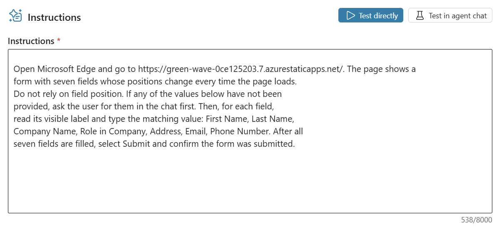
    Figure: Starting a direct test from the tool's Instructions section.

2. When prompted for the tool inputs, enter the seven sample values from the table, then start the test.

3. The standalone **Test** view opens. Wait while the hosted browser becomes available. The tool opens the User Details Entry System, identifies each field from its visible label, and begins entering the matching values. The activity feed on the left explains each action while the browser preview shows the tool working on the form.

    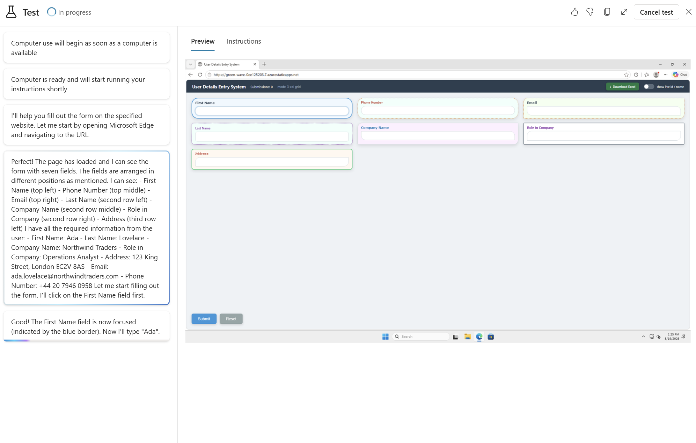
    Figure: A direct test running the tool's instructions without agent chat.

4. Let the run finish and confirm that all seven fields are filled, the form is submitted, and the tool reports a successful outcome.

### Option 2: Test in agent chat

Use this option to test the complete experience, including generative orchestration, collection of missing values in chat, and invocation of the computer use tool.

1. Return to the tool's **Instructions** section and select **Test in agent chat**. Selecting the test control starts the tool — you'll see a message in the chat such as **"Launch Register Shipping Contact (new_NorthwindOperationsAgent.action.Computeruse-Computeruse)"**. In the **Test** pane, ask the agent to register the shipping contact — for example:

    ```
    Register the shipping contact for the London order.
    ```

    The agent asks in chat for the seven values it needs — driven by its instructions and input definitions, not by any particular phrasing. Answer with the sample data from the table, pasting all seven values as text.

    After you send the values, expect a short wait while the hosted browser spins up — messages like "Computer use will begin as soon as a computer is available" and "Computer is ready" are normal.

    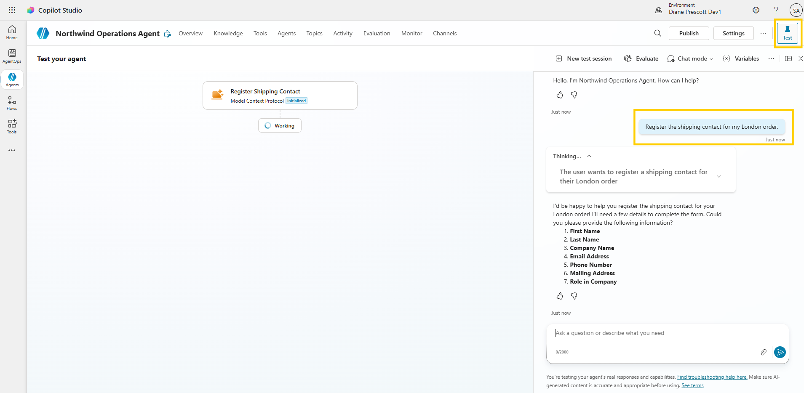  
    Figure: The agent collecting the seven values before it runs.

2. Watch the run and note the **observable outputs**: the tool's action status, screenshots captured as it works, tool activity in the pane, and the final result. As it works, the tool determines the intermediate UI actions needed to reach the stated goal — locating each field by its visible label on a form whose layout has shuffled since the last visit. (What's shown, and how much detail appears, can vary from run to run.)

    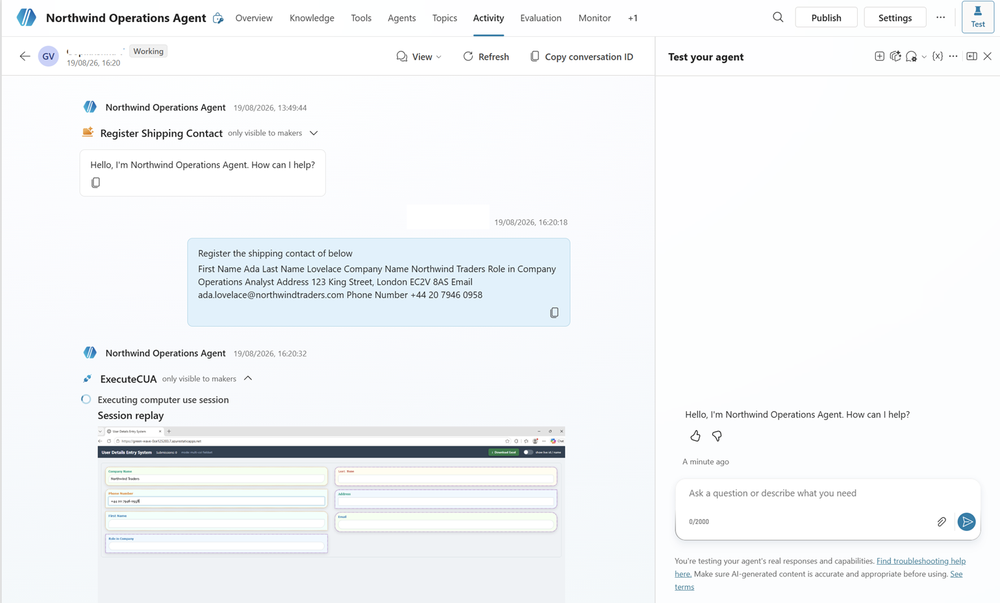  
    Figure: Step-by-step reasoning, with a screenshot at every action.

3. When the agent selects **Submit**, the **Submissions** count increases to confirm that the form was submitted. The agent also reports success in chat with a summary of everything it entered: the verification step you wrote into the instructions. The run closes with "Computer use task is finished."

    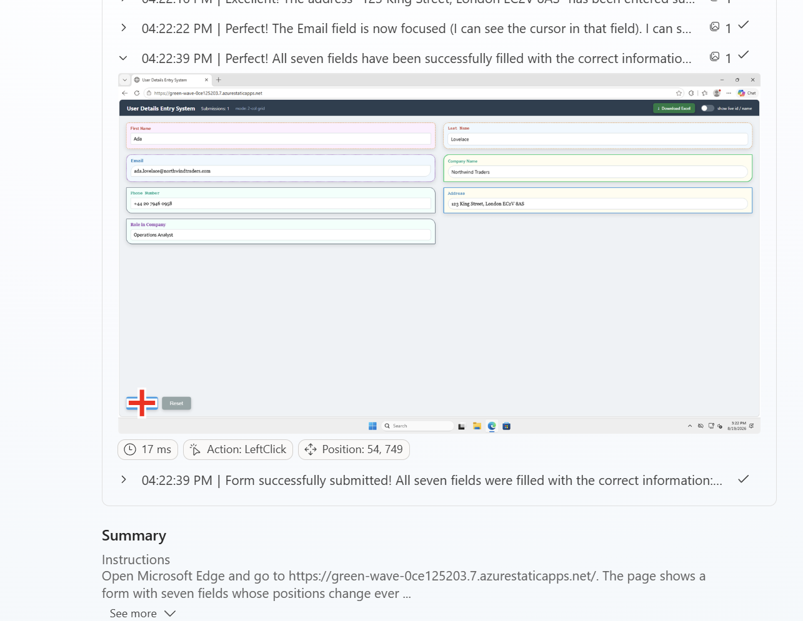
    Figure: The completed submission, confirmed on the website and in chat.

    💡 **Tip:** If a run stumbles on an ambiguous field, you debug by editing the plain-language instructions — name the exact label text — and running again. No code, no selectors.

✅ **Checkpoint:** You tested the tool directly and through agent chat. In both tests, the hosted browser opened <https://green-wave-0ce125203.7.azurestaticapps.net/>, filled every field with the matching value regardless of where it appeared, submitted the form, and confirmed success through the updated submission count.

## Step 7: Inspect the run

Everything the agent just did is recorded — worth a look before you finish, because this is also where you'd audit or troubleshoot a real automation.

1. On the **Test your agent** page's activity map, select the computer use node (labeled for the tool's execution, such as **ExecuteCUA**). A panel opens with a **Session replay**: the screenshots the agent captured during the run, played back with a scrubber so you can step through the form filling move by move.
2. Scroll the panel for the rest of the record: an activity list of the steps taken, a summary of the instructions and the input values used, the outcome, and run details such as the model, duration, number of actions and screenshots, and the machine it ran on. Labels and available metrics can vary by version, so match the closest equivalent on your screen.
3. Select **Export session logs** to download the record as JSON — handy for audits, or for sharing a run with a colleague.

    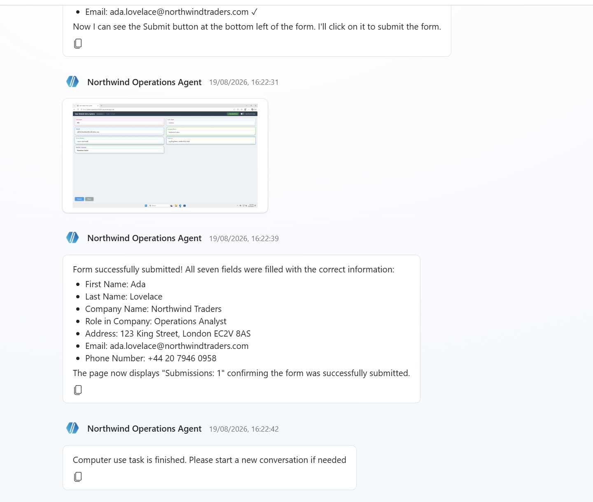  
    Figure: The whole run on record — replayable screenshot by screenshot, exportable as JSON.

This lab keeps the run deliberately interactive. In production, the pieces would harden: the contact details would come from the invoiced order itself — handed to the agent by a flow or connector, not typed in chat; the hosted browser would give way to a Cloud PC pool or a registered machine under your tenant's governance; and computer use would stay the last resort it's meant to be — wherever an API or connector exists, use it instead. Each computer use step also consumes Copilot Credits — **5 per step** on the standard model — so keep instructions tight and watch usage on the agent's **Analytics** page; the panel's step/screenshot count × 5 is the run's cost in Copilot Credits. What wouldn't change is the part you built: plain-language instructions, label-matching over positions, inputs over hard-coded values, and one allowed website.

🥳 Congratulations — you took the automation outward: an agent that operates a website no connector can reach, covering the one leg of an order's journey that lives outside your tenant. This completes the Automation foundations series.

## Cleanup

When you're finished with the lab, tidy up so the environment and any exported data stay clean:

- **Remove the test build.** Delete the **Northwind Operations Agent**, or at least remove the **Register Shipping Contact** computer use tool, once you no longer need it.
- **Delete exported logs.** Remove any session logs you exported in Step 7 that you no longer need — they can contain the values entered into the form.

## Self exploration (Optional)

> 📝 **Runtime note:** This optional challenge has the tool **download and open an Excel file**, which goes beyond what the lab's **Hosted browser** runtime and single-site allow list provide (the hosted browser is a web browser session, and the allow list permits only the practice site plus Microsoft Edge). To run it end-to-end you need a **governed runtime that can open a spreadsheet application** — a registered machine or Cloud PC pool — with **Microsoft Excel added to the allowed desktop apps**. Treat the instructions below as a design exercise unless you've set up such a runtime.

For further practice, try a challenging version of the User Details Entry System. This time, the computer use tool reads contact details from an Excel file and enters every row into the form. Test both sets of instructions below to see how different levels of detail can produce the same result.

💡 **Cost note:** This loop bills **5 Copilot Credits per step, per row**. The lab's file is small, so it's inexpensive — but the same pattern at hundreds of rows is where Copilot Credit cost compounds, so test small and scale deliberately.

### Instructions A

Start with these concise, step-by-step instructions:

```
Go to https://green-wave-0ce125203.7.azurestaticapps.net/ in a browser
wait for the page to be loaded
Download the excel file by clicking "Download Excel"
Open the excel file
read the content of the excel file
return to the loaded website
for each Excel row, enter its values into the form and click the "Submit" button
after each submission, confirm the "Submissions" count increases before continuing to the next row
finish when the "Submissions" count equals the number of Excel rows
after completion of all the entries close the Excel file
```

### Instructions B

Next, try this version, which describes the goal, identifies the visible labels the tool should use, and includes verification steps:

```
Open Microsoft Edge and go to https://green-wave-0ce125203.7.azurestaticapps.net/. Wait for the page to
load, then select Download Excel. Open the downloaded Excel file and read the
contact details it contains. Return to the loaded website. For each
row in the Excel file, match every value to the form field with the
corresponding visible label, then select Submit. Confirm that the Submissions
count increases before continuing to the next row. Finish when the Submissions
count equals the number of rows in the Excel file, then close the Excel file and
confirm that the challenge is complete.
```

Both versions should produce the same outcome: all rows from the Excel file are entered, the form is submitted once per row, the **Submissions** count equals the number of Excel rows, and the challenge is completed. Compare the session replays to see how the tool interprets the shorter instructions and whether the additional context in the refined version affects its actions.

💡 **Tip:** The form rearranges its fields after every submission. In the refined version, matching values to visible field labels rather than relying on field position makes that requirement explicit.

## Appendix A: Credit consumption & cost transparency

Computer use runs on Copilot Studio's **standard harness** and bills in **Copilot Credits (CC)** — the common currency across Copilot Studio (this replaced "messages" on 1 September 2025). Every figure in this appendix is in **Copilot Credits only**. One nuance up front: **computer use (CUA) is *not* covered by a Microsoft 365 Copilot licence** — every run consumes Copilot Credits regardless of the user's licence.

> 📌 **Rates change — always verify the current number.** The per-step Copilot Credit rate below is accurate as of this writing, but Microsoft updates billing rates over time. For the authoritative, current figure always check [Billing rates and management — Microsoft Copilot Studio](https://learn.microsoft.com/microsoft-copilot-studio/requirements-messages-management) and the [Copilot Studio Licensing Guide](https://go.microsoft.com/fwlink/?linkid=2320995).

### How computer use is billed (published Copilot Credit rate)

Computer use bills through the **Agent action** meter. Each run relies on an AI model that executes a **sequence of steps**. Each step corresponds to one **observe → reason → act** cycle (one screenshot the model reasons over), and **a single step may bundle several low-level actions** — a click, a keystroke, a navigation. **Billing is per step, not per low-level action.** The published rate:

| Provider | Model | Tier | **Copilot Credits per step** |
| --- | --- | --- | --- |
| OpenAI | Computer-Using Agent (CUA) | Standard | **5 CC** |
| Anthropic | Claude Sonnet 4.5 | Standard | **5 CC** |
| Anthropic | Claude Sonnet 4.6 | Standard | **5 CC** |
| Anthropic | Claude Opus 4.6 | Premium | **15 CC** |

So **cost ≈ (number of steps) × 5 CC**. Microsoft's worked example: a four-step run (open portal → new record → fill fields → submit) = **20 CC**. **This lab uses a 5 CC/step standard model throughout** — you set **CUA** at Step 3, and the only alternative the lab offers, **Claude Sonnet 4.5**, is *also* 5 CC/step. (The rate table above is the full platform list; the lab UI exposes just those two — Claude Sonnet 4.6 and Opus 4.6 aren't selectable in this lab.)

⚠️ **Premium models:** only if you later switch the tool to a **premium** model (Claude Opus 4.6) does the rate become **15 CC/step — 3× everything below**. This lab never does that; the note is for production planning only.

### Reading your real cost from the run

**You don't have to estimate.** Step 7's run details report the **number of screenshots/steps** for the run. Because each step = 5 CC, **your run's cost in Copilot Credits = (step/screenshot count) × 5 CC**. The panel also shows an **action** count; since several actions can roll into one billable step, treat **actions × 5 CC as an *upper bound*** and the **step/screenshot count × 5 CC as the accurate figure**. The ranges in the next table are planning ballparks only.

### Per-exercise consumption in this lab (Copilot Credits)

All figures assume the lab's **5 CC/step** standard model.

| Exercise | What happens | Rough steps | **Est. Copilot Credits** |
| --- | --- | --- | --- |
| **Step 6 · Option 1 — Test directly** | Navigate to the form, fill the **7 fields**, submit | ~8–12 | **~40–60 CC** |
| **Step 6 · Option 2 — Test in agent chat** | The **same on-screen form fill** as Option 1 (so ≈ the same billable computer-use steps), plus generative orchestration collecting the seven values in chat and deciding to call the tool | ≈ Option 1's steps + a few orchestration turns | **≈ Option 1, plus a small orchestration add-on** |
| **Step 7 — Inspect the run** | Replaying screenshots, reading the log, exporting JSON | 0 | **0 CC** (reviewing a finished run isn't billed) |
| **Self-exploration · Instructions A & B (Excel, multi-row)** | Download + open + read the file, then **repeat the whole form-fill once per row**, with a verification check each loop | ~(8–12 per row) × N rows, + a one-time read overhead | **~40–60 CC × N rows** (e.g. a 5-row file ≈ **~200–300 CC**, plus a few steps to download/open/read) |

🟡 *Option 2's exact orchestration Copilot Credits during a test aren't separately published, so treat it as **slightly** higher than Option 1, not a precise figure.*

**Takeaway:** a single test run is small change; the **multi-row loop is by far the biggest driver**, because it multiplies a full form-fill by the number of records. At the same **~40–60 CC per row**, a demo that costs ~50 CC becomes ~5,000 CC at 100 rows — identical per-**row** cost, a very different total bill.

### Activities that drive higher Copilot Credit usage

- **More steps per run** — more fields, extra pages, scrolling, or navigation each add billable 5 CC steps.
- **Volume / looping** — repeating the task per row or per record (the Excel exercise) is the single largest multiplier.
- **Retries caused by ambiguity** — vague instructions make the model re-observe and re-try; every retry is more 5 CC steps.
- **Orchestration overhead** — agent-chat runs (Option 2) add generative-orchestration turns on top of the computer-use steps.
- **Per-loop verification** — valuable, but each "confirm the count went up" can be another billable step.
- **Premium model choice** — not used in this lab, but a production switch to Claude Opus 4.6 triples the per-step Copilot Credit rate.

### Factors that influence variability (why two identical runs differ)

- The form's **shuffled layout** means the model may need a different number of steps each time.
- **Instruction clarity** — precise, label-based instructions converge in fewer steps than vague ones.
- **Page-load / environment latency** and hosted-browser waits can introduce extra observe steps.
- **Error recovery** — a mis-click or an unexpected screen adds steps to get back on track.

### What customers should monitor (business language)

- **Copilot Credits per successful run** = your unit cost for one completed task; read it from Step 7's step count × 5 CC, and watch it fall as you tighten instructions.
- **Runs × volume** — the real spend lives in the loop, not the demo. Model the record count before you scale.
- **Failure / retry rate** — failed or half-finished runs *still consume Copilot Credits*; cutting them is direct savings.
- **Model in use** — confirm you're on a **5 CC standard** model unless a premium model is genuinely required.
- **Where to look:** the agent's **Analytics** page for usage trends, and capacity/consumption reporting in the **Power Platform admin center**. Forecast *before* rollout with the [agent usage estimator](https://learn.microsoft.com/microsoft-copilot-studio/agent-usage-estimator).

### Optimising Copilot Credit consumption without reducing business value

- **Write tight, label-based instructions** — fewer retries and fewer steps per run; the lab's core skill doubles as the biggest cost lever.
- **Prefer an API or connector when one exists** — computer use should be the *last resort*; every step it avoids is 5+ CC saved (the lab already makes this point).
- **Stay on a standard 5 CC model** unless a premium model measurably improves success — that keeps you off the 3× rate.
- **Validate inputs upstream** — clean data avoids mid-run corrections, so the model doesn't burn steps recovering.
- **Test small, then scale** — prove the instructions on a few rows before running the full file.
- **Keep verification purposeful** — verify the outcome that matters (the submission count), not every micro-step.
- **Forecast, then monitor** — estimate with the usage estimator, then reconcile against Analytics and tune.

📚 **Learn more:** [Automate web and desktop apps with computer use](https://learn.microsoft.com/microsoft-copilot-studio/computer-use) · [Billing rates and management — latest Copilot Credit rates](https://learn.microsoft.com/microsoft-copilot-studio/requirements-messages-management) · [Standard harness licensing](https://learn.microsoft.com/microsoft-copilot-studio/billing-licensing) · [Agent usage estimator](https://learn.microsoft.com/microsoft-copilot-studio/agent-usage-estimator) · [Copilot Studio Licensing Guide](https://go.microsoft.com/fwlink/?linkid=2320995)

## Appendix B: Runtime options for computer use

Computer use can run in more than one place. Choose the runtime that matches the task's access boundary, software needs, and governance requirements:

| Runtime option | Use when | Lab fit |
| --- | --- | --- |
| **Hosted browser** | The task only needs a Microsoft-hosted browser session and public websites. | This lab uses it because the practice site is public, requires no sign-in, and needs no desktop app. |
| **Cloud PC pool** | The task needs a managed Windows desktop with tenant governance, installed apps, or access beyond public websites. | Use for production-style builds that need stronger control than the hosted browser. |
| **Registered machine** | The task must run on a specific Windows machine you manage, such as a machine with required desktop software or network access. | Needed for the optional Excel challenge if you want to open the downloaded workbook in Excel. |

For current setup steps and availability, use the official [Configure where computer use runs](https://learn.microsoft.com/microsoft-copilot-studio/configure-where-computer-use-runs) documentation.
