# Code App with Dataverse

**Power CAT | The Intelligent Enterprise - Power Platform & AI for Frontier Firms**

| Level | 200 |
| --- | --- |
| Persona | Pro Code / Maker |
| Estimated duration | 40 minutes; 115 minutes with all optional extensions |
| Audience assumptions | Familiarity with Dataverse, Code Tools, and basic web app development |
| Author / team | Christopher Moncayo |
| Last updated | 2026-08-14 |
| Version | [v0.4] |

## 1. Lab overview

### 1.1 Lab purpose

This lab demonstrates the **Bring Your Own Code (BYOC)** feature in **Power Apps**, enabling developers to integrate custom logic into a single page application for **Supplier Onboarding Management**. The backend system leverages **Microsoft Dataverse** and connects to the **Suppliers** table to retrieve and manage supplier records.

The app displays supplier data in a tabular format, allowing users to:

- **View Details**: Click on a supplier record to open a **modal dialog** showing detailed information.
- **Take Action**: Approve or decline onboarding requests directly from the modal interface.

After completing the required supplier workflow, you can choose any of these independent optional extensions:

- **View Weather**: Use an existing custom connector to show weather for the user's location.
- **Run Automation**: Invoke a Power Automate cloud flow after a supplier is saved and show its response in a toast.
- **Ask an Agent**: Use a Copilot Studio chat experience that answers from the dashboard's current supplier summary.

The required path highlights how BYOC combines custom code with Dataverse data. The optional path extends the same app with connectors, cloud flows, and agents.

### 1.2 Why this matters

The BYOC feature empowers development teams to **reuse existing code** or **create bespoke experiences** with custom logic, reducing duplication and accelerating delivery. It also enables teams to integrate their own code seamlessly with tools they already know and trust, such as **Visual Studio Code**, **Git**, and **GitHub Copilot**, bringing modern development practices into the Power Platform ecosystem. This flexibility fosters innovation, improves maintainability, and ensures alignment with enterprise coding standards.

## 2. App scenario

| Industry / function | Operations |
| --- | --- |
| Primary user role | Operations Manager |
| Problem statement | How can Contoso Electronics use their existing code in Power Apps |
| Intelligent outcome | Bring your own code allows the enterprise to run their own custom code within the Power Apps environment |

## 3. Core concepts

| Concept | Why it matters |
| --- | --- |
| Bring Your Own Code | Publish bespoke code to Power Apps |
| Governance & ALM | Enterprise can use their own ALM against their bespoke code. |

### 3.1 Optional extension concepts

| Concept | Why it matters |
| --- | --- |
| Custom connectors | Bring external services into the code app through generated, typed services. |
| Power Automate cloud flows | Trigger reusable automation from a code app and process the typed response. |
| Copilot Studio agents | Add a conversational experience through a generated, typed connector service. |
| Grounded agent context | Send the dashboard's live status totals with each message so answers can be verified against the UI. |

## 4. Intelligence used in this lab

| Intelligence type | Where it's used | Purpose |
| --- | --- | --- |
| GitHub Copilot (agent mode) | Visual Studio Code | Autonomously generate the supplier onboarding UI, business logic, and Dataverse integration from a single natural language prompt |
| Microsoft Copilot Studio agent (optional) | Optional chat rail in the code app | Answer supplier onboarding questions from the live dashboard summary while preserving conversation context |

## 5. Documentation & learning resources

- [Visual Studio Code](https://code.visualstudio.com/docs)
- [GitHub Copilot in Visual Studio Code](https://code.visualstudio.com/docs/copilot/setup)
- [Power Apps code apps overview](https://learn.microsoft.com/power-apps/developer/code-apps/overview)
- [Create a code app with the Power Apps CLI](https://learn.microsoft.com/power-apps/developer/code-apps/how-to/npm-quickstart)
- [Power Apps CLI command reference](https://learn.microsoft.com/power-apps/developer/code-apps/reference/cli)
- [Connect a code app to Dataverse](https://learn.microsoft.com/power-apps/developer/code-apps/how-to/connect-to-dataverse)
- [Power Apps Code Apps templates (GitHub)](https://github.com/microsoft/PowerAppsCodeApps)

### Optional extension resources

- [Create a connection with the Power Apps CLI](https://learn.microsoft.com/power-apps/developer/code-apps/how-to/create-connection)
- [Add Power Automate flows to a code app](https://learn.microsoft.com/power-apps/developer/code-apps/how-to/add-flows)
- [Connect a code app to Microsoft Copilot Studio agents](https://learn.microsoft.com/power-apps/developer/code-apps/how-to/connect-to-copilot-studio)
- [Microsoft Copilot Studio connector reference](https://learn.microsoft.com/connectors/microsoftcopilotstudio/)
- [Publish an agent](https://learn.microsoft.com/microsoft-copilot-studio/publication-fundamentals-publish-channels)
- [Share agents with users](https://learn.microsoft.com/microsoft-copilot-studio/admin-share-bots#share-an-agent-for-chat)
- [Microsoft Copilot Studio licensing](https://learn.microsoft.com/microsoft-copilot-studio/billing-licensing)
- [Fluent UI React components (GitHub)](https://github.com/microsoft/fluentui)
- [Fluent UI React Chat (GitHub)](https://github.com/microsoft/fluentui-contrib)
- [Accessibility Insights for Web](https://accessibilityinsights.io/docs/web/overview/)

## 6. Prerequisites

- [Review the shared workshop prerequisites](../prereqs.md).
- Install [Visual Studio Code](https://code.visualstudio.com/download).
- Confirm that **Power Apps code apps** are enabled in your Power Platform environment. If the feature is disabled, ask a Power Platform administrator to enable it under **Manage** > **Environments** > your environment > **Settings** > **Product** > **Features**.
- Ask the workshop facilitator or a Power Platform administrator to import and seed the latest Northwind Traders solution before the lab. If you import and seed it yourself, your account needs the **System Administrator** or **System Customizer** security role, or equivalent custom privileges. [Follow the Northwind Traders solution import and sample data instructions](../../solutions/README.md).
- Confirm that your attendee account has the **Environment Maker** role and the **Basic User** role, or equivalent custom privileges, in the workshop environment. These permissions are required to create connections and publish a code app.
- Ask a Power Platform administrator to confirm that the environment's data policies permit Dataverse.
- Install [GitHub Copilot in Visual Studio Code](https://code.visualstudio.com/docs/copilot/setup), with access to Copilot Chat and Agent mode.
- Install the [Node.js Long-term support (LTS) version](https://nodejs.org/), which includes npm and npx.
- Install [Git](https://git-scm.com/downloads).
- Confirm that end users who run the code app have a Power Apps Premium license.

### Additional prerequisites for optional extensions

Complete only the prerequisites for the extensions you select. If an expected solution component is missing, stop and ask the facilitator to import the latest Northwind Traders solution instead of creating a replacement with a different name.

#### Weather custom connector

- Confirm that the latest Northwind Traders solution includes the **Weather Details** custom connector.
- Confirm that your account can create a connection for **Weather Details**.
- Ask a Power Platform administrator to confirm that data policies permit Dataverse and **Weather Details** in the same business data group.

#### Power Automate cloud flow

- Confirm that the latest Northwind Traders solution includes **Instant flow for app** and that the flow is turned on.
- Confirm that your account can use the flow and its connections.
- Confirm that app users have sufficient Dataverse permissions to invoke the flow, such as the **App Opener** security role or an equivalent custom role.
- Ask a Power Platform administrator to confirm that data policies permit Dataverse and the connections used by **Instant flow for app** in the same business data group.

#### Copilot Studio agent

- Confirm that the latest Northwind Traders solution includes the **Supplier Onboarding Agent**.
- Ask the workshop facilitator to confirm that the imported agent is published and that your attendee account can use it. If the facilitator needs to publish the agent, they need a publish-capable Microsoft Copilot Studio or Microsoft 365 Copilot license and supported tenant billing or capacity. A Copilot Studio trial can't publish agents.
- Ask a Power Platform administrator to confirm that data policies permit the **Microsoft Copilot Studio** and **Microsoft Dataverse** connectors in the same business data group.
- Confirm that the Microsoft Copilot Studio connector is available in your environment's region.
- Confirm that each app tester can use the imported agent. Microsoft Copilot Studio connector connections aren't shareable, so every app user is prompted to create or authorize their own connection.
- Install the [Accessibility Insights for Web](https://accessibilityinsights.io/docs/web/overview/) extension for Microsoft Edge or Google Chrome.

### Configure PowerShell execution policy

To run scripts on your system, configure the PowerShell execution policy.

**Recommended setting:**

- `RemoteSigned` at the `CurrentUser` scope (preferred - no admin required, affects current user only)
- `RemoteSigned` at the `LocalMachine` scope (alternative - requires administrator elevation, affects all users on this machine)

This setting allows locally developed scripts to run while requiring scripts downloaded from external sources to be signed or explicitly trusted.

```powershell
# Preferred (no admin required, current user only):
Set-ExecutionPolicy -Scope CurrentUser -ExecutionPolicy RemoteSigned

# Alternative (requires admin, affects all users on this machine):
Set-ExecutionPolicy -Scope LocalMachine -ExecutionPolicy RemoteSigned
```

For more information, see [about_Execution_Policies](https://go.microsoft.com/fwlink/?LinkID=135170).

> [!NOTE]
> Execution policies are not a security boundary. They help prevent unintentional script execution but should be combined with other security controls.

## 7. Learning outcomes

After completing this lab, you can:

- Create a web app by using Visual Studio Code and the Power Apps client library.
- Connect a code app to a Dataverse table.
- Use GitHub Copilot to implement a supplier onboarding experience.
- Publish a code app to Power Platform and run it in the browser.

After completing the corresponding optional extensions, you can:

- Add an existing custom connector to a code app and use it from the app interface.
- Add and invoke a solution-aware Power Automate cloud flow from a code app.
- Invoke an existing Copilot Studio agent through a generated service and validate a responsive chat experience.

## 8. Use cases covered

| Scope | Use case | Description | Value | Est. time |
| --- | --- | --- | --- | --- |
| Required | Create web app | Clone the app from the templates and publish to Power Apps. | Scaffolding needed to get the app started. | 15 min |
| Required | Add data source | Add the suppliers table to the app. | Connect to the Dataverse back end. | 5 min |
| Required | Update app to include business logic | Use GitHub Copilot to update the app for the Suppliers onboarding business logic. | Apply the business logic to cover business logic and user stories. | 20 min |
| Optional | Add a custom connector | Add the Weather Details custom connector and use it in the dashboard. | Enrich the app with data from an existing custom connector. | 20 min |
| Optional | Add a cloud flow | Add Instant flow for app and invoke it after a supplier is saved. | Trigger automation from the app and display its typed response. | 20 min |
| Optional | Add an agent | Use the imported Supplier Onboarding Agent and add a responsive Fluent UI chat rail. | Ask questions that are grounded in the dashboard's live supplier status totals. | 35 min |

## 9. Lab instructions

> [!NOTE]
> Use the commands in the fenced code blocks as the source of truth. Terminal output and surrounding UI can vary by Power Apps CLI, Visual Studio Code, and browser version.

## Step 1: Create a code app from scratch

| Step value | Scaffolding to get your app started |
| --- | --- |
| Estimated effort | 15 minutes |
| Scenario | Create and connect a code app project to the workshop environment. |
| Objective | Clone the template, initialize the app for your environment, and publish it to Power Apps. |

### Tasks covered

- Clone the starter template into a new folder.
- Connect to the Dataverse environment.
- Build and deploy the app to Power Apps.

### Step-by-step instructions

1. Open Visual Studio Code.

2. On the Welcome page, select **Open Folder**. You can also select **File** > **Open Folder**.

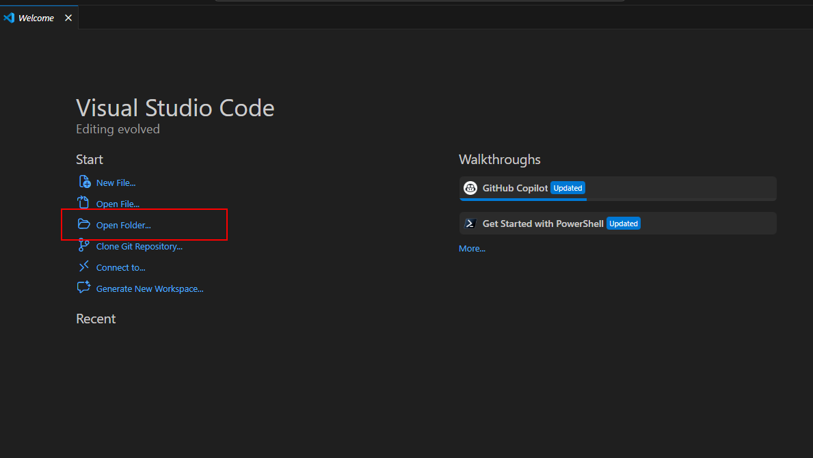
Figure: Open a source folder from the Visual Studio Code Welcome page.

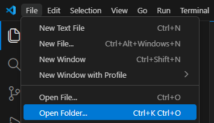
Figure: You can also select Open Folder from the File menu.

3. Select the local folder that will contain the source code, and then select **Select folder**.

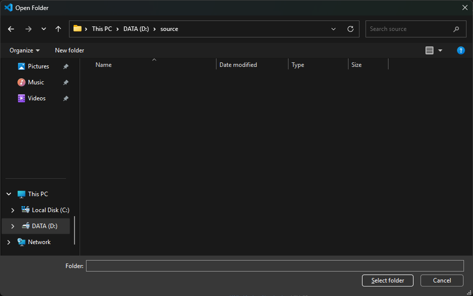
Figure: Select the local folder that will contain the code app project.

4. Select **Terminal** > **New Terminal**.

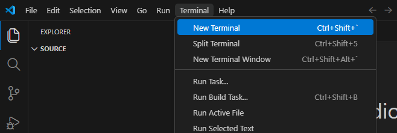
Figure: Open a new integrated terminal in Visual Studio Code.

5. Clone the Vite code app template from the Microsoft sample repository and change to the new project folder:

```powershell
npx degit github:microsoft/PowerAppsCodeApps/templates/vite suppliers-onboarding-code-app
cd suppliers-onboarding-code-app
```

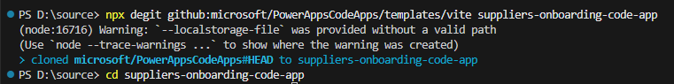
Figure: Clone the Microsoft Vite template and change to the new project folder.

> 💡 **Tip:** Run these commands from your local source folder. You can replace `suppliers-onboarding-code-app` with another folder name.

6. In the Visual Studio Code Explorer, confirm that the project contains `package.json`, `vite.config.ts`, and the `src` folder.

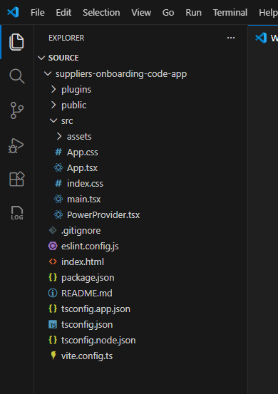
Figure: The cloned project contains the Vite and React application source files.

7. Install the project dependencies and the latest Power Apps client library and CLI as project-local dependencies:

```powershell
npm install
npm install @microsoft/power-apps@latest
npm install --save-dev @microsoft/power-apps-cli@latest
npx pa --version
```

> [!NOTE]
> The remaining CLI commands use `npx pa`. Npx runs the project-local Power Apps CLI, so you don't need to install the CLI globally. The `@latest` tags keep new lab runs aligned with the current Code Apps toolchain. The generated `package-lock.json` records the exact dependency set for your project, and `npx pa --version` helps identify that set during troubleshooting.

8. In the Power Apps maker portal, select the workshop environment. Copy the environment ID from the browser URL; it is the value after `/environments/`. Replace `<environment-id>` with that value, then sign in and initialize your code app:

```powershell
npx pa auth login
npx pa app init --display-name "Suppliers Onboarding Code App" --environment-id <environment-id>
```

> 💡 **Important:** Sign in using your Power Platform account when prompted. The environment passed to `npx pa app init` is stored in `power.config.json` and is used when you add data sources, add flows, and publish the app.

> 💡 **Important:** `power.config.json` contains the settings for connecting to Power Platform, including `appDisplayName`, `environmentId`, `connectionReferences`, and `databaseReferences`.

9. Run the code app locally:

```powershell
npx pa app run
```

    Open the URL labeled **Local Play** in the same browser profile you use for Power Apps.

    If Microsoft Edge or Google Chrome asks whether the Power Apps site can access devices on your local network, select **Allow**. The local host can't load if local-network access is blocked.

> 💡 **Important:** This is the default Vite template. You add the supplier onboarding business logic in Step 3.

> 💡 **Tip:** To stop the local web server, press **Ctrl+C** in the terminal window.

10. In Power Apps, select the workshop environment, open **Solutions**, and then open **Northwind Traders**. Copy the solution ID from the browser URL; it is the GUID after `/solutions/` and before `/overview`.

    > [!IMPORTANT]
    > Copy the solution ID from the workshop environment. The first publish determines the code app's initial solution membership.

11. Stop the local web server, build the app, and publish it to the Northwind Traders solution. Replace `<solution-id>` with the value you copied:

```powershell
npm run build
npx pa app push --solution-id <solution-id>
```

`npm run build` runs the build script configured in `package.json`. In this template, the script is `tsc -b && vite build`. `npx pa app push --solution-id <solution-id>` publishes the code app to the environment in `power.config.json` and explicitly adds it to the Northwind Traders solution. Later `npx pa app push` commands update the same app without changing its existing solution membership.

### Expected result (checkpoint)

The **Local Play** URL displays the default Vite and React experience, and `npx pa app push --solution-id <solution-id>` reports that it used the Northwind Traders solution and returns a Power Apps URL for the published app.

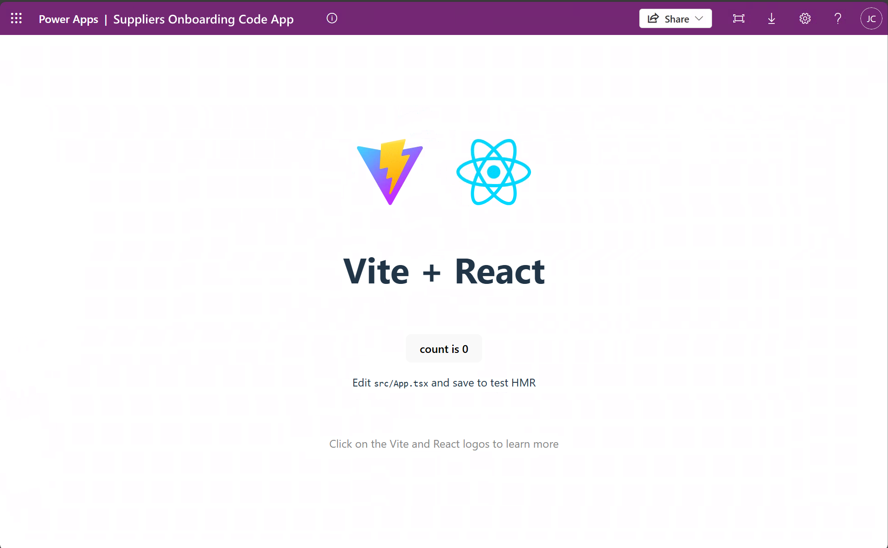
Figure: The initialized code app displays the default Vite and React experience.

Open the returned Power Apps URL and confirm that the published app loads without an error.

### Reflection

You've completed the first part of the lab and published your code app.

## Step 2: Add a Dataverse table to the app

| Step value | Connect the app to workshop data. |
| --- | --- |
| Estimated effort | 5 minutes |
| Scenario | Add the Suppliers table to the app. |
| Objective | Add a Dataverse table and verify its generated model and service. |

### Tasks covered

- Use PowerShell to add your data source.
- Test the code app locally.

### Step-by-step instructions

1. Open `power.config.json` and confirm that `environmentId` identifies the environment that contains the Northwind Traders solution. If it doesn't, return to Step 1 and initialize the app for the correct environment before continuing.

2. From the code app project folder, use the Power Apps CLI to add the Dataverse Suppliers table:

```powershell
npx pa app add data-source --connector dataverse --table nwind_suppliers
```

> 💡 **Important:** Use the Dataverse table's logical name with the `--table` option.

If the CLI prompts for the organization URL, return to Power Apps with the workshop environment selected. Select **Settings** > **Developer resources**, copy the **Web API endpoint**, and enter only its base URL before `/api/data/`. For example, enter `https://contoso.crm.dynamics.com`, not `https://contoso.crm.dynamics.com/api/data/v9.2`. Confirm that the URL belongs to the same environment identified by `environmentId` in `power.config.json`.

Confirm that the command succeeds and that generated supplier model and service files appear under `src/generated`.

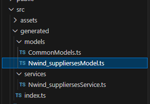
Figure: Adding the Dataverse table generates typed supplier model and service files.

3. Run the code app locally:

```powershell
npx pa app run
```

Open the **Local Play** link from the terminal in your browser.

4. After the app loads, return to the terminal and press **Ctrl+C** to stop the local web server before continuing.

### Expected result (checkpoint)

Your app is still working and now has the Dataverse Suppliers table connected to it.

### Reflection

You are now ready to add supplier onboarding business logic to the app.

## Step 3: Use GitHub Copilot to add business logic

| Step value | Add business logic to the starter template |
| --- | --- |
| Estimated effort | 20 minutes |
| Scenario | Turn the starter app into a supplier onboarding dashboard. |
| Objective | Use GitHub Copilot agent mode to implement, test, and publish the supplier workflow. |

### Tasks covered

- Use GitHub Copilot to add business logic.
- Test the application to ensure it works.
- Build and deploy the app to Power Apps.

### Step-by-step instructions

1. In GitHub Copilot Chat, select **Agent** mode.

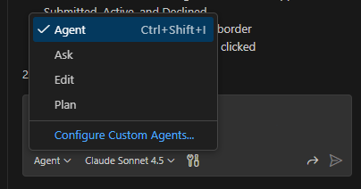
Figure: Select Agent mode in GitHub Copilot Chat.

2. Select an available model. Model availability can vary, and generated implementations can differ between models.

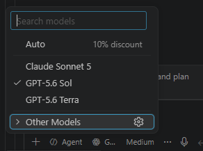
Figure: Select an available model for the coding task.

3. Submit the following prompt:

```text
Update the application to be a supplier onboarding acceptance tool. Before changing code, inspect the generated nwind_suppliers model and service files and use their exact exported types, methods, and field names. List all suppliers in a grid. Add dashboard summary buttons that filter the grid by the Submitted, Active, and Declined status reasons. Make each grid row selectable. When a row is selected, open a modal dialog that shows the supplier's full details. Add an Edit action that lets the user update fields and save changes to Dataverse. For a submitted supplier, add Accept and Decline actions that update the status reason in Dataverse and refresh the dashboard. Preserve clear loading, empty, success, and error states. Make the app responsive and verify the layout at the iPhone 12 viewport. Run lint and build after making the changes, and fix errors related to your changes.
```

> 💡 **Tip:** Depending on the selected model, the agent's reasoning and implementation can differ while still meeting the expected outcome.

Here is an example of the chat results:

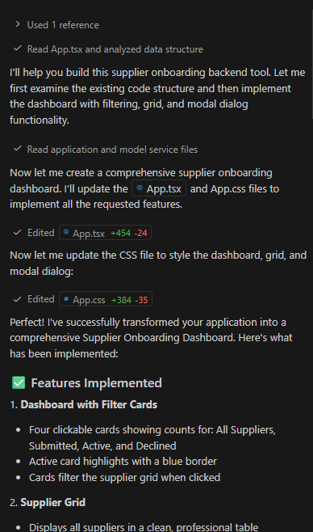
Figure: Review the files changed and features reported by the coding agent.

4. Review the files changed by the agent. Confirm that the implementation uses the generated supplier service rather than hardcoded sample data.

5. Ask the agent to run lint and build. Review and resolve any errors related to its changes before continuing.

6. Run the app locally:

```powershell
npx pa app run
```

7. Open the **Local Play** link in your browser. Verify that the dashboard loads supplier records, each status filter works, and selecting a supplier opens the details dialog.

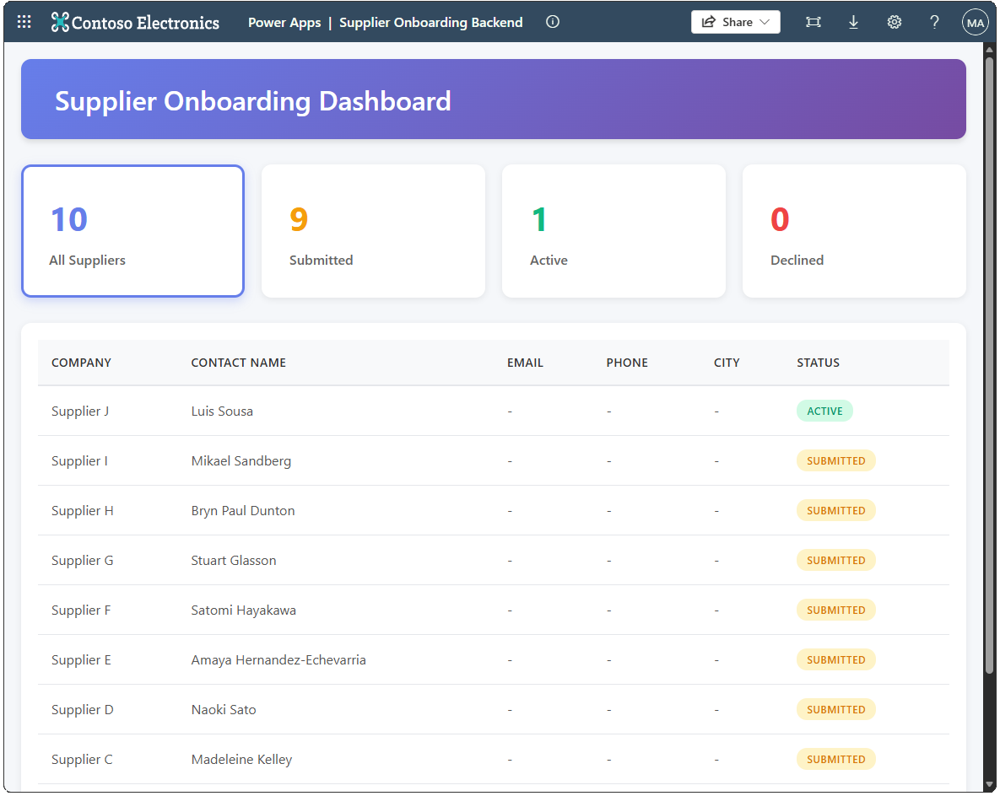
Figure: The generated dashboard lists suppliers and provides status filters.

8. Edit a supplier and save the change. Select one submitted supplier and test **Accept**. Select a different submitted supplier and test **Decline**. Refresh the page and confirm that the edit and both status changes persist in Dataverse.

9. Stop the local web server, build the app, and publish it to Power Apps:

```powershell
npm run build
npx pa app push
```

### Expected result (checkpoint)

The dashboard retrieves suppliers from Dataverse, filters them by status, opens full supplier details, saves edits, and persists accept or decline actions. The same experience loads from the published Power Apps URL.


Figure: The supplier dashboard displays Dataverse records in a filterable grid.

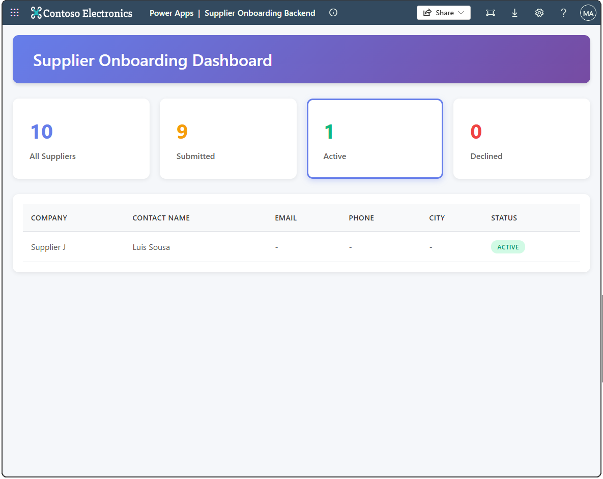
Figure: Selecting a status card filters the supplier grid.

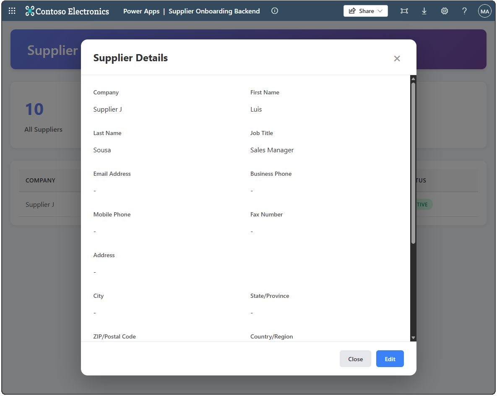
Figure: Selecting a supplier opens a dialog with the full supplier details.

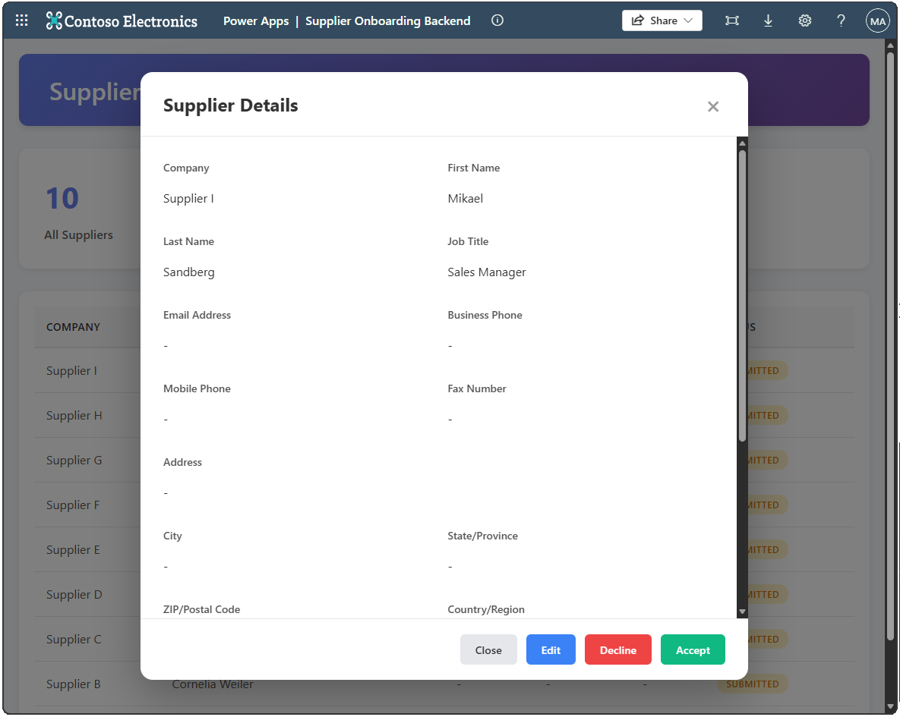
Figure: The dialog provides edit, decline, and accept actions for submitted suppliers.

### Reflection

You used GitHub Copilot to build and verify a responsive supplier onboarding workflow against the generated Dataverse service.

## Optional extension path

The required 40-minute lab is complete after Step 3. Choose any of the following independent extensions, or continue to lab completion:

| Optional extension | Continue at | Additional time |
| --- | --- | --- |
| Add weather through a custom connector | Step 4 | 20 minutes |
| Run automation through a cloud flow | Step 5 | 20 minutes |
| Ask the imported Copilot Studio agent | Step 6 | 35 minutes |

Each optional step starts from the app completed in Step 3. You don't need to complete the optional steps in order.

## Step 4: Optional - Add a custom connector to the app

| Step value | Extend the app with data from an existing custom connector. |
| --- | --- |
| Estimated effort | 20 minutes |
| Scenario | Add weather information from the Weather Details custom connector to the dashboard. |
| Objective | Add a custom connector with the Power Apps CLI, then use GitHub Copilot to create and deploy a weather widget. |

### Tasks covered

- Create a connection for the Weather Details custom connector.
- Add the custom connector to the code app with the Power Apps CLI.
- Use GitHub Copilot to add weather information to the dashboard.
- Test, build, and deploy the updated app to Power Apps.

### Step-by-step instructions

> [!IMPORTANT]
> This extension is optional. Complete Steps 1-3 before starting, keep the code app project open in Visual Studio Code, and use the same Power Platform environment throughout these steps.

1. In Power Apps, select your environment, open **Solutions**, and then open the **Northwind Traders** solution.

2. Under **Objects**, select **Custom connectors**, and then select **Weather Details**.

3. In the browser address bar, copy the connector name from the URL. It is the value after `/custom/` and before `/details`. Save it for a later step.

The connector name resembles the following value:

```text
shared_nwind-5fweather-20details-5f4fae8b9128b8dd07
```

> [!IMPORTANT]
> Connector names are environment-specific. Copy the value from your environment rather than using the example value.

4. Select **Edit**, select the **5. Test** tab, and then select **+ New connection**. Complete any prompts to create the Weather Details connection.

5. Creating the connection opens Power Automate in a new browser tab. In that tab, confirm that the same environment is selected, and then select **Connections** in the left navigation pane. If the tab does not open, go to <https://make.powerautomate.com>, select the same environment, and then select **Connections**.

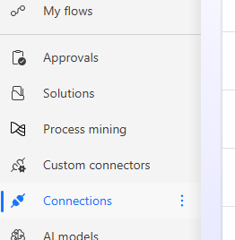
Figure: Connections in the Power Automate navigation pane.

6. Locate the **Weather Details** connection, select the three-dot menu, and then select **View details**.

7. In the browser address bar, copy the connection ID from the URL. It is the GUID after the connector name and before `/details`. Save it for the next step.

The connection ID resembles the following value:

```text
cce23180-4c4f-4e1d-b88a-c65d91030185
```

> [!IMPORTANT]
> Connection IDs are environment-specific. Copy the value from your connection rather than using the example value.

8. Return to Visual Studio Code. Run the following command to confirm which account the Power Apps CLI is using:

```powershell
npx pa auth status
```

Confirm that the active account has access to the environment where you created the connection. Then open `power.config.json` and verify that `environmentId` matches that environment. If either value is incorrect, do not continue until you switch to the correct account or initialize the app for the correct environment.

9. From the code app project folder, run the following command. Replace `<connector-name>` and `<connection-id>` with the values you copied.

```powershell
npx pa app add data-source --connector <connector-name> --connection-id <connection-id>
```

For example:

```powershell
npx pa app add data-source --connector shared_nwind-5fweather-20details-5f4fae8b9128b8dd07 --connection-id cce23180-4c4f-4e1d-b88a-c65d91030185
```

If the CLI asks **Are you using a connection reference instead of a connection ID?**, select **No**. This path uses the connection ID copied in step 7.

10. Wait for the command to report success. Open `power.config.json` and confirm that its `connectionReferences` section contains an entry whose `displayName` is `Weather Details`.

> [!NOTE]
> The generated IDs in your `power.config.json` are specific to your environment.

11. In GitHub Copilot Chat, select **Agent** mode and submit the following prompt:

```text
Use the Weather Details connector to add a small weather widget in the top-right corner of the dashboard. Show the weather for my current location. If the current location is not available, show the weather for Seattle, WA. Display "Current location" when the widget uses the browser location and "Fallback location: Seattle, WA" when it uses the fallback. Include a Refresh data button. Check the Weather Details connector's schema file first to understand the expected parameters and response format before writing the code.
```

12. Review the agent's changes and resolve any reported errors. When the agent finishes, run the app locally:

```powershell
npx pa app run
```

13. Open the **Local Play** URL in Microsoft Edge and test both location paths:

- Select the site information icon to the left of the address bar, open **Permissions for this site**, set **Location** to **Allow**, and reload the page. Select **Refresh data**, and verify that the widget shows weather for your location with the label **Current location**.
- Return to **Permissions for this site**, set **Location** to **Block**, and reload the page. Select **Refresh data**, and verify that the widget shows Seattle weather with the label **Fallback location: Seattle, WA**.
- Restore your preferred location permission after completing the test.

14. Stop the local development server by pressing **Ctrl+C** in the terminal. Build and deploy the updated app:

```powershell
npm run build
npx pa app push
```

15. Open the Power Apps URL returned by the Power Apps CLI and verify that the deployed dashboard displays the weather widget without errors.

### Expected result (checkpoint)

The `power.config.json` file contains the Weather Details connection reference, and both the local and deployed apps display a working weather widget. You verified that the widget uses the current location when permission is allowed, falls back to Seattle when permission is blocked, displays the corresponding location label, and refreshes on demand.

### Reflection

You added an existing custom connector to a code app, used its generated schema with GitHub Copilot, and deployed the resulting integration to Power Apps. You can apply the same pattern to other custom connectors available in your environment.

## Step 5: Optional - Add a Power Automate flow to the app

| Step value | Trigger reusable automation from the supplier onboarding experience. |
| --- | --- |
| Estimated effort | 20 minutes |
| Scenario | Run a cloud flow after a supplier is saved and display the flow response. |
| Objective | Discover, add, invoke, test, and deploy the solution-aware instant cloud flow included in the latest solution. |

### Tasks covered

- Locate the solution-aware instant cloud flow in Northwind Traders.
- Discover and add the flow with the Power Apps CLI.
- Use GitHub Copilot to invoke the generated flow service after a supplier is saved.
- Validate the flow response locally and in the deployed app.

### Step-by-step instructions

> [!IMPORTANT]
> This extension is optional and doesn't require Step 4. Complete Steps 1-3 before starting, keep the same code app project open, and use the same Power Platform environment throughout these steps.

1. In Power Apps, select your environment, open **Solutions**, and then open the **Northwind Traders** solution. Under **Objects**, select **Cloud flows**.

    Open **Instant flow for app** and confirm that it is turned on. If the flow is missing, stop and ask the facilitator to import the latest Northwind Traders solution.

    The flow accepts an `inputText` value from the app. Its response concatenates that value with a timestamp and returns the result in the `response` property.

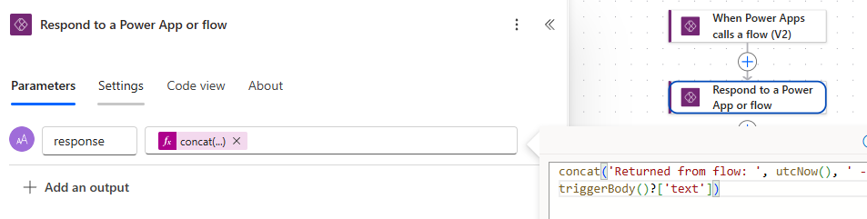
Figure: Instant flow for app receives text from the code app and returns text with a timestamp.

2. Return to Visual Studio Code. From the code app project folder, list solution-aware flows whose names contain **Instant flow for app**:

```powershell
npx pa app list-flows --search "Instant flow for app"
```

    Find **Instant flow for app** in the results and copy its **Flow ID**.

> [!IMPORTANT]
> Flow IDs are environment-specific. Copy the ID returned in your environment instead of using an ID shown in a screenshot or example.

3. Add the flow to the code app. Replace `<flow-id>` with the value you copied:

```powershell
npx pa app add flow --flow-id <flow-id>
```

    Open the generated flow schema, model, and service files. Confirm that the service exposes a `Run` method with an `inputText` parameter and a typed response before you update the app.

    Open `power.config.json` and confirm that it contains the `instantflowforapp` data source and its connection reference.

> [!NOTE]
> Generated IDs and connection reference names differ between environments.

4. In GitHub Copilot Chat, select **Agent** mode and submit the following implementation prompt:

```text
Update the app to call the "Instant flow for app" (instantflowforapp) flow when a supplier is saved. The flow accepts an inputText parameter; send the supplier name. When the response comes back, show result.data.response in a dismissible toast at the top of the app and automatically dismiss the toast after 5 seconds.
```

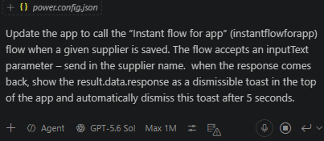
Figure: GitHub Copilot updates the supplier save experience to invoke the generated flow service.

    Then submit this validation prompt:

```text
Before finalizing the flow integration, inspect the generated flow schema, model, and service files and confirm the exact Run method, input, and response types. Call the flow only after the Dataverse supplier save succeeds. Await the flow result. Show result.data.response only when result.success is true. If the flow call fails, show a dismissible error toast without undoing or reporting the successful supplier save as failed. Preserve any optional weather widget that is already present, along with the responsive layout and mobile behavior. Run lint and build, and fix errors related to these changes.
```

5. Review the agent's changes. Confirm that it calls the flow only after the supplier save succeeds and that a flow failure doesn't undo or misreport a successful Dataverse save. Then run the app locally:

```powershell
npx pa app run
```

6. Open the **Local Play** URL and test the integration:

    1. Open a supplier record and select **Edit**.
    2. Change a value and save the supplier.
    3. Verify that a toast appears at the top of the app after the save succeeds.
    4. Verify that the toast includes the supplier name and a timestamp returned by the flow.
    5. Verify that you can dismiss the toast and that it otherwise disappears automatically after approximately five seconds.

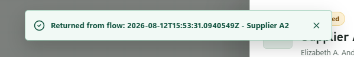
Figure: A successful supplier save invokes the flow and displays its response in a dismissible toast.

7. In Power Automate, open **Instant flow for app** and review its run history. Confirm that the test run has a **Succeeded** status and that its input contains the supplier name you saved.

8. Stop the local development server by pressing **Ctrl+C** in the terminal. Build and deploy the updated app:

```powershell
npm run build
npx pa app push
```

9. Open the Power Apps URL returned by the CLI. Save another supplier and verify that the deployed app displays the flow response toast without errors. Confirm that the corresponding cloud flow run succeeds in Power Automate.

### Expected result (checkpoint)

The code app contains the generated files and configuration for **Instant flow for app**. Saving a supplier successfully invokes the flow in both the local and deployed app, the flow run succeeds, and the app displays the returned supplier name and timestamp in a dismissible toast that closes automatically after approximately five seconds.

### Reflection

You added a solution-aware instant cloud flow to a code app, used its generated typed service from the supplier save experience, validated the flow run, and deployed the integration to Power Apps.

## Step 6: Optional - Add a Copilot Studio agent

| Step value | Add a grounded conversational experience to the supplier dashboard. |
| --- | --- |
| Estimated effort | 35 minutes |
| Scenario | Let an operations manager ask questions about the status totals currently displayed in the app. |
| Objective | Use the imported agent, add the Microsoft Copilot Studio connector, implement an accessible Fluent UI chat rail, and confirm the end-to-end experience works with dashboard context. |

### Tasks covered

- Locate and verify the Supplier Onboarding Agent imported with the latest solution.
- Create or locate a Microsoft Copilot Studio connection and add it to the code app.
- Inspect and use the generated `ExecuteCopilotAsyncV2` service contract.
- Use GitHub Copilot to implement a responsive, accessible chat experience.
- Validate an end-to-end agent response, conversation continuity, layout, build output, consent, and deployment.

### Step-by-step instructions

> [!IMPORTANT]
> This extension is optional and doesn't require Steps 4 or 5. Complete Steps 1-3 before starting, keep the same code app project open, and use the same Power Platform environment. The status totals sent to the agent come from the supplier data already loaded by the dashboard; the chat must not maintain a second copy of those totals.

> [!NOTE]
> Screenshots in this extension use generic paths and placeholders where environment-specific connection names, IDs, URLs, or response data were redacted.

1. In Power Apps, select the workshop environment, open **Solutions**, and then open **Northwind Traders**. Under **Objects**, select **Agents** and open **Supplier Onboarding Agent**. If the agent is missing, stop and ask the facilitator to import the latest solution.

2. Open the imported agent in Copilot Studio and select **Test** to open the **Test your agent** pane. Send this message:

```text
Help me prepare a supplier for onboarding.
```

Confirm that the agent returns a relevant supplier-onboarding response. The wording can vary. This is a connectivity check; it doesn't require validating table data or a specific answer.

3. Confirm that the agent is published. If Copilot Studio shows unpublished changes, ask the facilitator to publish the imported agent before continuing. Don't create a replacement agent.

4. Select **Channels** > **Web app** and view the connection string.

    Copy the value between `/bots/` and `/conversations` in the connection string. This is the case-sensitive agent name. A generated name resembles `nwind_supplierOnboardingAgent`, but the publisher prefix and capitalization in your environment can differ.

> [!IMPORTANT]
> Use the agent name from your connection string. Don't copy the example value or the agent's display name.

5. Return to Visual Studio Code. Confirm that the CLI account and code app still target the workshop environment:

```powershell
npx pa auth status
```

    Open `power.config.json` and confirm that its `environmentId` identifies the same environment where the imported agent is published.

6. List Microsoft Copilot Studio connections in that environment:

```powershell
npx pa connection list --search "Microsoft Copilot Studio" --json
```

    If the output contains a connection whose connector ID ends with `shared_microsoftcopilotstudio`, copy its `connectionId` and continue to step 7.

    If no matching connection exists, create one:

```powershell
npx pa connection create --connector shared_microsoftcopilotstudio --display-name "Supplier Onboarding Agent" --json
```

    Complete the Microsoft Entra sign-in or consent prompt, and then copy the returned `connectionId`.

7. Add the Microsoft Copilot Studio connector to the code app. Replace `<connection-id>` with the ID from step 6:

```powershell
npx pa app add data-source --connector shared_microsoftcopilotstudio --connection-id <connection-id>
```

If the CLI asks **Are you using a connection reference instead of a connection ID?**, select **No**. This path uses the connection ID copied in step 6.

Confirm that the command succeeds, `power.config.json` contains a Microsoft Copilot Studio connection reference, and `src/generated` contains a model and service for the connector.

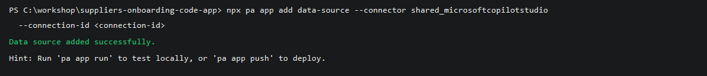
Figure: Add the connector with an environment-specific connection ID and confirm that the data source is generated.

8. Open the generated service and locate `ExecuteCopilotAsyncV2`. Record its exact import name, parameter order or request-object shape, and response type. Don't edit any file under `src/generated`.

> [!NOTE]
> Generated connector contracts can differ by CLI or connector version. Microsoft documentation shows `CopilotStudioService.ExecuteCopilotAsyncV2`, while a generated service can expose the agent path, request body, and optional conversation ID as separate parameters. The generated files in your project are the source of truth.

9. Install the Fluent UI packages used by the chat experience:

```powershell
npm install @fluentui-contrib/react-chat @fluentui/react-components @fluentui/react-icons
npm list @fluentui-contrib/react-chat @fluentui/react-components @fluentui/react-icons
```

> [!NOTE]
> These packages intentionally resolve to their current releases so new lab runs remain current. The generated `package-lock.json` records the exact versions used in your project. Include the `npm list` output when reporting a package-specific problem.

10. In GitHub Copilot Chat, select **Agent** mode. Replace `<agent-name>` in the following prompt with the case-sensitive agent name from step 4, and then submit the prompt:

```text
Add a right-side Supplier Onboarding Agent chat rail to the existing code app by using Fluent UI v9, @fluentui-contrib/react-chat, @fluentui/react-components, and @fluentui/react-icons.

Before editing code:
1. Inspect the generated Microsoft Copilot Studio model and service files.
2. Use their exact exported names, ExecuteCopilotAsyncV2 signature, and response types.
3. Don't edit files under src/generated.

Copilot Studio integration:
1. Invoke the published agent named <agent-name> with ExecuteCopilotAsyncV2.
2. Send the required notificationUrl value "https://notificationurlplaceholder".
3. Send message as a JSON string with userMessage and supplierSummary. Build supplierSummary from the dashboard's current Submitted, Active, and Declined totals; don't hardcode or query a second copy of the data.
4. Pass the existing conversation ID when the generated operation supports it, and preserve the returned conversation ID for the next turn.
5. Create a typed adapter outside src/generated that normalizes documented response-property casing, extracts lastResponse or the final responses entry, handles text and JSON-string responses, and returns user-friendly errors for connector failures or empty responses.

Chat experience:
1. Keep the chat in focused component, adapter, and stylesheet files, and lazy-load the chat component.
2. Build a collapsible right-side rail that opens by default and uses Chat, ChatMessage, and ChatMyMessage.
3. Add accessible close and new-conversation icon buttons with tooltips. New conversation must clear the saved conversation ID and visible transcript.
4. Show user and agent timestamps, support Enter to send and Shift+Enter for a new line, show a Fluent spinner while waiting, disable the composer while sending, display errors beside the composer in a live region, and scroll to the newest message.
5. Add an accessible circular launcher when the rail is closed.

Layout and theme:
1. Use width: min(448px, 100vw) for the rail. Dock it without covering the workspace on wide screens, use an overlay and dismissible scrim on narrower desktop and tablet screens, and use a full-width surface below the existing header on mobile.
2. Give outgoing message bodies min-width: 180px and max-width: min(340px, calc(100vw - 118px)). Keep outgoing timestamps on one line and allow long text to wrap without overflowing.
3. Wrap both the rail and closed launcher in FluentProvider. Reuse the app's Fluent theme when one exists; otherwise derive a complete light BrandVariants ramp from the app's existing primary color rather than using Fluent's default blue.
4. Use Fluent semantic tokens: colorBrandBackground for primary and user-message backgrounds, colorCompoundBrandStroke for the focused input underline, colorNeutralForegroundOnBrand for user text and timestamps, neutral tokens for agent messages and borders, red palette tokens for errors, and Fluent shadow and overlay tokens.
5. Preserve the app's current visual language, responsive behavior, loading states, supplier actions, and any optional weather widget or flow toast that is already present.

Run npm run lint and npm run build. Fix errors related to these changes, but don't publish the app.
```

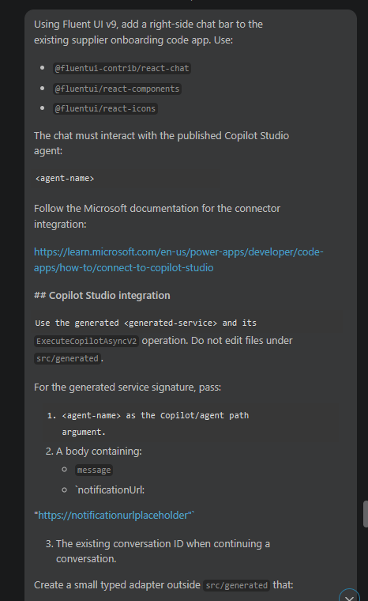
Figure: Submit the implementation prompt after replacing the redacted agent and generated-service placeholders with values from your project.

11. Review the changed files. Confirm that no generated file was edited and that the request uses the live dashboard totals. Then submit this validation prompt:

```text
Validate the agent chat implementation against these requirements:
1. Confirm the generated ExecuteCopilotAsyncV2 contract is called exactly as generated and that the returned conversation ID is reused when supported.
2. Confirm a new conversation clears both transcript and conversation ID.
3. Confirm the chat is lazy-loaded into separate JavaScript and CSS chunks.
4. Confirm the desktop rail doesn't overlap the workspace at 1440 x 900 and the mobile surface doesn't overlap the app header at 390 x 844.
5. Confirm a short outgoing message such as "testing" is at least 180px wide, stays on one line, and has a one-line timestamp.
6. Confirm send, focus, message, error, border, shadow, and overlay colors use the required Fluent semantic tokens and match the app's existing primary color.
7. Confirm normal text has a contrast ratio of at least 4.5:1 and large text, focus indicators, and meaningful UI boundaries have a contrast ratio of at least 3:1.
8. Confirm every icon control has an accessible name, errors use a live region, keyboard focus order is logical, focus remains visible, and the chat has no keyboard trap.
9. Run npm run lint and npm run build, and fix errors related to the chat changes. Don't publish the app.
```

12. Run the local app:

```powershell
npx pa app run
```

    Open the **Local Play** URL. The first run can display **Allow Suppliers Onboarding Code App to access your data?** for Microsoft Copilot Studio. Review the connection and select **Allow**.

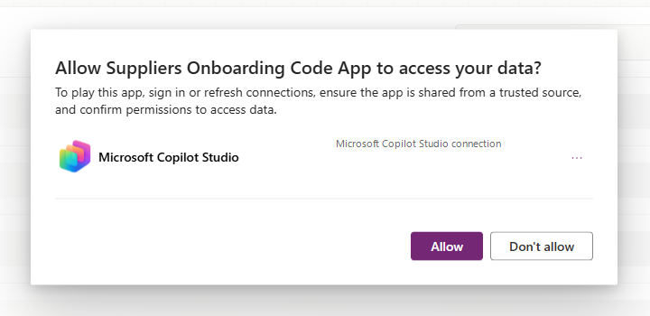
Figure: Review the Microsoft Copilot Studio connection and allow the code app to use it.

13. Test the chat at a desktop viewport of approximately `1440 x 900`:

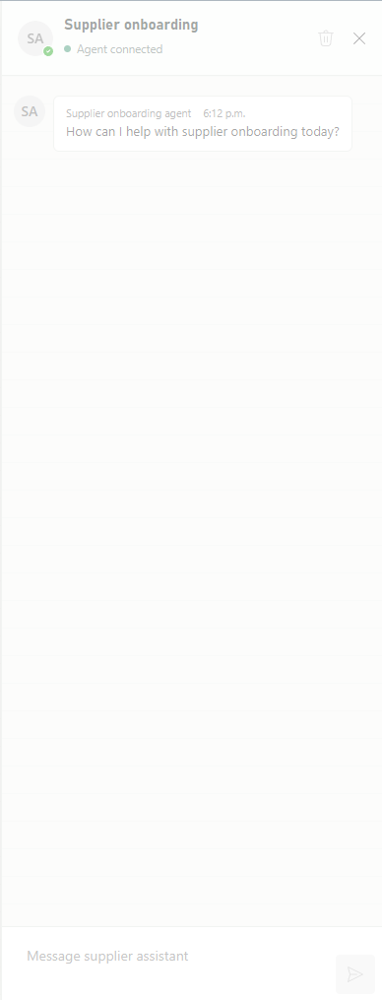
Figure: The open chat rail shows the connected Supplier Onboarding Agent and message composer.

    1. Confirm that the open rail doesn't cover the supplier workspace.
    2. Send `Summarize the supplier statuses on this dashboard.` Confirm that the agent returns a relevant response without a connector error. Exact wording and counts can vary as workshop data changes.
    3. Send `What status did I ask about?` and confirm that the response preserves the preceding conversation context.
    4. Select **New conversation**, send `What status did I ask about?` again, and confirm that the previous context isn't retained.
    5. Send `testing` and confirm that the outgoing bubble doesn't collapse or wrap character by character.
    6. Close the rail. Without using the mouse, press **Tab** to the launcher, confirm that focus is visible, and open the rail with **Enter** or **Space**.
    7. With the rail open, press **Tab** through the close button, new-conversation button, transcript, composer, and send button. Confirm that the order is logical, focus remains visible, every interactive control can be activated with **Enter** or **Space**, and focus doesn't become trapped in the chat.
    8. In Microsoft Edge DevTools, inspect the launcher while the rail is closed. Open the rail and inspect the close button, new-conversation button, composer, and send button. Confirm that each control has the expected accessible name and role.

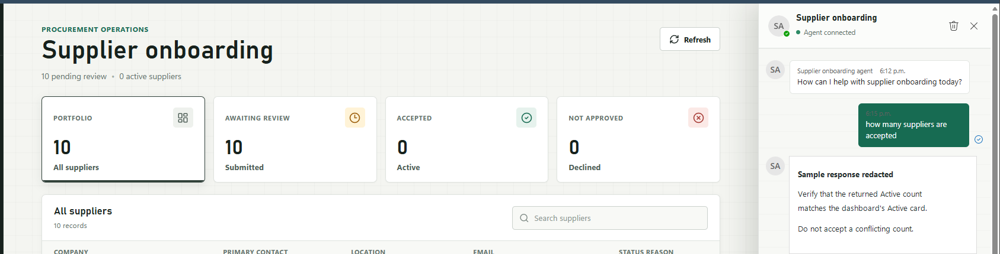
Figure: Confirm that the agent returns a supplier-status response; the sample response and tenant-specific record URL are intentionally redacted.

14. Use browser developer tools to test at `390 x 844`. Confirm that the chat becomes a full-width surface below the existing header, text and controls remain visible, and the chat doesn't cause horizontal scrolling.

15. Run the following accessibility and asset checks:

    1. Open Accessibility Insights for Web, run **FastPass**, and complete both **Automated checks** and **Tab stops**. Resolve every failure in the chat experience.
    2. Use the Microsoft Edge **Inspect** tool or another contrast checker to verify at least `4.5:1` contrast for normal text and `3:1` for large text, focus indicators, and meaningful UI boundaries in normal, hover, focus, pressed, and disabled states.
    3. Turn on Windows Narrator. In DevTools, temporarily set the network to **Offline**, send a message, and confirm that the connector error is announced once from the live region. Restore the network setting before continuing.
    4. In the DevTools **Network** pane, reload the app and open the chat. Confirm that the lazy chat JavaScript and CSS chunks return a successful status.
    5. In the DevTools **Console** pane, confirm that there are no connector or rendering errors after the network is restored.

16. Stop the local server, run the final checks, and publish the app:

```powershell
npm run lint
npm run build
npx pa app push
```

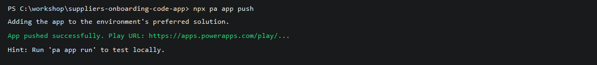
Figure: A successful push returns a Power Apps play URL; the tenant-specific URL is replaced with a generic placeholder.

17. Open the returned Power Apps URL, authorize the Microsoft Copilot Studio connection when prompted, and repeat the supplier-status question to confirm that the deployed agent responds. Each user must authorize their own connector connection.

### Expected result (checkpoint)

The published code app contains an accessible, responsive chat rail that invokes the published Supplier Onboarding Agent through the generated `ExecuteCopilotAsyncV2` service. The agent returns a relevant response to a supplier-status question, a follow-up turn preserves context, **New conversation** clears context, the desktop and mobile layouts don't overlap, the chat assets load lazily, and both lint and build complete without errors.

### Reflection

You connected the imported agent to a code app through a typed connector service, grounded each request in current app state, and validated the conversation and layout instead of accepting an unverified AI response.

## 10. Lab completion

Congratulations! You've completed the required path and built a supplier onboarding code app connected to Dataverse.

### Key takeaways

You can now create a code app, connect it to Dataverse, implement business logic with GitHub Copilot, and publish the experience to Power Apps.

Power Apps code apps let developers bring Power Apps capabilities into custom web apps built in a code-first IDE.

Develop locally and run the same app in Power Platform.

Build with popular frameworks while keeping full control over your UI and logic.

### Optional extension checklist

The following extensions are optional and don't affect completion of the required lab. Mark the extensions you completed:

- [ ] **View weather** - Add the Weather Details custom connector in Step 4.
- [ ] **Run automation** - Add Instant flow for app in Step 5.
- [ ] **Ask an agent** - Add the imported Supplier Onboarding Agent in Step 6.

If you completed one or more extensions, you also practiced adding generated connector services, invoking a solution-aware flow, or grounding a Copilot Studio conversation in current app state.

## 11. Challenge: apply this to your scenario

Try extending what you built:

- Replace the `nwind_suppliers` table with a Dataverse table from your own environment. Update the Copilot prompt to reflect your table's columns and business rules. How much of the generated code carries over?
- Add a second Dataverse data source with `npx pa app add data-source --connector dataverse --table <logical-table-name>` and ask Copilot to render related records in the modal dialog.
- Refine the Copilot agent prompt to enforce a specific UI framework or colour scheme. How precisely can you control the output through prompt engineering alone?
- Push the finished app into an unmanaged solution with `npx pa app push --solution-id <solution-id>`, export it as managed, and import it into a second environment. What other ALM steps are needed to promote a code app through dev, test, and production?

### Optional extension challenges

- Replace **Weather Details** with another connector and use its generated schema to add a different dashboard insight.
- Replace **Instant flow for app** with another solution-aware instant cloud flow. Run `npx pa app add flow --flow-id <flow-id>` again after changing the flow definition, and ask Copilot to adapt the app to the regenerated types.
- Extend the optional agent payload with the selected supplier's non-sensitive fields. Update the agent instructions so it clearly distinguishes dashboard summary data from selected-record context.

## 12. Summary & best practices

Code Apps golden rules:

- **Use the project-local CLI** - install `@microsoft/power-apps-cli` as a development dependency and run it with `npx pa` so every contributor uses the version recorded by the project.
- **Target the correct environment during initialization** - pass `--environment-id` to `npx pa app init` and verify `environmentId` in `power.config.json` before adding data sources or flows.
- **Publish into a solution when required for ALM** - pass `--solution-id <solution-id>` on the first `npx pa app push` when the app must belong to a specific unmanaged solution.
- **Commit `power.config.json` to source control** - it holds your environment ID, connection references, and database references. Losing it means rerunning `npx pa app init`.
- **Test locally before every push** - use `npx pa app run` and the **Local Play** URL to validate changes. Catching errors locally is faster than debugging a deployed app.
- **Give Copilot the full context upfront** - include the table name, column names, generated service contract, and all user stories in the initial agent prompt.
- **Fix errors iteratively with the agent** - paste console errors or lint output directly into Copilot Chat, then review and test the proposed changes.
- **Use the current Power Apps packages** - install the packages with the `@latest` tag for a new lab run, retain the generated `package-lock.json` while developing, and record `npx pa --version` when reporting a problem.

### Optional extension best practices

- **Preserve generated connector contracts** - inspect generated models and services before writing integration code, keep adapters outside `src/generated`, and regenerate instead of hand-editing generated files.
- **Refresh generated flow files after flow changes** - run `npx pa app add flow --flow-id <flow-id>` again when the flow definition changes.
- **Ground agent requests in current app state** - send the minimum current dashboard context needed for the question instead of hardcoding sample values.

### Troubleshooting

#### Scripts are blocked from running

If you encounter an error such as:

    running scripts is disabled on this system

Confirm the current execution policy:

```powershell
Get-ExecutionPolicy -List
```

Ensure that `RemoteSigned` is set at either the `LocalMachine` or `CurrentUser` scope.

***

#### Running scripts in VS Code or during tool setup

Some development tools (for example, VS Code, npm scripts, or CLI bootstrapping) may encounter script execution errors. First, verify that `RemoteSigned` is set at the `CurrentUser` scope. This resolves most tool setup issues without requiring elevated permissions:

```powershell
Set-ExecutionPolicy -Scope CurrentUser -ExecutionPolicy RemoteSigned
```

If the issue persists, you can allow scripts for the current session only using `Bypass` as a last resort:

```powershell
Set-ExecutionPolicy -Scope Process -ExecutionPolicy Bypass
```

*   Applies **only to the current PowerShell session**
*   Does **not change system-wide settings**
*   Resets automatically when the terminal is closed

> [!IMPORTANT]
> `Bypass` removes all warnings and prompts; nothing is blocked. Use it only as a last resort for temporary troubleshooting. Do not use `Bypass` as a persistent or recommended configuration.

***

#### Downloaded scripts are blocked

Scripts downloaded from the internet may be blocked even with `RemoteSigned`.

> [!IMPORTANT]
> Before unblocking, inspect the script contents to confirm it comes from a trusted source. Only unblock scripts you have reviewed or that originate from an official repository.

To unblock a script:

```powershell
Unblock-File -Path .\script.ps1
```

Then rerun the script.

***

#### Npx can't find the Power Apps CLI

From the code app project folder, install the CLI development dependency and confirm its version:

```powershell
npm install --save-dev @microsoft/power-apps-cli@latest
npx pa --version
```

If the command still fails, confirm that you are in the folder that contains `package.json` and rerun `npm install`.

***

### Optional extension troubleshooting

#### Weather Details connection isn't available

Confirm that the latest Northwind Traders solution is imported into the environment identified by `power.config.json`. Verify that **Weather Details** appears under **Custom connectors**, that your account can create a connection, and that the environment's data policy permits the connector. If the connector is absent, ask the facilitator to import the latest solution.

***

#### Instant flow for app isn't listed

Confirm all of the following conditions before rerunning `npx pa app list-flows --search "Instant flow for app"`:

- `environmentId` in `power.config.json` identifies the environment that contains Northwind Traders.
- **Instant flow for app** belongs to a solution, uses the Power Apps trigger, and is turned on.
- The active account shown by `npx pa auth status` has access to the flow and its connections.

***

#### The supplier saves but no response toast appears

Open the browser developer console and the flow run history, then determine which operation failed:

- If no flow run exists, confirm that the generated service `Run` method is called after the supplier save succeeds.
- If the flow run failed, open the failed run and review the trigger input, connection, and response action.
- If the flow run succeeded, inspect the generated response type and confirm that the app reads the returned `response` property only when `result.success` is `true`.

After correcting the failure, repeat the local and deployed verification in Step 5.

***

#### The agent doesn't return a response

Confirm all of the following conditions:

- The agent is published in the environment identified by `power.config.json`.
- The app uses the case-sensitive agent name from the **Web app** channel connection string, not the display name.
- The generated service calls `ExecuteCopilotAsyncV2`, not `ExecuteCopilot` or `ExecuteCopilotAsync`.
- The request includes the required placeholder notification URL and follows the generated service signature.
- The signed-in user can access the agent and has authorized a Microsoft Copilot Studio connection.

After correcting the configuration, start a new conversation and repeat the supplier-onboarding connectivity test from Step 6 before testing the app again.

***

#### The agent response doesn't mention dashboard status data

Open the browser developer tools and inspect the request constructed by the chat adapter without logging personal or supplier data. Confirm that `supplierSummary` contains the **Submitted**, **Active**, and **Declined** values visible when the message is sent.

If the payload is present and the connector returns a response, the end-to-end integration is working; sample values and response wording can vary. Start a new conversation and retry the supplier-status question if the response omits the supplied context.

***

#### The chat message collapses into a narrow column

Inspect the outgoing message body and confirm that its computed `min-width` is `180px`, its maximum width respects the mobile viewport, and no ancestor applies an intrinsic width that overrides those constraints. Repeat the `testing` message check at both required viewport sizes.
