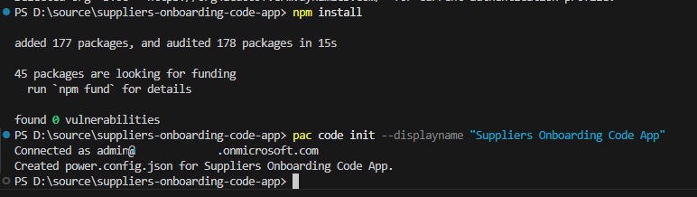
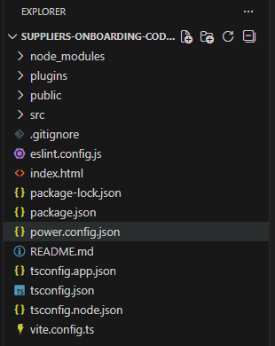
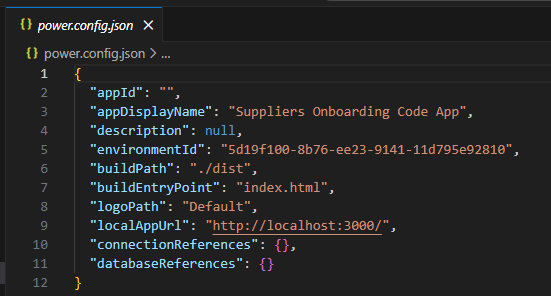
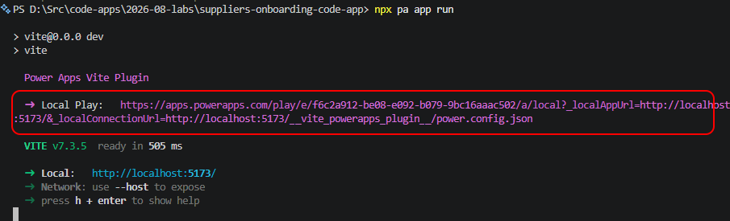
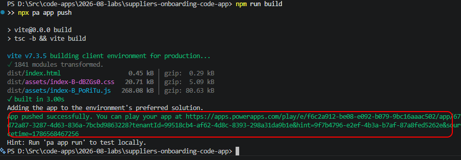
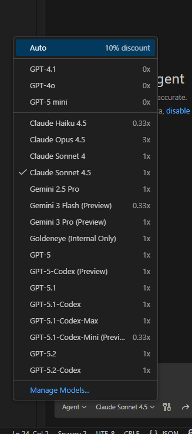

## Power CAT | The Intelligent Enterprise - Power Platform & AI for Frontier Firms

Code App with Dataverse

Intelligent Apps and Agents — Lab authoring template

| Level | 200 |
| --- | --- |
| Persona | Pro Code / Maker |
| Estimated duration | 45 minutes |
| Audience assumptions | Familiarity with Dataverse, Code Tools, and basic web app development |
| Author / team | Christopher Moncayo |
| Last updated | 2026-01-28 |
| Version | [v0.1] |

# 1. Lab overview

## 1.1 Lab purpose

This lab demonstrates the **Bring Your Own Code (BYOC)** feature in **Power Apps**, enabling developers to integrate custom logic into a single page application for **Supplier Onboarding Management**. The backend system leverages **Microsoft Dataverse** and connects to the **Suppliers** table to retrieve and manage supplier records.

The app displays supplier data in a tabular format, allowing users to:

- **View Details**: Click on a supplier record to open a **modal dialog** showing detailed information.
- **Take Action**: Approve or decline onboarding requests directly from the modal interface.
This scenario highlights how BYOC extends Power Apps functionality by combining custom code with Dataverse data, delivering a tailored experience for supplier management workflows.

## 1.2 Why this matters

The BYOC feature empowers development teams to **reuse existing code** or **create bespoke experiences** with custom logic, reducing duplication and accelerating delivery. It also enables teams to integrate their own code seamlessly with tools they already know and trust—such as **Visual Studio Code**, **Git**, and **GitHub Copilot**—bringing modern development practices into the Power Platform ecosystem. This flexibility fosters innovation, improves maintainability, and ensures alignment with enterprise coding standards.

# 2. App scenario

| Industry / function | Operations |
| --- | --- |
| Primary user role | Operations Manager |
| Problem statement | How can Contoso Electronics use their existing code in Power Apps |
| Intelligent outcome | Bring your own code allows the enterprise to run their own custom code within the Power Apps environment |

# 3. Core concepts

| Concept | Why it matters |
| --- | --- |
| Bring Your Own Code | Publish bespoke code to Power Apps |
| Governance & ALM | Enterprise can use their own ALM against their bespoke code. |

# 4. Intelligence used in this lab

| Intelligence type | Where it’s used | Purpose |
| --- | --- | --- |
| GitHub Copilot | Visual Studio Code | Provide a code agent to help the developer quickly code their application |

# 5. Documentation & learning resources

# 6. Prerequisites

Import Northwind Traders version 1.0.0.11 or later to the environment and seed with data using the Northwind Sample Data App. [See Solutions folder for the solution and full instructions](../../../solutions/README.md)

[Node.js Long-term support (LTS) version](https://nodejs.org/)

[Power Platform CLI](https://learn.microsoft.com/power-platform/developer/cli/introduction?tabs=windows)

End users that run code apps need a Power Apps Premium License

## Configure PowerShell Execution Policy

To run scripts on your system, configure the PowerShell execution policy.

**Recommended setting:**
- `RemoteSigned` at the `CurrentUser` scope (preferred — no admin required, affects current user only)
- `RemoteSigned` at the `LocalMachine` scope (alternative — requires administrator elevation, affects all users on this machine)

This setting allows locally developed scripts to run while requiring scripts downloaded from external sources to be signed or explicitly trusted.

```powershell
# Preferred (no admin required, current user only):
Set-ExecutionPolicy -Scope CurrentUser -ExecutionPolicy RemoteSigned

# Alternative (requires admin, affects all users on this machine):
Set-ExecutionPolicy -Scope LocalMachine -ExecutionPolicy RemoteSigned
```

For more information, see about_Execution_Policies at https://go.microsoft.com/fwlink/?LinkID=135170

> [!NOTE]
> Execution policies are not a security boundary. They help prevent unintentional script execution but should be combined with other security controls.

# 7. Learning outcomes

You’re able to create a web app using VS Code, Power Platform SDK.

You’re able to connect your created web application to a Dataverse table.

You’re able to update your app using Github Copilot to facilitate Supplier Onboarding.

You’re able to publish your app to Power Platform and view it in the browser.

# 8. Use cases covered

| Use case | Description | Value | Est. time |
| --- | --- | --- | --- |
| Create web app | Clone the app from the templates and publish to Power Apps. | Scaffolding needed to get the app started. | 15 min |
| Add data source | Add the suppliers table to the app. | Connect to the Dataverse back end. | 5 min |
| Update app to include business logic | Use Github Copilot to update the app for the Suppliers onboarding business logic. | Apply the business logic to cover business logic and user stories. | 20 min |

# 9. Lab instructions

## Use case 1: Create a code app from scratch

| Use case value | Scaffolding to get your app started |
| --- | --- |
| Estimated effort | 5 minutes |
| Scenario | Would be required to connect your app to the Dataverse environment. |
| Objective | Clone the repo, connect the app to Dataverse, |

#### Tasks covered

Clone the starter template into a new folder.

Connect to the Dataverse Environment.

Build and deploy the app to Power Apps within a solution

#### Step-by-step instructions

- Open Visual Studio Code.

- Open Folder (Click the option on the welcome tab or click File -> Open Folder)


And open your folder where you want to host the source code.


- Open a new terminal window.


- Let’s get a copy of a starting point for a Code App from the Microsoft Sample repository.
```
npx degit github:microsoft/PowerAppsCodeApps/templates/vite suppliers-onboarding-code-app
cd suppliers-onboarding-code-app
```


>💡 **Tip:** Run these commands from your local source folder. Instead of “suppliers-onboarding-code-app” you can also specify a name you want to use.

- Now you should be able to see the files as cloned from the repo.
  


Source code will be in the src folder, these contain all the files for your application.

- Authenticate the Power Platform CLI against your Power Platform tenant and select your environment:
```
pac auth create
pac env select --environment < your-environment-ID >
```

> 💡 **Important:** Sign in using your Power Platform account when prompted. The PAC CLI’s auth command prompts you to authenticate using your Microsoft Entra identity. The environment specified in “your-environment-id” ensures that the connections added to your code app and publish to Power Platform go to the specified environment.

- Install the Power SDK and initialize your code app by using:
```
npm install
pac code init --displayname "Suppliers Onboarding Code App"
```





> 💡 **Important:** power.config.json contains all the settings for connecting to the Power Platform including appDisplayName, environmentId, connectionReferences and databaseReferences.



- Enter the following command to test your code app locally:
```
npm run dev
```

- Then, open the URL labelled **Local Play**.



#### Expected result (checkpoint)

You should see the app open like:


> 💡 **Important:** This is the default vite template, we will be updating this to have our business logic in the third module.

>💡 **Tip:** To exit the local webserver, press CTRL+C in the terminal window.

- Build and deploy the app to Power Apps. In the terminal window, run these commands:
```
npm run build && pac code push --solutionName NorthwindTraders
```

- Runs the scripts configured in the package.json file with the key value of build. In this case, the script is "tsc -b && vite build".
- Publishes a new version of a code app.
- targets a specific solution, in this case, we’ll push the code app back to Northwind Traders solution.
> 💡 **Important:** If there is no solution specified, pac code push will deploy the app in the default or preferred solution in the environment. Also, if you’ve previously deployed without using the solutionName flag, you will need to delete your app from Power Apps, delete the power.config.json file and reinitialize it.

If successful, this command returns a Power Apps URL to run the app.



Optionally, you can open Power Apps to see the app. You can play, share, or see details from there.

#### Reflection

You’ve completed the first part of the lab, you successfully pushed your code app.

## Use case 2: Add Dataverse Table to the App

| Use case value | Adding data sources to make your app more robust. |
| --- | --- |
| Estimated effort | 5 minutes |
| Scenario | Adding the Suppliers table to the app |
| Objective | Learn how to add Dataverse tables to a code app. |

#### Tasks covered

Use Power Shell to add your data source

Push the code back to Power Apps

#### Step-by-step instructions

1. Ensure you're connected to your environment using PAC CLI. If you’re not connected, see **Use Case 1 – Step 2** for instructions.

2. Within a terminal, use the **pac code add-data-source** command to add Dataverse as a data source to your code app.

```
pac code add-data-source -a dataverse -t nwind_suppliers
```

> 💡 **Important:** The syntax for the table is to use the logical name for the Dataverse table you want to connect to.

You will know this has completed successfully when you can see generated code now appear in your folder.


3. Once the table has been added to your application, enter the following command to test your code app locally:

```
npm run dev
```

Copy and paste the “Local Play” link from the terminal into your browser.


#### Expected result (checkpoint)

Your app is still working and now has the Dataverse Suppliers table connected to it.

#### Reflection

We’re now ready to start adding business logic to the app.

## Use case 3: Use Github Copilot to add business logic

| Use case value | Add business logic to the starter template |
| --- | --- |
| Estimated effort | 20 minutes |
| Scenario | Adding business logic to the app to reflect the user stories that would satisfy the objective for the app. |
| Objective | Use Github Copilot Code Agent to update the app and add business logic to the application. |

#### Tasks covered

Use Github Copilot to add business logic.

Test the application to ensure it works.

Build and deploy the app to Power Apps.

#### Step-by-step instructions

- Ensure Github Copilot chat is in Agent Mode and select the model you want to use.


Github Copilot also provides several models you can use with your agent. In our lab, we’re using Claude Sonnet 4.5



- Execute the following prompt:

```
Update the application to be a backend supplier onboarding acceptance tool. List all the suppliers in a grid. Make the page look like a dashboard which has card buttons which will filter the list for the different status_reasons for the suppliers: Submitted, Active, Declined. The items in the grid should be clickable and on click, they should show in a modal dialog. The modal dialog should show the full details of the supplier, and an edit button to let them edit any values and save them back to the database. There should also be an accept and decline button to let the user accept or decline from the modal dialog. Ensure the app is responsive for mobile devices. Optimize for iPhone 12.
```

>💡 **Tip:** Depending on which model you use, you may get different reasoning and steps the agent will take to update the app.

Here is an example of the chat results:


> 💡 **Important:** Your app may have errors as marked in red. You can ask the agent to fix the errors, by simply saying “fix the errors” or prompting the agent to “run lint” which will do its best to do linting against the solution.

- Once the agent is finished coding the app and you’re free of errors, you can test the app locally by running the following command in the terminal:
```
npm run dev
```

>💡 **Tip:** If npm run dev doesn’t show you any data, or you are getting javascript errors in the app, you can copy and paste the errors from the console and put them in the Github Copilot Chat box and it will try and fix the errors.

Copy and paste the “Local Play” link from the terminal into your browser.


> 💡 **Important:** Your app may have errors shown on the screen or in the JavaScript console. Copy any errors from the console or browser and ask the agent to fix the errors, by simply saying “fix this error” and paste the error message or prompting the agent to “run lint” which will do its best to do linting against the application.

- Keep iterating with the code agent until your app is satisfactory for you.

- Once you’re satisfied with the app, build and deploy your app to Power Apps using the following command:
```
npm run build && pac code push
```

#### Expected result (checkpoint)

At this point your application should now be able to data entry and retrieval against the Suppliers table in a dashboard style application.


# 11. Lab completion

Congratulations! You’ve built a Code App connected to a Dataverse Table.

## Key takeaways

You can now create an app, connect it to Dataverse and publish it to Power Apps.

Power Apps code apps let developers bring Power Apps capabilities into custom web apps built in a code-first IDE.

Develop locally and run the same app in Power Platform.

Build with popular frameworks while keeping full control over your UI and logic.

# 12. Challenge: apply this to your scenario

What data would improve AI accuracy?

Where could Copilot reduce user effort?

What governance controls are critical?

# 13. Summary & best practices

Intelligent App golden rules:

Design AI-first, not AI-last

Ground every response

Combine deterministic + generative intentionally

Test, monitor, and iterate

Design for trust

## Troubleshooting

### Scripts are blocked from running

If you encounter an error such as:

    running scripts is disabled on this system

Confirm the current execution policy:

```powershell
Get-ExecutionPolicy -List
```

Ensure that `RemoteSigned` is set at either the `LocalMachine` or `CurrentUser` scope.

***

### Running scripts in VS Code or during tool setup

Some development tools (for example, VS Code, npm scripts, or CLI bootstrapping) may encounter script execution errors. First, verify that `RemoteSigned` is set at the `CurrentUser` scope — this resolves most tool setup issues without requiring elevated permissions:

```powershell
Set-ExecutionPolicy -Scope CurrentUser -ExecutionPolicy RemoteSigned
```

If the issue persists, you can allow scripts for the current session only using `Bypass` as a last resort:

```powershell
Set-ExecutionPolicy -Scope Process -ExecutionPolicy Bypass
```

*   Applies **only to the current PowerShell session**
*   Does **not change system-wide settings**
*   Resets automatically when the terminal is closed

> [!IMPORTANT]
> `Bypass` removes all warnings and prompts — nothing is blocked. Use it only as a last resort for temporary troubleshooting. Do not use `Bypass` as a persistent or recommended configuration.

***

### Downloaded scripts are blocked

Scripts downloaded from the internet may be blocked even with `RemoteSigned`.

> [!IMPORTANT]
> Before unblocking, inspect the script contents to confirm it comes from a trusted source. Only unblock scripts you have reviewed or that originate from an official repository.

To unblock a script:

```powershell
Unblock-File -Path .\script.ps1
```

Then rerun the script.

# Appendix A — 100-level maker quick guidance

Use this appendix to keep the lab friendly for makers and first-time Intelligent Apps builders.

>💡 **Tip:** Keep each step under one screenful. Prefer guided configuration over deep theory. Use screenshots for every “where do I click?” moment.

## A.1 Maker prompts and wording

Use plain language

Avoid unnecessary jargon

Make checkpoints obvious (what should I see?)

## A.2 Common troubleshooting

Wrong environment selected

Missing license or permissions

DLP blocks connector

Sample data missing or not loaded
