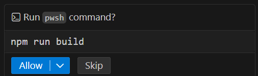
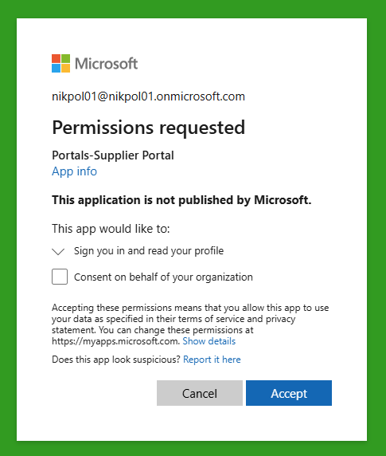
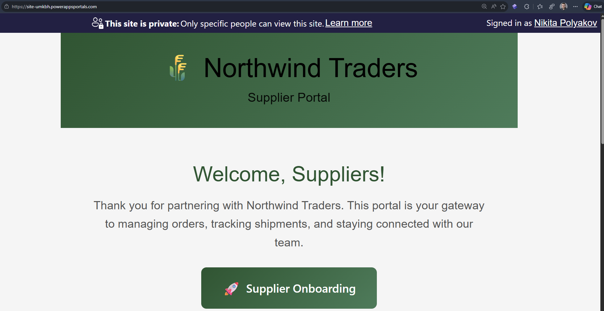
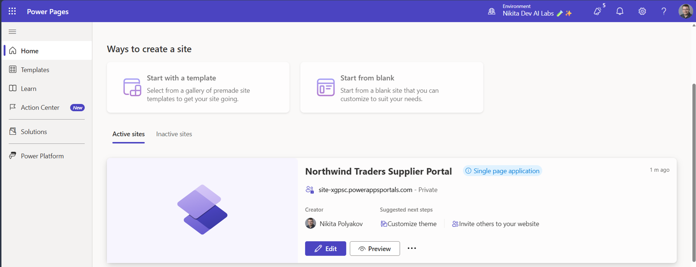
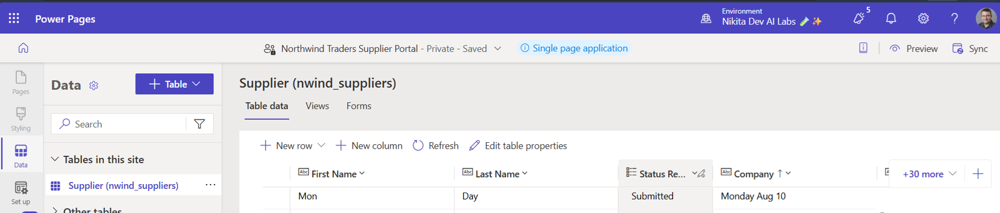
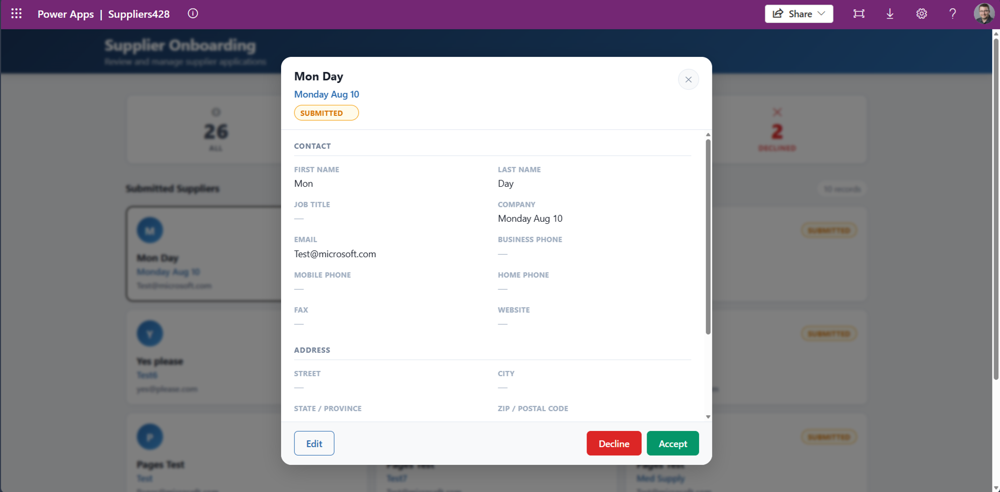
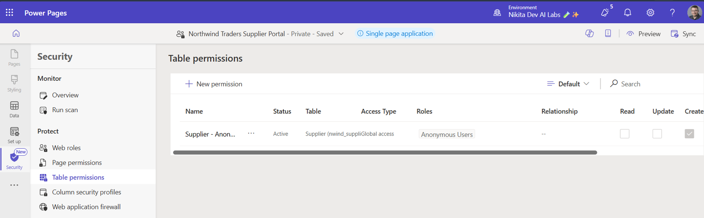
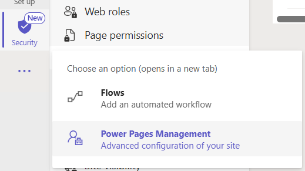
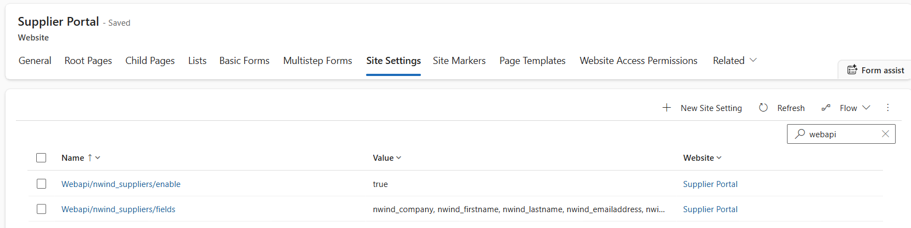

# Building code first website with Power Pages

**Power Series | Power CAT  - Power Platform & AI for Frontier Firms**


## Lab overview

### Lab purpose

This lab demonstrates the **Bring Your Own Code (BYOC)** approach using the **Single Page Application** capability in **Power Pages** to build a supplier‑facing portal backed by **Microsoft Dataverse**. You will generate a simple website with GitHub Copilot, publish it to Power Pages, and wire it to Dataverse using the Power Pages Web API to capture supplier onboarding requests securely.

### Why this matters

The BYOC feature empowers development teams to **reuse existing code** or **create bespoke experiences** with custom logic, reducing duplication and accelerating delivery. It also enables teams to integrate their own code seamlessly with tools they already know and trust, such as **Visual Studio Code**, **Git**, and **GitHub Copilot**, bringing modern development practices into the Power Platform ecosystem. This flexibility fosters innovation, improves maintainability, and ensures alignment with enterprise coding standards.

## Business use case

A supplier onboarding program needs a public website where vendors can submit applications. Submissions must be written securely to Dataverse and later reviewed internally by staff in an admin app (covered in a separate module).

### App scenario

| Industry / function | Operations |
| --- | --- |
| Primary user role | Supplier Account Manager |
| Problem statement | How can Contoso Electronics quickly generate code in Power Pages to meet the need for a supplier intake website? |
| Intelligent outcome | Bring your own code allows the enterprise to run their own custom code within the Power Pages host |

### Core concepts

| Concept | Why it matters |
|---|---|
| Bring Your Own Code | Publish written or generate custom code to Power Platform |
| Copilot / AI features | Natural language, summarization, and reasoning accelerate build. |
| Grounded AI | Responses and actions are anchored to Dataverse / trusted data. |
| Governance & ALM | Enterprise can use their own ALM against their bespoke code. |

### Documentation and learning resources

- [Visual Studio Code](https://code.visualstudio.com/docs)
- [GitHub Copilot in Visual Studio Code](https://code.visualstudio.com/docs/copilot/setup)
- [Power Pages Code Site](https://learn.microsoft.com/power-pages/configure/create-code-sites)
- [Power Pages Power Platform CLI commands tutorial](https://learn.microsoft.com/power-pages/configure/power-platform-cli-tutorial)
- [Power Pages Web API](https://learn.microsoft.com/power-pages/configure/web-api-overview#site-settings-for-the-web-api)
- [Power Pages Site Visibility](https://learn.microsoft.com/power-pages/security/site-visibility)
- [Power Pages Column Permissions for Web API](https://learn.microsoft.com/power-pages/security/column-permissions)

### Prerequisites

In the cloud:

- [Review the shared workshop prerequisites](/labs/prereqs.md).
- Each student must have their own Power Pages Environment.
- Ask a Power Platform administrator to confirm that the environment's data policies permit Dataverse, which Power Pages requires.
- Ask the workshop facilitator or a Power Platform administrator to import and seed the latest Northwind Traders solution before the lab. If you import and seed it yourself, your account needs the **System Administrator** or **System Customizer** security role, or equivalent custom privileges. [Follow the Northwind Traders solution import and sample data instructions](../../solutions/README.md).
- Confirm that your attendee account has the **Environment Maker** role and the **Basic User** role, or equivalent custom privileges, in the workshop environment.
- Confirm with a Power Platform administrator that your account has [rights to create Power Pages sites](https://learn.microsoft.com/power-pages/getting-started/create-manage#roles-and-permissions) in your environment. If your account does not have these rights, ask the administrator to complete this before the lab starts: sign in to Power Pages Studio in your environment, create and activate the site on your behalf, and grant your account the **Environment Maker** role. Resume at Step 1 once the administrator confirms the site is activated, and skip the provisioning prompt in step 8.
- Note the environment type you are assigned. A Developer environment completes every step of this lab, but its sites cannot be made public, so you sign in before viewing the site. Use a Sandbox or Production environment only if you also want to demonstrate public, unauthenticated site access.

Your developer machine:

- Install [Visual Studio Code](https://code.visualstudio.com/download).
- Install [GitHub Copilot in Visual Studio Code](https://code.visualstudio.com/docs/copilot/setup), with access to Copilot Chat and Agent mode.
- Install the [Node.js Long-term support (LTS) version](https://nodejs.org/), which includes npm and npx.
- Install [Azure CLI](https://learn.microsoft.com/cli/azure/install-azure-cli).
- Install [Power Pages skill CLI](https://github.com/microsoft/power-platform-skills/tree/main/plugins/power-pages).

### Learning outcomes

- Understand the inner dev loop: prompt → build → upload → test → iterate.
- Understand the skills map for building a code site in Power Pages using **Power Pages Skills**.
- Observe **Power Pages Web API** used securely to interact with **Microsoft Dataverse**.
- Verify **Power Pages Data Security** checking the table permissions and site settings setup by the skill.

***
## Step 1: Use Copilot to create the site

| Step value | Scaffolding to get your site started |
| --- | --- |
| Estimated effort | 20 minutes |
| Scenario | Create and connect a code site project to the workshop environment. |
| Objective | Set up the site project, initialize it for your environment, and publish it to Power Pages. |

### Tasks covered

- Scaffold a new site project into a local folder using the Power Pages skill.
- Engage with Power Pages skills clarifying prompts.
- Build and deploy the site to Power Pages.

### Step-by-step instructions

1. Open **Visual Studio Code** and open the **GitHub Copilot** chat sidebar, then start prompting.
If you do not see the chat, select the Copilot icon next to the search box.


Figure: Open the Copilot chat sidebar in VS Code.

2. Validate that your Pages skills are ready. In Copilot chat, start to type:

```
/power-pag
```

As you start to type, if autocomplete does not work, enter this prompt first:

```
install power pages skill from https://github.com/microsoft/power-platform-skills/tree/main/plugins/power-pages
```

Wait for this to finish and try again. The Copilot prompt should resolve to a known command like this:

```
/power-pages create-site 
```

3. In Copilot chat, use this prompt:

```
/power-pages create-site

# Description of the website

Create a simple portal that welcomes suppliers to the Northwind Traders Supplier Portal. We want a button on the home page, "Supplier Onboarding Form", that navigates to the form. Users do not need to log in to submit an application. Make sure that the site is mobile responsive for smartphone layouts.

We are developing this as Power Pages code site (SPA) and we want to use the latest Power Pages skills and CLIs to accomplish all of our tasks. 

# Supplier Onboarding Form
 
Supplier Onboarding page will be very simple. In the Form show following fields - Company name, First name, Last name, Email, Note.

Form Validation: All fields required. Email in valid format. Note field has 100 characters limit. 

Make sure to have a Submit button and UI confirmation of success post.

# Data 

We will use Dataverse in the same environment. Use the existing `nwind_suppliers` table, which internal users already use to review submissions.

For data interactions we will use Power Pages Web API technology. 

# Data Permissions

Allow Anonymous users to Create-only rights for the Supplier Table. 

Use this information to setup Table Permissions and appropriate Web Role mapping. 

For Web API field configuration we only want the fields our Form needs to post data.

Webapi/nwind_suppliers/fields = nwind_company, nwind_firstname, nwind_lastname, nwind_emailaddress, nwind_notes

Note: In Web API configuration Site Setting we use "nwind_suppliers" which is a Logical Name - when calling this table from Web API we must use "nwind_supplierses" which is a Set Name - beware of this difference when calling the Web API from the code!
```

4. Choose to continue in your current folder or create a new one for your project, for example, `C:\Dev\SupplierPortal`.

5. Select **Accept** and agree to all the permission prompts. The scaffolding process will take time.


Figure: Accept required setup dialogs to proceed.

6. You will be asked to authenticate to your tenant. Do so using the instructions provided in class.

7. When prompted to select an environment, select the same one you are using in the training class.

8. Agree to provision the Power Pages site. We suggest you allow automatic URL creation for your test site.

### Expected result (checkpoint)

Let's make sure your site was uploaded and activated.

> 💡 **Important:** Before you even see your website, you'll see an Entra ID login screen or be auto-logged in. You will then be paused on a **Permission requested** dialog. Select **Accept** to continue. If you are blocked at this stage, you won't be able to see your site. Contact your Azure administrator to grant consent, then reload the site URL.


Figure: Prompt to grant permission to log in to an Entra App protecting your website while it's in "project mode".

> 💡 **Note:** Power Pages start with Site Visibility set to Private Mode. All users including the site owner need to authenticate to view the site no matter the intended audience. This protects your project from early exposure on the internet, which is why you may see a login screen. When creating a site in a Developer environment, sites cannot be set to Public visibility even if you try to share URLs of the site with internal or external users.

Site Visibility is separate from the anonymous **Create** permission you configure for the `nwind_suppliers` table. Once you are past the site sign-in, the form still posts as an anonymous Web API caller, so the least-privilege configuration you verify in Step 3 is the outcome this lab validates. In a Developer environment you cannot demonstrate genuinely public access. To show a public site, run this lab in a Sandbox or Production environment where an administrator permits public visibility, then set the site to **Public** in **Set up > Site visibility**.

Your website should now load and you should see a clear **Supplier Onboarding Form** button that navigates to a form you can submit.


Figure: Your website will look different but should follow this general direction.

### Submit a test application

1. On your published site, select **Supplier Onboarding Form**.
2. Complete all five fields: **Company name**, **First name**, **Last name**, **Email**, and **Note**.
3. Select **Submit** and confirm that the on-screen success message appears.
4. Repeat once more so you have more than one record to validate in Step 2.

> 💡 **Tip:** If a submission returns an error instead of the success message, continue to Step 3 and verify the table permissions and Web API site settings, then retry the submission.

### Reflection

You've completed the first part of the lab with a published code site that you can view in a web browser, and you can submit data on a Supplier onboarding form.

***

## Step 2: Check form data in Dataverse

1. Open **Power Pages Studio** (<https://make.powerpages.microsoft.com>) and be sure to select your Environment on top right.


Figure: Power Pages home page with the environment picker.

2. Go to the **Data** tab to verify the Suppliers table now has your data entry as Submitted.


Figure: Suppliers table in the Data workspace showing the submitted record.

3. Alternatively, if you completed the BYOC-Apps lab, open the Supplier Management app to review the same record.


Figure: BYOC-App Supplier Management app showing your record as Submitted.

### Expected result (checkpoint)

The Suppliers table contains a row with the values you submitted, and its status is **Submitted**.

> 💡 **Tip:** If no row appears, return to your site, submit the form again, and watch for the on-screen success confirmation. If the submission fails, continue to Step 3 and verify the table permissions and Web API site settings, which are the most common causes.

***

## Step 3: Verify data access configuration

### Table permissions

1. In **Power Pages Studio**, open **Security > Table permissions** and review the data.


Figure: You should see a permission for the Suppliers table.

   - Table Permission **Name**: `Supplier Create` or similar.
   - **Table**: `Supplier` (Northwind sample table).
   - **Permission**: **Create** only.
   - **Roles**: **Anonymous**

### Web API configuration

1. To view the **Power Pages Web API** site settings, use the **Power Pages Management** app.
2. In the left navigation of **Power Pages Studio**, below the Security menu item, select the overflow button **...** and then select **Power Pages Management**. It opens in a new tab.


Figure: Open Power Pages Management from Power Pages Studio navigation menu overflow.

3. In **Power Pages Management** you should be already on your **Website** record. Look for a tab across the form called **Site Settings** and select it. In the quick search box, filter by "webapi".


Figure: Web API is enabled and the allowed fields are listed.

   You should see:

   - `Webapi/nwind_suppliers/enabled` = `True`
   - `Webapi/nwind_suppliers/fields` = `nwind_company, nwind_firstname, nwind_lastname, nwind_emailaddress, nwind_notes`


> 💡 **Tip:** While you are in **Site Settings**, you can create a new site setting named `Site/ShowPrivateSiteBanner` with a value of `False`. This hides the Site Visibility Private banner so that it doesn't interfere with your app's styling.

### Expected result (checkpoint)

Anonymous visitors can create `Supplier` records, and only the allow-listed fields are exposed by the Web API for data entry.

> 💡 **Tip:** If a table permission or site setting is missing, return to Copilot chat and ask the Power Pages skill to create it, then reload **Power Pages Management** to confirm the value.

***
## Lab completion

🥳 Congratulations! You built an intelligent, BYOC‑based Power Pages site and connected it securely to Dataverse.

### Key takeaways

- Design AI‑first experiences and ground them in Dataverse.
- Combine deterministic controls (Table permissions, column allow‑lists) with generative productivity.
- Use Site Visibility to keep the site governed and scoped to the project team.

## Above and beyond challenges

- Ask Copilot to generate light/dark mode and style the site to your own brand by pointing AI to your corporate website. How well did it do?
- Add Column Permissions to tighten control across various CRUD scopes.
- Ask Power Pages skills to set up a login page and configure Entra External ID.
- Identify governance controls for Power Pages.

## Summary and best practices

- Ground every response and keep least‑privilege field exposure.
- Test, monitor, and iterate; capture telemetry.
- Use explicit, deterministic automation instructions for reliability.

***

**Document owner:** Nikita Polyakov  
**Review cadence:** Quarterly / Per release
