**Power CAT | The Intelligent Enterprise | Power Platform**

# Authoring Canvas Apps and Dataverse Tables with MCP
<!-- PDF refresh trigger: 2026-05-16 -->

*Using the Copilot CLI with the Dataverse MCP and Canvas App Authoring MCP*

---

## Contents

- [Lab overview](#lab-overview)
- [Core concepts](#core-concepts)
- [Documentation & learning resources](#documentation--learning-resources)
- [Prerequisites](#prerequisites)
- [Lab steps](#lab-steps)
  - [Setup](#setup)
  - [Part A — Connect the Dataverse MCP](#part-a--connect-the-dataverse-mcp)
  - [Part B — Create the Dataverse data model](#part-b--create-the-dataverse-data-model)
  - [Part C — Configure the Canvas App Authoring MCP](#part-c--configure-the-canvas-app-authoring-mcp)
  - [Part D — Build the Canvas app](#part-d--build-the-canvas-app)
- [Recap](#recap)

---

## Lab overview

This lab demonstrates how to author a Canvas app and its underlying Dataverse data model end-to-end using the Copilot CLI, the Dataverse MCP plugin, and the Canvas App Authoring MCP plugin. Through a few natural-language prompts you will create a Device Ordering Solution — multiple tables in Dataverse with relevant business columns and relationships, a Canvas app, sample data, and a polished UI.

By the end of the lab, you will understand how MCP-based agents collaborate across the Power Platform: The Dataverse agent designs and provisions the data model, the Canvas agent assembles the YAML and wires the app to that data, and self-healing logic resolves formula and delegation issues along the way.

---

## Core concepts

MCP-driven Power Platform authoring brings together:

- **MCP plugins** — packaged connectors that provide skills, agents, and commands through the Model Context Protocol so developers can complete tasks faster with guided automation
- **Dataverse MCP** — provision solutions, tables, columns, relationships, and sample data from natural language
- **Canvas App Authoring MCP** — read and write Canvas app YAML, author screens and controls
- **Copilot CLI** — the orchestration surface that hosts both MCP servers and executes multi-step prompts

In this lab, MCP plugins act as the bridge between natural-language intent and real Power Platform operations. They provide reusable skills, specialized agents, and executable commands that help developers move from idea to implementation quickly. Instead of manually navigating each maker experience, you install the plugins once, connect to your environment, and let the agent call plugin tools to create Dataverse artifacts and author Canvas app UI changes in a controlled, auditable flow.

| Concept | Why it matters |
| --- | --- |
| **MCP plugins** | Define the capability surface available to the agent. They provide skills, agents, and commands that help developers automate tasks and reduce manual steps during the lab. |
| **Dataverse MCP** | Enables natural-language authoring of Dataverse solutions, tables, columns, relationships, and sample data directly from the Copilot CLI — no manual navigation through maker portals. |
| **Canvas App Authoring MCP** | Connects the Copilot CLI to a live Canvas app (via Co-Authoring) so the agent can read and write the app's YAML, wire up screens, and fix formula errors automatically. |
| **Co-Authoring** | A Canvas app setting that allows multiple authors — and the MCP server — to edit the app simultaneously. It is the bridge that makes agent-driven canvas app authoring possible. |
| **Self-healing agents** | When switching data sources or applying refactors, the agent detects schema and formula issues (e.g., `CountRows` vs `CountIf` on a delegable source) and fixes them without user intervention. |

---

## Documentation & learning resources

- [Connect to Dataverse with MCP Overview](https://learn.microsoft.com/power-apps/maker/data-platform/data-platform-mcp)
- [Canvas app authoring MCP](https://learn.microsoft.com/power-apps/maker/canvas-apps/create-canvas-external-tools)
- [Install and use the Microsoft Power Platform CLI (pac)](https://learn.microsoft.com/power-platform/developer/cli/introduction)
- [GitHub Copilot CLI documentation](https://docs.github.com/copilot/concepts/agents/copilot-cli/about-copilot-cli)

---

## Prerequisites

- Review the consolidated workshop prerequisites before you begin: [Workshop prerequisites](/labs/prereqs.md)
- A Power Platform environment where you are a System Administrator (needed to enable Dataverse MCP for the environment) or Environment Maker
- Power Apps Premium / Dataverse licensed user
- GitHub Copilot CLI installed and authenticated ([documentation](https://docs.github.com/copilot/how-tos/copilot-cli/set-up-copilot-cli/install-copilot-cli))
- .NET 10 SDK installed (required for the Canvas App Authoring MCP skill) ([documentation](https://dotnet.microsoft.com/download/dotnet/10.0))
- Power Platform CLI (pac) installed ([documentation](https://learn.microsoft.com/power-platform/developer/cli/introduction))
- Python 3.11 or later installed and available on `PATH` — required by the Dataverse plugin's `/dataverse:dv-connect` skill to install its SDK and authentication helper ([documentation](https://www.python.org/downloads/))
- [Dataverse MCP plugin](https://learn.microsoft.com/power-apps/maker/data-platform/data-platform-mcp-vscode) and [Canvas App Authoring MCP plugin](https://learn.microsoft.com/power-apps/maker/canvas-apps/create-canvas-external-tools) installed in Copilot CLI
- GitHub Copilot registered as an allowed MCP client in your Power Platform environment ([documentation](https://learn.microsoft.com/power-apps/maker/canvas-apps/create-canvas-external-tools))

---

## Lab steps

*Complete the steps in order. Each step contains the prompt or action to perform and the expected outcome.*

### Setup

Complete this one-time pre-requisite setup before starting Part A.

#### Setup Step 1: Install required MCP plugins

Open Terminal and launch Copilot CLI by running `copilot` command. Run below commands to add the MCP plugin marketplaces and install the required plugins for this lab.

Commands for the Dataverse MCP plugin:

```text
/plugin marketplace add microsoft/dataverse-skills
/plugin install dataverse@dataverse-skills
```

Command for the Canvas App Authoring MCP plugin:

```text
/plugin marketplace add microsoft/power-platform-skills
/plugin install canvas-apps@power-platform-skills
```

When prompted during installation:

- Allow the plugin to be enabled
- Trust and confirm installation prompts

> [!IMPORTANT]
> Run the command `/plugin list` in Copilot CLI and verify that both `dataverse@dataverse-skills` and `canvas-apps@power-platform-skills` are installed before continuing.

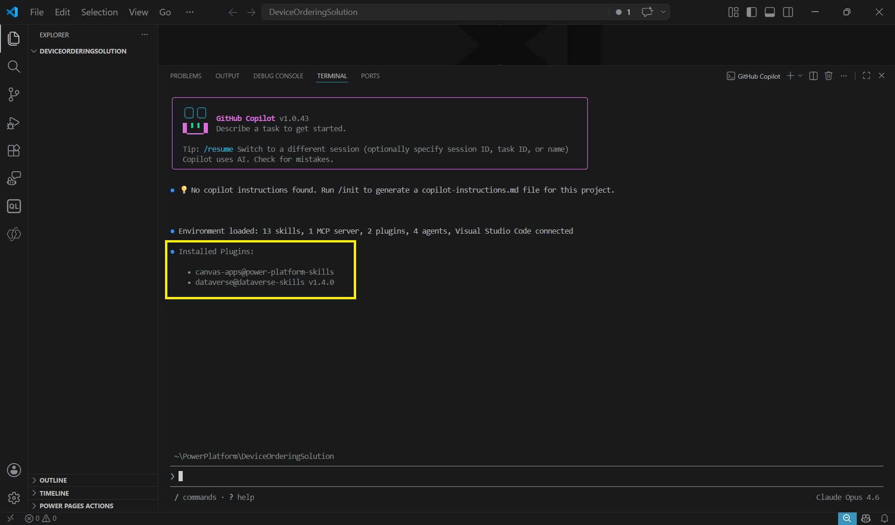  
Figure: Copilot CLI terminal showing installed MCP plugins (Canvas Apps and Dataverse).

#### Setup Step 2: Enable Dataverse MCP for your environment

Dataverse MCP must be switched on at the environment level before any MCP client can connect to it.

1. Go to the [Power Platform Admin Center](https://admin.powerplatform.microsoft.com).
2. Go to **Manage** on the left pane and select your environment.
3. Open **Settings → Product → Features**.
4. Under the **Dataverse Model Context Protocol** section, turn on the **Allow MCP Clients to interact with Dataverse MCP (GA Version)** toggle.
5. Select **Save** to apply the change.

> [!NOTE]
> You must be an Environment Administrator or System Administrator to change this setting.

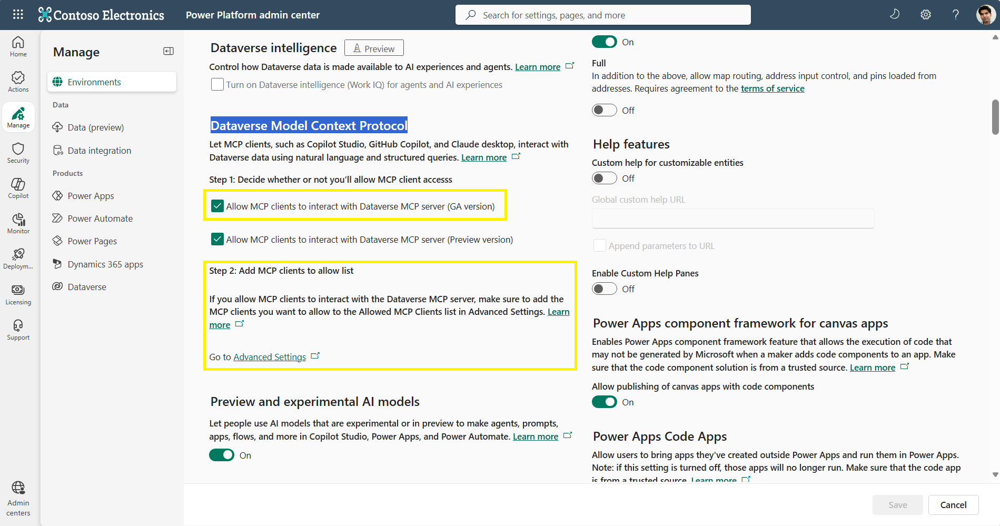  
Figure: Power Platform Admin Center — Features page with the Dataverse MCP toggle turned on.

#### Setup Step 3: Enable GitHub Copilot as an allowed MCP client

After enabling Dataverse MCP, you must register GitHub Copilot as a trusted client so it is permitted to make MCP calls to your environment.

1. On the same **Settings → Product → Features → Dataverse Model Context Protocol** section, click on **Advanced Settings**.
2. Select **Microsoft GitHub Copilot App** in the allowed clients list. On the form, set the **Is Enabled** flag to **Yes**.
3. Select **Save**.

> [!TIP]
> If the **Microsoft GitHub Copilot App** entry is not visible, ensure that Dataverse MCP (Setup Step 2) was saved first and then refresh the page.

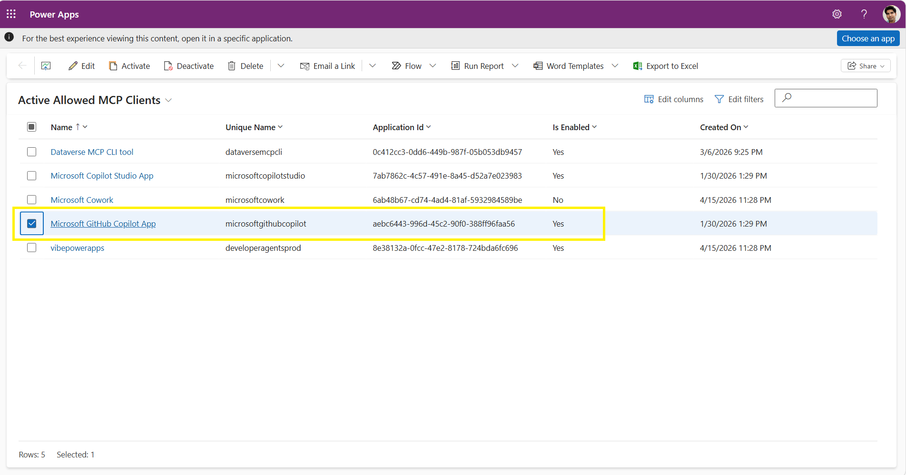  
Figure: Allowed MCP Clients screen showing GitHub Copilot as allowed.

### Part A — Connect the Dataverse MCP

#### Step 1: Open the Copilot CLI and verify plugins

Create a folder called 'DeviceOrderingSolution' on your local machine. Open a terminal in that folder and launch the GitHub Copilot CLI by running `copilot` command. Confirm that the Canvas Apps and Dataverse MCP plugins are installed and enabled.

>[!NOTE]
>This lab uses Copilot CLI as the orchestration surface for MCP-driven authoring. You can use any agent terminal like Claude Code or Copilot CLI. Using an integrated terminal in VS Code allows you to see YAML and logs side-by-side with your app's code.

#### Step 2: Connect to Dataverse

Initiate a connection to Dataverse. You can either use the explicit command or natural language.

Run the explicit command:

```text
/dataverse:dv-connect
```

Or use a natural-language prompt:

```text
Connect to Dataverse
```

Allow commands when prompted.

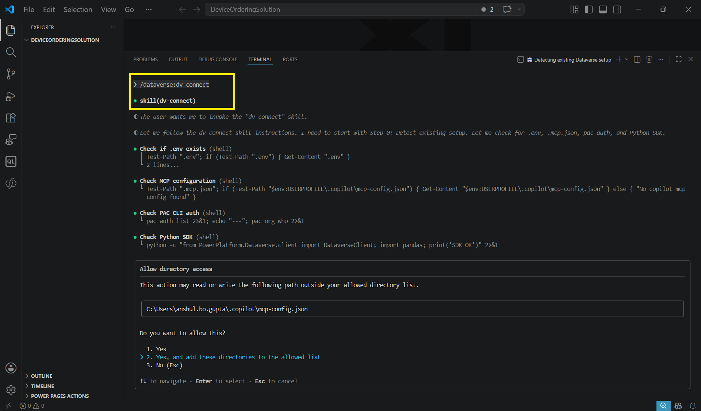  
Figure: Copilot CLI running `/dataverse:dv-connect`.

#### Step 3: Confirm environment

The CLI verifies that the Power Platform CLI (pac) is authenticated and displays the currently selected environment and user. Confirm that the environment is correct and choose to continue.

> [!NOTE]
> If the wrong environment is displayed, choose to switch environments and follow the prompts to select the correct one.

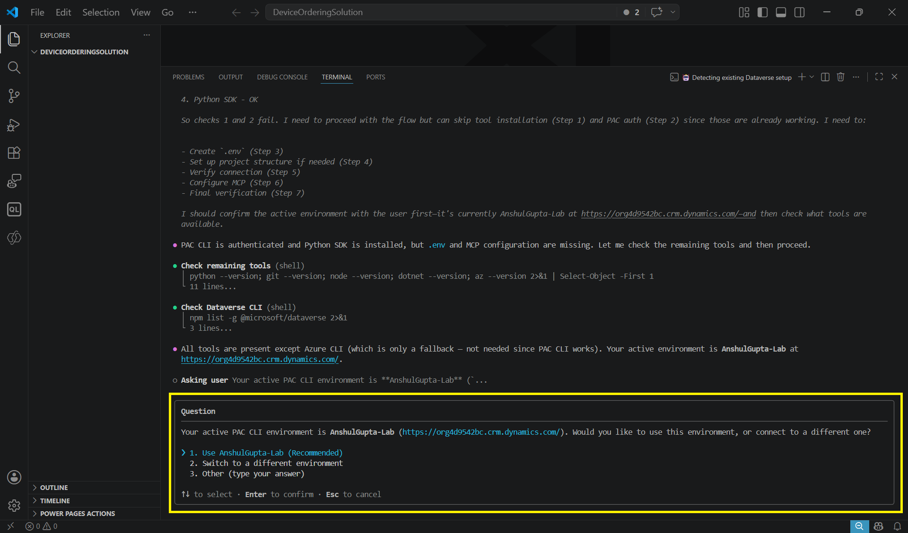  
Figure: PAC CLI authentication status and current environment.

#### Step 4: Select an authentication method

When prompted for the authentication method, choose **Interactive login**. Complete the sign-in in your browser when the window appears.

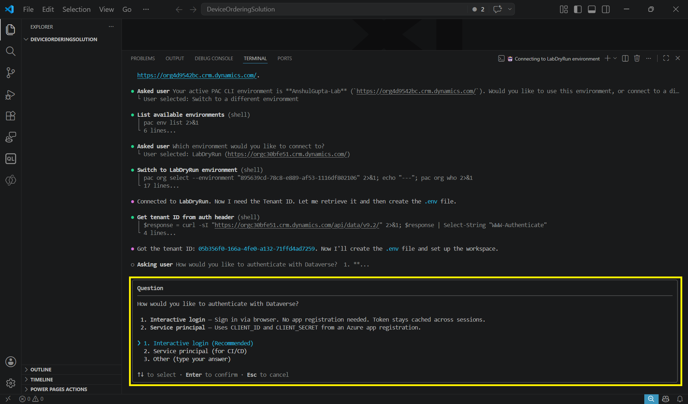  
Figure: Auth-method picker with 'Interactive login' highlighted.

#### Step 5: Provide solution name

When prompted for the name of the solution to use for this lab, enter:

```text
Device Ordering Solution
```

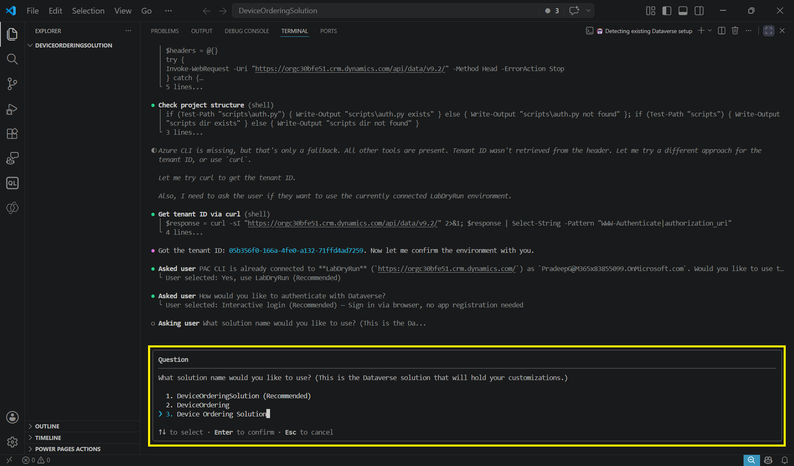  
Figure: Copilot CLI prompt asking for the solution name to use.

#### Step 6: Tenant-level admin consent

Tenant-level admin consent is required for the MCP client app (one-time per Azure AD tenant). When the prompt appears, click the link to open the admin consent flow in your browser. Sign in with an admin account and grant consent. After successful consent, return to the CLI and confirm.

>[!NOTE]
> Skip this step if you are using GitHub Copilot CLI and directly confirm. For any other agent terminal, you will need to complete the admin consent flow as described.

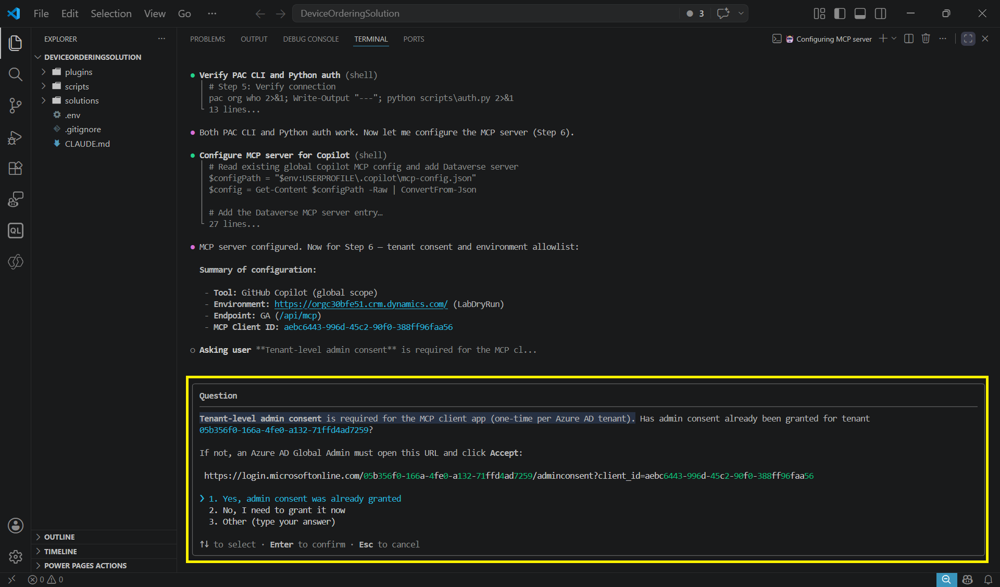  
Figure: CLI prompt for tenant-level admin consent with a link to grant consent.

#### Step 7: Confirm the MCP client registration

The Dataverse MCP requires GitHub Copilot to be registered as an allowed MCP client in your environment. If you have already added it as part of Setup steps, confirm the prompt; otherwise add it now in the Power Platform Admin Center.

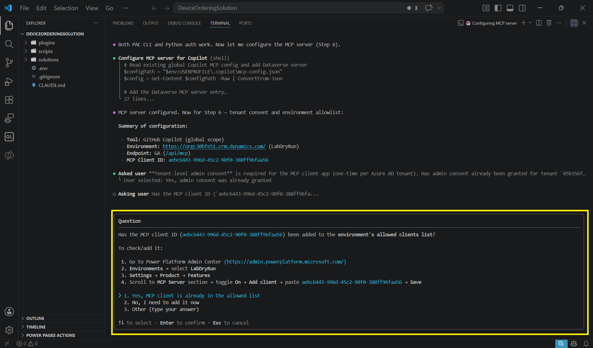  
Figure: CLI prompt confirming that GitHub Copilot is an allowed MCP client.

Once the Dataverse MCP server configuration is completed, restart the Copilot CLI by running the `/restart` command for the changes to take effect.

---

### Part B — Create the Dataverse data model

#### Step 8: Create a solution called Device Ordering Solution

To create a new solution in Dataverse, you can prompt the agent in natural language.

Enter the following prompt:

```text
Create a solution called "Device Ordering Solution".
```

The agent checks for the publishers availabe in the environment. If no publisher is found, it prompts you to create one before proceeding. Follow the prompts to create a publisher "Contoso".

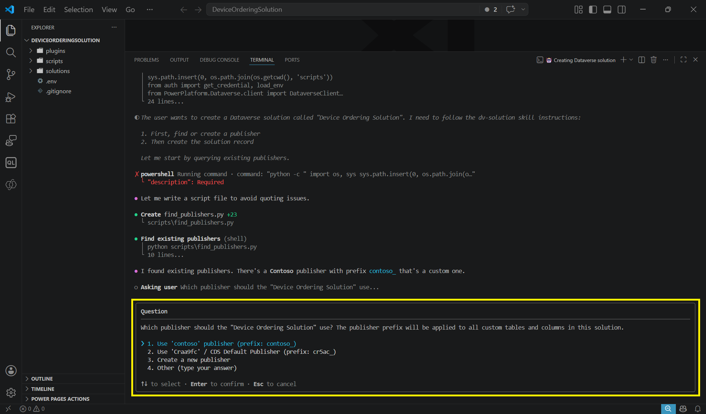  
Figure: Copilot CLI running prompt to create solution, prompting for publisher.
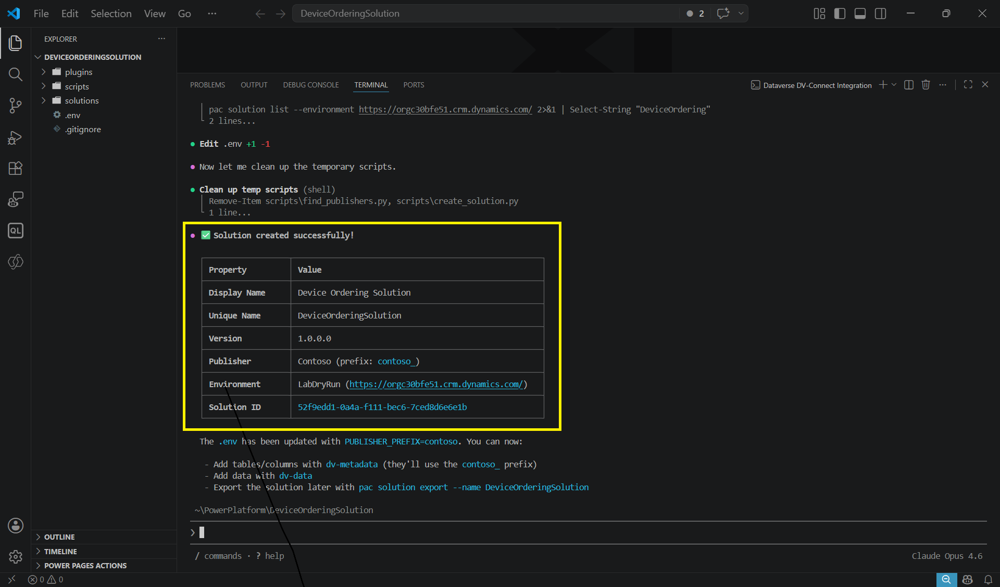  
Figure: Copilot CLI showing confirmation that solution is created successfully.

Once the solution is created, go to [make.powerapps.com](https://make.powerapps.com) and set the newly created "Device Ordering Solution" solution as the preferred solution. This ensures that all subsequent Dataverse customizations (tables, columns, relationships) are added to this solution and are thus ALM-ready.

#### Step 9: Prompt the agent to generate the data model

Now that the MCP connection is live, give the agent a prompt describing the back-end you want. In this lab we ask for a device ordering tool.

Enter the following prompt:

```text
Goal:
Design and create Dataverse tables for a centralized device ordering solution to manage device inventory and employee procurement requests.

Context:
This solution is for an enterprise environment. The data model should support employees browsing available devices, submitting device requests, and tracking request status. Dataverse will be used as the backend. The system should use the existing Dataverse user table for user information (do not create a new user table).

Source:
Assume no existing schema for device management. Define tables using standard enterprise fields such as device name, category, availability, price, vendor, request status, requester information, and timestamps.

Expectations:

Step 1: Propose Data Model (Do NOT create yet)
- Clearly define all tables that will be created
- For each table, list:
  - Table name
  - Fields with data types
  - Primary key
  - Relationships with other tables
- Include choice/lookup fields where appropriate (e.g., request status)
- Define how the Device Requests table will relate to the existing user table
- Ensure naming conventions follow best practices

Step 2: Review and Confirmation
- Present the complete data model in a structured format
- Wait for confirmation or adjustments before proceeding with creation

Step 3: Create Dataverse Tables
- After confirmation, generate the Dataverse tables as defined
- Ensure all relationships, fields, and data types are correctly implemented

Minimum tables to include:
1. Devices
2. Device Requests

Additional Requirements:
- Ensure scalability and maintainability
- Avoid duplication of user data (use existing user table)
- Follow Dataverse best practices

Output Format:
- First show the proposed data model clearly
- Then proceed to creation only after confirmation
```

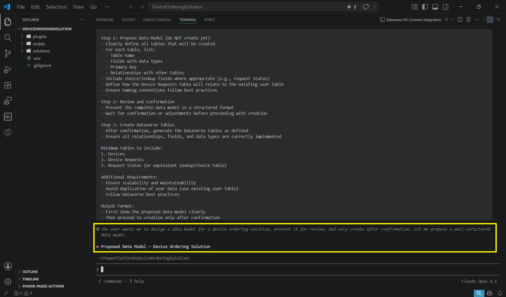  
Figure: Copilot CLI showing the initial prompt.

#### Step 10: Review the proposed tables

The agent responds with a proposed data model based on the prompt. Review the proposed tables, fields, relationships, and data types. If adjustments are needed, provide feedback and ask the agent to revise the proposal until it meets your expectations.

> [!NOTE]
> AI tools can generate different results each time, you might see a different set of tables/columns generated.

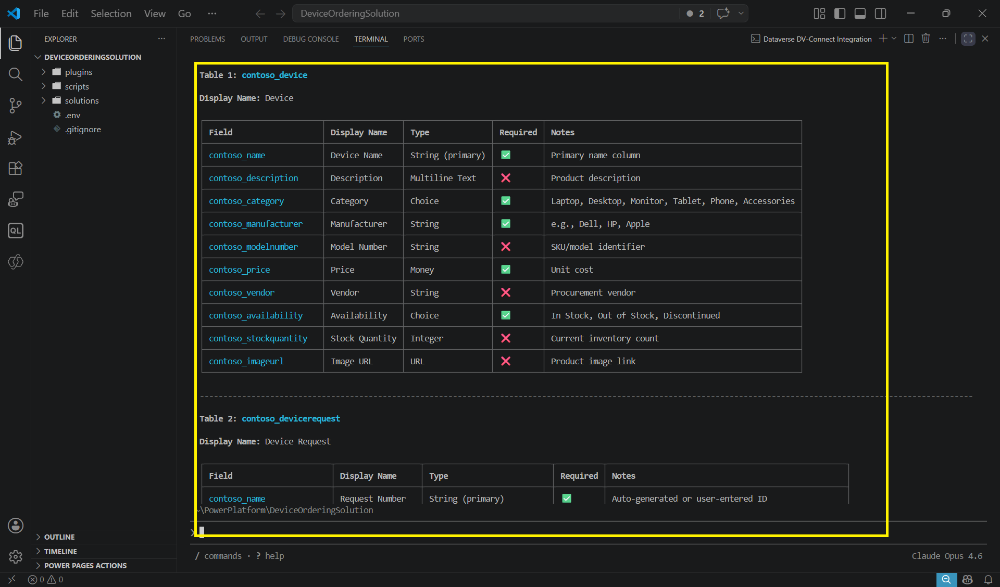  
Figure: Copilot CLI output showing proposed data model.

#### Step 11: Confirm the data model and create tables

Enter the following prompt:

```text
Proceed with creating the tables in Dataverse.
```

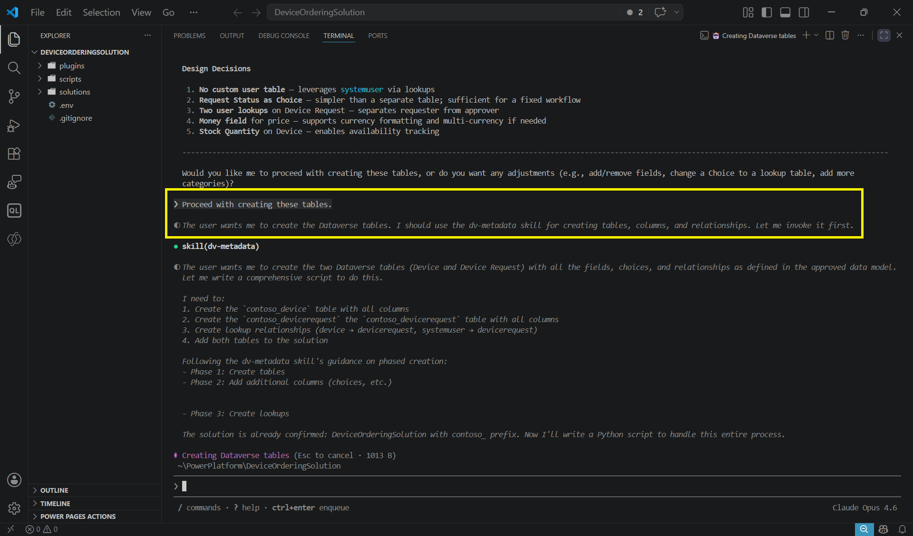  
Figure: Copilot CLI prompt confirming data model.

The agent then proceeds to create the tables, fields, and relationships in Dataverse according to the proposal.

#### Step 12: Add dummy data to the tables

After the tables are created, you can add dummy data to test the relationships and functionality of your app.

Enter the following prompt:

```text
Add dummy data to the Devices and Device Requests tables.
```

The agent calls the `/dataverse:dv-data` skill to generate and insert sample rows into the Devices and Device Requests tables.

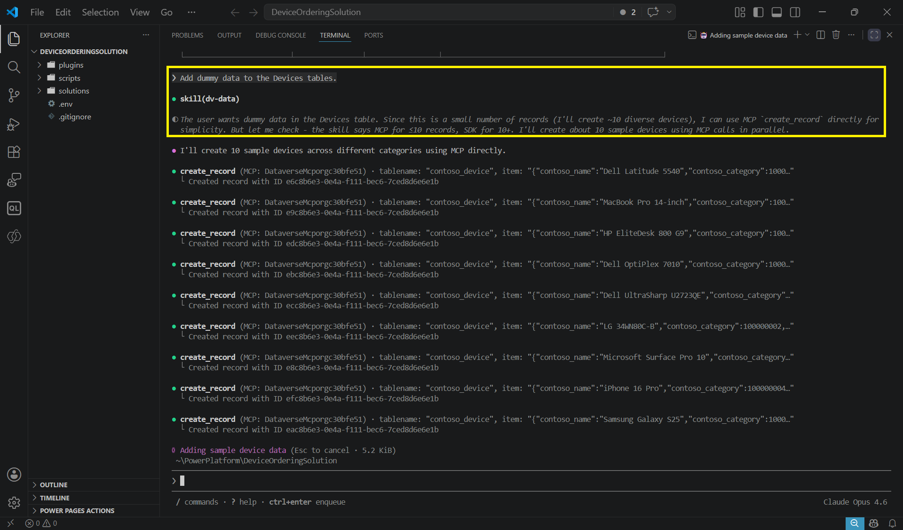  
Figure: CLI output showing the `/dataverse:dv-data` skill inserting sample rows into the Devices and Device Requests tables.

---

### Part C — Configure the Canvas App Authoring MCP

#### Step 13: Create a new Canvas app in the solution

Open [make.powerapps.com](https://make.powerapps.com), navigate to **Solutions**, and open the **Device Ordering Solution** solution. Choose **New → App → Canvas app**, give it a name (for example, **Device Ordering App**), and create it. The Canvas Studio designer will open.

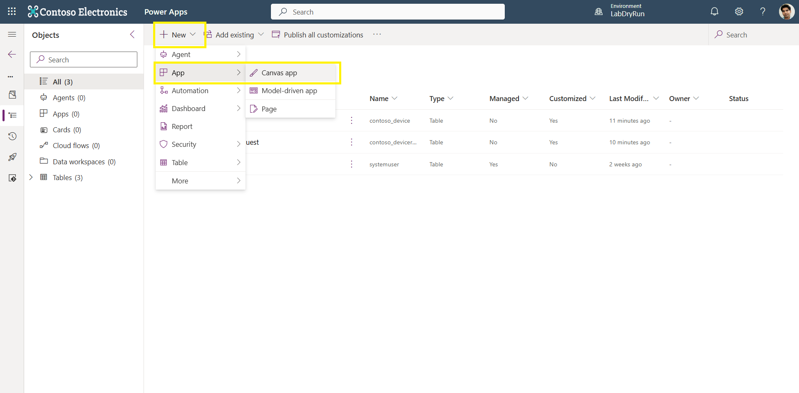  
Figure: Solutions → Device Ordering Solution → New → App → Canvas app being created.

#### Step 14: Save the app

Click **File → Save** (or the Save icon) and wait for the first save to complete. The app must be saved at least once before Co-Authoring can be enabled.

#### Step 15: Enable Co-Authoring and switch to a responsive layout

Open **Settings → Updates**. Turn on the **Co-Authoring** preview toggle. Then open **Settings → Display** and change the App layout from **Fixed** to **Responsive**.

> [!IMPORTANT]
> Co-Authoring is the mechanism Canvas MCP uses to write changes into your app while you have it open. Without it enabled, the MCP cannot author your Canvas app.

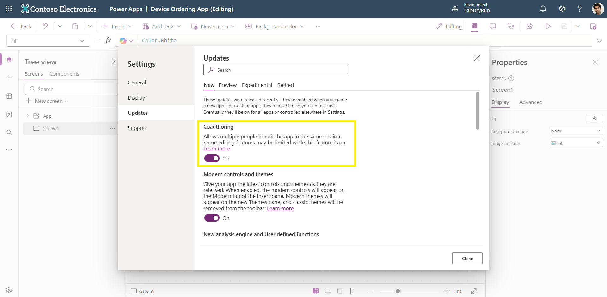  
Figure: Settings → Updates with Co-Authoring enabled.

#### Step 16: Copy the Canvas app URL

With the app still open in Canvas Studio, copy the full URL from the browser address bar. This is the URL that uniquely identifies your app to the MCP server.

#### Step 17: Configure the Canvas MCP for this project

Prompt the agent to configure the Canvas App Authoring MCP. When asked for the URL, paste the URL of your Canvas app that you copied in the previous step.

Run the explicit command:

```text
/canvas-apps:configure-canvas-mcp
```

Or use a natural-language prompt:

```text
Configure the Canvas App Authoring MCP.
```

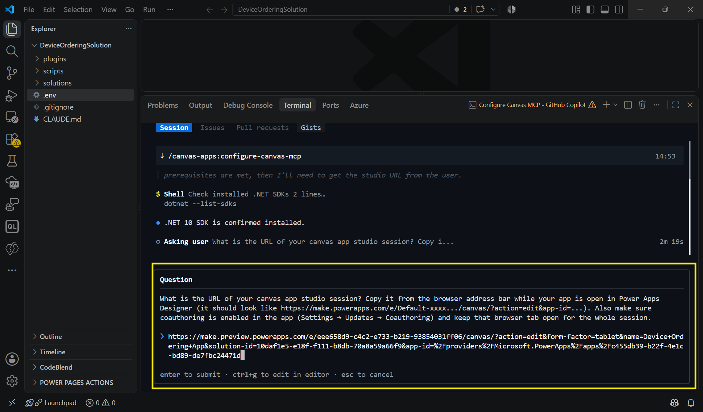  
Figure: CLI prompt showing the pasted URL and confirmation.

> [!NOTE]
> Keep the browser tab with the Canvas app open. The MCP server needs it to be open to maintain the connection and write changes to the app.

#### Step 18: Add data sources to the canvas app

Add the relevant Dataverse tables (Devices, Device Requests and Users) as data sources in Canvas Studio.

Go to **Canvas Studio → Data → Add data** and select the **Devices** table to add it to the canvas app as a data source. Repeat the same for the **Device Requests** and **Users** tables. Click **Save** after adding the data sources.

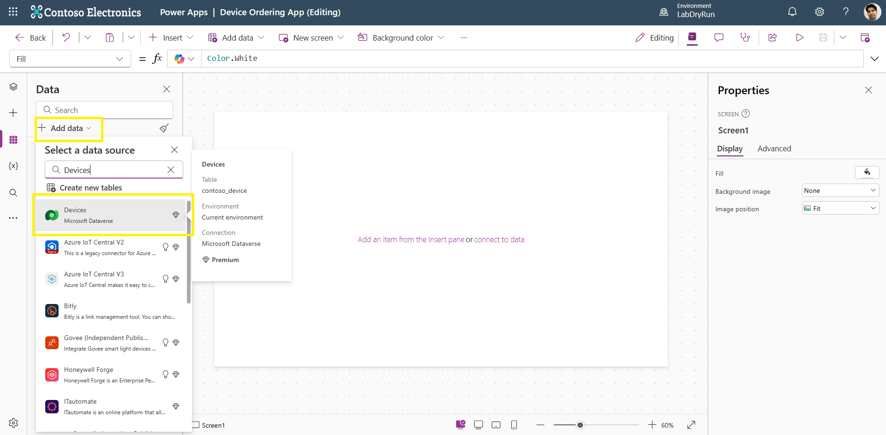  
Figure: Canvas Studio data panel with the Devices Dataverse table being added as a data source.

---

### Part D — Build the Canvas app

#### Step 19: Prompt the agent to generate the Canvas app

Now that the Canvas MCP is configured and connected to your app, you can prompt the agent to generate the app based on the data model you created.

Enter the following prompt:

```text
Goal:
Create a Power Apps Canvas App for a centralized device ordering solution using the Dataverse tables created earlier.

Context:
The required Dataverse tables for device inventory and employee procurement requests have already been created and approved. The app will be used by employees to browse devices, submit procurement requests, and track the status of their requests. For user information, use the existing Dataverse user table (do not create a new user table).

Source:
Refer to the Dataverse tables created earlier as the single source of truth for device availability, requests, and request status. The app should rely entirely on this approved data model for all operations and interactions.

Expectations:

Step 1: Define App Design
- Define the overall app structure
- Include screens such as:
  - Home Screen
  - Browse Devices Screen
  - Device Details Screen
  - Submit Request Screen
  - My Requests Screen
- For each screen:
  - List UI components (galleries, forms, buttons, labels, etc.)
  - Describe user interactions and navigation flow
- Explain how data from the previously created Dataverse tables will be used in each screen

Step 2: Create Canvas App with Full Logic
- Build the app with complete working logic
- Ensure all screens, controls, and data interactions are fully functional
- The agent should determine the appropriate formulas, functions, and implementation approach
- Ensure logic is properly wired to relevant controls and properties

The app must support:

1. Device Browsing:
   - Display devices that are currently available to request
   - Support search and filtering (e.g., by name, category)

2. Request Submission:
   - Allow users to submit a procurement request for a selected device
   - Automatically associate each request with the current logged-in user
   - Apply a default request status based on the data model

3. My Requests:
   - Display only requests created by the logged-in user
   - Show request details and current status

4. Navigation:
   - Enable smooth navigation between screens
   - Maintain selected device context across screens

5. Data Binding:
   - Ensure all UI components are properly connected to the Dataverse tables created earlier
   - Ensure updates reflect in real time based on Dataverse data

Additional Requirements:
- Use clean, scalable design practices
- Follow Power Apps best practices for maintainability and performance

Output Format:
- Structured and step-by-step
- Include app design followed by full implementation details
- Provide implementation-ready output
```

The agent will invoke the `canvas-app` skill to create the app based on your prompt. The agent will also ask follow-up questions about the design and implementation details—answer them to help refine the app generation.

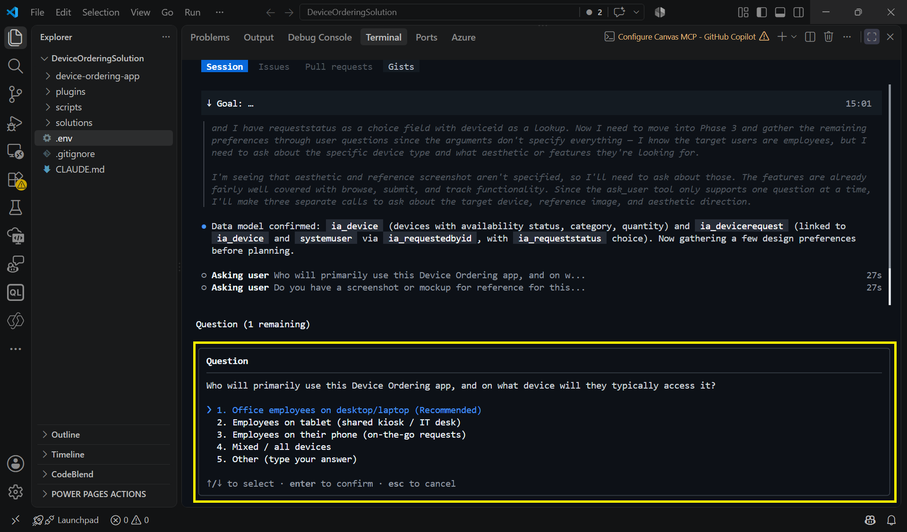  
Figure: CLI output showing the initial prompt to generate the Canvas app and the follow-up questions from the agent.

#### Step 20: Observe the generated YAML

The Agent will generate the YAML code and compile it to check for errors. In case there are any issues, the agent will try and resolve them automatically. Once all the errors are resolved, the agent pushes the YAML into the app in Canvas Studio.

In Visual Studio Code you can review the YAML that the Canvas MCP produces and pushes into the app. The same YAML is loaded and compiled on the server side in Canvas Studio and reflected in your browser in near-real time.

Once the Studio loads the YAML completely, you can see all the controls that have been added to the app by the agent.

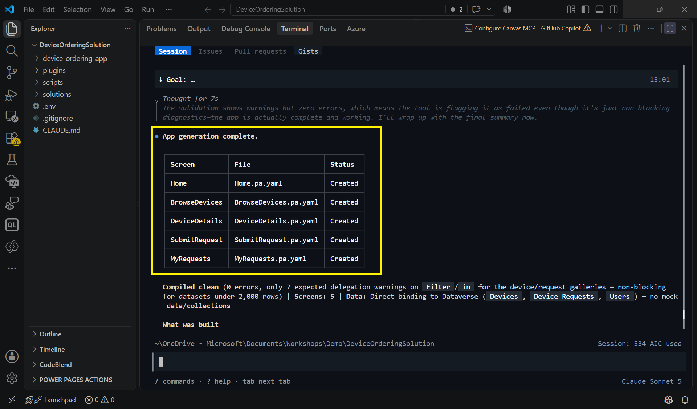

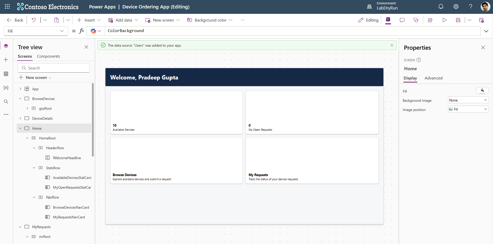  
Figure: Side-by-side view: Visual Studio Code on the left, Canvas Studio on the right.

#### Step 21: Polish the experience

At this point the app is approximately 90% of the way to what you want. Use short, focused prompts to iterate on the UI. Typical polish requests include:

- Light/Dark theme support
- Adding icons and images to make the app visually appealing
- Adding a search box to the browse screen

#### Step 22: Save and publish

Save the app (**Ctrl+S**) and publish it from Canvas Studio.

---

## Recap

In this lab you:

- Connected the Copilot CLI to Dataverse using the Dataverse MCP plugin.
- Used a single natural-language prompt to create the tables in Dataverse.
- Configured the Canvas App Authoring MCP against a newly created Co-Authoring-enabled Canvas app.
- Watched the agents collaborate — Dataverse MCP producing the schema, Canvas MCP producing the YAML, both round-tripping through Copilot CLI.
- Seeded sample data with the `/dataverse:dv-data` skill.

**In a matter of minutes and a few prompts, you produced a complete Dataverse data model and a running Canvas application, fully solution-aware and ready for ALM.**

> [!TIP]
> **Congratulations! You have completed the Canvas Apps & Dataverse MCP lab.**
