_Power CAT | The Intelligent Enterprise - Power Platform & AI for Frontier Firms_

# Dataverse Business Skills

## 1. Lab overview

Northwind Traders runs its entire retail operation on Dataverse — orders, inventory, customers, and suppliers.
In the past year, the company has deployed AI agents across three surfaces: **Copilot Studio** for customer-facing queries, **GitHub Copilot in VS Code** for the developer team's data lookups, and **Azure AI Foundry** for automated workflows.
Every agent works. None of them work **consistently** — because the rules that govern how Northwind operates live only in the heads of the people who built the business.

When a customer asks an agent, **"Can I get a discount on 25 units of Northwind Traders Coffee?"**, the agent answers from **general knowledge**. It doesn't know that Northwind grants 5% for quantities above 20. When a developer asks, **"Should we reorder Chai?"**, the agent queries the stock level but doesn't know the reorder threshold or which supplier to contact.
The data is in Dataverse. The **process of knowledge** is not.

**Dataverse Business Skills** closes that gap. In this lab, you will encode three of Northwind's operational processes as natural-language skill documents stored in Dataverse — where every AI agent can discover and follow them consistently.

By the end of this lab, you will have:

- Authored skill content for three Northwind retail processes in markdown format.
- Created and structured skills through the Power Apps maker portal.
- Written and validated instructions that produce correct, grounded agent behavior.
- Tested skill execution against live Northwind Traders Dataverse data from Copilot Studio and optionally in Visual Studio Code.
- Made skills reusable — shared with the right people, available organization-wide, and packaged in a solution for environment promotion.
- Run the complete retail scenario end to end through an agent that discovers and follows every skill.
- Published a skill collection that any future agent in the environment can reference.

## 2. Why this matters

Retail enterprises accumulate institutional knowledge in people's heads: discount thresholds, reorder rules, fulfilment sequences, exception-handling playbooks. When that knowledge is undocumented, AI agents guess — and guesses violate business policy.

Dataverse Business Skills bring three key benefits:

| **Benefits** | **Example** |
| --- | --- |
| Consistent process execution | Every agent follows the same skill; answers are consistent regardless of surface. |
| Centralised governance | Shared with the right teams; visibility controlled through Dataverse RBAC. |
| Zero-code updates | Edit the skill description and every connected agent immediately follows the new process — no republishing required. |
| Process knowledge remains within the organization rather than with a single individual, ensuring continuity even after that person leaves. | Process knowledge is documented, versioned, and stored in Dataverse. |

## 3. Core concepts

> **What is a Business Skill?** A Business Skill is a natural-language document stored in Dataverse that captures how your organization completes a specific type of work — the steps involved, the information needed, and the rules to apply.

**Business skills have three layers:**

| **Layer** | **Content** | **Purpose** |
| --- | --- | --- |
| Metadata | Name + Description | Enables agents to quickly discover the right skill for a given request |
| Instructions | Full skill body (markdown) | Contains the complete, step-by-step process the agent follows. |
| Resources | Attached files up to 20 MB | Supporting policy documents, SOPs, templates, forms, and reference data the agent can consult. |

**How agents discover and execute a skill:**

| **#** | **Action** | **MCP Tool/Detail** |
| --- | --- | --- |
| **1** | User sends a prompt | "Process an order for Company A" |
| **2** | Discover relevant skill | Calls search MCP tool → matches nwind\_OrderFulfillment by description |
| **3** | Retrieve full instructions | Calls describe MCP tool → loads step-by-step instructions |
| **4** | Execute the process | Calls **read\_query**, **create\_record**, etc. following the skill steps |

**Key properties:**

| **#** | **Property** | **What it means** |
| --- | --- | --- |
| **1** | Reusability | Define the process once; use it across Copilot Studio, VS Code, Azure AI Foundry, and any MCP-compatible client simultaneously. |
| **2** | Consistency | All agents follow the same process definition, eliminating variation in outcomes. |
| **3** | Live updates | Edit the skill in one place; every connected agent picks up the change immediately — no republishing required. |
| **4** | Governance | Owner-controlled sharing (Viewer / Editor), visibility scoping (Individual / Organization), and Dataverse RBAC security roles. |
| **5** | Solution-aware | Skills appear in Solution Explorer and can be packaged and promoted across environments as part of your standard ALM pipeline. |

## 4. Scenario

**Northwind Traders'** day-to-day retail operations run on Dataverse. Orders are raised, products are tracked, customers are managed — all in the same environment. AI agents have been deployed to help staff and customers, but they don't follow Northwind's actual business rules.

The problem: three critical processes never made it out of people's heads.

**The order fulfilment process** — how to validate customer orders, apply the correct discount tier, and update inventory — exists only in the fulfilment manager's memory.

**The supplier reorder process** — when stock falls below a threshold, which supplier to call, what lead time to expect — is tribal knowledge held by the procurement team.

**The customer return policy** — the 30-day window, the eligibility rules, the refund steps — is a PDF in someone's inbox.

When agents handle order queries today, they produce generic answers that violate Northwind's actual policies. The discount is wrong. The reorder threshold is ignored. Returns are mishandled.

**Your task is to:**

1. Encode the Northwind Traders order fulfilment process, customer return policy, and supplier reorder as Dataverse Business Skills.
2. Create the skill using make.powerapps.com.
3. Confirm that the AI agent can find and run the skill correctly using **Northwind Traders Dataverse** data (already loaded during the prerequisites session).
4. Upload a skill from a markdown file and package it in a solution for **ALM** promotion.

## 5. Documentation & learning resources

- [Introducing business skills (Blog)](https://www.microsoft.com/en-us/power-platform/blog/2026/05/01/business-skills/)
- [What is Dataverse intelligence?](https://learn.microsoft.com/power-apps/maker/data-platform/data-platform-intelligence)
- [Business skills overview - Power Apps | Microsoft Learn](https://learn.microsoft.com/power-apps/maker/data-platform/data-platform-business-skill-overview)
- [Create and use business skills - Power Apps | Microsoft Learn](https://learn.microsoft.com/power-apps/maker/data-platform/data-platform-business-skills)
- [Configure the Dataverse MCP server - Power Apps | Microsoft Learn](https://learn.microsoft.com/power-apps/maker/data-platform/data-platform-mcp-disable)
- [Microsoft Copilot Studio overview](https://learn.microsoft.com/microsoft-copilot-studio/fundamentals-what-is-copilot-studio)
- [GitHub Copilot in VS Code](https://learn.microsoft.com/en-us/shows/visual-studio-code/get-started-with-github-copilot-in-vs-code)

## 6. Learning outcomes

By the end of this module, you will:

- Prepare skill content in markdown format and understand what makes a well-structured skill description.
- Create a business skill in Power Apps, define its name, description, and step-by-step instructions, and attach resource files.
- Author process instructions that produce grounded, rule-following agent behavior against Northwind Traders' Dataverse data.
- As an optional step, connect to the Dataverse MCP server from VS Code in agent mode to test and validate a skill.
- Execute a skill against live Northwind Traders data — orders, products, and customer records — and verify correct outcomes.
- Make skills reusable by sharing them with viewers and editors and configuring agent instructions to ensure reliable skill discovery.
- Assemble a Copilot Studio agent that connects to the Dataverse MCP server and runs the full retail scenario end to end.
- Publish a reusable skill collection by packaging skills in a solution for promotion across environments.

## 7. Prerequisites

Review the [workshop prerequisites](/labs/prereqs.md) before you begin.

1. A Power Platform environment with Dataverse enabled.

2. You need a [Power Apps Premium license](https://www.microsoft.com/en-us/power-platform/products/power-apps/pricing/) and [Copilot Credits](https://learn.microsoft.com/en-us/microsoft-copilot-studio/agents-experience/billing-manage-buy-credits).

3. **Dataverse Intelligence for agents and AI Experiences** enabled in the environment.
    - Go to [Power Platform admin center](https://admin.powerplatform.microsoft.com/). Select **Manage** > **Environments**.
    - Select the Environment Name where you want to turn on the **Dataverse Intelligence**, and then select **Settings**. Under **Settings**, select **Product** > **Features**. Scroll down to locate the toggle and enable it.

4. The **Northwind Traders** **solution** needs to be imported into your **environment** (review the workshop prerequisites at the start of this session).

5. In the **Northwind Traders** solution, locate the **Northwind Sample Data app** and select **Load Data** if the data hasn’t been loaded yet.

6. **Copilot Studio access** ([make.powerapps.com](https://make.powerapps.com) or [copilotstudio.microsoft.com](https://copilotstudio.microsoft.com)).

7. **Environment Maker** or **System Administrator** security role.

8. When using [pay-as-you-go billing](https://learn.microsoft.com/en-us/microsoft-copilot-studio/billing-licensing#copilot-studio-pay-as-you-go), each user must belong to the security group configured in the [Copilot Studio authors tenant setting](https://learn.microsoft.com/en-us/troubleshoot/power-platform/copilot-studio/licensing/publish-license-error#solution) to be recognized as an authorized agent author. If no security group is configured, or the user is not a member, agent publishing fails with a licensing error even when pay-as-you-go is enabled.

> **Important:** The prerequisites below are only if you will execute **step 4** and **6** in the **Lab Instructions** section.

1. **MCP Clients** enabled to interact with Dataverse MCP Server (GA version and Preview version) in the **environment**. By default, Dataverse MCP server is enabled for Copilot Studio. To enable non-Copilot Studio clients:
   - Go to  [Power Platform admin center](https://admin.powerplatform.microsoft.com/). Select **Manage** > **Environments**.
   - Select the **Environment Name** where you want to turn on the **Dataverse MCP server**, and then select **Settings**. Under **Settings**, select **Product > Features**. Scroll down to locate **Dataverse MCP server**.
   - Select **Advanced settings** and the list of available clients is shown. Open the **Microsoft GitHub Copilot**, set **Is Enabled** to **Yes** and click **Save & Close.**

2. [**Power Platform CLI (pac CLI)**](https://learn.microsoft.com/en-us/power-platform/developer/cli/introduction?tabs=windows) installed and authenticated.

   - You can get the Environment ID at [**make.powerapps.com**](https://make.powerapps.com) **> Settings (gear icon) > Session details > Environment ID**.
   - Run:

      ```
      pac auth create
      pac env select --environment <YOUR_ENVIRONMENT_ID>
      ```

3. [Visual Studio Code](https://code.visualstudio.com/) with the [GitHub Copilot extension](https://docs.github.com/en/copilot/how-tos/set-up/install-copilot-extension) installed and signed in.

4. To use VS Code GitHub Copilot agent mode, you'll need both the **GitHub Copilot license** and the **Microsoft 365 Copilot license**.

## 8. Lab instructions

> **⚠️ Important** Your results may differ from the screenshots because AI responses can vary by model and the tool continues to evolve. However, the lab's concepts and steps remain the same.

## Step 1: Prepare the skill content

Before creating skills in the portal, write them as markdown files. A well-structured skill has a description that tells agents **when to use it**, and instructions that tell agents **how to execute it**.

1. Create a folder on your desktop named **NorthwindSkills**. Inside it, create a file named **nwind-order-fulfilment.md** and paste the following content exactly. Alternatively, download [nwind-order-fulfilment](resources/nwind-order-fulfilment.md) and move it to the **NorthwindSkills** folder.

  ```
  ---
  name: nwind-order-fulfilment
   description: >-
     Use this skill for all order-related requests: placing orders, checking inventory,
     applying discounts and confirming fulfilment status for Northwind Traders.
     Trigger phrases: "process an order", "check stock", "apply discount", "what is the order status", "confirm fulfilment".

  ---

   ## Instructions
   ## Step 1: Validate the customer
   1. Query nwind_customerses by nwind_company or nwind_customersid.
   2. Confirm statecode = 0 (Active). If not 0, stop and notify the user.
   3. Note nwind_country_region (for shipping fee) and nwind_notes (check for "VIP").

   ## Step 2: Check product availability
   1. Query nwind_productses for each item by nwind_productname.
   2. Query nwind_inventorytransactionses where nwind_productid = product ID.
      Calculate available stock: SUM(nwind_quantity where nwind_transactiontype = 1)
      minus SUM(nwind_quantity where nwind_transactiontype IN [2, 3, 4]).
   3. If available stock < requested quantity, flag the item as backordered.
   4. If available stock <= nwind_reorderlevel, flag for supplier reorder.

   ## Step 3: Apply the discount policy
   - nwind_quantity > 20 units of a single product: 5% discount on that line.
   - Order subtotal > $500: 10% discount applied to the whole order.
   - VIP customer (nwind_notes contains "VIP"): up to 15% discount.
   - Do not stack discounts. Apply the highest applicable rate only.
   - Store the discount as a decimal in nwind_discount (e.g. 0.05 for 5%).

   ## Step 4: Create the order record
   1. Create a record in nwind_orderses:
      nwind_orderdate = today; nwind_customerid = customer record ID;
      nwind_shippingfee = 15 if nwind_country_region = "USA" else 45;
      nwind_orderstatusid = 0 (New).
   2. Note the nwind_ordernumber from the created record.

   ## Step 5: Create order details and update inventory
   1. For each line item create a record in nwind_orderdetailses:
      nwind_orderid, nwind_productid, nwind_quantity,
      nwind_unitprice = product nwind_listprice, nwind_discount (decimal).
   2. Extended price = nwind_unitprice x nwind_quantity x (1 - nwind_discount).
   3. Create a nwind_inventorytransactionses record:
      nwind_productid, nwind_customerorderid = order ID,
      nwind_quantity = ordered qty, nwind_transactiontype = 2 (Sold),
      nwind_transactioncreateddate = today (datetime),
      nwind_transactionmodifieddate = today (datetime).
   4. Set nwind_orderdetailstatusid:
      1 (Allocated) if pending payment; 2 (Invoiced) if payment confirmed.
   5. Update nwind_orderstatusid:
      1 (Invoiced) if paid; 2 (Shipped) once dispatched.
   6. Return: nwind_ordernumber, line items, totals, nwind_shippingfee.
   ```

2. Create **nwind-supplier-reorder.md** in the same folder and paste the following content exactly. Alternatively, download [nwind-supplier-reorder](resources/nwind-supplier-reorder.md) and move it to the **NorthwindSkills** folder.

  ```
  ---
   name: nwind-supplier-reorder
   description: >-
     Use when product stock falls at or below nwind_reorderlevel. Trigger phrases:
     "reorder", "low stock", "contact supplier", "which products need restocking".
  ---

  ## Instructions
   1. Query nwind_inventorytransactionses grouped by nwind_productid:
      available = SUM Purchased(type=1) - SUM Sold(type=2) - SUM OnHold(type=3) - SUM Waste(type=4).
   2. Query nwind_productses. Filter where available stock <= nwind_reorderlevel.
   3. Check nwind_purchaseorderdetailses for open POs per product.
      If nwind_purchaseorderstatusid IN [0,1,2] exists for product, skip it.
   4. Join nwind_productses to nwind_supplierses via
      nwind_products_nwind_suppliers relationship.
      Get nwind_company, nwind_emailaddress, nwind_businessphone.
   5. Create a record in nwind_purchaseorderses:
      nwind_supplierid = supplier ID; nwind_expecteddate = today + 14 days;
      nwind_purchaseorderstatusid = 0 (New).
   6. Create nwind_purchaseorderdetailses record:
      nwind_purchaseorderid, nwind_productid,
      nwind_quantity = nwind_targetlevel - available (min nwind_minimumreorderquantity).
   7. Return a summary table: nwind_productname | Supplier (nwind_company) | Available Stock | nwind_reorderlevel | nwind_targetlevel | Order Qty
   ```

3. Create **nwind-customer-return.md** in the same folder and paste the following content exactly. Alternatively, download [nwind-customer-return.md](resources/nwind-customer-return.md) and move it to the **NorthwindSkills** folder.

 ```
 ---
 name: nwind-customer-return
 description: >-
   Use when a customer requests a return or refund for a Northwind Traders order.
   Trigger phrases: "return", "refund", "send back", "wrong item", "cancel order".
 ---

 ## Instructions
 1. Locate the order in nwind_orderses by nwind_ordernumber or nwind_customerid.
 2. Check eligibility: nwind_orderdate must be within the last 30 days.
 3. Check nwind_orderstatusid: returns are not accepted if status = 3 (Closed).
 4. Check product category to confirm item is not perishable:
    Join nwind_orderdetailses -> nwind_productses via nwind_productid.
    Join nwind_productses -> nwind_categorieses via
    nwind_products_nwind_categories relationship.
    If nwind_name (category) contains "Dried Fruit" or "Condiments" only
    (not Fresh/Frozen), proceed.
 5. Update nwind_orderstatusid = 3 (Closed) in nwind_orderses.
 6. For each returned line item (nwind_orderdetailses record):
    Create a nwind_inventorytransactionses record:
    nwind_productid, nwind_customerorderid = order ID,
    nwind_quantity = returned qty, nwind_transactiontype = 1 (Purchased/Returned).
 7. Draft a refund confirmation using nwind_emailaddress from nwind_customerses.
 ```

> **✅ Checkpoint** Three skill files — nwind-order-fulfilment.md, nwind-supplier-reorder.md, and nwind-customer-return.md — sit in your NorthwindSkills folder, each with a clear description and instructions.

## Step 2: Create the skill and define its structure

Every business skill starts with its metadata — the name and description the agent uses to decide whether this skill is relevant. Getting this right is the structural equivalent of naming your inputs clearly in code.

1. **Navigate** to [make.powerapps.com](https://make.powerapps.com/) and confirm the correct **environment** is selected in the top-right dropdown.

2. In the **left navigation pane**, select **More**, then select **Business skills**. Pin the page for quick access.

   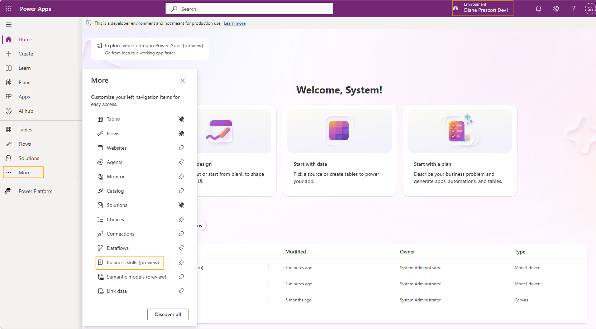
   Figure: The Business skills option in the left navigation pane.

   > **🔧 Setup check** If the Business skills page does not appear in the navigation, or if you see an error indicating that the feature is not enabled when you open the page, verify that Dataverse Intelligence is enabled in the admin center. The environment must be located in a region where the feature is enabled.

3. Select **Create skill** on the command bar.

   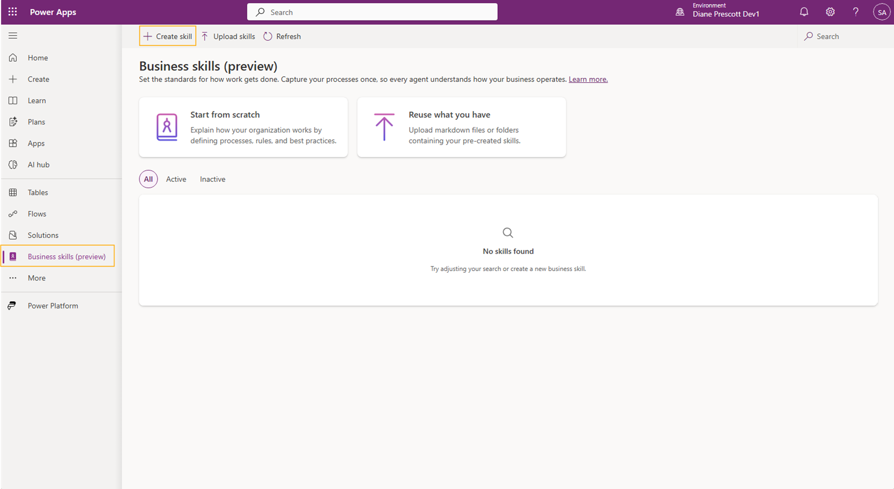
   Figure: The Create skill button on the command bar.

4. Configure the first skill:

   | **Field** | **Value** |
   | --- | --- |
   | Name | nwind-order-fulfilment |
   | Description | Using your nwind-order-fulfilment.md file from Step 1, copy everything between `description: >-` and the closing `---` (the indented lines directly under it). Copy just that text — without the description: `>-` label itself and paste it into the description field. |
   | Instructions | Using your nwind-order-fulfilment.md file from Step 1, copy the content from `## Instructions` to the end of the file and paste it into the instructions field. |

   > **📌 Note** Each `.md` file is split by the `---` markers at the top. **Description** = the indented text under `description: >-`, between that line and the closing `---`. **Instructions** = starting at `## Instructions` through the end of the file.

   > **⚠️ Important** The description is not decoration — it is the signal the agent uses to decide whether this skill is relevant. Describe it like a function doc-string: what it does, when it applies, and the trigger phrases.

   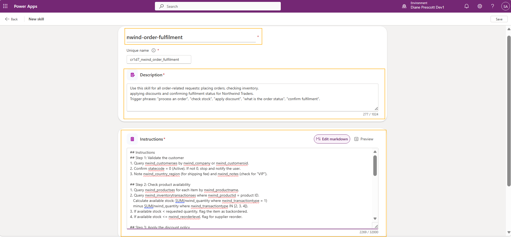
   Figure: The skill form with the name, description, and instructions fields.

5. Select **Preview** to review the formatted output and confirm the heading hierarchy is correct (for each step, bullet points render cleanly) and click **Save** in the upper right corner.

   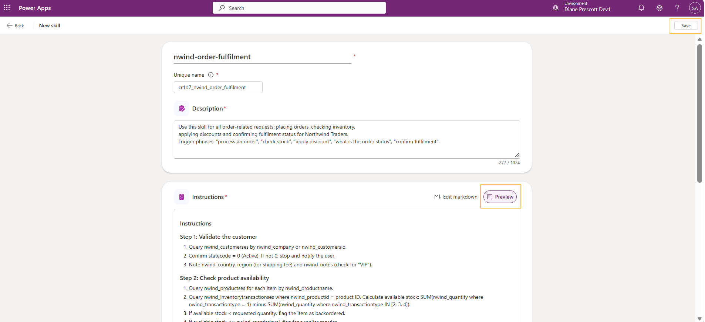
   Figure: Previewing the formatted skill before saving.

   > **💡 Tip** Write instructions on the way you would write them for a new employee: numbered steps, explicit business rules, no assumed context. If you find yourself thinking "the agent should know this," write it down instead.

6. Now attach a resource file to give the agent additional context. **Download** [Northwind_Traders_Discount_Policy.pdf](resources/Northwind_Traders_Discount_Policy.pdf) or prepare a one-page **Northwind Traders discount policy** document and attach it as a resource.

   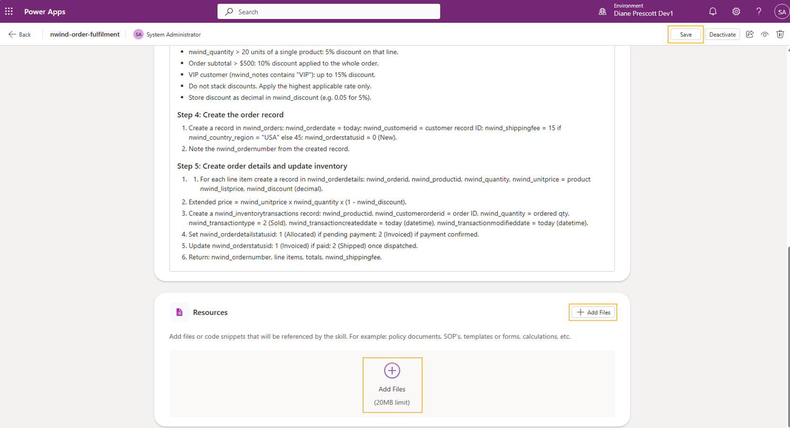
   Figure: Attaching the discount policy file in the Resources section.

7. Upload the two remaining skills from their Markdown files. For each skill, select **Upload skills**, choose **Select from device**, and select the corresponding .md file created in Step 1. Preview the skill, then select **Save**.

   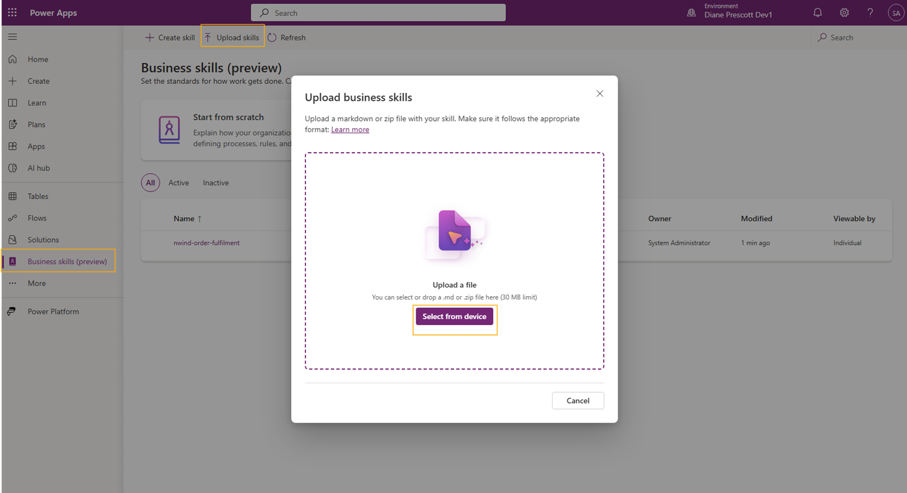
   Figure: Uploading the remaining skills from their markdown files one by one.

> **✅ Checkpoint** The instructions for **nwind-order-fulfilment**, **nwind-supplier-reorder**, and **nwind-customer-return** are saved and display correctly in preview. A resource file is also attached to **nwind-order-fulfilment**.

## Step 3: Test and validate the skill using Visual Studio Code (Optional)

This step connects to the **Dataverse MCP server** from **VS Code**, reads the skill back from **Dataverse**, and validates that the instructions are correct and complete.

1. Open **Visual Studio Code**. Select **View** > **Command Palette** (Ctrl+Shift+P), type **MCP: Add Server**, and then select **HTTP or Server Sent Events**.

   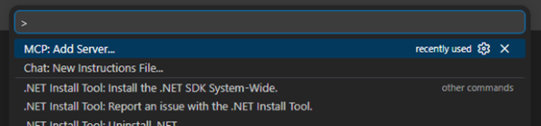
   Figure: Adding an MCP server from the VS Code Command Palette.

2. Paste your instance URL, such as **https://contoso.crm.dynamics.com/,** append **/api/mcp** to it, and press **Enter**. To find your instance URL in **make.powerapps.com**, select the **Settings** icon in the upper-right corner, then choose **Session details > Instance URL**.

   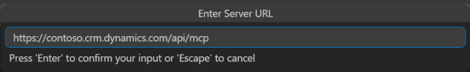
   Figure: The instance URL with the /api/mcp suffix appended.

3. Type **dataverse-mcp** as the server name or press **Enter** to accept.

   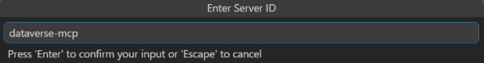
   Figure: Naming the MCP server dataverse-mcp.

4. Choose the configuration target: Global (available in all workspaces, runs locally) or Workspace (available in this workspace, runs locally).
   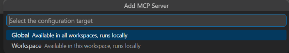
   Figure: Configuration target.

5. Make sure your MCP server is started and authenticated in your environment.

   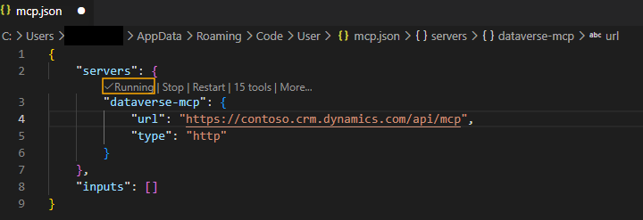
   Figure: The dataverse-mcp server started and authenticated.

6. Press **Ctrl+Alt+I** and ensure that agent mode is selected.

   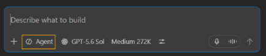
   Figure: Agent mode selected in GitHub Copilot in VS Code.

7. Click on the **plus button** and **Tools**. Confirm **dataverse-mcp** appears in the tool list, and select it.

   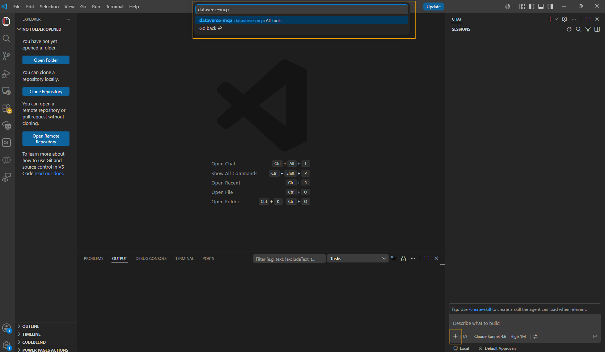
   Figure: Selecting the dataverse-mcp tools in the chat.

8. Validate skill discovery – send this prompt:

   ```
   Show me all business skills in this environment
   ```

9. The agent calls the search **MCP tool** and returns a list. Confirm all three **Northwind Traders** skills appear: **nwind-order-fulfilment**, **nwind-supplier-reorder** and **nwind-customer-return**.

   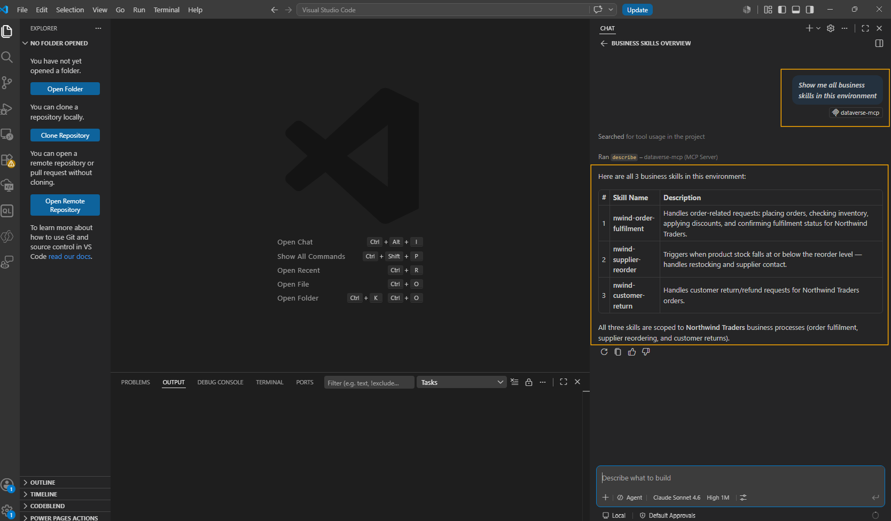
   Figure: The three Northwind Traders skills returned by skill discovery.

10. Validate skill content — ask the agent to describe the order fulfilment skill:

   ```
   Show me the full instructions for the nwind-order-fulfilment skill
   ```

11. The agent invokes the specified MCP tool. Compare the returned instructions with those in Step 1 and verify the following:
   - All five steps are included:
       1. Validate the customer
       2. Check product availability
       3. Apply the discount
       4. Create the order record
       5. Create the order details and update inventory.
   - In Step 3, confirm that the discount thresholds are correct: 5% for quantities over 20, 10% for subtotals over $500, and 15% for VIP customers. Also confirm that the instructions state that discounts cannot be combined and that only the highest applicable rate is applied.

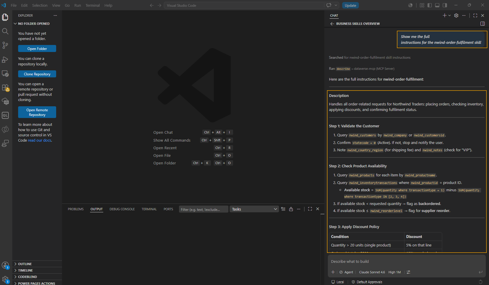
  Figure: The nwind-order-fulfilment instructions returned by the describe tool.

> **⚠️ Important** If a step is missing or a rule is ambiguous, return to make.powerapps.com, edit the skill instructions, save, and re-run this validation. Fix the instructions before testing execution.

> **✅ Checkpoint** All three skills are discoverable via the Dataverse MCP server. The nwind-order-fulfilment instructions return correctly with all five steps and the exact discount tiers. Any gaps found have been fixed.

## Step 4: Create the agent in Copilot Studio and run the skills

The skills are built and individually tested. Create a Copilot Studio agent that connects to the Dataverse MCP server, runs all three skills, and processes the full retail scenario in a single conversation.

1. **Navigate** to [copilotstudio.microsoft.com](https://copilotstudio.microsoft.com) and select **Agent**.

   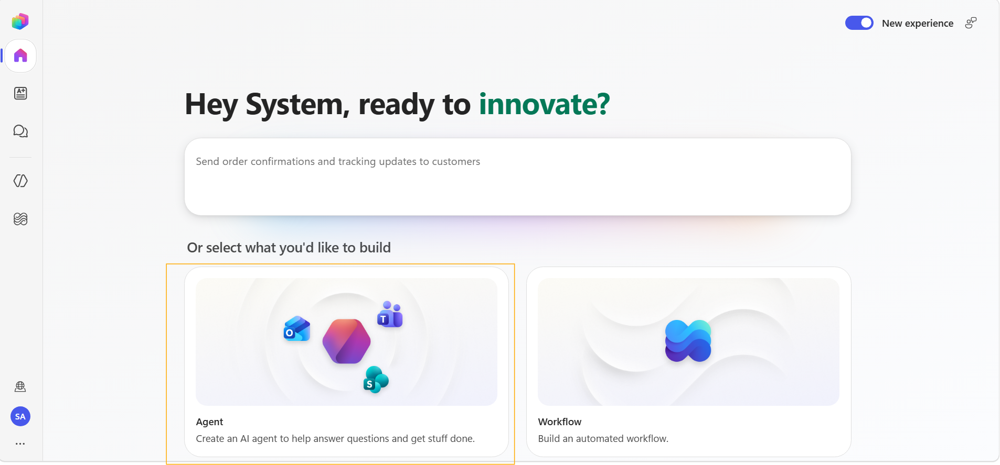
   Figure: Creating a new agent in Copilot Studio.

2. Name it **Northwind Operations Assistant** and **Save**.

   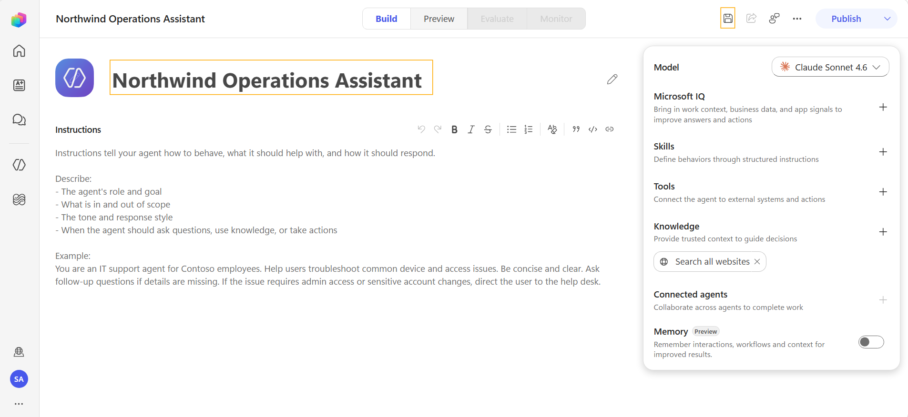
   Figure: Naming the agent Northwind Operations Assistant.

3. In the **Instructions** field, enter:

   ```
   You are the Northwind Traders Operations Assistant.
   Before responding to any business process request, search for relevant business skills using the Dataverse MCP Server and
   follow the process instructions accordingly.
   Use Dataverse MCP tools to read and update Northwind Traders order, product, customer, and supplier data.
   ```

   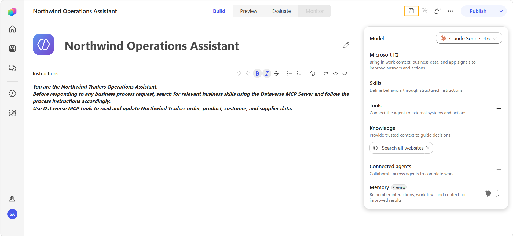
   Figure: Entering the agent instructions in Copilot Studio.

4. In the agent configuration, go to the **Tools** section and search for **Microsoft Dataverse MCP Server** and click **Add.**

   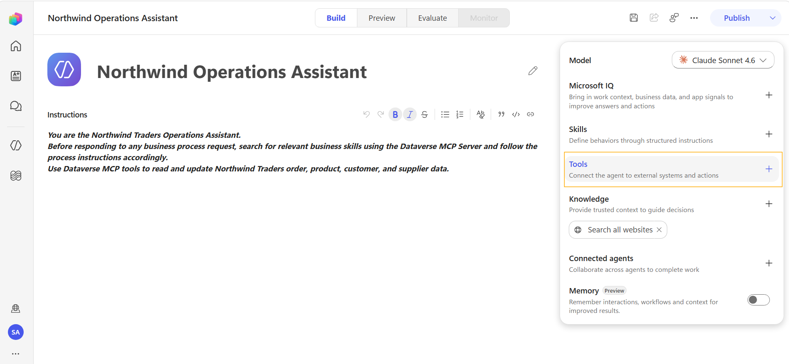
   Figure: Adding the Microsoft Dataverse MCP Server tool to the agent.

   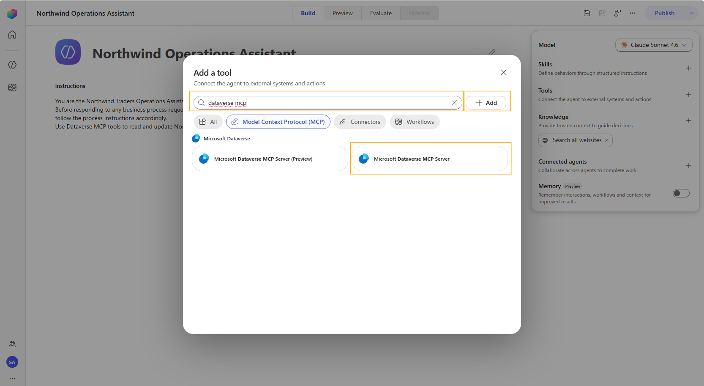
   Figure: The Microsoft Dataverse MCP Server tool in the agent's tool list.

5. Select **connection** and create a new connection with **OAuth Authentication**.

   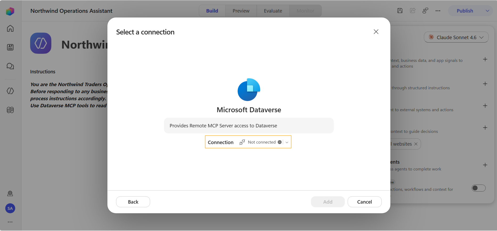
   Figure: Creating a new connection with OAuth authentication.

6. Create a new connection named **Dataverse MCP**, select **OAuth** as the authentication type, and click **Create**. When prompted, enter the credentials you use to access the environment. Then, select the new connection and click **Add** to connect the MCP to the agent.

   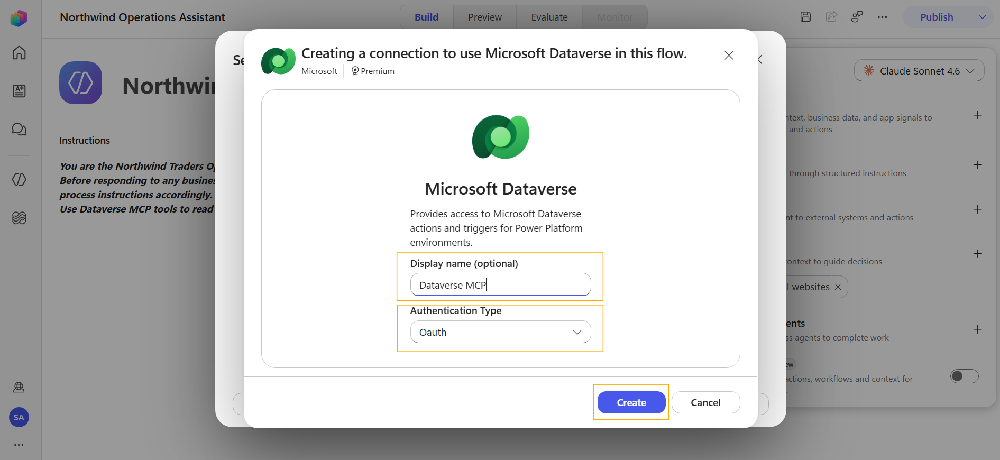
   Figure: Naming the Dataverse MCP connection.

7. Click on the tool added and set the authentication mode to **Maker**. When the agent runs, it authenticates to connected services using the maker's credentials rather than the end user's. Use this option for agents triggered by scheduled or autonomous events.

   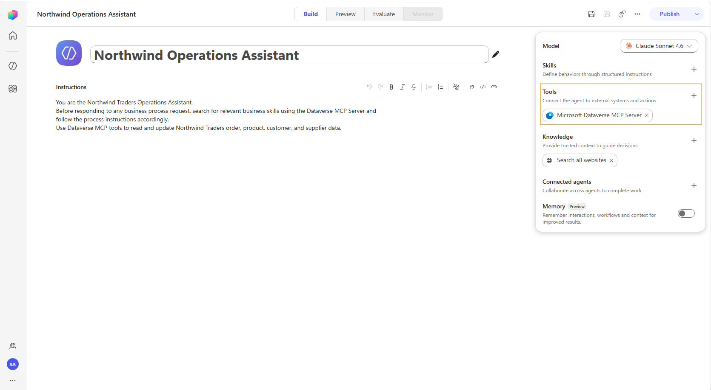
   Figure: Setting the tool authentication mode to Maker.

   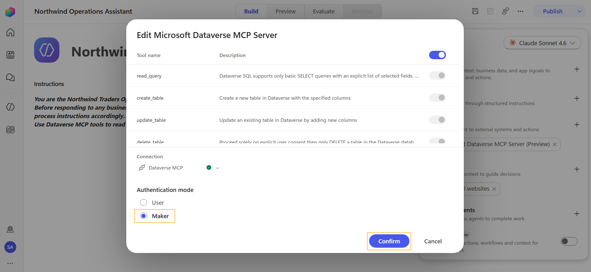
   Figure: The tool configured with Maker authentication.

8. In the **Preview** pane, run the full retail scenario in sequence. First, discover all available skills. Confirm all three **Northwind Traders** skills appear in the response.

   ```
   Show me all business skills available in this environment
   ```

   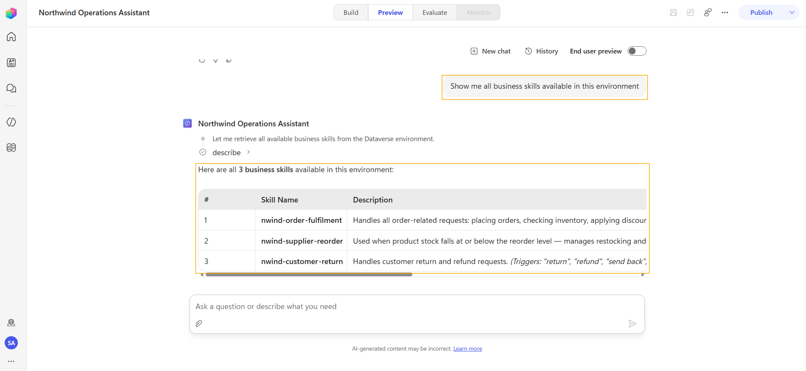
   Figure: All three skills returned in the Copilot Studio preview pane.

9. Run the first execution scenario — a standard order:

   ```
   Using business skills, process an order for Company A: 5 units of Northwind Traders Olive Oil
   and 10 units of Northwind Traders Walnuts.
   The customer is based in the USA.
   ```

   Watch the agent's tool calls in the chat: search (find the skill) → describe (read the instructions) → read\_query (check Customer, Products) → create\_record (create Order and Order Details).

   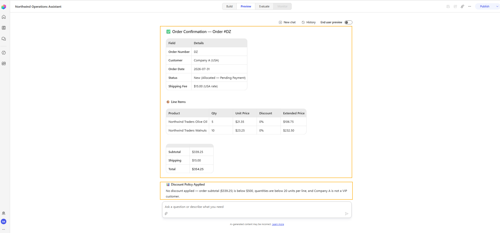
   Figure: The agent processing a standard order with no discount.

10. Run the quantity-discount scenario:

    ```
    Using business skills, process an order for Company B: 25 units of Northwind Traders Green Tea.
    The customer is based in the USA.
    ```

    The agent should apply a **5% discount** to the Green Tea line (quantity exceeds 20). Verify the extended price calculation: UnitPrice × 25 × 0.95.

    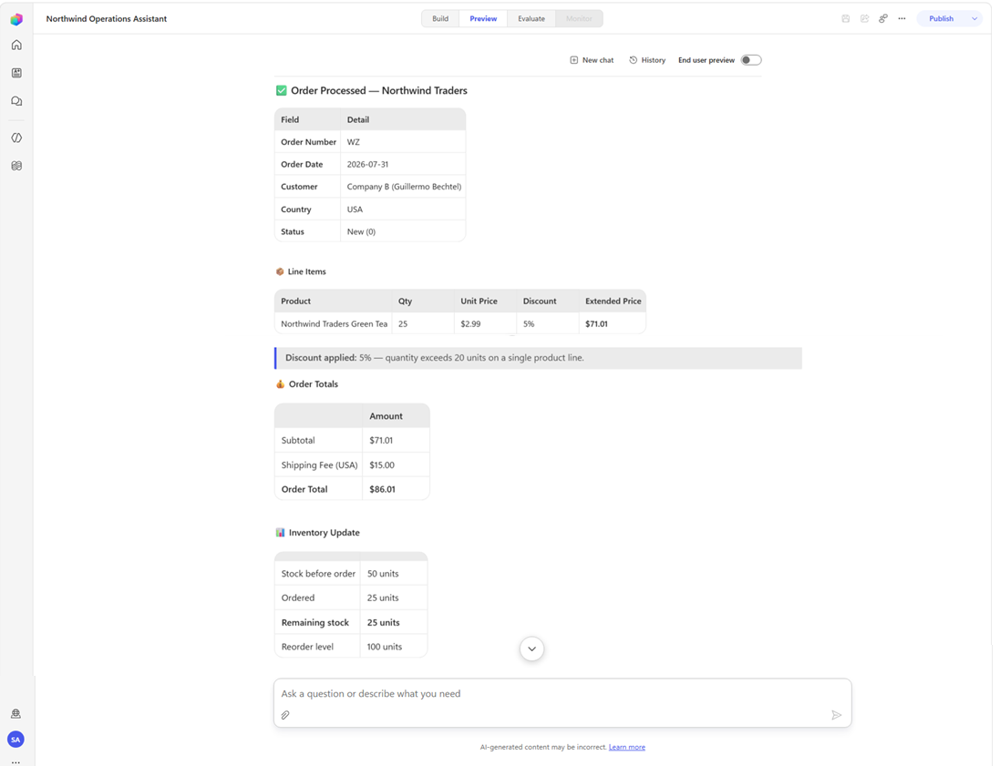
    Figure: The agent applying a 5% quantity discount to the Green Tea line.

11. Navigate to [**make.powerapps.com**](https://make.powerapps.com) and select your Power Platform development environment. Next, go to **Solutions** and **select the pre-installed Northwind Traders solution**.

    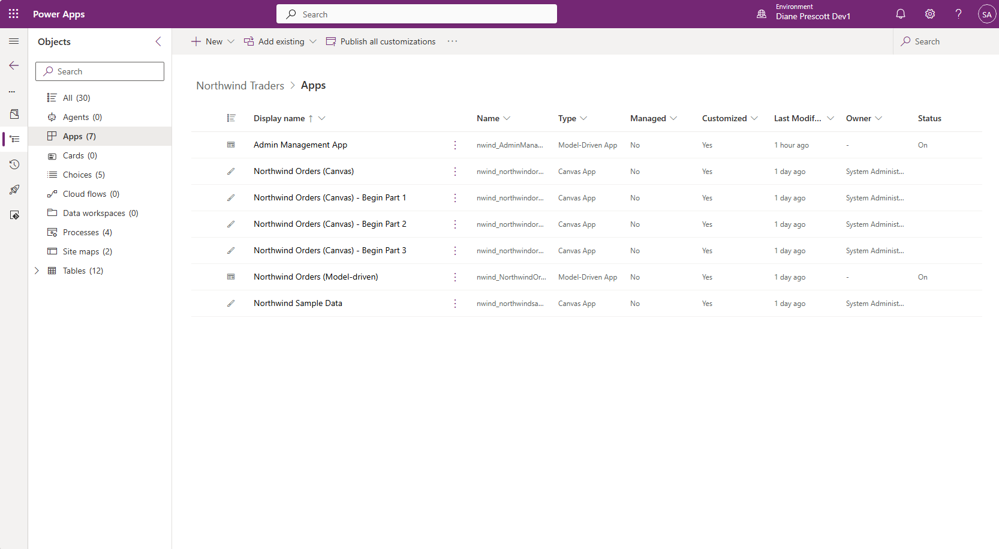
    Figure: Selecting the Northwind Traders solution in Power Apps.

12. Open the **Northwind Traders Admin Management App** from **Apps**, then navigate to the **Customers** page. Select **Company C**, add "VIP Customer" to the Notes field, setting **Country** to **Germany**, State to Bavaria and City to Munich.

    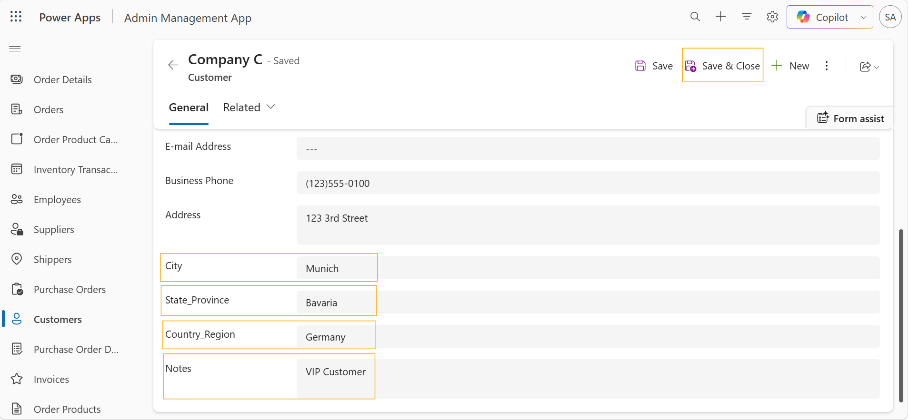
    Figure: Marking Company C as a VIP customer to the Notes field and setting Country to Germany, State to Bavaria and City to Munich.

13. Go back to Copilot Studio, then in the Northwind Operations Assistant agent, start a new chat and run the VIP customer scenario:

    ```
    Process an order for our VIP customer Company C: 5 units of Northwind Traders Tomato Soup.
    ```

    The agent needs to query the Customers table, locate the `VIP` note, and apply the **15% discount**. It should also persist the country value so **Freight is set to $45 (international)**. Please verify the calculated totals in the response.

    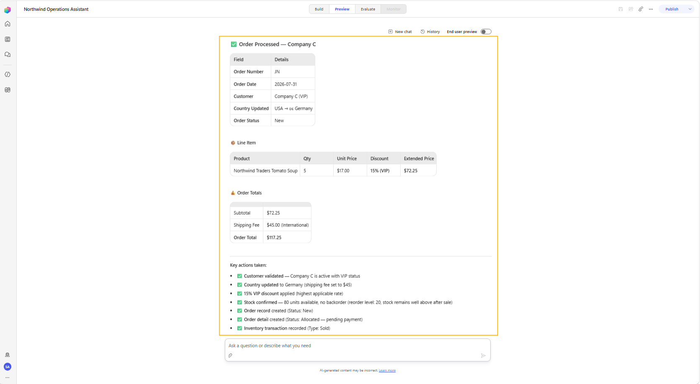
    Figure: The agent applying the 15% VIP discount with international freight.

14. Run the complete order-to-return scenario:

    ```
    Using business skills, process an order for Company A: 30 units of Northwind Traders Mustard (USA customer).
    Then check if any products need reordering.
    Finally, Company C wants to return the Syrup order number 0927 — check if it's eligible.
    ```
    📌 Note: Order number 0927 (Company C, Northwind Traders Syrup) is created automatically when you run Load Data in the Northwind Sample Data app, so no additional setup is needed for it. However, do not clear/reload sample data between steps 9–13 and step 14 — doing so would remove the orders created in those earlier steps (Company A, Company B, Company C) that this combined scenario also depends on.

    The agent should chain all three skills in sequence:

    - **nwind-order-fulfilment**: quantity discount, order created, inventory updated.
    - **nwind-supplier-reorder**: post-order stock check, supplier table queried, purchase orders created.
    - **nwind-customer-return**: order found, 30-day window check, return status set, product category eligibility.

    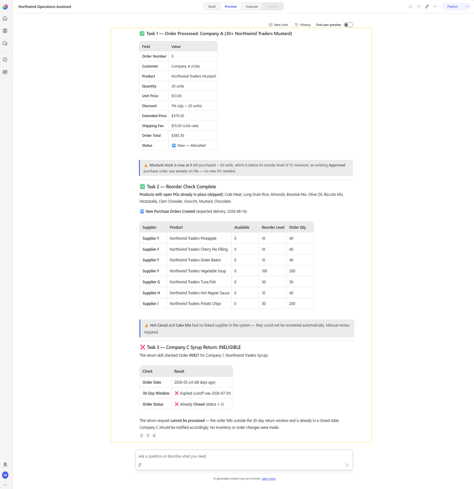
    Figure: The agent chaining the order fulfilment, reorder, and return skills.

15. Select **Publish** in the agent to make it available beyond the test pane.

    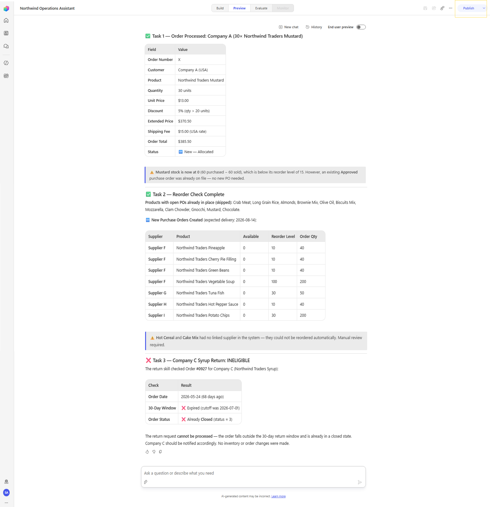
    Figure: Publishing the Northwind Operations Assistant agent.

> **💡 Tip** For reliable, attended runs, keep the conversation focused — one business request at a time is easier for the agent to trace through the skill steps. If the agent misses a skill, add clearer trigger phrases to the description.

> **💡 Tip** To run these steps again, open the Northwind Traders solution, find the Northwind Sample Data app, and select Clear Data. Once all records have been cleared, select Load Data and wait for it to finish.

> **✅ Checkpoint** The Northwind Operations Assistant is published. A single conversation processed an order with the correct 5% discount, ran a supplier reorder check, and confirmed return eligibility.

## Step 5: Make it reusable

Next, make the skills production-ready by setting organization-wide visibility, sharing them with the appropriate people, and configuring agent instructions for reliable, consistent discovery.

1. In [make.powerapps.com](https://make.powerapps.com/), navigate to **Business skills**. Select **nwind-order-fulfilment**, open the **Commands** menu next to the skill name and then select **Share**.

   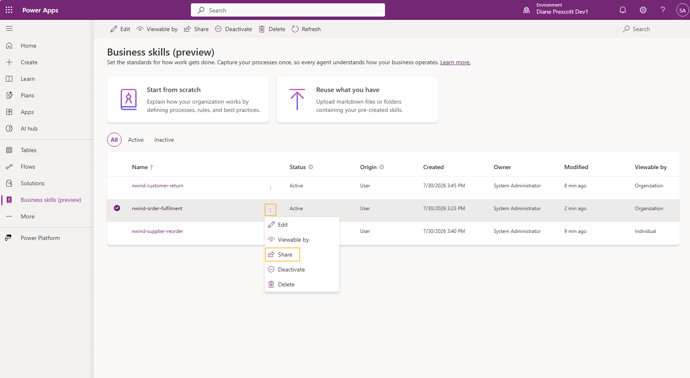
   Figure: Share skill.

2. In the **Share** dialog, select **Anyone can view** — all users in the environment with at least **Basic User** privileges can discover the skill through the MCP. Select **Save**, then repeat these steps for nwind-supplier-reorder and nwind-customer-return.

   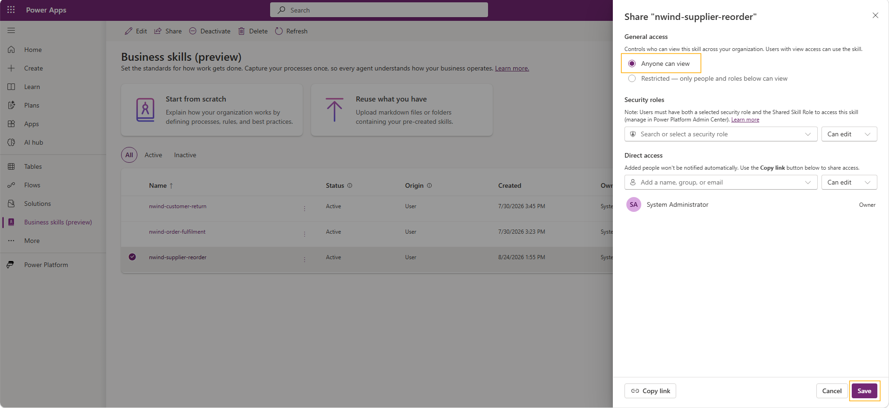
   Figure: The skill set to anyone can view visibility.

    > **⚠️ Important** By default, a skill is created with **Individual** visibility, restricting access to its creator. Only the owner can view or edit the skill.

3. You can also restrict user access when sharing **nwind-order-fulfilment**. Select the **Commands** menu next to your skill name and then select **Share**.

   
   Figure: Share skill.

   In the **Share** dialog, select **Restricted - only people and roles below can view**. Use the search box to choose a security role, assign either **Can edit** or **Can view** access, and select **Save**. Repeat this process for **nwind-supplier-reorder** and **nwind-customer-return**.

   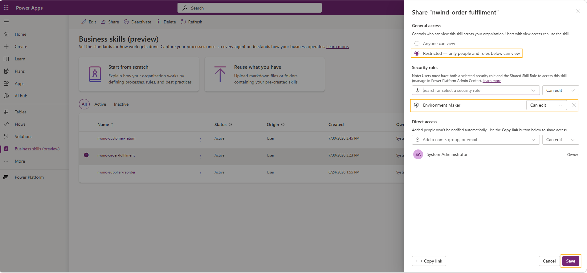
   Figure: Sharing the skill with a Security Role.

   > **⚠️ Important** To access this skill, users must have both the selected security role and the **Shared Skill** role, which is managed in the environment settings in the **Power Platform admin center**.

4. You can also share the skill with specific users through the **Direct Access** section. First, [add each user to the environment in the Power Platform admin center](https://learn.microsoft.com/en-us/power-platform/admin/add-users-to-environment#steps-to-add-users-to-an-environment-that-has-a-dataverse-database). Then, use the search box to find the user, assign **Can edit** or **Can view** access, and click **Save**.

   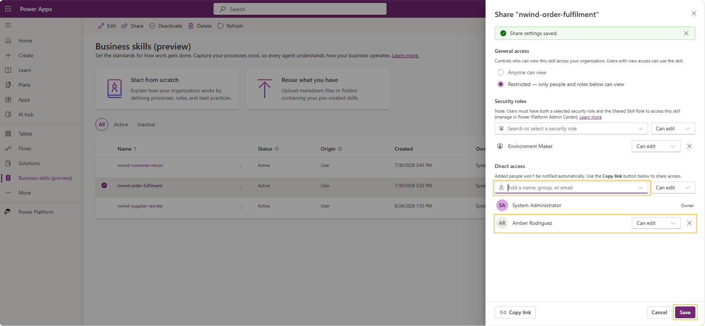
   Figure: Sharing the skill with Users.

   > **⚠️ Important** Users will not receive an access notification, so click **Copy link** and share the link with them directly.

5. Deactivate a skill while you revise it; this prevents agents from using a draft version. Select **nwind-customer-return** and select **Deactivate** from the command bar. The skill remains in the environment but is no longer discoverable.

   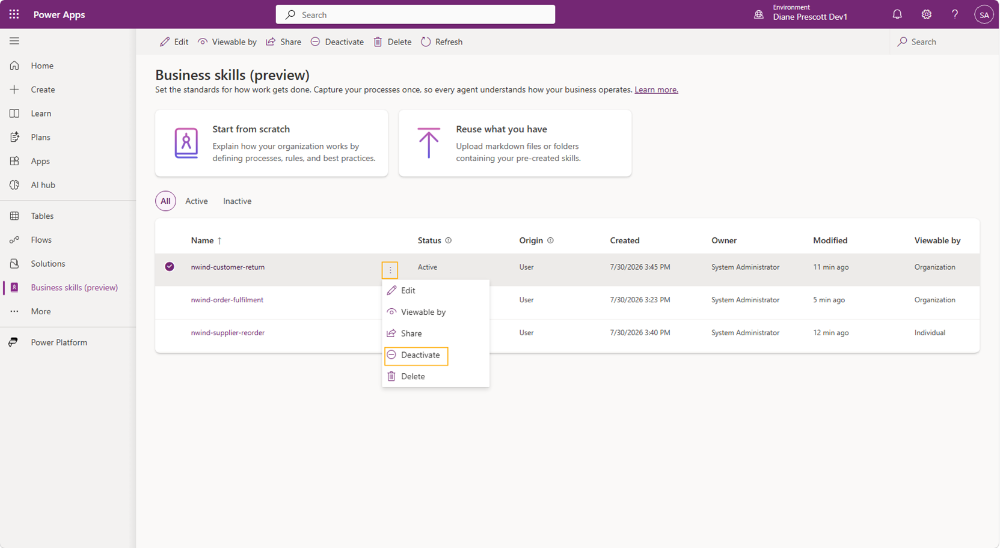
   Figure: Deactivating the nwind-customer-return skill.

6. Navigate to [copilotstudio.microsoft.com](https://copilotstudio.microsoft.com) and open **Northwind Operations Assistant**.

7. On the **Preview** tab, enter the following prompt in the chat to verify skill discovery:

   ```
   Show me all business skills in this environment
   ```

8. The agent calls the search **MCP tool** and returns a list. Confirm two of the **Northwind Traders** skills appear: **nwind-order-fulfilment** and **nwind-supplier-reorder**.

   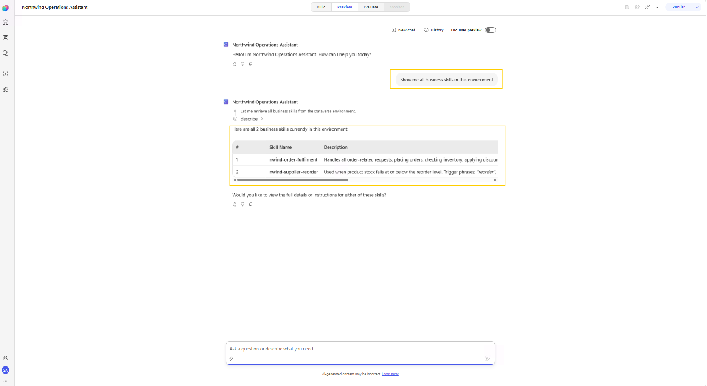
   Figure: Only the two active skills returned after deactivation.

> **⚠️ Important** Deactivating a skill does not delete it. Agents simply stop discovering it. Use deactivation as a safety gate whenever you make significant changes to instructions; reactivate the skill after validating it.

> **✅ Checkpoint** The **nwind-order-fulfilment** skill has been shared while **nwind-customer-return** has been deactivated and is no longer discoverable.

## Step 6: Execute the skill using Visual Studio Code (Optional)
> **⚠️ Important** Complete **Step 3** before moving on to this step.

The skill is validated and now it enters the valid branch. This step runs real business scenarios through the agent and verifies it follows the skill's rules exactly against live data from the Northwind Traders Dataverse environment.

1. Add agent instructions to **VS Code** so the agent always looks for skills before answering business process questions.

   Press **Ctrl+Shift+P → Chat**: New Instruction File and choose default location.

   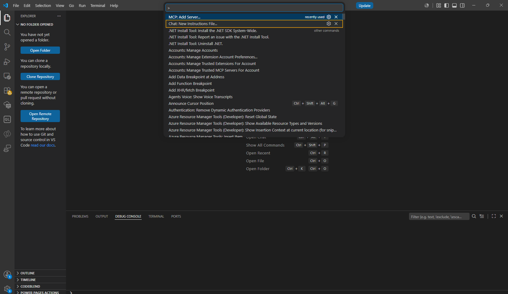
   Figure: Creating a new instruction file in VS Code.

2. Select **~/copilot/instructions (Global)** option and copilot-instructions as the file name.

   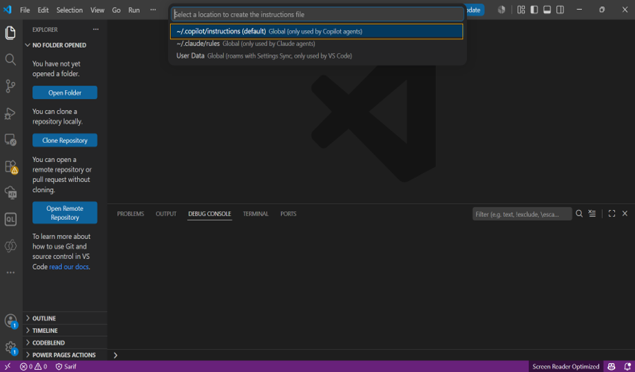
   Figure: Choosing the global location and file name for the instructions.

3. In the **copilot-instructions.md** file, add the information below:

   ```
   ## Dataverse Agent Instructions

   Before responding to any business process request:
   1. Search for relevant business skills using the Dataverse MCP server.
   2. Retrieve the full skill instructions using the describe tool.
   3. Follow the skill steps precisely — do not substitute general knowledge.
   4. If no skill matches, say so and ask the user to clarify.
   ```

   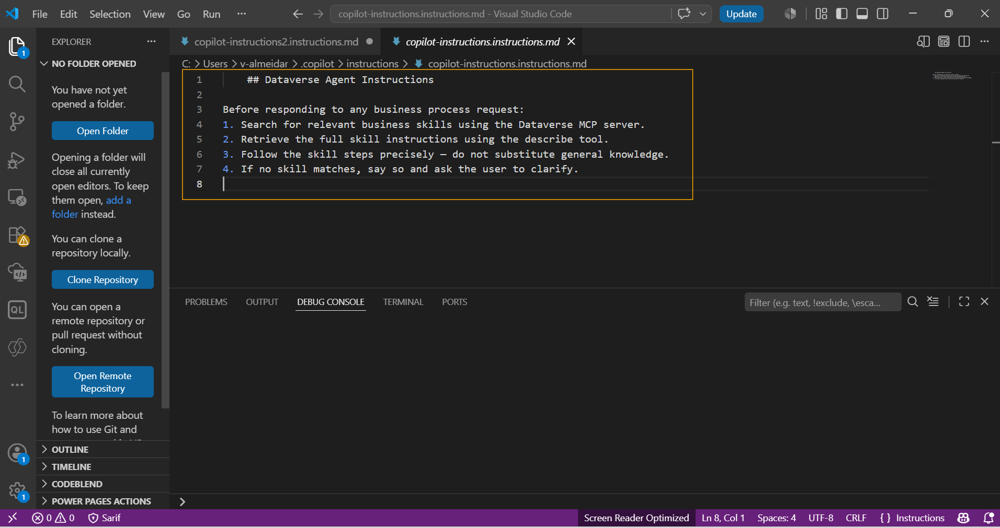
   Figure: The Dataverse agent instructions added to copilot-instructions.md.

4. Run the low-stock scenario to exercise **nwind-supplier-reorder**:

   ```
   Using business skills, check which Northwind products need to be reordered
   and show me the supplier contact for each
   ```

   The agent should query **Products** where **UnitsInStock ≤ ReorderLevel**, join to **Suppliers**, and return the formatted table the skill specifies.

   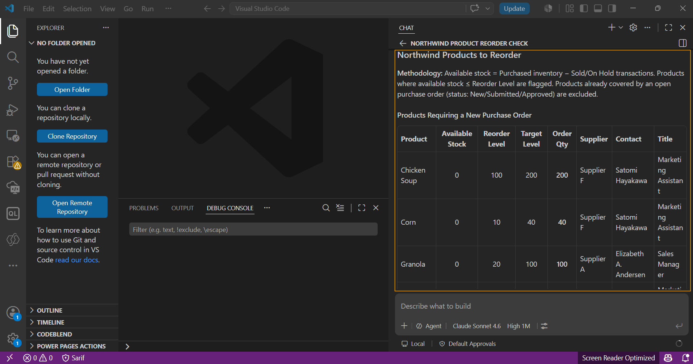
   Figure: The reorder report listing products and supplier contacts.

> **💡 Tip** For reliable results, keep your hands off the keyboard while the agent is executing — you and the agent share the same data. If a tool call fails, the agent will surface the error in the chat.

> **✅ Checkpoint** The VS Code agent instruction file is now in place, and the low-stock reorder report has been generated. The agent followed the skill steps and did not give any general-knowledge answers.

## Step 7: Publish a reusable skill collection

Every skill you created lives inside this one environment. Just packaging skills in a **Power Apps solution** makes them reusable across environments — every agent in the target environment immediately gains access to them.

1. In [make.powerapps.com](https://make.powerapps.com/), navigate to **Solutions** and select **Northwind Traders** solution:

   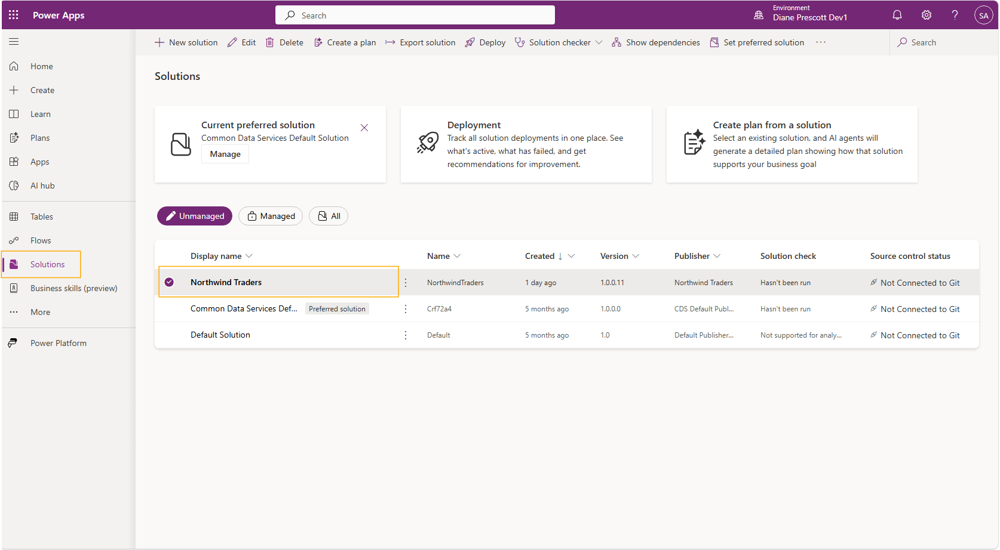
   Figure: Opening the Northwind Traders solution.

2. In the solution, select **Add existing** -> **Business skill** from the top navigation.

   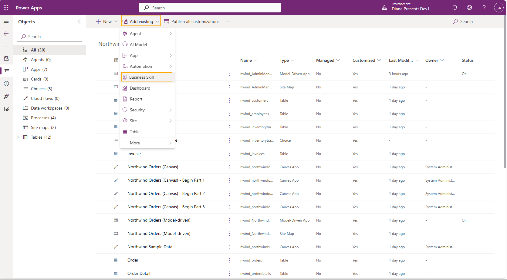
   Figure: Adding an existing business skill to the solution.

3. Select all three skills: nwind-order-fulfilment, nwind-supplier-reorder, and nwind-customer-return, and select **Add**.

   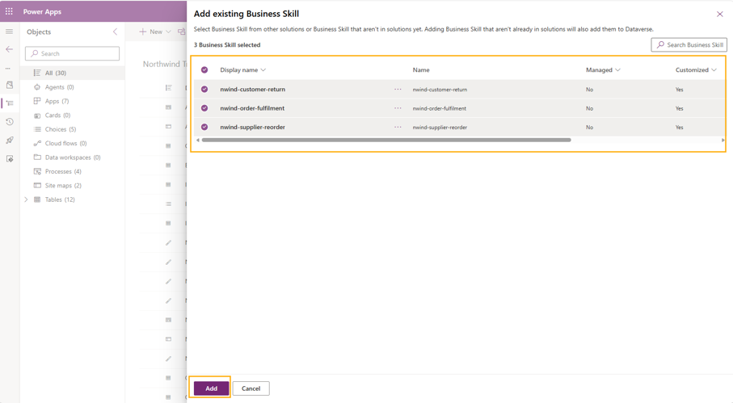
   Figure: Selecting the three skills to add to the solution.

   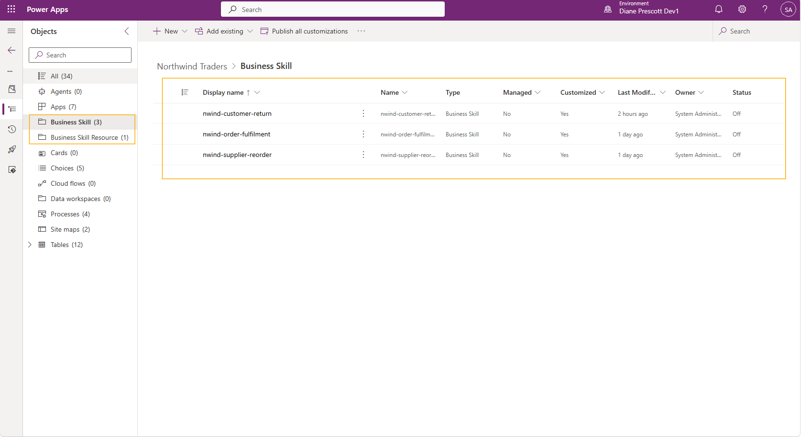
   Figure: The three skills added to the solution.

4. Export the solution. Select **Export > Export** as managed and follow the wizard, publishing all customizations first. **Save** the .zip file to your local machine.

   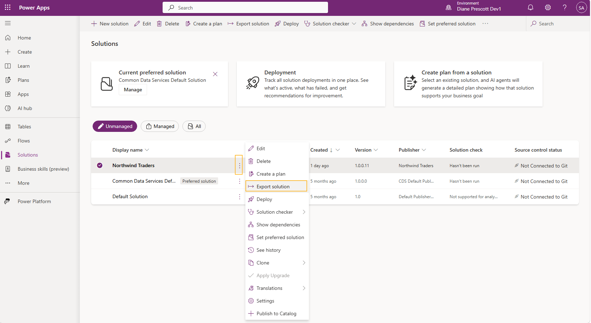
   Figure: Exporting the solution as a managed solution.

   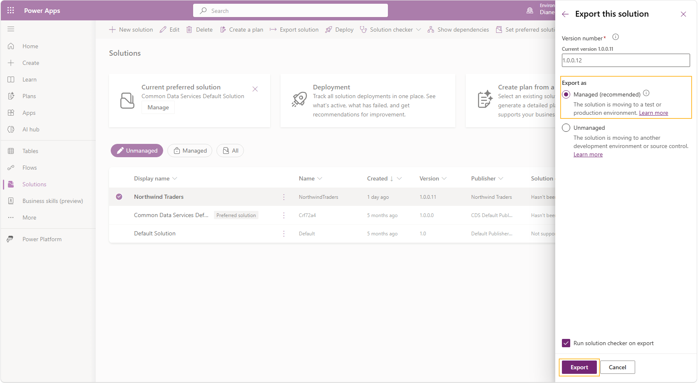
   Figure: The managed solution export wizard.

   You can import this solution into other environments, such as sandbox or production.

> **⚠️ Important** After a managed solution is deployed, the skills it contains become read-only in the target environment. To make changes, update the skill in the source environment, increase the version, and re-export.

> **✅ Checkpoint** The Northwind Traders managed solution is exported and can be imported into the target environment.

## 9. Lab completion

🥳 Congratulations — you built **Dataverse Business Skills** the production way: three skills that encode Northwind Traders' actual operational processes, tested against live data, shared with the right people, and packaged for ALM promotion.

### Summary & best practices

- **Write skills like an SOP for a new employee** — numbered steps, explicit business rules, no assumed context.
- **Get the description right first** — the description is the signal an agent uses to discover the skill. Treat it like a function doc-string: what it does, when to call it, key trigger phrases.
- **Scope visibility deliberately** — start with Individual, promote to Organization only once the skill has been validated end-to-end.
- **Package in a solution for ALM** — skills added to a solution can be promoted through dev/test/prod with standard pipelines; standalone skills cannot.

### Recommended next steps

1. Explore the [Sample Business Skills repository on GitHub](https://aka.ms/DVBusinessSkillRepo) for additional production-ready skill examples you can install directly in your environment.
2. Build skills for your own organization's processes using the same pattern: write the markdown offline, define the structure in Power Apps, validate from VS Code, and package in a solution.
3. Optimize the skill files with SQL queries. Use the improved [nwind-customer-return-optimized](resources/nwind-customer-return-optimized.md) example as a guide; apply the same approach to the other skills.
