## Power CAT | The Intelligent Enterprise - Power Platform & AI for Frontier Firms

AI-Powered Modern UX for Model-Driven Apps


# 1. Lab overview
<!-- PDF refresh trigger: 2026-05-16 -->

## 1.1 Lab purpose

This lab demonstrates how **Generative Pages** in **Power Platform** enables makers and developers to rapidly design and evolve applications using natural language. You will build a modern business app using AI‑assisted page generation, iterative UX refinement, and automated logic, backed by **Dataverse** for secure and scalable data storage.

Throughout the lab, you will use prompts to generate and refine model‑driven app pages, understand how prompt intent shapes UX and functionality, and integrate Generative Pages with Dataverse to deliver an end‑to‑end solution. The lab also covers best practices for prompt design, governance, and extensibility to ensure production‑ready apps with built‑in security, RBAC, and enterprise scale.

## 1.2 Why this matters

**Generative Pages** empowers development teams to rapidly build and iterate on business applications using natural language, eliminating repetitive scaffolding and accelerating delivery. By integrating with **GitHub Copilot**, teams can choose their own best-of-breed AI model for app generation—bringing the flexibility to select the model that best fits their needs, coding standards, and enterprise requirements. This approach fosters innovation, reduces time-to-value, and keeps developers in control of both the toolchain and the outcome. Once generated, you can take your code and integrate it with your own **source control** system, enabling full ALM practices, team collaboration, and versioned deployments.

# 2. App scenario

| Industry / function | Operations |
| --- | --- |
| Primary user role | Operations Manager |
| Problem statement | How can Northwind Traders rapidly modernize their model-driven app experience with rich, interactive pages built from natural language prompts over Dataverse data |
| Intelligent outcome | Generative Pages enables operations teams to generate, iterate, and deploy modern UI pages grounded in Dataverse tables — replacing classic forms and views without manual coding or design effort |

# 3. Core concepts

Gen Pages bring together:

- **AI-powered modernization** for replacing classic model-driven forms and views with rich, interactive pages generated from natural language
- **Dataverse** as the native data backbone, with automatic binding to tables, columns, and relationships
- **Managed Platform** for governed deployment across environments with full ALM support

| Concept | Why it matters |
| --- | --- |
| AI-powered modernization | Gen Pages replaces classic model-driven forms and views with rich, modern experiences — generated from natural language prompts. It reduces design effort while elevating the end-user experience. |
| Gen Pages skill | The `/genpage` skill covers the complete page lifecycle in a single session — from validating prerequisites and authenticating via PAC CLI, through generating a React + TypeScript + Fluent UI component, to deploying directly into a model-driven app and verifying in the browser. It eliminates manual scaffolding and wiring, so you can focus on the experience rather than the toolchain. |
| Dataverse data binding | Pages connect directly to Dataverse tables, columns, and relationships — ensuring data consistency, security trimming, and real-time sync without manual configuration. |
| ALM / Solution awareness | Gen Pages are solution-aware by default. Every page is packaged within a Dataverse Solution, enabling confident promotion across dev, test, and production environments. |

# 4. Intelligence used in this lab

| Intelligence type | Where it’s used | Purpose |
| --- | --- | --- |
| GitHub Copilot | Visual Studio Code | Provide a code agent to help the developer quickly code their application |
| `/model-apps:genpage` skill | GitHub Copilot CLI Chat in Visual Studio Code | Generate model-driven app pages from natural language prompts grounded in Dataverse tables |
| Power Platform skills for GitHub Copilot | GitHub Copilot CLI Chat in Visual Studio Code | Provide Power Platform–aware tools (environment selection, Dataverse metadata, page authoring) to Copilot |
| Dataverse MCP server | GitHub Copilot CLI Chat | Expose Dataverse table metadata to Copilot so generated pages bind to real tables and columns |
| Image grounding in GitHub Copilot CLI Chat | GitHub Copilot CLI Chat in Visual Studio Code | Use a reference screenshot to guide layout and visual style of a generated page |

# 5. Documentation & learning resources

- [Generative pages overview (Microsoft Learn)](https://learn.microsoft.com/en-us/power-apps/maker/model-driven-apps/generative-pages)
- [Use generative pages with external tools (Microsoft Learn)](https://learn.microsoft.com/en-us/power-apps/maker/model-driven-apps/generative-page-external-tools)
- [Power Platform skills for GitHub Copilot (GitHub repo)](https://github.com/microsoft/power-platform-skills)
- [GitHub Copilot documentation](https://docs.github.com/en/copilot)
- [Visual Studio Code documentation](https://code.visualstudio.com/docs)

# 6. Prerequisites

Before starting this lab, ensure the following are in place:

**Environment & Access**

- [Review the shared workshop prerequisites](/labs/prereqs.md).
- You can create apps in a **Power Platform environment** with Dataverse enabled (Dev/Sandbox preferred)
- Confirm that your attendee account has the **Environment Maker** role.
- Ask a Power Platform administrator to confirm that the environment's data policies permit Dataverse.

**Solution & Data**

- Ask the workshop facilitator or a Power Platform administrator to import and seed the latest Northwind Traders solution before the lab. If you import and seed it yourself, your account needs the **System Administrator** or **System Customizer** security role, or equivalent custom privileges. [Follow the Northwind Traders solution import and sample data instructions](../../solutions/README.md).

**Tools**

- [Visual Studio Code](https://code.visualstudio.com/)
- [GitHub Copilot](https://github.com/features/copilot) — active subscription and the GitHub Copilot extension installed in VS Code
- [Node.js Long-term support (LTS) version](https://nodejs.org/) (includes npm and npx) — required for all skills
- [.NET SDK](https://dotnet.microsoft.com/download) — required to install and update the PAC CLI via `dotnet tool`
- [Power Platform CLI](https://learn.microsoft.com/power-platform/developer/cli/introduction?tabs=windows) >= 2.3.1 — required for schema generation and deployment

  Install or update PAC CLI:
  ```
  dotnet tool install -g Microsoft.PowerApps.CLI.Tool
  ```
  Or update if already installed:
  ```
  dotnet tool update -g Microsoft.PowerApps.CLI.Tool
  ```

**Plugins**

- Install the **Model Apps plugin** for GitHub Copilot (provides the `/genpage` skill):
  ```
  /plugin marketplace add microsoft/power-platform-skills
  /plugin install model-apps@power-platform-skills
  ```

**Licensing**

- End users that run model-driven apps need a **Power Apps Premium License** or **Dynamics 365 License**

# 7. Learning outcomes

By the end of this lab, you will be able to:

- Use the `/model-apps:genpage` skill in GitHub Copilot CLI Chat to generate a model-driven app page from natural language.
- Bind a Gen Page to Dataverse tables and relationships in an existing solution (Northwind Traders).
- Publish a generated page into a new or existing model-driven app and verify it in the browser.
- Iterate on a generated page with follow-up prompts to apply modern styling, conditional formatting, and richer expanded views.
- Use a reference image alongside a prompt to ground the agent when generating a complex order-entry page.

# 8. Modules covered

| Module | Description | Value | Est. time |
| --- | --- | --- | --- |
| Generate an Orders page with the genpage skill | Use the `/model-apps:genpage` skill to scaffold a modern Orders page bound to Northwind Dataverse tables, then publish it to a new app. | Go from natural language to a published, working page in minutes — no manual scaffolding. | 25 min |
| Refine the page with style and behavior prompts | Apply a modern visual style, add conditional formatting for high shipping fees, and improve the expanded order view with side-by-side tiles and a map. | Iterate on UX and behavior through focused prompts without writing code by hand. | 25 min |
| Art of the possible — build a New Order Creation page | Generate a complex order-entry page with shipping, payments, and a paginated product catalog gallery using a single prompt and a reference image. | See how rich prompts and image grounding unlock complex layouts in one pass. | 25 min |

# 9. Lab instructions

Variations are expected because AI is non-deterministic, and GitHub Copilot's suggestions can also be influenced by the AI model used by GitHub Copilot, the user's authentication context, permissions, and the specific Power Platform environment being accessed.

## Module 1: Generate an Orders page with the genpage skill

| Use case value | Use natural language to scaffold a model-driven app page from Dataverse tables |
| --- | --- |
| Estimated effort | 20 minutes |
| Scenario | Create a modern Orders experience that lets users browse orders and drill into related order details and products. |
| Objective | Use the `/genpage` skill in GitHub Copilot to generate, publish, and verify a Gen Page in a model-driven app. |

### Tasks covered

1. Start GitHub Copilot CLI Chat in your working directory.
2. Run the `/genpage` skill and select your target environment.
3. Describe the page in natural language and confirm the generation plan.
4. Publish the page to a new model-driven app and verify it in the browser.

### Step-by-step instructions

1. Open Visual Studio Code in your current working directory for the Gen Page lab and start GitHub Copilot CLI Chat.

   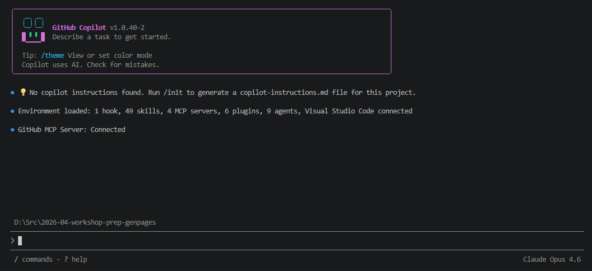  
   Figure: Start GitHub Copilot CLI Chat from the activity bar.

2. In the chat input, type `/` to bring up the available skills, then run the Gen Page skill:

   ```
   /model-apps:genpage
   ```

   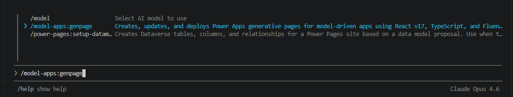  
   Figure: Invoke the `/model-apps:genpage` skill from GitHub Copilot CLI Chat.

3. The skill validates that it has everything it needs. If you have one or more environments listed, select the environment you want to target.

   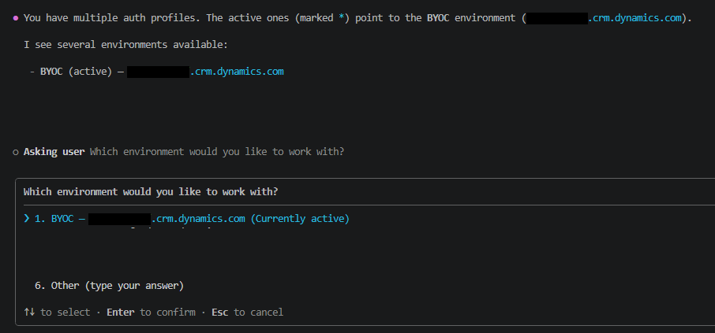  
   Figure: Choose the environment where the page will be created.

4. When prompted, choose **Create a new page**.

   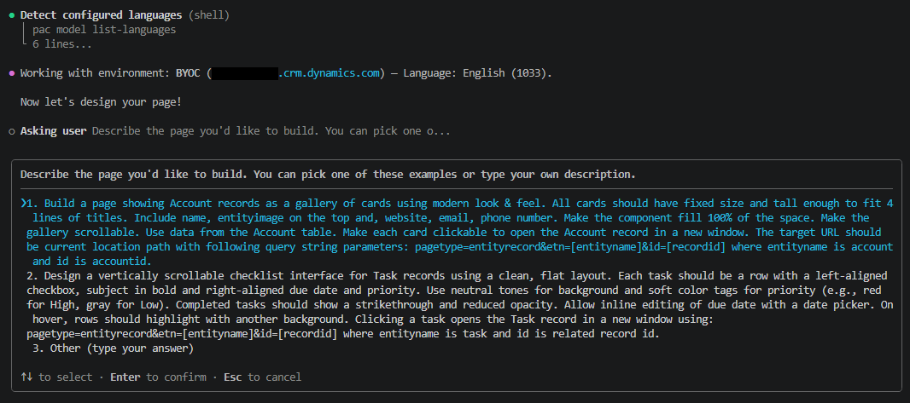  
   Figure: Start a brand-new Gen Page.

5. Select **Other** and enter the following description for your page:

   ```
   I want a modern looking page for Orders. Users should be able to view Orders and their related data. When I select an Order, the record should expand and show me the related order details and the product associated with that Order. Use the `nwind_orders`, `nwind_order_details`, and `nwind_products` tables from the Northwind Traders solution.
   ```

   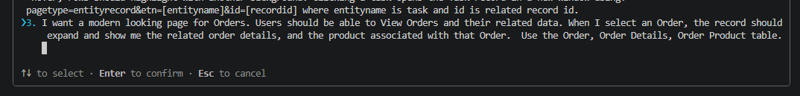  
   Figure: Describe the Orders page in natural language.

6. When the skill confirms the page details, select **Yes** to proceed.

   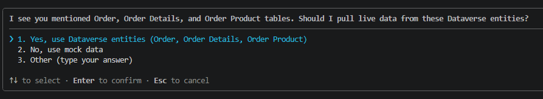  
   Figure: Confirm the page request to continue.

7. The model may suggest additional enhancements for your page. Select the option that best fits your scenario. For this lab, choose **All of the above (Recommended)**.

   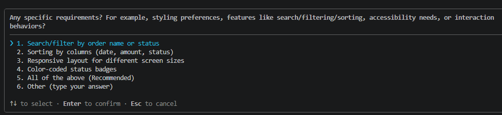  
   Figure: Accept the recommended set of enhancements.

8. Review the execution plan that the agent presents before it starts writing code. You can refine the plan here, or select **Looks good, proceed!** to continue.

   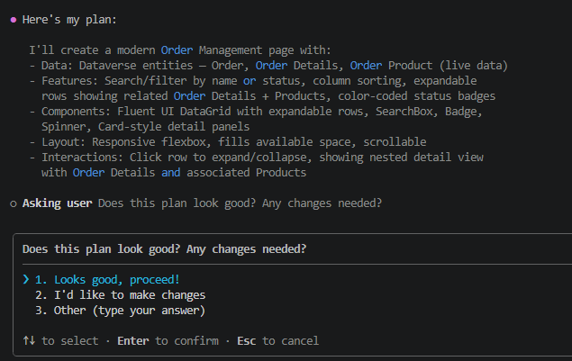  
   Figure: Confirm the plan the agent will follow.

9. The agent begins creating your page. If you are prompted to allow the skill to read related files, accept the request.

   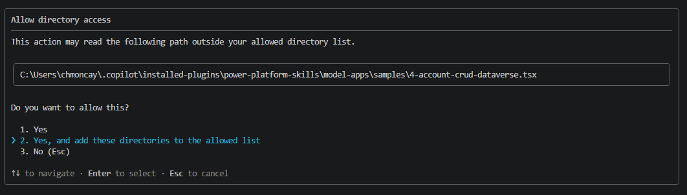  
   Figure: Approve file reads requested by the skill.

   > 💡 **Tip:** If Copilot references tables other than the ones you want, remind it which tables to use:
   > ```
   > The tables we want are in the Northwind Traders solution with prefix nwind_. nwind_orders, nwind_orderdetails, nwind_products
   > ```
   > 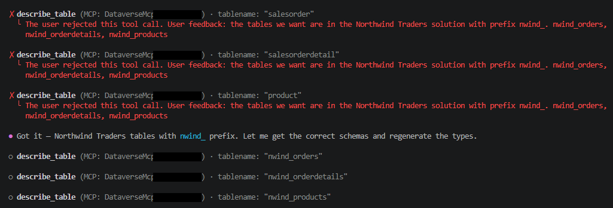  
   > Figure: Steer the agent to the correct Northwind tables.

10. Once generation completes, the agent prompts you to publish to Power Apps. Select **Publish**.

    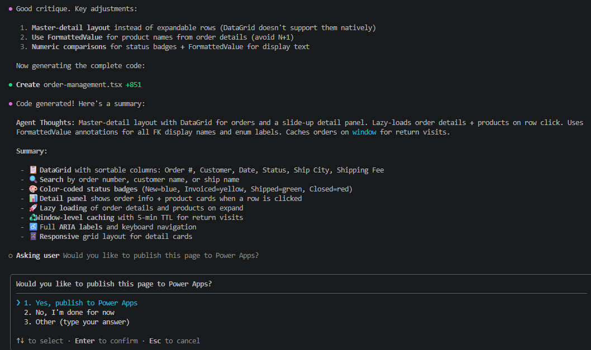  
    Figure: Publish the page when generation completes.

11. You are then prompted to choose an app to add the page to.

    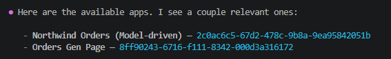  
    Figure: Pick an existing app or create a new one.

12. Instead of selecting an existing app, ask the agent to create one for you:

    ```
    Create a new app named Northwind Orders Gen Page
    ```

    The agent creates the app and adds the page to it.

    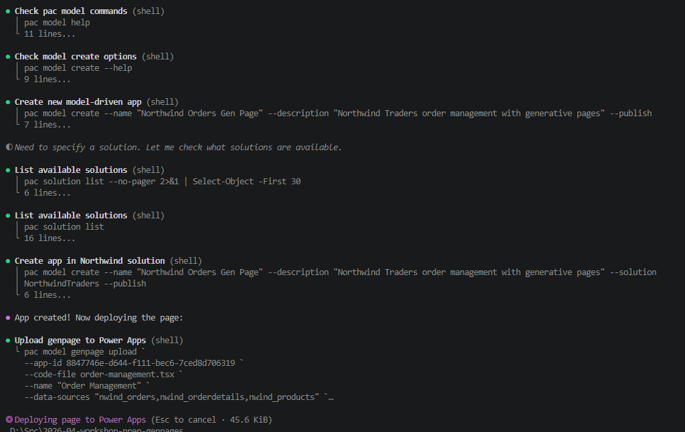  
    Figure: Create a new app named Northwind Orders Gen Page.

13. When the agent finishes, you are prompted to verify the new page.

    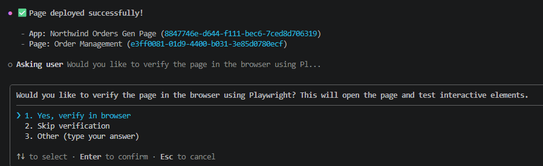  
    Figure: The agent prompts you to verify the page.

14. Select **Verify in browser**.

    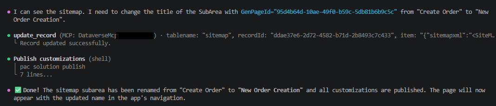  
    Figure: Open the page in the browser to verify.

### Expected result (checkpoint)

The Orders page opens in the browser inside the new **Northwind Orders Gen Page** app and lists records from the Order table.

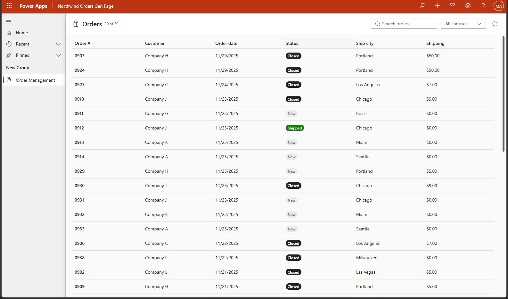  
Figure: The generated Orders page running in Power Apps.

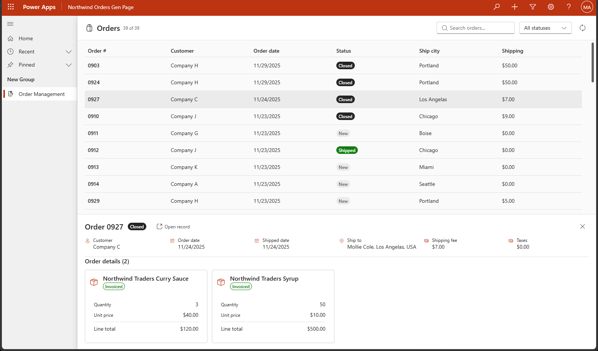  
Figure: Browse orders and inspect the generated layout.

### Reflection

You generated a working model-driven app page from a single natural language prompt and published it into a new app — no manual scaffolding required.

## Module 2: Refine the page with style and behavior prompts

| Use case value | Iterate on a generated page using prompts to improve UX, conditional formatting, and the expanded view |
| --- | --- |
| Estimated effort | 15 minutes |
| Scenario | Apply a modern visual style, highlight high-value orders, and improve the expanded order details panel. |
| Objective | Use follow-up prompts to refine layout, styling, conditional formatting, and the expanded record view. |

### Tasks covered

1. Apply a modern, accessible visual style to the page.
2. Add conditional formatting to highlight orders with high shipping fees.
3. Improve the expanded order details panel with side-by-side tiles and a map.
4. Rename the page in the sitemap.

### Step-by-step instructions

1. Back in GitHub Copilot CLI Chat, ask the agent to update the app:

   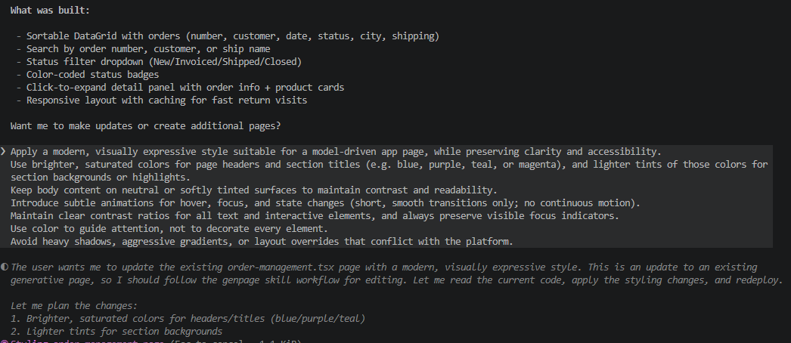  
   Figure: Continue the chat to make further changes.

2. Enter the following style prompt:

   ```
   Apply a modern, visually expressive style suitable for a model-driven app page, while preserving clarity and accessibility. Use brighter, saturated colors for page headers and section titles (e.g. blue, purple, teal, or magenta), and lighter tints of those colors for section backgrounds or highlights. Keep body content on neutral or softly tinted surfaces to maintain contrast and readability. Introduce subtle animations for hover, focus, and state changes (short, smooth transitions only; no continuous motion). Maintain clear contrast ratios for all text and interactive elements, and always preserve visible focus indicators. Use color to guide attention, not to decorate every element. Avoid heavy shadows, aggressive gradients, or layout overrides that conflict with the platform.
   ```

   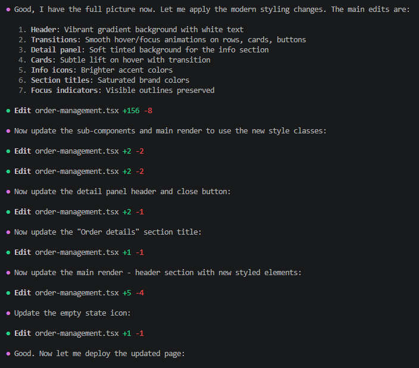  
   Figure: Apply a modern, accessible visual style.

3. The agent applies your changes and republishes the page. Open the page to see the updated visuals.

   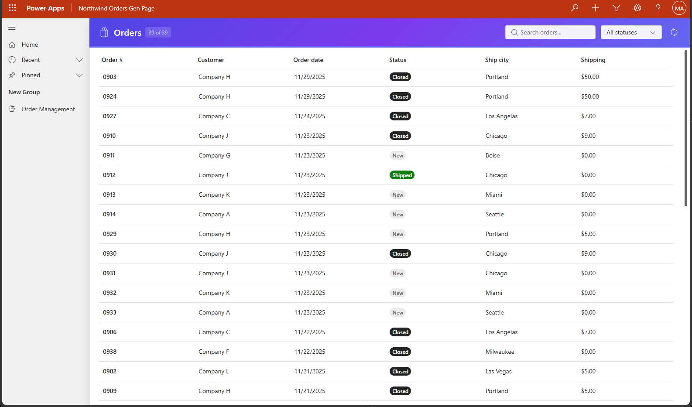  
   Figure: The Orders page with the new modern style applied.

   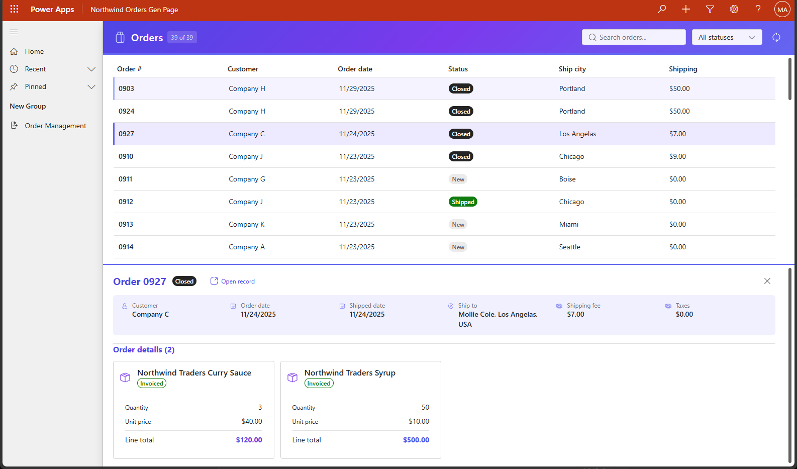  
   Figure: Refreshed header and section styling.

   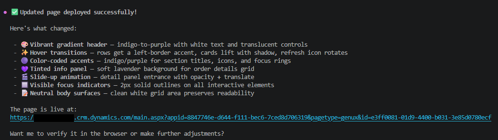  
   Figure: Subtle animations and tinted surfaces guide attention.

4. Add a conditional formatting prompt to highlight high-value shipping records:

   ```
   Highlight the records where shipping fee is > $50.
   ```

   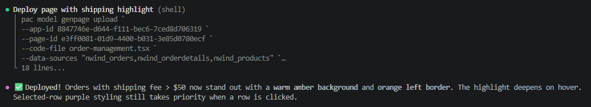  
   Figure: Conditional formatting highlights high shipping fees.

5. Improve the expanded order details panel with the following prompt:

   ```
   When a user expands an order, render an expanded view that includes detailed order information, shipping details, and the complete shipping address. Display order and product information within a single, structured tile. Position this tile horizontally adjacent to the shipping details tile to enable clear side-by-side comparison.
   Add an additional tile dedicated to visualizing the shipping address on an interactive map. Make sure that map should automatically load and pin the delivery address from the shipping details, centered on that location. Retain the scroll bar to navigate through the orders gallery.
   ```

   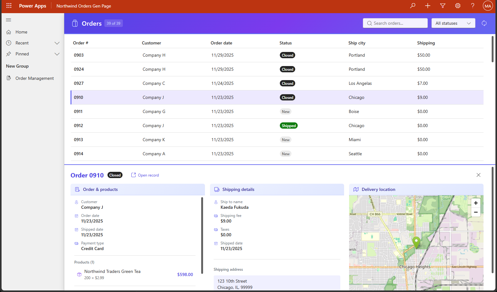  
   Figure: Expanded view with order, shipping, and a map tile.

6. Rename the page in the sitemap. Edit the subarea directly in the sitemap and set the page name to **Modern Order Page**.

### Expected result (checkpoint)

The Orders page now has a modern, accessible visual style, highlights orders with shipping fees over $50, and shows a richer expanded view with shipping details and an interactive map. The sitemap entry is renamed to **Modern Order Page**.

### Reflection

You evolved the page through a sequence of focused prompts — styling, conditional formatting, and an expanded view — without writing any code by hand.

## Module 3: Art of the possible — build a New Order Creation page

| Use case value | Use a single rich prompt and a reference image to generate a complex order-entry page |
| --- | --- |
| Estimated effort | 20 minutes |
| Scenario | Create a new order-entry page with shipping, payments, and a paginated product catalog gallery. |
| Objective | Generate a complex page with one prompt, then refine it with an image-grounded follow-up. |

### Tasks covered

1. Generate a new order creation page in the same app.
2. Provide a reference image to ground the agent's design.
3. Add a paginated product catalog gallery with cart actions.
4. Rename the page in the sitemap.

### Step-by-step instructions

1. In GitHub Copilot CLI Chat, enter the following prompt to create the new page:

   ```
   I want to create a new page in the same app which is a modern looking form with animations and styling with modern colorful background. I need to be able to enter all the order details. I also want to see the product catalog to be able to add to the order. Ensure all the columns except Order Number, Status and state code shows up in the form. For each of the columns, show me column name as well. Once the record is created grab the order number and then create a related order detail. Add a separate section to enter all shipping details and another section for payments and taxes. Do not create any mock data. Use the nwind_orders, nwind_order_details, and nwind_products tables from the Northwind Traders solution.
   ```

   > 💡 **Tip:** This page may take a while to create because of its complexity.

   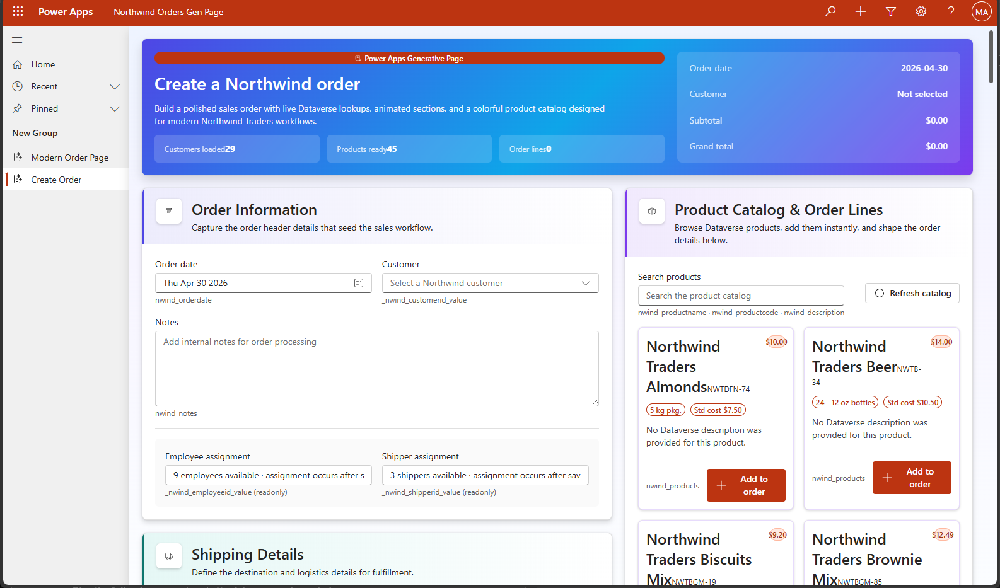  
   Figure: The agent generates the order-entry form.

2. You can also provide a sample image for reference. Copy the image below and paste it in the GitHub Copilot CLI chat along with the next prompt.

   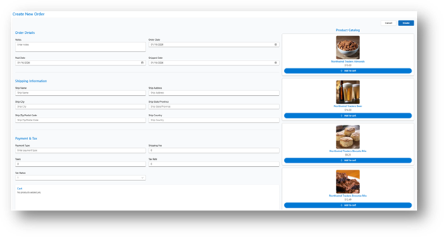  
   Figure: Sample reference image for the product catalog layout.

3. Paste the image and send the following prompt:

   ```
   Display the full product catalog as a vertical gallery positioned on the right side of the order form. Each product entry should be presented as a card that includes a product image as a thumbnail. The gallery should paginate the catalog to show 4 products per page, with clear navigation controls that allow users to move between pages within the catalog. Ensure the layout remains visually aligned with the form and supports smooth browsing without disrupting the order-creation flow.
   ```

4. Send one more prompt to add cart interactions:

   ```
   I want to see a thumbnail of the product image, and ability to add to cart and increase or decrease product quantity
   ```

   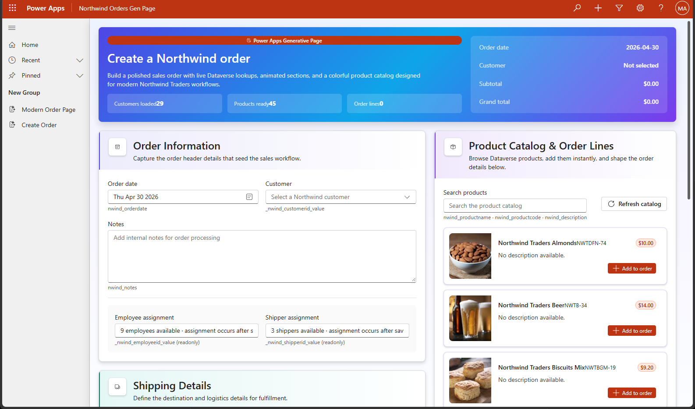  
   Figure: Paginated product catalog with thumbnails and cart controls.

5. Rename the page in the sitemap. Edit the subarea directly in the sitemap and set the page name to **New Order Creation**.

### Expected result (checkpoint)

The app now contains a **New Order Creation** page with sections for order details, shipping, and payments and taxes, alongside a paginated product catalog gallery with add-to-cart and quantity controls.

### Reflection

You used a single rich prompt — augmented with a reference image — to generate a complex multi-section page, then refined it iteratively. This is the Art of the Possible with Generative Pages.

# 11. Lab completion

Congratulations! You used the `/model-apps:genpage` skill to scaffold, refine, and extend a model-driven Orders experience grounded in Dataverse — without writing handcrafted page metadata.

## Key takeaways

- You can generate a working model-driven app page from a natural language prompt and publish it to a new app in minutes.
- Iterating with focused prompts lets you restyle pages, add conditional formatting, and reshape the expanded view without leaving GitHub Copilot CLI Chat.
- A single rich prompt — combined with a reference image — can produce a complex multi-section page like the New Order Creation form.
- Grounding Copilot in the Dataverse MCP server ensures generated pages bind to real tables and columns in your environment.
- Generative pages keep you in your developer flow (Visual Studio Code + GitHub Copilot CLI Chat) while still producing first-class model-driven app artifacts.

# 12. Challenge: apply this to your scenario

Try the genpage skill against your own data and ideas:

- Pick a Dataverse table from your tenant and prompt `/model-apps:genpage` to generate a page for it. What did the model get right? What needed refinement?
- Take a generated page and apply two or three styling/behavior prompts (color theme, conditional formatting, expanded view layout). How few prompts can you use to reach a polished result?
- Capture a screenshot of a page in another product you admire and use it as image grounding for a new page. How close does the generated page get to the reference?
- Identify one form in your existing apps that would benefit from a richer, multi-section layout. Draft a single prompt that could regenerate it end to end.

# 13. Summary & best practices

Generative pages golden rules:

- **Ground every prompt in real data** — point the genpage skill at the right environment and tables before you generate.
- **Start broad, then refine** — generate the page first, then iterate with small, focused prompts for style, behavior, and layout.
- **Use image grounding for complex layouts** — a reference screenshot is often faster than describing a layout in words.
- **Verify in the browser after each change** — use **Verify in browser** and confirm with **Looks good, proceed!** to keep iterations tight.
- **Keep prompts intent-focused, not metadata-focused** — describe what the user should see and do, and let the skill choose controls and bindings.
- **Treat generated pages as a starting point** — review the produced metadata, rename pages meaningfully, and commit them like any other app artifact.

## Troubleshooting

### The skill picks the wrong environment

When you start `/model-apps:genpage`, the skill validates that it has everything it needs and asks you to confirm an environment. If your target environment is missing or the wrong one is selected, the generated page will bind to the wrong tables.

- Sign in to Power Platform with the same account in Visual Studio Code that owns your dev environment.
- When the skill lists environments, pick the one that contains the **Northwind Traders** solution (or your own target solution).
- If you picked the wrong environment, cancel the run and re-invoke `/model-apps:genpage` to re-select.

### The agent references the wrong tables

The skill may pick up similarly named tables from other solutions instead of the Northwind tables.

Remind the agent which tables to use, including the publisher prefix:

```
The tables we want are in the Northwind Traders solution with prefix nwind_. nwind_orders, nwind_orderdetails, nwind_products
```

### Copilot prompts to read additional files

While generating a page the agent may ask permission to read skill-related files in your workspace. This is expected — accept the prompts so the skill can complete.

### Module 3 takes a long time to generate

The New Order Creation page is intentionally complex (form, shipping, payments, paginated product gallery) and can take several minutes to generate. Let the agent finish before sending follow-up prompts. If you cancel mid-run, you may end up with a partially scaffolded page that needs to be regenerated.

### Image grounding doesn’t change the layout

If you attached a reference image but the generated page ignores it:

- Confirm the image was attached to the same prompt that describes the layout (not a follow-up message).
- Use a clean, high-contrast screenshot of the target layout — busy or low-resolution images give the model less to work with.
- Be explicit in the prompt about which parts of the image matter (e.g., "use the right-side product gallery layout from the attached image").

### Scripts are blocked from running

If you encounter an error such as:

    running scripts is disabled on this system

Confirm the current execution policy:

```powershell
Get-ExecutionPolicy -List
```

Ensure that `RemoteSigned` is set at either the `LocalMachine` or `CurrentUser` scope.

***

### Running scripts in VS Code or during tool setup

Some development tools (for example, VS Code, npm scripts, or CLI bootstrapping) may encounter script execution errors. First, verify that `RemoteSigned` is set at the `CurrentUser` scope — this resolves most tool setup issues without requiring elevated permissions:

```powershell
Set-ExecutionPolicy -Scope CurrentUser -ExecutionPolicy RemoteSigned
```

If the issue persists, you can allow scripts for the current session only using `Bypass` as a last resort:

```powershell
Set-ExecutionPolicy -Scope Process -ExecutionPolicy Bypass
```

*   Applies **only to the current PowerShell session**
*   Does **not change system-wide settings**
*   Resets automatically when the terminal is closed

> [!IMPORTANT]
> `Bypass` removes all warnings and prompts — nothing is blocked. Use it only as a last resort for temporary troubleshooting. Do not use `Bypass` as a persistent or recommended configuration.

***

### Downloaded scripts are blocked

Scripts downloaded from the internet may be blocked even with `RemoteSigned`.

> [!IMPORTANT]
> Before unblocking, inspect the script contents to confirm it comes from a trusted source. Only unblock scripts you have reviewed or that originate from an official repository.

To unblock a script:

```powershell
Unblock-File -Path .\script.ps1
```

Then rerun the script.

# Appendix A — Tips for working with the genpage skill

Use this appendix to get the most out of `/model-apps:genpage` and keep your iterations productive.

>💡 **Tip:** Treat each prompt like a focused work item — describe the user outcome, not the metadata. Verify in the browser after each round so problems surface early.

## A.1 Writing effective genpage prompts

- **Lead with the user outcome.** Describe what the user should see and do (for example, "view orders and expand a row to see related details") rather than which controls to add.
- **Name the data explicitly.** Call out the solution and table prefix (for example, "Northwind Traders solution, prefix `nwind_`") so the skill binds to the right tables.
- **Iterate in small prompts.** Generate the page first, then apply one focused refinement at a time (style, conditional formatting, expanded view, etc.).
- **Use image grounding for complex layouts.** A reference screenshot is faster than describing a layout in words — see Module 3.
- **Always confirm checkpoints.** Use **Verify in browser** after each iteration and **Looks good, proceed!** when the agent shows a plan, so the loop stays tight.

## A.2 Common gotchas

- **Wrong environment selected** — re-invoke the skill and pick the environment that contains your target solution.
- **Wrong tables referenced** — remind the agent of the solution name and table prefix.
- **Long-running generations** — Module 3 can take several minutes; don’t cancel mid-run.
- **Partial pages from cancelled runs** — regenerate from scratch rather than patching a half-built page.
- **Permissions or licensing** — make sure your account has maker rights in the target environment and that any required Dataverse tables are present.
