**Power CAT | The Intelligent Enterprise - Power Platform & AI for Frontier Firms**


# In-app agents


## Lab overview

This lab shows how to use in-app agents in a model-driven app to explore data, generate visuals, assist with form completion, and surface record summaries directly in the user workflow.

## App scenario

Northwind Traders wants end users to work faster inside the Admin Management model-driven app without relying on separate analytics or manual data-entry workflows. In-app agents help users query orders, visualize trends, complete forms from unstructured content, and review AI-generated summaries directly in the app experience.

## Prerequisites

Review the consolidated workshop prerequisites before you begin:

- [Workshop prerequisites](/labs/prereqs.md)

For this hands-on lab, use a dedicated Power Apps developer environment. Import the **Northwind Traders** unmanaged solution from the `solutions` folder and seed the sample data by following the instructions in the [solutions README](../../solutions/README.md).

> [!NOTE]
> Use the shared solution setup guidance in the [solutions README](../../solutions/README.md) rather than duplicating import instructions in each lab.

Use a modern browser such as **Microsoft Edge** or **Google Chrome** for best compatibility.

1. Launch your browser.
2. Open a new window in **InPrivate** or **Incognito** mode.
3. Go to <https://make.powerapps.com> and select your developer environment.

> [!NOTE]
> This lab uses generative AI features. Generated content may differ between users and between the documentation and the live experience. If results vary, use your judgment to complete the task based on the intent and UI you see.

## Learning outcomes

By the end of this lab, you will be able to:

- Run natural language queries with the data exploration agent.
- Generate charts with the data visualization agent.
- Use form fill assistance to map unstructured input into record fields.
- Configure row summaries so users can review record context more quickly.

## Documentation & learning resources

- [Add agents to your model-driven app](https://learn.microsoft.com/power-apps/maker/model-driven-apps/add-agents-to-app)
- [Configure a row summary for a model-driven app](https://learn.microsoft.com/power-apps/maker/data-platform/configure-form-row-summary)
- [Use AI form fill assistance feature in model-driven apps](https://learn.microsoft.com/power-apps/user/form-filling-assistance)
- [Import, update, and export solutions](https://learn.microsoft.com/power-apps/maker/data-platform/import-update-export-solutions)

## Core concepts

The in-app agent experiences in this lab include:

| Concept | Why it matters |
| --- | --- |
| Data exploration agent | Lets users query records with natural language and apply filters without building custom views. |
| Data visualization agent | Creates charts from the current data context so users can inspect trends quickly. |
| Data entry agent | Suggests field values from pasted or uploaded content to reduce manual entry. |
| Row summary agent | Generates concise record summaries that surface key context directly in the app. |

## Lab steps

## Step 1: Use the data exploration agent

Use the data exploration agent to interact with order data using natural language queries that convert to filters.

1. Open the **Northwind Traders** solution, go to **Objects** > **Apps**, open **Admin Management App**, and click **Play**.

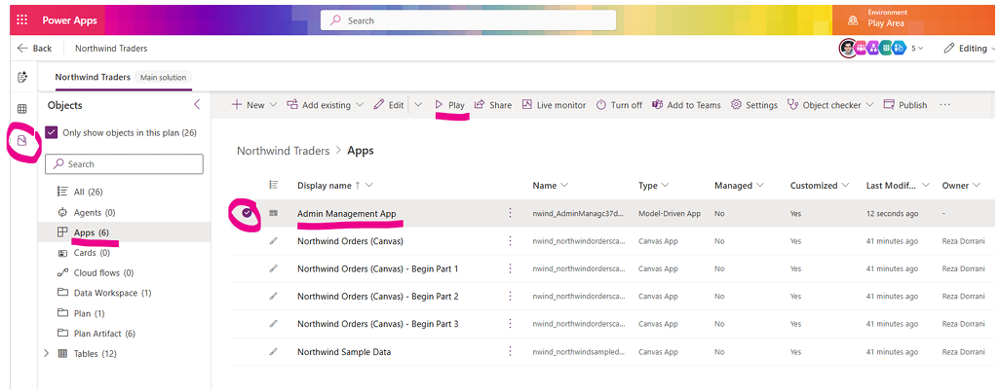  
Figure: Open the Admin Management app from the solution.

2. Go to **Orders** and enter the following prompt:

```text
List orders where payment was made via credit card in Chicago
```

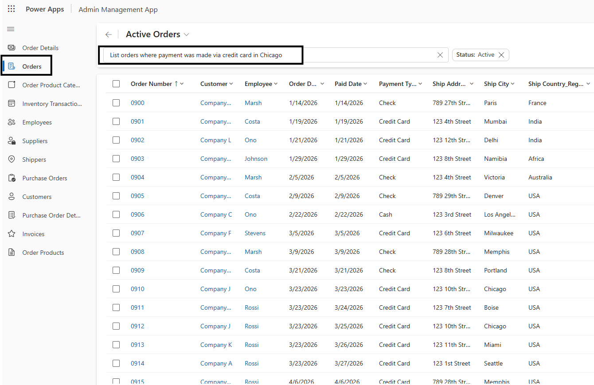  
Figure: Enter a natural language query in the Orders view.

3. Review the filtered results returned by the agent.

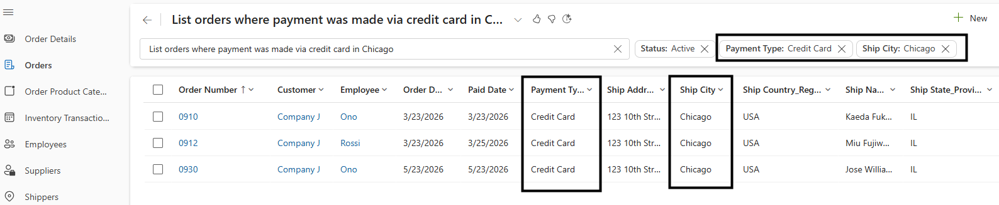  
Figure: Filtered order results returned by the data exploration agent.

4. Try the following prompt:

```text
Orders paid by check in last 10 months
```

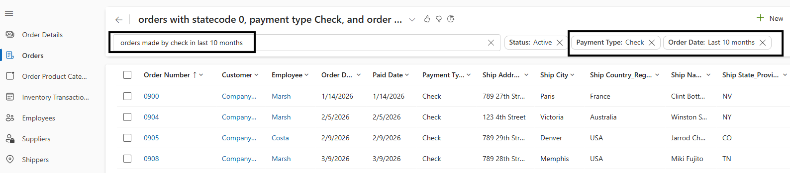  
Figure: Filtered results for orders paid by check in the last 10 months.

5. Try one more prompt:

```text
Orders paid by credit card - Sort them by payment date, latest on top
```

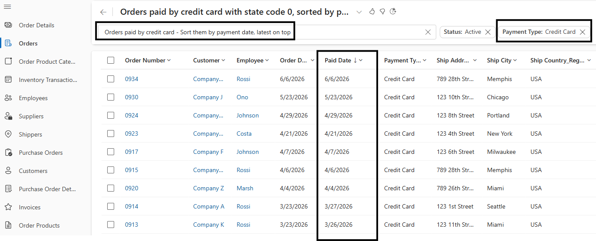  
Figure: Credit card orders sorted by payment date.

## Step 2: Use the data visualization agent

Use the data visualization agent to automatically generate charts based on the current data context.

1. Go back to **Orders** and click **Visualize**.

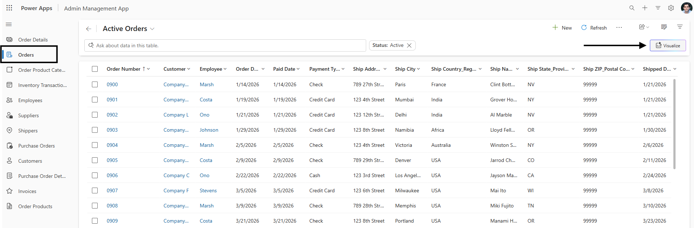  
Figure: Open the visualization experience from Orders.

2. Review the generated visual. In this example, a column chart shows order counts by city.

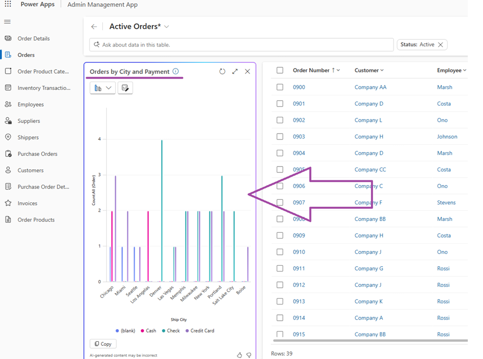  
Figure: Example visualization generated from the current Orders context.

3. Click chart options to change the chart type, aggregation, axes, and other properties.

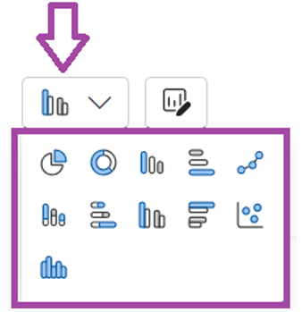  
Figure: Chart options for the generated visual.

4. Inspect available properties such as aggregation, X and Y axes, and formatting.

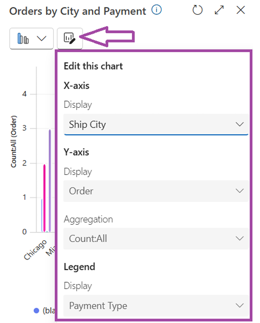  
Figure: Properties available for the generated chart.

5. Enter the following prompt to create a visualization:

```text
visualize number of orders and payment type as a pie chart
```

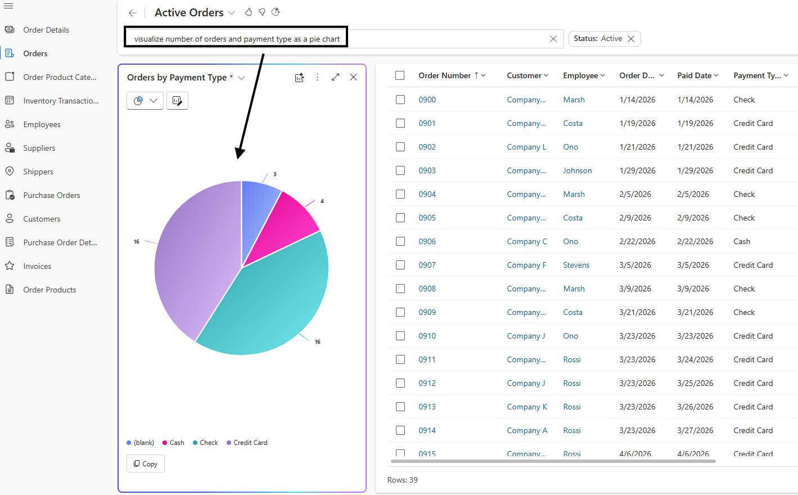  
Figure: Pie chart visualization created from a prompt.

## Step 3: Use the data entry agent

Use the data entry agent to assist with form completion by suggesting values and mapping unstructured input.

1. In **Orders**, click **New** to create a new order record.

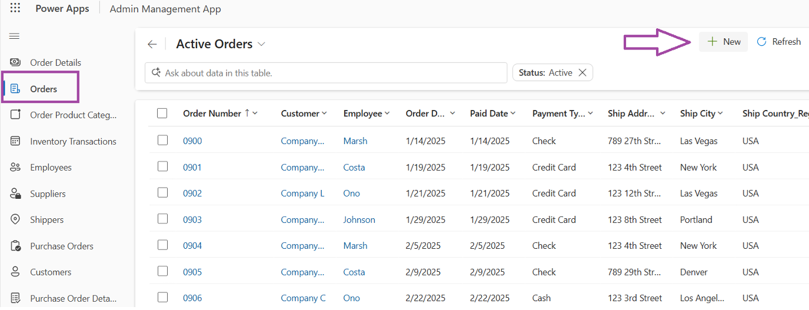  
Figure: New order form.

2. Click **Form assist** if the form fill pane is hidden.

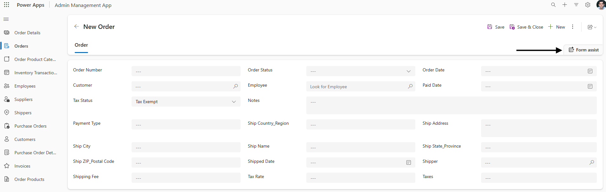  
Figure: Form assist pane on the order form.

3. Upload a file or paste clipboard data. The agent detects and maps information to form fields.

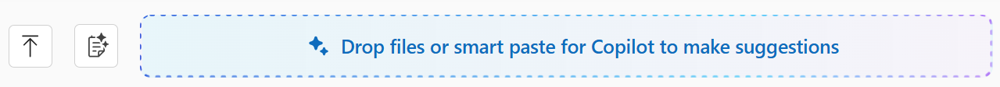  
Figure: Smart Paste and upload options for form fill assistance.

4. Copy and paste the following sample order text into Smart Paste:

```text
I want to place a new order for customer AA. The order needs to be placed today and the paid date to 2 weeks from now. This order is taxable. Please ship this order to 1 Microsoft Way, Redmond, WA, 98052. The order will be paid via check. Also add a note that this order is for a big private company.
```

You can also upload the image below to test mapping.

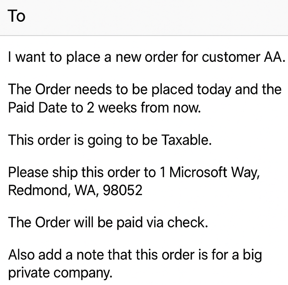  
Figure: Reference image for testing form fill mapping.

5. Review the suggestions and accept the values you want to apply.

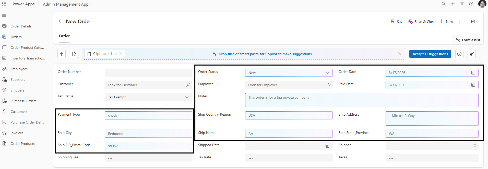  
Figure: Suggested field values returned by form fill assistance.

> [!NOTE]
> Limitations:
> - Suggestions appear only for fields on main and quick-create forms.
> - Supported types: text, numeric, choice, date.
> - Fields with column security are not supported.

6. Accept or cancel suggestions individually, or use the bulk accept experience.

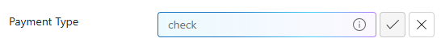  
Figure: Accept or reject suggestions individually.

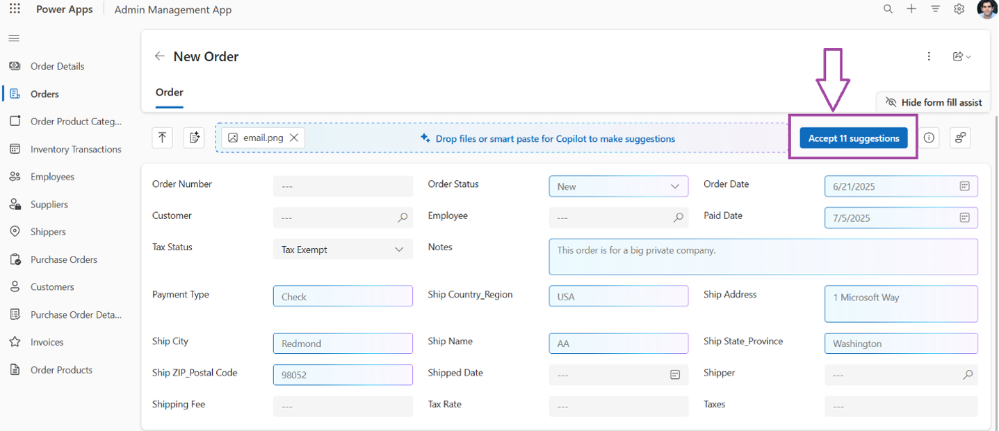  
Figure: Accept multiple suggested values on the form.

7. Review the populated form, update any remaining values, and click **Save and close**.

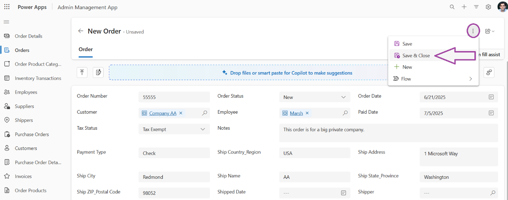  
Figure: Save the populated order record.

8. Confirm the order appears in the view.

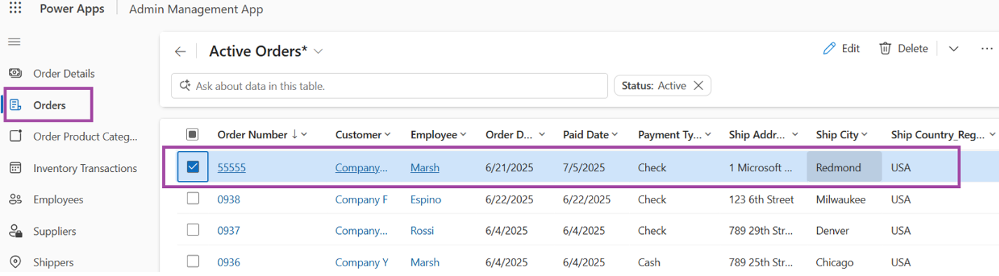  
Figure: Saved order displayed in the Orders view.

## Step 4: Configure the row summary agent

Use the row summary agent to generate concise record summaries for quick insight.

1. In the **Northwind Traders** solution, select **Objects** > **Tables** > **Order** > **Row summary**.

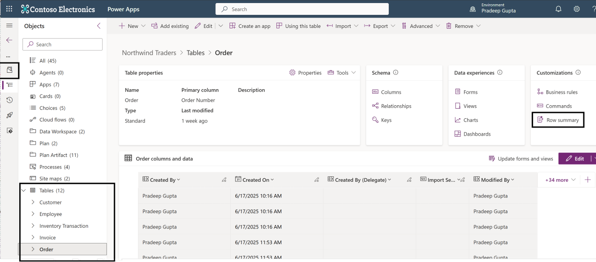  
Figure: Row summary configuration for the Order table.

2. Add prompt instructions for the summary. To include dynamic data, select **Add data**, choose the **Order** table, and add the columns you want included.

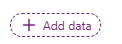  
Figure: Add data references to the row summary prompt.

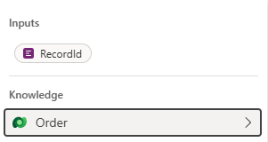  
Figure: Select columns to include in the prompt.

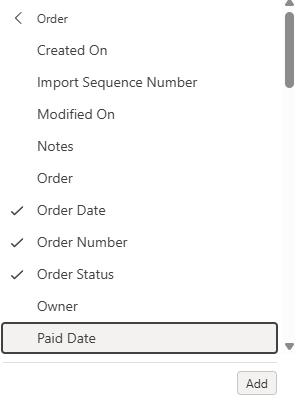  
Figure: Review the selected data references for the prompt.

3. Frame the prompt instructions for the summary.

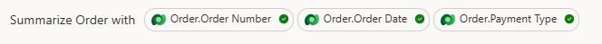  
Figure: Prompt instructions for the row summary agent.

4. Click **Test** to preview the generated response.

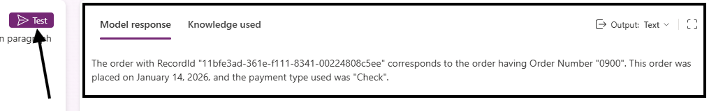  
Figure: Test the row summary prompt.

5. Add a related column to the instructions. Enter `/` or use **Add data**, then select **Orders** > **Customer (Customer)** > **First name**.

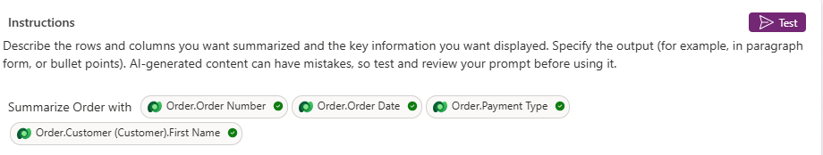  
Figure: Add a related customer field to the prompt.

6. Test the model response again.

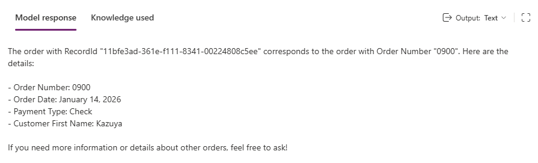  
Figure: Updated row summary response after adding related data.

7. Click **Apply to main forms** and **Close**.

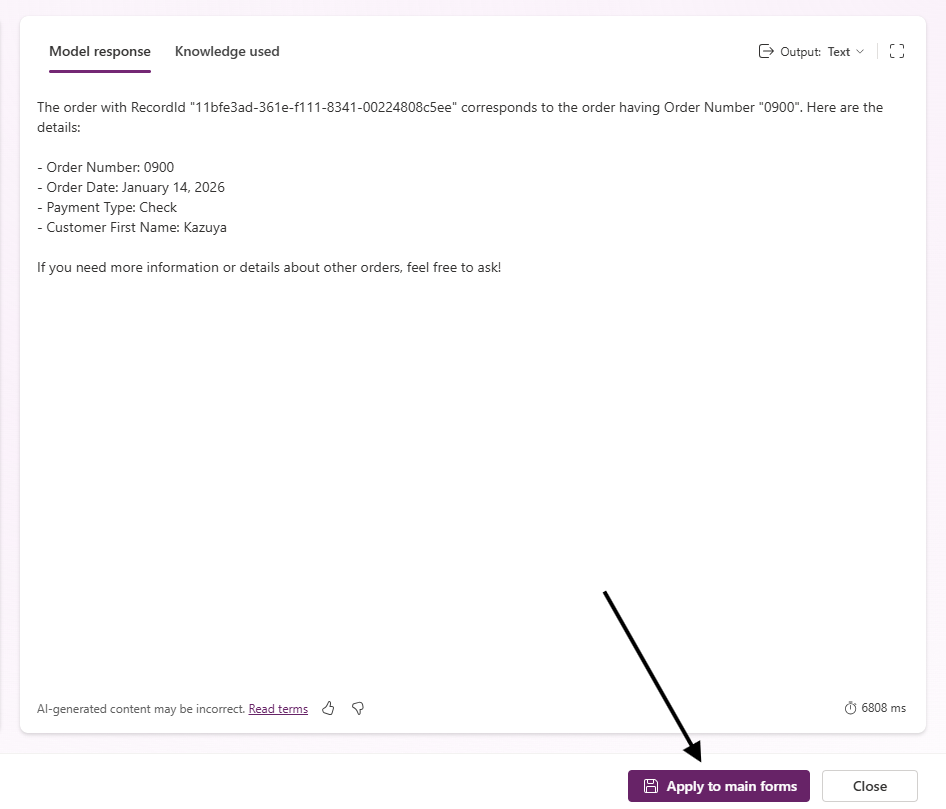  
Figure: Apply the row summary to main forms.

8. Play the **Admin Management** model-driven app.

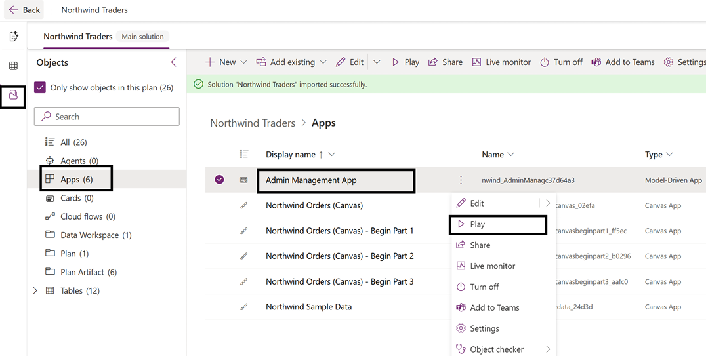  
Figure: Launch the Admin Management app.

9. In **Orders**, hover over the primary column and click the summary indicator.

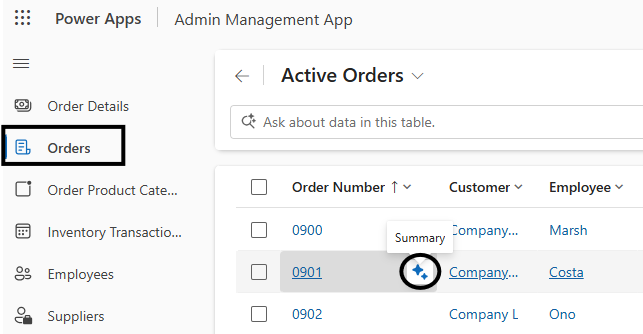  
Figure: Summary indicator in the Orders view.

10. Review the summary card for the selected record.

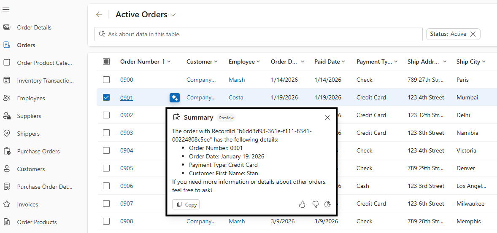  
Figure: Generated row summary card.

11. Open an order record and review the summary at the top of the form.

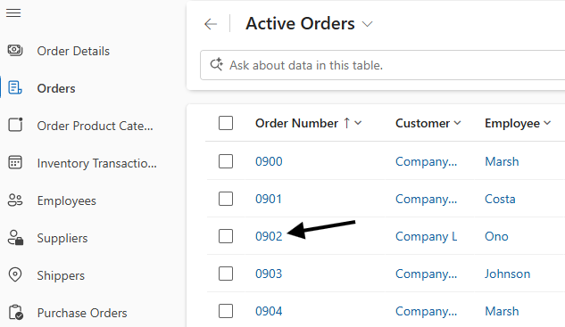  
Figure: Open an order form to review the summary.

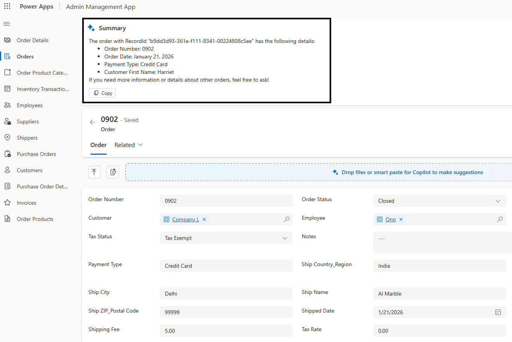  
Figure: Row summary displayed on the order form.

## Summary & best practices

- Use natural language queries and generated visuals to help users explore data without leaving the model-driven app.
- Review AI-generated suggestions and summaries before saving changes to production data.
- Keep shared environment and solution setup instructions in the central workshop prerequisite and solutions documentation.

## Lab completion

> [!TIP]
> You completed the in-app agents lab.
