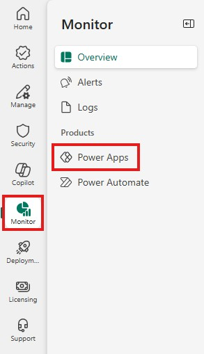
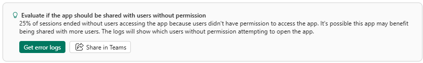
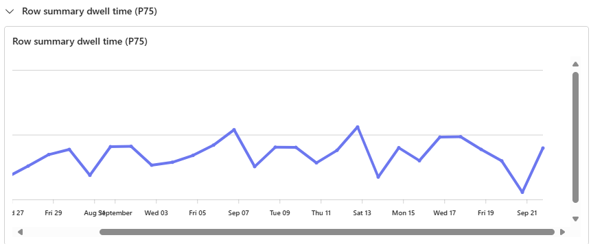
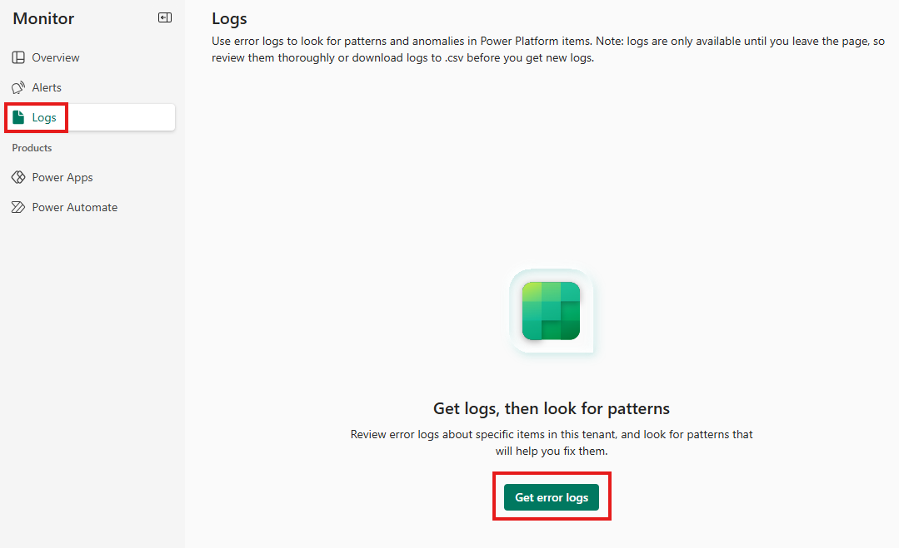
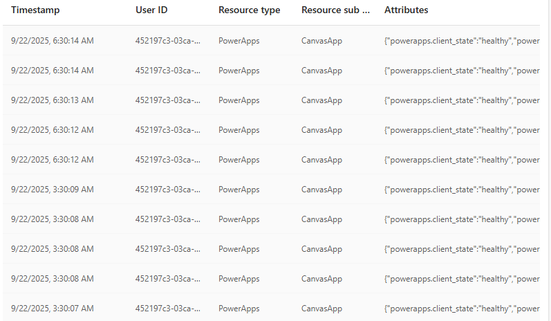
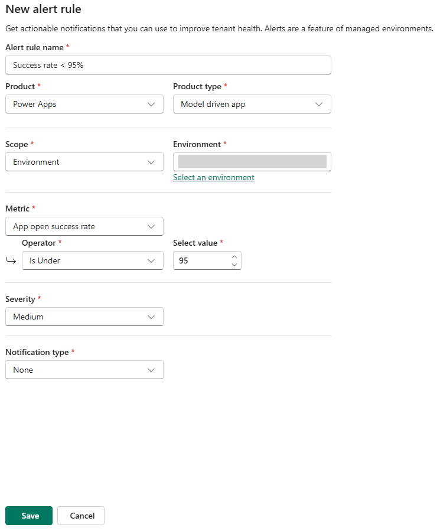

# Power Platform monitoring (Managed Operations) hands-on lab

## Overview
This hands-on lab shows how to use the Power Platform admin center (PPAC) **Monitor** experience to check app health, diagnose issues, and set up proactive alerts for a production canvas app and its supporting cloud flow.

## Estimated time
Approximately 15 minutes.

## Objectives
- Open **Monitor** for an environment.
- Interpret key health metrics (success rate, load time).
- Use recommendations to identify root causes.
- Create a success-rate alert rule (preview).

## Prerequisites
- Role: Power Platform admin, Power Platform Service Admin, Global Admin, or Environment System Administrator.
- Tenant-level analytics enabled.
- An environment (for example, `Your Name - Development`), preferably a Managed Environment.
- A canvas app named `Device Ordering App` (or similar) and a related cloud flow with recent runs (both successes and failures preferred).
- Modern browser (Microsoft Edge or Google Chrome recommended).

## Step 1: Open the Power Platform admin center
1. Go to: <https://admin.powerplatform.microsoft.com>.
2. Select **Monitor** from the left navigation.
    The overview screen shows primary metrics and outliers for your apps and flows.
    Note: These tiles may be empty if there has been no recent activity in the environment.
3. Select **Power Apps** under the products heading.  
  
Figure: Monitor and **Power Apps** menu selections.
4. From the Canvas app view, click your app to drill into its metrics.

## Step 2: Review recommendations
1. In the app detail view, find the Recommendations panel (appears with Managed Environment enabled).
2. Typical recommendations include:
   1. Launch failures caused by permission issues.
   2. `OnStart` latency due to multiple sequential data calls.
3. Note items that require remediation or follow-up.
  
Figure: Recommendations highlighting permission improvements.

## Step 3: Evaluate model-driven app dwell time
1. Return to the **Monitor** app list and select **Model-driven apps**.
2. Locate the row summary dwell time metric for the app you want to evaluate.
   1. Row summary dwell time indicates how long users actively view the AI-generated record summary.
   2. A higher value suggests users read the summary thoroughly; a very low value suggests they glance at it quickly or skip it.

      
    Figure: Logs showing row summary dwell time for a model-driven app.

## Step 4: View app logs
1. In **Monitor**, open **Logs** and click **Get error logs**.  
  
Figure: Click path to access error logs.
2. Select **Power Apps** from the product dropdown.
3. Choose your App name, set the Metric to **App open success rate**, keep the time range (for example, 7 days), and click **Get error logs**.
4. Review the timestamped log entries to identify common failure patterns and correlated errors.  
  
Figure: Error log showing recent failures and details.

## Step 5: Inspect related cloud flows
1. In **Monitor**, select **Power Automate** or the flows tab for the environment.
2. Filter by the cloud flow that supports your canvas app and review recent run history.
   1. Look for failed steps, long-running actions, and throttling errors.
   2. Expand individual runs to see input/output and connector responses.
3. If the flow shows frequent failures, open the cloud flow in the Power Automate portal and use run history and tracing to diagnose the root cause.

## Step 6: Create an alert rule (preview)
1. In **Monitor**, click **Alert rule**.
2. Configure the rule with values similar to:
   - Name: `Success Rate <95%`
   - Product: Power Apps
   - Product type: Model driven app
   - Scope: Environment
   - Environment: [Select your environment name]
   - Metric: App open success rate
   - Operator: Is Under; Value: 95%
   - Severity: Medium
   - Notification Type: None
    Note: In practice you would want to include a notification, but it is being omitted for overview purposes in this lab.
    
      
    Figure: Configuration for a new alert.
3. Click **Save**, wait for the rule to be created, and verify the rule is **On**.
4. Once the alert is created, alert conditions can be reviewed from the **Triggered Alerts** tab.

## Summary
You completed these tasks:
1. Identified a success-rate dip
2. Used recommendations to find permission and performance issues
3. Viewed error logs
4. Created an alert rule for proactive monitoring

## Tips
- 💡 Target ≥99% success rate for critical apps.
- Reduce startup latency: consolidate queries, use `Concurrent()`, and cache static data where appropriate.
- Recommendations appear (or expand) in Managed Environments.
- Use maker-side **Monitor** and **Live Monitor** (in Power Apps Studio) for maker-level debugging.
- Revisit alert thresholds after a week to establish a baseline.
