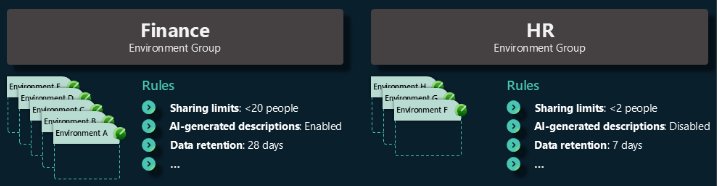
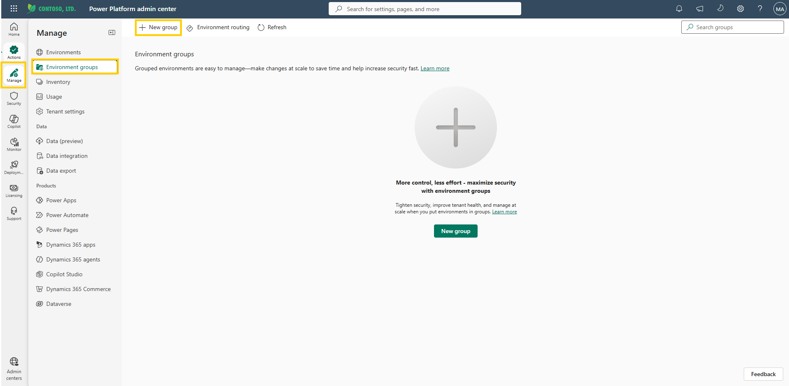
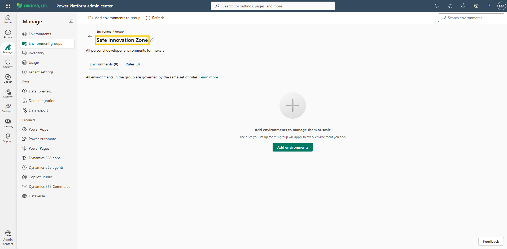

# Create an environment group

Every system needs a foundation, and yours is a single group of environments that share one set of rules. You'll build it in this lab and name it the **Safe Innovation Zone** — a governed home where makers can build freely while the same guardrails are applied to every environment in the group automatically. Before you can apply one rule across many environments, you need something to apply it to, so creating the group is your first move.

Environment groups are containers that help you organize and manage multiple Power Platform environments at once. Instead of configuring each environment individually, you can sort environments by business unit, project, location, or other criteria, and then apply governance to the whole group in one place. The Safe Innovation Zone you create here is one such group.

**Why use environment groups?**

- **Bulk governance.** Apply governance rules to thousands of environments simultaneously, eliminating manual repetition.
- **Consistency.** Every environment within the group adheres to the same settings.
- **Security.** Only tenant administrators can change group rules, and overrides are not permitted.

There are many ways to manage groups of environments within your tenant. For example, global organizations can create an environment group for each geographic region to ensure compliance with legal and regulatory requirements. You can also organize environment groups by department or other criteria.

  
Figure: Environment groups concept diagram showing grouped environments.

## Step 1: Create a new environment group

1. Sign in to the [Power Platform admin center](https://admin.powerplatform.microsoft.com/) using your lab environment administrator credentials.
2. In the left navigation pane, select **Manage**.
3. Select **Environment groups**.
4. In the command bar at the top, select **New group**.

     
   Figure: New group creation pane.

5. Enter a name for your group, for example:
   ```
   Safe Innovation Zone
   ```
6. Add a description, for example:
   ```
   All personal developer environments for makers
   ```
7. Select **Save**. The group is created, and the admin center opens it directly to its own page — your starting point for adding environments and configuring rules.

     
   Figure: Newly created environment group open to its own page in the admin center.

## What to secure

You now have a group, but an empty group protects no one. Securing the Safe Innovation Zone means deciding, one rule at a time, what makers can build, how far their work can spread, and how it can be accessed. The remaining labs configure each of these controls.

- **What can be built?** Decide which connectors, data sources, and features are available. By restricting access to trusted components, makers can safely experiment without risking sensitive data.
- **How broadly can things be shared?** The number of people who can access an app affects both risk and cost. Clear sharing limits ensure apps are only accessible to approved users.
- **How can it be accessed?** Control how apps are accessed, such as limiting usage to specific channels.


## Additional resources

- [Environment groups (Microsoft Learn)](https://learn.microsoft.com/en-us/power-platform/admin/environment-groups) — Overview of environment groups, use cases, and how to create and manage them.

## Next lab

Your group exists. Now give it its first rule — continue with [Configure connector policy](02-configure-connector-policy.md) to decide which connectors your makers can reach.
