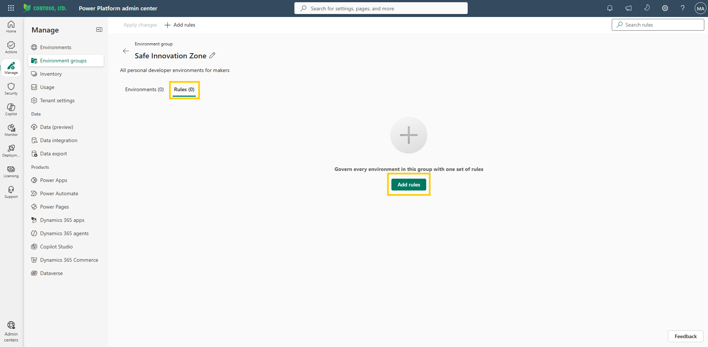
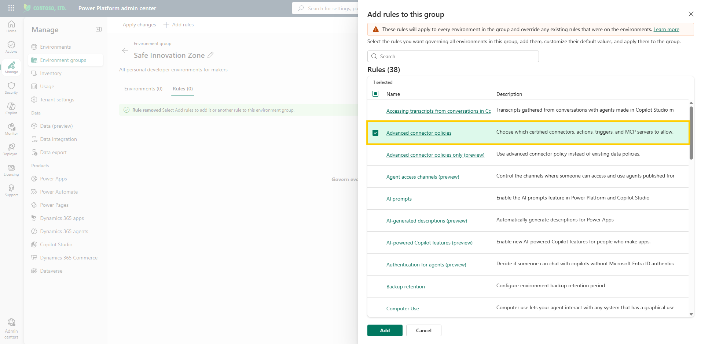
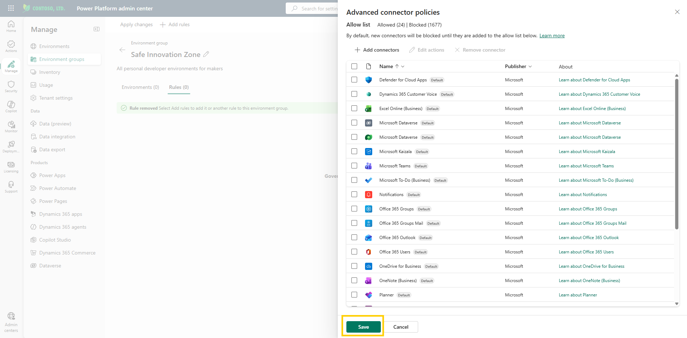
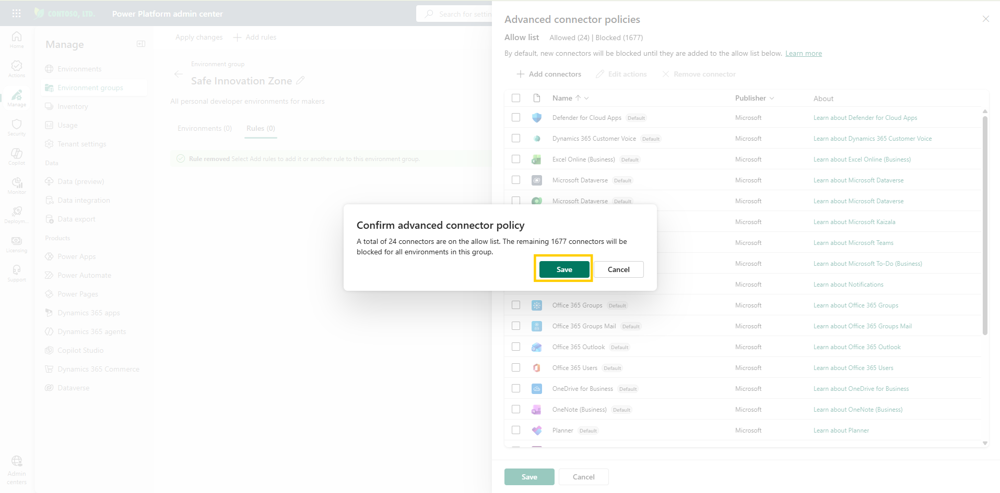
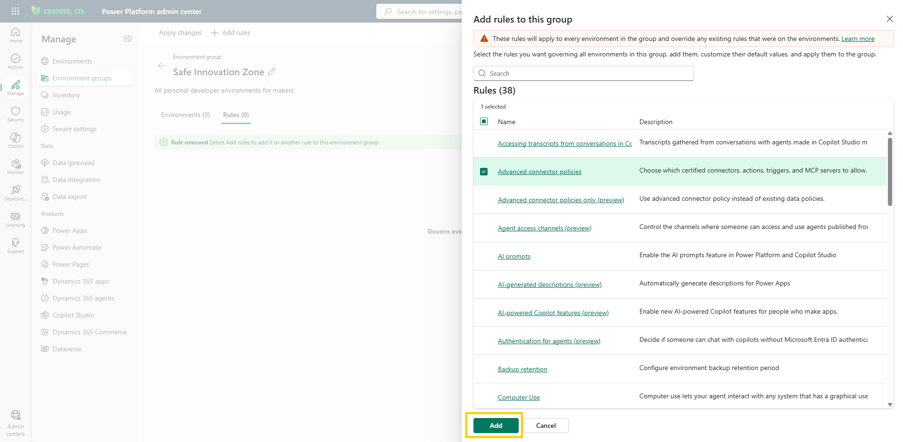
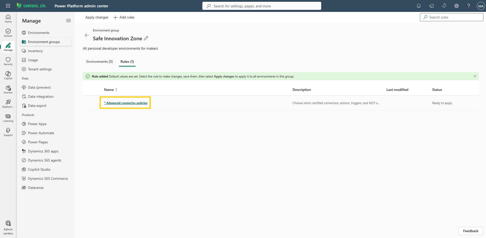

# Configure connector policy

The first guardrail answers the question *what can makers build?* — and that starts with the connectors they can reach. Every connector is a door to data, and the maker who overshared sensitive information walked through one of them. Here you decide which doors stay open.

Previously, Data Loss Prevention (DLP) policies were used to govern which connectors could be used in apps and flows. However, DLP policies had limitations — they could not block certain connectors, and the interaction between overlapping policies was difficult to reason about, often producing unexpected results for administrators.

Advanced connector policies within environment groups resolve these issues:

- One policy per group, eliminating overlap and confusion.
- A strict allowlist: every connector that is not explicitly allowed is blocked — including any connectors Microsoft adds to the platform later.
- Ability to block any connector, including those previously considered "unblockable" by DLP policies.
- Predictable, clear results — no more relying on user complaints to discover issues.

> 📝 Advanced connector policies currently govern **certified connectors only**. Custom connectors and HTTP connectors aren't supported yet and still need classic data policies (DLP) in the meantime. In a group of personal developer environments this rarely matters, but keep it in mind for production governance.

## Step 1: Configure the advanced connector policy

1. From the previous lab, you should already be inside the **Safe Innovation Zone** group. Select the **Rules** tab, and then select **Add rules** in the command bar. (If you've signed out, sign back in [here](https://admin.powerplatform.microsoft.com/), then select **Manage** > **Environment groups** and open the **Safe Innovation Zone** group.)

     
   Figure: Rules tab showing the Add rules command.

2. In the rule selection pane, locate **Advanced connector policies** and click on it.

     
   Figure: Rule selection pane with Advanced connector policies.

   > 📝 You can select multiple rules here and configure them in one pass. In this module you add them one at a time, so each guardrail and its effect stay clear.

3. By default, the connectors that classic DLP policies could never block — core Microsoft connectors such as Office 365 — are preloaded as *allowed*. These are low risk and essential for productivity. Keep these enabled. Note that under advanced connector policies even these connectors *can* be blocked if your organization requires it — no connector is off-limits anymore. You can add or remove connectors at any point from this same screen. MCP servers also appear alongside the connectors here and can be blocked in their entirety.

     
   Figure: Advanced connector policy pane with the default connectors allowed.

4. Select **Save**. A confirmation message appears warning you about the impact of the change: once applied, this policy is a strict allowlist — every connector not on the allowed list is blocked across the whole group. Select **Save** again to confirm.

     
   Figure: Confirmation message warning about the impact of the policy.

5. You're returned to the rule selection pane. To activate the rule for the group, select **Add**.

     
   Figure: Rule selection pane with the Add command.

6. Back on the **Rules** tab, a confirmation ribbon appears and the newly added rule is highlighted with an asterisk (*) next to it, indicating it has changes that haven't been applied to the environments in the group yet.

     
   Figure: Rules tab showing the added rule with an asterisk and a confirmation ribbon.

> 💡 Do not select **Apply changes** yet. Configure all rules first (connector policy, sharing limits, and additional rules), then apply them together. This avoids multiple apply cycles and ensures all changes take effect at once.

> 📝 After applying the changes, allow some time for them to propagate to all environments in the group before testing them.

## Additional resources

- [Advanced connector policies (Microsoft Learn)](https://learn.microsoft.com/en-us/power-platform/admin/advanced-connector-policies) — How advanced connector policies in environment groups control which connectors makers can use, including mixed mode vs. ACP-only mode and MCP server management.

## Next lab

You have decided what makers can build with. Next, decide how far their work can travel — continue with [Configure sharing limits](03-configure-sharing-limits.md).
