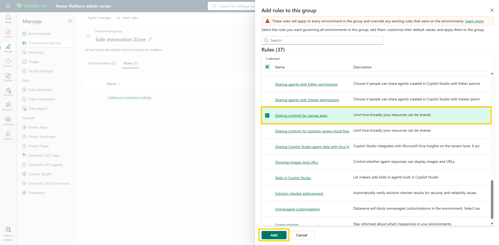
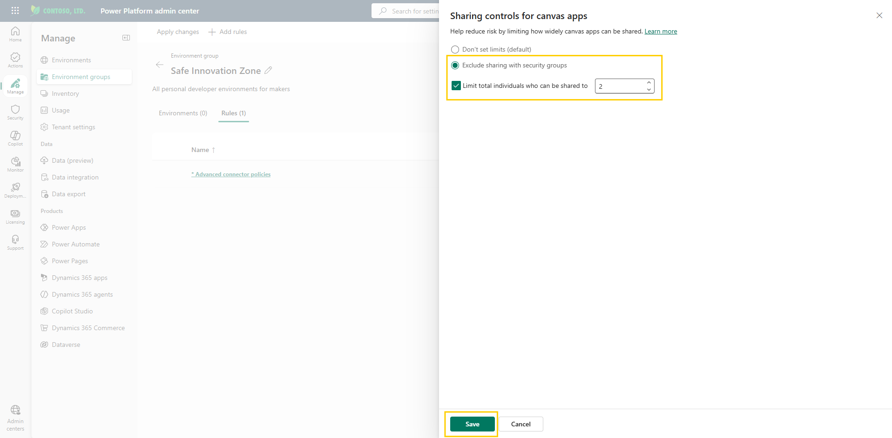

# Configure sharing limits

This is the rule that addresses the incident that started it all. A maker shared an app full of sensitive data with far more people than intended, and no one noticed until afterward. Sharing limits make that mistake impossible by capping how far any single app can spread — before it spreads.

Setting strict sharing limits is important to maintaining security and controlling costs. By restricting access, you ensure that apps within the Safe Innovation Zone remain available only to the right individuals, preventing broad or accidental sharing.

> 📝 Sharing limits are enforced when users try to share an app. They don't affect users who already have access to an app before the rule takes effect. However, if an app is out of compliance with the new limits, only unsharing is allowed until the app is compliant again.

## Step 1: Set sharing controls for canvas apps

1. You should still be on the **Rules** tab of the **Safe Innovation Zone** group from the previous lab. If not, open the [Power Platform admin center](https://admin.powerplatform.microsoft.com/), select **Manage** > **Environment groups**, open the **Safe Innovation Zone** group, and select the **Rules** tab.
2. Select **Add rules** in the command bar.
3. In the rule selection pane, locate the **Sharing controls for canvas apps** rule and click on it.

     
   Figure: Sharing controls for canvas apps rule in the rule selection pane.

4. Select **Exclude sharing with security groups**. This limits sharing to specific individuals rather than broad groups.
5. Check **Limit total individuals who can be shared to** and set the value to `2`. This intentionally keeps audiences small. Keep in mind that this number includes the canvas app owner too, which means in this case that the owner can share the app with only one further individual.

     
   Figure: Sharing controls configuration with a limit of 2 individuals.

6. Select **Save**. You're returned to the rule selection pane. To activate the rule for the group, select **Add**.
7. Back on the **Rules** tab, the rule appears with an asterisk (*) next to it, indicating it has changes that haven't been applied to the environments in the group yet.

> 💡 Do not select **Apply changes** yet if you plan to configure additional rules. Apply all changes together after completing [Configure additional rules](04-configure-additional-rules.md).

## Additional resources

- [Limit sharing (Microsoft Learn)](https://learn.microsoft.com/en-us/power-platform/admin/managed-environment-sharing-limits) — How to restrict canvas app sharing with security groups and cap the number of individuals an app can be shared with.

## Next lab

The core guardrails are in place. Now round out the group with a few supporting rules — then apply them all at once — in [Configure additional rules](04-configure-additional-rules.md).
