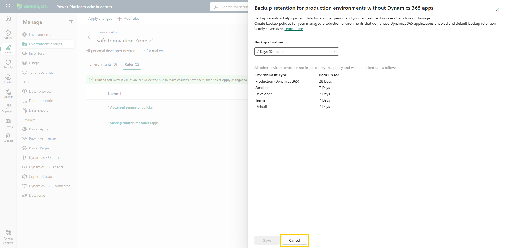
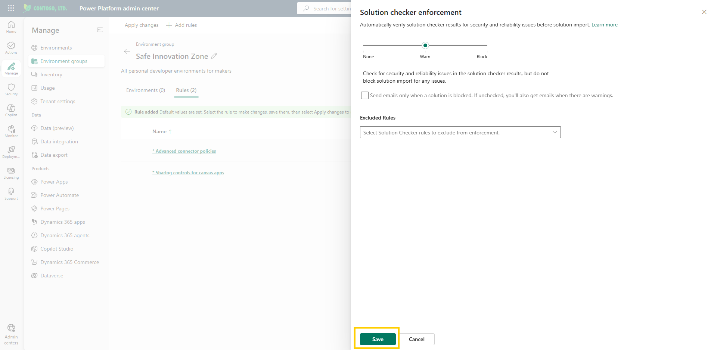
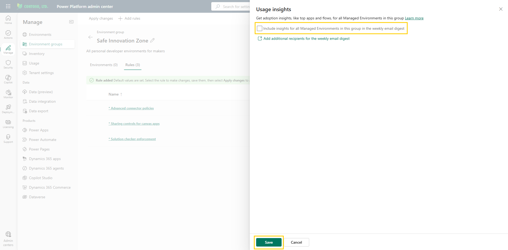
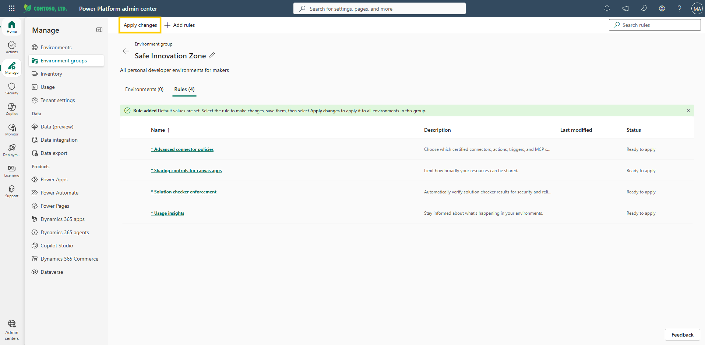
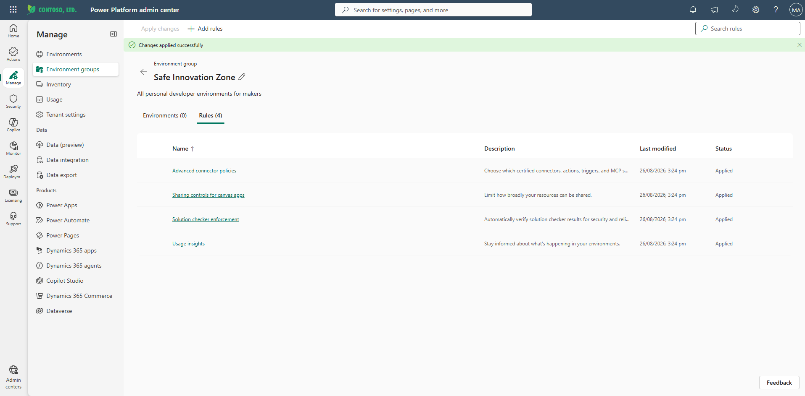

# Configure additional rules

You have configured the headline guardrails one at a time, but so far none of them are live. This lab adds the finishing rules — backup retention, solution checker, usage insights — and then does the thing that makes all of your work real: a single **Apply changes** that pushes every rule out across the group at once.

This lab covers optional rules for the Safe Innovation Zone and the final step of applying all rules across environments.

> 💡 The rules below are listed in alphabetical order to make them easier to find when scrolling through the rules list in the admin center. You can configure all of them or skip to [Step 4: Apply all changes](#step-4-apply-all-changes) if you only need to apply the rules from previous labs.

> 🔍 These labs cover the rules we consider most relevant to organizations, but they are only a subset of what environment groups can govern. While you're in the rule selection pane, take a moment to explore the other available rules — for example, generative AI settings, AI prompts, release channel, unmanaged customizations, Power Apps component framework, and content security policy. See [Rules for environment groups](https://learn.microsoft.com/en-us/power-platform/admin/environment-groups-rules) for the full list.

## Step 1: Backup retention

The backup retention period defines how long Dataverse data is kept in backups. Since this group only contains developer environments without production data, keep the 7-day default.

> 📝 For groups with production environments, you could increase the retention period up to a maximum of 28 days depending on data criticality. The extended retention (7, 14, 21, or 28 days) applies to production managed environments only.

1. You should still be on the **Rules** tab of the **Safe Innovation Zone** group from the previous lab. If not, open the [Power Platform admin center](https://admin.powerplatform.microsoft.com/), select **Manage** > **Environment groups**, open the **Safe Innovation Zone** group, and select the **Rules** tab.
2. Select **Add rules** in the command bar, then locate and select the **Backup retention** rule in the rule selection pane to open its configuration panel.
3. Confirm that the **Backup duration** is set to **7 days (default)**.

     
   Figure: Backup retention rule configuration panel.

4. Since the default is already 7 days, the **Save** button is disabled because no change was made. Select **Cancel** to close the panel.

## Step 2: Solution checker

This environment group is for personal productivity and early development, so it is normal for makers to import solutions with errors. To avoid blockers or false warnings, keep the solution checker set to *Warn only*.

> 📝 If this environment group contained production environments, it would be important to prevent imports with errors by setting the solution checker to **Block** mode. In Warn mode, the import continues even when highly critical issues are found — the maker is warned and a summary email is sent. In Block mode, the import is canceled before any changes reach the environment.

1. In the rule selection pane, select the **Solution checker enforcement** rule to open its configuration panel.
2. Confirm that the slider is set to **Warn**.
3. Select **Save**, and then select **Add** to activate the rule. Even though **Warn** is the default, adding the rule applies it so it is enforced consistently across the group.

     
   Figure: Solution checker enforcement set to Warn.

> 💡 If certain solution checker rules aren't relevant for your organization — for example, a rule that would take significant effort to fix across existing solutions — you can exclude them from enforcement using the **Excluded Rules** dropdown in the configuration panel. The remaining rules stay enforced. Keep in mind that only critical severity rules block a solution from being imported.

## Step 3: Usage insights

These environments in the **Safe Innovation Zone** do not contain enterprise applications and are not highly utilized, so you may want to exclude them from the weekly email digest.

1. In the rule selection pane, select the **Usage insights** rule to open its configuration panel.
2. Untick the checkbox in the configuration panel.
3. Leave the checkbox unticked, select **Save**, and then select **Add** to activate the rule, excluding these environments from the weekly email digest.

     
   Figure: Usage insights rule with the checkbox unticked.

## Step 4: Apply all changes

Now that all rules have been configured (connector policy, sharing limits, and additional rules), apply them so all changes take effect at once.

1. Select **Apply changes** in the command bar.

     
   Figure: Apply changes command in the command bar.

2. Wait for the confirmation message indicating that your rules have been successfully applied to all environments in the group.

     
   Figure: Confirmation that rules were applied to all environments.

> ✅ Rules that have unapplied changes appear in **bold** with an asterisk (*) next to them. After applying the changes, all asterisks should be cleared.

> 📝 Allow some time for the changes to propagate to all environments in the group before testing them.

## Additional resources

- [Rules for environment groups (Microsoft Learn)](https://learn.microsoft.com/en-us/power-platform/admin/environment-groups-rules) — The full set of governance rules you can apply to an environment group, including backup retention, solution checker, and usage insights.

## Next lab

The guardrails are live. But makers won't see the rules — they'll just hit them. Give them context before they do by greeting them on arrival in [Configure maker welcome](05-configure-maker-welcome.md).
