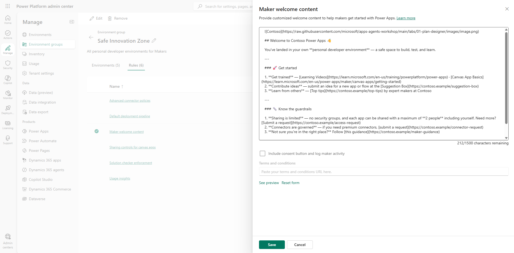
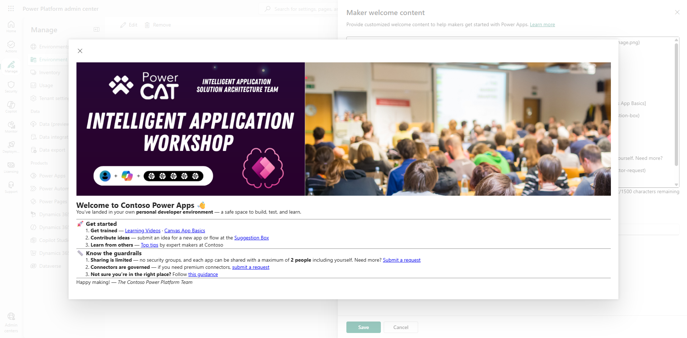

# Configure maker welcome content

Guardrails that arrive with no explanation feel like friction. The fix is to greet makers the moment they start building, so the rules read as guidance rather than obstacles. A welcome message is how you turn governance into onboarding — and how you answer the most common questions before they ever reach your inbox.

Embedding best practices, training resources, and governance reminders directly where makers work — in Power Apps — helps IT scale guidance without repeatedly answering the same questions. Every employee receives a personalized onboarding experience as soon as they begin building.

- **Educate at scale.** Instantly share training resources and company standards.
- **Reinforce governance.** Remind makers about sharing limits, connector usage, and policies.
- **Enable self-service.** Provide links for requests and support, reducing emails and meetings.

## Step 1: Configure the maker welcome message

1. You should still be on the **Rules** tab of the **Safe Innovation Zone** group from the previous lab. If not, open the [Power Platform admin center](https://admin.powerplatform.microsoft.com/), select **Manage** > **Environment groups**, open the **Safe Innovation Zone** group, and select the **Rules** tab.
2. Select **Add rules** in the command bar, then locate and select the **Maker welcome content** rule in the rule selection pane to open its configuration panel.
3. Copy and paste the following sample markup into the text box:

   ```
   

   ## Welcome to Contoso Power Apps 👋

   You've landed in your own **personal developer environment** — a safe space to build, test, and learn.

   ---

   ### 🚀 Get started

   1. **Get trained** — [Learning Videos](https://learn.microsoft.com/en-us/training/powerplatform/power-apps) · [Canvas App Basics](https://learn.microsoft.com/en-us/power-apps/maker/canvas-apps/getting-started).
   2. **Contribute ideas** — submit an idea for a new app or flow at the [Suggestion Box](https://contoso.example/suggestion-box).
   3. **Learn from others** — [Top tips](https://contoso.example/top-tips) by expert makers at Contoso.

   ---

   ### 📏 Know the guardrails

   1. **Sharing is limited** — no security groups, and each app can be shared with a maximum of **2 people** including yourself. Need more? [Submit a request](https://contoso.example/access-request).
   2. **Connectors are governed** — if you need premium connectors, [submit a request](https://contoso.example/connector-request).
   3. **Not sure you're in the right place?** Follow [this guidance](https://contoso.example/maker-guidance).

   ---

   Happy making! — *The Contoso Power Platform Team*
   ```

   > 📝 This is sample content using the Contoso brand. Replace the company name, logo URL, and the `contoso.example` placeholder links with your organization's actual resources before deploying to production.

     
   Figure: Sample welcome content markup entered in the text box.

4. Select **See preview** to view what makers will see in Power Apps.

     
   Figure: Preview of the maker welcome content.

5. Select **Save**, and then select **Add** to activate the rule.
6. Back on the **Rules** tab, select **Apply changes** in the command bar and wait for the confirmation that the rule has been applied to all environments in the group.

> 📝 Under the welcome message, makers can choose not to see it again on future visits, and can always find it later under **Learn > From your org**. If an admin updates the welcome content and reapplies the group rules, makers may see the refreshed message again on their next visit.

> 💡 The configuration panel also lets you require makers to acknowledge your usage policies before they start building: check **Include consent button and log maker activity** and paste your organization's terms and conditions URL into the **Terms and conditions** field. This turns the welcome experience into a lightweight acknowledgment gate.

> 📝 The welcome content text box is limited to 1,500 characters, so keep your message focused — link out to internal sites for anything longer. A **Reset form** option is available next to **See preview** if you want to start over.

## Additional resources

- [Enable maker welcome content (Microsoft Learn)](https://learn.microsoft.com/en-us/power-platform/admin/welcome-content) — How to add customized welcome content that greets makers when they sign in to Power Apps, including sample Markdown.

## Next lab

The group is fully equipped — rules, guidance, and all. But makers still land in the default environment by default. The last piece is to send them somewhere better. Continue with [Configure environment routing](06-configure-environment-routing.md).
