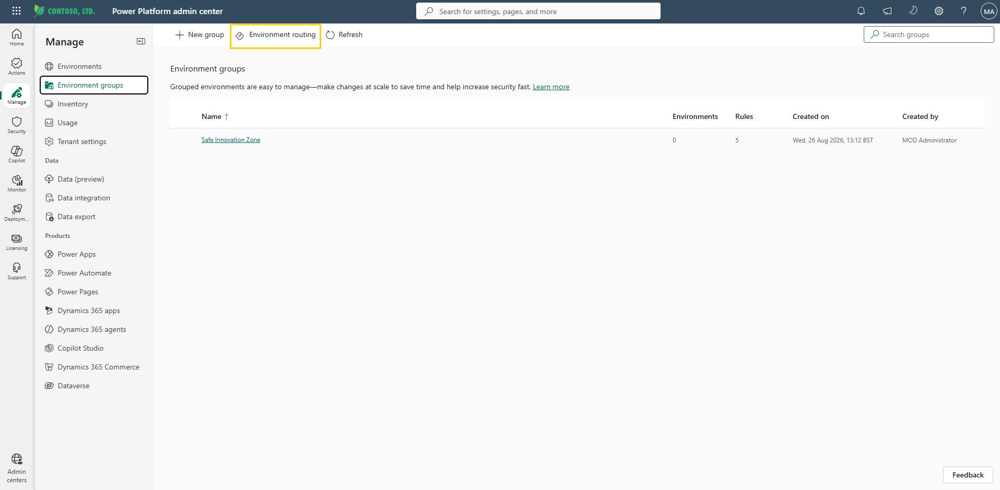
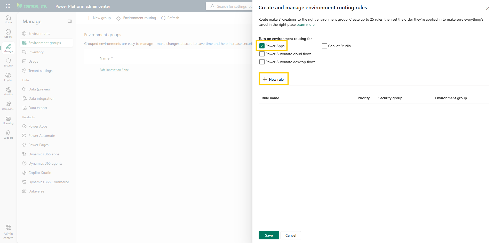
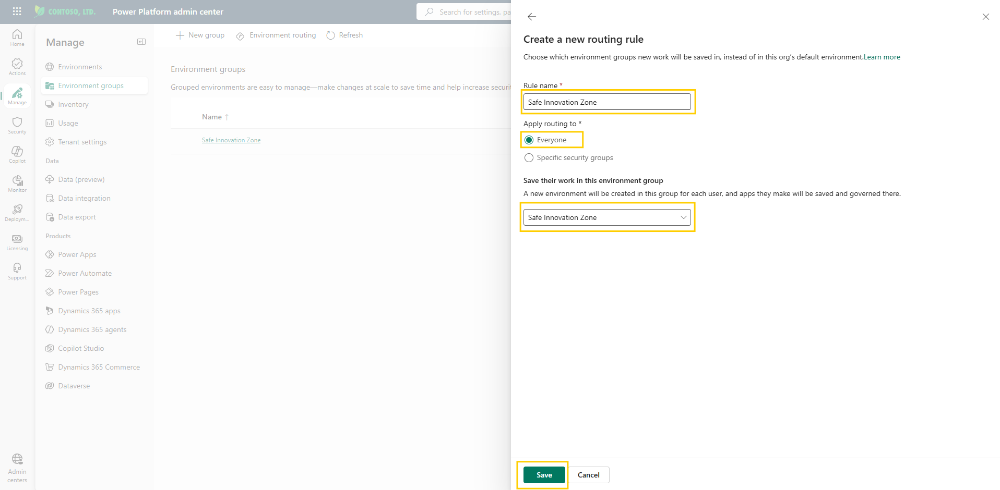
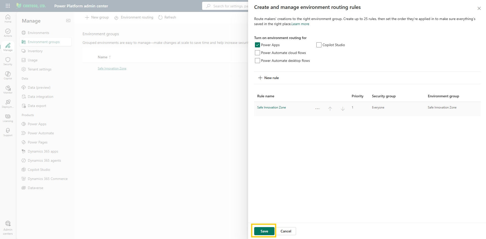

# Configure environment routing

You have built a well-governed group, but it stays empty until makers actually land in it. This is the switch that sends every new maker to the right place. Instead of everyone starting in the shared default environment, routing gives each maker their own personal developer environment inside the Safe Innovation Zone — automatically, with no request to file and no action from IT.

After creating your Safe Innovation Zone, the next step is to ensure that new makers begin their work within this environment rather than the default one. Environment routing automatically provisions a personal developer environment for each maker and places it in the specified environment group.

> 📝 Environment routing is available for Power Apps, Copilot Studio, and Power Automate (both cloud flows and desktop flows). This lab focuses on Power Apps. You can extend routing to other products using the same steps.

## Step 1: Create a routing rule

1. You should still be in the **Power Platform admin center** from the previous lab. Select **Manage** > **Environment groups**. (If you've signed out, sign back in [here](https://admin.powerplatform.microsoft.com/) first.)
2. At the top of the page, select **Environment routing**.

     
   Figure: Environment routing command at the top of the Environment groups page.

   > 📝 The same routing configuration is also reachable via **Manage** > **Tenant settings** > **Environment routing** — both paths open the same pane. Environment routing is a tenant-level setting, so wherever you open it from, the rules you create apply tenant-wide.

3. In the **Create and manage environment routing rules** pane, under **Turn on environment routing for**, check **Power Apps**. Notice that Copilot Studio, Power Automate cloud flows, and Power Automate desktop flows are available as separate checkboxes.

   > 📝 Checking a product box alone doesn't route anyone. Routing only takes effect once at least one rule exists — if no rule is created, environment routing stays switched off.

4. Select **+ New rule**.

     
   Figure: Turn on environment routing for Power Apps and create a new rule.
5. Complete the following fields:
   - **Name:** `Safe Innovation Zone`
   - **Apply routing to:** `Everyone` (select specific security groups if you want to create multiple routing rules for different environment groups)
   - **Save work in:** `Safe Innovation Zone`
6. Select **Save**.

     
   Figure: Environment routing rule configuration dialog.

7. The rule appears in the list with its **Priority**, **Security group**, and **Environment group** columns. Review it, and then select **Save** at the bottom of the pane to activate routing.

     
   Figure: Environment routing saved successfully.

> 💡 When you define multiple routing rules (up to 25), their order matters: when a maker accesses a portal, the rules are evaluated top to bottom and the first matching rule is applied. Use the arrow icons to change rule priority. If no rule matches — or routing isn't turned on — the maker lands in the default environment. With the single **Everyone** rule you created here, every maker is routed to the Safe Innovation Zone.

> 📝 A few useful facts about routed environments: makers are routed to their own existing developer environment if they already have one they own; newly created environments arrive with the group's rules applied from the start; and makers get the admin role in their environment. If environment creation fails for any reason, the maker is routed to the default environment instead.

## Additional resources

- [Environment routing (Microsoft Learn)](https://learn.microsoft.com/en-us/power-platform/admin/default-environment-routing) — How environment routing automatically directs makers into their own personal developer environments within an environment group, including multi-rule routing.

## Next lab

Everything is configured — but configured isn't the same as working. Step into a maker's shoes and prove the guardrails actually hold in [Test sharing limits](07-test-sharing-limits.md).
