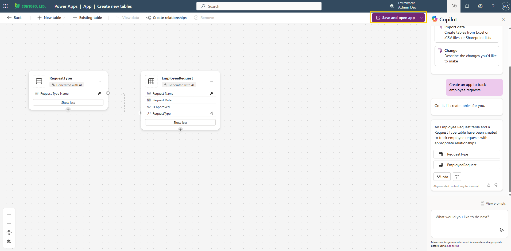
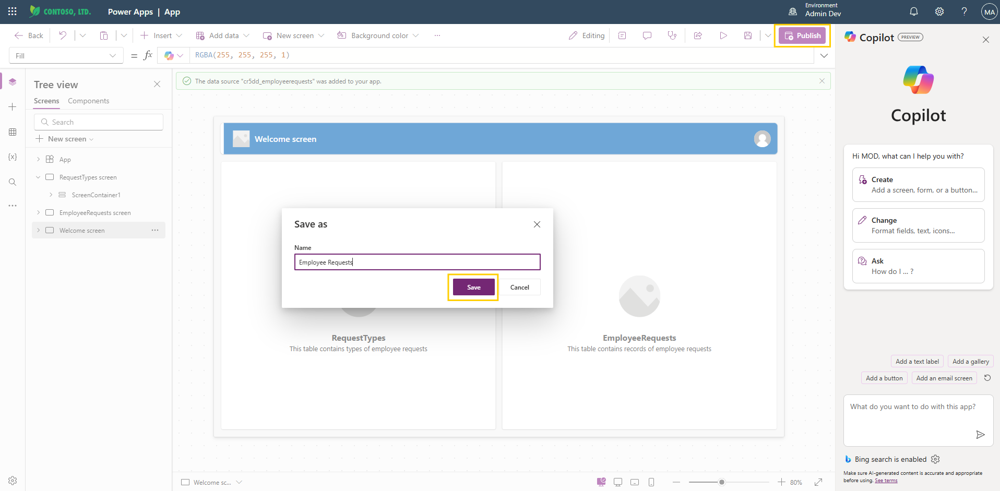
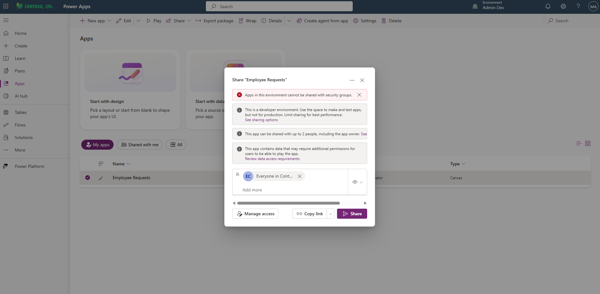
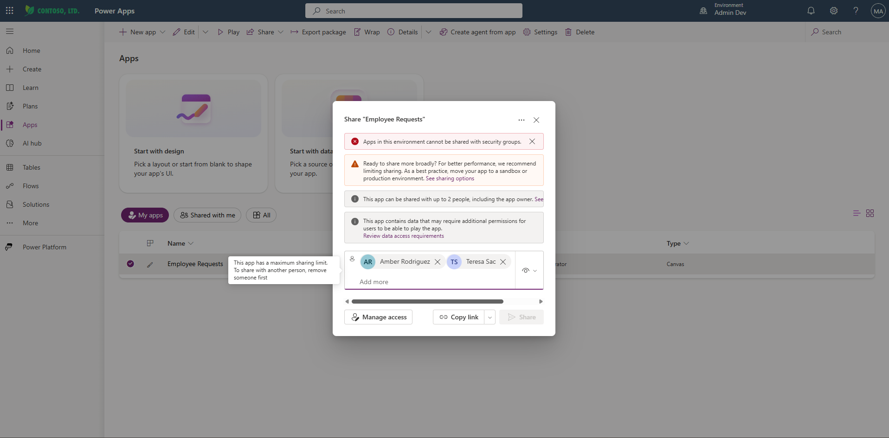

# Test sharing limits

This is where the work pays off. You now switch sides — from the Power Platform Lead who built the guardrails to a maker who runs straight into them. You provision a personal environment, build an app, and then deliberately try to overshare it, exactly the way the incident happened. If your group is doing its job, the platform stops you before the app can spread.

Once the Safe Innovation Zone is configured with environment routing, you can verify that sharing limits and routing work as expected.

> ⚠️ It may take up to an hour for the new sharing limits to become active. You can complete this test at the end of the module if needed.

## Step 1: Verify environment routing

Since environment routing is set to **Everyone**, you can test in your current browser session — a private or incognito window is not required.

1. Navigate to <https://make.powerapps.com> using the credentials of any user in your lab environment.
2. Wait a few moments as your personal developer environment is provisioned.
3. Once provisioning is complete, verify that you are in the correct environment — your username should appear, and the environment name is visible in the top-right corner of the Power Apps portal.
4. On your first visit, you may see the Power Apps welcome message. On subsequent visits, you see the maker welcome message you configured in [Configure maker welcome](05-configure-maker-welcome.md).

> 💡 If you are prompted to select a country/region on first sign-in, complete that step before proceeding.

## Step 2: Create an app and attempt to overshare

1. From the left navigation pane, select **Create**.
2. In the **Start with Copilot** section, enter the following prompt and select **Generate**:

   ```
   Create an app to track employee requests
   ```

   > 💡 If the Copilot option is not visible on the home screen, go to **Apps** > **New app** > **Start with Copilot**.

3. Wait for Copilot to generate the tables. Once the tables appear, select **Save and open app** in the top-right corner. A dialog might appear to confirm.

     
   Figure: Copilot generating tables for a new app.

4. When the app opens in the studio, select **Skip** on the welcome dialog.
5. Select **Publish** (the icon at the top right corner of the screen). You're prompted to save the app first — enter a name for your app, for example:

   ```
   Employee Requests
   ```

6. Select **Save**, then select **Publish this version** to confirm.

     
   Figure: Save dialog for naming the app.

## Step 3: Verify sharing restrictions

1. Close the studio to return to Power Apps home. Navigate to **Apps** in the left menu.

   > 💡 It may take a couple of minutes for the newly published app to appear under **My Apps**. Refresh the page if you don't see it right away.

2. Select the vertical ellipsis (**...**) next to your app and select **Share**.

3. In the Share window, try adding a security group (for example, a group such as `Everyone in <Organization name>`) and click **Share**.
4. Observe that sharing with security groups is blocked for environments within the Safe Innovation Zone — a message appears: "Apps in this environment cannot be shared with security groups."

     
   Figure: Sharing with security groups is blocked.

5. Try adding one user instead (any existing user in your tenant). Notice that the info banner now states: "This app can be shared with up to 2 people, including the app owner." The group rule you configured in [Configure sharing limits](03-configure-sharing-limits.md) is announcing itself before you can overshare.
6. Attempt to add a second user using the **Add more** field.
7. Notice the tooltip: "This app has a maximum sharing limit. To share with another person, remove someone first" — and that the **Share** button is greyed out, confirming the sharing limit of 2 people (including the app owner) is enforced.

     
   Figure: Sharing limit tooltip showing maximum reached.

8. Remove the second user, select **Share**, and wait for the changes to be applied. A confirmation dialog appears: "You've shared 'Employee Requests' with" the user you selected. Note that the person isn't notified automatically — you can use **Copy link** to send them the app link yourself.
9. Close the dialog.

> ✅ The guardrails held. Makers are routed to their own personal developer environment, sharing is capped at 2 individuals, and security group sharing is blocked — which means the oversharing incident that started this module can no longer happen here.

## Additional resources

- [Limit sharing (Microsoft Learn)](https://learn.microsoft.com/en-us/power-platform/admin/managed-environment-sharing-limits) — How sharing limits restrict canvas app sharing with security groups and cap the number of individuals an app can be shared with.

## Next lab

Makers can now build safely. The next question is how their work moves to production without becoming a new source of risk. Standardize that path in [Configure default pipeline](08-configure-default-pipeline.md).
