# Configure default pipeline

A maker's app is safe inside its developer environment, but eventually the good ones need to reach production — and an unmanaged hop from "my environment" to "live" is exactly how ungoverned sprawl starts all over again. A default pipeline gives every maker in the group the same clear, repeatable path to production, so moving work forward stays consistent and under your control.

Implementing a default deployment pipeline rule for environment groups standardizes application lifecycle management (ALM) processes at scale. This approach enforces consistent pipeline settings across all environments, reducing manual configuration and human error. By applying governance rules centrally, organizations simplify compliance and ensure predictable deployments.

## Prerequisites

Before starting this lab, ensure:

- You are a **Tenant administrator** with access to environment groups in the Power Platform admin center.
- All environments used in pipelines have a **Microsoft Dataverse** database.
- All target environments used in a pipeline are enabled as **Managed Environments**.

The default deployment pipeline rule additionally requires a pipelines host with the **Power Platform Pipelines** package installed and at least one configured pipeline — but you don't need those up front: building them is exactly what Steps 1 and 2 of this lab are for.

> 📝 Only the *target* environments of a pipeline must be Managed Environments — the pipelines host and development environments don't need to be. Two things help you stay compliant here: source and target environments used in default pipelines are enabled as Managed Environments automatically, and under **Deployments** > **Settings** you can turn on automatic conversion of pipelines environments to Managed Environments per host.

> ⚠️ Don't have a target environment yet? Create one before you start. In the Power Platform admin center, go to Environments and create a new Production or Sandbox environment in the same region as your development environments. If your tenant is short on capacity, a Developer environment is fine for this lab.

## Understanding pipeline hosts

Before you create anything, it helps to know what a *pipeline host* is. A **pipeline host** is a special-purpose environment that acts as the control center for your deployment pipelines — it stores all pipeline configuration, security settings, and run history in one place. The host itself doesn't receive deployed solutions; it's where pipelines are defined and governed. Because it holds every pipeline and its run history, the host is treated as a long-lived, production-grade environment (deleting it deletes all of that data).

There are two kinds of host, and choosing between them is really a choice about *who controls deployments*:

- **Platform host** — A built-in, tenant-wide host that Microsoft provisions automatically the first time someone opens the Pipelines page. It lets individual makers spin up their own personal pipelines with no admin setup. Convenient, but decentralized: each maker manages their own, and you have little central oversight.
- **Custom host** — An environment *you* create with the **Power Platform Pipelines** application installed. It gives you, as the Power Platform Lead, a single admin-controlled place to define pipelines, decide who can run them, and keep run history and data residency under central governance.

Because the whole point of the Safe Innovation Zone is consistent, centrally governed deployments — not ad-hoc pipelines owned by individual makers — you create a **custom host** in the steps that follow. The default deployment pipeline rule you set up later points every environment in the group at the pipeline this host defines, so the host is the foundation everything else builds on.

> 💡 It is best practice to create the host environment in the same region as your development, QA, and production environments to ensure optimal performance and compliance.

## Step 1: Create a custom host

1. Sign in to the [Power Platform admin center](https://admin.powerplatform.microsoft.com/) using your lab environment administrator credentials.
2. Navigate to **Deployments** on the left menu, select **Pipelines**, and then select **+ New custom host** in the top-right corner.

   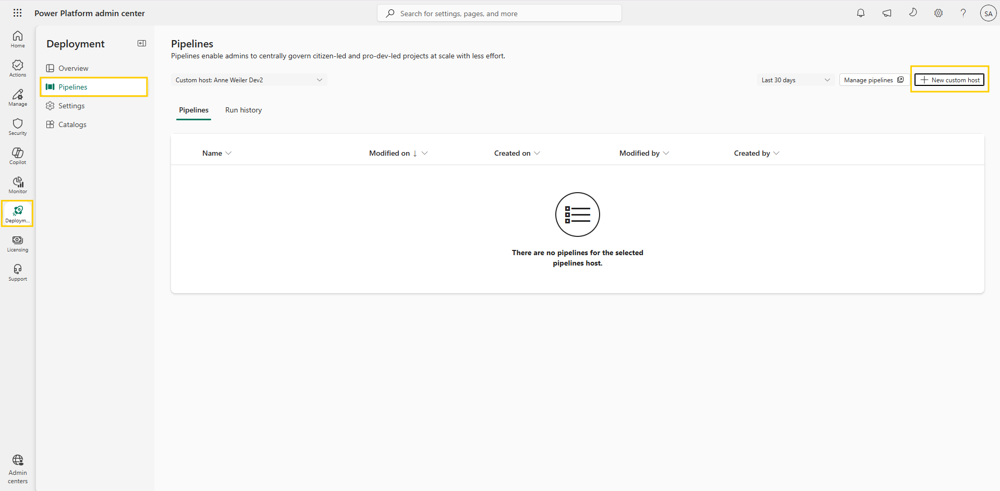  
   Figure: Deployments page showing the New custom host option.

3. Select environment type **Production** in the same region as your development environments. Microsoft recommends that a custom pipeline host be a **dedicated production environment**: the host permanently stores every pipeline's configuration, security settings, and run history, and (unlike the platform host) its data counts toward your Dataverse capacity — so it should be a long-lived, production-grade environment. Give the environment a name, and then select **Save** to create the pipeline host environment. A message bar might appear at the top of the page advising to turn on a feature that automatically converts pipelines environments to Managed Environments.

   > ⚠️ If your tenant does not have capacity for a new production database, you can select environment type **Sandbox** or, as a last resort, **Developer** to complete this lab. A Developer environment works for hands-on practice, but it is **not** a suitable permanent host — it is intended for individual experimentation, not as a shared, production-grade control center. For any real deployment, use a dedicated production environment as the host.

4. Once a notification appears at the top of the page that the pipeline host environment has been created, navigate to **Manage** in the left navigation menu and select **Dynamics 365 apps**. The page shows the available applications as cards — locate the **Power Platform Pipelines** card and select **Install** on the card.

   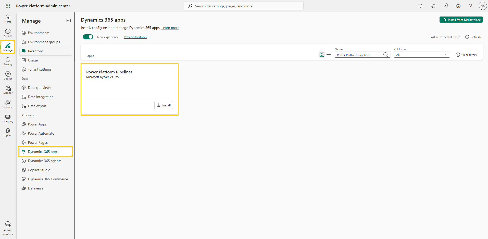  
   Figure: Power Platform Pipelines card on the Dynamics 365 apps page.

   > 📝 The page has a **New experience** toggle at the top. These steps describe the new card-based experience. If you see a classic list view instead, select **Power Platform Pipelines** in the list and then select **Install** from the command bar.

5. In the side panel, select your pipeline host environment, agree to the terms of use, and select **Install**. A message appears: "Request submitted successfully" — select the **Go to this environment's detailed view** button to follow the installation progress. The installation can take several minutes to complete, and the status doesn't always update on its own — refresh the page occasionally to see the current progress.

   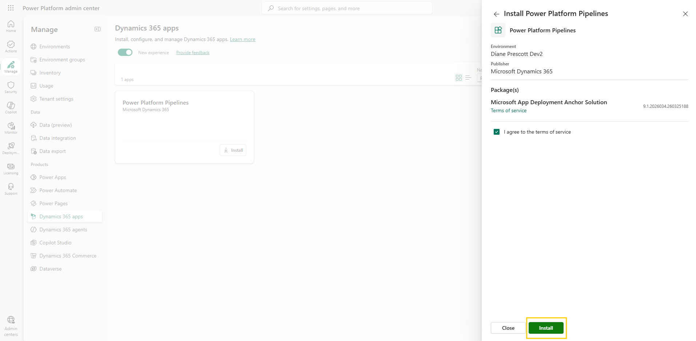  
   Figure: Install app side panel with environment selection.

   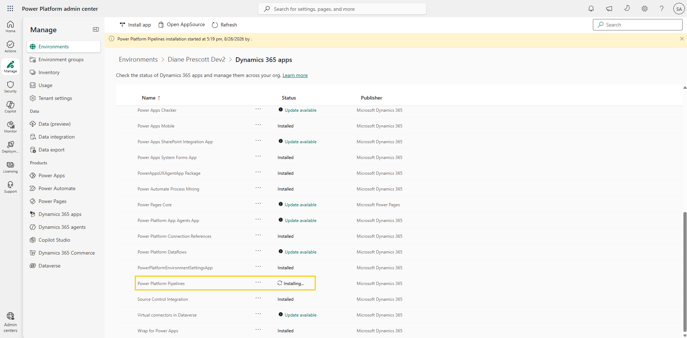  
   Figure: Installation progress shown in the environment's Dynamics 365 apps list.

   > ⚠️ The environment list in the side panel shows every environment — including ones where Power Platform Pipelines is already installed. Selecting such an environment reinstalls the solution. If you're unsure whether your host already has it, check first: go to **Manage** > **Environments**, select the host environment, open **Dynamics 365 apps**, and look for **Power Platform Pipelines** with the status **Installed**.

   > ⚠️ You only need the deployment pipelines application in the pipeline host environment. You do not need to install it in any environments where apps are being developed, tested, or used in production.

6. Once installed, the deployment pipelines configuration application appears in the list of installed apps. Confirm by navigating to <https://make.powerapps.com>, selecting the pipeline host environment from the top right environment selection menu, and then selecting **Apps** from the left menu.

   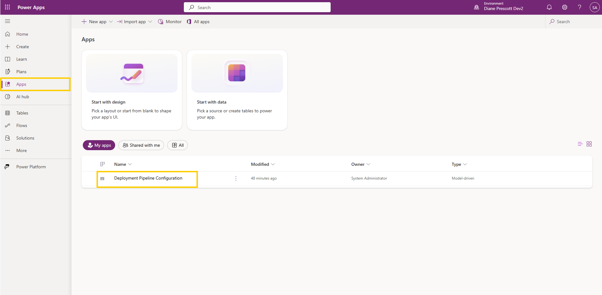  
   Figure: Deployment Pipeline Configuration app in the Apps list.

## Step 2: Set up a new deployment pipeline

1. Play the **Deployment Pipeline Configuration** app (do not open in edit mode), and then select **+ New** in the **Active deployment pipelines** section. If vertical ellipses (**...**) appear instead of the **+ New** button, select the ellipses first. For the pipeline name and description, enter `Innovation Deployment Pipeline`. Select **Save and close** at the bottom of the quick create pane.

   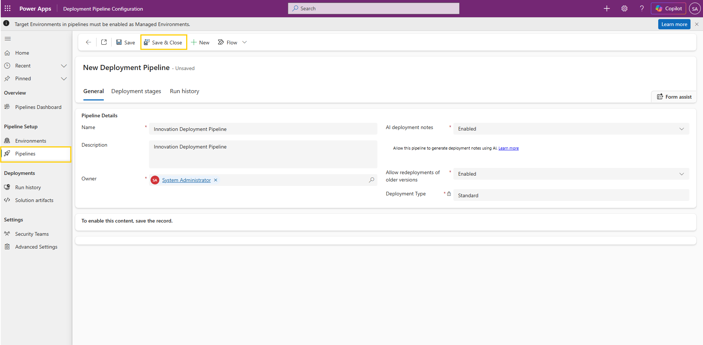  
   Figure: Creating a new deployment pipeline record.

2. Select the pipeline you created from the **Active deployment pipelines** section, then select the **Deployment stages** tab on the pipeline record. Select **+ New Deployment Stage** — the button might be hidden behind vertical ellipses (**...**).

   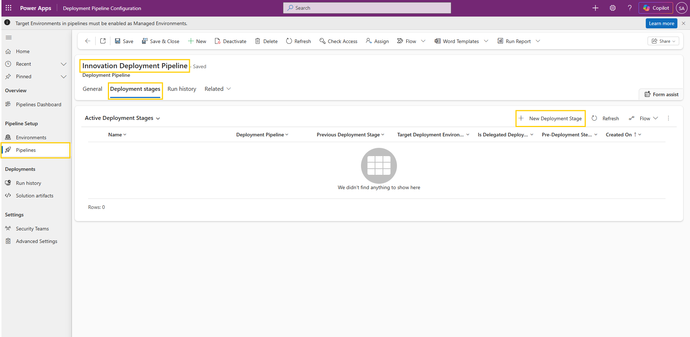  
   Figure: Pipeline record with the Deployment stages tab and New Deployment Stage button.

3. Define the following for the deployment stage:
   - Enter a **Name** for the stage (for example, `Deployment to Innovation Environment Shared`).
   - In the **Target deployment environment ID** field, the target environment record won't exist yet — you need to create it. Select the field, choose **+ New** from the field options, and then enter the new target environment information:
     - **Name** — The name of the environment as it appears in the environment management page of the Power Platform admin center.
     - **EnvironmentType** — Select `Target Environment`.
     - **EnvironmentId** — The ID of the environment as it appears in the environment management page of the Power Platform admin center.
   - Select **Save and close** at the bottom of the quick create pane to save the new target environment record, and then select it in the **Target deployment environment ID** field.

   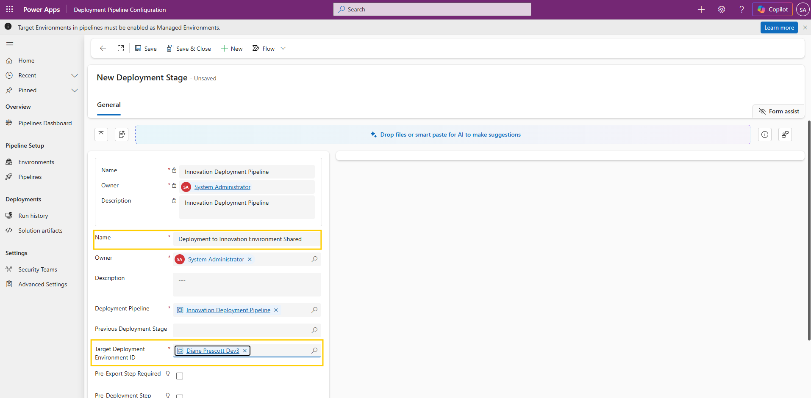  
   Figure: Deployment stage configuration with target environment.

   > 💡 To find the **Environment ID**, open the [Power Platform admin center](https://admin.powerplatform.microsoft.com/), select **Manage** > **Environments**, and choose your target environment. The **Environment ID** appears in the **Details** section — copy it and paste it into the **EnvironmentId** field.

   > 📝 The option `Development Environment` in the EnvironmentType selection menu refers to the source of a deployment pipeline — that is, the environment where makers regularly develop (their own environment in a Safe Innovation Zone). It is not to be confused with the environment types `Sandbox`, `Production`, `Development`, and `Trial`.

4. Select **Save and close** from the command bar to save the new deployment stage.
5. After clicking **Save and close**, you should see the configured pipeline with its deployment stage, as shown in the screenshot below.

   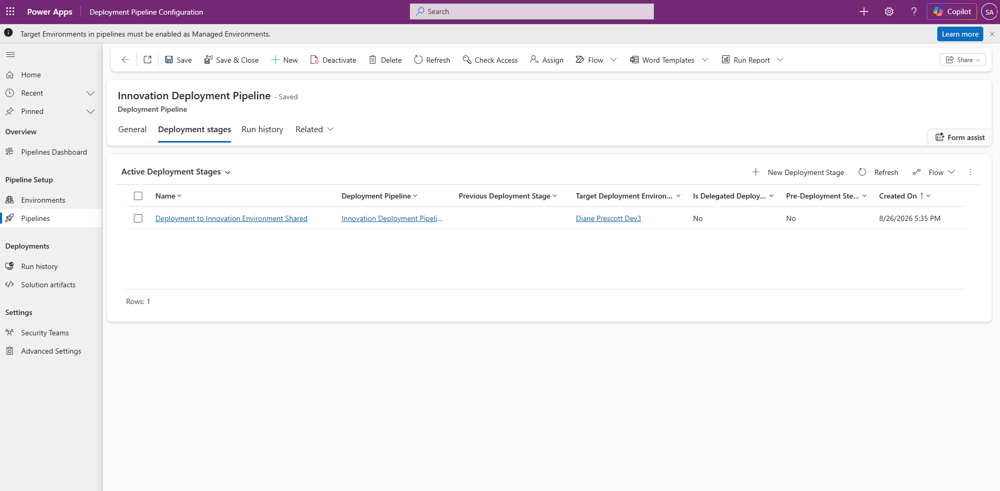  
   Figure: Configured pipeline with a deployment stage.

6. To confirm the setup, go to the Power Platform admin center > **Deployments**. You should see the custom host you configured.

   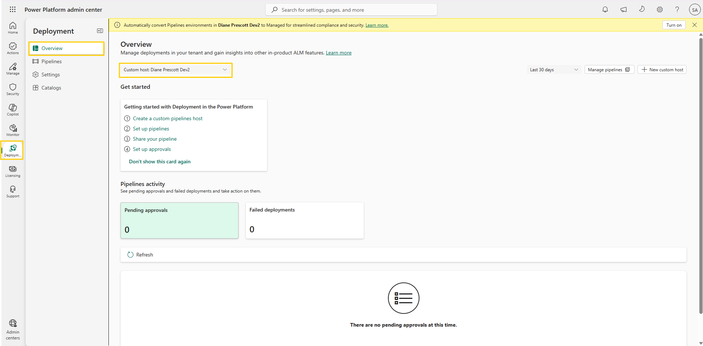  
   Figure: Custom host visible in the Deployments section.

## Step 3: Configure the default pipeline for the Safe Innovation Zone

1. In the Power Platform admin center, navigate to **Manage** > **Environment groups**, open the **Safe Innovation Zone** group, and select the **Rules** tab.
2. Select **Add rules** in the command bar, then locate and select **Default deployment pipeline** in the rule selection pane.
3. In the first dropdown, select a **Pipeline host**.
4. Once a host is selected, select a **Pipeline** to associate with all development environments in the group.

   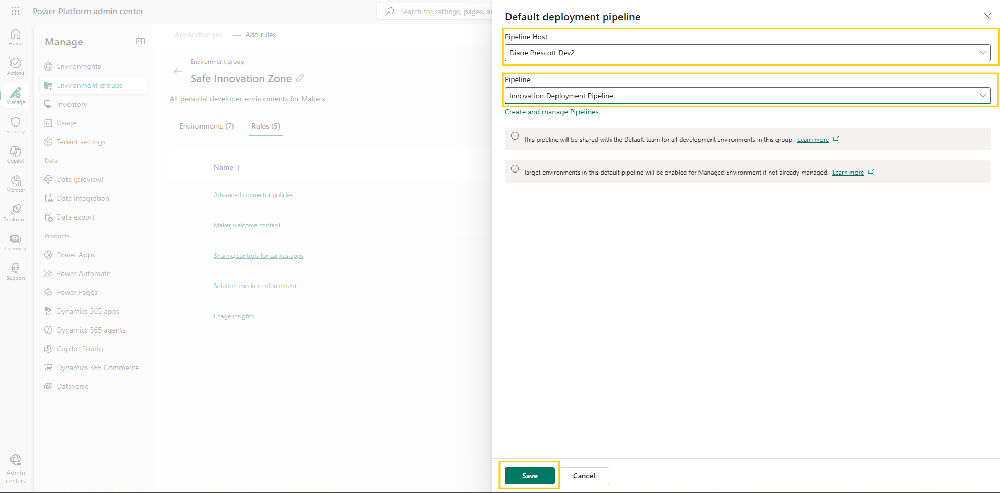  
   Figure: Default deployment pipeline rule configuration.

5. Select **Save**, and then select **Add** to activate the rule.
6. An asterisk (*) appears next to the rule, indicating unapplied changes. Select **Apply changes** in the command bar. A confirmation banner appears — "Changes applied successfully" — and the rule's **Status** column shows **Applied**.

   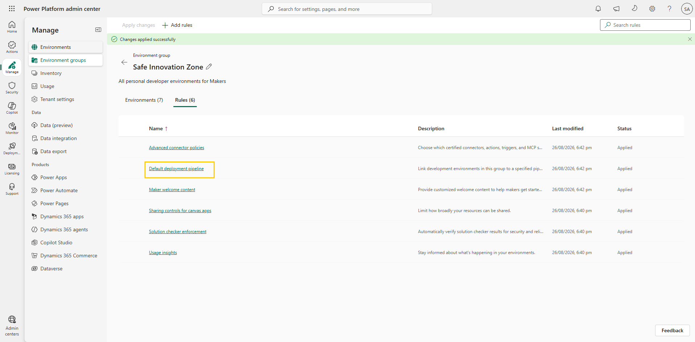  
   Figure: Changes applied successfully with the Default deployment pipeline rule showing Applied.

> 📝 For the purposes of this rule, "development environments" are environments of type **Developer** or **Sandbox** — the chosen pipeline is only associated with environments of these types, which prevents production environments from being unintentionally treated as development sources. Allow up to 10 minutes for the rule to apply across the group.

> 💡 Ensure that all makers who will run the pipeline have access to the pipelines host. The easiest way is to create a Microsoft Entra team on the pipelines host mapped to a security group containing your makers, so they gain just-in-time access with the **Deployment Pipeline User** role.

## Step 4: Validate the pipeline under solutions (optional)

This step requires an environment that was automatically created through environment routing. Within that environment, create a solution that includes at least a test application (create a solution in the environment where you tested the sharing limits of canvas app `Employee Requests` in an earlier lab section, and add the existing canvas app to this solution).

Once the solution is created, navigate to it and verify that the pipeline is visible and enabled for the maker.

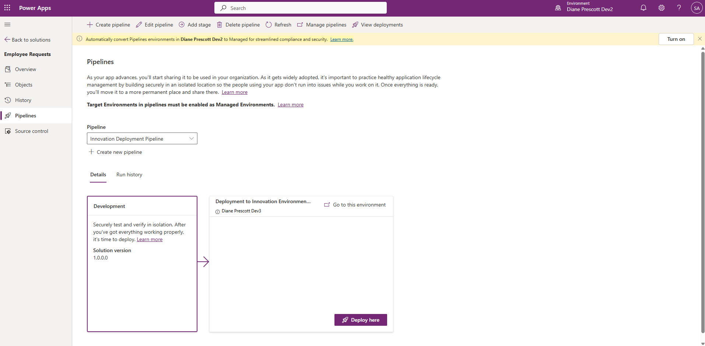  
Figure: Pipeline visible under solutions in the maker environment.

## Additional resources

- [Set a default pipeline (Microsoft Learn)](https://learn.microsoft.com/en-us/power-platform/alm/default-deployment-pipeline-rule-for-environment-groups) — How the default deployment pipeline rule associates a pipeline with all development environments in an environment group.
- [Overview of pipelines in Power Platform (Microsoft Learn)](https://learn.microsoft.com/en-us/power-platform/alm/pipelines) — What in-product pipelines are, how makers run them from within their solutions, and how they simplify ALM without external tooling like Azure DevOps or GitHub.

## Next lab

New work now flows into safe environments and out through a governed pipeline. That handles the future — but the original mess is still sitting in the default environment. Confront it in [Clean up default environment](09-clean-up-default-environment.md).
