# Clean up default environment

Your guardrails protect everything built from now on, but they don't touch what is already there. The default environment is still crowded with the apps and flows that accumulated before any of this existed — the original problem leadership asked you to solve. This final lab is the cleanup: you triage what's there and migrate the apps worth keeping into governed, managed environments where they belong.

Think of the default environment as the attic of your tenant: for years, everything with nowhere else to go ended up there — apps, flows, and connectors with no owner and no guardrails. Every one of them is a small, unmanaged risk, and together they're the reason the oversharing incident was possible in the first place. Since you switched on environment routing, nothing new lands there anymore. What remains is deciding, app by app, what happens to the backlog: keep it and move it somewhere governed, quarantine it, or delete it.

There's a payoff beyond risk reduction. Once the clutter is gone, the default environment can finally settle into the narrow role it's best suited for: ad hoc personal productivity with Microsoft 365 products — quick, individual helpers, not a home for anything shared, business-critical, or long-lived. Everything of substance belongs in governed environments.

> 💡 Want to restrict the default environment even further? A recommended hardening approach is to enable it as a **Managed Environment** and apply the same kinds of controls you built for the Safe Innovation Zone: very strict sharing limits, and an advanced connector policy configured directly on the environment that allows only the bare minimum of connectors. Because the environment is managed, even connectors that classic DLP could never block can be locked down. You can't remove access to the default environment, but you can make it a place where very little can go wrong. See [Secure the default environment](https://learn.microsoft.com/en-us/power-platform/guidance/adoption/secure-default-environment) for the full set of recommendations.

> 📝 The move-apps recommendation is currently a **preview** feature. During the preview, only canvas apps and SharePoint forms that don't use any shared connectors or resources can be moved — the recommendation only shows the apps and forms that are eligible.

> 📝 App sharing is **not** carried over during migration. The app is recreated in the destination environment with its permissions stripped, so after the move you must add the users to the target environment and reshare the app with them. If you leave the original app in place (the **None** option), users can still open it but see a banner indicating that the app has moved.

You have two ways to work through the backlog, and this lab shows both:

- **Manual cleanup** using the Power Platform admin center, which allows you to review, move, or remove apps one by one.
- **Automated cleanup** using Power Automate, which enables bulk processing and migration of apps based on recommendations. See [Reference: Automated cleanup](#reference-automated-cleanup-power-automate) below.

## Step 1: Review recommendations

You can't clean up what you can't see, so the first move is reconnaissance. The platform has already done the hard part for you: the admin center's recommendations flag exactly which production-grade apps are sitting in the default environment and are eligible to move. Your job here is to pull up that list, understand it, and get it in front of the people who'll help you act on it.

> 📝 The "Improve environment hygiene" recommendation may not appear on new or clean tenants that have no apps in the default environment. If this is the case, you can skip this section.

> 💡 To see all recommendations available in the platform, regardless of whether they apply to the current tenant, visit the [Recommendations page URL](https://admin.preview.powerplatform.microsoft.com/actionCenter/advisor?demomode=advisor).

1. Sign in to the [Power Platform admin center](https://admin.powerplatform.microsoft.com/) using your lab environment administrator credentials.
2. In the Power Platform admin center, navigate to **Actions** > **Recommendations**.
3. Locate the recommendation **Improve environment hygiene by moving the production apps out of the default environment**.

   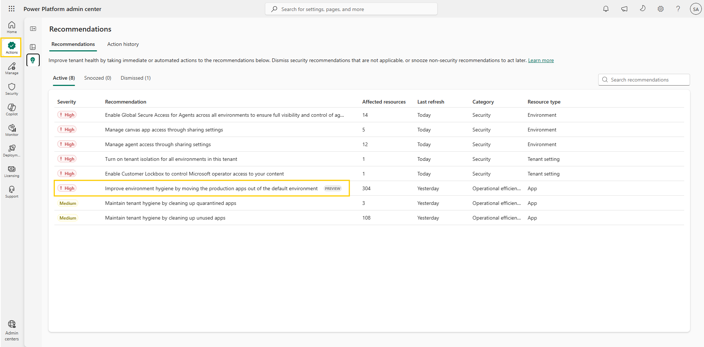  
   Figure: Recommendations page in the Power Platform admin center.

4. Select the recommendation to view details in the side panel.

   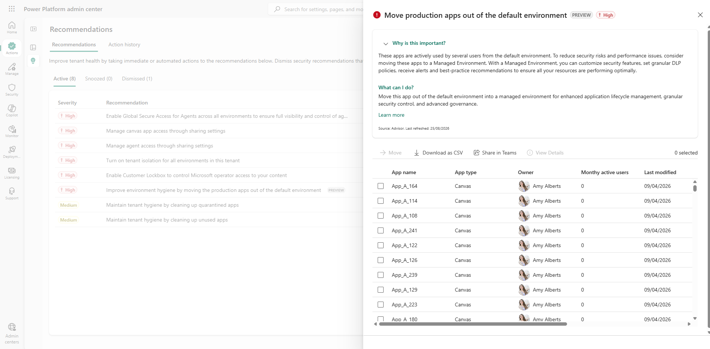  
   Figure: Recommendation details in the side panel.

5. Download the list of affected apps using **Download as CSV** for analysis or record-keeping.

   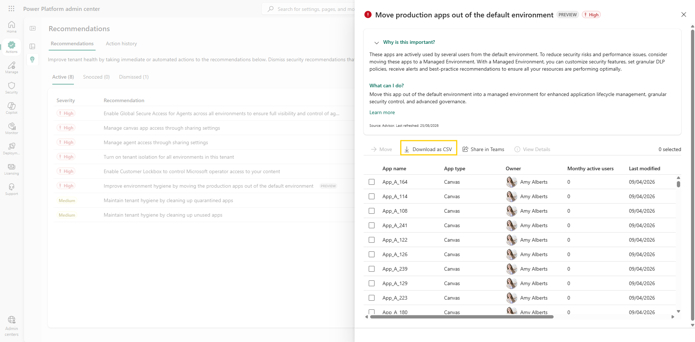  
   Figure: Download the app list as CSV.

   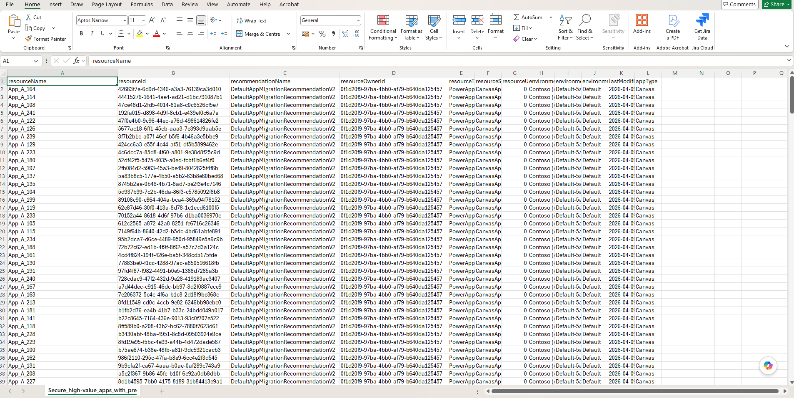  
   Figure: Downloaded app list opened for review.

6. Use **Share in Teams** to share the recommendation with your team and coordinate efforts.

   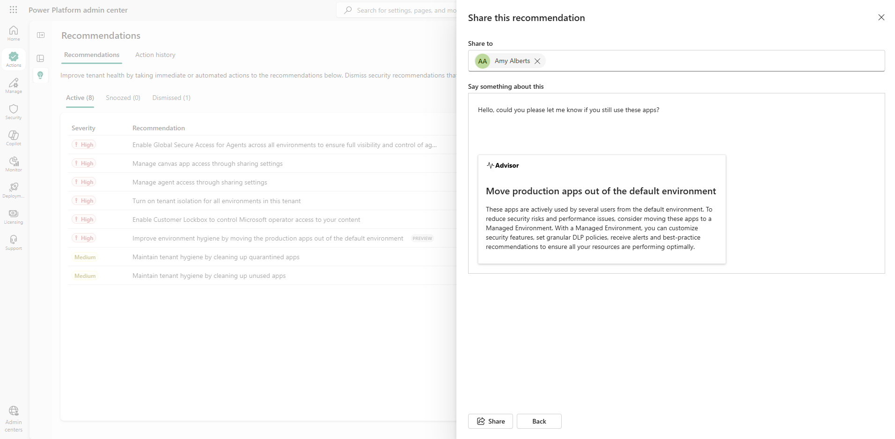  
   Figure: Sharing recommendations via Microsoft Teams.

## Step 2: Move an app to a managed environment

Now the triage becomes action. You pick one app from the list and walk it through the guided migration wizard — out of the ungoverned attic and into a managed environment where your rules apply. Along the way you make the call that matters for every migration: what happens to the original left behind.

1. Back in the recommendation pane, select an app and select **View details**.

   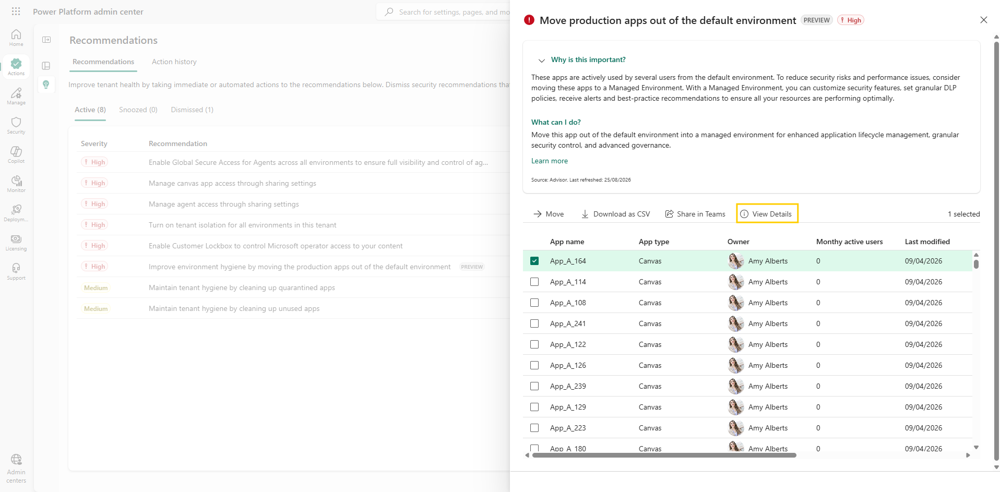  
   Figure: Selecting an app to view details.

   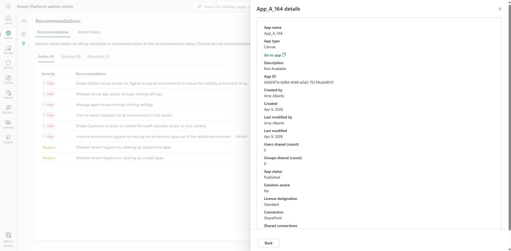  
   Figure: App details panel showing usage and ownership information.

   > 💡 From the details screen, you can open the app itself using the **Go to app** link — provided you have access to it (for example, the app is shared with you directly, or you are a system administrator in that environment). This is a quick way to see what you're about to move.

2. Go back from the details page to the recommendation panel — the app list with the **Move**, **Download as CSV**, **Share in Teams**, and **View Details** commands. Select the app you want to move and select **Move**.

   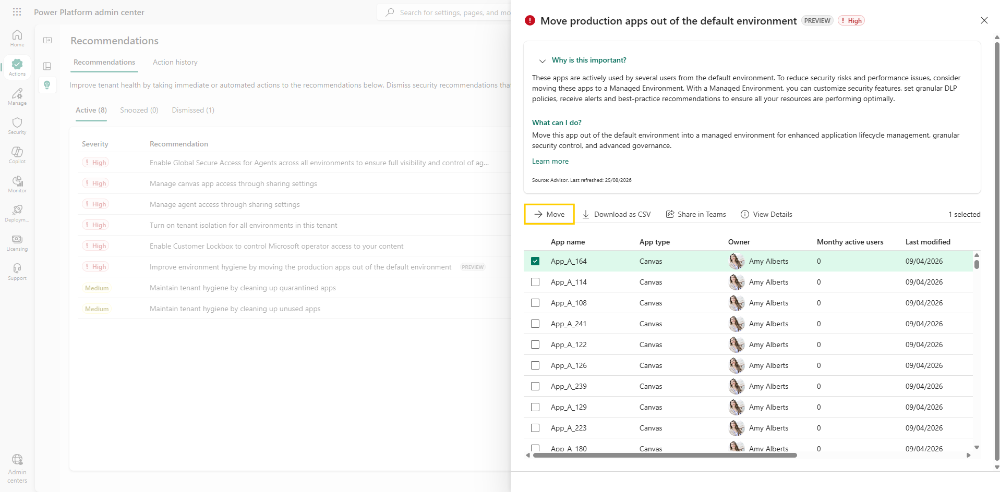  
   Figure: Move button to start the migration wizard.

3. A guided migration wizard opens, named after the app you selected, and walks you through three stages shown on the left: **Environment**, **Messages**, and **Review + approve**. On the **Environment** stage, select the destination environment from the list, and then select **Next**.

   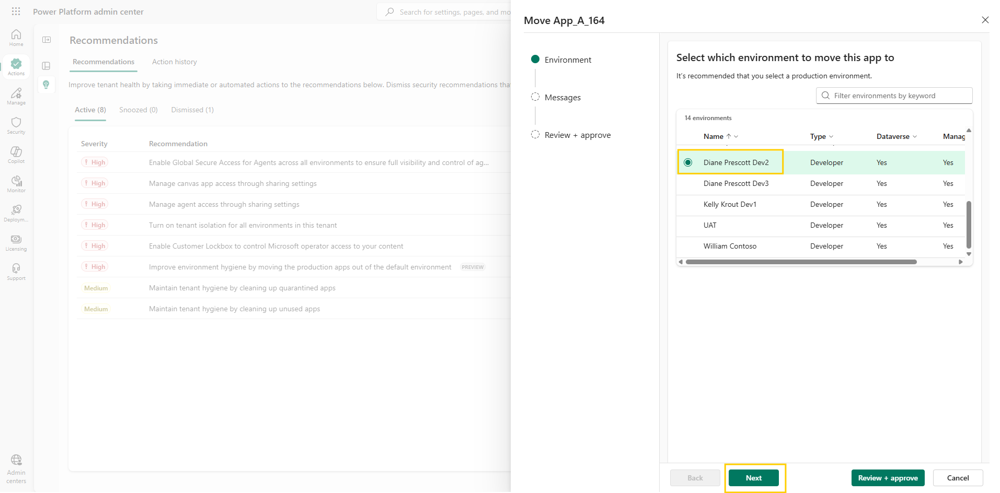  
   Figure: Destination environment selection in the migration wizard.

   > 📝 The list of available destinations only contains **Managed Environments** — unmanaged environments aren't offered, because the whole point of the move is to bring the app under governance. Remember also that sharing is not preserved — you reshare the app in the destination after the move completes.

4. On the **Messages** stage, indicate who should receive messages about the move. You can remove users who are listed, or add new users by entering a name in the **Send to** box. Select **Next**.

5. On the **Review + approve** stage, review the environment and message recipients you chose. Then, under **Action for source app after migration**, select what happens to the original app in the default environment:
   - **None** — leave as is.
   - **Quarantine** — restrict access to the owner only.
   - **Delete** — permanently remove the app.

   Select **Move** to submit the migration.

   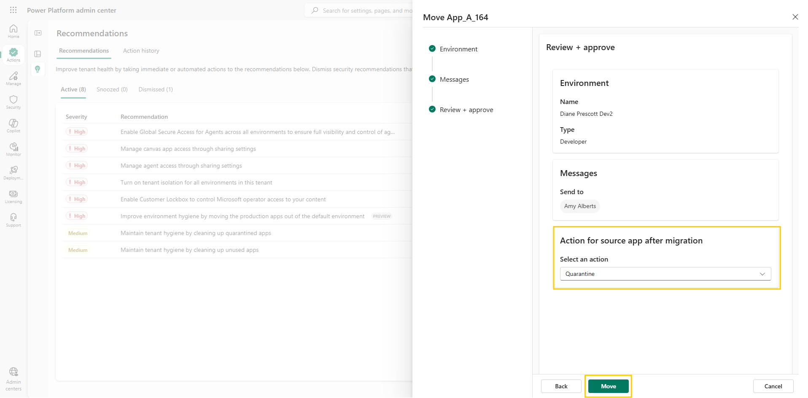  
   Figure: Reviewing the move and choosing what happens to the original app.

   > 💡 As an alternative to deleting, select **None** and then modify the original app by adding an initial screen with a hyperlink directing users to the app's new location. Rename the original app to include the suffix "(Moved)" to clearly indicate its status.

6. A success banner appears at the top of the pane: "Request Received — your move request is in progress and may take a while." Select **Close** to dismiss the wizard.

   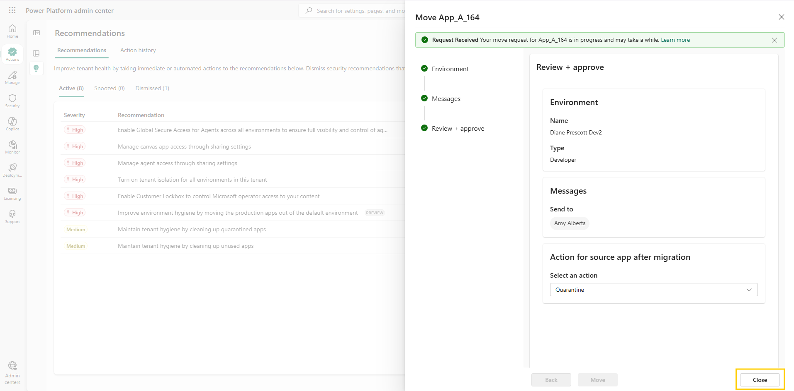  
   Figure: Move request received confirmation in the wizard.

7. Back in the recommendation panel, the migrated app is greyed out and cannot be selected while the move is in progress. Once the migration completes, a tick appears next to the app, confirming it has been moved to the target environment.

   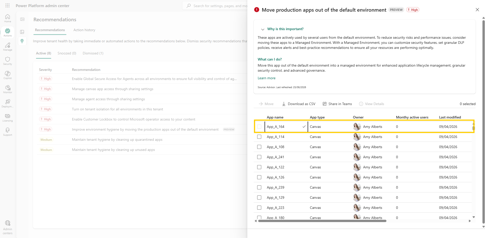  
   Figure: Migration complete confirmation with a tick next to the app.

---

## Reference: Automated cleanup (Power Automate)

> ⚠️ This section is a reference lab you can complete in your own time — it isn't part of the guided workshop session. Treat the flow as a working example rather than an absolute recipe: it shows one way to automate the cleanup, and you're encouraged to expand and adapt it to fit your organization's own approval processes, environments, and cleanup criteria.

Moving one app through a wizard is fine; moving three hundred is not a job for clicking. For cleanups at scale, you can create a Power Automate flow that retrieves the apps flagged by the Advisor recommendation and migrates each one into a **preselected destination environment** — one managed environment that you choose up front. The flow does exactly what the manual wizard did in Step 2, but driven by the recommendation's own data and repeated automatically for every flagged app.

The destination and selection logic are the parts you'd most likely adapt for your organization: as written, the flow consolidates every flagged app into your one designated managed environment, but you could just as easily match each app to its owner's personal developer environment, route different apps to different environments based on ownership or department, or filter the flagged app list against a pre-approved set of app IDs to migrate only a subset.

### Flow overview

1. Sign in to [Power Apps](https://make.powerapps.com/) with the user credentials of your lab tenant, select an environment from the selector at the top right area of the screen, and then create a new **Instant flow** with a **manual trigger**, and call it:

   ```
   Move Apps from Default - Bulk
   ```

   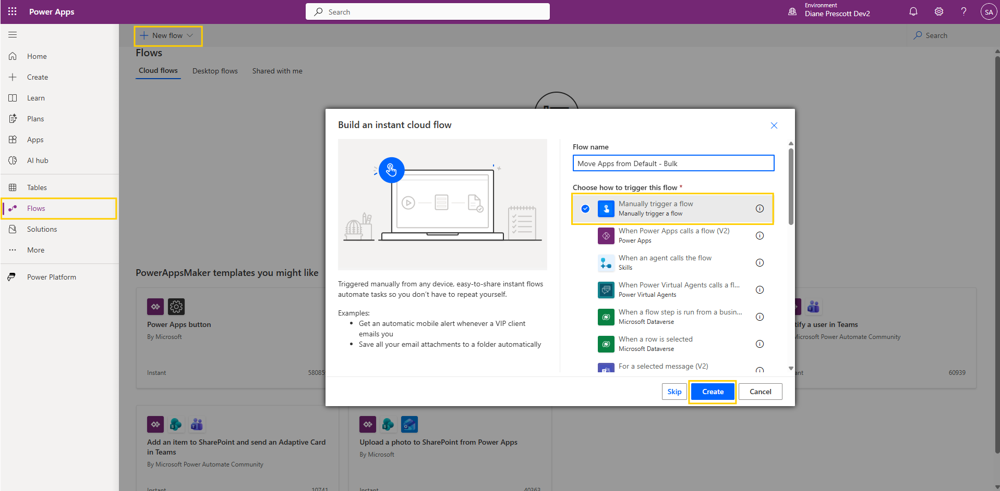  
   Figure: Manual trigger for the cleanup flow.

   > 💡 To be able to follow along, switch to the Classic workflow designer if the New designer is opened automatically. Select **Switch without saving** if prompted to save the workflow before switching to classic designer.

2. Use the **Power Platform for Admins V2** connector and select the **Get recommendation resources** action. If this is the first time you're using this connector in the environment, you're prompted to create a connection: select `OAuth Connection` as the authentication type and select **Sign in** (on subsequent uses, your existing connection is picked up automatically). In the action's parameters, select the recommendation: `Secure high-value apps with premium governance`.

   > 📝 This is the backend/API name for the advisor recommendation you opened in Step 1 ("Improve environment hygiene by moving the production apps out of the default environment").

   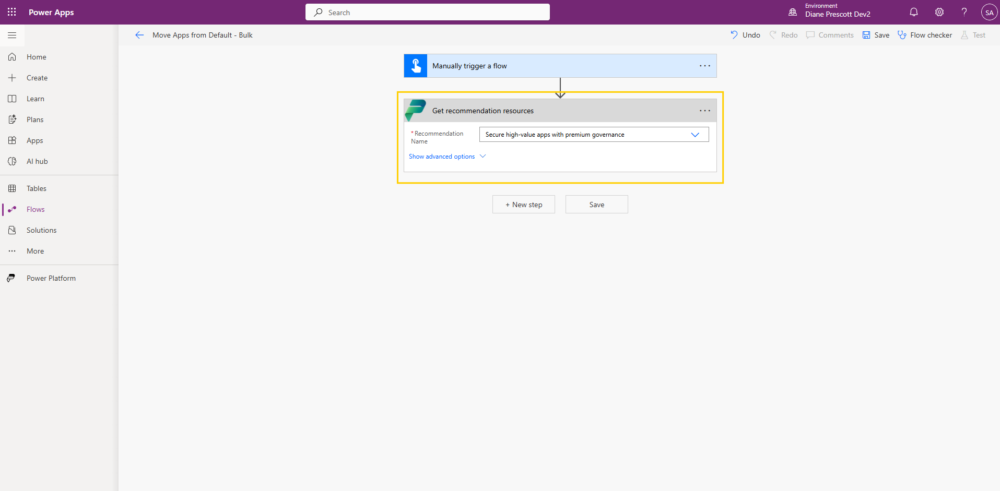  
   Figure: Get recommendation resources action with the recommendation selected.

3. Add the **Power Platform for Admins** action (not V2) and select **List environments as admin**. Since this is a different connector, you might be prompted to authenticate again the first time you use it in this environment.

   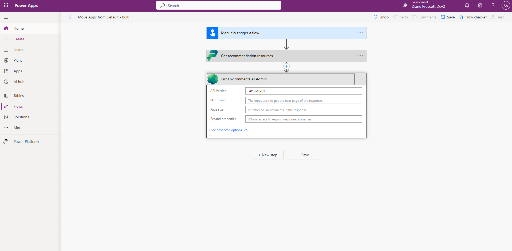  
   Figure: List environments as admin action.

4. Create a **For each** loop: add a new step, select **Control** from the list of actions, and then select **Apply to each**. Click into the **Select an output from previous steps** field, open **Add dynamic content**, search for `value`, and select **value** from the **Get recommendation resources** group (described as "List of recommendation resources"). This is the set of apps the recommendation flagged for migration, and everything you add inside this loop runs once per app.

   > ⚠️ Several actions expose a token named **value** — make sure you pick the one under **Get recommendation resources**, not the ones from **List Environments as Admin** or **Get recommendations**.

   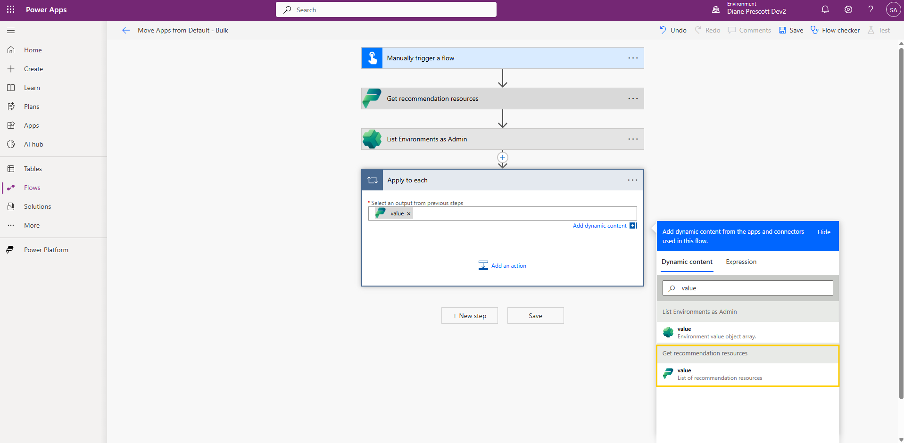  
   Figure: Apply to each loop.

5. Inside the loop, add a **Filter array** action (under **Data Operations**). This action narrows the full list of tenant environments down to the single environment you want the apps moved into — the flow's designated destination. Click into the **From** field ("Array to filter"), open **Add dynamic content**, search for `value`, and this time select **value** from the **List Environments as Admin** group (described as "Environment value object array") — the counterpart of the token you picked in the previous step.

   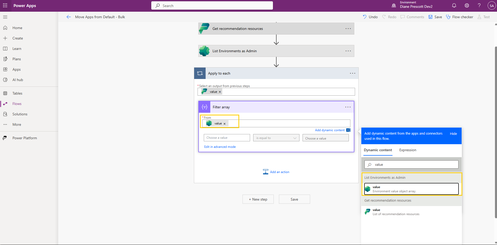  
   Figure: Filter array action with the environments array in the From field.

6. Click into the first **Choose a value** box of the condition row beneath, open **Add dynamic content**, and under the **List Environments as Admin** group select **ID** (described as "Environment ID field").

   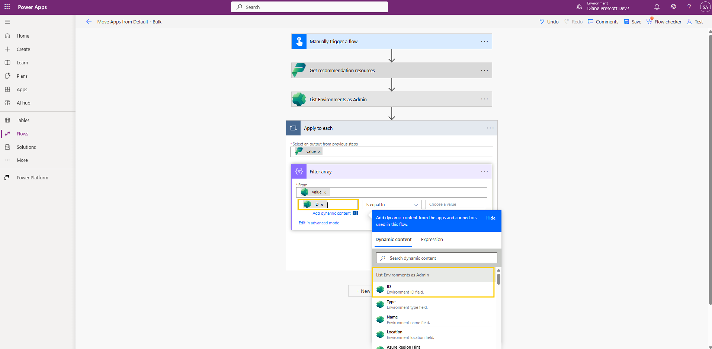  
   Figure: Selecting the ID field for filtering.

7. Keep the operator as **is equal to**, and in the second **Choose a value** box, paste the **Environment ID** of your destination environment — for example, the managed environment you moved an app into during Step 2. To find it, open the [Power Platform admin center](https://admin.powerplatform.microsoft.com/), select **Manage** > **Environments**, choose your destination environment, and copy the **Environment ID** from the **Details** section. Only that one environment passes the filter.

   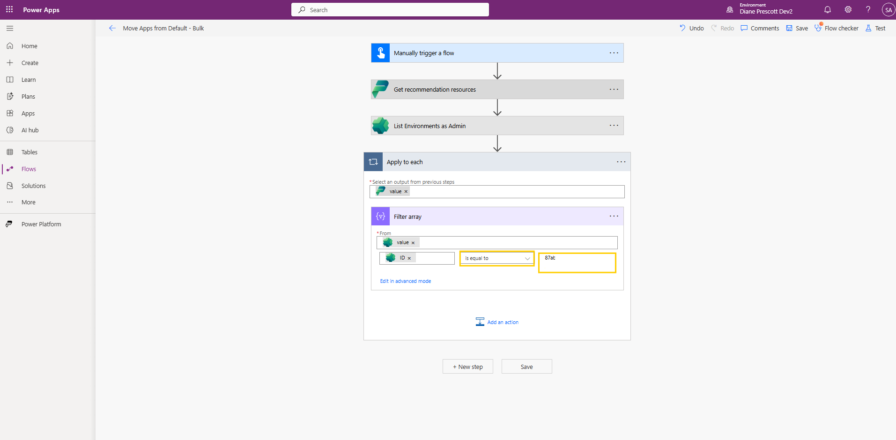  
   Figure: Filter matching the designated destination environment by ID.

8. Still inside the first loop, directly after the **Filter array** action, add another **Control** > **Apply to each** — the designer names it **Apply to each 2**. Click into its **Select an output from previous steps** field, open **Add dynamic content**, search for `body`, and select **Body** from the **Filter array** group. This second loop iterates over the filter's result — which, with the environment ID filter above, is exactly one environment: your designated destination.

   > ⚠️ Watch the look-alikes again: a lowercase **body** token also appears under **List Environments as Admin**. Pick the capitalized **Body** under **Filter array** — the filtered list, not the unfiltered one.

   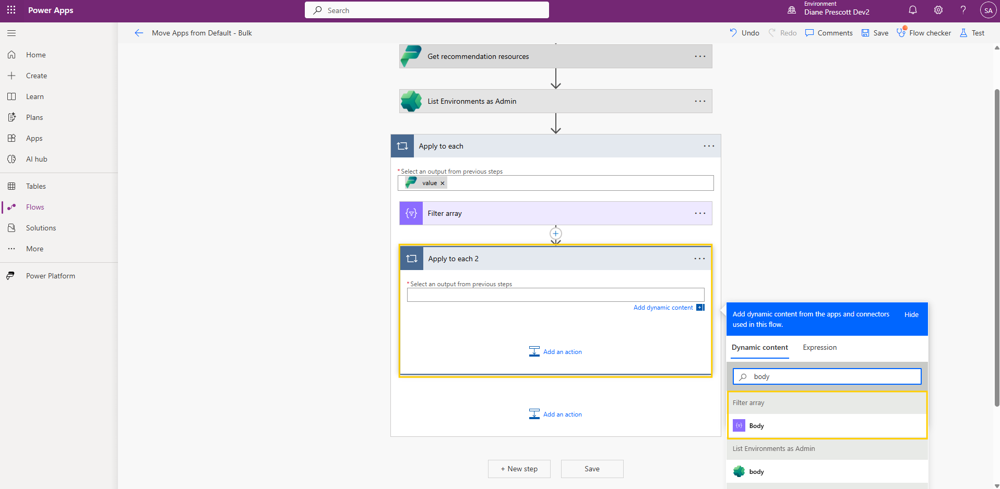  
   Figure: Second Apply to each using filtered results.

9. Inside the second loop, add a **Compose** action (under **Data Operations**) to store the environment ID for each app being processed. Click into its **Inputs** field, open **Add dynamic content**, and select **ID** from the **Filter array** group.

   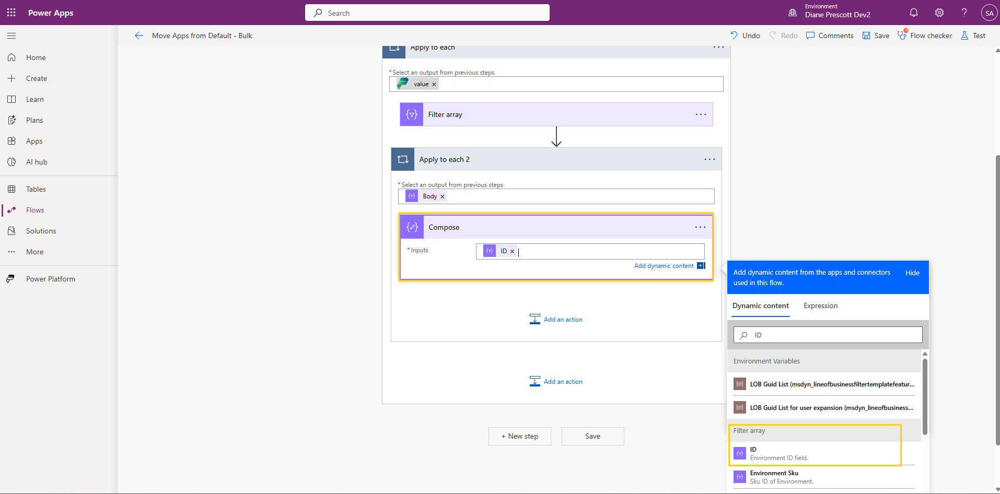  
   Figure: Compose action with the environment ID from Filter array as input.

10. Inside the second loop, directly after the **Compose** action, add the **Execute recommendation action** from the **Power Platform for Admins V2** connector (searching for `exec` in the action list finds it quickly). This is the action that performs the actual migration, once per app. Configure the card as follows (if the **Body** fields aren't visible, select **Show advanced options**):
    - **Recommendation Name:** `Secure high-value apps with premium governance`
    - **Action Name:** `Migrates an application to a Managed Environment`
    - **Api-version:** `2024-10-01`
    - **Body App Id - 1:** open **Add dynamic content**, search for `Resource ID`, and select **Resource ID** ("The resource unique ID") from the **Get recommendation resources** group.
    - **Body Environment - 1:** select **Environment ID** ("The environment unique ID") — again from the **Get recommendation resources** group, not the similarly named tokens under **List Environments as Admin**.
    - **Body Destination environment - 1:** select **Outputs** from the **Compose** group — the destination environment ID you stored in the previous step.

    The remaining fields — **Body Contacts - 1** (who to notify of the migration) and **Body Finalize Action - 1** (what happens to the source app after it's migrated, such as quarantine) — are optional and can be left empty for this reference flow. The completed card should look like this:

    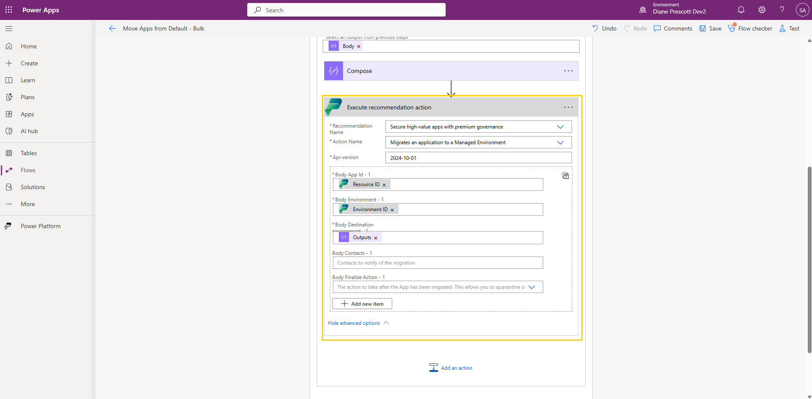  
    Figure: Fully configured Execute recommendation action card.

    Here is the full flow from trigger to execution:

    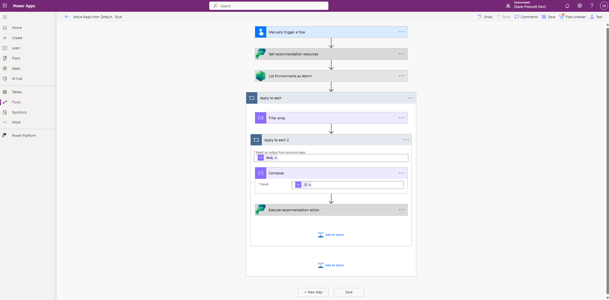  
    Figure: Complete automated cleanup flow overview.

11. Select **Save** in the command bar, and then select **Test** > **Manually** > **Test** to run the flow and verify it executes successfully.
12. After testing, review the flow run history to confirm that apps were processed as expected.

---

> 🥳 Congratulations! You completed Module 1. You walked in with an ungoverned default environment and a fresh oversharing incident, and you walked out with a Safe Innovation Zone: makers routed into governed environments, rules that hold under pressure, a standardized path to production, and the original mess cleared out. The guardrails are built — but building them is only half the job. In Module 2, you gain the visibility to confirm they're working and to catch whatever slips through.

## Further reading

- [Environment groups](https://learn.microsoft.com/en-us/power-platform/admin/environment-groups)
- [Environment routing](https://learn.microsoft.com/en-us/power-platform/admin/default-environment-routing)
- [Advanced connector policies](https://learn.microsoft.com/en-us/power-platform/admin/advanced-connector-policies)
- [Move apps from the default environment](https://learn.microsoft.com/en-us/power-platform/admin/move-apps-from-default-environment)
- [Power Platform Pipelines](https://learn.microsoft.com/en-us/power-platform/alm/pipelines)
