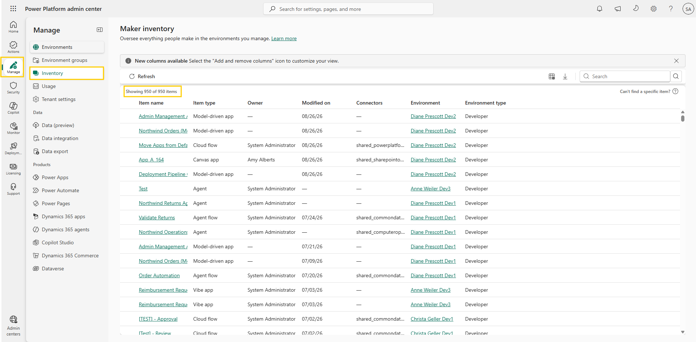
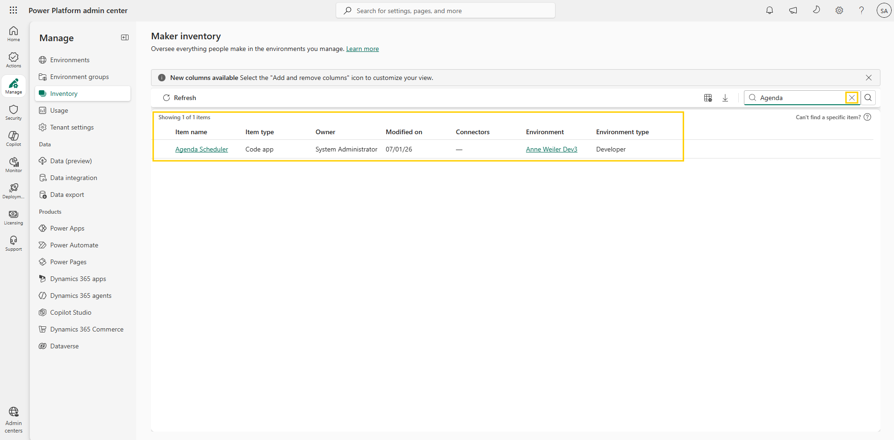
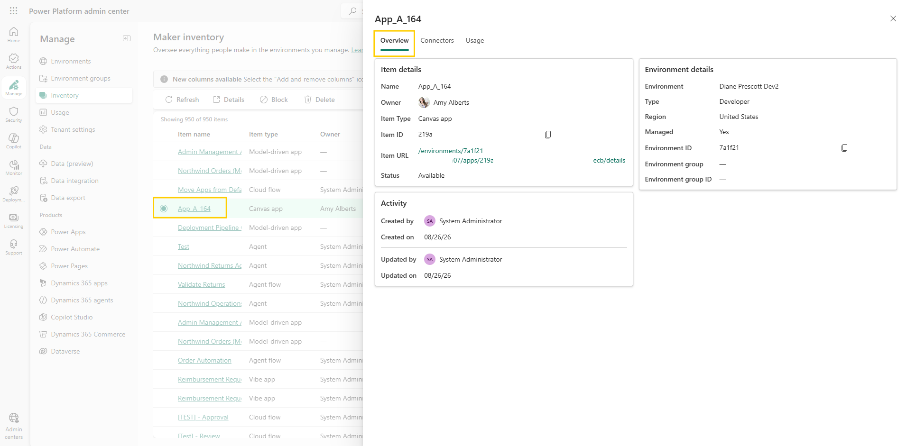
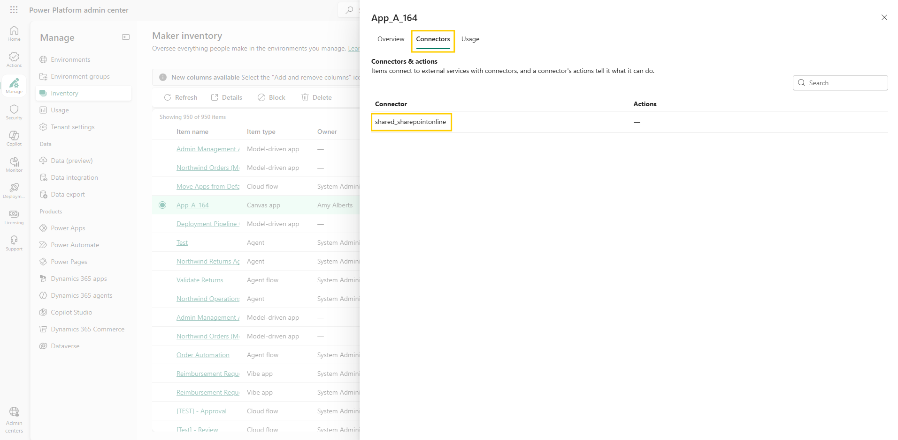

# Open inventory

You can't govern what you can't see. As the Power Platform Lead, you know makers across the organization are building apps, flows, and agents every day, but nobody can say exactly what exists, where it runs, or who owns it. When a support ticket references an app by name or a connector deprecation notice arrives, you need to find the affected resources quickly. The place that shows everything is **Power Platform inventory**.

Power Platform inventory is generally available and gives you a unified view of all agents, apps, and flows across every environment in your tenant. Resources that are created, updated, or deleted appear in the inventory within 15 minutes. Viewing it requires a supported Microsoft Entra role such as **Power Platform administrator** or **Dynamics 365 administrator** — the built-in Power Platform RBAC roles aren't supported. In this lab you open the inventory, search it, and drill from a single row all the way into a resource's details and its environment.

## Step 1: Open inventory

1. Sign in to the [Power Platform admin center](https://admin.powerplatform.microsoft.com/) using your lab environment administrator credentials.
2. In the left navigation pane, select **Manage** > **Inventory**. The **Maker inventory** page opens.
3. Wait for the list to load. You should see columns such as **Item name**, **Item type**, **Owner**, **Modified on**, **Connectors**, **Environment**, and **Environment type**, along with the item count above the table (for example, "Showing 950 of 950 items").

     
   Figure: Maker inventory page showing the resource list and default columns.

> 📝 The table loads up to 1,000 items at a time — the count above it shows how many are currently displayed out of the total that match. In larger tenants, use search (next step) or filters ([Filter inventory](03-filter-inventory.md)) to reach resources beyond the loaded rows; both work across the entire inventory.

## Step 2: Search for a resource

1. In the **Search** box above the table, type part of an app or agent name that exists in your tenant and press **Enter**.
2. Confirm that the list now only shows items that contain your search term.
3. To return to the full list, select the clear (**X**) button in the search box, or delete the search text and press **Enter** on the empty box. Simply deleting the text doesn't reset the results on its own.

     
   Figure: Search box with the clear search (X) button.

> 📝 Search is freeform text matching — enter any text and inventory returns every matching resource, from your entire inventory rather than only the rows currently loaded in the grid. Matches aren't limited to item names: text appearing in other attributes, such as an environment name, also returns results.

## Step 3: Navigate to a resource and its environment

1. Select any row in the table, then select the **Item name** of the resource — resource names are always hyperlinked. (Alternatively, select the row and choose **Details** in the command bar.) A side panel opens on the right with three tabs, starting on **Overview**: the name, item type, resource URL, by whom and when the resource was created and last modified, and environment details.

     
   Figure: Details panel showing the Overview tab for a selected resource.

2. Select the **Connectors** tab. It lists the connectors used by this resource, such as `shared_sharepointonline` for the SharePoint connector, or `shared_commondataserviceforapps` for the Dataverse connector.

     
   Figure: Details panel showing the Connectors tab for a selected resource.

3. Select the **Usage** tab. It shows key usage metrics for the resource — such as total active users and total active sessions — filterable by a past time period from the last 7 days up to the last 90 days (the default is the last 28 days). In a lab tenant with little real activity, expect to see "No data to display yet" here; metrics appear once the resource is actually used.

4. Close the details panel by selecting the **X** in its top-right corner to return to the inventory view, then select the **Environment** name for the same row. This opens the environment details page for that resource in the admin center, where you can check which rules apply to the environment.

> 📝 Connector inventory — both the **Connectors** column in the main grid and the **Connectors** tab in this panel — is currently in **preview**. Connectors bound as data sources (such as SharePoint, Dataverse, or SQL Server) appear in the list but don't report individual operations — their **Actions** column shows a dash. Calls made through the HTTP built-in action aren't captured either, since built-in actions aren't connectors.

> 🔍 You can also act on resources from the inventory. With a resource selected, the command bar offers **Delete**, and for published agents and canvas apps, **Block**. Blocking is reversible and stops a resource from being used while you investigate a security or compliance concern.

## Additional resources

- [Power Platform inventory (Microsoft Learn)](https://learn.microsoft.com/en-us/power-platform/admin/power-platform-inventory) — Overview of the inventory experience, supported resource types, access requirements, and known limitations.

## Next lab

The default columns show what exists but not who last changed it. Add that information in [Add columns](02-add-columns.md).
