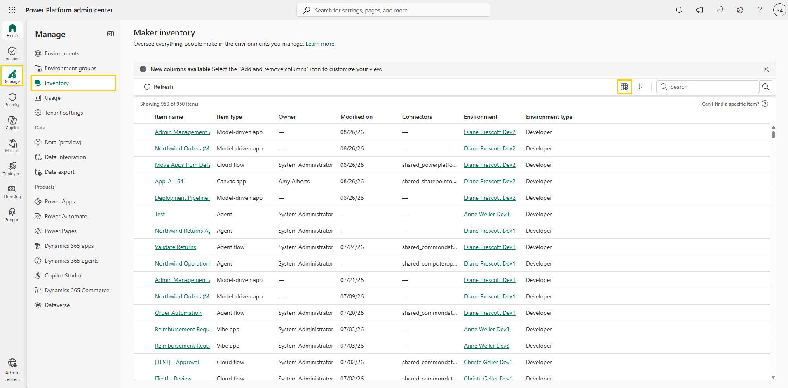
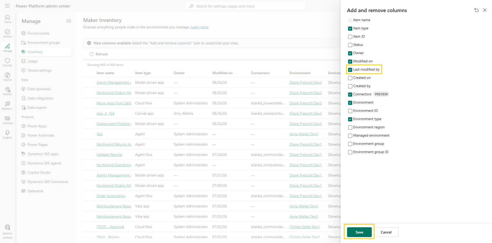
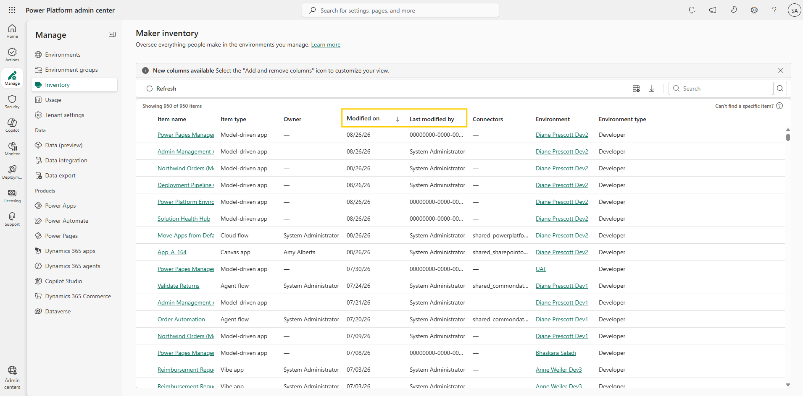

# Add columns

The inventory shows what exists, but governance questions are often about change: what was modified this week, and by whom? When an app in a shared environment suddenly behaves differently, or an audit asks who last touched a resource, the **Modified on** column tells you when something happened but not who did it. In this lab you add the **Last modified by** column and sort the inventory by the newest changes.

## Step 1: Open the column chooser

1. You should still be on the **Maker inventory** page from the previous lab. If not, open the [Power Platform admin center](https://admin.powerplatform.microsoft.com/) and select **Manage** > **Inventory**.
2. Above the table, select the **Add and remove columns** icon (next to the **Search** box). The **Add and remove columns** panel opens.

     
   Figure: Add and remove columns icon next to the Search box.

## Step 2: Select the columns you need

1. In the column chooser, select **Last modified by**.
2. Optionally, select or clear other columns to tune the view — hidden columns can be brought back at any time.
3. Select **Save** to close the column chooser.

     
   Figure: Add and remove columns panel with Last modified by selected.

## Step 3: Sort by the newest changes

1. Select the **Modified on** column header, and under **Sort order**, select **Sort descending**. An arrow appears in the column header, and the newest changes move to the top.
2. Review the top of the list. It now shows the most recently changed resources in your tenant, with the person who made each change.

     
   Figure: Inventory sorted by Modified on with the Last modified by column visible.

> 💡 The same column menu also contains a **Filter by** section. You use it in the next lab.

> ⚠️ A few columns behave differently for certain resource types. The **Modified on** and **Last modified by** columns don't return values for agents and display a dash (–) for them. The **Owner** column doesn't apply to model-driven apps — Dataverse has no concept of ownership for them, so they also show a dash. And for cloud flows and agent flows, **Owner** currently shows the user who created the flow and doesn't update when ownership changes.

## Additional resources

- [Power Platform inventory (Microsoft Learn)](https://learn.microsoft.com/en-us/power-platform/admin/power-platform-inventory) — Overview of the inventory experience, including displaying more columns and known limitations per resource type.

## Next lab

Sorting shows the newest changes across the whole tenant. To narrow the list to one environment, one maker, or one time window, continue with [Filter inventory](03-filter-inventory.md).
