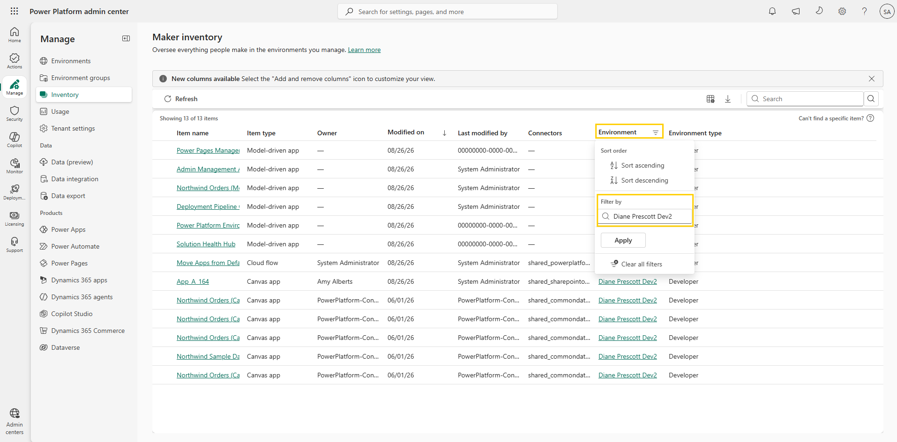
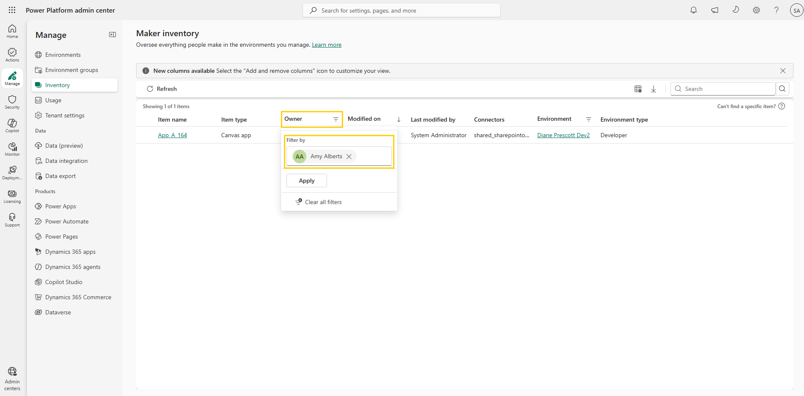
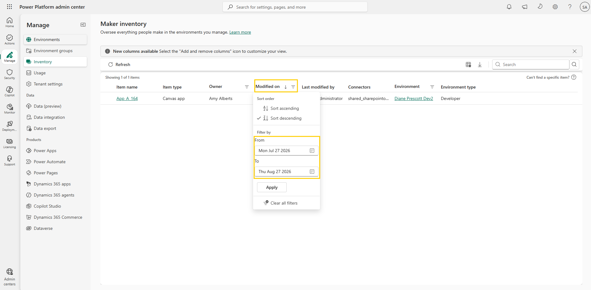

# Filter inventory

Sorting shows changes across the whole tenant, but most governance questions are scoped. A common one: a maker is leaving the organization, and before their last day you need to know what they own in a given environment and what they've changed recently, so nothing is orphaned when their account is disabled. Answering that takes three filters: environment, owner, and date. In this lab you combine all three.

Filters are cumulative — each one narrows the result further, and the item count above the table updates as you go.

## Step 1: Filter by environment

1. You should still be on the **Maker inventory** page from the previous lab. If not, open the [Power Platform admin center](https://admin.powerplatform.microsoft.com/) and select **Manage** > **Inventory**.
2. Make sure no search term is applied — if one is, select the clear (**X**) button in the **Search** box.
3. Select the **Environment** column header and locate **Filter by**.
4. Enter the name of the environment you want to inspect and select **Apply**. The list now shows only resources in that environment.

     
   Figure: Environment filter applied to the inventory list.

## Step 2: Filter by owner

1. Select the **Owner** column header and locate **Filter by**.
2. Start typing the name of a known maker, select them from the list, and apply the filter. The list now shows resources in that environment owned by that maker.

     
   Figure: Owner filter applied to the inventory list.

> 📝 Remember from the previous lab that ownership data has gaps for some resource types: model-driven apps have no owner at all, and for cloud flows and agent flows the **Owner** column shows the original creator. An owner filter finds a departing maker's canvas apps and agents reliably, but treat flow results as "created by" rather than "currently owned by."

## Step 3: Filter by last modified date

1. Select the **Modified on** column header. Under **Filter by**, set a date range — for example, **From** a date 30 days ago **To** today.
2. Select **Apply**. The list now shows resources in the chosen environment, owned by the selected user, and changed within the chosen time period.

     
   Figure: Date range filter applied to the Modified on column.

## Step 4: Review your filters

1. Look at the item count above the table and note how many resources match your filters. Notice also the filter icon now shown in each filtered column's header — a quick way to see which filters are active.
2. When you want to start fresh, selecting any filtered column header and choosing **Clear all filters** resets the view in one action. If you're continuing with this module, don't clear the filters — you'll export this exact filtered list in the next lab.

> 📝 **Clear all filters** removes sorts as well as filters — including the **Modified on** sort you applied in the previous lab.

## Additional resources

- [Power Platform inventory (Microsoft Learn)](https://learn.microsoft.com/en-us/power-platform/admin/power-platform-inventory) — Overview of the inventory experience, including filtering, sorting, and known limitations.

## Next lab

To share this list with the governance team or the maker's manager, you need it as a file. Continue with [Export inventory to CSV](04-export-inventory-csv.md).
