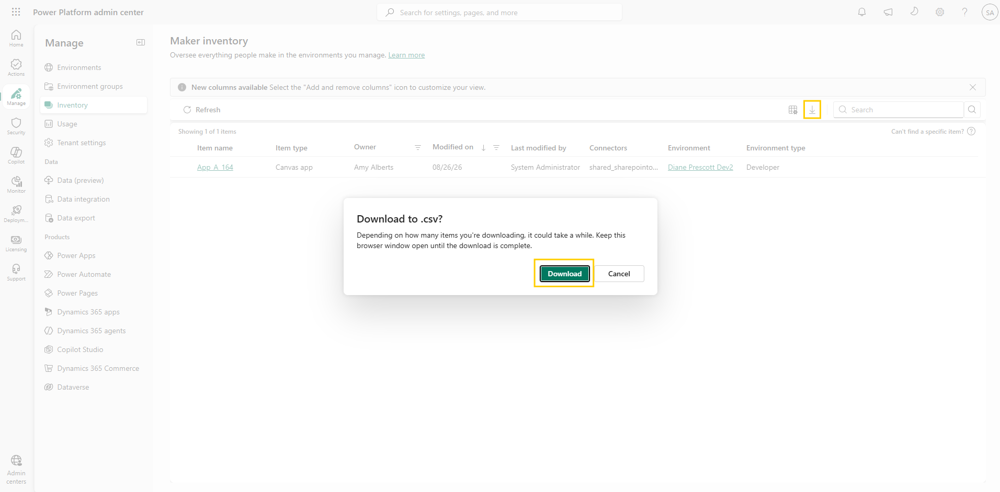
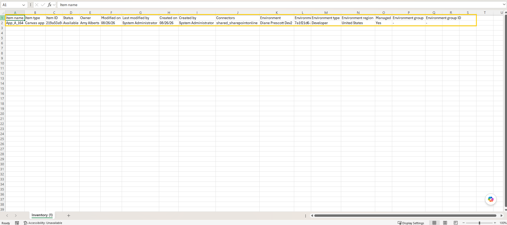

# Export inventory to CSV

The filtered list answers your question, but others need the answer too: the departing maker's manager, the governance team, and the next audit. In this lab you export your filtered inventory as a CSV for offline analysis and sharing.

## Step 1: Confirm your filters and columns

1. You should still be on the **Maker inventory** page with the filters from the previous lab applied — one environment, one owner, one time window. If you cleared them, reapply a filter or two; any filtered view works for this lab.
2. Confirm that **Last modified by** is visible in the table, and that the item count above the table matches the scoped-down list you expect to share.

## Step 2: Download the CSV

1. On the command bar above the table, select the **Download** icon. In the **Download to .csv** dialog that appears, select **Download**.

     
   Figure: Download to .csv confirmation dialog.

2. An **Inventory.csv** file is saved to your local device.

> 📝 The export can take a while depending on how many items you're downloading — keep the browser window open until the download completes.

## Step 3: Verify the export

1. Open the file in Excel (or another spreadsheet application).
2. Confirm that:
   - The rows in the file match the filtered set you saw in the admin center.
   - Columns such as **Item name**, **Item type**, **Owner**, **Environment**, and **Last modified by** are present.

     
   Figure: Exported Inventory.csv file opened in Excel.

> 💡 The CSV export includes all available columns, even those you hid in the admin center — your column visibility settings affect only the on-screen view, not the export.

> ✅ The handover list now exists as a file that can be reviewed, archived, and compared against a future export.

## Additional resources

- [Power Platform inventory (Microsoft Learn)](https://learn.microsoft.com/en-us/power-platform/admin/power-platform-inventory) — Overview of the inventory experience, including exporting your inventory.

## Next lab

A CSV is a snapshot, and every new question means new filters and a new file. For questions you ask repeatedly, query the inventory directly in [Query with Azure Resource Graph](05-query-resource-graph.md).
