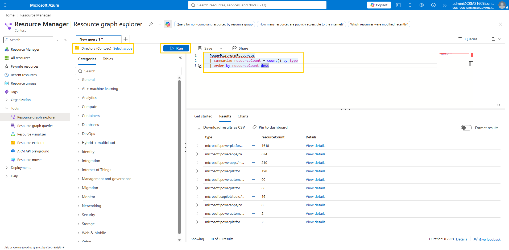
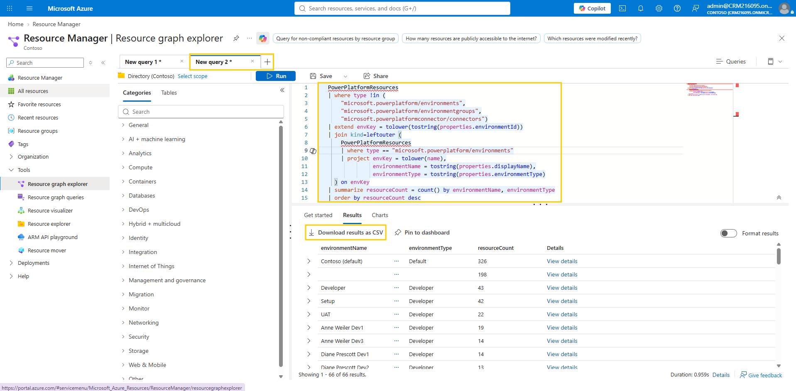
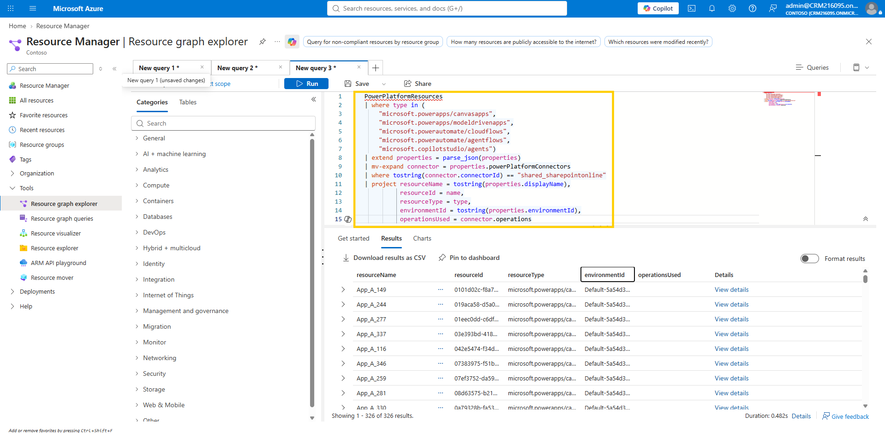

# Query inventory with Azure Resource Graph

Filters and CSV exports answer questions one at a time; some questions come back every quarter. *Where are resources concentrated, and is that where our governance is focused?* *Which apps and flows are affected by this connector deprecation?* Power Platform inventory is exposed as the `PowerPlatformResources` table in **Azure Resource Graph**, which means questions like these become KQL queries: written once, saved, and rerun whenever someone asks again. In this lab you answer both.

## Prerequisites

- You have a supported admin role such as **Power Platform administrator** — the same access that lets you view the Maker inventory also lets you query it here.
- You can sign in to the [Azure portal](https://portal.azure.com) with that account. **No Azure subscription is required** — the `PowerPlatformResources` table is queried at the **Directory** (tenant) scope, so a tenant without any Azure subscriptions works fine.

> 💡 If Resource Graph Explorer opens but your queries fail or return no data, conditional access policies for Azure Resource Manager may be the cause — see [Power Platform inventory — Known limitations](https://learn.microsoft.com/power-platform/admin/power-platform-inventory#known-limitations) for resolution steps.

## Step 1: Open Resource Graph Explorer

1. Sign in to the [Azure portal](https://portal.azure.com) by using your lab environment administrator credentials. On the home page, select **Resource graph explorer** under **Azure services** — or, if it isn't shown there, search for **Resource Graph Explorer** in the search box in the header of the page and open the corresponding search result.
2. Check the scope shown above the query editor — it should read **Directory** (tenant level), which is often the default. If a subscription is shown instead, select **Select scope** and switch to **Directory** so the query runs across the whole tenant.

   > ⚠️ If you can't switch the scope to **Directory**, you likely don't have permission to query inventory with Azure Resource Graph in this tenant. Skip this lab and continue with [Explore the Usage tab](06-explore-usage-tab.md) — the rest of the module doesn't depend on it.

3. To confirm everything is wired up, run a first query — paste the following into the editor and select **Run**:

   ```kusto
   PowerPlatformResources
   | summarize resourceCount = count() by type
   | order by resourceCount desc
   ```

   You should see a count for each resource type in your tenant. Note that alongside apps, flows, and agents, environments and environment groups appear as resource types in their own right — a detail the next step turns into an advantage.

     
   Figure: The scope above the editor, the query, and the Run button — the three things every query in this lab uses.

## Step 2: Rank environments by resource count

The governance-focus question: *where is everything?* If most of your tenant's resources sit in a handful of environments — or worse, in the default environment — that's where policies, monitoring, and cleanup effort should go first. Environment IDs alone make for unreadable results, so this query joins each resource to the environment records in the same table to bring in readable names and types.

1. Select **+** next to the query tabs to open a new query tab (or delete the previous query from the editor), then copy and paste the following query and select **Run**:

   ```kusto
   PowerPlatformResources
   | where type !in (
       "microsoft.powerplatform/environments",
       "microsoft.powerplatform/environmentgroups",
       "microsoft.powerplatformconnector/connectors")
   | extend envKey = tolower(tostring(properties.environmentId))
   | join kind=leftouter (
       PowerPlatformResources
       | where type == "microsoft.powerplatform/environments"
       | project envKey = tolower(name),
                 environmentName = tostring(properties.displayName),
                 environmentType = tostring(properties.environmentType)
     ) on envKey
   | summarize resourceCount = count() by environmentName, environmentType
   | order by resourceCount desc
   ```

2. Review the results: every environment in your tenant, ranked by how many resources it contains, with its type alongside. The count covers all maker-built items the inventory tracks — apps of every type, cloud flows and agent flows, and Copilot Studio agents — while the excluded rows (environments, environment groups, and connector records) are the inventory's organizational records rather than maker workloads. For the full list of resource types behind the count, see the [inventory schema reference](https://learn.microsoft.com/power-platform/admin/inventory-schema). In a real tenant, this single result often justifies an entire governance program — it shows at a glance whether work is spread across governed environments or piled into one or two.

3. Optionally, select **Download results as CSV** to export results for further analysis.

     
   Figure: Environments ranked by resource count — with the new query tab, the query, and the Download results as CSV option highlighted.

> 📝 The first two lines deserve a closer look: because environments and environment groups are themselves rows in `PowerPlatformResources`, the query first excludes them from the counting side, then joins back to the environment rows to enrich each resource with its environment's name and type. This self-join pattern is the same one the admin center uses for its own inventory view. If your results include a row with a **blank** `environmentName`, those are resources whose environment ID has no matching environment record in the inventory — for example, resources left behind in deleted environments or held in hidden system environments.

## Step 3: Find every resource that uses a specific connector

The deprecation-notice question, answered in one query. Run it for the SharePoint connector — which the canvas app from your earlier labs uses — and the impact list writes itself.

1. Open a new query tab (or delete the previous query from the editor), then copy and paste the following query and select **Run**:

   ```kusto
   PowerPlatformResources
   | where type in (
       "microsoft.powerapps/canvasapps",
       "microsoft.powerapps/modeldrivenapps",
       "microsoft.powerautomate/cloudflows",
       "microsoft.powerautomate/agentflows",
       "microsoft.copilotstudio/agents")
   | extend properties = parse_json(properties)
   | mv-expand connector = properties.powerPlatformConnectors
   | where tostring(connector.connectorId) == "shared_sharepointonline"
   | project resourceName = tostring(properties.displayName),
             resourceId = name,
             resourceType = type,
             environmentId = tostring(properties.environmentId),
             operationsUsed = connector.operations
   ```

2. Review the results: every resource in the tenant that touches the SharePoint connector, with its type and environment. Swap `shared_sharepointonline` for any other connector ID — the value of the `connectorId` field, shown in the **Connectors** tab you explored in the first lab — to repeat the analysis for a deprecation, a security issue, or a licensing change.

     
   Figure: The connector query returns every resource that uses the specified connector.

> 📝 Connector data in inventory is currently in **preview**, with two caveats you'll notice in the results: connectors bound as data sources (such as SharePoint or Dataverse) report an empty `operationsUsed` array, and the results contain connector IDs only — no display names or Standard/Premium tier information yet.

> ✅ Two questions every Power Platform Lead gets asked — *where should governance focus* and *what's affected by this connector* — are now queries you can run in seconds, save, and rerun whenever the next review, deprecation notice, or security advisory arrives.

## Additional resources

- [Power Platform inventory sample queries (Microsoft Learn)](https://learn.microsoft.com/power-platform/admin/inventory-sample-queries) — Ready-to-run KQL queries for counting resources, looking up items, and analyzing connector usage.
- [Power Platform inventory schema reference (Microsoft Learn)](https://learn.microsoft.com/power-platform/admin/inventory-schema) — The full list of resource types and their fields in the `PowerPlatformResources` table.

> 💡 You can save useful queries in Resource Graph Explorer by selecting **Open query** > **Save**. Saved queries can be reused in future governance reviews or shared with your team.

## Next lab

You've measured what exists, where it's concentrated, and what it connects to — but existence isn't the same as impact. Which of these resources do people actually use? Find out where the energy goes in [Explore the Usage tab](06-explore-usage-tab.md).
