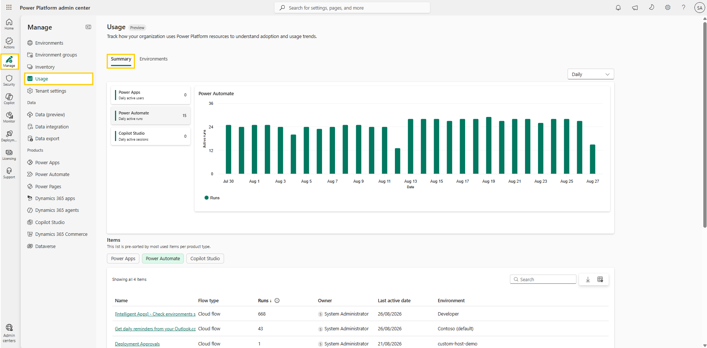
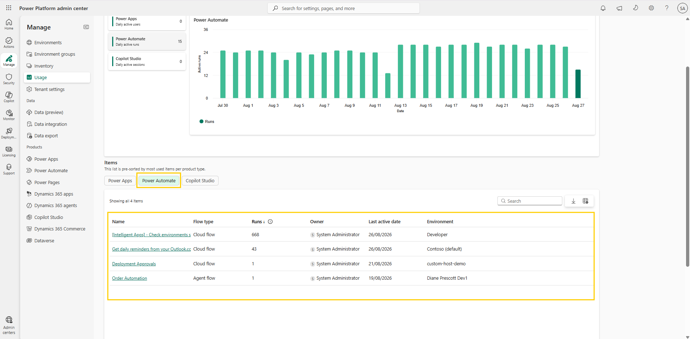
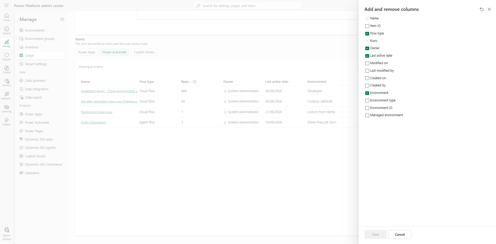
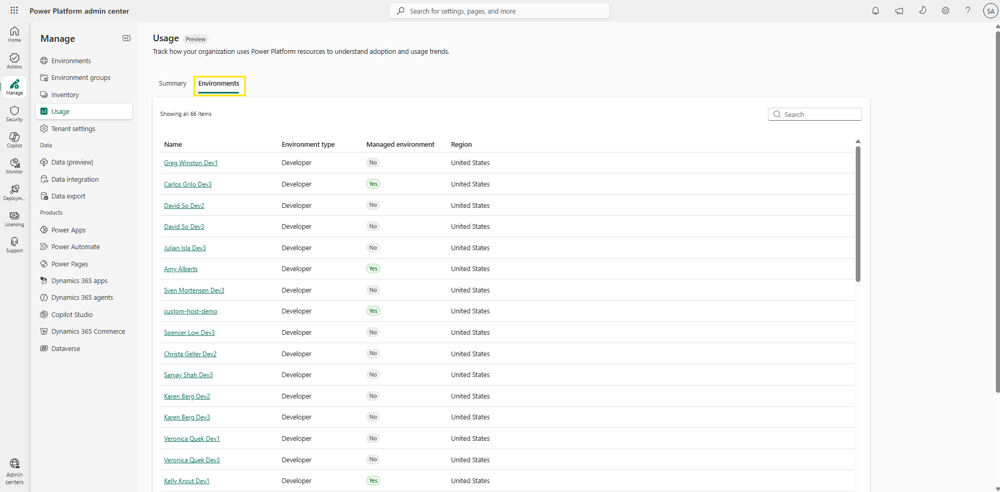
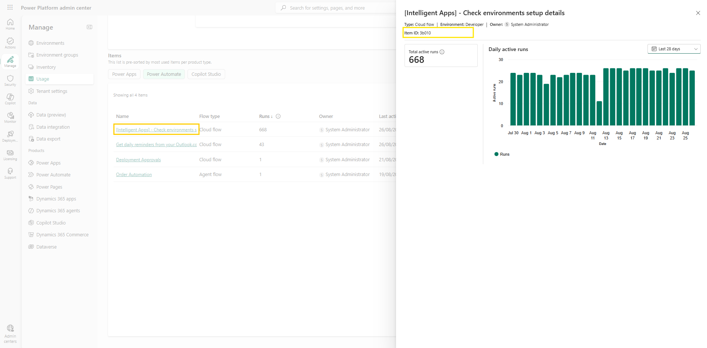

# Explore the Usage tab

Inventory tells you what exists, but not what matters. Decisions about what to monitor, protect, and clean up should follow usage rather than count. The **Usage** page in the Power Platform admin center gives you a unified, tenant-level view of how Power Apps, Power Automate, and Copilot Studio are being used across your organization.

> ⚠️ The Usage page is currently in **preview** and is still rolling out — it might not be available in your region yet. If **Manage** > **Usage** doesn't appear in your tenant, continue with the next lab and return here later.

## Step 1: Open the Usage page and review the summary

1. Sign in to the [Power Platform admin center](https://admin.powerplatform.microsoft.com/) using your lab environment administrator credentials.
2. In the left navigation pane, select **Manage** > **Usage**. The **Usage** page opens with a **Preview** badge next to its title, showing two tabs: **Summary** and **Environments**. Stay on **Summary**.
3. Review the summary view:
   - On the left, a card for each product shows its usage metric — active users for Power Apps, runs for Power Automate, and sessions for Copilot Studio. Select a card to switch the chart to that product.
   - The dropdown above the chart controls the granularity, and the cards follow it: in the **Daily** view the cards show daily active metrics and the chart covers the last 28 days; switch to **Monthly** and the cards show monthly totals while the chart stretches to a month-by-month trend.

     
   Figure: Usage page Summary tab with product cards and the adoption chart.

> 📝 In a lab tenant with little real activity, some cards and charts may show zeros or stay sparse — the page reflects actual usage, and only items that aren't deleted are included.

## Step 2: Explore the Items table

1. Scroll down to the **Items** section. This is a single interactive table, pre-sorted by the most used items per product type, with buttons to switch between products:
   - **Power Apps** — apps launched by end users, such as canvas apps and model-driven apps, with users and sessions per app.
   - **Power Automate** — cloud flows and agent flows, by run volume.
   - **Copilot Studio** — agents built in Copilot Studio, by sessions.

   Switch between the products and review the top of each list — the most used resources, with their owner, environment, and last active date.

     
   Figure: Items table with the product toggle buttons.

2. Optionally, customize the columns shown in the table. Select the **Add and remove columns** icon in the table toolbar — the same panel you used on the inventory page — choose the columns you need, and select **Save**. You can also use the download icon next to it to export the list.

     
   Figure: Add and remove columns panel for the Items table.

## Step 3: View usage per environment

1. Select the **Environments** tab at the top of the page. It lists every environment in your tenant with its type, managed status, and region.

     
   Figure: Environments tab on the Usage page.

2. Select an environment with real activity. The same summary view you explored in Step 1 appears, scoped to just that environment — cards, chart, and granularity toggle included.

## Step 4: Connect usage back to inventory (optional)

Usage tells you which resources matter; inventory tells you who owns them, where they live, and which connectors they use. To connect the two:

1. In the **Items** list, select the name of a heavily used resource. A details pane opens showing its type, environment, owner, and usage over the last 28 days. Copy the **Item ID** shown at the top of the pane. (Alternatively, add **Item ID** as a column to the Items table using the **Add and remove columns** panel from Step 2.)

     
   Figure: Resource details pane on the Usage page with the Item ID.

2. Go to **Manage** > **Inventory**, paste the Item ID into the **Search** box, and press **Enter**. Search matches IDs as well as names, so the exact resource comes up.
3. Open its details panel and review the **Overview** and **Connectors** tabs. You now know not just that the resource is heavily used, but who is responsible for it and which connectors it uses — the context you need before applying policies to it or deciding to monitor it.

## Additional resources

- [Discover what drives engagement by using the Usage page (Microsoft Learn)](https://learn.microsoft.com/en-us/power-platform/admin/usage) — What the Usage page shows, the metrics behind each product, and its current preview status.

## Next lab

The admin center answers questions interactively. For a report that can run on a schedule without anyone opening a portal, continue with [Export inventory with a cloud flow](07-export-inventory-flow.md).
