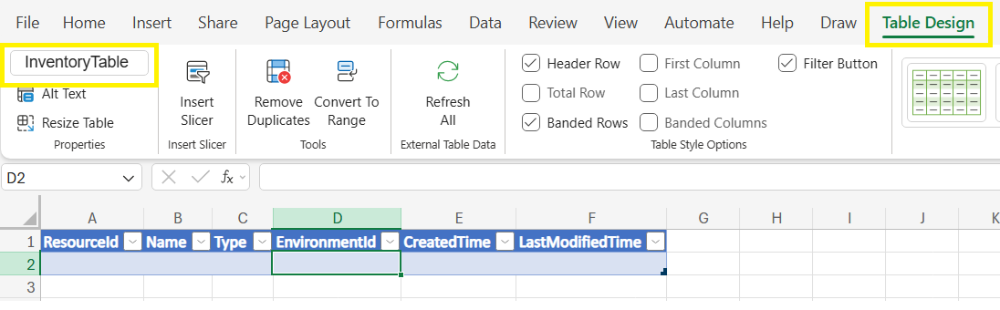
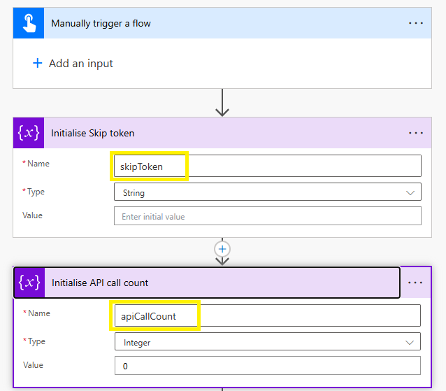
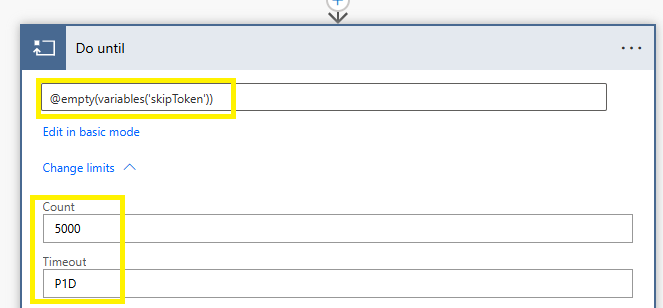
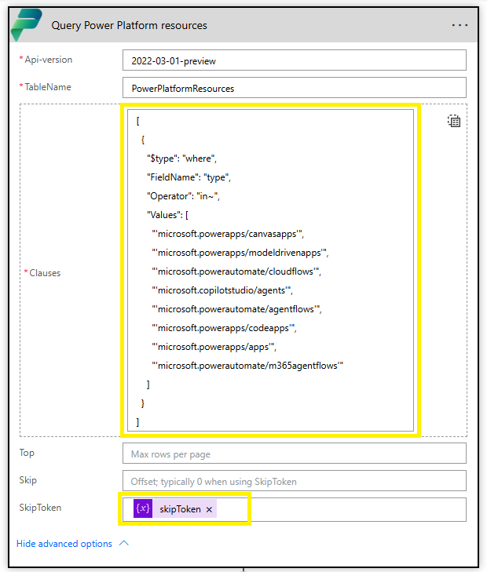
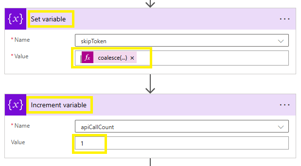
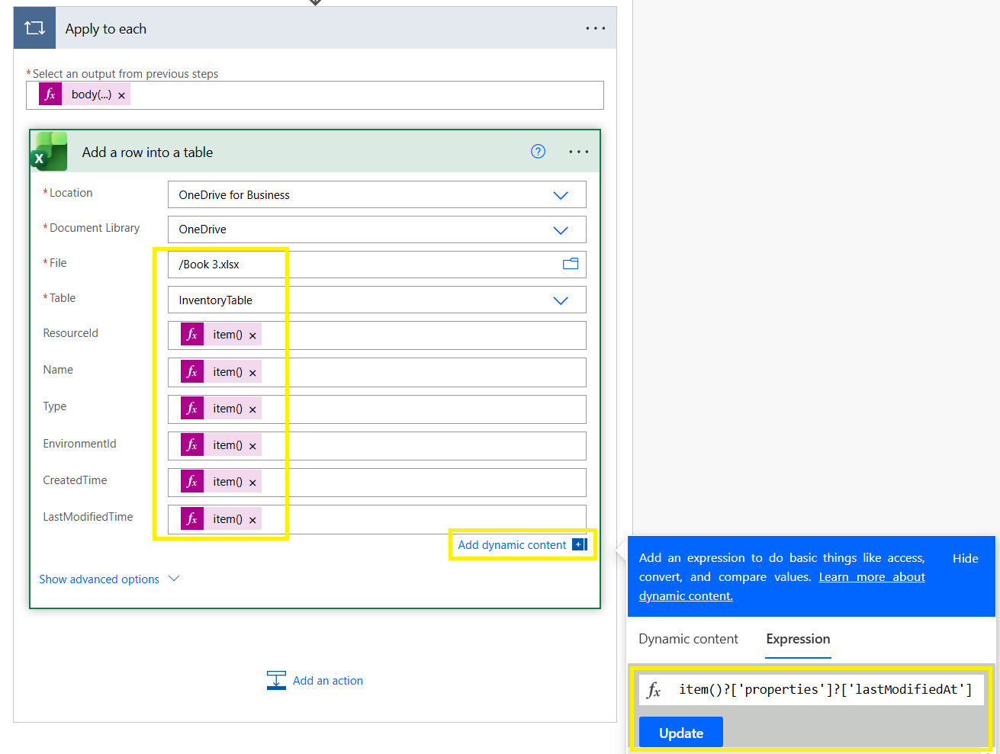
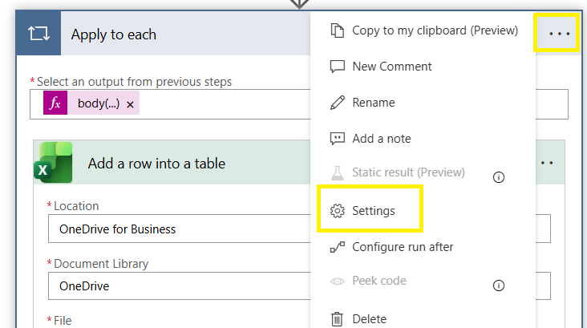
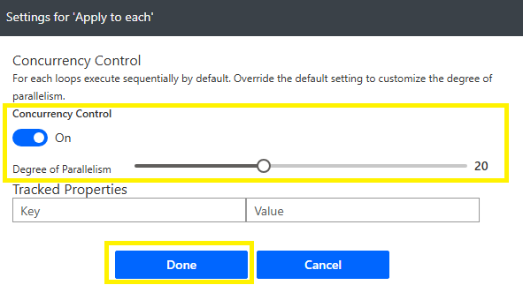
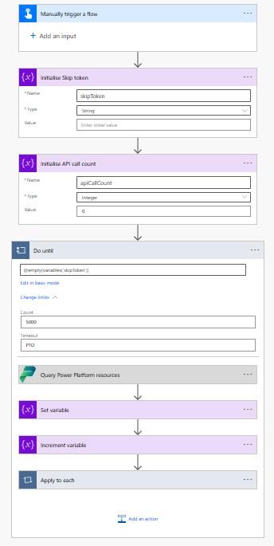
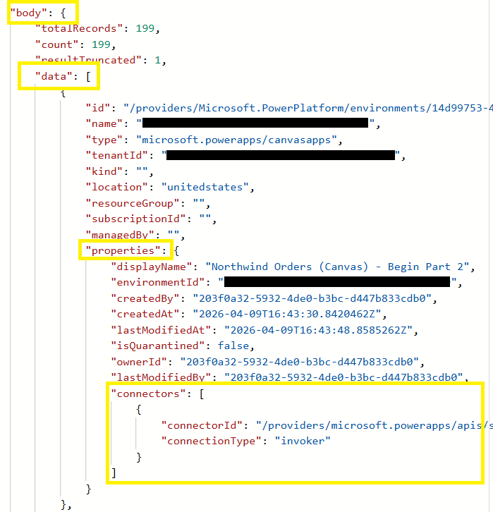

# Export inventory with a cloud flow

A governance report that lands in stakeholders' inboxes every week can't depend on someone clicking through the admin center. The same inventory behind the Maker inventory page and Azure Resource Graph is also reachable programmatically, and in this lab you put that to work: a Power Automate cloud flow that calls the inventory API through the **Power Platform for Admins V2** connector, pages through all results, and writes each resource to an Excel table. In this lab you trigger it manually; with a recurrence trigger it becomes a scheduled report.

## Prerequisites

- You can use **Power Platform for Admins V2** actions in the target tenant (the lab administrator account can).
- The flow owner has access to the location where the Excel file will be stored (OneDrive for Business or SharePoint).

## Step 1: Create the Excel workbook

The flow writes to an Excel table, so create the workbook first.

1. In **OneDrive for Business** or **SharePoint**, signed in as a user from your lab tenant, create an Excel workbook (for example, `PowerPlatformInventoryExport.xlsx`).
2. Rename the worksheet to **Inventory** (or keep the default Sheet1 — the table name is what matters).
3. In row 1, enter the following six column headers, one per cell (the descriptions are for your reference only — don't add them to the workbook):

   | Column header | Description |
   |--------------|-------------|
   | ResourceId | Unique identifier of the resource |
   | Name | Display name of the resource |
   | Type | Resource type (for example, canvas app, cloud flow) |
   | EnvironmentId | Identifier of the environment that contains the resource |
   | CreatedTime | Date and time the resource was created |
   | LastModifiedTime | Date and time the resource was last modified |

4. Select the six header cells, then select **Insert** > **Table**, and confirm that **My table has headers** is checked.
5. With the table selected, open the **Table Design** ribbon and rename the table to **InventoryTable**.

     
   Figure: Excel table InventoryTable with six columns.

6. Save and close the workbook.

## Step 2: Create the flow and initialize variables

The flow uses two variables: `skipToken` stores the paging token between iterations, and `apiCallCount` counts the API calls so you can see after a run how many pages were retrieved.

1. Go to [Power Automate](https://make.powerautomate.com) in your lab tenant and select **Create** > **Instant cloud flow**.
2. Name the flow **Export Power Platform inventory to Excel**, select the trigger **Manually trigger a flow**, and then select **Create**. The flow opens in the designer.

   > 📝 The screenshots in this lab show the **classic designer**. You can build the flow just as well in the new designer — the actions, parameters, and expressions are identical; only the layout and menus differ. Use the designer toggle in the command bar to switch between the two.

3. Add a new action below the trigger: search for **Initialize variable** and configure it:
   - **Name:** `skipToken`
   - **Type:** String
   - **Value:** *(leave blank)*
4. Add another **Initialize variable** action below it and configure:
   - **Name:** `apiCallCount`
   - **Type:** Integer
   - **Value:** `0`

     
   Figure: Two Initialize variable actions for skipToken and apiCallCount.

> 📝 Keep the default action names throughout this lab (for example, "Query Power Platform resources"). The expressions in later steps reference actions by name — renaming an action breaks them.

## Step 3: Add the paging loop

The API returns the inventory one page at a time. This loop requests the next page until none are left.

1. Add a **Do until** action below the variables.
2. Select the condition row, choose **Edit in advanced mode**, and enter:

   ```
   @empty(variables('skipToken'))
   ```

   > 💡 The Do until loop runs its body first, then checks the condition. On the first iteration, `skipToken` is empty but the loop body still runs. The API call inside the loop sets `skipToken` to the next page token (or to an empty string if there are no more pages). The loop exits when `skipToken` becomes empty — meaning all pages have been retrieved.

3. Expand the loop limits (**Change limits**) and set:
   - **Count:** `5000`
   - **Timeout:** `P1D`

   > 📝 A Do until loop stops when its condition is met **or** when it reaches its limits, and the defaults (60 iterations, one hour) can cut a large export short because each iteration retrieves one page and writes its rows to Excel one at a time. Raising the count to 5000 and the timeout to `P1D` (one day, in ISO 8601 duration format) ensures the loop ends only when `skipToken` is empty.

     
   Figure: Do until action with the condition and loop limits.

## Step 4: Query Power Platform resources

This action queries the same `PowerPlatformResources` table you used in Azure Resource Graph, one page per iteration.

1. Inside the **Do until** block, add a new action: **Power Platform for Admins V2** > **Query Power Platform resources**.
2. If prompted for an authentication type for the new connection, select **OAuth Connection** and sign in with your lab administrator credentials.
3. Configure the query action:
   - **Api-version:** `2022-03-01-preview`
   - **TableName:** `PowerPlatformResources`
   - **Clauses:** Switch the input to the entire array option, and paste the following JSON:

      ```json
      [
      {
         "$type": "where",
         "FieldName": "type",
         "Operator": "in~",
         "Values": [
            "'microsoft.powerapps/canvasapps'",
            "'microsoft.powerapps/modeldrivenapps'",
            "'microsoft.powerautomate/cloudflows'",
            "'microsoft.powerautomate/agentflows'",
            "'microsoft.copilotstudio/agents'",
            "'microsoft.powerapps/codeapps'",
            "'microsoft.powerapps/apps'",
            "'microsoft.powerautomate/m365agentflows'"
         ]
      }
      ]
      ```

   > 📝 The single quotes inside the double-quoted strings (for example, `"'microsoft.powerapps/canvasapps'"`) aren't a typo — the `in~` operator requires each value to be quoted this way. Paste the JSON exactly as shown.

   > 💡 These type values come from the [Power Platform inventory schema](https://learn.microsoft.com/en-us/power-platform/admin/inventory-schema) — the same table you queried in Azure Resource Graph. The query retrieves every app, flow, and agent type the inventory currently tracks; check the schema reference for new `type` values as the platform evolves, and trim the `Values` array if you only need specific types.

   > 💡 While building and testing the flow, you can temporarily add a second clause to the array — `{ "$type": "take", "TakeCount": 10 }` after the `where` clause — to cap the results at 10 rows so test runs finish in seconds. Remove it before the real run, or your export stops at 10 resources.

4. Expand **Advanced parameters** and set:
   - **SkipToken:** Select the `skipToken` variable from the dynamic content.

   The SkipToken parameter ensures the action returns the *next page* of results each time the loop runs.

     
   Figure: Query Power Platform resources action with Clauses and SkipToken configured.

## Step 5: Update the paging token and counter

Each iteration stores the token the API returned so the next pass fetches the next page. An empty string signals the loop to stop.

1. Still inside the Do until block, add a **Set variable** action and configure:
   - **Name:** `skipToken`
   - **Value:** Select the field, open the expression editor, and paste:

      ```
      coalesce(body('Query_Power_Platform_resources')?['skipToken'], '')
      ```

2. Add an **Increment variable** action and configure:
   - **Name:** `apiCallCount`
   - **Value:** `1`

     
   Figure: Set variable and Increment variable actions inside the Do until block.

## Step 6: Write results to Excel

Each page of results is an array of resources. This step loops through the array and writes one Excel row per resource.

1. Add an **Apply to each** action (still inside the Do until block, after the Increment variable action).
2. In the **Select an output from previous steps** field, open the expression editor and enter:

   ```
   body('Query_Power_Platform_resources')?['data']
   ```

3. Inside the **Apply to each** block, add **Excel Online (Business)** > **Add a row into a table**.
4. Configure the Excel action:
   - **Location:** OneDrive for Business *(or your SharePoint site)*
   - **Document Library** and **File:** Select your workbook
   - **Table:** InventoryTable
5. Map the Excel columns by using the following expressions (open the expression editor for each field):

   | Excel column | Expression |
   |-------------|------------|
   | **ResourceId** | `item()?['id']` |
   | **Name** | `item()?['properties']?['displayName']` |
   | **Type** | `item()?['type']` |
   | **EnvironmentId** | `item()?['properties']?['environmentId']` |
   | **CreatedTime** | `item()?['properties']?['createdAt']` |
   | **LastModifiedTime** | `item()?['properties']?['lastModifiedAt']` |

     
   Figure: Add a row into a table action with the column mappings.

   > ⚠️ The `lastModifiedAt` field isn't available for Copilot Studio agents — the **LastModifiedTime** column stays empty for agent resources, matching the dash you saw for agents in the Maker inventory.

   > 📝 After saving, the mapped fields may display only a shortened `item()` token in the designer. The full expression is preserved — you can confirm it in the field's expression view or the action's code view.

## Step 7: Configure concurrency and run the flow

Writing rows one at a time is the slowest part of the flow. Concurrency control lets it write several rows in parallel.

1. Select the **Apply to each** action and open its **Settings**.
2. Turn on **Concurrency control** and set:
   - **Degree of parallelism:** `20`

   > ⚠️ The Excel Online (Business) connector is subject to rate limiting. Setting parallelism too high (for example, 50) can cause throttling errors and failed rows. A value of 20 provides a good balance between speed and reliability. If you experience throttling, reduce this value further.

     
   Figure: Concurrency control settings on the Apply to each action.

     
   Figure: Degree of parallelism slider set to 20.

   The complete flow should look like this:

     
   Figure: Complete flow from trigger to Apply to each.

3. Select **Save**, and then run the flow (**Test** > **Manually**).
4. After the flow completes, open your Excel workbook and confirm that rows have been written to the **InventoryTable**. In the flow's run history, the final value of `apiCallCount` tells you how many pages your inventory took.

> 💡 If your tenant contains thousands of resources, writing one row at a time to Excel can be slow. For production use, consider writing results to a SharePoint list or a Dataverse table instead, which handle bulk inserts more efficiently — and replace the manual trigger with a **Recurrence** trigger to turn this into a scheduled report.

## Step 8: Inspect connector data in the output (optional)

The connector inventory you explored in earlier labs flows through here too: resources returned by the **Query Power Platform resources** action include a `powerPlatformConnectors` array (in preview) listing the connector IDs and operations each resource uses.

1. Open the flow's run history and select the run you just completed.
2. Expand the **Query Power Platform resources** action and inspect its output. Each resource includes a `powerPlatformConnectors` array.

     
   Figure: Query action run output showing the powerPlatformConnectors array.

> 📝 The same preview caveats apply as in the Azure Resource Graph lab: connectors bound as data sources report empty operations, and the array contains connector IDs only.

> ✅ You built a reusable cloud flow that retrieves all Power Platform resources from the inventory API and exports them to Excel, ready for scheduled governance reporting.

## Additional resources

- [Power Platform for Admins V2 connector (Microsoft Learn)](https://learn.microsoft.com/en-us/connectors/powerplatformadminv2/) — Reference for the connector's actions, including Query Power Platform resources and its parameters.
- [Query inventory data using the API (Microsoft Learn)](https://learn.microsoft.com/en-us/power-platform/admin/inventory-api) — The inventory API that the connector action calls, including the clause syntax and paging.

## Next lab

You know what exists and what matters. The next question is whether it's healthy: are apps opening and flows succeeding? Continue with [Monitor overview](08-monitor-overview.md).
