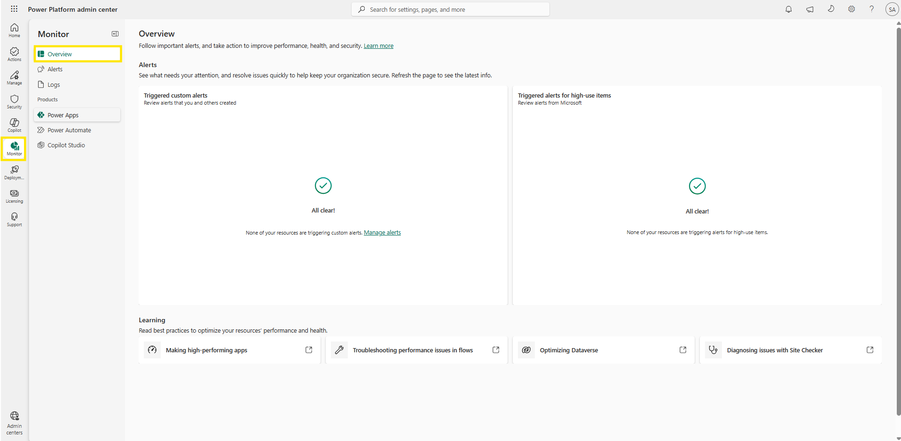
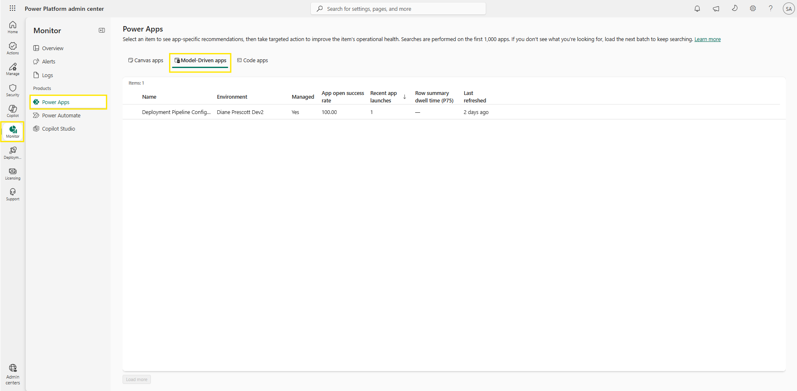
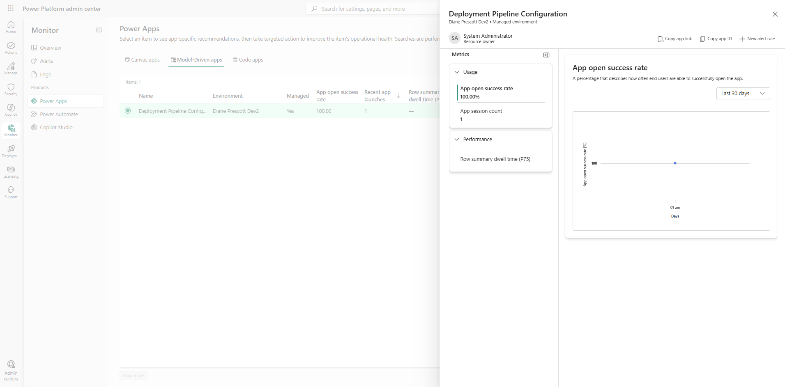

# Monitor overview

Consider the scenario from the module introduction: on a Monday morning, users report that an app won't open, and by the time it reaches you, the most-used app in the tenant has been failing for hours. The platform had the data before anyone complained, but nobody was watching. The first half of this module gave you visibility into what exists and what matters; this half is about knowing whether it's healthy. In this lab you open **Monitor** > **Overview**, select a resource, and review its health metrics.

> 💡 For more comprehensive and realistic insights, it's recommended that you use your production tenant when working through the monitoring labs. The data and logs you see reflect actual usage patterns in your organization, which can't easily be replicated in a lab environment. The steps below are read-only and don't modify or affect your existing assets.

## Prerequisites

- Tenant-level analytics must be turned on in the Power Platform admin center.
- You need a **Power Platform administrator** or **Dynamics 365 administrator** account.

## Step 1: Open Monitor overview

1. Sign in to the [Power Platform admin center](https://admin.powerplatform.microsoft.com/) using your lab environment administrator credentials.
2. In the left navigation pane, select **Monitor** > **Overview**.
3. Review the page: an **Alerts** section with two cards — **Triggered custom alerts** (alerts you and other admins create) and **Triggered alerts for high-use items** (alerts from Microsoft) — plus a **Learning** section linking performance best practices. Both cards show "All clear!" when nothing has been triggered.

     
   Figure: Monitor Overview page showing the Alerts cards and Learning section.

> 📝 The page contents might differ on your tenant depending on which alerts have been triggered.

## Step 2: Select a product and resource

1. In the left navigation menu under **Products**, you should see **Power Apps**, **Power Automate**, and **Copilot Studio**.
2. Select **Power Apps** (or another product that has activity in your tenant).
3. Select a tab — **Canvas apps**, **Model-driven apps**, or **Code apps** — that has items with recent usage. Each row shows the app's environment, whether it's managed, its app open success rate, and recent launches. These lists overlap with the high-use resources you identified on the Usage page.
     
   Figure: Monitor Power Apps page with the app tabs and health columns.

> 📝 Searches run against the first 1,000 apps loaded — in a large tenant, use **Load more** to bring further batches into view before searching.

## Step 3: Inspect health charts and recommendations

1. Select an item from the list below the tab you chose in the previous step. A details pane opens. Its header shows the resource's environment, its managed status, and its owner, along with **Copy app link**, **Copy app ID**, and **+ New alert rule** commands.
2. In the **Metrics** panel, the metrics are grouped — for example, **Usage** (app open success rate, app session count) and **Performance** (row summary dwell time). Select a metric to plot it on the chart, and use the time range selector above the chart to switch between the last 7, 14, or 30 days of daily aggregates.
3. Look for any recommendation cards in the pane. Recommendations appear only for resources in **Managed Environments** — and even there, only when Monitor detects something to improve. A healthy, lightly used lab app typically shows none. If a recommendation is present, select its action button, review it, and close it when done.
4. Close the pane to return to the resource list.

     
   Figure: Details pane showing grouped metrics and the App open success rate chart.

## Additional resources

- [Monitoring overview (Microsoft Learn)](https://learn.microsoft.com/en-us/power-platform/admin/monitoring/monitoring-overview) — What Monitor covers per product, the metrics and their retention, and the role of Managed Environments in recommendations.

## Next lab

A dipping success-rate chart tells you that something is wrong, not why. To see the events behind a metric, continue with [View and export logs](09-view-logs.md).
