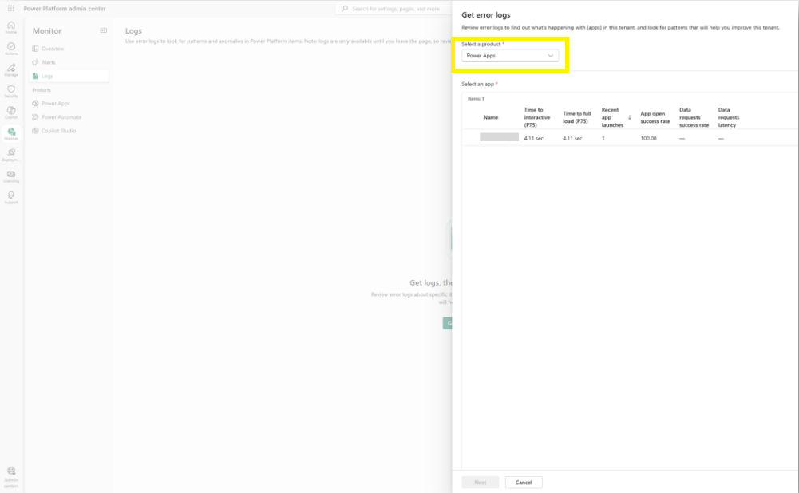
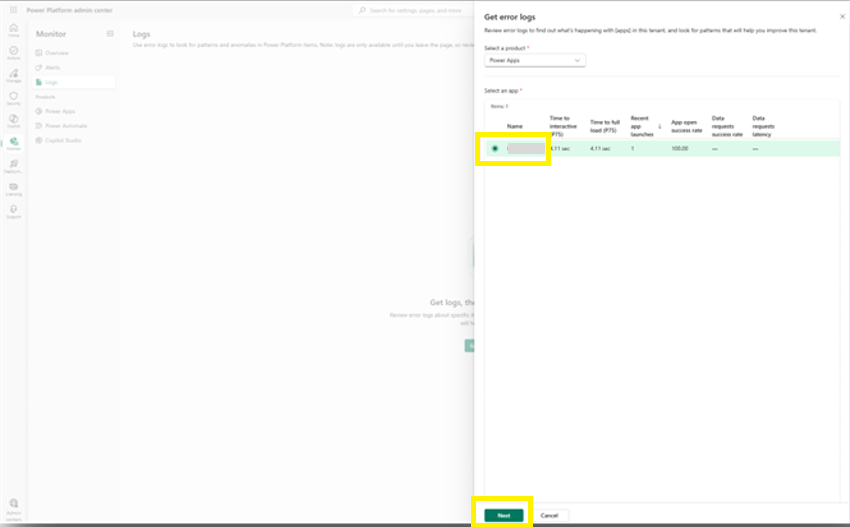
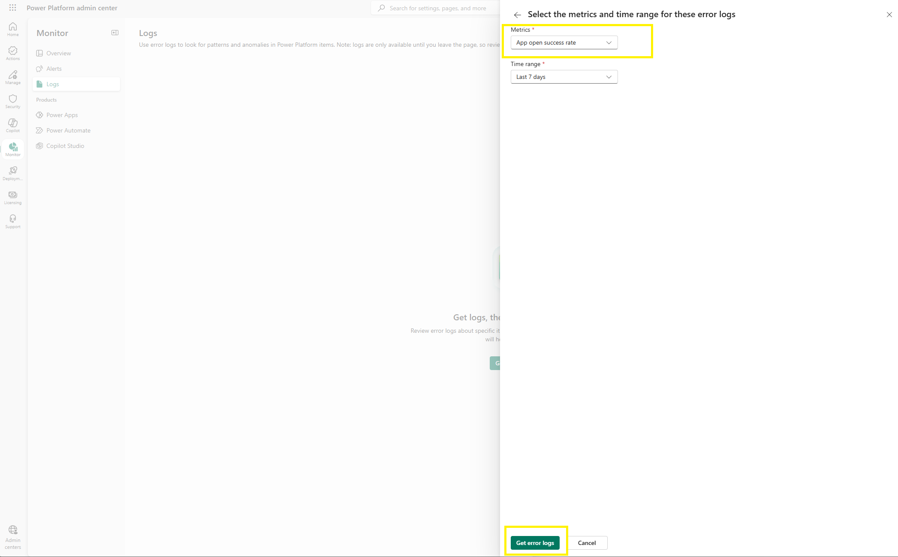
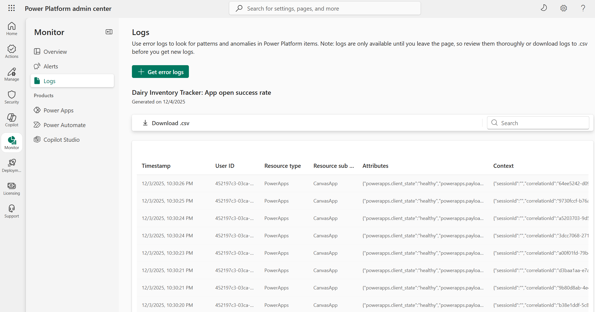

# View and export logs

A success-rate chart confirms that an app was failing, but not why — a connector timeout, a permissions error, or a change a maker made. The answers are in the runtime event logs. In this lab you go from a metric to the individual events behind it and export them for whoever needs to fix the problem.

## Step 1: Open the Get error logs panel

1. You should still be in the Power Platform admin center from the previous lab. If not, sign in to the [Power Platform admin center](https://admin.powerplatform.microsoft.com/) using your lab environment administrator credentials. Select **Monitor** > **Logs**, and then select **Get error logs** in the center of the page. The **Get error logs** panel opens.
2. In **Select a product**, choose a product (for example, **Power Apps**).

     
   Figure: Get error logs panel with the product dropdown and app list.

## Step 2: Select a resource and metric

1. In the **Select an app** list — which shows each app with its health metrics at a glance, just like the Monitor product pages — select an app with recent activity, then select **Next**.

     
   Figure: Select an app list in the Get error logs panel.
2. On the **Select the metrics and time range** page of the panel, choose a metric (for example, **App open success rate**) and a **Time range** (for example, **Last 7 days**). Then select **Get error logs**.

     
   Figure: Metrics and time range selection in the Get error logs panel.

## Step 3: Review the logs table

1. After selecting **Get error logs**, wait for the **logs table** to load. A header confirms what you generated — the resource name, the metric, and the generation date — and the entries beneath are the runtime events behind the metric you chose.

     
   Figure: Generated logs table.

2. Use the **Search** box above the table and the column sorting to narrow the entries to what you're investigating.

   A healthy lab tenant may have few or no error events — an empty logs table means nothing has failed. On a production tenant (as recommended at the start of the monitoring labs), this table shows the events behind real incidents.

> 📝 Two boundaries to know: logs cover up to **seven days** — a week less than the metrics themselves — and generated logs remain available **only until you leave the page**, so review them thoroughly or download them before you get new logs.

## Step 4: Export the logs

Export the logs to share them with the maker who needs the event details or to attach them to a support ticket.

1. Select **Download .csv** above the table to export the generated logs.
2. Save the file, open it on your machine, and confirm that you can see:
   - **Timestamps** and **User IDs** — who encountered the event, and when.
   - **Resource type** and **subtype** — which kind of resource the event came from.
   - **Attributes** — the event's details as JSON, including the client state.
   - **Context** — session and correlation IDs, which Microsoft Support asks for when you raise a ticket.

## Additional resources

- [Monitoring overview (Microsoft Learn)](https://learn.microsoft.com/en-us/power-platform/admin/monitoring/monitoring-overview) — What Monitor covers, including the availability and retention of metrics and event logs.

## Next lab

Charts and logs answer questions only after you ask. To be notified when a metric crosses a threshold, continue with [Create a custom alert rule](10-create-alert-rule.md).
