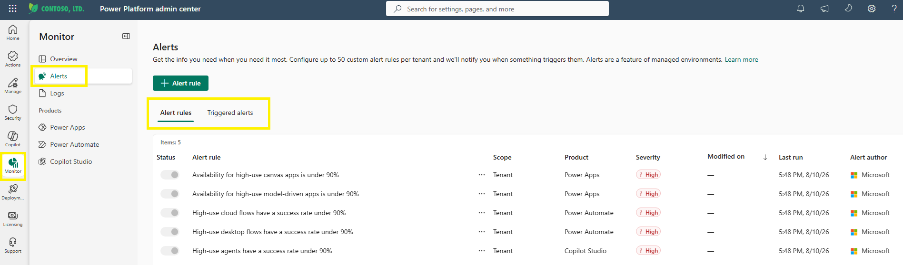
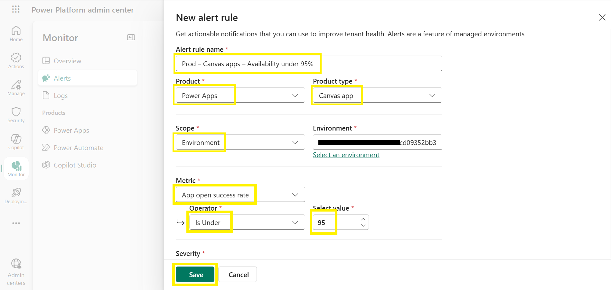
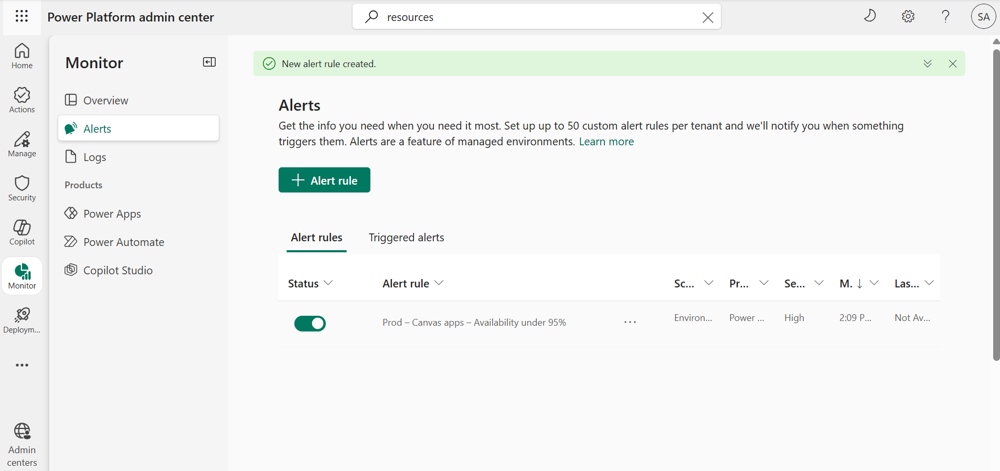

# Create a custom alert rule

Everything so far depends on you looking at charts and logs at the right moment. An alert rule reverses that: you define a threshold (for example, app open success rate under 95%), and the platform checks each day's metrics and emails you when a resource crosses it. In this lab you create a custom alert rule that watches a metric across one environment and notifies you when the condition is met.

## Prerequisites

- The environment you want to create alerts for must be a **Managed Environment** — alerts can only be placed on Managed Environments.
- You need a **Power Platform administrator** or **Dynamics 365 administrator** account. Environment administrators can also create and manage alerts for their own environments.

## Step 1: Open the Alerts page

1. You should still be in the Power Platform admin center from the previous lab. If not, sign in to the [Power Platform admin center](https://admin.powerplatform.microsoft.com/) using your lab environment administrator credentials. Select **Monitor** > **Alerts**. The **Alerts** page opens.
2. Briefly review the two tabs:
   - **Alert rules** — rules you create and manage.
   - **Triggered alerts** — instances where a rule's condition has been met.
3. Notice that the **Alert rules** list isn't empty even before you've created anything: Microsoft provides predefined, tenant-wide rules for high-use resources — the **Alert author** column shows **Microsoft** for these.

     
   Figure: Alerts page showing the Alert rules and Triggered alerts tabs.

## Step 2: Configure the alert rule

1. On the **Alert rules** tab, select **+ Alert rule**. The **New alert rule** pane appears.
2. Fill in the basic rule details. For this lab, build a rule that watches canvas app availability:
   - **Alert rule name** — Enter a descriptive name that states the scope and the condition:

     ```
     Canvas apps - Availability under 95%
     ```

   - **Product** — Select **Power Apps**. (**Power Automate** and **Copilot Studio** rules work the same way.)
   - **Product type** — Select **Canvas app**. (Depending on the product, other types are available here, such as **Model-driven app**, **Code app**, **Cloud flow**, **Desktop flow**, **Work queue**, or **Agent**.)
3. Under **Scope**, select **Environment** to monitor all items of the chosen type within one environment. (The alternative, **Resource**, watches one specific item instead.)
4. In the **Environment** field, use the **Select an environment** link to choose a Managed Environment that contains apps or flows worth watching (for example, your production environment — or, in the lab tenant, one of the environments marked as managed).

   > ⚠️ Alerts can only be placed on Managed Environments. If you select an environment that isn't managed yet, you might be prompted to enable it as managed first.

## Step 3: Set the metric and threshold

1. Under **Metric**, select **App open success rate**. (The metrics on offer depend on the product type you chose — for flows, for example, you'd pick a run success rate.)
2. Configure the condition:
   - **Operator** — Select **Is Under**. (**Is Over** and **Equals** are available for conditions that work the other way.)
   - **Select value** — Use the arrow icons to set the threshold to `95`, meaning the rule fires when the success rate drops below 95%.

     
   Figure: New alert rule pane with metric, operator, and threshold configured.

3. Set **Severity** to **High** — this rule guards the availability of apps in the environment you selected. (Choose **Medium** or **Low** for less critical conditions.)

   > 💡 Severity is a classification label for triage and reporting only — it doesn't change how often the rule is evaluated or how notifications are sent.

## Step 4: Configure notifications and save

1. Under **Notification type**, choose:
   - **Email**, then confirm your own email address is shown as a recipient, and optionally add up to four additional recipients (for example, a shared operations mailbox).
   - Alternatively, select **None** if you prefer to check the admin center manually.
2. Select **Save** to create the alert rule. A "New alert rule created" confirmation appears. An on-demand evaluation runs against the resources in scope; after creation, the rule is evaluated every 24 hours as new daily metric aggregates are produced.
3. Back on the **Alert rules** tab, confirm that your rule appears in the list with its **Status** toggle switched on. The **Last run** column may show **Not available** at first — check back after the initial evaluation has had time to complete.

     
   Figure: Alert rules tab showing the new rule with Status set to On.

> 💡 A tenant can have up to **50 custom alert rules**, so name and scope them deliberately. For a single critical resource, the **+ New alert rule** button in its Monitor details pane creates a rule scoped to just that resource.

> ✅ The platform now watches the metric and notifies you when it crosses the threshold.

## Additional resources

- [Alerts in Monitor (Microsoft Learn)](https://learn.microsoft.com/en-us/power-platform/admin/monitoring/alerts) — Custom and predefined alert rules, scopes, metrics, notifications, and evaluation cadence.

## Next lab

Your rule is on and evaluates daily. See where its results appear, and review the predefined alerts Microsoft provides, in [Review triggered and predefined alerts](11-review-alerts.md).
