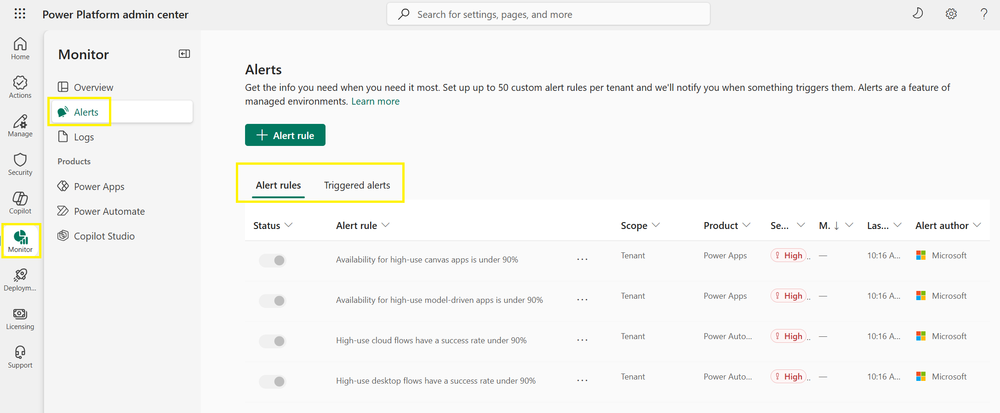
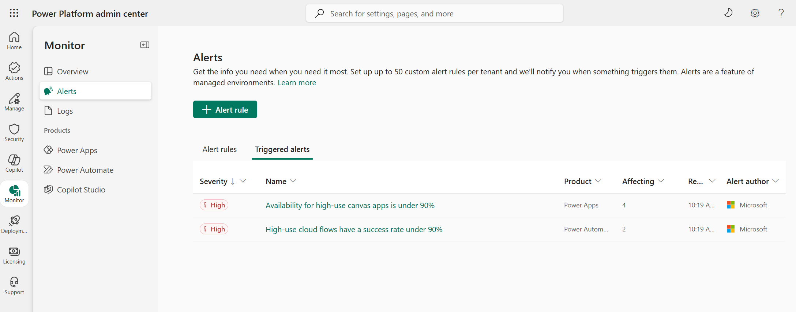
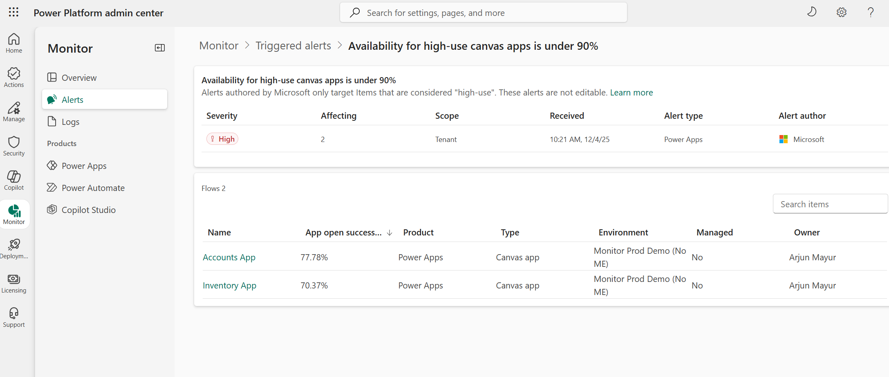
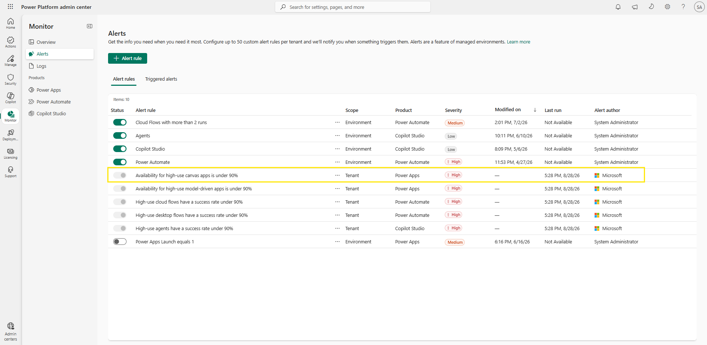

# Review triggered and predefined alerts

Your custom rule evaluates daily, and Microsoft's predefined rules watch your high-use resources tenant-wide. In this final lab you review where their output appears: the Triggered alerts tab, the notification email, and the cards on the Monitor overview page.

## Step 1: Check triggered alerts

1. You should still be in the Power Platform admin center from the previous lab. If not, sign in to the [Power Platform admin center](https://admin.powerplatform.microsoft.com/) using your lab environment administrator credentials. Select **Monitor** > **Alerts** and then select the **Triggered alerts** tab.
2. Check whether any alerts have been triggered. Each triggered alert appears with its **Severity**, the **Product**, the number of resources **Affecting** it, when it was received, and the **Alert author**.

     
   Figure: Triggered alerts tab.

3. Select a triggered alert's name to open its details page. The header summarizes the alert — severity, scope, when it was received — and beneath it, the affected resources are listed with their current metric values, environment, and owner.

     
   Figure: Triggered alert details page listing the affected resources.

> 📝 An empty list means the rule ran and nothing crossed the threshold.

## Step 2: Check the notification email

1. If your custom rule has triggered and you configured **Email** notifications, open your mailbox and look for an email from `PowerPlat-noreply@microsoft.com`.
2. Select **Go to alert** in the email to open the triggered alert view in the admin center.

     
   Figure: Alert notification email with the Go to alert button.

## Step 3: Review the Monitor overview cards

1. Go back to **Monitor** > **Overview** and review the two **Alerts** cards:
   - **Triggered custom alerts** summarizes the rules you and other admins created, helping you focus on priority resources.
   - **Triggered alerts for high-use items** summarizes Microsoft's predefined alerts for your busiest resources.
2. If either card shows triggered alerts, select an item — for example, **High-use cloud flows have a success rate under 90%** — to open the list of affected resources and their metric trends. If both say "All clear!", no rule has been triggered.

## Step 4: Review the predefined alert rules

1. Return to **Monitor** > **Alerts** and select the **Alert rules** tab. The predefined rules sit in the same list as your custom rule — the **Alert author** column shows **Microsoft** for them, and their **Scope** is **Tenant**. They cover availability and success rates for high-use canvas apps, model-driven apps, cloud flows, desktop flows, and agents.

     
   Figure: Alert rules tab showing the Microsoft-authored predefined rules.

2. Select the ellipsis (**…**) next to one of them and choose **Details** to review its configuration — the metric, the 90% threshold, and the tenant-wide scope.

> 💡 Alerts authored by Microsoft only target items that are considered "high-use," and these alerts are not editable. They serve as a baseline safety net across your tenant; use custom alert rules, like the one you created, for more granular control over specific environments, resources, metrics, and thresholds.

> 📝 At the time of writing, "high-use" has fixed thresholds: at least 100 recent launches for canvas and model-driven apps, 150 daily runs for cloud flows, 100 daily runs for desktop flows, and 200 recent sessions for agents. Unlike your custom rules, predefined alerts flag affected resources **regardless of whether they're in a managed environment**, and they don't send email notifications — the **Triggered alerts for high-use items** card on the Overview page is where their results surface, so check that page regularly.

> ✅ Your metric is evaluated daily, a triggered alert appears in the Triggered alerts tab and in your inbox, and Microsoft's predefined rules cover high-use resources you haven't written rules for.

> 🥳 Congratulations! You completed the Inventory and Monitoring module. You now have a searchable inventory, repeatable queries, automated reporting, usage insight, and a monitoring system that notifies you when something needs attention.

## Additional resources

- [Alerts in Monitor (Microsoft Learn)](https://learn.microsoft.com/en-us/power-platform/admin/monitoring/alerts) — Custom and predefined alert rules, how they're evaluated, and where triggered alerts appear.
