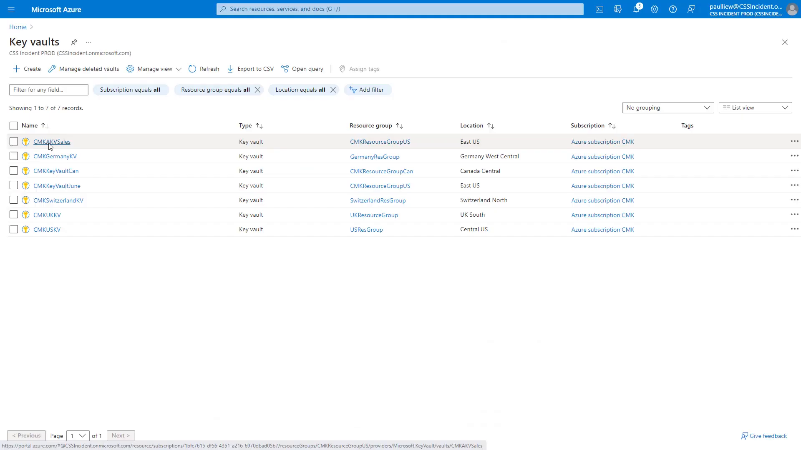
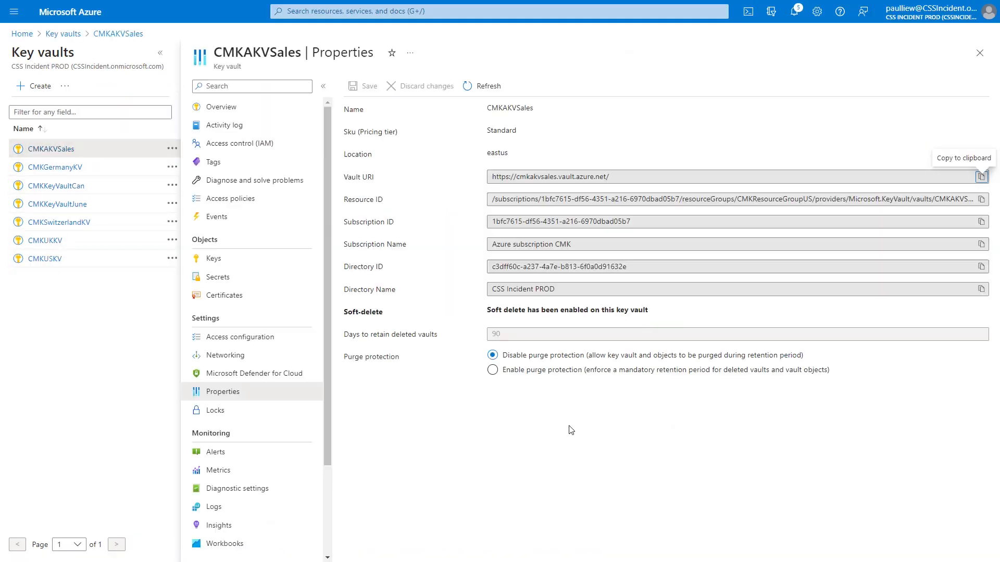
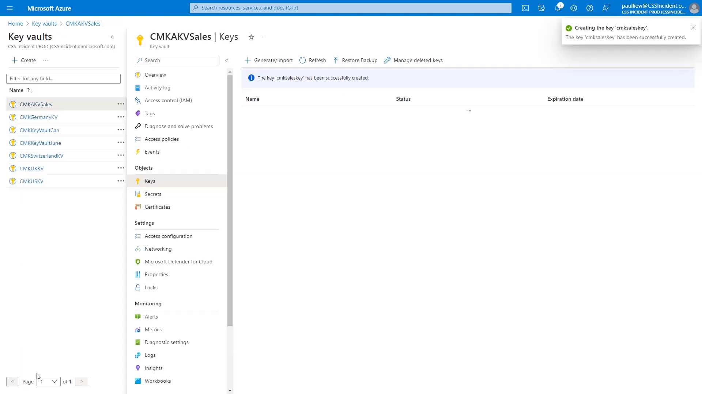

# Prepare your Azure Key Vault

Your Azure Key Vault holds the encryption key that Power Platform will use. For Woodgrove Bank, this vault is the anchor of key ownership: the bank's security team governs who can access it, when the key rotates, and — if ever needed — when the key is disabled to revoke access to the data.

Before you create the key, confirm that the vault meets the CMK requirements.

**Why these requirements matter:**

- **Soft-delete.** If a key or the vault is deleted, it can be recovered during the retention period instead of being lost — and with it, the ability to decrypt your environment data.
- **Purge protection.** Prevents anyone (including administrators) from permanently deleting the key during the retention period, protecting you against accidental or malicious data loss.
- **Same region as the environment.** The enterprise policy you create later can only be applied to environments in the same Azure region as the vault and policy.

## Step 1: Open your key vault

1. Sign in to the [Azure portal](https://portal.azure.com/) using your lab environment administrator credentials.
2. Search for and open **Key vaults**.
3. Select the key vault you want to use for CMK, or create a new one in the **same region** as your Power Platform environment. This lab uses the vault `CMKAKVSales` in the resource group `CMKResourceGroupUS`.

     
   Figure: Select the vault you will use for CMK.

## Step 2: Confirm soft-delete and purge protection

1. In the vault, under **Settings**, select **Properties**.
2. Confirm that **Soft-delete** is enabled.
3. Confirm that **Purge protection** is enabled. If it is not, select **Enable purge protection**, and then select **Save**.

     
   Figure: Soft-delete and purge protection must both be enabled for CMK.

   > ⚠️ Both soft-delete and purge protection are required for customer-managed keys. Once purge protection is enabled, it cannot be turned off again for that vault.

## Step 3: Create the encryption key

1. In the vault, under **Objects**, select **Keys**.
2. Select **Generate/Import**.
3. Enter a name for the key, for example:
   ```
   cmksaleskey
   ```
4. Keep the key type as **RSA**, and then select **Create**.
5. Confirm the notification: **The key 'cmksaleskey' has been successfully created**.

     
   Figure: The encryption key is created in the vault.

> 📝 Note the key name and its current version. You will reference both in the enterprise policy template in the next lab. To find the version, select the key and copy the identifier of the current version.

## Next lab

Continue with [Create the enterprise policy](02-create-enterprise-policy.md) to link Power Platform to your new key.
