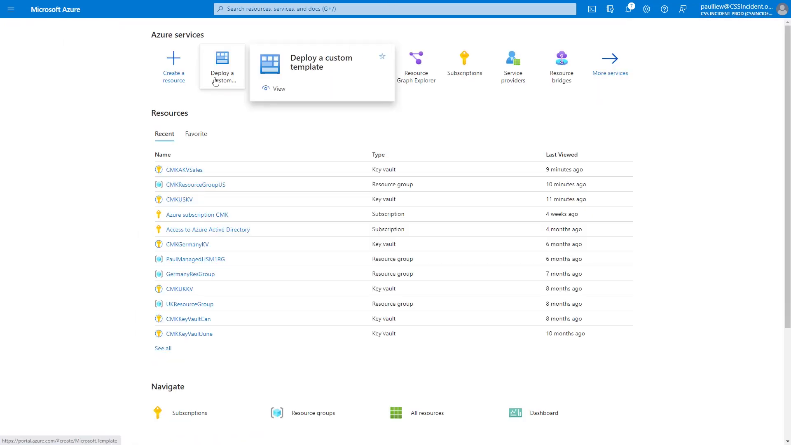
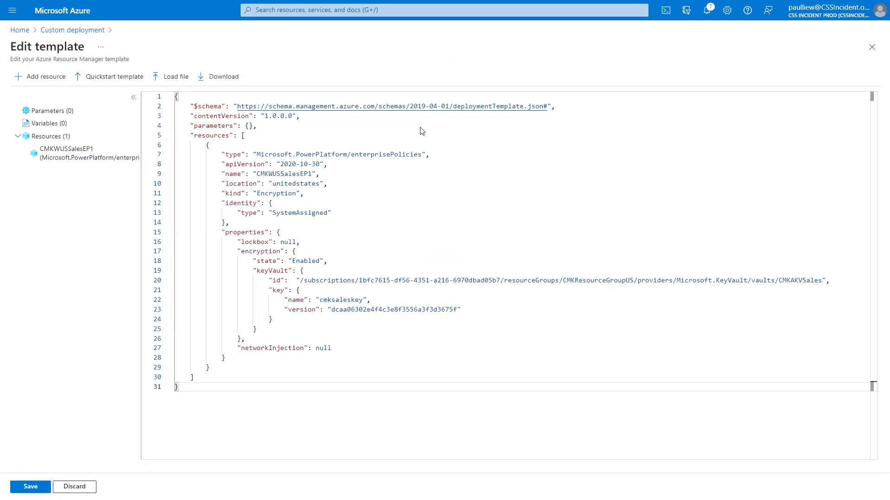
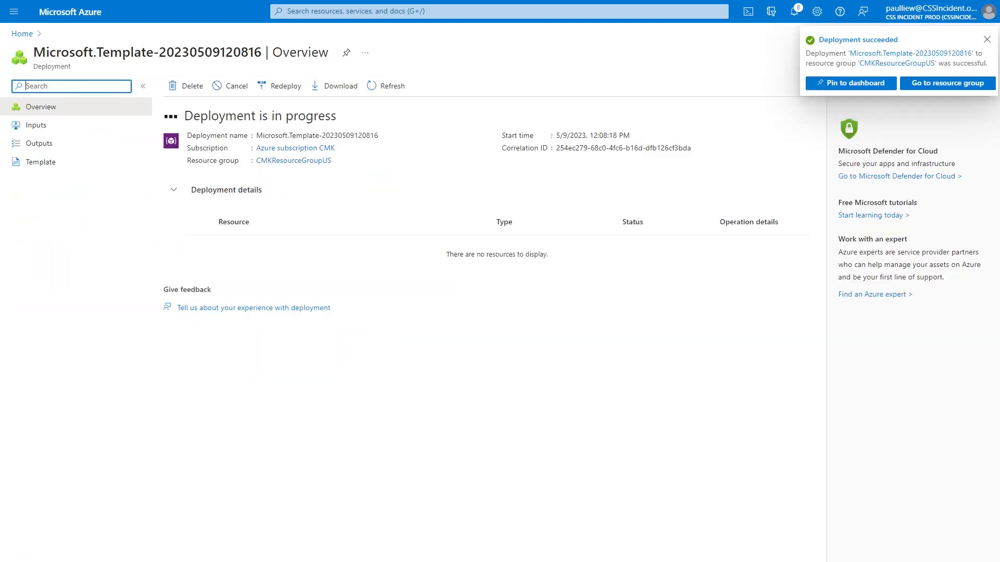

# Create the enterprise policy

The enterprise policy is the link between Power Platform and the key in your vault. It is an Azure resource of type `Microsoft.PowerPlatform/enterprisePolicies` — essentially a pointer that says "encrypt with this key, in this vault." You create it by deploying a small ARM template.

For Woodgrove Bank, the policy also plays an audit role: because it is an Azure resource, its creation, changes, and role assignments all appear in the Azure activity log, giving the risk team a verifiable trail of who configured encryption and when.

> ⚠️ The enterprise policy experience is currently in **preview**. A policy can only be applied to environments in the same Azure region as the policy, so create a separate policy for each region you operate in.

## Step 1: Start a custom template deployment

1. Sign in to the [Azure portal](https://portal.azure.com/) using your lab environment administrator credentials.
2. On the Azure portal home page, select **Deploy a custom template**. If the tile is not visible, search for `Deploy a custom template` in the top search bar.
3. On the **Custom deployment** page, select **Build your own template in the editor**.

      
    Figure: Start a custom template deployment from the Azure portal.

## Step 2: Build the enterprise policy template

1. Replace the editor contents with the enterprise policy template below:

   ```json
   {
     "$schema": "https://schema.management.azure.com/schemas/2019-04-01/deploymentTemplate.json#",
     "contentVersion": "1.0.0.0",
     "parameters": {},
     "resources": [
       {
         "type": "Microsoft.PowerPlatform/enterprisePolicies",
         "apiVersion": "2020-10-30",
         "name": "CMKWUSSalesEP1",
         "location": "unitedstates",
         "kind": "Encryption",
         "identity": {
           "type": "SystemAssigned"
         },
         "properties": {
           "lockbox": null,
           "encryption": {
             "state": "Enabled",
             "keyVault": {
               "id": "/subscriptions/<your-subscription-id>/resourceGroups/<your-rg>/providers/Microsoft.KeyVault/vaults/<your-vault-name>",
               "key": {
                 "name": "cmksaleskey",
                 "version": "<your-key-version>"
               }
             }
           },
           "networkInjection": null
         }
       }
     ]
   }
   ```

2. Set the policy `name` (this lab uses `CMKWUSSalesEP1`) and `location` (the region of your environment, for example `unitedstates`).
3. In `keyVault.id`, enter the full resource ID of your key vault.
4. In `key`, enter the `name` and `version` of the key you created in [Prepare your Azure Key Vault](01-prepare-key-vault.md).
5. Select **Save**.

      
    Figure: Update the policy name, location, key vault resource ID, key name, and key version to match your environment.

    > 📝 In the template, `kind` is set to `Encryption` and `identity.type` is `SystemAssigned`. This gives the policy its own managed identity, which you will grant access to the key vault in the next lab. The names above are examples — replace them with your own values.

## Step 3: Deploy and confirm

1. Select **Review + create**, and then select **Create** to deploy the template to your resource group (this lab uses `CMKResourceGroupUS`).
2. Wait for the deployment to finish, and then confirm the **Deployment succeeded** notification.

      
    Figure: The enterprise policy has been created.

> ✅ The enterprise policy now exists as an Azure resource with its own managed identity. It cannot use your key yet — that access is granted in the next lab.

## Next lab

Continue with [Grant the enterprise policy access](03-grant-policy-access.md).
