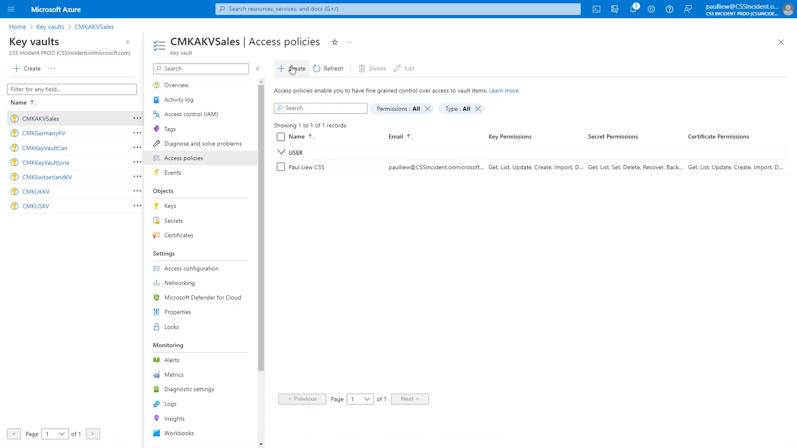
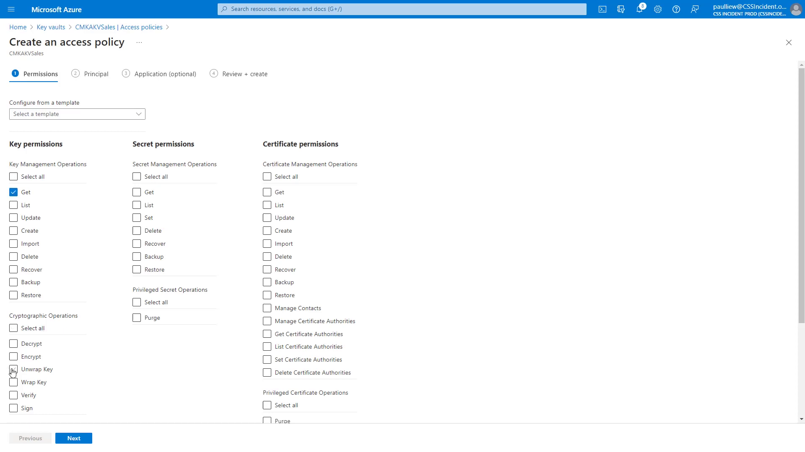
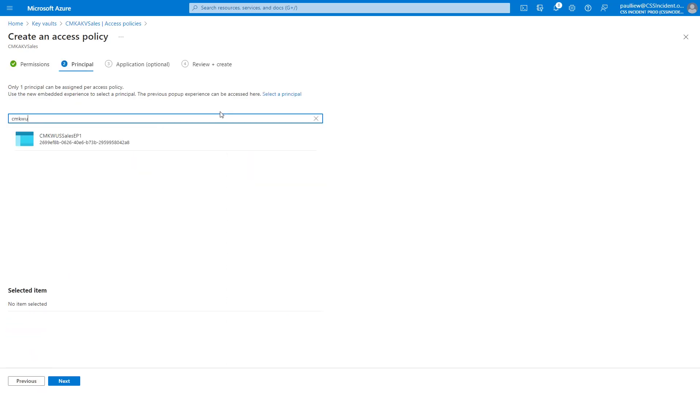
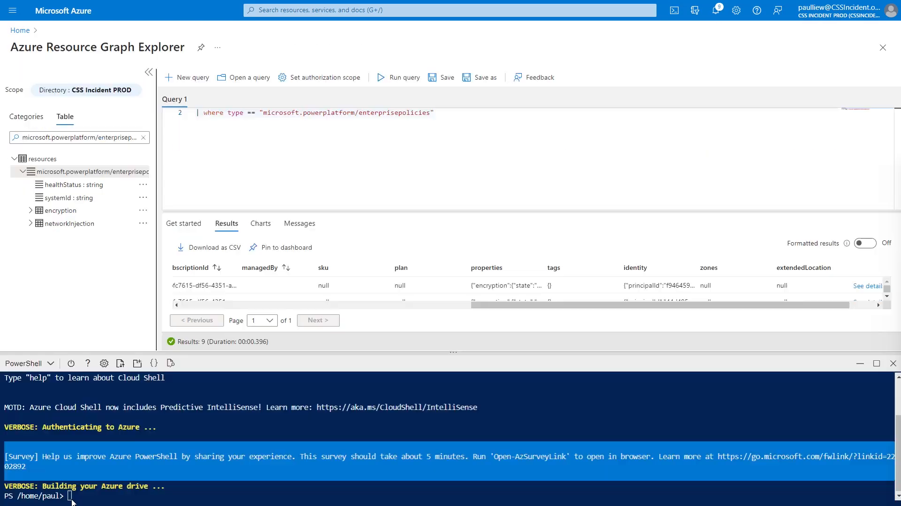
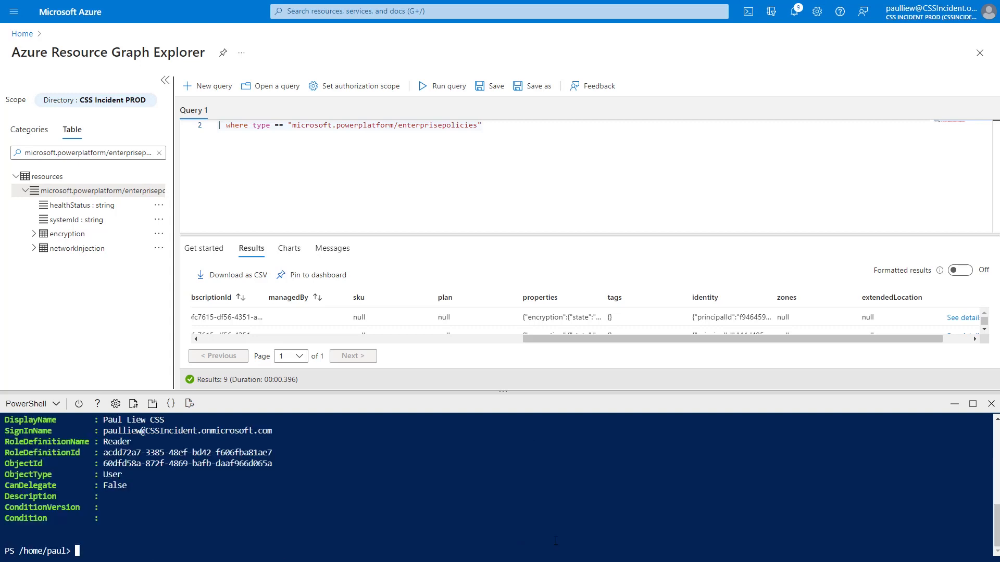

# Grant the enterprise policy access

The enterprise policy now exists, but it cannot use your key until you grant its managed identity access to the vault. You do this in two parts:

- **A key vault access policy** that allows the key operations Power Platform needs.
- **A Reader role assignment** on the enterprise policy resource, so that the Power Platform service can read the policy when you apply it to an environment.

This step is where Woodgrove Bank's least-privilege principle comes in: the policy receives exactly the three key permissions required to encrypt and decrypt environment data — nothing more. It never gets permission to delete the key, read secrets, or manage the vault.

## Step 1: Create a key vault access policy

1. Sign in to the [Azure portal](https://portal.azure.com/) using your lab environment administrator credentials.
2. Open your key vault (this lab uses `CMKAKVSales`).
3. Under **Settings**, select **Access policies**.
4. Select **Create**.

     
   Figure: Add a new access policy for the enterprise policy.

## Step 2: Select the key permissions

1. On the **Permissions** step, under **Key permissions**, select **Get**.
2. Under **Cryptographic Operations**, select **Wrap Key** and **Unwrap Key**.
3. Leave the Secret and Certificate permissions unselected, and then select **Next**.

     
   Figure: Get, Wrap Key, and Unwrap Key are the only permissions the policy needs.

   > 💡 **Get**, **Wrap Key**, and **Unwrap Key** are the only key permissions the enterprise policy needs to encrypt and decrypt your environment data. Granting nothing else keeps the configuration aligned with least privilege.

## Step 3: Select the enterprise policy as the principal

1. On the **Principal** step, search for the name of your enterprise policy (this lab uses `CMKWUSSalesEP1`).
2. Select the policy from the results, and then select **Next**.
3. Skip the **Application** step, select **Review + create**, and then select **Create**.

     
   Figure: The enterprise policy's managed identity is the principal of the access policy.

   > 📝 While on the Principal step, note the object (principal) ID shown for the enterprise policy. You will need it for the role assignment in Step 5.

## Step 4: Verify the policy with Azure Resource Graph (optional)

1. In the Azure portal, open **Azure Resource Graph Explorer**.
2. Run the following query:

   ```kusto
   where type == "microsoft.powerplatform/enterprisepolicies"
   ```

3. Confirm that your enterprise policy appears in the results.

     
   Figure: Use Resource Graph to confirm the policy exists and to copy its details.

## Step 5: Grant the Reader role to the enterprise policy

1. Open Azure Cloud Shell and switch to **PowerShell**.
2. Locate the object (principal) ID of your enterprise policy — you can copy it from the Principal step in Step 3, or from Azure Resource Graph.
3. Assign the **Reader** role to the enterprise policy at its resource scope. The command below is representative — replace the placeholders with your values:

   ```powershell
   New-AzRoleAssignment `
     -ObjectId <enterprise-policy-object-id> `
     -RoleDefinitionName "Reader" `
     -Scope "/subscriptions/<your-subscription-id>/resourceGroups/<your-rg>/providers/Microsoft.PowerPlatform/enterprisePolicies/<your-policy-name>"
   ```

4. Confirm that the output shows `RoleDefinitionName : Reader`.

     
   Figure: The Reader role assignment is confirmed in the command output.

   > 💡 The Reader role lets the Power Platform service read the enterprise policy so that it can be applied to your environment in the next lab.

## Next lab

Continue with [Apply the policy to your environment](04-apply-policy-to-environment.md).
