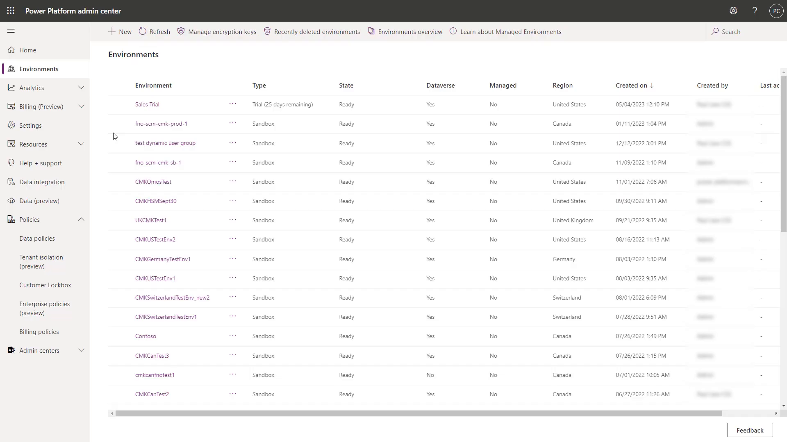
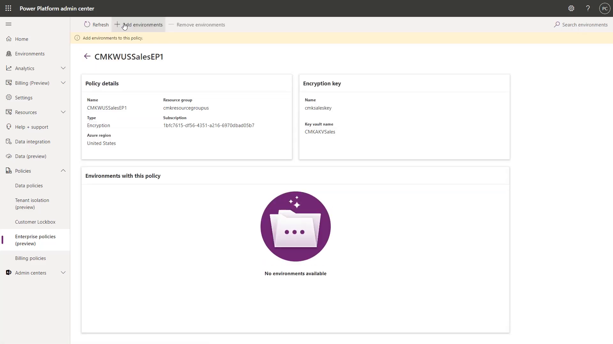
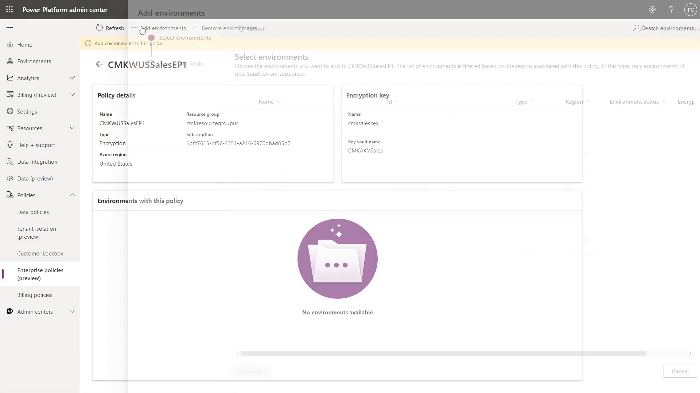
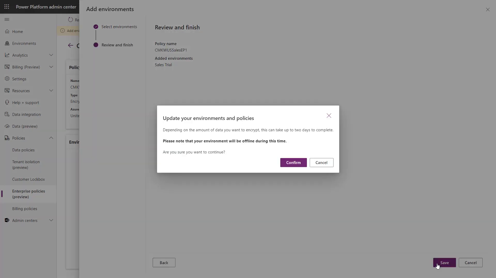
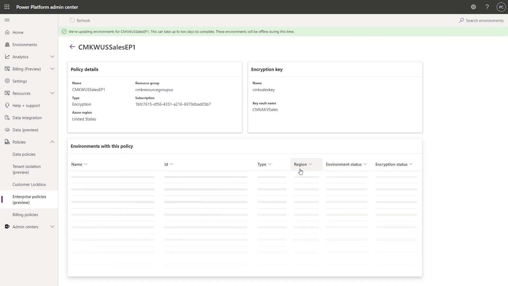

# Apply the policy to your environment

With the key vault access and the Reader role in place, you can now attach the enterprise policy to a Power Platform environment. From that point on, the environment data is encrypted with Woodgrove Bank's own key — and the bank's risk team has its "kill switch": disabling the key in the vault revokes access to the data.

This final step is done in the Power Platform admin center.

> ⚠️ When you confirm this change, the environment is **taken offline** and encryption begins. Depending on the amount of data, this can take up to two days to complete. In a production tenant, schedule this during a planned maintenance window and communicate the downtime to environment users in advance.

## Step 1: Open the Power Platform admin center

1. Sign in to the [Power Platform admin center](https://admin.powerplatform.microsoft.com/) using your lab environment administrator credentials.
2. Select **Environments** and confirm you can see the environment you want to encrypt (this lab uses `Sales Trial`).

      
    Figure: Confirm the target environment is visible in the admin center.

## Step 2: Open your enterprise policy

1. Expand **Policies** and select **Enterprise policies (preview)**.
2. Select your policy (this lab uses `CMKWUSSalesEP1`) to open its details.
3. Confirm that the **Encryption key** and **Key vault name** match the key you created in [Prepare your Azure Key Vault](01-prepare-key-vault.md).
4. Select **Add environments**.

      
    Figure: The policy shows the linked key and vault; no environments are attached yet.

    > 💡 A policy is a pointer to a key in your Azure Key Vault. It can be added to multiple environments, as long as they are in the same region as the policy — this is how CMK scales: rather than an environment group rule, one enterprise policy protects as many environments as you attach to it.

## Step 3: Select the environment

1. On the **Select environments** step, choose the environment you want to encrypt (this lab uses `Sales Trial`).
2. Select **Continue**.

      
    Figure: The list is filtered to environments in the same region; only Sandbox environments are supported in the preview.

## Step 4: Review, save, and confirm

1. On the **Review and finish** step, confirm the policy name and the added environment.
2. Select **Save**.
3. In the **Update your environments and policies** dialog, read the warning, and then select **Confirm**.

  
Figure: Confirming takes the environment offline and starts encryption.

## Step 5: Monitor encryption status

1. On the policy page, note the banner: **We're updating environments for CMKWUSSalesEP1. This can take up to two days to complete**.
2. Use the **Environments with this policy** list to track each environment's **Environment status** and **Encryption status**.
3. When encryption completes, your environment data is encrypted with your customer-managed key.

      
    Figure: Track encryption progress in the Environments with this policy list.

## Step 6: Validate the configuration

Use the checklist below to confirm that Woodgrove Bank's key ownership requirement is fully met:

1. The enterprise policy lists your environment under **Environments with this policy**.
2. The environment's **Encryption status** shows it is encrypted with your key.
3. The key vault access policy grants the enterprise policy **Get**, **Wrap Key**, and **Unwrap Key** — and nothing more.
4. The enterprise policy has the **Reader** role at its resource scope.

> ✅ The environment data is now encrypted with a key that your organization creates, rotates, and can revoke.

> 📝 Remember the CMK preview constraints: policies apply to environments in the same region only (create a separate policy per region), only Sandbox environments are supported in the preview experience, the vault requires soft-delete and purge protection, and the environment is offline during encryption.

> 🥳 Congratulations! You completed the Customer-managed keys (CMK) module. You prepared an Azure Key Vault, created an enterprise policy, granted it least-privilege access, and encrypted a Power Platform environment with your own customer-managed key.

## Further reading

- [Manage your customer-managed encryption key](https://learn.microsoft.com/en-us/power-platform/admin/customer-managed-key)
- [Azure Key Vault soft-delete overview](https://learn.microsoft.com/en-us/azure/key-vault/general/soft-delete-overview)
- [Azure Key Vault purge protection](https://learn.microsoft.com/en-us/azure/key-vault/general/soft-delete-overview#purge-protection)
- [Assign Azure roles using Azure PowerShell](https://learn.microsoft.com/en-us/azure/role-based-access-control/role-assignments-powershell)
