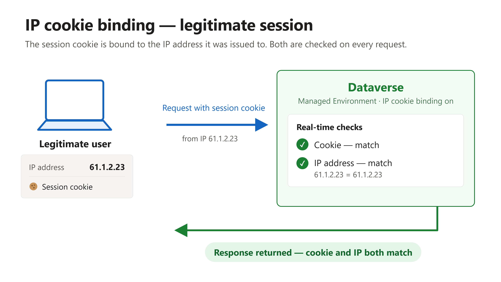
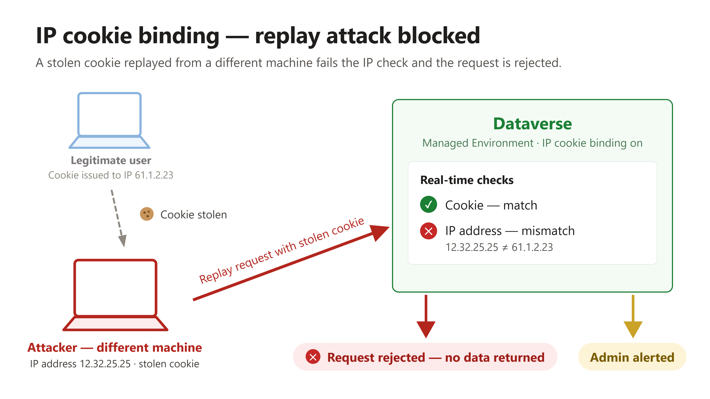

# Understand IP cookie binding

Before enabling the feature, it helps to understand exactly what it protects against. This lab walks through a cookie replay attack step by step — first the legitimate session, then the attack, then how Dataverse stops it when IP cookie binding is enabled.

## Step 1: Understand what a cookie replay attack is

A cookie replay attack occurs when an attacker intercepts a valid session cookie and exploits it to impersonate the user who originally created it. If you are signed in to a Power Platform environment and someone gets hold of your cookie, that cookie can be used on a different machine to access the same environment as you — without ever entering your credentials.

This works because the cookie *is* the proof of authentication. Sign-in, password checks, and multifactor authentication all happened on the legitimate machine; the replayed request skips them entirely.

## Step 2: Follow a legitimate session

When a user accesses a Dataverse environment and is authenticated, two pieces of information become relevant:

1. The **IP address** of the user's machine — in this example, `61.1.2.23`.
2. The **session cookie** issued for this authenticated connection to the environment.

With IP cookie binding enabled on a managed environment, Dataverse evaluates both on every request, in real time. When the cookie is valid *and* the request comes from the IP address the cookie was issued to, the response is returned as normal — the legitimate user notices nothing.

  
Figure: In a legitimate session, the cookie and the IP address both match, and Dataverse returns the response.

## Step 3: Follow the replay attack

Now the attacker enters the picture:

1. The attacker works from a **different machine**, so they have a different IP address — in this example, `12.32.25.25`.
2. The attacker **gets hold of the user's cookie** and sends it to Dataverse from their own machine, attempting to impersonate the user. This is the cookie replay attack.
3. Dataverse checks two things: the **cookie** and the **IP address**. The cookie matches — it is a genuine, valid cookie. But the IP address does not match the address the cookie was originally issued to.
4. Because both must match, the request is **rejected** and no data is returned. In addition, an **alert is raised** so the administrator knows a cookie replay attack may be occurring in the system.

  
Figure: The stolen cookie matches, but the IP address does not — Dataverse rejects the request and alerts the administrator.

> 💡 Without Managed Environment and this feature enabled, Dataverse only validates the cookie — a valid stolen cookie would receive a response. Cookie binding adds the second, real-time IP check that turns a stolen cookie from a working key into a tripwire.

> ✅ You can now explain the full logic: cookie **and** IP address must both match the values from where the cookie was originally created, or the Dataverse API rejects the request.

## Next lab

Continue with [Enable IP cookie binding](02-enable-ip-cookie-binding.md) to turn the feature on for your environment.
