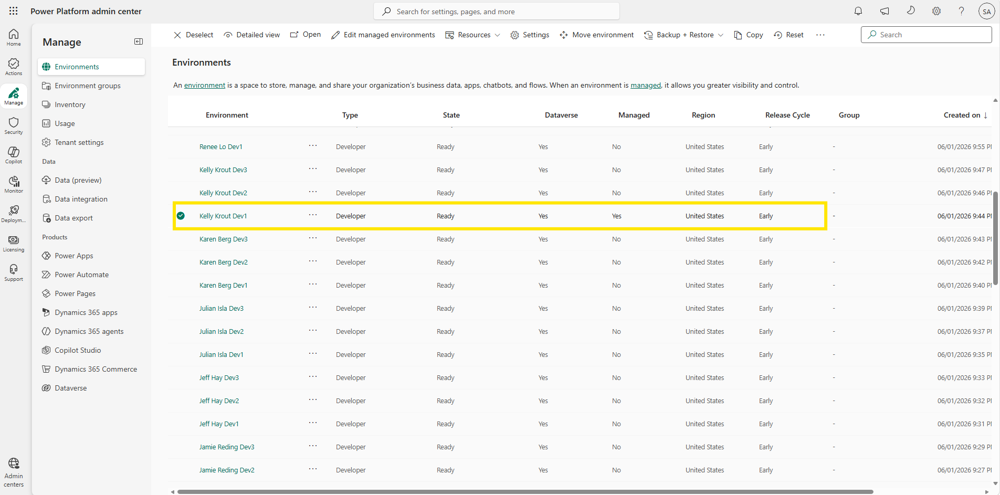
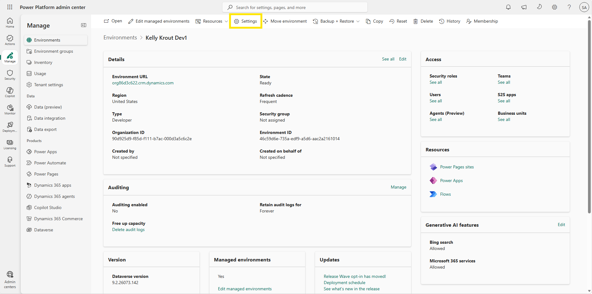
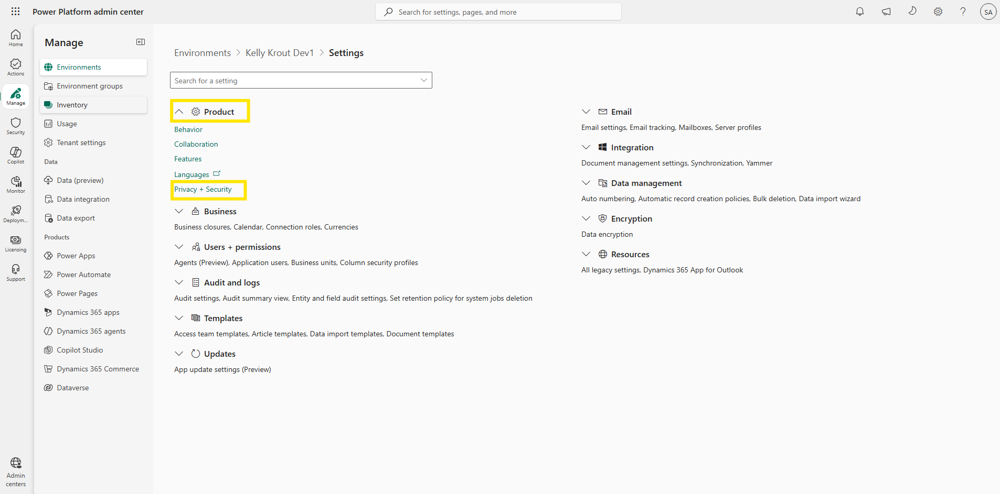
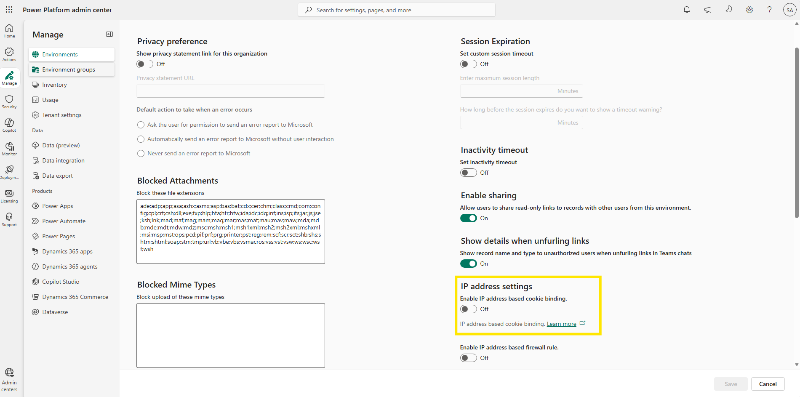
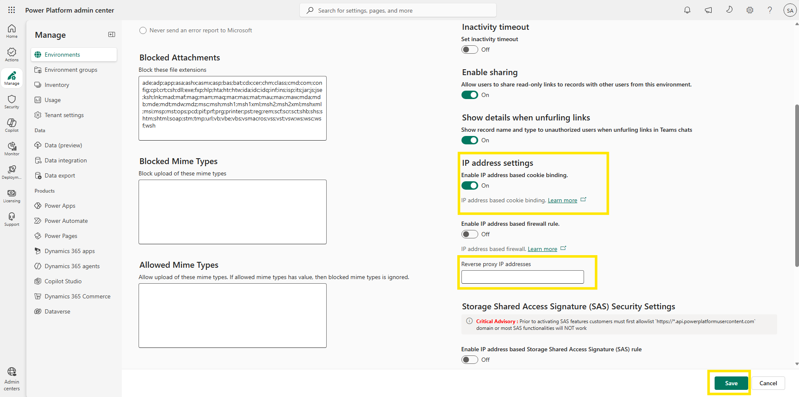

# Enable IP cookie binding

With the mechanics clear, enabling the protection comes down to a single switch — but it's worth knowing exactly where that switch lives and what changes on the page when you flip it. In this lab, you turn on IP address-based cookie binding for a managed environment from the Power Platform admin center, and verify that the configuration was applied. For Woodgrove Bank, this is the moment the session-layer finding is closed: from here on, a stolen cookie replayed from another machine is rejected the instant it arrives.

> ⚠️ IP address-based cookie binding is a **Managed Environments** feature. If the environment does not have Managed Environment enabled, the switch cannot be turned on.

## Step 1: Open the environment

Cookie binding is configured per environment, not per tenant — so the first step is choosing which environment to protect. In a production rollout, you would start with the environments holding your most sensitive data, exactly as Woodgrove Bank starts with the sales environment.

1. Sign in to the [Power Platform admin center](https://admin.powerplatform.microsoft.com/) using your lab environment administrator credentials.
2. Select **Environments**.
3. Open the environment that has **Managed Environment** enabled.

  
Figure: Open the managed environment you want to protect.

## Step 2: Open Privacy + security settings

Each environment has its own settings hub, and the security controls live under the Product group. If you completed the IP firewall module, this path will feel familiar — both features are managed from the same page.

1. In the environment, select **Settings** in the command bar.

     
   Figure: Open the environment's settings.

2. Expand **Product**, then select **Privacy + security**.

     
   Figure: Privacy + security sits within the Product group.

## Step 3: Locate the IP address settings

1. On the **Privacy + security** page, scroll to the **IP address settings** section. Cookie binding shares this section with the IP address based firewall rule — the two controls complement each other, protecting the network boundary and the session respectively.
2. Find the switch labeled **Enable IP address based cookie binding**. At this point it is still set to **Off**.

  
Figure: Locate the Enable IP address based cookie binding switch.

## Step 4: Turn on the switch and save

1. Turn on **Enable IP address based cookie binding**.
2. Notice that a new field, **Reverse proxy IP addresses**, appears below the switch — it is only shown once the toggle is on, so don't be surprised that you didn't see it earlier. This field matters if your organization routes traffic through a reverse proxy: in that setup, Dataverse sees the proxy's IP address instead of each user's, so the IP check would otherwise reject legitimate users. Entering the proxy addresses here tells Dataverse to look past the proxy when evaluating the session. If your network doesn't use a reverse proxy — as in most lab tenants — leave the field empty. To learn more, see [Safeguarding Dataverse sessions with IP cookie binding](https://learn.microsoft.com/en-us/power-platform/admin/block-cookie-replay-attack).
3. Select **Save** to apply the IP address based cookie policy to the environment.

  
Figure: Turn on the switch, review the reverse proxy field, and save.

4. After saving, the **Save** button becomes greyed out. This is the confirmation you're looking for — there are no unsaved changes left, and the policy is now active on the environment.

> 💡 You can turn the feature off again the same way, using the same switch. The reverse proxy setting applies to both IP cookie binding and the IP firewall, so if you configure it here, it also covers the firewall rule from the previous module.

> 💡 **Configuring at scale:** like the IP firewall, cookie binding can also be applied to an entire environment group. In the Power Platform admin center, go to **Manage** > **Environment groups**, open your group, and add the **Enable IP Cookie Binding** rule on the **Rules** tab — every environment in the group is then protected at once. For creating and managing environment groups, see the environment groups labs in the [Environment Strategy and Managed Governance module](../../managed-governance/environment-strategy-and-governance/README.md).

> 📝 Because the session is bound to an IP address, users are asked to reauthenticate whenever their IP changes mid-session — for example, when a VPN client is turned on or off, when connecting to a wireless hotspot, when the internet connection is reset by the provider, or when a router is restarted. Communicate this to users on dynamic connections before enabling the feature broadly.

## Step 5: Validate the configuration

Use the checklist below to confirm that Woodgrove Bank's session-layer requirement is fully met:

1. The environment has **Managed Environment** enabled.
2. **Enable IP address based cookie binding** is set to **On** under **Settings** > **Product** > **Privacy + security**.
3. The **Save** button is greyed out after saving, confirming the policy was applied with no pending changes.
4. You can explain the enforcement logic: a request is served only when both the cookie and the IP address match the values from where the cookie was originally created.
5. You know what a failed check produces: the request is rejected, no data is returned, and an alert is raised for the administrator.

> ✅ IP cookie binding is active. A stolen cookie replayed from another machine will now be rejected in real time.

> 🥳 Congratulations! You completed the IP cookie binding module — and with it, Woodgrove Bank's managed-security series. The sales environment is now encrypted with the bank's own key, reachable only from trusted IP ranges, and protected against session hijacking through cookie replay.

## Further reading

- [Safeguarding Dataverse sessions with IP cookie binding](https://learn.microsoft.com/en-us/power-platform/admin/block-cookie-replay-attack)
- [Managed Environments overview](https://learn.microsoft.com/en-us/power-platform/admin/managed-environment-overview)
- [IP firewall in Power Platform environments](https://learn.microsoft.com/en-us/power-platform/admin/ip-firewall)
- [Manage your customer-managed encryption key](https://learn.microsoft.com/en-us/power-platform/admin/customer-managed-key)
