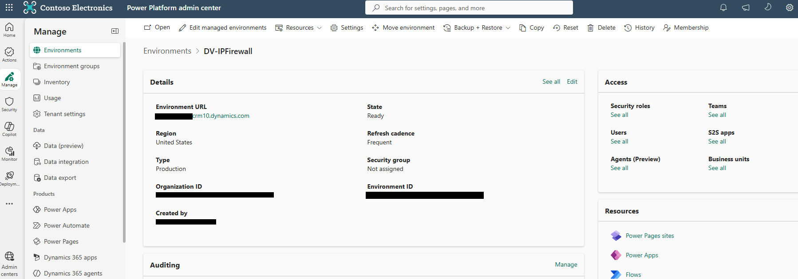
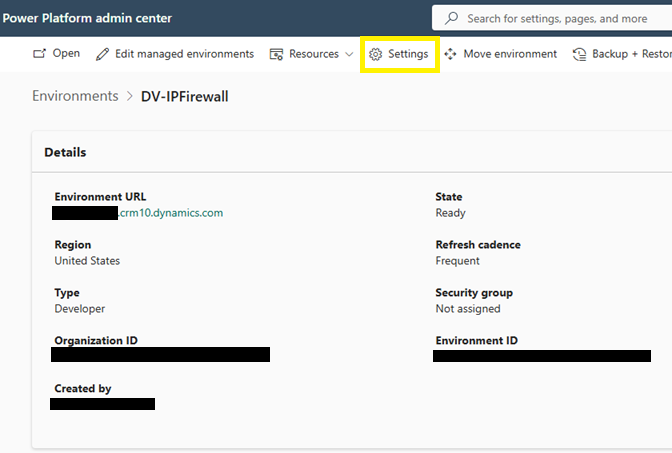
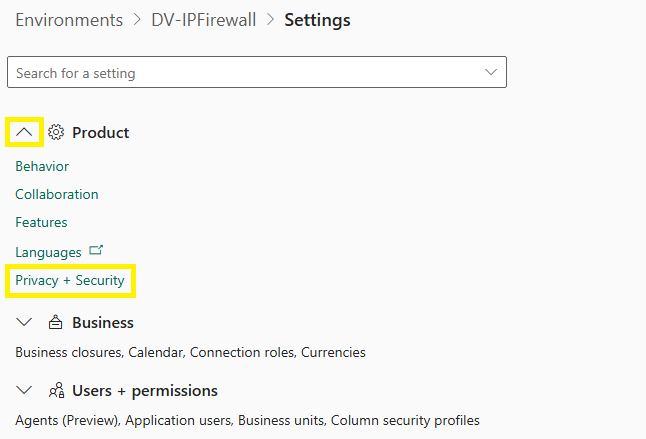
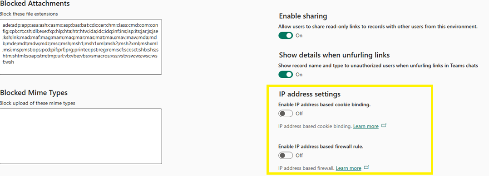
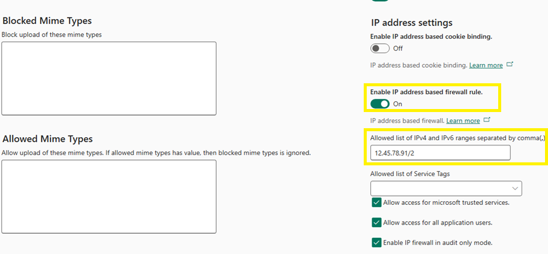
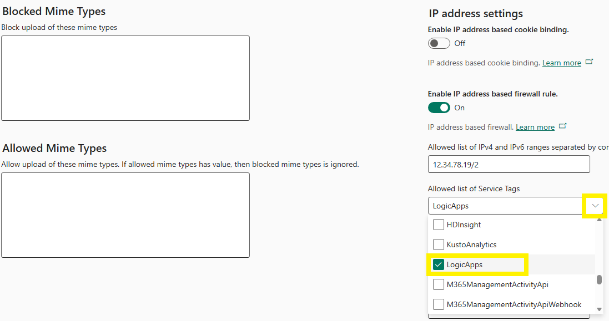
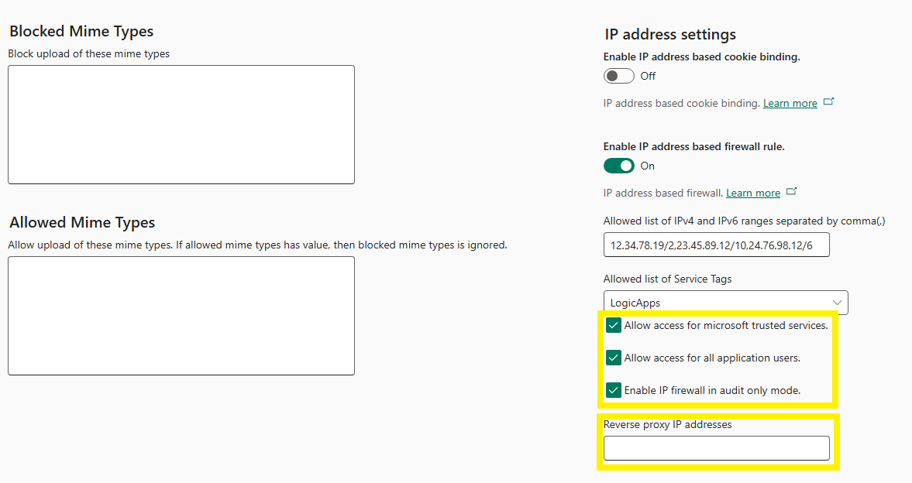
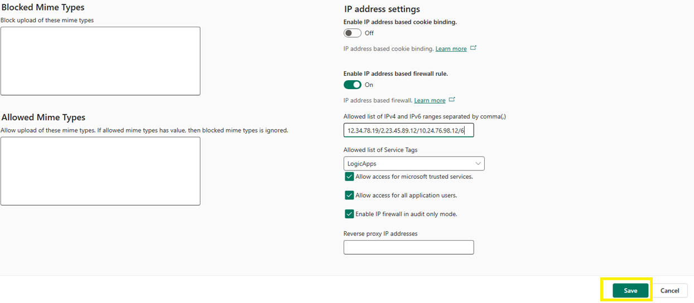

# Configure the IP firewall

In this lab, you enable and configure the IP firewall for your environment from the Power Platform admin center. For Woodgrove Bank, this is the step that draws the network boundary around the sales environment: once you save the configuration, only requests that originate from the bank's allow-listed IP ranges — its corporate network and VPN — can reach the Dataverse data, regardless of whether the sign-in credentials are valid.

> ⚠️ Before you save new firewall settings, confirm that the IP range you are working from is included in the allowed list, or you will lock yourself out of the environment. In a production tenant, enable **audit only mode** first to observe the impact before you enforce the rule.

## Step 1: Open your environment

1. Sign in to the [Power Platform admin center](https://admin.powerplatform.microsoft.com/) as an **Environment Admin**.  
2. Open the environment you want to protect. The overview shows the environment's details, including its **Environment URL**.

  
Figure: The environment overview in the Power Platform admin center.

> 📝 Note the **Environment URL** — you will use it in the next lab to verify the firewall from a non-allowed network.

## Step 2: Open Privacy + security settings

1. Select **Settings**.  
2. Expand **Product**.  
3. Select **Privacy + security**.  
4. Scroll to the **IP address settings** section.

  
  
  
Figure: The IP address settings are on the Privacy + security page.

## Step 3: Enable the firewall rule and enter allowed IP ranges

1. Under **IP address settings**, set **Enable IP address based firewall rule** to **On**.  
2. In **Allowed list of IPv4 or IPv6 ranges**, enter the ranges you want to allow, in CIDR format, separated by commas.

  
Figure: Turn on the firewall rule and enter the allowed IP ranges.

> 💡 Enter each range in CIDR notation, for example `<ipv4-address>/<prefix>` or `<ipv6-address>/<prefix>`, and separate multiple ranges with commas. For Woodgrove Bank, these are the egress ranges of the corporate network and VPN.

> 💡 Use a `/32` prefix for a single IPv4 address (`<ipv4-address>/32`) and a `/128` prefix for a single IPv6 address (`<ipv6-address>/128`) when you want to allow one exact address instead of a range.

> 💡 If your internet connection has both IPv4 and IPv6 public IP addresses, make sure to add both to the allowed list, separated by a comma. Example: `12.46.89.10/32,2a02:****:****:****:****:****:****:2f39/128`.

## Step 4: Select the allowed service tags

1. Open the **Allowed list of service tags** drop-down.  
2. Select the service tags you want to allow. This lab selects `LogicApps` as an example.

  
Figure: Selected service tags bypass the IP firewall restrictions.

> 📝 Service tags that you select in this list bypass the IP firewall restrictions. Select only the tags for Azure services that genuinely need to reach the environment — for example, Logic Apps integrations that run outside your corporate IP ranges.

## Step 5: Set access options and reverse proxy IP addresses

1. Review the access options in the panel and set each one for your scenario:  
   1.1. **Allow access for Microsoft trusted services** — allow Microsoft services that operate outside your IP ranges to reach the environment.  
   1.2. **Allow access for all application users** — allow application (non-interactive) users to bypass the firewall.  
   1.3. **Enable IP firewall in audit only mode** — log requests that would be blocked, without blocking them.  
2. If your network uses a reverse proxy, enter its addresses in **Reverse proxy IP addresses**.

  
Figure: Review the access options and enter reverse proxy addresses if applicable.

> 💡 **Audit only mode** logs requests that would have been blocked without actually blocking them. Use it to validate your allowed ranges against real traffic before you enforce the firewall in production.

## Step 6: Save the configuration

1. Select **Save**.  
2. Confirm that the IP firewall is now configured on the environment.

  
Figure: Save to apply the IP firewall configuration to the environment.

> ✅ The IP firewall is active. Requests to this environment are now evaluated against the allowed list in real time.

> 💡 **Configuring at scale:** you can also apply the IP firewall to an entire environment group instead of one environment at a time. In the Power Platform admin center, go to **Manage** > **Environment groups**, open your group, and add the **IP Firewall** rule on the **Rules** tab — the allowed IP ranges and advanced options you save there apply to all environments in the group. For creating and managing environment groups, see the environment groups labs in the [Environment Strategy and Managed Governance module](../../managed-governance/environment-strategy-and-governance/README.md).

## Next lab

Continue with [Verify the end-user experience](02-verify-end-user-experience.md) to confirm the firewall blocks access from a non-allowed IP range.
