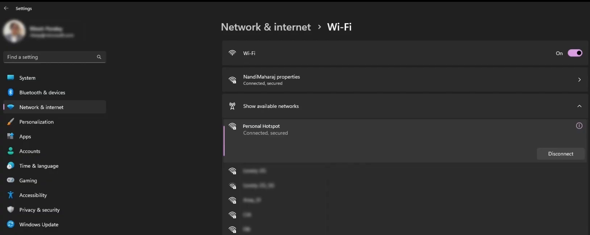
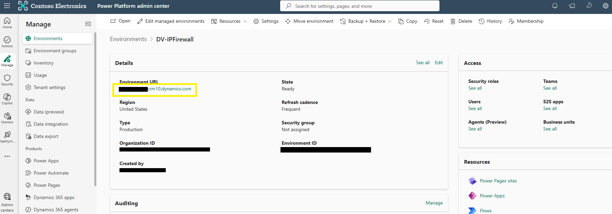
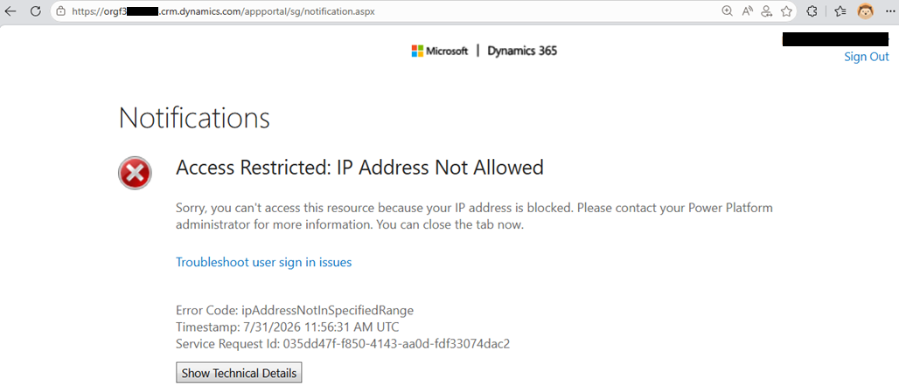

# Verify the end-user experience

With the firewall configured, verify that access is denied from an IP range that is not in the allowed list. This confirms that IP firewall is enforcing the restriction in real time — exactly the evidence Woodgrove Bank's risk team needs to close the finding: valid credentials from an untrusted network are no longer enough to reach the sales data.

## Step 1: Connect from a different IP range

1. To simulate an IP range that is not allowed, connect your device to a different network. This lab connects to a phone's internet connection.  
2. This IP range is not in the allowed list, so it should not have access to the Power Platform environment.

  
Figure: Switch to a different network, such as a mobile connection, to test from a non-allowed IP range.

> 💡 A mobile hotspot is the quickest way to get an IP address outside your corporate ranges. Any separate network that is not in the allowed list works.

## Step 2: Open the environment URL

1. On the environment page, select the **Environment URL** link to open the environment (for example, `<your-environment>.crm<#>.dynamics.com`).

  
Figure: Open the environment from the Environment URL link.

## Step 3: Confirm the request is blocked

1. Because your current IP range is not in the allowed list, the request is rejected and the environment does not load.  
2. Confirm the blocked-access message, either in the JSON or in the screenshot below:

   ```json
   {"error":{"code":"0x80095ffe","message":"The request you are trying to make is rejected as access to your ip is blocked. Contact your administrator for more information."}}
   ```

  
Figure: Access is denied for the non-allowed IP range.

> ✅ IP firewall evaluated the client's IP address in real time and enforced the restriction at the network layer — protecting against unauthorized access and mitigating the data exfiltration risk.

## Step 4: Validate the configuration

Use the checklist below to confirm that Woodgrove Bank's network boundary requirement is fully met:

1. **Enable IP address based firewall rule** is set to **On** for the environment.  
2. The allowed IPv4 or IPv6 ranges are entered in CIDR format.  
3. The intended service tags are selected to bypass the firewall.  
4. Access from an allowed IP range succeeds.  
5. Access from a non-allowed IP range is blocked — either with error code `0x80095ffe` or by an access-denied page.

> 📝 Remember: IP firewall evaluates the client IP in real time, works at the network layer, and is available only for environments activated as Managed Environments. Selected service tags bypass the restrictions, and you must save your changes for the configuration to take effect.

> 🥳 Congratulations! You completed the IP firewall in Dataverse module. You restricted a Dataverse environment to allow-listed IP ranges and verified that requests from outside those ranges are blocked in real time.

## Further reading

- [IP firewall in Power Platform environments](https://learn.microsoft.com/en-us/power-platform/admin/ip-firewall)
- [Managed Environments overview](https://learn.microsoft.com/en-us/power-platform/admin/managed-environment-overview)
- [Azure service tags overview](https://learn.microsoft.com/en-us/azure/virtual-network/service-tags-overview)
