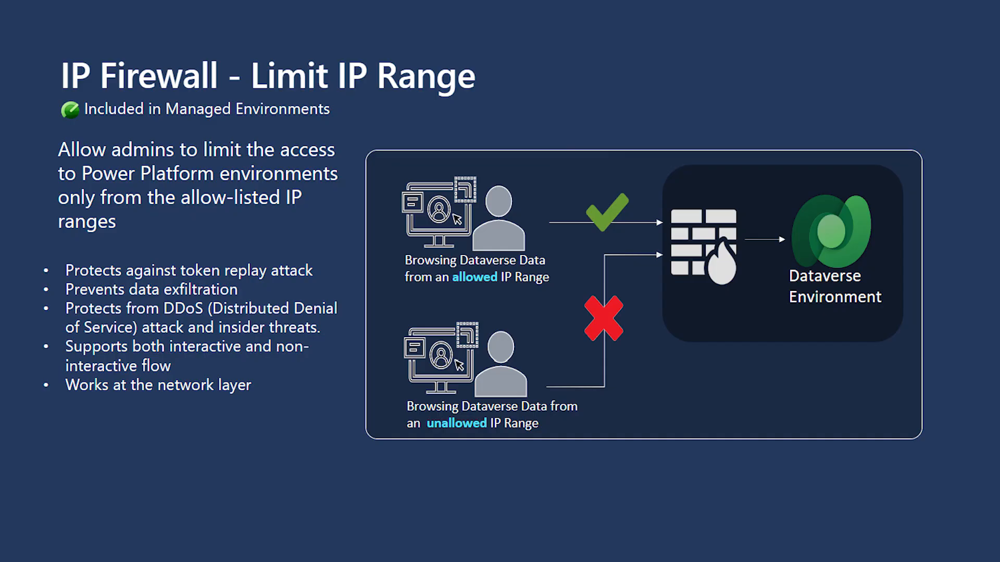

# IP firewall in Dataverse

Built by: Power CAT

This module walks you through restricting access to a Dataverse environment with IP firewall — so the environment can be reached only from an allow-listed set of IP ranges, evaluated in real time at the network layer.

## Labs in this module

| Lab | Description |
|-----|-------------|
| [Configure the IP firewall](01-configure-ip-firewall.md) | Enable the firewall rule, enter allowed IP ranges, and set service tags and access options |
| [Verify the end-user experience](02-verify-end-user-experience.md) | Confirm that access from a non-allowed IP range is blocked |

## Prerequisites

1. You have **Environment Admin** access to the environment in the [Power Platform admin center](https://admin.powerplatform.microsoft.com/).  
2. You have a Power Platform environment with **Dataverse** that is activated as a **Managed Environment** — the IP firewall setting can only be turned on for managed environments. Managed Environments are included as an entitlement in standalone premium Power Platform and Dynamics 365 licenses; see the [Managed Environments overview](https://learn.microsoft.com/en-us/power-platform/admin/managed-environment-overview) for details on activation and licensing.  
3. You have the list of IP ranges you want to allow, in IPv4 or IPv6 **CIDR** format.  
4. You have a way to test from an IP address outside the allowed list — for example, a separate network or a mobile (phone) connection.

> ⚠️ Be careful not to lock yourself out: make sure the IP range you are currently working from is included in the allowed list before you save the configuration. Consider starting with **audit only mode** in a production tenant.

## Business use case

In the [Customer-managed keys (CMK)](../cmk/README.md) module, Woodgrove Bank took ownership of the encryption keys protecting its sales environment. Encryption at rest, however, only addresses one layer of the bank's security review. The next finding concerns *where* the data can be accessed from.

> 💡 The CMK module is part of the same storyline, but it is not a prerequisite — this module stands alone, and you can complete it without any other module in the series.

The bank's sales environment holds personally identifiable information (PII) about customers. Today, any employee with valid credentials can open it from any network — a home connection, a coffee shop, a personal hotspot. The risk team flags three exposure paths that credentials alone don't close:

- **Data exfiltration.** A user (or an attacker with a compromised account) could bulk-export customer data from an unmanaged network outside the bank's monitoring perimeter.
- **Token replay attacks.** A stolen access token could be replayed from anywhere in the world, bypassing the sign-in controls entirely.
- **Insider threats.** Sensitive data should only be reachable from the bank's trusted network boundaries, where access is logged and inspected.

The requirement: Dataverse environments holding PII must be reachable only from the bank's approved corporate IP ranges — enforced in real time, at the network layer, not just at sign-in. This mirrors how organizations in regulated industries actually use the feature; for example, a large global property and casualty insurance provider enabled IP firewall on a Dataverse environment holding PII to meet or exceed their data, governance, and security requirements, ensuring no one could access the data without proper authority and approvals.

In this module, you play the role of a Woodgrove Bank environment administrator enabling IP firewall on the sales environment, and then verifying — from an outside network — that the door really is closed.

### How it works

IP firewall evaluates the client's IP range in real time and denies access to Dataverse data from restricted IP ranges. A user browsing Dataverse data from an allowed IP range can access it, while the same user attempting to reach the same data from a non-allowed IP range cannot. It works at the network layer, supports both interactive and non-interactive flows, and is available only for environments activated as Managed Environments.

  
Figure: IP firewall limits access to a Dataverse environment to allow-listed IP ranges.

### What you learn

By the end of this module, you can:

- Locate the IP address settings in an environment's Privacy + security page.
- Enable the IP address-based firewall rule and enter allowed IP ranges in CIDR format.
- Select service tags that bypass the firewall and configure access options, including audit only mode.
- Configure reverse proxy IP addresses where applicable.
- Verify enforcement by testing access from a non-allowed IP range.

> 🥳 Ready to get started? Go through the labs table above in order because the verification lab builds on the configuration lab.
